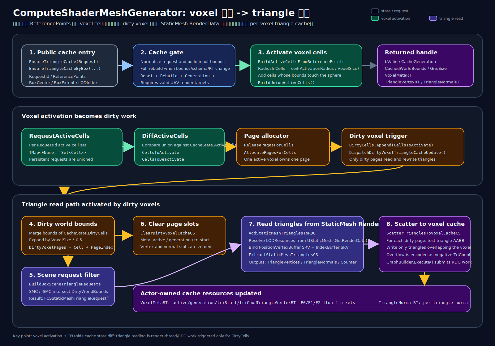

# ComputeShaderMeshGenerator：Voxel 激活与三角形缓存设计



> 当前实现状态：第一版 C++ 骨架已落地，包含 `AComputeShaderMeshGenerator`、统一入口 `EnsureTriangleCache/EnsureTriangleCacheByBox`、Actor-owned transient RT cache、request active voxel 并集、增量 diff 与 page allocator。GPU scatter 写入真实三角形缓存仍是后续任务。

## 1. 目标

新增一个通用 Actor 基类，计划放在：

- `Plugins/PCGPlugins/Source/ComputeShaderGenerator/Public/ComputeShaderMeshGenerator.h`
- `Plugins/PCGPlugins/Source/ComputeShaderGenerator/Private/ComputeShaderMeshGenerator.cpp`

建议类名：

```cpp
AComputeShaderMeshGenerator
```

它负责维护一个和 Actor 生命周期绑定的 **Box 范围 / Voxel Grid / Triangle Cache**。后续藤蔓生成 Actor 可以继承它，复用场景三角形查询、局部 voxel 激活、增量缓存更新逻辑。

核心需求：

1. Actor 自带一个 `UBoxComponent`，作为生成和缓存范围。
2. 将 Box 内空间切分为多个 voxel cell。
3. 输入一组参考点 `ReferencePoints`，只激活参考点附近的 voxel。
4. 被激活 voxel 后续需要缓存场景三角形数据。
5. 缓存资源需要像 `UTextureRenderTarget2D` 一样由 Actor 持有，Actor 销毁时资源自动销毁或显式释放。
6. 后续输入新的参考点集时，只对 voxel 激活集合做增量更新。
7. 每次逻辑开始时，先检查当前 `BoundBox` 和输入的 `BoundBox` 是否一致；如果不一致，则全量重建缓存。
8. Actor 内所有“需要读取场景三角形”的逻辑都必须走同一个通用入口，入口内稳定触发 bounds / schema / resource / generation / active voxel diff 检查，避免不同逻辑各自调用导致缓存状态不一致。

---

## 2. 非目标

第一阶段不做以下内容：

1. 不实现完整 GPU 三角形写入 shader。
2. 不设计最终藤蔓生长算法。
3. 不做 CPU blocking readback。
4. 不把缓存做成持久化资产。
5. 不追求全局唯一缓存；缓存只属于当前 Actor 实例。

第一阶段目标是先确定类职责、数据结构、生命周期和增量更新流程。

---

## 3. 推荐继承关系

当前藤蔓 Actor 相关类大致是：

```cpp
AConvertFoliageInstanceContainer : public ADynamicMeshActor
AVineContainer : public AConvertFoliageInstanceContainer
```

为了不破坏现有藤蔓的 foliage container 能力，推荐改成：

```cpp
AComputeShaderMeshGenerator : public ADynamicMeshActor
AConvertFoliageInstanceContainer : public AComputeShaderMeshGenerator
AVineContainer : public AConvertFoliageInstanceContainer
```

也就是让 `AVineContainer` **间接继承** `AComputeShaderMeshGenerator`。

这样做的好处：

- `AComputeShaderMeshGenerator` 仍然是通用 ComputeShader mesh generator，不需要依赖 Foliage 模块。
- `AConvertFoliageInstanceContainer` 保留原本 foliage instance 功能。
- `AVineContainer` 不需要同时继承两个 UObject 类，避免 Unreal 不支持多 UCLASS 继承的问题。

如果强制让 `AVineContainer` 直接继承 `AComputeShaderMeshGenerator`，就需要把 `AConvertFoliageInstanceContainer` 的能力迁移或组合进来，改动会更大。

---

## 4. Actor 组件设计

`AComputeShaderMeshGenerator` 需要至少包含：

```cpp
UPROPERTY(VisibleAnywhere, BlueprintReadOnly, Category="CS Mesh Generator")
TObjectPtr<UBoxComponent> GeneratorBounds;
```

建议构造函数中：

```cpp
GeneratorBounds = CreateDefaultSubobject<UBoxComponent>(TEXT("GeneratorBounds"));
SetRootComponent(GeneratorBounds);
GeneratorBounds->SetCollisionEnabled(ECollisionEnabled::QueryOnly);
GeneratorBounds->SetCollisionObjectType(ECC_WorldDynamic);
GeneratorBounds->SetCollisionResponseToAllChannels(ECR_Overlap);
```

如果子类已经有 root component，则可以选择：

```cpp
GeneratorBounds->SetupAttachment(GetRootComponent());
```

但为了通用性，推荐 `AComputeShaderMeshGenerator` 自己以 `GeneratorBounds` 作为 root，子类组件挂到它下面。

---

## 5. Voxel Grid 设置

已新增配置结构：

```cpp
USTRUCT(BlueprintType)
struct FCSMeshGeneratorVoxelGridSettings
{
    GENERATED_BODY()

    UPROPERTY(EditAnywhere, BlueprintReadWrite, Category="Voxel")
    float VoxelSize = 100.0f;

    UPROPERTY(EditAnywhere, BlueprintReadWrite, Category="Voxel")
    float ActivationRadius = 200.0f;

    UPROPERTY(EditAnywhere, BlueprintReadWrite, Category="Voxel")
    int32 MaxActiveVoxels = 4096;

    UPROPERTY(EditAnywhere, BlueprintReadWrite, Category="Triangle Cache")
    int32 MaxTrianglesPerVoxel = 256;

    UPROPERTY(EditAnywhere, BlueprintReadWrite, Category="Triangle Cache")
    int32 LODIndex = 0;

    UPROPERTY(EditAnywhere, BlueprintReadWrite, Category="Triangle Cache")
    float BoundsTolerance = 1.0f;

    UPROPERTY(EditAnywhere, BlueprintReadWrite, Category="Triangle Cache")
    int32 MaxCacheTextureDimension = 4096;
};
```

含义：

- `VoxelSize`：Box 内 voxel cell 尺寸。
- `ActivationRadius`：参考点激活 voxel 的半径。
- `MaxActiveVoxels`：最多允许激活 voxel 数。
- `MaxTrianglesPerVoxel`：每个激活 voxel 的三角形缓存容量。
- `LODIndex`：采集 StaticMesh 三角形时使用的 LOD。
- `BoundsTolerance`：判断输入 bounds 是否变化时的容差。
- `MaxCacheTextureDimension`：RT atlas 单边最大尺寸，用于控制 Actor-owned cache 纹理大小。

---

## 6. Voxel 坐标和索引

Box 使用 world bounds：

```cpp
FBox CacheWorldBounds;
FVector Origin = CacheWorldBounds.Min;
FIntVector GridSize;
```

Grid size：

```cpp
GridSize.X = CeilToInt(BoundsSize.X / VoxelSize);
GridSize.Y = CeilToInt(BoundsSize.Y / VoxelSize);
GridSize.Z = CeilToInt(BoundsSize.Z / VoxelSize);
```

World position 转 cell：

```cpp
FIntVector Cell = FloorToInt((WorldPos - Origin) / VoxelSize);
Cell = Clamp(Cell, FIntVector::ZeroValue, GridSize - FIntVector(1,1,1));
```

Cell 转 linear index：

```cpp
int32 LinearIndex = Cell.X + Cell.Y * GridSize.X + Cell.Z * GridSize.X * GridSize.Y;
```

---

## 7. 缓存状态设计

建议 Actor 内维护一个 runtime cache state：

```cpp
USTRUCT()
struct FCSMeshGeneratorVoxelCacheState
{
    GENERATED_BODY()

    FBox CachedWorldBounds = FBox(ForceInit);
    FIntVector GridSize = FIntVector::ZeroValue;
    float CachedVoxelSize = 0.0f;

    // 当前激活 voxel。
    TSet<FIntVector> ActiveCells;

    // 本次新增激活 voxel。
    TSet<FIntVector> CellsToActivate;

    // 本次失活 voxel。
    TSet<FIntVector> CellsToDeactivate;

    // 本次需要重新写 triangle cache 的 voxel。
    TSet<FIntVector> DirtyCells;

    // 每次全量重建时递增，用于 GPU/RT 中过滤陈旧数据。
    uint32 CacheGeneration = 0;
};
```

注意：`FIntVector` 默认是否可直接用于 `TSet` 取决于 UE 版本和 hash 支持。如果不稳定，可以定义自己的 key：

```cpp
USTRUCT(BlueprintType)
struct FCSMeshGeneratorVoxelKey
{
    GENERATED_BODY()

    UPROPERTY() int32 X = 0;
    UPROPERTY() int32 Y = 0;
    UPROPERTY() int32 Z = 0;
};
```

并实现 `GetTypeHash`。

---

## 8. Triangle Cache 资源设计

用户需求是“三角形缓存到类似 render target 中，这样 actor 销毁时它也会销毁”。

推荐第一版使用 Actor 持有的 UObject 资源：

```cpp
UPROPERTY(Transient)
TObjectPtr<UTextureRenderTarget2D> VoxelMetaRT;

UPROPERTY(Transient)
TObjectPtr<UTextureRenderTarget2D> TriangleVertexRT;

UPROPERTY(Transient)
TObjectPtr<UTextureRenderTarget2D> TriangleNormalRT;
```

这些资源由 Actor 创建并持有：

```cpp
VoxelMetaRT = NewObject<UTextureRenderTarget2D>(this, TEXT("VoxelMetaRT"));
TriangleVertexRT = NewObject<UTextureRenderTarget2D>(this, TEXT("TriangleVertexRT"));
TriangleNormalRT = NewObject<UTextureRenderTarget2D>(this, TEXT("TriangleNormalRT"));
```

因为 Outer 是 Actor，并且通过 `UPROPERTY(Transient)` 引用，所以：

- Actor 销毁时资源会跟随 GC。
- `EndPlay` / `BeginDestroy` 中也可以主动 `ReleaseResource()`。
- 不会残留成 Content 资产。

### 8.1 VoxelMetaRT

每个 voxel 或每个 active voxel 一条 metadata。

建议 metadata 内容：

| 字段 | 含义 |
|---|---|
| `Active` | 是否激活 |
| `Generation` | cache generation，用于排除旧数据 |
| `TriStart` | triangle atlas 起始 slot |
| `TriCount` | 当前 voxel 写入的 triangle 数 |

如果使用 float RT，可用 `PF_A32B32G32R32F`。
如果需要 uint 精度，后续可以改为 RDG `RWBuffer<uint>` 或 uint texture。

### 8.2 TriangleVertexRT

存 triangle vertex。

固定布局：

```text
每个 triangle 占 3 个 float4 pixel：
TriSlot * 3 + 0 = V0.xyz, 1
TriSlot * 3 + 1 = V1.xyz, 1
TriSlot * 3 + 2 = V2.xyz, 1
```

### 8.3 TriangleNormalRT

存 triangle normal。

两种布局：

1. 每个 triangle 1 个 normal pixel：

```text
TriSlot = Normal.xyz, 0
```

2. 每个 vertex 1 个 normal pixel，和 vertex RT 对齐：

```text
TriSlot * 3 + VertexIndex = Normal.xyz, 0
```

第一版推荐第 1 种，容量更低。

---

## 9. Triangle Cache Atlas 分配策略

为了让增量更新简单，第一版建议使用 **固定 page 分配**：

```text
一个 active voxel = 一个 triangle page
一个 page 容量 = MaxTrianglesPerVoxel
```

则：

```cpp
TriStart = PageIndex * MaxTrianglesPerVoxel;
TriCapacity = MaxTrianglesPerVoxel;
```

好处：

- voxel 失活时只需要释放 page。
- 新 voxel 激活时从 free page list 取一个 page。
- 不需要对 triangle atlas 做 compaction。
- GPU 写入简单：知道 voxel 对应 page 起点即可。

代价：

- 每个 voxel 预留固定容量，可能浪费。
- 单个 voxel 超过 `MaxTrianglesPerVoxel` 时需要截断并标记 overflow。

建议 metadata 里增加 overflow 标记：

```text
Meta.Overflow = TriCount >= MaxTrianglesPerVoxel
```

---

## 10. 更新流程

主入口建议：

```cpp
UFUNCTION(BlueprintCallable, Category="CS Mesh Generator")
void UpdateMeshGeneratorCache(
    const TArray<FVector>& ReferencePoints,
    const FBox& InputWorldBounds,
    bool bForceFullRebuild = false);
```

如果 Blueprint 不方便传 `FBox`，也可以提供：

```cpp
UFUNCTION(BlueprintCallable, Category="CS Mesh Generator")
void UpdateMeshGeneratorCacheByBox(
    const TArray<FVector>& ReferencePoints,
    FVector BoxCenter,
    FVector BoxExtent,
    bool bForceFullRebuild = false);
```

流程：

```text
UpdateMeshGeneratorCache
  1. ResolveInputBounds
  2. CheckBoundsChanged
     - 如果 bounds/grid/voxel size 不一致：FullResetCache
  3. BuildNewActiveCellSet from ReferencePoints
  4. DiffActiveCells
     - CellsToActivate = NewActive - OldActive
     - CellsToDeactivate = OldActive - NewActive
     - KeptCells = NewActive ∩ OldActive
  5. Release pages for CellsToDeactivate
  6. Allocate pages for CellsToActivate
  7. Mark DirtyCells
     - 新激活 cells 一定 dirty
     - 如果输入 bounds 变了，全量 dirty
     - 如果后续 scene actor dirty，也加入 dirty
  8. Dispatch GPU cache update for DirtyCells
  9. ActiveCells = NewActiveCells
```

---

## 11. 通用三角形缓存入口

Actor 内可能会有多个逻辑需要读取场景三角形，例如：

- 藤蔓贴附 / nearest surface 查询。
- 藤蔓生长碰撞或阻挡检测。
- surface voxel / open mesh 调试生成。
- 后续其它 ComputeShader mesh generator pass。

这些逻辑不应该分别直接调用：

```cpp
BuildActorSceneTriangleRequests(...)
AddStaticMeshTrianglesToRDG(...)
```

否则容易出现：

- 某个逻辑忘记检查 bounds 是否变化。
- 某个逻辑绕过 generation 导致读到旧 cache。
- 多个逻辑同一帧重复触发三角形采集。
- 一处重建 cache，另一处还持有旧资源引用。
- active voxel 集合被最后一个调用者覆盖，而不是所有逻辑需求的并集。

因此需要定义一个 **唯一稳定入口**：

```cpp
UFUNCTION(BlueprintCallable, Category="CS Mesh Generator|Triangle Cache")
FCSMeshGeneratorTriangleCacheHandle EnsureTriangleCacheByBox(
    FName RequestId,
    const TArray<FVector>& ReferencePoints,
    FVector BoxCenter,
    FVector BoxExtent,
    bool bForceFullRebuild = false);
```

其中：

- `RequestId` 表示调用者 / 逻辑通道，例如：
  - `VineGrow`
  - `VineSurfaceProject`
  - `DebugSurfaceVoxel`
  - `CollisionProbe`
- `ReferencePoints` 是该逻辑本次需要的参考点。
- `BoxCenter / BoxExtent` 是该逻辑声明的输入 bounds。
- 返回的 `FCSMeshGeneratorTriangleCacheHandle` 只描述当前可用 cache 的 generation、RT、active voxel 信息，不直接暴露可修改内部状态。

### 11.1 Request 描述结构

推荐先定义 request 结构，后续入口可以复用：

```cpp
USTRUCT(BlueprintType)
struct FCSMeshGeneratorTriangleCacheRequest
{
    GENERATED_BODY()

    UPROPERTY(EditAnywhere, BlueprintReadWrite, Category="Triangle Cache")
    FName RequestId = NAME_None;

    UPROPERTY(EditAnywhere, BlueprintReadWrite, Category="Triangle Cache")
    TArray<FVector> ReferencePoints;

    UPROPERTY(EditAnywhere, BlueprintReadWrite, Category="Triangle Cache")
    FVector BoxCenter = FVector::ZeroVector;

    UPROPERTY(EditAnywhere, BlueprintReadWrite, Category="Triangle Cache")
    FVector BoxExtent = FVector::ZeroVector;

    UPROPERTY(EditAnywhere, BlueprintReadWrite, Category="Triangle Cache")
    bool bForceFullRebuild = false;

    // 可选：覆盖默认 ActivationRadius；小于等于 0 时使用 Actor 设置。
    UPROPERTY(EditAnywhere, BlueprintReadWrite, Category="Triangle Cache")
    float ActivationRadiusOverride = 0.0f;

    // 可选：这个 request 是否保持激活。一次性调试请求可设 false。
    UPROPERTY(EditAnywhere, BlueprintReadWrite, Category="Triangle Cache")
    bool bPersistentInterest = true;
};
```

### 11.2 Cache Handle

返回 handle 用于让后续逻辑稳定知道“我读的是哪一代缓存”：

```cpp
USTRUCT(BlueprintType)
struct FCSMeshGeneratorTriangleCacheHandle
{
    GENERATED_BODY()

    UPROPERTY(BlueprintReadOnly, Category="Triangle Cache")
    bool bValid = false;

    UPROPERTY(BlueprintReadOnly, Category="Triangle Cache")
    int32 CacheGeneration = 0;

    UPROPERTY(BlueprintReadOnly, Category="Triangle Cache")
    FBox CachedWorldBounds = FBox(ForceInit);

    UPROPERTY(BlueprintReadOnly, Category="Triangle Cache")
    FIntVector GridSize = FIntVector::ZeroValue;

    UPROPERTY(BlueprintReadOnly, Category="Triangle Cache")
    float VoxelSize = 0.0f;

    UPROPERTY(BlueprintReadOnly, Category="Triangle Cache")
    int32 ActiveVoxelCount = 0;

    UPROPERTY(BlueprintReadOnly, Category="Triangle Cache")
    int32 DirtyVoxelCount = 0;

    UPROPERTY(BlueprintReadOnly, Category="Triangle Cache")
    TObjectPtr<UTextureRenderTarget2D> VoxelMetaRT = nullptr;

    UPROPERTY(BlueprintReadOnly, Category="Triangle Cache")
    TObjectPtr<UTextureRenderTarget2D> TriangleVertexRT = nullptr;

    UPROPERTY(BlueprintReadOnly, Category="Triangle Cache")
    TObjectPtr<UTextureRenderTarget2D> TriangleNormalRT = nullptr;
};
```

后续 GPU pass 或 Blueprint 逻辑必须携带这个 `CacheGeneration`。如果 pass 结束时发现 Actor 当前 generation 已变化，则结果应该丢弃。

### 11.3 多逻辑的 active voxel 合并

如果 Actor 内多个逻辑同时需要三角形 cache，不能简单用最后一次输入的 reference points 覆盖 `ActiveCells`。

推荐维护每个 request 的 interest：

```cpp
TMap<FName, TSet<FIntVector>> RequestActiveCells;
TMap<FName, FCSMeshGeneratorTriangleCacheRequest> LastRequests;
```

最终 Actor 当前激活集应为所有 request 的并集：

```cpp
UnionActiveCells = RequestActiveCells[RequestA]
                 ∪ RequestActiveCells[RequestB]
                 ∪ RequestActiveCells[RequestC];
```

这样：

- `VineGrow` 需要的 voxel 不会被 `DebugSurfaceVoxel` 的调用覆盖掉。
- 某个 request 移除后，只释放没有任何其它 request 需要的 voxel。
- 增量 diff 是对 `UnionActiveCells` 做，而不是对单个 request 做。

### 11.4 统一入口内部强制执行的检查

`EnsureTriangleCache(...)` 内部必须固定执行以下步骤，所有三角形读取逻辑都不能绕开：

```text
EnsureTriangleCache
  1. Normalize request
     - 修正空 RequestId
     - 过滤 NaN reference point
     - snap/expand input bounds

  2. Check schema
     - VoxelSize 是否变化
     - LODIndex 是否变化
     - MaxTrianglesPerVoxel 是否变化
     - RT format/size 是否匹配

  3. Check bounds
     - 输入 bounds 与 CachedWorldBounds 是否兼容
     - 不兼容则 FullResetCache + CacheGeneration++

  4. Check resources
     - VoxelMetaRT / TriangleVertexRT / TriangleNormalRT 是否存在
     - 尺寸/格式不匹配则重建资源

  5. Build request active cells
     - ReferencePoints -> RequestActiveCells[RequestId]

  6. Build union active cells
     - 合并所有 persistent request 的 active cells

  7. Diff union active cells
     - CellsToActivate
     - CellsToDeactivate
     - DirtyCells

  8. Allocate / release triangle pages

  9. Dispatch dirty voxel triangle cache update

 10. Return cache handle
```

这个入口是“检查类逻辑稳定触发”的核心：无论上层是藤蔓、调试、碰撞还是 mesh 生成，只要要读三角形，就一定先经过同一套检查。

### 11.5 不允许外部直接读写内部状态

以下函数建议设为 `protected` 或内部 helper，不暴露给普通调用者：

```cpp
BuildActiveCellsFromReferencePoints(...)
DiffActiveCells(...)
RebuildCacheResources(...)
DispatchDirtyVoxelTriangleCacheUpdate(...)
```

公开 API 只保留：

```cpp
EnsureTriangleCache(...)
EnsureTriangleCacheByBox(...)
ReleaseTriangleCacheRequest(RequestId)
ClearMeshGeneratorCache()
MarkAllActiveVoxelsDirty()
```

这样可以保证检查入口唯一。

### 11.6 一帧多次调用的合并

如果同一帧内多个逻辑都会请求三角形 cache，建议支持两种模式。

#### 立即模式

每次 `EnsureTriangleCache` 都立即更新 cache。

优点：

- 简单。
- Blueprint 调用后马上拿到 handle。

缺点：

- 同一帧多逻辑可能重复 dispatch。

#### 批处理模式

先提交 request，最后统一 flush：

```cpp
UFUNCTION(BlueprintCallable, Category="CS Mesh Generator|Triangle Cache")
void SubmitTriangleCacheRequest(const FCSMeshGeneratorTriangleCacheRequest& Request);

UFUNCTION(BlueprintCallable, Category="CS Mesh Generator|Triangle Cache")
FCSMeshGeneratorTriangleCacheHandle FlushTriangleCacheRequests(bool bForceFullRebuild = false);
```

流程：

```text
Submit request A
Submit request B
Submit request C
Flush once
  -> 合并 active cells
  -> 只 dispatch 一次 dirty update
```

第一阶段可以先实现立即模式；如果发现藤蔓同一帧多 pass 重复触发，再加批处理模式。

---

## 12. Bounds 检查逻辑

逻辑开始必须检查当前 boundbox 和输入 boundbox 是否一致。

推荐比较：

```cpp
bool AreBoundsCompatible(const FBox& A, const FBox& B, float Tolerance)
{
    return FVector::DistSquared(A.GetCenter(), B.GetCenter()) <= Tolerance * Tolerance
        && FVector::DistSquared(A.GetExtent(), B.GetExtent()) <= Tolerance * Tolerance;
}
```

还需要比较：

```cpp
CachedVoxelSize == Settings.VoxelSize
CachedGridSize == NewGridSize
```

只要任意一项不一致：

```cpp
FullResetCache();
CacheGeneration++;
```

全量 reset 要做：

```text
ActiveCells.Empty
CellsToActivate.Empty
CellsToDeactivate.Empty
DirtyCells.Empty
FreePages 重置
RT 清空或重建
CachedWorldBounds = InputWorldBounds
GridSize = NewGridSize
CachedVoxelSize = Settings.VoxelSize
```

---

## 13. 根据参考点激活 voxel

输入 `ReferencePoints` 后，先转换到 cell 坐标。

如果只激活参考点所在 voxel：

```cpp
ActiveCells.Add(WorldToCell(Point));
```

如果按半径激活：

```cpp
int32 RadiusInCells = CeilToInt(ActivationRadius / VoxelSize);
for dz in [-R, R]
for dy in [-R, R]
for dx in [-R, R]
{
    Cell = CenterCell + Offset;
    if Cell inside grid and distance from point to cell bounds <= ActivationRadius:
        ActiveCells.Add(Cell);
}
```

建议用球形距离，而不是简单立方范围，避免激活过多 cell。

---

## 14. GPU 写入 Triangle Cache 的后续方案

后续 GPU pass 可以基于现有函数：

```cpp
UComputeShaderBasicFunction::BuildActorSceneTriangleRequests(...)
UComputeShaderBasicFunction::AddStaticMeshTrianglesToRDG(...)
```

第一版流程可以是：

```text
1. CPU 根据 dirty cells 计算 dirty bounds / reference points
2. CPU 收集 dirty bounds 内的 scene mesh actors
3. BuildActorSceneTriangleRequests
4. AddStaticMeshTrianglesToRDG 得到临时 triangle buffer
5. 新增 shader：ScatterTrianglesToVoxelCacheCS
   - 遍历 scene triangles
   - 判断 triangle 与哪些 dirty voxel overlap
   - 写入该 voxel 的 TriangleVertexRT / TriangleNormalRT page
   - 更新 VoxelMetaRT 的 TriCount / Overflow
```

注意：

- `AddStaticMeshTrianglesToRDG` 输出是 RDG 临时资源。
- 如果后续 cache 是 render target，需要在同一个 `FRDGBuilder` 内将 RDG buffer scatter 到 external RT。
- 不应把 RDG buffer 直接存在 Actor 上，因为 RDG 资源只在 graph 执行期间有效。
- Actor 持有的应是 RT 或 pooled resource wrapper。

---

## 15. RenderTarget vs RDG Buffer

### 方案 A：RenderTarget cache

优点：

- UObject 生命周期简单。
- Blueprint/材质/调试查看方便。
- Actor 销毁自动释放。

缺点：

- triangle list 是变长结构，用 texture 表达不如 buffer 自然。
- uint/atomic 操作和格式选择需要小心。
- 大容量 atlas 可能需要手动 2D 展开。

### 方案 B：Actor-owned pooled buffer cache

使用类似：

```cpp
TRefCountPtr<FRDGPooledBuffer> TriangleVertexBuffer;
TRefCountPtr<FRDGPooledBuffer> TriangleNormalBuffer;
TRefCountPtr<FRDGPooledBuffer> VoxelMetaBuffer;
```

优点：

- 更适合 structured buffer / append / counter。
- GPU compute 操作自然。

缺点：

- 不是 UObject。
- Actor 销毁时必须在 render thread 安全释放。
- Blueprint 调试不方便。

### 当前建议

第一版采用 **RenderTarget-like UObject cache**，满足“Actor 销毁时它也会销毁”的需求。
如果后续性能或容量不足，再替换内部实现为 pooled buffer，但保持外部 API 不变。

---

## 16. 对藤蔓生成的接入点

当前 `UGenerateVines::GenerateVines` 中有类似逻辑：

```cpp
TArray<FVector> BBoxVectors;
FBox Bounds(BBoxVectors);
Bounds = Bounds.ExpandBy(50);
CS_BUILD_ACTOR_SCENE_TRIANGLE_REQUESTS(...)
```

后续应改为：

```cpp
FCSMeshGeneratorTriangleCacheHandle TriangleCacheHandle = Container->EnsureTriangleCacheByBox(
    TEXT("VineGenerate"),
    BBoxVectors,
    Bounds.GetCenter(),
    Bounds.GetExtent(),
    false);
```

然后藤蔓后续 GPU pass 使用：

```cpp
Container->GetVoxelMetaRT();
Container->GetTriangleVertexRT();
Container->GetTriangleNormalRT();
```

或者使用 RDG 注册接口：

```cpp
Container->RegisterTriangleCache(GraphBuilder, OutCacheRDGRefs);
```

这样藤蔓每次输入新的点集时：

- bounds 没变：只更新新增 / 移除的 active voxels。
- bounds 变了：全量清空并重建 cache。
- 已经激活且未 dirty 的 voxel 不重复写 triangle cache。

---

## 17. 当前 Header 实现摘要

当前已新增 `ComputeShaderMeshGenerator.h/.cpp`。Header 中的核心类型和 API 为：

```cpp
FCSMeshGeneratorVoxelKey
FCSMeshGeneratorVoxelGridSettings
FCSMeshGeneratorTriangleCacheRequest
FCSMeshGeneratorTriangleCacheHandle
FCSMeshGeneratorVoxelCacheState

UCLASS(Blueprintable)
class COMPUTESHADERGENERATOR_API AComputeShaderMeshGenerator : public ADynamicMeshActor
{
    GENERATED_BODY()

public:
    TObjectPtr<UBoxComponent> GeneratorBounds;
    FCSMeshGeneratorVoxelGridSettings VoxelGridSettings;

    TObjectPtr<UTextureRenderTarget2D> VoxelMetaRT;
    TObjectPtr<UTextureRenderTarget2D> TriangleVertexRT;
    TObjectPtr<UTextureRenderTarget2D> TriangleNormalRT;

    FCSMeshGeneratorTriangleCacheHandle EnsureTriangleCache(
        const FCSMeshGeneratorTriangleCacheRequest& Request);

    FCSMeshGeneratorTriangleCacheHandle EnsureTriangleCacheByBox(
        FName RequestId,
        const TArray<FVector>& ReferencePoints,
        FVector BoxCenter,
        FVector BoxExtent,
        bool bForceFullRebuild = false);

    void UpdateMeshGeneratorCacheByBox(
        const TArray<FVector>& ReferencePoints,
        FVector BoxCenter,
        FVector BoxExtent,
        bool bForceFullRebuild = false);

    void ReleaseTriangleCacheRequest(FName RequestId);
    void ClearMeshGeneratorCache();
    void MarkAllActiveVoxelsDirty();

    FCSMeshGeneratorTriangleCacheHandle GetTriangleCacheHandle() const;
    FBox GetCachedWorldBounds() const;
};
```

内部 protected/helper 负责：

- `DoesInputRequireFullRebuild`
- `RebuildCacheResources`
- `BuildActiveCellsFromReferencePoints`
- `BuildUnionActiveCells`
- `DiffActiveCells`
- `AllocatePagesForCells`
- `ReleasePagesForCells`
- `DispatchDirtyVoxelTriangleCacheUpdate`
- `ResetCacheRuntime`
- `RebuildRequestActiveCellsFromLastRequests`

其中 `DispatchDirtyVoxelTriangleCacheUpdate` 目前是 GPU scatter pass 的占位入口。

---

## 18. 增量更新伪代码

```cpp
void AComputeShaderMeshGenerator::UpdateMeshGeneratorCacheByBox(
    const TArray<FVector>& ReferencePoints,
    FVector BoxCenter,
    FVector BoxExtent,
    bool bForceFullRebuild)
{
    FBox InputBounds(BoxCenter - BoxExtent, BoxCenter + BoxExtent);

    if (bForceFullRebuild || DoesInputRequireFullRebuild(InputBounds))
    {
        ClearMeshGeneratorCache();
        RebuildCacheResources(InputBounds);
        CacheState.CacheGeneration++;
    }

    TSet<FIntVector> NewActiveCells;
    BuildActiveCellsFromReferencePoints(ReferencePoints, NewActiveCells);

    DiffActiveCells(NewActiveCells);

    // deactivate
    ReleasePages(CacheState.CellsToDeactivate);

    // activate
    AllocatePages(CacheState.CellsToActivate);
    CacheState.DirtyCells.Append(CacheState.CellsToActivate);

    DispatchDirtyVoxelTriangleCacheUpdate();

    CacheState.ActiveCells = MoveTemp(NewActiveCells);
}
```

---

## 19. 风险点

1. **RT 精度问题**
   - 如果用 float RT 存 `TriStart` / `TriCount`，大数精度需要注意。
   - 大容量建议使用 uint buffer 或 uint texture。

2. **单 voxel 三角形溢出**
   - 必须有 overflow 标记。
   - 后续藤蔓采样时可选择忽略 overflow voxel 或降低 voxel size / 增大 page。

3. **Bounds 频繁变化导致全量重建**
   - 输入 bounds 最好做 expand/snap。
   - 可将 bounds 对齐到 voxel size，避免微小浮点变化触发重建。

4. **Actor 销毁与 render thread 资源释放**
   - UObject RT 通常安全。
   - 如果后续改用 pooled buffer，必须 render thread 安全释放。

5. **编辑器模式下 Undo/Redo**
   - Runtime cache 应标记 `Transient`。
   - 不进入事务系统。

6. **增量更新不是场景变更检测**
   - 第一版只根据参考点变化更新。
   - 如果场景 mesh 发生移动/修改，需要手动 `bForceFullRebuild=true` 或提供 `MarkAllActiveVoxelsDirty()`。

---

## 20. 第一阶段实施顺序

1. 新增本 md。
2. 新增 `ComputeShaderMeshGenerator.h/.cpp`。
3. 实现 `AComputeShaderMeshGenerator` 基础组件和配置。
4. 实现 bounds 检查、grid 计算、reference points -> active cells。
5. 实现 active cells diff 和 page allocator。
6. 创建 Actor-owned RT cache，但先只清空和写 metadata debug。
7. 修改继承链：

```cpp
AComputeShaderMeshGenerator : public ADynamicMeshActor
AConvertFoliageInstanceContainer : public AComputeShaderMeshGenerator
AVineContainer : public AConvertFoliageInstanceContainer
```

8. 将藤蔓生成中的 bounds/reference points 逻辑接入 `EnsureTriangleCacheByBox(TEXT("VineGenerate"), ...)`。
9. 后续再补 GPU scatter triangle cache pass。

---

## 21. 简短结论

这个基类应该负责：

```text
BoxComponent bounds
  -> voxel grid
  -> reference point activation
  -> active voxel diff
  -> actor-owned triangle cache resources
  -> incremental dirty update
```

藤蔓生成 Actor 只需要提供参考点集和 bounds，不再自己重复做场景三角形缓存管理。
