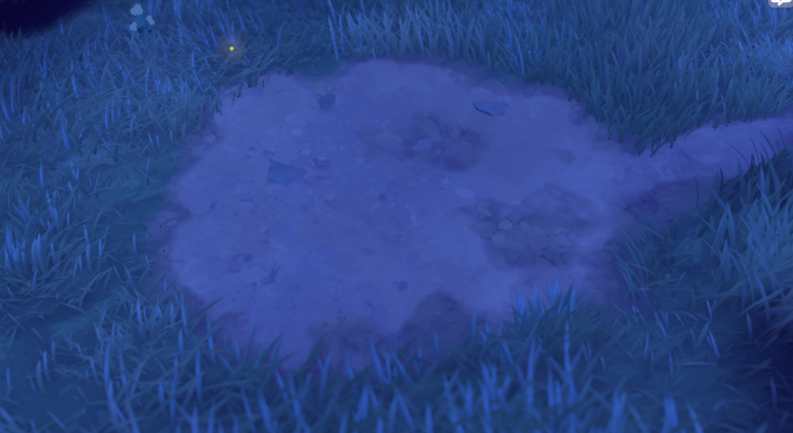
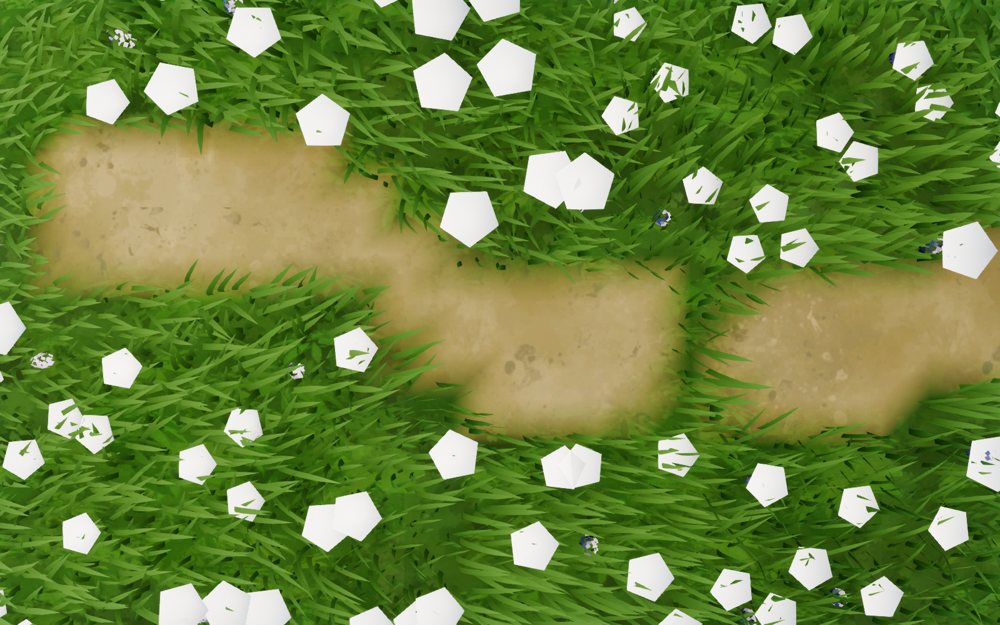
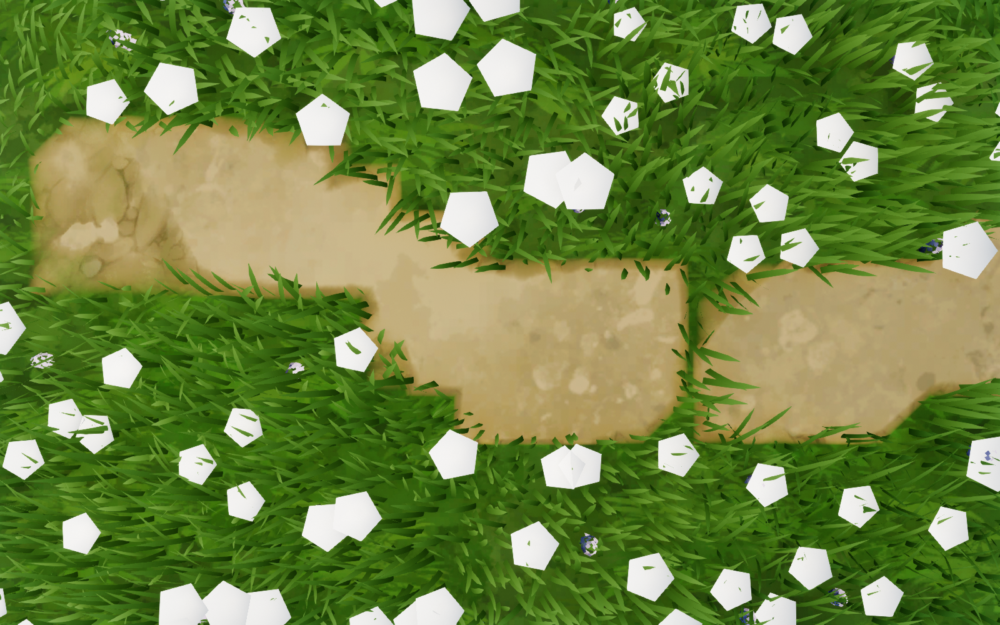
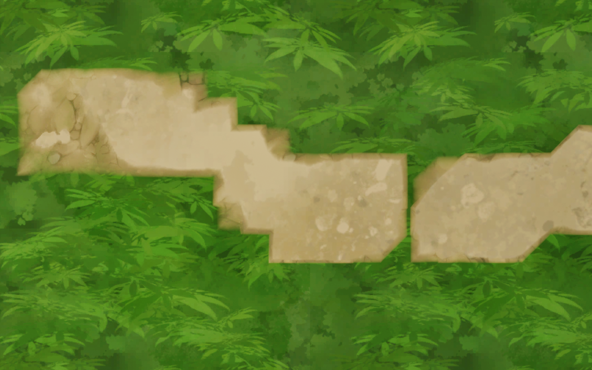

# 地面三层材质：草地、深色土与浅色土路

2026-09-12 根据用户参考图和 TG 反编译修正 `M_TinyGladeGround`。当前 `L_HouseGroundDemo` 的 `Ground_Demo` 通过 `MI_TinyGladeGround` 使用此材质。原先的两图线性混合缺少深色土层，也没有高度噪声控制的露土斑块。

## 用户参考图

下面是用户提供的原图，原样复制到文档目录。判读目标是草土接壤处的深色土带，以及浅土内部零散露出的深色碎石土；蓝色夜间光照不作为白天地表底色的标定。



## 反编译确认

原始文件目录为 `D:/MyProject/Tiny Glade/tmp/shaders/`。

| 证据 | 结论 |
| --- | --- |
| `_terrain_editing_floor.raster.hlsl_b903e43ffb3da915.ps_main.glsl` 第 145–149、422–427 行 | 地面采样 `dirt_1`、`dirt_2`、`grass` 三张颜色图，另有 `dirthpath_heightmap` 高度混合图 |
| 同文件第 444–464 行 | 土路遮罩与深土遮罩各自经过平方根、0.6 系数和高度竞争，得到两个混合权重 |
| 同文件第 520 行 | 先在草地上混深土，再覆盖浅土；两层分别使用 `smoothstep(0.2, 0.65, …)` 与 `smoothstep(0.6, 1.0, …)` |
| `_paths_path_mask_visual.cs.hlsl_cs_main_0.cs_main.glsl` 末尾 | `dirt_mask = max(土路, 石路1, 石路2, 石路3)`，深土覆盖域可包含多种道路 |
| 同 CS 第 51–182 行及对应石路段 | 两层值噪声扭曲模糊路径遮罩的采样位置，幅度受坡度限制，产生不规则路径轮廓 |
| Floor PS 第 469–513 行 | 主题 ID 4 另有减去最高 0.4 噪声的分支；它只属于该主题，不能当作所有主题的通用规则 |

高度噪声图的低谷会让浅土层的权重先退去，露出下面的深色土；在路缘，由于深土的混合区间更早开始，也会先看到深土。完全没有路径遮罩时，两层土的权重均为零。

提取清单 `D:/MyProject/Tiny Glade/extract/texture_index.json` 将 `dirtpath_1`、`dirtpath_2`、`dirtpath_grass`、`dirtpath_heightmap` **全部记录为 `BC7_SRGB`**。本轮保留四张纹理的 sRGB 解码，其中高度图也按原版格式读取。不能因为文件名含 `heightmap` 就直接改成线性采样。

## 项目实现

[TinyGladeMakeGroundMaterial.py](../../Scripts/TinyGladeMakeGroundMaterial.py) 原位重建材质图，保留材质资产身份和已有 `Grass`、`Dirt` 实例覆盖。实例新增 `DarkDirt` 与 `GroundBlendHeight`。材质按以下顺序采样和混合：

| 用途 | 提取纹理 | UV0 倍率 | 默认世界平铺周期 |
| --- | --- | --- | --- |
| 草地 | `dirtpath_grass` | 0.8 | 625 cm |
| 深色土 | `dirtpath_2` | 1.2 | 约 417 cm |
| 浅色土路 | `dirtpath_1` | 0.5 | 1000 cm |
| 高度噪声 | `dirtpath_heightmap` | 0.4 | 1250 cm |

地面 UV0 来自 `CSGroundActor.cpp::BuildSnapshotFromMirror` 的局部 XY / `UVWorldPeriod`；上表使用当前默认 500 cm。四层倍率对应原版米坐标乘 0.2 后的采样倍率。改变 `UVWorldPeriod` 会统一改变这些周期。

```hlsl
// 每种遮罩分别进行高度竞争；当前项目两者均来自道路顶点色 R。
float t = saturate(sqrt(mask) * 0.6);
float a = 0.15 * (1 - t);
float b = height * t;
float cutoff = max(a, b) - 0.1;
float weight = max(b - cutoff, 0) / (max(a - cutoff, 0) + max(b - cutoff, 0));

// soilWeight 与 roadWeight 分别来自对应遮罩的上式。
float3 color = lerp(grass, darkDirt * 1.1, smoothstep(0.2, 0.65, soilWeight));
color = lerp(color, lightDirt * 1.1, smoothstep(0.6, 1.0, roadWeight));
```

当前项目只用顶点色 R 表达土路，因此两种遮罩共享 R。此次落地的是三层着色、原版高度竞争和纹理采样倍率；原版单独的模糊／噪声扭曲路径栅格、石路遮罩合并、主题 ID 4 分支没有在本轮新增。地面仍有现有 50 cm 顶点格造成的轮廓折线，诊断图中可以看到。草地调色保留项目现有 RGB 纹理分支，光照继续使用 UE；上述范围不等于整个 TG 地面渲染管线已完全移植。

## 截图验证

以下均为当前 UE 场景 1600 × 1000 捕获，同机位、同光照；草叶风动会随时间变化。已检查路缘近景、路面土斑与全景。

| 修改前 | 修改后 |
| --- | --- |
|  |  |

下面仅在捕获视图隐藏地被组件，检查深色路缘和路面内部土斑；场景中的草和花没有被删除或关闭。



材质编译后统计为 VS 158、PS 228 条指令，4 次像素纹理采样；材质和实例已保存。验证记录位于项目 `Saved/TGGroundAudit/validation.json`，包含纹理绑定、着色器统计以及修改前后道路采样对照。本轮未改 C++，无需重编引擎模块。

修改前快照保留在项目 `.ue-safe-modify-backup/tg-ground-20260912/`。后续重建运行同一脚本即可；脚本不删除材质资产、不切换地图，也不覆盖已有道路笔刷数据。
