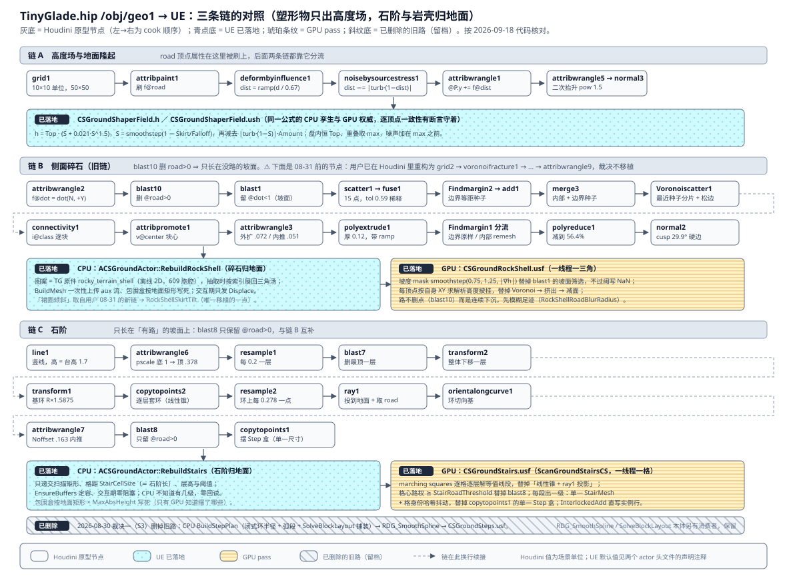
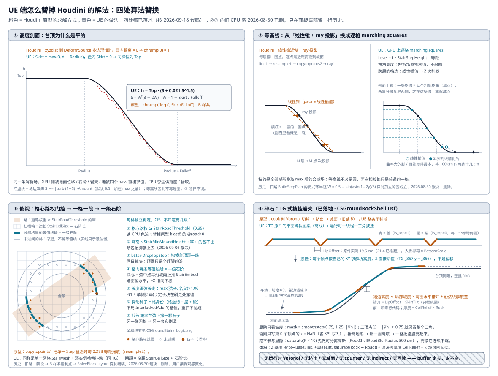

# 地形塑形物 `ACSGroundShaperActor`：Houdini 原型对照与实现现状

本文把用户的意图原型 `D:/MyProject/Houdini/TinyGlade/TinyGlade.hip` `/obj/geo1` 逐链拆开，
和 UE 侧 `ACSGroundShaperActor` 的现状对照，说明**哪些已经落地、哪些换了做法、哪些还没做**。

设计裁决在 [`TinyGladeHouse_Plan.md` § D9](TinyGladeHouse_Plan.md)；
UE 侧各参数的含义写在 [`CSGroundShaperActor.h`](../../Source/ComputeShaderGenerator/Public/CSGroundShaperActor.h)
的声明注释里，本文不重复，只记录**原型口径**与**两侧的差**。

两张图分工不同：第一张按**节点**对照三条链的走向，第二张按**算法**说明 UE 用什么替掉了原型的求解方式。





## 原型总览

`/obj/geo1` 是一张 `grid1`（10×10 单位、50×50 分段）加一条圆盘影响体 `DeformSource`，
共三条链汇入 `merge1 → output0`：

| 链 | 产物 | 道路条件 | UE 现状 |
| --- | --- | --- | --- |
| A 高度场 | 隆起的地面本体 | 无（road 在这里被刷上） | 已落地（含裙边噪声与二次抬升） |
| B 侧面碎石 | 坡面上的 Voronoi 碎石 | **只在 `@road == 0` 的坡面** | **未实现** |
| C 石阶 | 沿等高线的踏步 | **只在 `@road > 0` 的坡面** | 已落地，做法替换 |

**关键读法**：`road` 是把坡面**一分为二**的开关 —— `blast10` 把有路的点从碎石源里删掉，
`blast8` 把没路的点从石阶候选里删掉。原型里坡面的每一段要么长石阶、要么长碎石。
UE 目前只接了石阶那一半，所以没画路的坡面是光秃的插值面。

## 原型的可读性限制

`.hip` 里有四个 KALOU HDA **只存了参数接口、没存实现**（Houdini 报
`incomplete asset definition`，节点在纯 hython 会话里退化成直通）：
`deformbyinfluence`、`noisebysourcestress`、`Voronoiscatter`、`Findmargin`。

`D:/.aidata/skills/houdini-node-translator/kalou_nodes/kalou/otls/` 下有同名 HDA，
`Voronoiscatter` / `Findmargin` / `noise_by_source_stress` 的参数集与 hip 内节点逐项一致，
本文的算法描述取自这些文件。

`deformbyinfluence` 要多一步：hip 内那份比库里最新的 v3 还多出
`method` / `deformpt` / `outputprimuv` / `usegroup` / `groupattrib` / `scale`，是库里没有的更新版本。
但**核心 wrangle 在 v2 与 v3 里逐字相同**（见下节），且 hip 内的 `Type` 停在默认 0，
所以距离度量是确定的。无法从文件确证的只剩 `scale`（1.7）乘在哪一步 ——
按 `attribwrangle1` 的 `@P.y += f@dist` 与台高实际值反推，它只能是对输出 `lerp` 的整体缩放。

**不要拿 v1 去读这条链**：`kalou_deformbyinfluence.hda`（v1）只有 `nearpoint` 一条路、
连 `Type` 参数都没有，照它读会得出「环形山脊」的错误结论；hip 内的节点有 `Type`，不是 v1。

复现方式（非破坏性，不动正在运行的 Houdini 会话）：

```bash
hython dump.py   # 脚本内 hou.hipFile.load(HIP, suppress_save_prompt=True) 后遍历 /obj/geo1
```

## 链 A：高度场与地面隆起

原型链：`grid1 → attribpaint1 → deformbyinfluence1 → noisebysourcestress1 → attribwrangle1 → normal1`，
之后分出地面本体（`attribwrangle5 → normal3`）与坡面分类（`attribwrangle2 → blast10 → blast1`）两支。

### 影响体距离场

`deformbyinfluence1` 把结果写进点属性 `dist` 而不是直接变形（`Targetattrib='dist'`、`usepointdeform=0`）。
核心是一个按 `Type` 分岔的 wrangle，v2 与 v3 逐字相同，**hip 内 `Type` 停在默认 0**：

```vex
if (chi("../Type") == 0) {
    dist = xyzdist(1, @P, prim, uv, maxdist);              // 到 DeformSource 多边形"面"的距离
} else {
    dist = distance(@P, point(1, "P", nearpoint(1, @P)));  // v3 换成 nearpoints + max(lerps)
}
dist = clamp(dist, 0, maxdist);
float lerp = chramp("lerp", dist / maxdist);   // ramp 1 → 0，两端 interp = 5（B 样条）
setpointattrib(0, targetattrib, @ptnum, lerp);
```

`Type == 0` 走 `xyzdist`，而 `DeformSource` 是 `type=1` 的**多边形圆盘**（不是曲线），
面内距离恒为 0 → `chramp(0) = 1` → **盘内恒为台高，台顶是平的**。
`CSGroundShaperActor.h` 头注释里的这条断言成立。

然后 `attribwrangle1` 一句 `@P.y += f@dist;` 把它变成高度。

对应 UE：`Public/CSGroundShaperField.h` 与 `Shaders/Private/CSGroundShaperField.ush`
是同一条公式的 CPU 孪生与 GPU 权威（CPU 供 `SampleHeight` / 拾取 / 房子落座，
GPU 供区域位移 pass 与石阶扫描 pass）：盘内恒为台高，盘外 `smoothstep` 羽化到 0，
多塑形物重叠取 `max`。原型的 B 样条 ramp 在 UE 侧换成了 `smoothstep`（`W²(3−2W)`）。

两侧的一致性由单测 `GroundShaper.CpuGpuFieldParity` 守着：它在整张地面上逐顶点比
GPU 回读的 Z 与 CPU 孪生，实测最大差 **1.07e-4 cm**（≈ 1 ulp）。它还先断言这一趟真的走了
GPU 位移 pass（`GetGpuDisplaceCount()`）—— `RefreshHeightsInRegion` 在网格没建好时会退回
`RebuildGroundMesh()`，那条是拿 CPU 镜像直接上传的，不看这个计数的话断言会静默通过。

### 裙边噪声（已落地，默认开）

`noisebysourcestress`（`kalou_yb_noise_by_source_stress`）是一个 attribvop，等价于：

```text
dist = clamp( dist − | turbnoise(P) · (1 − dist) | )
```

两个性质：**只减不加**（`abs` 后做减法，噪声只会啃掉高度，像侵蚀），
且**权重是 `1 − dist`**（台顶 `dist≈1` 不受扰，裙边 `dist→0` 被打得最碎）。

UE 侧落在 `Shaders/Private/CSGroundShaperField.ush` 的 `GroundShaperEvalOne`，与它逐行对照的
CPU 孪生在 `Public/CSGroundShaperField.h`。参数是 `SkirtNoiseAmount`（**以台高为单位**，
0 = 关）/ `SkirtNoiseWavelength` / `SkirtNoiseSeed`。三处口径值得记住：

- **噪声加在 `max` 之前**，即每座塑形物各自的贡献里。高度场是"全部塑形物重叠取 `max`"，
  加在 `max` 之后等于给整片地形蒙一层噪声，折痕原样还在（计划裁决六）。
- **噪声域是本座局部坐标** `P − 中心`，不是世界坐标。同一份世界噪声在对称的两座之间会
  原样抵消（两边的 `S` 与 `turb` 都相等），折痕纹丝不动 —— 实测过。局部域还让图案钉在
  塑形物身上，拖动时不会整片"沸腾"。
- **噪声函数只用整数哈希 + 加减乘**（value noise + 3 倍频 fbm，gain 0.55 / lacunarity 1.9 /
  每层旋转 36.87°，常数照 TG 实测）。**不能用 HLSL 内置 `noise()`**：CPU 侧没有对应物；
  也不用 `sin/cos/pow/exp`，超越函数两边实现不同。二次抬升的 `pow(S, 1.5)` 因此写成
  `S·sqrt(S)`。

`AnalyticRingRadius` 的闭式解随之失效 —— 但**架构代价已经被 S1 顺带付掉了**：
S1/S2 的 GPU marching squares（`ACSGroundActor::RebuildStairs`）直接读高度场，
根本不关心等高线是不是圆。只有旧路 `BuildStepPlan` 还在用闭式解，它现在在
`HasAnalyticProfile()` 为假时退回逐方向数值求交（验证 + 割线 + 二分，那条分支本来就在）。
实测：噪声关 42 级 / 噪声开 40 级，退化后仍然摆得出石阶。

### 二次抬升（已落地，默认开）

`attribwrangle5` 在地面本体那一支上再抬一次，是个纯观感微调：

```vex
@P.y += pow(f@dist / chf('maxheight'), chf('pow')) * chf('maxheight') * chf('scale');
// pow = 1.5, maxheight = 1.7（链到 deformbyinfluence1/scale）, scale = 0.021
```

幅度上限 `1.7 × 0.021 ≈ 0.036`，约台高的 2%，偏向台顶。UE 侧是 `SecondaryLiftScale`（默认 0.021）。

✅ **用户 2026-08-30 拍板选甲：就照这个口径，不归一化。** 本段是契约，不是待修缺陷。

⚠️ **它按原型口径照抬台顶**，所以台顶高度是 `LiftHeight × (1 + SecondaryLiftScale)`，
不再等于 `LiftHeight`（默认档下 300 → 306.3）。这是原型的语义，没有归一化 ——
要让 `LiftHeight` 严格等于台顶高度，把它设成 0。凡是拿绝对台高做期望值的断言都要跟着改
（演示回归里那几条已经改成"和 `SampleHeight` 比"或写成表达式）。

### 坡面分类

```vex
// attribwrangle2
f@dot = dot(@N, set(0, 1, 0));
```

`blast10` 删 `@road>0`、`blast1` 留 `@dot<1`，两步之后得到**「没有路的坡面」**，
它是链 B 唯一的输入。UE 侧没有等价物（UE 不需要，因为没有链 B）。

## 链 B：侧面碎石（✅ 已落地，2026-08-30）

这是用户提到的「侧面石头 mesh」。原型 15 个节点全部落在**离线**，运行时只剩逐三角的
披挂 + mask 显隐（裁决一）。下面还是原型的逐节点口径，**实现现状先列在这里**：

| 件 | 路径 |
| --- | --- |
| 图案（Tiny Glade 原件） | `/Game/TinyGlade/Meshes/rocky_terrain_shell/rocky_terrain_shell/StaticMeshes/rocky_terrain_shell` |
| 导入 / 收尾 | `Scripts/TinyGladeImportRockShell.py` → `Scripts/TinyGladeSetupRockShell.py` |
| kernel | `Shaders/Private/CSGroundRockShell.usf`（一线程一三角） |
| 主机 | `Public/CSGroundRockShell.h` / `Private/CSGroundRockShell.cpp` |
| 宿主 | `ACSGroundActor::RebuildRockShell()`，挂在 `RefreshHeightsInRegion` / `FlushPaintToGpu` 之后 |
| 单测 | `RockShell.Contract` / `RockShell.DrapesOnSlopes` / `RockShell.RoadSinksNotHides` |
| 出图 | `Scripts/TinyGladeShotRockShell.py`（带像素判据） |

**实测数据**（演示关卡 `Radius=600` / `Falloff=800` / `Lift=700`，地面 128 m）：
49,598 个三角里 1,112 个活着，**全在裙边**（台顶 0 / 盘外远处 0）；到坡面的最大垂直距离 52.1 cm；
画路之后活三角数**一个不少**、路下平均下沉 −107 cm / 最深 −162 cm、路外漂移 0.00 cm；
擦掉路逐位复位（0.000 cm）；删掉塑形物后活三角 0（裁决二：没有一行注销代码）。

⚠️ **本节与下面「对照 Tiny Glade」里的五条已被实测推翻**（`dir_to_centroid` 的符号、
`cell_bby` 的语义、`LipOffset` = 19.5 cm、绕序、零共享顶点）。逐条实测与后果写在
[`CSRockShellPattern.md`「实测推翻的五条」](CSRockShellPattern.md)，**那份才是 kernel 的依据**；
要不要把它们回写进本文与计划正文，是留给用户拍板的一项。

另一条计划里没写、动工时实测出来的链条：**胞腔尺寸 → 羽化宽度 → 坡度 → 台高**。
原件胞腔 5.53 m 要求 `Falloff ≥ 800`，而剖面是 smoothstep（最大斜率 1.5）⇒
`max|∇h| = Lift × 1.5 / Falloff`。`Lift=300 / Falloff=800` 给出 0.5625，**整个土台都在
TG 的 0.75 阈下，一块碎石都不会长**（实测：只有裙边噪声碰巧超阈的 178 个三角）。
演示塑形物因此抬到 `Lift=700`（max|∇h| = 1.3125，陡坡带拿满 mask）—— 推导写在
`Scripts/TinyGladeResizeDemos.py` 的 `SHAPER_LIFT` 处。

### 种子

| 节点 | 作用 |
| --- | --- |
| `scatter1` | 坡面上撒 15 个点（`relaxpoints=0`，不做松弛） |
| `fuse1` | `tol3d=0.5916` 大容差熔合，把挨太近的点并掉，剩下彼此拉开的种子 |
| `Findmargin2 → convertline1 → blast6 → fuse3 → add1` | 取坡面边界线，按 `tol3d=0.5723` 熔成等距边界种子 |
| `merge3` | 内部种子 + 边界种子 |

边界种子是必要的：没有它，Voronoi 在坡面边缘会切出又长又薄的畸形块。

### Voronoi 分片

`Voronoiscatter`（`kalou_voronoiscatter`）内部不是 Fracture SOP，而是三段自写逻辑：

```vex
// 1) 最近种子分片
i@piece = point(1, "num", nearpoint(1, @P));

// 2) 三片交汇点标记
//    统计本点所有邻接面的 piece，去重后 > 2 → i@intersectionpt = 1

// 3) 边界松弛：对只有 2 个邻居的边界点，向两邻居中点 lerp（迭代 iterations 次）
//    再把靠近分界线的点吸到松弛后的曲线上：
float dist = xyzdist(1, @P, prim, uv, maxdist);
float lerp = chramp("deform", dist / maxdist);
if (dist < maxdist) @P = lerp(@P, primuv(2, "P", prim, uv), lerp);
```

hip 里只改了 `deform` ramp（`(0,1) (0.062,1) (0.301,0.737) (0.542,0) (1,0)`，B 样条），
效果是**分界线附近完全吸附到松弛曲线、约 0.54·maxdist 之外不动** ——
石块的缝不是直的多边形边，而是带曲率的裂纹。

### 成块

```vex
// attribwrangle3：输入 1 = DeformSource
vector dir = normalize(@P - v@center);            // v@center 来自 attribpromote1（按 class 求块心）
// ⚠️ 实测订正（2026-08-30）：烘焦件里这个量是 **指向质心** 的（= normalize(center − P)），
// 与本行原型写法符号相反（dot 中位 +0.9996、100% 为正）。kernel 用的是现算的那份，不受影响。
vector origdir = normalize(getbbox_center(1) - @P);
@P += dir * chf('offset');                        // offset  = 0.072，每块整体胀大 → 相邻块互相咬合
@P += origdir * chf('Noffset');                   // Noffset = 0.051，整体朝土台中心推 → 扎进坡里
```

后续：`polyextrude1` 挤出 `dist=0.12` 的厚度（带 thickness ramp `1.0 → 0.777`）；
`Findmargin1` 把边界与内部分开，**边界原样保留、内部 `remesh1` 重网格**，再 `fuse2` 焊回去 ——
这样减面不会啃掉石块的轮廓；`polyreduce1` 减到 `56.4%`；`normal2` 用 `cuspangle=29.9` 出硬边低模观感。

`attribwrangle4`（`@P.y -= (1 - f@dist) * offset`，按高度亏空下沉）在 hip 里是 **bypass** 状态。

### 移植提示

`attribwrangle3` 的两个位移与链 C 的 `StepEmbed` 是同一种手法（沿径向偏移），UE 侧已有现成对应物。

落地方案写在 [`TinyGladeHouse_Plan.md` § D9「侧面碎石：Tiny Glade 式披挂岩壳」](TinyGladeHouse_Plan.md)：
**整条链落在离线**，运行时只剩逐三角的披挂 + mask 显隐。依据见下面的
[对照 Tiny Glade](#对照-tiny-glade岩壁怎么做的) 一节。

实现与方案的两处差异（都是实测驱动的，未改任何裁决）：

1. **多了一条 aux 流（槽 34）装逐胞腔质心**，因为 `CellJitter` 是沿单位向量的**定长**径向位移，
   不乘一个到质心的半径淡入就会把顶盖内部点推过质心、翻转周围三角。质心是从几何**现算**的派生量，
   不是新契约字段（文档建议的另一条出路是占用打包字的 bit 27..31，那是改契约，没做）。
2. **表面 FBM 用共享头的 `CSGSF_Turbulence`，不是计划提的 `VinePerlinNoise3D`** ——
   计划给的噪声口径（gain 0.55 / lacunarity 1.9 / 每层旋转 36.87°）正是那个头里已经实现的那一份
   （它就是照同一份 TG 实测写的），再套一份 Perlin 只会多出一套要对齐的常数。

## 链 C：石阶

原型把「分层 → 套环 → 投影 → 过滤 → 摆块」拆成 13 个节点，UE 压成
「CPU 解闭式环半径 + 弧段 + 铺装」→「GPU 求曲线 + 直写实例行」两段。

> ⚠️ **本节描述的是 2026-08-30 之前的实现。** 用户已裁决改走 100% GPU 决策
> （marching squares，见[计划 D9「石阶改造」](TinyGladeHouse_Plan.md)），
> `BuildStepPlan` / `RDG_SmoothSpline` / `SolveBlockLayout` 那条路会被删掉。
> 保留本节是为了读懂现有代码，以及记录那两处**将要放弃**的能力（变长铺装、B 样条平滑）。

### 分层

```text
line1        竖线，origin = DeformSource 平移，dist = 1.7（链到 deformbyinfluence1/scale）
attribcreate1 + attribwrangle6   pscale：底点 1.0，顶点 0.6/1.5875 = 0.378
resample1    length = 0.2 → 每 0.2 一层
blast7       删掉最后一个点（最顶那层不摆石阶）
transform2   ty = −0.2，整体下移一层
```

`transform1` 把 `DeformSource` 放大 `(0.6 + 0.67)/0.6 × 0.75 = 1.5875` 当基环，
`copytopoints2` 按 `pscale` 逐层套环 —— 半径从底到顶**线性收缩**，
这是一个**圆锥近似**，靠随后的 `ray1` 投影贴回真实坡面。

UE 用 `AnalyticRingRadius` 直接给出该层的精确半径（`smoothstep` 反函数
`W = 0.5 − sin(asin(1−2y)/3)`，`R = Radius + Falloff·(1−W)`），既不套环也不投影。
非孤立（有别的塑形物压过来）时才退回一次采样验证 + 割线 + 二分。

### 投影与过滤

```text
resample2         环上每 0.278 一点
ray1              method=0 最近距离投到 attribwrangle2（变形后的地面），并取回 road 属性
orientalongcurve1 生成环切向基
attribwrangle7    origdir = normalize(bbox_center − P); P += origdir * 0.163   ← 沿径向内推
blast8            只保留 @road > 0
copytopoints1     把 Step 盒摆上去
```

UE 对应：`BuildStepPlan` 里逐方向 `Ground->SampleRoadWeight()` 过 `StepRoadThreshold`，
把连续过阈的方向连成弧段（跨 0° 也连），每段交给 `ACSSplineBlockActor::SolveBlockLayout` 铺装；
控制点先 `-StepEmbed` 内推、再取该点**真实地面高度**，所以曲线直接躺在坡面上。

### 摆块

原型只有**一个** `Step` 盒（`0.21 × 0.3 × 0.7`），等距摆放。
UE 换成 palette + `SolveBlockLayout`：随机取不同长度的石阶填到越界，再整体缩放恰好占满弧长。

两处 UE 修正：

- **半个身位抬升**：原型的盒心直接落在投影点上，石块有一半埋在地里。
  UE 的 `PaletteRise[i] = -Bounds.Min.Z` 把每块抬起半个身位（`CSGroundSteps.usf` 里 `Position.z += Rec.z`）。
- **朝向强制**：曲线方向未必逆时针，USF 里用 `dot(AxisX, Radial) < 0` 翻转，保证 `+X` 永远指离土台中心。

## 对照 Tiny Glade：岩壁怎么做的

本节全部取自 `D:/MyProject/Tiny Glade` 的实测：反编译着色器在 `tmp/shaders/`，
烘焙资产在 `assets/data/rocky_terrain.json`，整体拆解见同目录 `MESH_GENERATION_ANALYSIS.md` §7.2。

**一句话：TG 把原型那整条链全部搬到离线，运行时只剩逐三角的披挂 + 显隐。** 没有减面、没有重网格、
没有运行时 Voronoi、没有拓扑构建、没有 counter、没有 indirect、没有回读。

### 烘焙资产

`rocky_terrain.json` 是一张 **2D 碎裂图案**（三角汤，非索引），实测：

| 项 | 值 |
| --- | --- |
| 顶点 / 三角 / 胞腔 | 148,794 / 49,598 / **609** |
| 顶圈（`y = 0.048`）/ 底圈（`y = 0`） | 115,718 / 33,076 顶点，**只有这两个 y 值** |
| `is_top = 1`（盖三角） | 27,566，三顶点**全在顶圈** ⇒ 45.3 个/胞腔 |
| `is_top = 0`（裙三角） | 22,032，**每一个都跨两圈** ⇒ 36.2 个/胞腔 |
| `is_corner = 1` | 28,669 顶点（19.3%），= KALOU `Voronoiscatter` 的 `@intersectionpt` |
| tile 跨度 | x,z ∈ [−1.05, 1.05]，运行时 ×65 ⇒ ±68.25 m，胞腔 ~5.5 m |
| 常驻显存 | 顶点 48 B + 三角 32 B ⇒ ~8.3 MiB，**定长，永不变** |

逐顶点/逐三角的烘焙字段，以及运行时**只写**哪两项：

```cpp
struct Vertex {                // 48 B
    vec3  rest_position;       // 烘死；只有 xz 有用，y 运行时被整个丢弃
    float cell_bby;            // 烘死；0 / 1 = 本胞腔沿地形法线【凹】还是【凸】（:577，名字误导）
    vec3  position;            // ← 每次 dispatch 写
    int   cell_id;             // 烘死；= 原型 connectivity1 的 @class，逐胞腔随机的种子
    vec3  dir_to_centroid;     // 烘死；水平。⚠️ 实测是 **normalize(center − P)**（指向质心），
                               //    与原型/旧契约写的 normalize(@P − center) 符号相反。
    int   is_corner;           // 烘死；== 0 才加 FBM（:579）⇒ 角点钉死，相邻胞腔共享角不裂
};
struct Triangle {              // 32 B
    ivec3 neighbours;          // 烘死的逐三角邻接表 —— 绕开"GPU 上没有半边结构"的第三条路
    int   is_top;              // 烘死；**位移着色器里从没被读**，只原样搬运，是给光栅化/材质用的
    vec3  normal;              // ← 每次 dispatch 写
    float pad1;
};
```

**离线烘焙把两件事提前做掉了**：`connectivity` + `attribpromote` 的聚合结果压成逐顶点属性
（运行时做逐胞腔操作**一次邻接查询都不需要**）；`polyreduce` 的存在理由（`remesh` 过量生产）
在离线管线里根本不出现。

### 运行时：`_rocky_terrain_displace_rocky_terrain.cs`

`local_size_x = 64`，**一线程一三角**，全部工作如下。

**① Y 是替换，不是位移** —— 这是整套做法的关键，静止姿态的 y 一点都没用上：

```glsl
vec3  _347 = _337 * 65.0;                                 // 静止姿态 → 世界尺度
vec2  _350 = _347.xz * (1.0/130.0) + 0.5;                 // 顶视 UV
float _356 = mix(-2.5, 24.0, heightmap(_350).x);          // 地形高度解码，量程 [−2.5, 24] m
vec3  _357 = _347;
_357.y = _356;                                            // ← 赋值。烘焙的 y 到此丢弃
```

所以静态资产只提供**平面上的碎裂图案**；三维形态 100% 是运行时披挂出来的。

**② 显隐换批，这是"看起来变化很大"的主因。** mask 由坡度驱动
（`rocky_terrain.x = smoothstep(0.75, 1.25, length(中心差分梯度))`，`_terrain_derivative.cs:104`），
地形一抬高，边缘出现一圈新陡坡，**一整批原本 NaN 的胞腔亮起来** —— 不是形变，是换了一批在演。
判据很省：三个顶点**任一**过阈就保留整个三角；三个都不过，只往 `vertices[gid*3 + 0]` 写
`0x7fbfffff`（NaN），一个 NaN 就够让整个三角在裁剪阶段出局，写入量省掉 2/3。

**③ 裙边高度是几何自动给的，没有一行代码在算它。** 实测底圈与顶圈**从不在同一个 xz 上**，
水平错开中位数 = **19.5 cm**（0.0030 tile；众数占 3910/5131，p25=中位=p75）。
⚠️ 旧值 21.4 cm 已被离线核对器 `Scripts/VerifyRockShellGlb.py` 推翻。两圈各自采自己位置的高度 ⇒
**裙边竖直高度 = 局部坡度 × 0.195 m**。平地自动塌成零高度，陡坡自动拉成岩壁。
（主项如此；着色器另有路径/水面下沉与 FBM 的修正项。）

**④ 逐胞腔随机胀缩（水平）**：`rest_position + dir_to_centroid * 0.001 * mix(-3, 8, rand(cell_id))`，
×65 后是 **−0.195 .. +0.52 m**。注意是**有胀有缩**，而原型 `attribwrangle3` 的 `offset=0.072` 是恒定外扩。

**⑤ 逐胞腔沿地形法线的进 / 出 —— "块感"的真正来源**（`:577`）：

```glsl
_761 = _718 + (_748 * mix(-0.3, 0.1 * mix(0, 3, rand(cell)), cell_bby)) * rockMask * (1 - path)
            - _748 * path;
// _748 = 由高度图梯度构造的地形法线
// cell_bby = 0 → 沿法线沉 0.3 m ； = 1 → 沿法线凸 0 .. 0.3 m
```

有的胞腔沉、有的凸，各差 0.3 m。**没有这一层，披挂出来的只是一张贴着地形的毯子**；
有了它才读成一块块独立的石头。`rockMask` 让它随岩石 mask 淡入。

**⑥ FBM 沿法线**加表面细节，**但角点不加**（`:579` 的 `if (is_corner == 0)`）。
角点钉死，相邻胞腔的共享角就不会裂开缝 —— 这是 `is_corner` 的真正用途。
噪声参数：**gain 0.55、lacunarity 1.9、每层再旋转约 36.87°**（矩阵 `[0.8,−0.6; 0.6,0.8]`，
防止各层格子对齐出轴向条纹），底层是 value noise（整数格点哈希 + `t²(3−2t)` 插值）。
⚠️ 反编译后的循环边界读作只跑一次，**倍频数无法确证**（可能被部分展开或是特化常量）。

**⑦ 面法线**：`normalize(cross(v2 − v0, v1 − v0))` 存回 `Triangle.normal` ⇒ 天然硬边，
不需要原型的 `normal cuspangle=29.9`。

### 画路时壳"逐渐消失"：是沉下去，不是隐藏

**隐藏判据里没有 path mask**（`:202-206` 只有 `rocky_terrain.x/.z` 与 `water_mask.y`）。
路是靠三件事连续压掉的：

1. **噪声先关**（`:581`）：`path_mask == 0.0` 才进 FBM 分支，一沾路表面立刻变光滑；
2. **块感淡出**（`:577`）：⑤ 的逐胞腔进/出乘 `(1 − path)`，凹凸摊平；
3. **整体下沉**：`:563` 的 `mix(-0.4, 0.2, clamp(rockMask − 10·path, 0, 1))` —— 那个 **10× 权重**
   让 path 只要到 0.1 就把 `mix` 从 `+0.2` 翻到 `−0.4`（一次 0.6 m 落差）；`:577` 的
   `− N × path` 再压最多 1.0 m。合计沉约 **1.6 m**，壳被地面网格挡住。

**必须照抄这条**：用 NaN 关掉的话，画路时三角会一个一个啪地消失（popping）；
连续沉降的观感是"石头慢慢埋进土里"。

### 它不是实体，是贴在地形上的一层壳

盖 + 裙组成一张**开放曲面**——没有底、不封闭、不是一堆独立石头对象。地表
（`_terrain_editing_floor.raster`）照常画在下面，岩壳是另一个 draw 盖在上面。因此：

- **没有独立碰撞体**。TG 的拾取与行走都打在 heightmap 上（`_mouse_terrain_raycast.cs` 的
  raymarch、`RaycastWorld::raycast_w_terrain`），角色不是站在岩石上，是站在高度场上。
- 不能单独挪动或拾取"一块石头"——壳上没有这个对象。

⚠️ **命名**：计划与本文沿用的「碎石」名不副实，它是**岩壁表层**（TG 自己叫 rocky terrain，
不叫 rocks）。这个名字会持续误导人以为有石块对象。

### 已提取的资产

`extract/rocky_terrain2glb.py` → `extracted/meshes/rocky_terrain_shell.glb`（7.38 MiB）。
逐顶点的胞腔数据进不了 glTF 标准语义，因此打包进多 UV 通道，**UE 直接当 StaticMesh 导入即可保住**：

| 通道 | 内容 |
| --- | --- |
| `POSITION` | `rest_position × 65`（米、Y-up，导入时引擎转 Z-up 厘米） |
| `NORMAL` | 静止姿态的平面面法线 |
| `TEXCOORD_0` | `dir_to_centroid.xz` |
| `TEXCOORD_1` | `(cell_id, is_corner)` |
| `TEXCOORD_2` | `(cell_bby, is_top)` |
| `COLOR_0` | 逐胞腔哈希色（仅供视口辨认，非游戏数据） |

`triangles[].neighbours` 默认丢弃（没有逐顶点落点，且我们的 kernel 从自己三个顶点重算面法线）；
`--neighbours` 会补成 `TEXCOORD_3/4`。**绕序在导出时翻了**：全部 27,566 个盖三角在 glTF 的
`cross(b−a, c−a)` 约定下面法线朝 −Y，因为 TG 用的是 `cross(v2−v0, v1−v0)`。

⚠️ **两个同名文件的坑**：`assets/meshes/terrain_rocks.json` 是 ±430 m 的**背景岩石**
（10,732 顶点、只有 Position/Normal/Color/UV、零 cell 属性），已经被导进
`Content/TinyGlade/Meshes/terrain_rocks/`；本节讲的是 `assets/data/rocky_terrain.json`。
`MESH_GENERATION_ANALYSIS.md` §7.2 把后者的属性挂在了前者的文件名下，**文件名记错了**，照它去找会拿到错的那份。

### 两座隆起交汇处：没有"融合"这一步

TG 的地形是**逐 texel 重放全部笔画**（`_terrain_editing_rasterize_terrain_stroke.cs`，
外层 `for (_321 < stroke_count)`）。每笔的贡献是：

```glsl
_1784 = (_367 * 0.05) * exp(-5.5 * d²)   // 高斯型隆起核，d = 归一化距离
      + _1527 * (1.0 - d)                 // 线性衰减项
      + _1783;                            // 逐笔的 FBM 边缘侵蚀
bool _1785 = _1784 > _319;                // ← 合成算子：取 max
_320  = _1785 ? _1784 : _319;             // 高度
_318  = _1785 ? _357  : _317;             // 顺带记下"谁最高"，写进 stroke_indices 供拾取
```

**合成算子就是 `max`，和 `CSMeshOps.usf:646` 的 `H = max(H, ...)` 逐字相同。** 没有融合代码、
没有接缝仲裁、没有"两份产物要接起来"的问题。岩壳侧同理：胞腔不与任何一笔对齐，跨在交汇处的
胞腔就是那批胞腔，它只问"我脚下这块地陡不陡"，不问是谁让它陡的。

**但交汇处看不出折痕，靠的是另外两件事**（`max` 本身在等高线上是 C¹ 不连续的）：

1. **`_1783` 是加在 max 之前的**，即噪声进入每一笔自己的高度。两笔的折痕线因此被各自的噪声
   打碎，不是一条干净的几何脊线。
2. 岩壳读的是**中心差分**的坡度（512² 覆盖 130 m ⇒ 一个 texel ≈ 0.25 m），再过
   `smoothstep(0.75, 1.25, ·)` 的软阈 —— 折痕被抹掉两道。

✅ **这条已经补上**（见[链 A 的裙边噪声](#裙边噪声已落地默认开)）：逐塑形物噪声加在 `max` 之前，
折痕被两侧各自的噪声打碎。单测 `GroundShaper.CreaseIsBroken` 沿折痕取 51 个采样量两件事 ——
折痕线的横向游走（噪声关时**恒等于 0**，折痕就是精确的中垂线；开时 σ = 12.1 cm、峰值 36.4 cm）
与横向曲率的变异系数（0.087 → 0.424，均值 42.0 → 26.1 cm，51 个采样里 14 个掉到一半以下）。

⚠️ **但它有一条自带的边界**：权重 `(1 − dist)` 是按剖面高度把噪声关小的，
所以**两座重叠得越深、折痕处的噪声权重越低**。半径 300 / 羽化 400 的两座相距 800（石阶用例
那个场景）时接合处已经爬到 `S ≈ 0.84`，噪声只剩 16% 权重，实测折痕纹丝不动（横向游走 σ 只有
4 cm，曲率均值 43.7 → 39.3）；相距 1200 时接合处 `S ≈ 0.16`，噪声接近满权重，上面那组数才成立。
这是**原型公式自带**的性质，不是本实现的取舍。裙边相接（常见摆法）没问题，盘几乎压在一起的
两座仍会留一条干净折痕。

### 密度是给披挂用的，不是给噪声用的

45 个盖三角/胞腔，是因为一个 ~5.5 m 的胞腔要**跟住** [−2.5, 24] m 量程的地形起伏。
对照 TG 自己的地表（`_terrain_editing_floor.raster` 的 91 列网格 = 16,200 三角），
岩壳是地表的 **3.06 倍**，三角边长同为 ~1.2–1.5 m。

这条决定了本项目的容量口径：**披挂壳的三角数由视觉需要的三角边长决定，不跟地面网格密度走**。
具体数字与「塑形物尺度装不下胞腔」这个待定项，见计划 D9 的「密度与尺度」。

### 石阶：骨架几乎一样，两处关键分歧

TG 的 `_rocky_terrain_stairs_stairs.cs`（8×8 线程，域 = `contouring_grid_dims`）与本项目的
`BuildStepPlan` + `CSGroundSteps.usf` 在骨架上高度一致：都是「按高度分层 → 沿等高线摆台阶 →
路 mask 门控 → GPU 计数 + indirect draw」，变换都在 GPU 组装，朝向都是等高线方向 × up，
都沿坡向内推（TG 的"沿坡向内推" = 我们的 `StepEmbed`），都做二分精化。

| | Tiny Glade | 本项目（2026-08-30 前） |
| --- | --- | --- |
| 等高线怎么来 | **GPU marching squares**，16 case 全展开，每边 2 次二分 | **CPU 闭式解** `AnalyticRingRadius` |
| 决策在哪 | 100% GPU，CPU 不接触单个台阶 | CPU 解层 / 弧段 / 铺装 |
| 分层 | 17 层，**非等距** `mix(0.8, 10.0, i/16)` | 等距 `StepHeight` |
| 沿弧长排布 | 每条穿越边一级，间距由格密度决定 | `SolveBlockLayout` 变长铺装 + 缩放占满弧长 |
| 台阶多样性 | **单一网格 + VS 里 FBM 驱动 `bevel_offset`**，CPU 零成本 | palette 多长度，CPU 侧铺装 |
| 门控 | `rocky>0.2 && smoothstep(0.075,0.125,path)>0.99 && water<0.5` | `road >= StepRoadThreshold`（0.35） |
| 形状假设 | **无** | 关于塑形物中心星形；非孤立退回割线 + 二分 |
| 附带 | 15% 概率在等值线上撒 pebble | 无 |
| CPU 回读 | 一次（`stairs_counter.cs` 拷 instanceCount，**仅供音频**） | 零 |

**marching squares 意味着对地形形状零假设** —— 这正是本项目那条已知缺陷
（*路穿过两座相接土台时接合处石阶弧段断掉*，逆向报告第一轮）的根因所在。
用户已于 2026-08-30 裁决改走 100% GPU 决策，方案见
[计划 D9「石阶改造」](TinyGladeHouse_Plan.md)；本表右列即将成为历史。

**TG 的门控阈值比我们严得多**：`path > 0.99` 几乎要求路完全盖住该格，石阶只在路正中心长；
我们 0.35 宽松，路边缘也会长。要贴 TG 观感，阈值得往上提。

### TG 自己的岩壁 / 石阶分工，和本项目一致

| | 机制 | 容量 |
| --- | --- | --- |
| 岩壁 `displace_rocky_terrain.cs` | 定长 buffer + NaN 隐藏 | 永不变，无 counter/indirect |
| 石阶 `stairs.cs`（8×8 线程） | `atomicAdd(draw_commands[..].instanceCount, 1)` | GPU 计数 + indirect draw |

石阶那条还带第二个 indirect（`pebble_indirect_draw_idx`，台阶旁撒鹅卵石）。
本项目现状恰好同形：石阶走 `CSGroundSteps.usf` 的 `InterlockedAdd` + indirect，碎石按计划走定长壳。

## 参数对照

Houdini 值为场景单位，UE 值为 `CSGroundShaperActor.h` 的默认值。
「归一化」列以台顶半径为 1，用来看两侧比例是否一致。

| 原型参数 | Houdini 值 | 归一化 | UE 符号 | UE 默认 | 归一化 |
| --- | --- | --- | --- | --- | --- |
| `DeformSource/scale` | 0.6 | 1.000 | `Radius` | 150 cm | 1.000 |
| `deformbyinfluence1/maxdist` | 0.67 | 1.117 | `FalloffDistance` | 200 cm | 1.333 |
| `deformbyinfluence1/scale` | 1.7 | 2.833 | `LiftHeight` | 300 cm | 2.000 |
| `resample1/length` | 0.2 | 0.333 | `StepHeight` | 30 cm | 0.200 |
| `attribwrangle7/Noffset` | 0.163 | 0.272 | `StepEmbed` | 25 cm | 0.167 |
| `Step` 盒长（Z 轴） | 0.7 | 1.167 | `SM_StoneStep_{S,M,L}` | 60 / 100 / 150 cm | 0.4 / 0.67 / 1.0 |
| `noisebysourcestress` 幅度 | 1.0（归一化 dist 域） | — | `SkirtNoiseAmount` | 0.5（同域） | — |
| `noisebysourcestress` 频率 | 无法从 HDA 确证 | — | `SkirtNoiseWavelength` | 300 cm | 2.000 |
| `attribwrangle5/scale` | 0.021 | — | `SecondaryLiftScale` | 0.021 | — |
| `blast8` `@road>0` | 阈值 0 | — | `StepRoadThreshold` | 0.35 | — |
| `resample2/length` | 0.278 | 0.463 | 无（改由 `SolveBlockLayout` 决定间距） | — | — |
| — | — | — | `StepGap` | 3 cm | 0.02 |
| — | — | — | `StepAngleStepDeg` | 3° | — |

碎石链的参数在 UE 侧全部没有对应物：`scatter1/npts=15`、`fuse1/tol3d=0.5916`、
`attribwrangle3/offset=0.072`、`attribwrangle3/Noffset=0.051`、`polyextrude1/dist=0.12`、
`polyreduce1/percentage=56.4`、`normal2/cuspangle=29.9`。

UE 的台身比原型更矮更宽（`Lift/Radius` 2.0 对 2.833，`Falloff/Radius` 1.333 对 1.117），
层数则更密（10 层对约 8.5 层）。

## 轴向与单位口径

Houdini 是 Y-up、UE 是 Z-up，石阶盒的三轴按下表对应，**长度轴在两侧是同一根轴**：

| 语义 | Houdini `Step` 盒 | UE 石阶网格 |
| --- | --- | --- |
| 踏面进深（径向朝外） | `sizex` = 0.21 | 局部 `+X` |
| 石阶长度（环切向） | `sizez` = 0.7 | 局部 `+Y` |
| 石阶高度（世界上） | `sizey` = 0.3 | 局部 `+Z` |

`BuildStepPlan` 取 `StaticMesh` 包围盒的 **Y** 当长度；同一份
`ACSSplineBlockActor::SolveBlockLayout` 的另一个消费者 `ACSSplineBlockActor` 取的是 **X**，
两边口径已分叉（见 `TinyGlade_对比逆向报告.md` 卷二）。

原型里 `Step` 盒高 0.3 大于层距 0.2，踏步在竖直方向是**互相叠压**的，不是首尾相接。

## 与实现的差异清单

| 环节 | 原型 | UE 现状 | 性质 |
| --- | --- | --- | --- |
| 羽化曲线 | B 样条 ramp | `smoothstep` | 等效替换，换来闭式反函数 |
| 裙边噪声 | `dist −= \|turb·(1−dist)\|` | `SkirtNoiseAmount`（默认 0.5），加在 `max` 之前 | 已落地；闭式环半径随之只作数值求交的初值 |
| 二次抬升 | `pow(dist/max, 1.5)·max·0.021` | `SecondaryLiftScale`（默认 0.021） | 已落地；台顶因此是 `LiftHeight × 1.021` |
| 噪声实现 | Houdini `turbnoise` | 自写整数哈希 value noise + 3 倍频 fbm | 换实现，为的是 CPU/GPU 逐位可复刻 |
| 坡面碎石 | Voronoi 15 节点链（cook 时） | 无 | **缺失**；方案改走 TG 式披挂岩壳，见计划 D9 |
| 碎石归属 | — | — | 由塑形物翻给**地面**（推翻计划 D9 :504 的岩石那一半） |
| 等高线求解 | 线性锥近似 + `ray` 投影 | `smoothstep` 闭式反函数 | 即将换成 GPU marching squares |
| 石阶尺寸 | 单一 `Step` 盒等距 | palette + `SolveBlockLayout` 变长铺装 | 即将回退成单一网格 + 逐实例哈希（同 TG） |
| 石阶埋深 | 盒心落在地表，半埋 | `PaletteRise` 抬半个身位 | UE 修正 |
| 石阶朝向 | `orientalongcurve` | 着色器内 `tangent × up` + 径向翻转 | 等效 |
| 道路耦合 | 有路长石阶 / 无路长碎石 | 只有石阶那一半 | **缺失一半** |
| 求值位置 | SOP cook，全 CPU | CPU 只解布局，几何全在 RDG 图 | UE 架构差异 |

## 待验证 / 开放问题

- **`scale` 的作用点**：hip 内 `deformbyinfluence` 的 `scale = 1.7` 在 v2 / v3 里都没有对应参数，
  无法逐字确证它乘在哪一步。按 `@P.y += f@dist` 与台高实际值反推只能是对 `lerp` 的整体缩放，
  移植时按这个口径即可（UE 的 `LiftHeight` 已经是这么用的）。
- **碎石与石阶的接缝**（方案已裁决，待实测）：原型靠 `road` 硬切（`blast10` / `blast8` 互补），
  两者不会重叠。计划 D9 已定为两侧共用同一个 `StepRoadThreshold`；
  但阈值相同不等于边界严丝合缝 —— 石阶按**弧段**取阈（连续方向采样连成段），
  碎石按**三角的三个顶点**取阈（任一过阈即保留整个三角，同 TG），
  两种离散化在阈值附近未必给出同一条界线，P1 验收必须画路穿台实测。
- ~~**噪声与闭式解的取舍**~~（2026-08-30 已消解）：这条原先写的是"要裙边噪声就得放弃
  `AnalyticRingRadius`，是一次架构选择"。**架构代价已经被石阶 S1 顺带付掉了** ——
  `AnalyticRingRadius` 现在只剩旧路 `BuildStepPlan` 在用，S1/S2 的 GPU marching squares
  直接读高度场、不关心等高线是不是圆。旧路已改为在 `HasAnalyticProfile()` 为假时退回
  逐方向数值求交（复用非孤立分支那套割线 + 二分）。**它的存废仍是挂起的决策，没有删。**
  一个已知的退化：噪声让高度沿半径不再单调，个别方向上括号取不到跨越，那一格诚实地判为
  "不属于本座"、不摆石阶（实测 42 → 40 级）。
- **塑形物尺度装不下胞腔**：披挂壳的胞腔按 ~3 m 给（对齐 TG 的三角边长），
  而默认 `Radius=150` / `FalloffDistance=200` 的裙边只有 2 m 宽 —— 一块碎石都不会出现。
  动工前必须二选一：放大演示塑形物，或缩小胞腔并接受 4× 的三角数。见计划 D9「密度与尺度」。
- **烘焙图案从哪来**：`CellId` / `DirToCentroid` / `bIsCorner` 都是 KALOU `Voronoiscatter` 现成的输出，
  但导出通路（Houdini → UE aux 流）还没有；P1 先用手工规则六边形图案绕开这一项。
