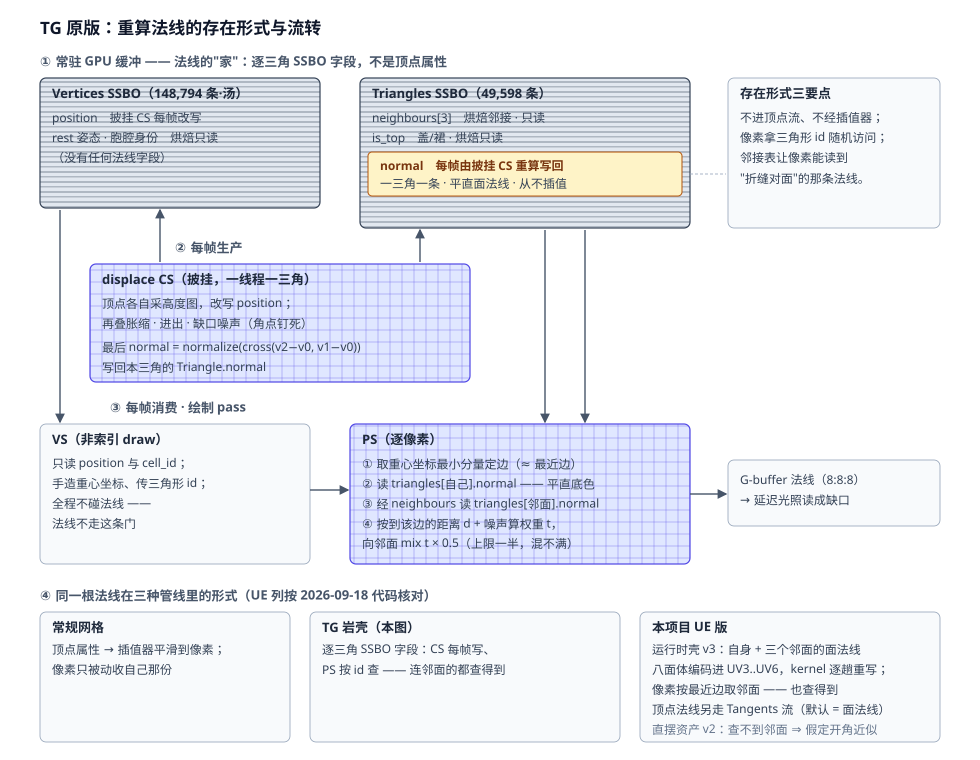
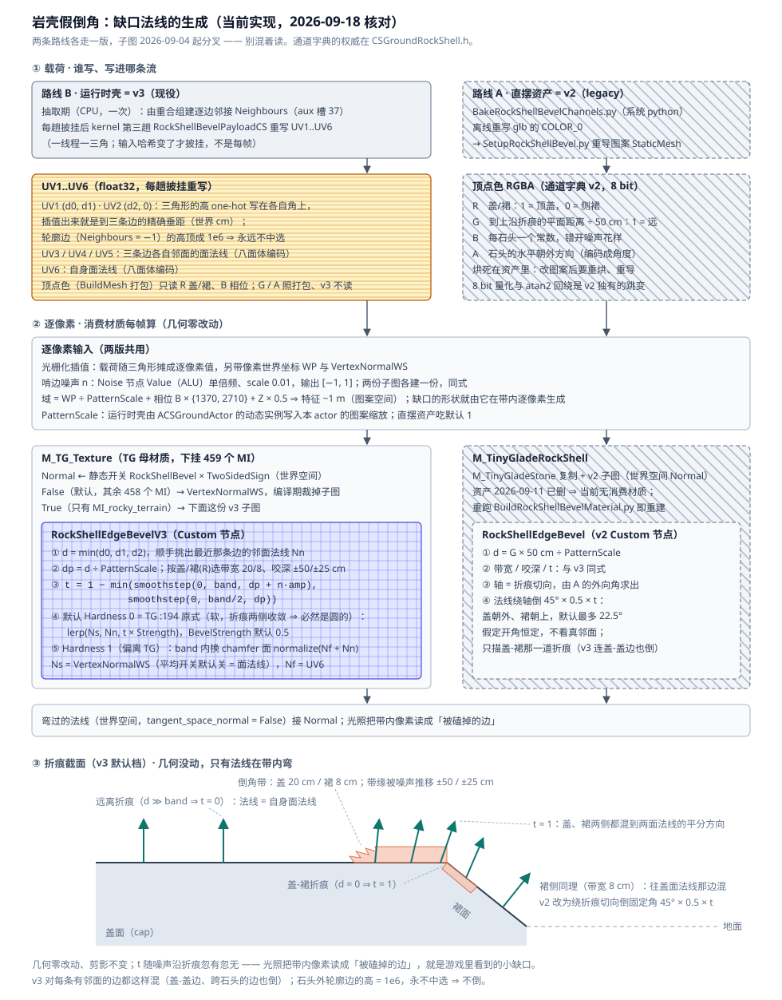

# 岩壳假倒角：TG 像素层缺口的 UE 落地

岩壳石头边缘的厘米级"小缺口"在 TG 里**不是几何**：网格布线均匀（轮廓顶点间距中位 1.1 m），
位移只买得起米级豁口。细缺口由绘制 PS 逐像素画出 —— 沿裂缝边的一条**噪声啃边假倒角**（法线
向邻面弯折）。本文记录该机制的证据、UE 侧的翻译决策与落地件。

两条生产路线各走一版，**别混着读**：

| 路线 | 载荷 | 消费材质 | 子图 | 状态 |
| --- | --- | --- | --- | --- |
| **B 运行时壳** | UV1..UV6，逐趟披挂由 kernel 重写 | `MI_rocky_terrain`（母材质 `M_TG_Texture`） | `add_bevel_subgraph_v3` | **v3，现役** |
| **A 直摆资产** | 顶点色 R/G/B/A，离线烘死 | `M_TinyGladeRockShell`（2026-09-11 已删，重跑下面的构建脚本即重建） | `add_bevel_subgraph` | **v2，legacy，当前无消费材质** |

两份子图都由 `Scripts/BuildRockShellBevelMaterial.py` 构建（幂等，可重跑）。通道字典的权威都在
`CSGroundRockShell.h`：v2 看 `VertexColor` 注释，v3 看 `namespace TexCoord`。本文不复述逐位定义。

## TG 原版机制（证据）

出处：`D:/MyProject/Tiny Glade/tmp/shaders/_rocky_terrain_rocky_terrain.raster.*.ps_main.glsl`（231 行，逐行读过）。
法线的存在形式与每帧流转（CS 写 SSBO 字段 → PS 按 id 查自己与邻面）见：



- 每像素用重心坐标（VS `:98` 手工制造 `gl_VertexIndex % 3`）选出最近的三角形边，
  经 `triangles[].neighbours` 拿到对面三角形，算到边线段的世界距离 `d`（`:152`）。
- 关键行 `:194`：`normal = mix(本面法线, 邻面法线, (1 − min(smoothstep(0, band, d + 130·snoise·amp), smoothstep(0, band/2, d))) × 0.5)`。
- `band`：盖-盖相邻边 0.2 m，其余 0.08 m（`is_top` 配对，`:160-168`）；噪声扰动 ±0.5 / ±0.25 m，
  simplex 域 = 世界 xz + `cell_id × 0.1` + `y × 0.5`（`:169`）—— 每块石头啃法不同。
- 石头外轮廓边（岛边界，`neighbours = -1`）法线混向零向量再归一化 = **不变** ⇒ 剪影上的豁口
  只来自顶点位移那层，两层各管各的。
- 该 PS 只绑一张 `rocky_terrain_texture`（三平面 albedo），**无法线贴图** —— 但 TG 别处有
  （`roof_tile_normal`、`stone_floor_normal` 等）；「无法线贴图」只对岩壳/墙砖管线成立。

⚠️ 由此订正合卷里「磕碰 100% 是几何」的措辞：**剪影 = 几何，面上缺口 = PS 假倒角**。

### 量纲关系：混合区不是「沿边一圈细带」

三个长度放在一起才看得出这套参数在做什么：

| 量 | 盖-盖 | 其余 |
| --- | --- | --- |
| `band` | 0.20 m | 0.08 m |
| 噪声幅度 `amp` | ±0.50 m | ±0.25 m |
| 贴边保底半径 `band/2` | 0.10 m | 0.04 m |
| **盖三角内切半径** | **≈ 0.36 m** | — |

内切半径 = 三角形内任意一点到最近边的**最大**距离（由抽取日志反算：跨度 13650 cm、27,566 个盖
三角 ⇒ 每个约 6759 cm²、等边边长 ≈ 1.25 m）。⚠️ 别拿边长 1.1 m 直接对 band 比 —— 面内根本
不存在离边 1 m 远的点。

两条结论：

1. **噪声幅度是 band 的 2.5 倍，也大于内切半径** ⇒ `d + noise` 在整个面上到处都可能落进带内。
   混合区是**覆盖大半个三角形的不规则斑块**，不是沿边一圈细带。代入盖三角正中（`d = 0.36`）：
   噪声 0 → 权重 0；噪声 −0.5 → 0.29；噪声 −1 → 0.5。
2. **`smoothstep(0, band/2, d)` 那一项与噪声无关** ⇒ `d < 0.1 m` 时无条件把权重推到 0.5，
   每条边的两侧必然被软化，噪声插不上手。

⚠️ 末尾那个 `× 0.5` 是**上限**：混合永远不会完全替换，所以两个面法线差得大的地方（真折痕）
混完仍然看得见。TG 没打算抹掉它 —— 实拍图里确实还能看到三角形接缝，这是它要的观感，
不是倒角失效。

## UE 翻译决策

| 方案 | 结论 | 理由 |
| --- | --- | --- |
| 材质读邻接 SSBO / 自定义 VF 出重心坐标 | 否 | 违反计划终局约束「材质必须是能直接挂在 StaticMesh 上的普通材质，不能依赖只有 gpumesh 代理才提供的逐图元数据」 |
| 屏幕空间 RT 装法线再采样 | 否 | 一产一销同频，物化稳亏：同样的数学一条不少，多付一遍几何、全屏带宽、每视图一份 RT；且观感寄生在场景侧 pass，`SaveToStaticMesh` 后失效 |
| 离线烘真 chamfer 拓扑 | 否 | 只买到「剪影圆角 + AO/接触阴影跟随 + 视差」三项，而剪影本项目**已经**由顶点位移给了，剩下两项不值 3× 三角 / 常驻 8.3 → 25 MiB 的价 |
| **逐顶点烘慢变量 + 材质逐像素算**（v1/v2） | 采用 | 顶点只装定位量（距离/相位/标志/方向），缺口形状由世界空间噪声在像素上生成，横向细度 = 像素。**直摆资产至今走这条** |
| **邻接进 UV + 逐趟披挂重写**（v3） | 采用 | UV 是标准流，同样不依赖只有 gpumesh 代理才有的逐图元数据 ⇒ 不违反终局约束；消掉 v2 的四类跳变。**运行时壳现役** |

v1 → v2 的演进（只与直摆资产有关，v3 把这两版的弯折方式整个换掉了）：

- **v1（绝对目标）**：盖侧 lerp 向水平外向、裙侧 lerp 向竖直向上。缺陷：壳披挂后盖裙夹角随
  坡度变（mask 门控下盖面天然倾 37°~51°），写死的世界方向带来 15°~25° 的系统性误差。
- **v2（相对旋转）**：把像素自己的法线**绕折痕切向轴**倒 `HalfDihedral × Strength × t`，
  盖往外倒、裙往上倒。相对自己的面旋转 ⇒ 披挂/胀缩/隆起后自动跟随；残余近似只剩
  「倒角开角恒定」（真实倒角本就如此）。轴由 A 通道的外向方向求出：`T = normalize(cross(up, o))`。

## 运行时壳：v3（现役）

v2 把邻接整个绕开了 —— 折痕位置烘成顶点色的慢变量，材质假定一个恒定半二面角把法线倒过去。
观感的主体确实拿到了，但下面四类跳变是**这个载荷本身**带来的，调参调不掉：

| 跳变 | 根因 | v3 怎么消 |
| --- | --- | --- |
| 法线方向的阶梯 | 顶点色是 `PF_R8G8B8A8`（`CSGpuMeshTypes.cpp:60`），A = 外向角 /2π ⇒ 1/255 ≈ 1.4° 一档 | UV 是 float32 |
| 每块石头绕一圈的明暗接缝 | 角度存成标量再插值，`atan2` 在 ±π 处回绕，插值扫过一整圈错误方向 | 存方向向量本身，不存角 |
| 折痕附近又起折痕 | G 是逐顶点距离线性插值，分段线性逼近距离场，三角边界处一阶不连续 | 垂距改解析式，精确 |
| 披挂后倒角开角失真 | 恒定 `BevelHalfDihedral`；实际盖裙夹角随坡度在 37°~51° 变 | 用真邻面法线，逐趟重写 |

### 前提：TG 那四条，这边全都满足

| TG 前提 | 本项目现状 |
| --- | --- |
| 非索引三角汤（三角形 id = `VertexIndex/3`，重心坐标 one-hot 可造） | 已经是。`CSGroundRockShell.cpp:541`「基底几何：三角汤，索引 0..V-1」，`FPattern::VertexCount == TriangleCount * 3` |
| PS 能寻址读顶点表 | **不需要了**，见「三条边的垂距」 |
| 逐三角邻接表 | 从 `IncidentRange` / `IncidentTris`（槽 35/36，逐角重合组的入射三角表）导出，抽取期算一次 |
| 拓扑不变 | 图案是常量，变的只是每趟披挂后的位置 |

多 UV 通路也已经通了 —— `CSGpuMeshTypes.cpp:44` 的 `ElementsPerUnit = 2 * Clamp(NumTexCoordSets, 1u, MaxTexCoordChannels)`
（单条流交错承载 N 组，正对上引擎 manual fetch 的取数方式），`CSGpuMeshSceneProxy.cpp` 的 TexCoord
分支逐组挂 stream component、SRV 只设一次，回读侧 `CSMesh.cpp:755-767` / `:815-822` 与
`UCSMeshOps::EnsureTexCoordSets` 齐活。房体已经在用 2 组。

### 通道布局

`FCSMeshStreamLayout::NumTexCoordSets = 7`（= `TexCoord::NumSets`），字典的权威在
`CSGroundRockShell.h` 的 `namespace TexCoord`：

| 组 | 内容 | 谁写 |
| --- | --- | --- |
| UV0 | `World.XY / UVWorldPeriod`，三平面贴图用 | CPU（`BuildMesh`） |
| UV1 | `(d0, d1)` 世界 cm | kernel 第三趟 |
| UV2 | `(d2, 0)` 世界 cm，y 留白 | kernel 第三趟 |
| UV3 / UV4 / UV5 | 八面体编码的邻面法线，对应边 0 / 1 / 2 | kernel 第三趟 |
| UV6 | 八面体编码的**自身**面法线 | kernel 第三趟 |

合计 14 个 float / 顶点。`MaxTexCoordChannels` 由 4 抬到 8（= 引擎天花板 `MAX_STATIC_TEXCOORDS`，
`Components.h:22`），所以 7 组装得下，UV0 都不必腾。

⚠️ 第 5 组起**只经 manual fetch 的 SRV** 到达 shader：顶点声明侧最多 4 个 stream component
（`FStaticMeshDataType::TextureCoordinates` 是 `TFixedAllocator<MAX_STATIC_TEXCOORDS / 2>`，
`Components.h:46`），钳位与其前提（本插件只面向 SM5+ ⇒ `MANUAL_VERTEX_FETCH` 恒开）写在
`CSGpuMeshSceneProxy.cpp` 的 `ECSGpuStreamRole::TexCoord` 分支。在本项目内不产生限制。

烘死的只有邻接表本身：`FPattern::Neighbours`，逐三角 3 个 `int32`（`-1` = 轮廓边），走 aux 槽 37。
边由两端**重合组** id 的无序对定义 —— 与法线平均那张表同一份量化键，抽取期一起算。
原件约 149 k 个 int32 ≈ 0.6 MB。

### 三条边的垂距不需要邻顶点位置

顶点 `i` 上写 one-hot 的**三角形高** `(h₀,0,0)` / `(0,h₁,0)` / `(0,0,h₂)`（`hᵢ` = 顶点 `i` 到对边的高），
插值出来的三元组逐分量**就是**该像素到三条边所在直线的垂距：到直线的距离是重心坐标的仿射函数，
在对边两端点为 0、在顶点 `i` 为 `hᵢ` ⇒ 在重心 `(λ₀,λ₁,λ₂)` 处等于 `λᵢ·hᵢ`。光栅化插值是透视校正的，
所以这是**世界口径的精确值，不是近似**。一个 interpolator 顶掉 TG 的重心坐标 + 三次 SSBO 位置读取 +
投影 clamp（经典的 single-pass wireframe 技巧）。

顺带比 TG 更准：TG 用 `min(min(C2.x, C2.y), C2.z)` 在**原始重心坐标**上选最近边
（`ps_main.glsl:104`），各向异性三角形上 `min λ ≠ min λ·h` ⇒ 它会选错边；v3 直接对真实垂距取 min。

⚠️ 这给的是到**直线**的距离，TG 取的是**线段**距离（`:152` 有 `clamp(t,0,1)`）。钝角三角形上垂足会
落到线段外，差异只在距顶点一个 `band` 之内。

轮廓边（`Neighbours = -1`）的「高」被 kernel 顶成 `1e6`，于是 `d = λ·h` 几乎处处远大于 band，
材质那个 min 永远选不到它，**倒角带在石头外沿自然收口**。TG 是**选完**最近边才发现没邻居、
那一带于是整个不倒角，留下一道突兀接缝；这里比它干净。残留只有正好落在该边上的一条亚像素
细缝（λ = 0 ⇒ d = 0）。

### 邻面法线必须逐趟披挂重写

烘死的邻面法线到运行时是**错的** —— 壳每趟 dispatch 被地形重新披挂，盖裙夹角随坡度变，v1 正是
栽在这（15°~25° 的系统性误差）。所以 UV 在这里不是烘焙常量，而是**一条可写的 GPU 流**：第三趟
`RockShellBevelPayloadCS`（一线程一三角）与第二趟并列跑在披挂之后 —— 两者互不依赖（一个写切线、
一个写 UV），共同的前置只有 Positions 的 UAV→SRV 转换，由 RDG 自己排。

这与 TG 同构 —— `Triangle.normal` 由 `displace_rocky_terrain.cs` 每帧重写，**只有 `neighbours` 是烘死的**。
代价已经被现场注释点名：`CSGroundRockShell.cpp:566`「`Displace` 只声明了 Positions/Tangents 两个 UAV，
多写一条流就要动那份声明」。

⚠️ 第三趟**不受 `bRockShellSmoothNormals` 门控**，只在邻接流或 UV 流缺席时安静跳过
（`CSGroundRockShell.cpp:852`）。跳过时 UV1..UV5 留在 `BuildMesh` 给的全 0 上，而 **0 会被材质读成
「贴边」⇒ 整壳满脸倒角**。见「当前欠账」里的同名风险条。

### 硬边：自身面法线与 `BevelHardness`

`lerp(Ns, Nn, t)` 在折痕两侧都收敛到同一个值（两侧的 `t` 同时 → 1，而 `Ns`/`Nn` 恰好互换），
恒等于 C0 连续 —— **数学上必然是圆的**。要让材质画得出硬边，就必须有一个「本三角自己的朝向」
能在跨边时发生跳变，那就是 UV6 的自身面法线 `Nf`：

```text
Nb   = normalize(Nf + Nn)              # chamfer 小面的法线，逐三角常数
Hard = lerp(Ns, Nb, step(HardThreshold, t))
```

band 外 → `Ns`（平滑）；band 内 → `Nb`（常数，不随像素变）⇒ **band 的两条边界各是一道真硬边**，
而边界位置本身由噪声决定，所以啃出来的缺口边缘也是硬的。

`BevelHardness` 在两支之间插值：

- **`0` = 默认 = TG 原式**（`mix(自身法线, 邻面法线, t × Strength)`，纯软混合）。
- `1` = band 内取 chamfer 小面的常数法线，两条边界各一道真硬边。**这一档偏离 TG**。

⚠️ **两档的可调旋钮不是同一组**：`BevelStrength` 只作用在软支（chamfer 小面是满强度的，
「倒一半」对一个平面没有意义），`BevelHardThreshold` 只作用在硬支。所以默认档（`Hardness = 0`）
下调 `BevelHardThreshold` 不会有任何变化，要调观感请动 `BevelStrength` 与两组
`BevelBand*` / `BevelNoiseAmp*`。

### 消费材质：`M_TG_Texture` 上的静态开关 `RockShellBevel`

演示关卡的地面 `RockShellMaterial` 是 `MI_rocky_terrain`（TG 的岩地贴图 + 裙压暗），它的母材质
`M_TG_Texture` 下面挂着 459 个 MI。倒角子图因此**嫁接进母材质的 Normal 引脚**，沿用裙压暗那条
「默认关、只有 `MI_rocky_terrain` 打开」的守卫模式，但守卫是**静态开关**而不是标量：

```text
Normal ← StaticSwitchParameter "RockShellBevel"（默认 False，组 Rock Shell）× TwoSidedSign
          True  → RockShellEdgeBevelV3（世界空间法线）
          False → VertexNormalWS
tangent_space_normal = False
```

- 开关关着的 458 个 MI：Normal = `VertexNormalWS × TwoSidedSign`。静态开关在编译期把整棵倒角
  子图裁掉，它们的 shader 一条指令都不多付。
- ⚠️ `TwoSidedSign` 那个乘法是**必须的**：引擎只给**切线空间**法线乘它
  （`MaterialTemplate.ush`：`#if MATERIAL_TANGENTSPACENORMAL ... WorldNormal *= TwoSidedSign`），
  而母材质是 two-sided、这里输出的是世界空间法线 ⇒ 背面的翻号得自己补。补上之后关着的那支
  与 Normal 不接时引擎算出的向量逐位同义，458 个 MI 的正反面着色都不变。
- `MI_rocky_terrain`：`RockShellBevel = True`，另外一个 shader 排列。
- 构建脚本 `graft_rockshell_bevel_into_master()`，幂等：Normal 上已经是本脚本的开关就整棵删了
  重建；接着别的东西则报错退出、不覆盖。

### 逐像素核心（v3）

Custom 节点 `RockShellEdgeBevelV3`，常数照抄 TG：

```hlsl
float3 d3 = float3(D01.x, D01.y, D2.x);                      // one-hot 三角形高插值出的精确垂距（世界 cm）
float  d  = min(min(d3.x, d3.y), d3.z);                      // 最近边；轮廓边的高是 1e6，永远不中选
float2 e  = (d == d3.x) ? N0 : ((d == d3.y) ? N1 : N2);      // d 是三者之一的原值 ⇒ 相等比较精确
float3 Nn = normalize(OctDecode(e));                         // 邻面的面法线
float3 Nf = normalize(OctDecode(FaceN));                     // 自身的面法线（UV6）
float3 Ns = normalize(NormalWS);                             // 顶点法线：平均那趟开着才是平滑的

float dp   = d / max(PatternScale, 1e-3);                    // 世界 cm → 图案 cm，再套 TG 常数
float band = CapF > 0.5 ? BandCap : BandSkirt;               // 20 / 8 cm
float amp  = CapF > 0.5 ? AmpCap  : AmpSkirt;                // 噪声咬深 ±50 / ±25 cm
float t    = 1.0 - min(smoothstep(0.0, band, dp + NoiseVal * amp),
                       smoothstep(0.0, band * 0.5, dp));     // 贴边保底 + 噪声参差（TG :194 原式）

float3 Soft = lerp(Ns, Nn, t * Strength);                    // TG 原式，混向邻面 ⇒ 必然是圆的
float3 Nb   = normalize(Nf + Nn);                            // chamfer 小面法线；对折退化时退回 Nf
float3 Hard = lerp(Ns, Nb, step(HardThreshold, t));          // step 不做渐变 ⇒ 两条边界各一道硬边
return normalize(lerp(Soft, Hard, saturate(Hardness)));
```

八面体解码在 Custom 节点里照抄了两遍 —— HLSL 不能在 Custom 节点内定义辅助函数。编码见
`CSGroundRockShell.usf::CSRockShell_OctEncode`。

噪声：材质 `Noise` 节点，Value（ALU）单倍频、`scale 0.01`（域单位图案 cm ⇒ 特征 ~1 m），
域 = 世界 XYZ / PatternScale，再加相位 × {1370, 2710} 与 Z × 0.5（对应 TG 的 `cell_id×0.1` 与 `y×0.5`）。

材质参数（组 `Rock Shell`，MI 可调）：

```text
RockShellBevel        = False  # 静态开关（只在 M_TG_Texture 上有）；MI_rocky_terrain = True
RockShellPatternScale = 1      # 图案缩放；由 ACSGroundActor 的动态实例写入，别手填
BevelBandCap          = 20     # 盖侧带宽，图案 cm
BevelBandSkirt        = 8      # 裙侧带宽，图案 cm
BevelNoiseAmpCap      = 50     # 盖侧咬深，图案 cm
BevelNoiseAmpSkirt    = 25     # 裙侧咬深，图案 cm
BevelStrength         = 0.5    # 软支的弯折比例，TG = 0.5；Hardness = 1 时无效
BevelHardness         = 0      # 0 = TG 原式（软混合）；1 = 硬边 chamfer（偏离 TG）
BevelHardThreshold    = 0.5    # 硬支里 band 内哪一段算 chamfer 面；Hardness = 0 时无效
```

⚠️ v3 **没有** v2 的这三个：`BevelDistMax`（垂距直接是世界 cm，不再归一）、`BevelThetaFlip` /
`BevelHalfDihedral`（混向真邻面，不再需要外向角与假定半二面角）。`M_TinyGladeRockShell` 上
仍然带着它们 —— 那是 v2 的参数面，别去对齐。

### 落点

| 层 | 改动 |
| --- | --- |
| 抽取期 | `CSRockShell_ExtractPattern` 复用重合组建逐边邻接；日志新增「轮廓边 N 条、非流形丢弃 M 条、跨胞腔 K 条」 |
| 数据 | `FPattern::Neighbours`、`EAuxSlot::Neighbours = 37`、`namespace TexCoord`、`Layout.NumTexCoordSets = 7` |
| kernel | `CSGroundRockShell.usf` 第三趟 `RockShellBevelPayloadCS` + `CSRockShell_OctEncode` / `CSRockShell_TriFaceNormal` |
| 派发 | `FCSRockShellBevelPayloadCS`，接在第二趟之后（不受 `bSmoothNormals` 门控） |
| 材质 | `BuildRockShellBevelMaterial.py::add_bevel_subgraph_v3`，只嫁接进 `M_TG_Texture` |
| 底座 | `CSMesh.cpp` 交错多组 UV 的回读修复；`MaxTexCoordChannels` 4 → 8 |

⚠️ 底座那条顺手修的是一个**既有缺陷**：`CSMesh.cpp` 的 TexCoord 消费原本按 `TexCoordIndex`
数通道、按 stride 2 取数，两条都不认交错多组 —— 于是 N ≥ 2 的网格回读 / `SaveToStaticMesh`
之后 UV1 起全丢，连 UV0 都从第 1 个顶点起错位，且无任何报错。**房体（2 组）当时就踩着它。**

## 基础法线：平均那一趟（默认关 = TG 原样）

倒角子图读的 `Ns = VertexNormalWS` 从哪来，由 `ACSGroundActor::bRockShellSmoothNormals` 决定：

| 开关 | 顶点法线 | 观感 |
| --- | --- | --- |
| **关（默认）** | 第一趟写的**逐三角面法线** | 与 TG 一模一样（TG 只有一趟，`_rocky_terrain_displace.cs:768` 每三角 `normalize(cross(...))`，全程不平滑）。每三角一道硬边 ⇒ 盖面在缓坡上被地形弯出的起伏读成刻面 |
| 开 | 第二趟 `AverageRockShellNormalsCS` 按静止姿态的**重合组**做面积加权平均，带夹角阈值 | 刻面消失；折痕因二面角远大于阈值仍是硬边 |

**默认关是 2026-09-04 的裁决**（用户：先按 TG 的方案做一版）。打开 = 我们比 TG 多的那一层，
这一个勾就是「TG 原样」与「阈值平滑版」的 A/B 开关，切换由参数哈希覆盖、不用重编。

`RockShellSmoothAngleDeg`（默认 30，沿用 Houdini 原型的 `cuspangle=29.9`）：入射三角的面法线与
本三角面法线夹角超过它就不参与平均，于是那条边在**几何这一层**重新是硬边。两端是有意义的
调试档：`0` = 只认自己（等价于关掉开关）；`180` = 全平均。判据只需要逐角的重合组表 —— 这一趟
本来就在读每个入射三角的位置，一行点积、零额外烘焙、零额外 dispatch。

⚠️ **重合组跨胞腔**：实测 74,180 条内部边里有 8,743 条跨胞腔（11.8%），相邻石头**确实共享顶点**，
所以这一趟开着时会跨石头做平滑。阈值一并管住了这里 —— 石头之间的夹角通常远大于 30°，自动断开。

⚠️ 平均关着时 **UV6 与 `VertexNormalWS` 逐位等价**（顶点法线就是面法线），那 2 个 float / 顶点
在复制顶点法线。它只在打开平均后才变必需，所以不能删，属于跟着这个开关走的账。

## 尺度：常数是图案口径，材质自己换算

带宽 20/8 cm、咬深 ±50/25 cm、噪声特征 ~1 m 全是 TG 原生的**图案空间**口径（5.53 m 胞腔）。
演示关卡的 `RockShellPatternScale` 是 0.35 / 0.72，胞腔只有 1.9 m ~ 4 m，照抄世界 cm 会让
50 cm 的咬深吃掉半个盖面。所以材质带一个标量 `RockShellPatternScale`（默认 1），逐像素把
世界距离与世界坐标**除回图案空间**再套 TG 常数 ⇒ 缺口随胞腔一起缩。

写入方：`ACSGroundActor::EnsureRockShellMesh` 给 `RockShellMaterial` 造一个动态子实例
`RockShellMaterialInstance`，只写这一个标量，挂到渲染组件的 `MeshMaterial`；网格的
`Materials[0]` 仍是资产本身（`SaveToStaticMesh` 带走的是它，瞬态实例进不了资产）。
父材质换了才重建实例，缩放变了只改标量。直摆资产（Scale = 1）吃材质默认值。

## 直摆资产：v2（legacy）

直接摆放的图案 StaticMesh 上**没有 v3 那几条 UV**，所以这条路继续走顶点色载荷。两份子图
就此分叉，v3 的任何改动都不会自动跟过来。



生产：`Scripts/BakeRockShellBevelChannels.py`（系统 python，读 glb 重写 `COLOR_0`）→
`Scripts/SetupRockShellBevel.py` 重导。四个逐顶点量打包进顶点色：

```text
R = bIsCapTri            # 1 = 盖 / 0 = 裙
G = 到盖轮廓的平面距离    # saturate(世界 cm / RimDistMaxCm=50)，1 = 远 = 中性
B = 逐石头相位            # fract(cell_id × 0.618)，噪声域偏移
A = 外向方向角            # atan2(外向) / 2π，盖侧法线弯的目标
```

距离**只在图案平面（XY）里量**：裙面静止姿态竖直展开 3.12 m、运行时被高度替换压扁，
量三维距离会让整张裙读成"远"。中性值规则：无色流 = 白 = `G=1` ⇒ 倒角强度恒 0，
共享母材质的其它 MI 逐像素不变。

消费材质 `/PCGPlugins/HouseTest/M_TinyGladeRockShell`，由 `M_TinyGladeStone` 复制后加装 v2 子图
（`build_rockshell_bevel_material()`；资产 2026-09-11 已删，下面是重跑脚本时的建法）。复制时把 Stone 的明度抖动
`lerp(0.88, 1.12, PerInstanceRandom + VertexColor.A)` 改成只读 `PerInstanceRandom`：字典 v2 的
A 是外向角 θ，再让它进明度会绕每块石头扫出一圈明暗和一道接缝。Stone 原来接在 Normal 上的
三平面法线贴图随之被顶掉，直摆看图不需要它。

### 逐像素核心（v2）

Custom 节点 `RockShellEdgeBevel`：

```hlsl
float d    = DistN * DistMax / max(PatternScale, 1e-3);      // 顶点插值距离 → 世界 cm → 图案 cm
float band = CapF > 0.5 ? BandCap : BandSkirt;               // 20 / 8 cm
float amp  = CapF > 0.5 ? AmpCap  : AmpSkirt;                // 噪声咬深 ±50 / ±25 cm
float t    = 1.0 - min(smoothstep(0.0, band, d + NoiseVal * amp),
                       smoothstep(0.0, band * 0.5, d));      // 贴边保底 + 噪声参差（TG :194 原式）
float3 o    = float3(cos(th), ThetaFlip * sin(th), 0.0);     // 外向（A 通道解码）
float3 T    = normalize(cross(float3(0,0,1), o));            // 折痕切向：恒水平 ⊥ 外向，永不退化
float3 axis = CapF > 0.5 ? T : -T;                           // 盖往外倒 / 裙往上倒
float ang   = HalfDihedral * (PI/180) * Strength * t;        // 默认 45° × 0.5 × t
float3 N = normalize(NormalWS); float s, c; sincos(ang, s, c); // Rodrigues 绕轴旋转
return normalize(N*c + cross(axis,N)*s + axis*(dot(axis,N)*(1-c)));
```

材质参数（组 `Rock Shell`）：

```text
RockShellPatternScale = 1      # 图案缩放
BevelBandCap          = 20     # 盖侧带宽，图案 cm
BevelBandSkirt        = 8      # 裙侧带宽，图案 cm
BevelNoiseAmpCap      = 50     # 盖侧咬深，图案 cm
BevelNoiseAmpSkirt    = 25     # 裙侧咬深，图案 cm
BevelDistMax          = 50     # G 通道归一上限（世界 cm），必须 = VertexColor::RimDistMaxCm
BevelThetaFlip        = 1      # 导入轴翻转时改 -1（症状：盖侧倒角弯向石头内侧）
BevelStrength         = 0.5    # 弯折比例，TG = 0.5
BevelHalfDihedral     = 45     # 度：满强度时相对自己的面倒过去的角
```

## 校准与验收

- **ThetaFlip（只有 v2 需要）**：摆一块图案 StaticMesh，看盖面折痕处的受光 —— 倒角应读成
  「边被磕掉」（亮暗随外向翻转）；弯向内侧则把 `BevelThetaFlip` 改 −1。烘焙 θ 经过 glTF→UE
  轴变换，符号离线不可判定，这一位是唯一的人工校准点。运行时壳不涉及。
- **中性短路（v2）**：把 `BevelDistMax` 临时调成 0.01 ⇒ 全体像素 `d≈0`，整壳应现出均匀倒角带；
  调回 50 后远离折痕的面必须完全干净。
- **改图案后**：重跑 `BakeRockShellBevelChannels.py` → `SetupRockShellBevel.py`（路线 A）；
  路线 B 编译后自动跟随（抽取现算，无烘焙依赖）。两份材质都由
  `Scripts/BuildRockShellBevelMaterial.py` 构建（setup 复用同一份；`ROCKBEVEL_SKIP_REIMPORT=1`
  跳过重导）。
- **直摆资产必看**：盖三角绕序朝下（运行时 kernel 自己翻，直摆没人翻）—— StaticMesh 直接
  放场景要给 actor `scale.z = -1`（Z 镜像不动 XY ⇒ θ 语义不变），否则从上方整张被背面剔除。
- 逐通道诊断材质 `/PCGPlugins/HouseTest/M_RockShellChannelDebug`（unlit，Emissive=G）2026-09-11 已删；
  要用从插件 git 取回：`git checkout 4820ca3 -- Content/HouseTest/M_RockShellChannelDebug.uasset`。
- 烘焙实测基线（原件）：609 胞腔全部有盖、轮廓线段 10,988 条、折痕距离中位 0.195 m
  （= 裙圈 19.5 cm 错开，数据自洽）、25 cm 带内顶点 62.6%。

## 已知取舍与残余差异

v2（直摆资产）独有的近似：

- 折痕距离是**顶点插值近似**（1 m 顶点距 × 0.2 m 带宽），角点附近略糊；TG 是逐像素精确解。
- 盖面内部小折痕的微倒角丢失（TG 靠真邻面法线白拿的部分）—— 该成分本就弱。
- 运行时形变（`CellExpand` / `CellJitter` 等）不回写距离（±10% 量级，带宽下不可见）；
  v3 的垂距每趟重算，不受影响。

两版共有：

- 石头间缝隙两侧不受影响，与 TG 一致（那边轮廓边也不倒角）。
- 角点附近「最近边」硬切换没消，**TG 也有**。三个邻面法线都在手上，将来可以按三条垂距做
  加权混合而不是硬选 —— 比 TG 好且不额外花钱，尚未做。
- 直线距离 vs TG 的线段距离，见「三条边的垂距」。
- **跨胞腔的 8,743 条边照常倒角**（2026-09-05 裁决：留着）。`Neighbours = -1` 只覆盖整块图案的
  外轮廓（434 条，≈ 13650×4 cm 周长 ÷ 126 cm 顶点间距，自洽）。理由：图案资产来自 TG 原件，
  TG 那边同样会倒，照抄。
- 壳烘成 StaticMesh 后没有动态实例，`RockShellPatternScale` 退回材质默认 1 ⇒ 缺口按 5.53 m
  胞腔的口径画。要保真得给烘出来的网格挂一个把该参数填成当时缩放的 MI。

## 着色路线的边界（不做拓扑的已知代价）

法线只改**着色**不改**几何**。留在这条路上，以下三项永远拿不到，调参没有意义：

| 项 | 现状 |
| --- | --- |
| 剪影 / 轮廓 | **不丢** —— 豁口剪影本来就由顶点位移那一层给（与 TG 同构：剪影 = 几何，面上缺口 = PS 假倒角） |
| 深度缓冲派生的一切 | **丢** —— SSAO / SSR / TAA velocity / 阴影图都读几何深度，倒角在法线里有、在深度里没有 ⇒ 折痕的 AO 仍按尖角算，接触阴影边缘仍是硬折线 |
| 视差 | **丢** —— 真倒角会让表面挪位，法线不动一个像素，掠射角最明显 |

⚠️ 反过来也要记住：**面内的漫反射与高光，法线基本是精确的** —— 改拓扑在这一项上买不到
额外的东西。所以「刻面」这类问题不属于本表，它是**基础法线**那一层的事，与做不做拓扑无关。

## 当前欠账

- **零单测**：四个 RockShell 自动化测试无一触及 `Neighbours` / `TexCoord` / 垂距，也没有测试
  调用 `ExtractPattern`。关卡回归脚本只验图案资产自己的 UV，与运行时载荷无关。
- **零出图**：v3 落地后没有任何截图。默认值那组是 v2「绕假想轴倒固定角」时标的，v3 换成混向
  真邻面后同一个 `t` 给出的观感不是一回事 ⇒ **默认值仍待重标**，前置是先出图。
- **v2 死负载**：v3 材质只读顶点色的 R（盖/裙）与 B（相位），**G / A 在运行时壳上已无消费者**，
  但抽取期仍在算 `SourceRimDistCm`（逐顶点 × 本胞腔全部轮廓线段的最近点循环）、`BuildMesh`
  仍在打包。⚠️ 别直接删 —— 删了就没法在运行时壳上退回 v2 做 A/B。
- **全 0 = 贴边的风险**：邻接流缺席时第三趟安静跳过，UV1..UV5 留在全 0 上会被材质读成「贴边」，
  症状是整壳满脸倒角。唯一防线是「`RockShellBevel` 静态开关只在运行时壳的 MI 上开」这个**约定**，
  不是机制，而且这条路径没有测试覆盖。
- **常驻成本**：7 组 UV = 14 float / 顶点 = 56 B / 顶点。按 149 k 顶点算 **UV 流常驻 ≈ 8.3 MB**
  （邻接表另算 0.6 MB）。与当初否掉「离线烘真 chamfer 拓扑」时嫌弃的 8.3 → 25 MiB 是同一量级
  的账，重标默认值时值得一起看。

## Open Questions

- **基础法线要不要从 CS 搬进材质。** 材质手里已经有三个邻面法线（UV3~UV5）+ 自身面法线（UV6），
  理论上能在像素上算出平滑基法线，把第二趟 CS 整个省掉。⚠️ 但两者**不等价**：重合组平均是
  跨三角的（盖面细碎处一个角常入射 5~6 个三角），而 UV 里只有 3 个直接邻面 —— 材质端能做的
  是更窄的一环核。要不要接受这个差异未定。
- **角点处理**要不要从硬选最近边升级成按三条垂距加权混合（TG 是硬选）。
- **路线 A 要不要也改用 UV 载荷。** 直摆资产今天靠顶点色（8 bit / 通道）喂 v2 子图；如果给它的
  StaticMesh 也烘上 v3 那 6 组 UV，就能直接用 v3 子图，两份材质合并成一份、以后只维护一处。
  代价是烘焙脚本要改（现在只重写 `COLOR_0`），且直摆资产不披挂 ⇒ 邻面法线可以烘死、不需要
  第三趟 kernel。**不做也行** —— 顶点色对静态资产够用，分叉的成本只是「改 v3 时记得看一眼 v2」。

已裁决、不再讨论：

- **跨胞腔边留着倒角**（2026-09-05）。同一判据也适用于法线平均那一趟。
- **`BevelStrength` 不分盖-盖 / 盖-裙两档**（2026-09-05）。TG 的噪声强度分了 0.5/0.25，混合比例
  它自己也没分，照抄。
