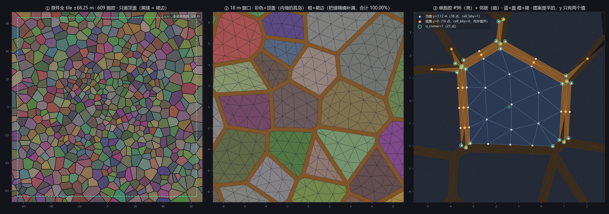
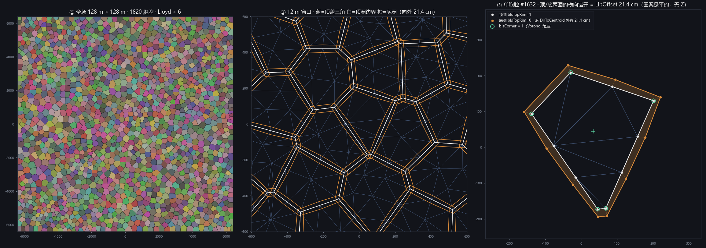

# 披挂岩壳的碎裂图案：用 Tiny Glade 原件

链 B「侧面碎石：Tiny Glade 式披挂岩壳」的**唯一离线输入**。图案不用自己烘 —— TG 自己那张
已经被提取成 glTF，本文写清它里面到底有什么、怎么导进 UE、每个契约字段从哪个通道来、
以及下一位写 kernel 的人必须知道的事。

设计裁决在 [`TinyGladeHouse_Plan.md` § D9「侧面碎石」](TinyGladeHouse_Plan.md)，本文不重复裁决。
TG 侧的逆向口径在 [`CSGroundShaper.md` 的「对照 Tiny Glade」](CSGroundShaper.md)
—— ⚠️ **那一节有五处与原件实测不符，本文「实测推翻的五条」一节逐条列出，没有擅自改动那份文档。**

| 产物 | 路径 |
| --- | --- |
| 原件 | `D:/MyProject/Tiny Glade/extracted/meshes/rocky_terrain_shell.glb`（7,738,636 B） |
| 导入脚本 | `Plugins/PCGPlugins/Scripts/TinyGladeImportRockShell.py`（UE 编辑器里跑） |
| 核对脚本 | `Plugins/PCGPlugins/Scripts/VerifyRockShellGlb.py`（离线，无第三方依赖） |
| 预览图 | `Plugins/PCGPlugins/Docs/TinyGlade/CSRockShellPattern.preview.png` |
| 后备生成器 | `Plugins/PCGPlugins/Scripts/BakeRockShellPattern.py`（**只在原件不可用时**用） |



**本文所有实测数字都由 `VerifyRockShellGlb.py` 产出。** 改了下面任何一张表，先重跑它。

⚠️ **别拿错文件**：`assets/meshes/terrain_rocks.json` 是 ±430 m 的**背景岩石**（零 cell 属性），
已经导在 `/Game/TinyGlade/Meshes/terrain_rocks`，**不是这一份**。本文讲的是
`assets/data/rocky_terrain.json` 经 `extract/rocky_terrain2glb.py` 导出的
`rocky_terrain_shell.glb`。`MESH_GENERATION_ANALYSIS.md` §7.2 把属性挂在了错的文件名下。

## 这是什么，不是什么

- **是**一张平的 2D 碎裂图案：顶圈（cap，`y = 3.12 m`）+ 横向向外错开的底圈（skirt，`y = 0`），
  **只有这两个 y 值**（实测，零例外），非索引三角汤。
- **不是**几何：y 在运行时被整个丢弃替换。三维形态 100% 由披挂产生（裁决一）。
- **不是**一堆独立石头：盖 + 裙组成一张开放曲面，没有底、不封闭。
- 裙边高度烘焙侧一行都没算 —— 两圈各自采自己 XY 的高度，竖直高度是副产品（裁决四）。

## 原件实测：与 `CSGroundShaper.md`「烘焙资产」表逐项对照

八项全中：

| 项 | 文档 | 实测 |
| --- | --- | --- |
| 顶点 / 三角 / 胞腔 | 148,794 / 49,598 / 609 | 148,794 / 49,598 / 609 |
| 盖三角 `is_top = 1` | 27,566 | 27,566（三顶点全在顶圈，反例 0） |
| 裙三角 `is_top = 0` | 22,032 | 22,032（每一个都跨两圈，反例 0） |
| 顶圈 / 底圈顶点 | 115,718 / 33,076 | 115,718 / 33,076 |
| `is_corner = 1` | 28,669（19.3%） | 28,669（19.3%） |
| tile 跨度 | ±68.25 m | ±68.25 m（POSITION 已含 ×65） |
| 两个 y 值 | `0.048` / `0` tile | `3.12` / `0` m = `0.048` / `0` tile |
| `cell_id` | 逐胞腔序号 | 0..608 连续，609 个 |

容器：单 mesh 单 primitive、`mode = 4`（TRIANGLES）、**无索引缓冲**、零材质，
六条通道 `POSITION / NORMAL / TEXCOORD_0..2 / COLOR_0`。

## 实测推翻的五条（`CSGroundShaper.md` 与计划契约都要按这个读）

这五条全部来自 `VerifyRockShellGlb.py` 对原 GLB 的直接测量，**没有推断成分**。
按裁决纪律，本文只报告冲突，未改动 `CSGroundShaper.md` 与计划。

### 1. `dir_to_centroid` 指向质心，与契约写的符号**相反**

实测 `dot(TEXCOORD_0, normalize(质心 − P))` 中位数 **+0.9996**，**100.0%** 的顶点为正。
向量恰好单位长（min = median = max = 1.000000）。

- `CSGroundShaper.md` 与计划 `FBakedVertex` 都写 `= normalize(@P − v@center)`（朝外）。名字才是对的。
- **后果**：计划 kernel 骨架的 `XY += DirToCentroid * CellJitter * (rand*2−1)`，正的 `CellJitter`
  会让胞腔**收缩**而不是胀大。TG ④ 的 `rest_position + dir_to_centroid * 0.001 * mix(-3, 8, rand)`
  因此是「最多缩 0.52 m、最多胀 0.195 m」，`CSGroundShaper.md` 写的「−0.195 .. +0.52 m」符号是反的。

### 2. `cell_bby` 就是 `bIsTopRim`，不是逐胞腔的凹/凸标记

实测 `(所在环, cell_bby)` 的联合分布只有两项：`(顶圈, 1.0): 115,718` 与 `(底圈, 0.0): 33,076`。
**零例外。** 而按胞腔分组时只有 **80/609** 个胞腔取值唯一 —— 它根本不是逐胞腔量。

- `CSGroundShaper.md` 读作「0 / 1 = 本胞腔沿地形法线【凹】还是【凸】」。
- **好消息**：契约里的 `bIsTopRim` **原件已经现成带着**，不用另外推导。
- **对 TG `displace:577` 的重读**（这一句是推断）：`mix(-0.3, 0.1*mix(0,3,rand(cell)), cell_bby)`
  于是等于「底圈沿地形法线沉 0.3 m，顶圈浮 0..0.3 m（逐胞腔随机）」——
  即给壳一个沿法线的**厚度**，而不是「有的胞腔沉、有的凸」。这才是「块感」的来源，
  也解释了为什么计划 P3 把它列为「让壳读成一块块石头而不是一张毯子」的那一层。

### 3. `LipOffset` 是 19.5 cm，不是 21.4 cm

底圈点到同胞腔盖边界最近点的距离：**众数 19.50 cm（3,910 / 5,131 个点）**，
p25 = 中位 = p75 = 19.50 cm，= **0.00300 tile 单位**。方向朝外（背离质心）5,131 / 5,131。

计划裁决四与 `CSGroundShaper.md` 写的是「TG 实测中位 21.4 cm = 0.0033 tile」。
实测 0.0030，差 9%。**这个常量已经烘在原件坐标里，运行时不需要它** ——
但计划正文引用了它，且后备生成器用它做参数，两处都该按 19.5 cm 订正。

### 4. 绕序：盖三角在 glTF 约定下朝 **+Y**，不是 −Y

`cross(b−a, c−a).y > 0` 的盖三角 **27,566 / 27,566**，朝 −Y 的 **0** 个。
存储的 `NORMAL` 与几何法线不一致的三角 **0** 个。

`CSGroundShaper.md`「已提取的资产」写「全部 27,566 个盖三角在 glTF 的 `cross(b−a,c−a)` 约定下
面法线朝 −Y」。那描述的是**翻转之前**的状态：导出器 `rocky_terrain2glb.py` 已经按 `(v0, v2, v1)`
的次序发顶点，正是为了让 glTF 标准约定算出 TG 的 `cross(v2−v0, v1−v0)`。
**导出物里两者已经对齐，朝上。**

### 5. 相邻胞腔**一个顶点都不共享**；盖是内缩的孤岛，裙精确填缝

| 容差 | 顶圈去重点 | 被 ≥2 胞腔共享 | 底圈去重点 | 被 ≥2 胞腔共享 |
| --- | --- | --- | --- | --- |
| 10 µm | 19,886 | 0 | 5,131 | 0 |
| 1 cm | 19,886 | 0 | 5,131 | 0 |
| 10 cm | 19,876 | 0 | 5,125 | 2 |

- 盖占 tile 的 **86.60%**，裙（XZ 投影）**13.40%**，**合计 100.0000%**（18632.250 / 18632.248 m²）
  —— 零重叠零空隙。
- 外轮廓点到**其它**胞腔外轮廓边的距离中位 **0.000 cm**，落在 1 mm 内的占 **94.4%**
  （余下的在 tile 边界上，没有邻居）。**边重合，顶点不重合** —— 两侧各自细分自己那条边。

所以「角点钉死 ⇒ 相邻胞腔的共享角不裂开缝」这个说法要重读：**没有共享顶点可裂**。
`is_corner` 钉死的是**缝的宽度**：角点被 FBM 推动会让两侧的裙错开，缝就张开或叠上。

### 附带订正：`is_top` 是逐三角的，不能拿来当 `bIsTopRim`

`TEXCOORD_2.y` 在每个三角的三个顶点上都一致（49,598 / 49,598），但与顶点所在的环
**在 33,020 个顶点上不同**（= 裙三角里那些属于顶圈的顶点）。
它是 `Triangle::is_top`（盖/裙），广播到三个顶点，TG 的位移 shader 从不读它。

### 附带：两圈不是同一条环的等距偏移

盖边界 **18.0** 点/胞腔，底圈只有 **8.4** 点/胞腔。裙三角按顶圈顶点数分布：
`{2 顶 + 1 底: 10,988, 1 顶 + 2 底: 11,044}`。**不存在 1:1 的顶↔底配对**，
任何「按极角把两圈排成环再配对」的写法都会接错（本文预览图因此只画真三角，不重建环）。

## 契约字段 → 通道映射

计划 `CSRockShell::FBakedVertex` 的五个字段，逐个说明从哪来：

```cpp
struct FBakedVertex
{
    FVector2f RestXY;         // <- POSITION.xz（米、Y-up、已含 ×65）；导入后 = UE 的平面两轴（cm）
    FVector2f DirToCentroid;  // <- TEXCOORD_0.xy；⚠️ 实测**指向质心**，与契约注释的符号相反
    int32     CellId;         // <- TEXCOORD_1.x，0..608（float 存的整数，读回来 round 即可）
    uint8     bIsTopRim;      // <- TEXCOORD_2.x（cell_bby）；等价判据 POSITION.y == 3.12
    uint8     bIsCorner;      // <- TEXCOORD_1.y
};
// 原件多给一项，契约里没有：
//   逐三角 is_top（盖 1 / 裙 0） <- TEXCOORD_2.y，三顶点相同。位移 kernel 用不到，
//   但光栅化/材质可以用它把盖和裙分开着色（TG 就是这么留的）。
// COLOR_0 是逐胞腔哈希色，**仅供视口辨认，不是游戏数据**，别喂给 kernel。
// NORMAL 是静止姿态的平面面法线，运行时会被重算，导入后可以不管。
```

## 尺度：用原件时的真实口径

计划表里的「~3 m 胞腔、~44,000 三角」是**假设要自己烘**时的估算。用原件时口径如下：

| 项 | 值 |
| --- | --- |
| tile 跨度 | 136.50 m（±68.25），本项目地面 **128 m** ⇒ **原生 ×65 直接盖住，每边富余 4.25 m** |
| 胞腔 | 609 个，间距 **5.53 m**；盖多边形面积 均值 26.50 m²、**CV 47.8%**、[4.84 .. 94.92] |
| 三角 | 49,598（盖 27,566 + 裙 22,032） |
| 顶点 | 148,794（三角汤，= 三角 × 3） |
| 盖三角密度 | 1.479 /m² ⇒ 等边等效边长 **1.25 m** |
| 常驻显存 | **5.68 MiB** = aux 2.84（16 B + 4 B / 顶点）+ Position 1.70 + TangentBasis 1.14 |
| 可否平铺 | **否** —— 实测 x / z 两侧边界点不一致，接缝会露 |

**建议：原生 ×65，单张，中心对齐地面原点，不缩放不平铺。** 理由：

1. 136.5 m ≥ 128 m，一张正好盖住整个地面，富余的 4.25 m 落在地面外，被坡度 mask 自然关掉。
2. 缩放会同时改变胞腔尺寸与三角边长，直接丢掉「与 TG 同绝对密度」这个唯一的观感锚点。
3. 平铺不成立（tile 不是周期的）。若强行 2×2 半尺度：胞腔 2.77 m（接近计划的 3 m），
   但三角 198,392、显存 22.7 MiB，且**四条接缝会露**。不推荐。
4. 49,598 三角 / 5.68 MiB 都在计划 ~8 MiB 的预算内。

**计划表 ~44,000 的出处已经对上了**：`49,598 × (128 / 136.5)² = 43,613` ——
那个数正是**本原件按面积折算到 128 m** 的结果。用原生 tile 得到 49,598，
只因为它盖的是 136.5 m 而不是 128 m。两者不冲突，是同一个密度的两种口径。

⚠️ **计划 D9「密度与尺度」的塑形物尺度警告在这里更严重**：默认 `Radius=150` /
`FalloffDistance=200` 的裙边只有 2 m 宽，装不下 3 m 胞腔 —— 原件的胞腔是 **5.53 m**，
更装不下。**用原件就必须走计划的出路 1（放大塑形物，`Radius=600` / `Falloff=800`）**，
出路 2（缩小胞腔）在原件路线下不存在。这条没有第二个选择，动工前必须先改演示关卡。

## 导入

```bash
UnrealEditor-Cmd.exe <uproject> -run=pythonscript -script="Plugins/PCGPlugins/Scripts/TinyGladeImportRockShell.py"
```

落点 `/Game/TinyGlade/Meshes/rocky_terrain_shell/StaticMeshes/rocky_terrain_shell`，
与已导入的其它 TG 网格同构。脚本可重跑（已存在先删再导）。

**⚠️ 本轮没有实际跑过这个脚本** —— 另一个 agent 正在占用构建资源，标准约束里禁止启动
UnrealEditor。上面所有实测数字都来自**对 GLB 本身**的测量（`VerifyRockShellGlb.py`），
那是导入器的输入，可靠；但**导入之后**的结果没人验过。首次导入后必须核对下面四项。

### 承重的导入选项（不是调优）

| 选项 | 值 | 不这么设会怎样 |
| --- | --- | --- |
| `bUseFullPrecisionUVs` | `true` | UV 默认 `FVector2DHalf`。`cell_id` 最大 608，FP16 还能精确表示（≤2048 的整数是精确的），但 `dir` 分量只剩 ~5e-4；换成自己烘的图案胞腔数会超 2048，那时是**静默错值** |
| `bGenerateLightmapUVs` | `false` | 会占掉一个 UV 通道并打乱通道编号 |
| `bRemoveDegenerates` | `false` | 会静默改变三角数，让核对失去意义 |
| `bAllowCPUAccess` | `true` | 运行时读不到顶点/索引缓冲，打包后 CPU 侧拿到空 |
| Nanite | `false` | Nanite 重建簇，逐三角展开与 UV 语义全丢 |
| 导入缩放 | `100`（米 → cm） | **`×65` 已经烘在 POSITION 里，不要再乘一次** |

### 首次导入后必须核对的四项

1. **三角数 = 49,598**。对不上就是 `bRemoveDegenerates` 或 LOD 生成没关。
2. **UV 通道 ≥ 3**，且 `TEXCOORD_1.x` 的值域是 `0 .. 608`（不是 `0 .. 1`）。
   有些导入路径会把 UV 归一化 —— 一旦归一化，`cell_id` 就废了。
3. **包围盒 = 13650 × 13650 × 312 cm**（平面两轴各 ±68.25 m ×100，厚度轴 3.12 m）。
   最薄的一轴不是 312 就说明缩放乘错了。
4. **轴映射与绕序**：glTF 是右手 Y-up，UE 是左手 Z-up，导入器会换轴并**可能翻绕序**。
   本轮无法实测。导入后拿一个盖三角算 `cross(P2−P0, P1−P0)`，确认它指向 UE 的 **+Z**；
   若指向 −Z，就在 kernel 里给 cross 取负（**只翻一处**，别两边都翻）。

### 已实测的导入风险：焊接

**65,702 / 148,794 个顶点槽（44.2%）的 `(POSITION, NORMAL, TEXCOORD_0..2)` 逐字节完全相同**，
去重后剩 83,092 个。UE 的静态网格构建会把它们焊掉并生成索引缓冲。

焊接**本身不致命**（属性相同才会被焊，语义不丢），但它毁掉了 `Tri*3 + k` 的逐三角展开 ——
而计划裁决里「写一个 NaN 到第 0 个顶点就让整个三角出局」正是靠这个布局。

**所以上传 aux 流时必须按索引缓冲展回三角汤**：

```cpp
// 逐三角 × 3 展开，绝不能直接拷 StaticMesh 的顶点缓冲
for (uint32 Tri = 0; Tri < TriangleCount; ++Tri)
    for (uint32 K = 0; K < 3; ++K)
    {
        const uint32 Src = IndexBuffer[Tri * 3 + K];
        const uint32 Dst = Tri * 3 + K;
        RestDir[Dst]   = FVector4f(PositionXY(Src), UV0(Src));
        CellFlags[Dst] = PackCellFlags(UV1(Src), UV2(Src));
    }
```

## 接进 aux 流

壳是地面 actor 上的第二个 `UCSMesh`，标准 5 条流之外加两条
`ECSGpuStreamRole::AuxVertex`。两条而不是五条，是因为 GPU 上没有 1 字节 typed buffer 语义：
逐字段一条流会退化成每顶点五次 fetch，打包后只有两次（一次 `float4` + 一次 `uint`）。
**字段内容与契约完全一致，只换编码。**

| 流 | 槽 | 格式 | 每顶点 | 内容 |
| --- | --- | --- | --- | --- |
| `RestDir` | 32 | `PF_A32B32G32R32F` → `Buffer<float4>` | 16 B | `RestXY.x, RestXY.y, DirToCentroid.x, DirToCentroid.y` |
| `CellFlags` | 33 | `PF_R32_UINT` → `Buffer<uint>` | 4 B | `CellId \| bIsTopRim<<24 \| bIsCorner<<25 \| bIsCapTri<<26` |

槽位选 32 / 33 的理由：`AuxVertex` 槽 0 归标准集的逐三角材质 id（`FCSMeshStreamLayout` 强制开，
关不掉），标准 aux 从 0 往上编号，`CSGpuInstancedMeshSceneProxy` 那个 leaf 已占 16..22
（见该头文件 `ECSGpuInstancedAuxSlot` 的注释）。**槽位冲撞不会报错**：`AddStream` 返回 false，
之后绑一个空 buffer，日志里什么都没有。

```cpp
// ACSGroundActor 的岩壳 UCSMesh：RegisterStreams() 里两条
enum class ECSRockShellAuxSlot : uint8 { RestDir = 32, CellFlags = 33 };

FCSGpuStreamDesc D;
D.DebugName       = TEXT("CSRockShell.RestDir");
D.Role            = ECSGpuStreamRole::AuxVertex;
D.BytesPerElement = sizeof(FVector4f);              // 16
D.ElementsPerUnit = 1;
D.CountSource     = ECSGpuCountSource::PerVertex;   // 随 VertexCapacity = 148794 走
D.SrvFormat       = PF_A32B32G32R32F;
D.VfType          = VET_None;                       // aux 不进顶点工厂
D.TexCoordIndex   = uint8(ECSRockShellAuxSlot::RestDir);
Resident.AddStream(D);

D.DebugName       = TEXT("CSRockShell.CellFlags");
D.BytesPerElement = sizeof(uint32);                 // 4
D.SrvFormat       = PF_R32_UINT;
D.TexCoordIndex   = uint8(ECSRockShellAuxSlot::CellFlags);
Resident.AddStream(D);
```

`VertexCapacity = 148,794`（= 49,598 × 3），`IndexCapacity` 同值（三角汤，索引就是 `0..V−1`）。
壳是**常驻定长**：分配一次，之后每次 dispatch 只重写 Position 与法线，永不重分配。

打包字（低位在前）：

```c
uint32 Word = (CellId & 0x00FFFFFFu)          // bit 0..23  0..608，= connectivity 的 @class
            | (bIsTopRim  ? 1u << 24 : 0u)    // bit 24     <- TEXCOORD_2.x (cell_bby)
            | (bIsCorner  ? 1u << 25 : 0u)    // bit 25     <- TEXCOORD_1.y
            | (bIsCapTri  ? 1u << 26 : 0u);   // bit 26     <- TEXCOORD_2.y，逐三角，给材质用
// bit 27..31 保留，写 0。见「留给 kernel 实现者的坑」第 1 条。
```

上传走现成路径（`CSGpuMeshObjectTests.cpp:686` 的 `CSGpuMeshTests_WriteStreamUints` 是同一形状）：

```cpp
Mesh->EditMeshSync([&](FCSMeshEditContext& Context)
{
    if (FRDGBufferRef Stream = Context.Find(ECSGpuStreamRole::AuxVertex,
                                            uint8(ECSRockShellAuxSlot::RestDir)))
    {
        // GraphBuilder.Alloc + Memcpy：上传源必须活到图执行，直接指 TArray 会悬空
        void* Copy = Context.GraphBuilder.Alloc(Bytes, 16);
        FMemory::Memcpy(Copy, Expanded.GetData(), Bytes);
        Context.GraphBuilder.QueueBufferUpload(Stream, Copy, Bytes, ERDGInitialDataFlags::None);
    }
});
```

HLSL 侧：

```hlsl
Buffer<float4> RockShellRestDir;    // 槽 32
Buffer<uint>   RockShellCellFlags;  // 槽 33

struct FRockShellVertex
{
    float2 RestXY;          // 世界 XY，相对地面原点，cm
    float2 DirToCentroid;   // 水平单位向量，**指向质心**（实测；与契约注释符号相反）
    uint   CellId;
    bool   bIsTopRim;
    bool   bIsCorner;
    bool   bIsCapTri;
};

FRockShellVertex LoadRockShellVertex(uint V)
{
    const float4 RestDir = RockShellRestDir[V];
    const uint   Word    = RockShellCellFlags[V];

    FRockShellVertex Out;
    Out.RestXY        = RestDir.xy;
    Out.DirToCentroid = RestDir.zw;
    Out.CellId        =  Word & 0x00FFFFFFu;
    Out.bIsTopRim     = (Word & (1u << 24)) != 0u;
    Out.bIsCorner     = (Word & (1u << 25)) != 0u;
    Out.bIsCapTri     = (Word & (1u << 26)) != 0u;
    return Out;
}
```

## 留给 kernel 实现者的坑

1. **`CellJitter` 的方向反了，而且会把顶盖靠近质心的顶点搅烂。**
   `DirToCentroid` 实测**指向质心**且是单位向量，所以计划骨架的
   `XY += DirToCentroid * CellJitter * (...)` 正值是**收缩**。更麻烦的是它是**定长**位移：
   顶盖内部点（14.6 个/胞腔）离质心只有一两米，一个几十厘米的定长径向位移足以把点推过质心、
   翻转周围三角。TG 与原型 `attribwrangle3` 都这么写，不是我们独有的问题。
   建议在 shader 里乘一个到质心的归一化半径淡入。**打包字的 bit 27..31 是空的**，
   想把半径比例烘进去那里就是位置 —— 但那是**改契约**，要先过用户。
2. **`bIsCorner` 钉死的是缝宽，不是共享顶点。** 相邻胞腔一个顶点都不共享（实测）；
   盖 86.60% + 裙 13.40% = 100.0000% 精确铺满。角点被 FBM 推动会让两侧的裙错开，
   缝就张开（漏出下面的地面）或叠上（Z-fighting）。TG `:579` 的 `is_corner == 0` 才加 FBM
   照抄即可，理由与文档里写的不同但结论一样。
3. **别用 `TEXCOORD_2.y` 当 `bIsTopRim`** —— 它是逐三角的盖/裙标记，在 33,020 个顶点上与环不符。
   环用 `TEXCOORD_2.x`（`cell_bby`）。
4. **两圈没有 1:1 配对**（盖边界 18.0 点/胞腔 vs 底圈 8.4 点/胞腔）。任何「取顶圈点找它的底圈搭档」
   的写法都不成立。kernel 也不需要 —— 逐顶点独立采高度，本来就不需要配对。
5. **NaN 污染包围盒**。计划已定：`Resident.WorldBounds` 按地面矩形写死，不要算真实包围盒。
6. **`CellId` 是序号**，逐胞腔随机要 kernel 自己哈希（TG 就是 `rand(cell_id)`）。609 个远小于 24 bit。
7. **原件比地面大 8.5 m**（136.5 vs 128）。落在地面外的那圈三角照常 dispatch，
   `GroundShaperHeightAt` 在地面外的取值要确认是有定义的（不是 NaN、不是越界采样），
   否则那圈会写出脏数据污染包围盒。最省的做法：mask 里加一个「`|RestXY| > 半跨` 直接写 NaN」。

## 原件 vs 后备生成器

`BakeRockShellPattern.py` 是**原件不可用时**的后备（纯标准库、固定种子、逐位可重跑，0.7 s）。
产物默认落 `Intermediate/RockShell/`（不进版本控制，随时重生成）。
它按计划契约的口径造真 Voronoi + Lloyd 松弛，**但与原件有三处形态差异**：

| | 原件（实测） | 后备生成器 |
| --- | --- | --- |
| 胞腔 | 609 个 / 5.53 m / 面积 CV **47.8%** | 1,820 个 / 3.00 m / 面积 CV **20.8%**（Lloyd × 6） |
| 三角 | 49,598（盖 27,566 + 裙 22,032） | 59,734（盖 23,290 + 裙 36,444） |
| 盖与裙的关系 | 盖是**内缩孤岛**，裙精确填缝（合计 100.0000%） | 盖直接铺到 Voronoi 边界，裙向外**压在邻居盖上** |
| 相邻胞腔顶点 | **完全不共享** | 共享角点与边细分点（逐位相同） |
| `DirToCentroid` | **指向质心** | 按契约写的**朝外** |
| `bIsCorner` 占比 | 19.3% | 47.7%（胞腔小 ⇒ 边短 ⇒ 60% 的边界点是角点） |
| 显存 | 5.68 MiB | 6.84 MiB |



**什么时候才该用后备**：只有在定下「必须 ~3 m 胞腔」时。原件的胞腔固定 5.53 m 且不可平铺，
缩放又会丢掉与 TG 的绝对密度对位，做不到 3 m。除此之外一律用原件 —— 它是原件。

后备的二进制格式（64 B 头 + 两个按流分块的 blob，小端，
`'CSRS'` / version / 计数 / CRC32 / 尺度 / 包围盒）写在生成器文件头的常量区与 `serialize()` 里，
aux 流布局与上面「接进 aux 流」一节**完全相同**，所以两条路的运行时代码是同一份。

## 看到的 vs 推断的

| 说法 | 来源 |
| --- | --- |
| 本文「原件实测」「实测推翻的五条」两节的**全部数字** | **实测**，`VerifyRockShellGlb.py` 直接测 GLB，可重跑 |
| 焊接会折叠 44.2% 的顶点槽 | **实测**（逐字节相同的顶点记录计数）。UE 是否真的焊、焊成什么样**未实测**（不能开编辑器） |
| `cell_bby` = `bIsTopRim` | **实测**（联合分布零例外） |
| 由此重读 TG `:577` 是「给壳沿法线的厚度」 | **推断**，基于上一条 + `CSGroundShaper.md` 引的那行 GLSL。未反编译复核 |
| `is_corner` 钉死的是缝宽而非共享顶点 | **推断**，基于「零共享顶点 + 100.0000% 精确铺满」两条实测 |
| 建议用原生 ×65 单张不平铺 | **本轮判断**，依据是 136.5 ≥ 128、tile 非周期（实测）、缩放会丢绝对密度 |
| UE 导入后的轴映射与绕序 | **未验证**。禁止开编辑器；已在「首次导入后必须核对的四项」里写死检查步骤 |
| 导入选项清单 | **推断**（按各选项已知语义选的），未在本项目实跑验证 |

## 待办 / 开放问题

1. **跑一次导入并核对四项**（三角数 / UV 值域 / 包围盒 / 轴与绕序）。本轮被构建资源占用挡住。
2. **五条实测冲突要不要回写 `CSGroundShaper.md` 与计划正文**：`dir_to_centroid` 符号、
   `cell_bby` 语义、`LipOffset` 19.5 cm、绕序 +Y、零共享顶点。本文只报告，**未擅自改**。
   其中 `LipOffset` 与 `dir_to_centroid` 符号会直接影响 kernel 代码，优先级最高。
3. **塑形物必须放大**：`Radius=600` / `Falloff=800`。原件 5.53 m 的胞腔在 2 m 宽的裙边上
   一块都长不出来，这条在原件路线下没有替代方案。
4. **地面外那圈三角**（136.5 vs 128 m）的高度采样行为要确认，见坑 7。
5. **`bIsCapTri`（bit 26）是本文新增的打包位**，契约里没有。它只是把原件已有的 `TEXCOORD_2.y`
   搬进来给材质用，kernel 不读。若不想要，去掉这一位即可，其余不变。
