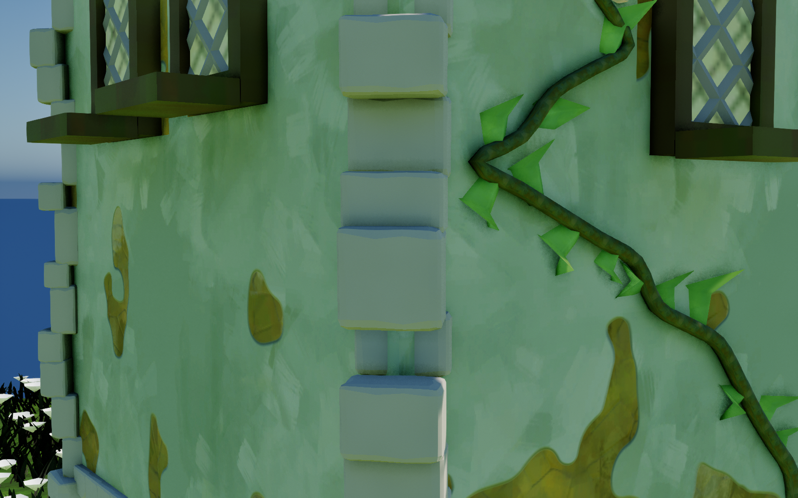
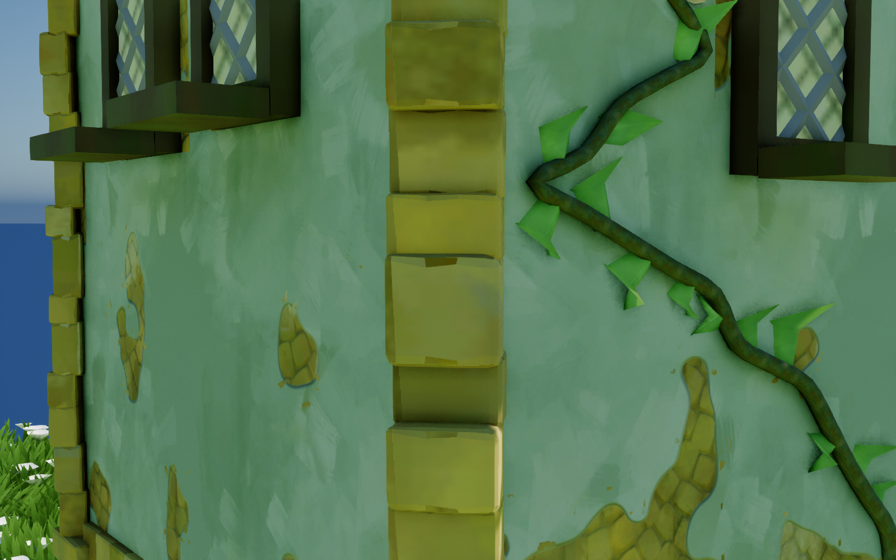
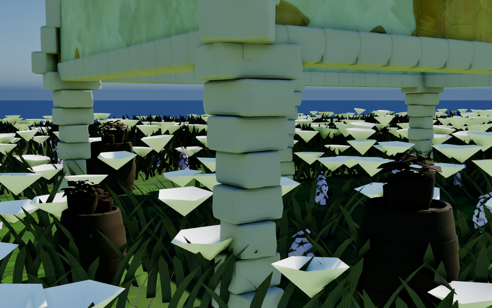
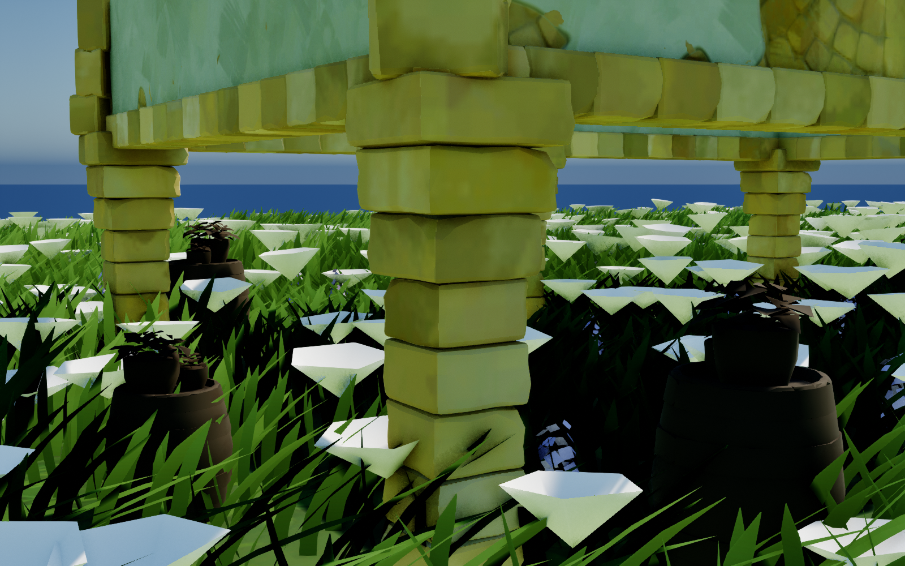

# TG 房屋材质与模型修正（2026-09-12）

本轮检查并修正 `L_HouseGroundDemo` 的 `House_Road`、`House_Pillar`，同时更新 `BP_TinyGladeHouse` 默认值和建图脚本。依据为项目内 TG 实拍参考、提取的网格／纹理、反编译 GLSL 与 PDB 符号。当前场景仍采用贴图墙体；本轮没有把它改成原版完整的实体砖与灰泥覆盖系统。

## 已修正的问题

| 部位 | 原因 | 修正结果 |
| --- | --- | --- |
| 转角角石 | 20 cm 深的砖使用最大 ±16 cm 位移，偏移能超过半砖深，导致露棱、悬出 | 按砖深和嵌入量限制偏移；当前零嵌入配置上限为 ±6 cm，保留墙角覆盖余量 |
| 房底支撑柱 | 每层交替把一条轴缩成 0.72，叠成断续的十字轮廓；大幅旋转和缩放进一步削弱连续性 | 同一块 TG 倒角砖使用方形截面，逐层旋转 90° 并限制微扰，保留顶部逐层出挑的托架 |
| 门框砖、角石、柱石 | 共享材质使用单色，缺少原版砖色纹理与逐砖变化 | `M_TinyGladeBrick` 改用 `brick_colors_layer01` 世界投影和稳定的逐砖变化；保留隐藏实例的负随机数遮罩契约 |
| 墙面 | 世界投影纹理法线按网格 UV 切线空间解释；材质实例覆盖了建图脚本指定的法线／高度纹理组合 | 按投影轴重建世界空间法线，恢复 `stone_floor_2_normal` 与 `stone_floor_2_height` 配对 |
| 灰泥露砖 | 恢复正确纹理后，原阈值产生大量细碎峰值斑点 | 同机位校准 `ProtrudeLevel` 至 1.06，保留较完整的剥落区域 |
| 屋顶尖饰 | 提取网格没有常规 UV，却绑定依赖 UV 的石材 | 使用共享砖石的世界投影材质 |
| 草 | 弯曲 WPO 分支使用像素阶段的 `CameraVectorWS`，引发顶点着色器编译失败 | 改为顶点世界位置到相机的方向，恢复草材质；像素高光分支保持原连接 |

表中转角行记录的是本日第一轮的位移限幅修复。后续参考图与二进制复核确认需要修正砖块方向和中心锚定，现已升级为两面墙上的浅凸交错包角；见[模块文档 A7](TinyGlade_模块对照与进度.md#a7)。

## 证据与判断边界

- [TG 转角／角柱实拍](img/tiny-glade-ref-corner-pillar.jpg)和[转角拱廊实拍](img/tiny-glade-ref-corner-arch-passage.png)显示连续的石砌柱体与倒角边缘。TG 只有一套共享砖网格的对照见[砖构件卷](TinyGlade_模块对照与进度.md#vol-5)。
- 原始着色器位于 `D:/MyProject/Tiny Glade/tmp/shaders/`。`_wall_wall_brick_lod0.raster.hlsl_b903e43ffb3da915.ps_main.glsl` 第 112、241–314 行明确采样 `brick_colors`；同名 `vs_main.glsl` 的投影／实例 UV 偏移在第 501–560 行。本轮采用其中一层砖色纹理，未移植全部调色分支与 TG 专用光照。
- `D:/MyProject/Tiny Glade/tmp/pdb_symbols.txt` 中的 `construct_elevation_supports`、`construct_rectangle_brackets`、`util_cross_brick_pillar` 证明支撑装配家族存在，**不能证明旧代码中的 0.72 比例**。方形承压截面、扰动上限及墙面阈值是结合当前模型尺寸与参考图做出的工程修正，不冒充原版参数还原。

## 同机位对照

截图由 UE 场景捕获生成，分辨率均为 1600 × 1000；房屋位置、机位、视场角与光照设置相同。草材质修复也会出现在背景中。

| 转角修正前 | 转角修正后 |
| --- | --- |
|  |  |

| 支撑柱修正前 | 支撑柱修正后 |
| --- | --- |
|  |  |

## 验证与复用

`UETest574Editor Win64 Development` 的 `ComputeShaderGenerator` 模块编译成功。8 项自动化测试通过：`MasonryContact`、`FrameBrickOverlap`、`FramePierCapital`、`FramePierSingleColumn` 及 4 项 `Quoin` 测试。新增测试覆盖短柱、非整数柱长、旋转房屋、旧序列化扰动参数以及角石位移两端的覆盖余量。

已复核转角、正墙、支撑柱及两栋房屋全景；砖石、墙体、草材质均生成有效着色器。关卡与材质保存成功，最终材质配对、两栋房屋绑定及无脏包状态记录在项目 `Saved/TGAudit/final_assignments.json`。测试摘录与着色器统计分别为 `Saved/TGAudit/automation_results.log`、`Saved/TGAudit/material_validation.json`。

可在目标关卡运行 [TinyGladeRepairHouseMaterials.py](../../Scripts/TinyGladeRepairHouseMaterials.py) 修复房屋材质绑定与墙面法线；草材质对应 [TinyGladeRepairGrassCamera.py](../../Scripts/TinyGladeRepairGrassCamera.py)。共享砖材质由 [TinyGladeMakeBrickMaterial.py](../../Scripts/TinyGladeMakeBrickMaterial.py) 原位重建，`TinyGladeSetupFrame.py` 已改为复用它，避免后续设置重新覆盖本轮修正。

修改前文件快照保留在项目 `.ue-safe-modify-backup/tg-house-20260912/`，含清单与 SHA-256。回退时按文件选择恢复；本轮并未修改同时发生变化的树冠／叶卡片资产。
