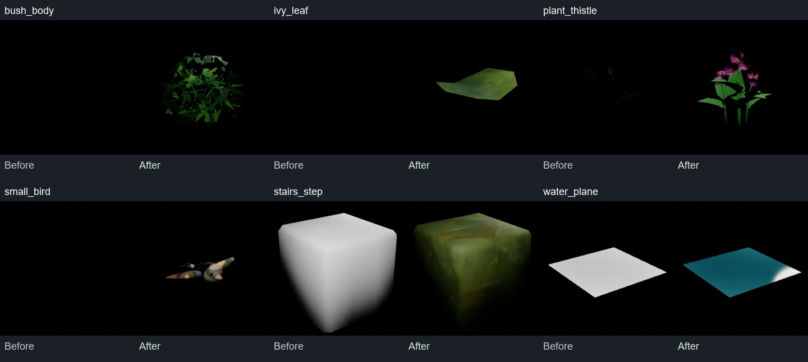

# Tiny Glade 提取网格材质修正

已检查 `/PCGPlugins/HouseTest/TinyGladeAsset/Meshes` 下 483 个静态网格，包括子目录。21 个网格的 23 个材质槽重新绑定；共享植物与窗玻璃材质的修正合计覆盖 49 个网格。修改保存于主工程 `D:/MyProject/UnrealProject/UETest574`。

## 修正内容

| 问题 | 修正 |
| --- | --- |
| 灌木几乎全部被裁掉，部分植物、小鸟显示异常 | `M_TG_TextureMasked` 改为双面植物受光材质，恢复颜色、背面透光和遮罩。`bush_alpha` 使用 A 通道；其他独立灰度遮罩默认使用 R 通道，并乘颜色纹理的 A 通道 |
| 蓟花的茎、叶、花头贴反，黑色顶点色让叶片消失 | 根据原始 `plant_part_id` 绑定：part0 茎、part1 叶、part2 花头。茎叶使用着色器中的绿色；花头使用 `thistle_flower.a` 遮罩及可调紫色 |
| 石阶、碎石、屋瓦、木构件等没有原始纹理 UV | 新增物体空间三轴投影材质，绑定原有砖、瓦、木材、石材颜色纹理；不使用导入时生成的光照 UV 作为颜色坐标 |
| 岩石壳仍用引擎方格材质 | 绑定现有 `MI_rocky_terrain` |
| 莲花使用不适用的纹理映射 | 使用原网格已有的花瓣顶点色 |
| 树卡片把打包遮罩当作颜色 | 分离 `canopy_alpha.r` 遮罩与灌木夏季颜色纹理 |
| 远景树、水面与冰裂纹显示白色或数据贴图 | 配置对应的绿色、蓝绿色水面、浅冰色表面与粗糙度 |
| 窗玻璃缺少正确受光与高光 | 保留原有窗格颜色和不透明窗片布局，配置受光、粗糙度及高光 |

本轮新增 7 个母材质与 7 个投影材质实例。精确的旧、新绑定及原因见 [TinyGladeMeshMaterialAssignments.json](../../Scripts/TinyGladeMeshMaterialAssignments.json)。执行脚本为 [TinyGladeRepairMeshMaterials.py](../../Scripts/TinyGladeRepairMeshMaterials.py)，在编辑器中使用；执行前须按本轮流程备份目标资产。脚本会追加并重新连接材质输出子图，避免删除被编辑器持有的节点，重复执行会保留旧的未连接节点。

## 依据与适用范围

原始数据位于 `D:/MyProject/Tiny Glade`。核对了 `assets/meshes` 的顶点属性、`extracted/meshes` 的 GLB 材质分段、`extracted/textures`、`extract/mesh2glb_v2.py` 及 `extract/gen_material_map.py`。后者的启发式映射作为线索，按原始属性和着色器复核后才采用。

`tmp/shaders/_nani_bush.raster.hlsl_*ps_main.glsl` 以灌木遮罩的 A 通道裁剪；`_clearing_meadow_plant.raster.hlsl_b903e43ffb3da915.ps_main.glsl` 对 part2 采样花纹理 A 通道，part0/1 的绿色为 `(0.0843921, 0.2200000, 0.0726000)`。原始蓟花所有顶点颜色均为零，不能直接用顶点色显示茎叶。花头紫色为本工程的可调配色，原版从主题颜色库读取，不能视为原版固定值。

投影纹理尺寸、材质粗糙度、水面和冰色为 UE 中的适配参数。水面为静态受光表面，窗玻璃仍为不透明窗片；本轮没有复现原版完整水体、主题、专用光照和程序化几何系统。`window_cottage_1x1`、`roof_tile`、`ivy_branch`、`tree_billboard` 等原始网格含盒体或平面构件，单独预览不会自动成为完整窗户、枝条或树冠。

## 渲染与资产验证

下图每组左侧为修改前，右侧为修改后。使用 UE 场景捕获、相同机位、两盏点光源、固定曝光；仅对原始截图等比例裁切和拼版，未重绘内容。

18 个代表样本有修改前后对照，另补查 13 个样本，覆盖本轮直接修改的全部 21 个网格。完整对照见 [修改前](img/mesh-materials-before.jpg)、[修改后](img/mesh-materials-after.jpg)、[补充样本](img/mesh-materials-extended.jpg)。小型碎石、冰裂纹和程序化代理平面的原始几何在补充图中仍然可见。

483 个网格没有空材质槽或引擎方格材质；23 个计划绑定完全匹配；49 个受影响网格的三角形数和 UV 通道数保持原值。15 个被这些网格使用的母材质均生成有效着色器统计，当前日志未发现本轮材质编译失败。目标内容包已保存，临时截图 Actor 已清除。原工程启动时的其他模块初始化及其他插件资产升级错误不在本轮修复范围。

检查记录位于 `Saved/TGMeshMaterials/`：`audit.json`、`source_analysis.json`、`impact.json`、`thistle_impact.json`、`applied.json`、`validation.json`、`final_check.json` 和两组捕获完成记录。关卡引用会使用修正后的网格默认材质；本轮检查未发现需要替换的 Gallery 显式材质覆盖。

## 备份与编辑器恢复

修改前的二进制备份及 SHA-256 清单位于 `.ue-safe-modify-backup/20260912-204147-mesh-materials/manifest.json`，保留原始文件以便按项恢复。

20:43 修改玻璃材质图时，UE 在删除材质节点时触发 `!IsRooted()` 断言退出。随后改用追加输出子图的方式完成修正。房屋关卡 `L_HouseGroundDemo` 已从 **20:35:38 自动保存**恢复并保存回原路径；原磁盘关卡和自动保存副本都保留于上述备份目录的 `recovery/`。崩溃前最后约八分钟未自动保存的操作无法确认完整保留。恢复记录见 `Saved/TGMeshMaterials/crash_recovery.json`。最终编辑器仍打开该房屋关卡，并存在未保存的关卡状态；本轮修改的目标材质与网格包均无未保存状态。
