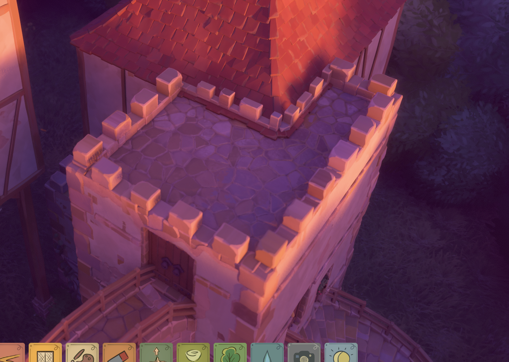
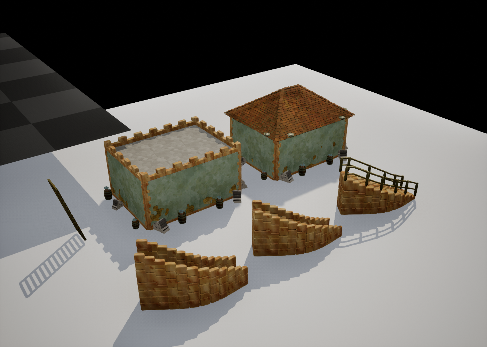
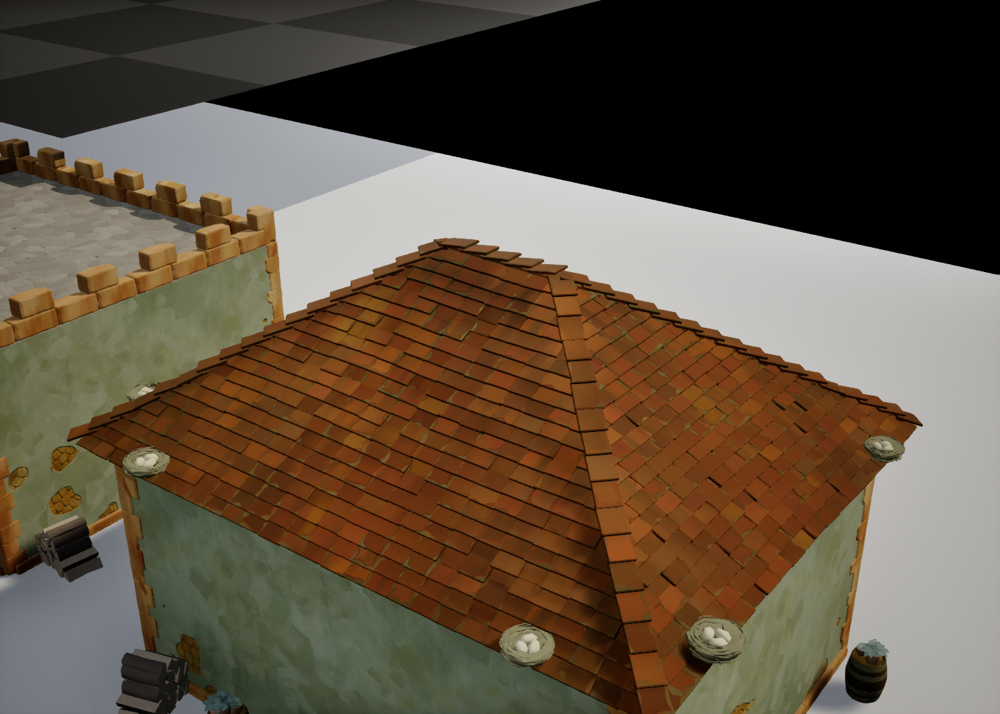
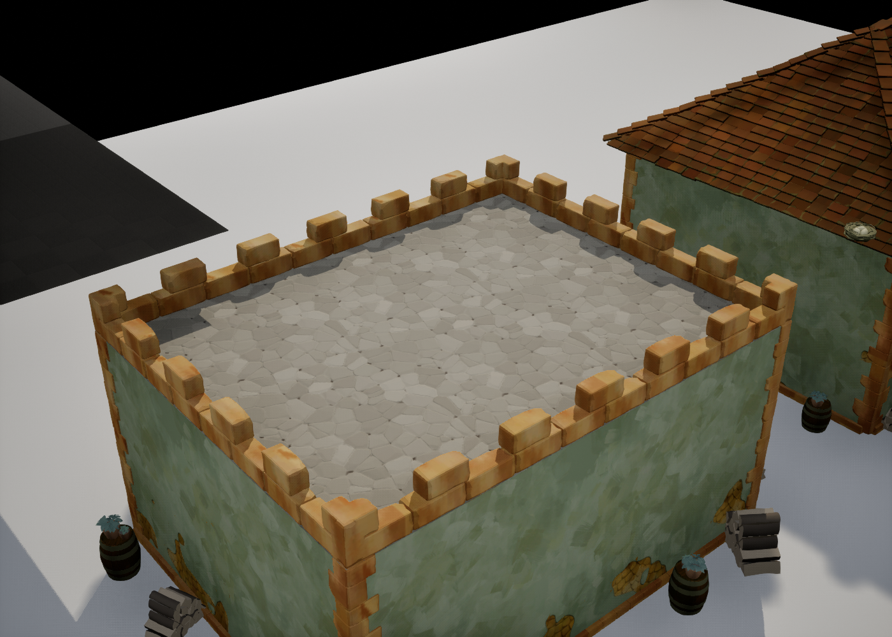
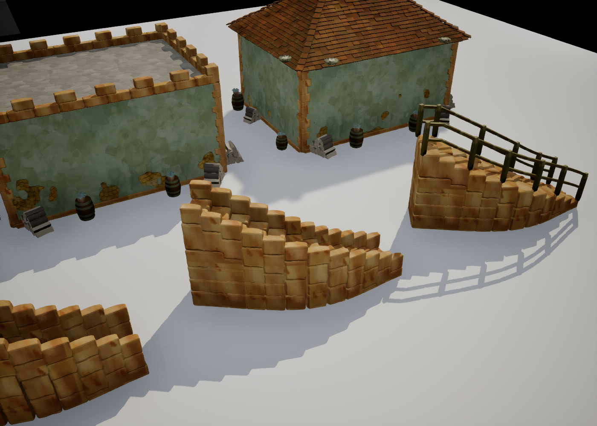
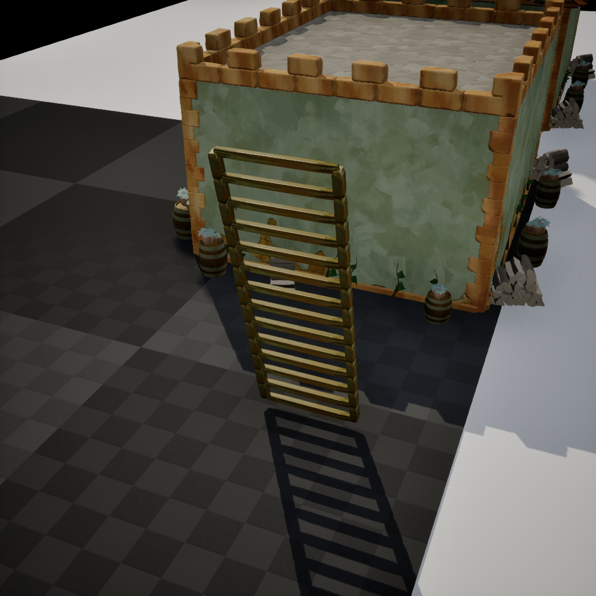

# 屋顶高度、露台与楼梯（2026-09-20）

本轮按用户要求先处理瓦片和屋顶把手，再继续完善玩家样条楼梯。下图为用户提供的外观参考：低屋顶呈石铺露台，边缘有连续矮墙与间隔垛口。

## 屋顶

- 坡面瓦改为相邻排错开半片，错开排的两端用半片收齐，避免整排平移造成漏空；继续保留瓦片搭接与脊瓦。
- `EnterResizeMode` 现在生成每条边的水平把手，以及房底、墙顶、屋顶三个高度框。屋顶框是脊线上方的小框，只改变屋顶起伏；墙高、房底高度不变。
- 屋顶起伏以厘米拖动，反算回 `RoofPitch`，范围 0–70°。压到下限后立即反向拖动即可升起，不累计越界位移。
- 起伏 `maxInset × tan(pitch)` 不超过 `FlatRoofThreshold`（默认 20 cm）时，进入露台形态：移除坡面瓦、脊瓦、尖饰和屋顶鸟窝，生成石铺顶面、矮墙和垛口。抬过阈值后恢复瓦屋顶。20 cm 是本项目默认值，不是原版反汇编结论。
- 露台轮廓使用房子的凸 footprint，支持非矩形；边缘砖复用 `FrameBrickMesh` / `FrameMaterial`。铺地使用独立 `FlatRoofMaterial`，由 `TinyGladeSetupRoofTerrace.py` 构建并安装到房屋蓝图及当前关卡实例。
- 围边转角补整砖封口，避免两条围边只在中心线相接而留下外角缺口。
- 屋顶保持平直坡面，沿用先前“不加屋面起伏和檐口起翘”的决定。

## 玩家样条楼梯

> 后续更新：[露台自动接合与围边入口已经实现](StairsConnections_20260920.md)。本节以下保留第一轮记录。

- `Railing` 提供 `None / Low / High / Wooden`，默认木栏杆。木栏杆含立柱与上下两条扶手；石栏杆使用现有砖资产。栏杆随路径转向、高差、节点宽度变化。
- 超过原有 2.5 坡度界限的分段生成木梯（边梁与约 30 cm 间距横档），不再留空。木构共用现有 `wooden_plank` 网格，可通过 `WoodMesh` / `WoodMaterial` 替换。
- 栏杆和木梯是独立实例族，支持重建、删除和基类烘焙；关闭栏杆会清空旧实例。
- 护栏中心落在踏面范围内；平走道采用与踏步一致的端点地面抬升，避免斜地面上的护栏悬空或陷入踏面。
- 本轮未完成楼梯拱墙、挂墙托架、穿墙洞、自动接入露台及分叉图编辑；现有分层实心支撑保持原逻辑。栏杆尺寸和木梯装配为 UE 实现，不冒充已还原原版的全部几何规则。

## 使用

1. 打开 `/PCGPlugins/HouseTest/L_RoofTerraceStairsDemo` 查看瓦屋顶、露台、三种栏杆和陡坡木梯。
2. 选房子，在详情面板执行 `Enter Resize Mode`，选择屋脊上方的小矩形框，沿 Z 轴拖动。降至 20 cm 起伏以内变露台，往上拖可恢复瓦片。`Flat Roof Threshold` 可调整切换高度，`Flat Roof Parapet Height` 调整围边总高。
3. 选楼梯，用 `Railing` 切换样式；编辑 Spline 点改变路径和高度，点的 Y 缩放改变局部宽度。`Wood Mesh / Wood Material` 替换木栏杆与梯子资产。

`TinyGladeRoofStairsVisualQA.py` 会重新生成专用演示关卡 `L_RoofTerraceStairsDemo`，不适合在该关卡保存手工创作后再次执行；其它地图不受影响。

## 验证

新增 `House.RoofTerraceGeometry`、`House.RoofHeightHandle`、`Stairs.RailsAndLadder` 自动化用例；同步更新已有把手数量断言。

构建依据 Rider 的 `RunManager`：所选 `UETest574_2` 配置未指定当前子项，按第一项推定 `Development_Editor / x64`，映射至 `UETest574_2Editor Win64 Development`，引擎为 `D:/UnrealEngine-5.7.4-release`。

- 变更翻译单元文件级编译通过；链接前导出 action plan，确认仅涉及项目插件，没有引擎 / 全目标重建，也未使用模块编译开关。最终增量构建 17 个 action 全部成功。
- 最终自动化回归 **22 / 22 通过，0 失败**，覆盖屋顶、瓦片、把手和楼梯。新增断言同时检查露台外角封口、护栏落点和走道贴地高度。
- 两项成功用例带有已有场景警告：空测试地图没有导航网格；凹轮廓测试按设计转凸包。均非本轮功能失败。
- 引擎实景脚本检查露台 → 瓦屋顶 → 露台往返切换、三种栏杆及木梯实例数量，并保存专用演示地图。
- 另启编辑器重载已保存地图，检查材质绑定、瓦片、三种护栏与木梯均恢复成功；重载日志没有露台材质编译错误。构建材质节点的中间状态曾输出缺少输入警告，最终连接完成并保存的材质正常。

验证记录位于项目 `Saved/Logs/RoofStairs_20260920_BuildFinal.log`、`Saved/Logs/RoofStairs_20260920_AutomationFinal.log` 和 `Saved/RoofStairs_20260920_Automation/index.json`。改动前源文件与房屋蓝图备份保存在 `Saved/RoofStairs_20260920_Backup`。

## 引擎实测截图

以下为本项目独立验证关卡的原始截图，使用补光便于检查几何；不作为参考图的最终光照复刻。

