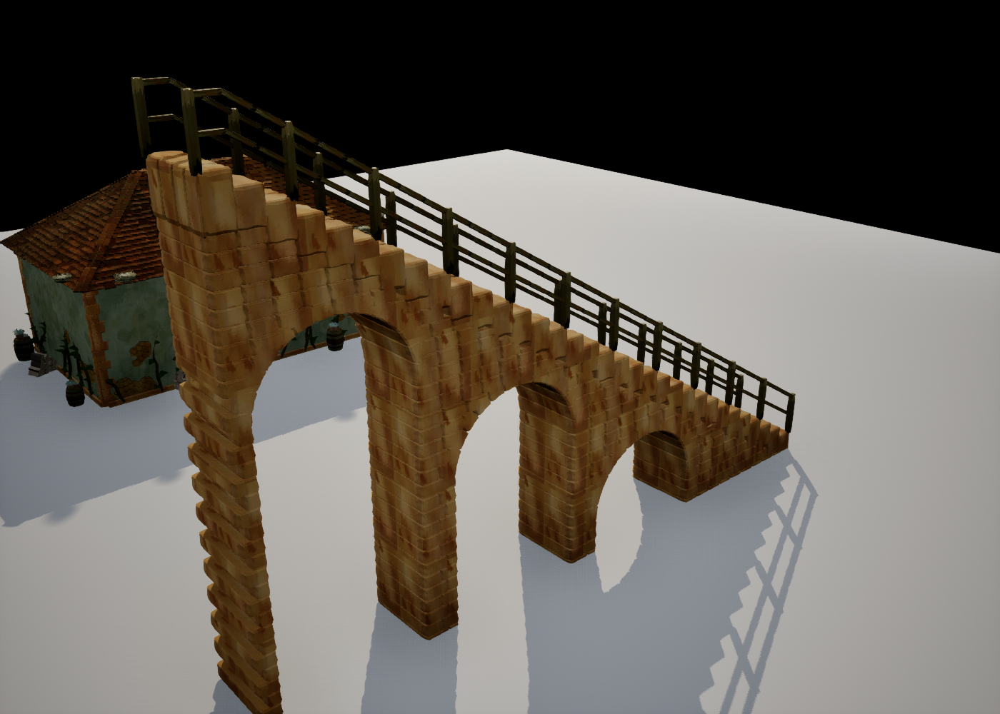
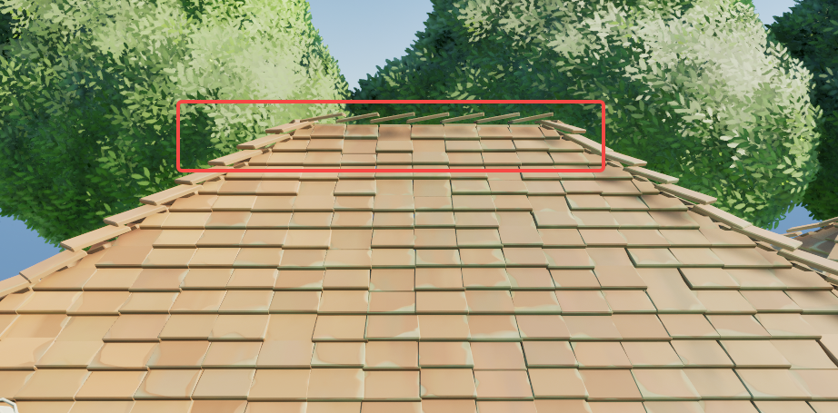
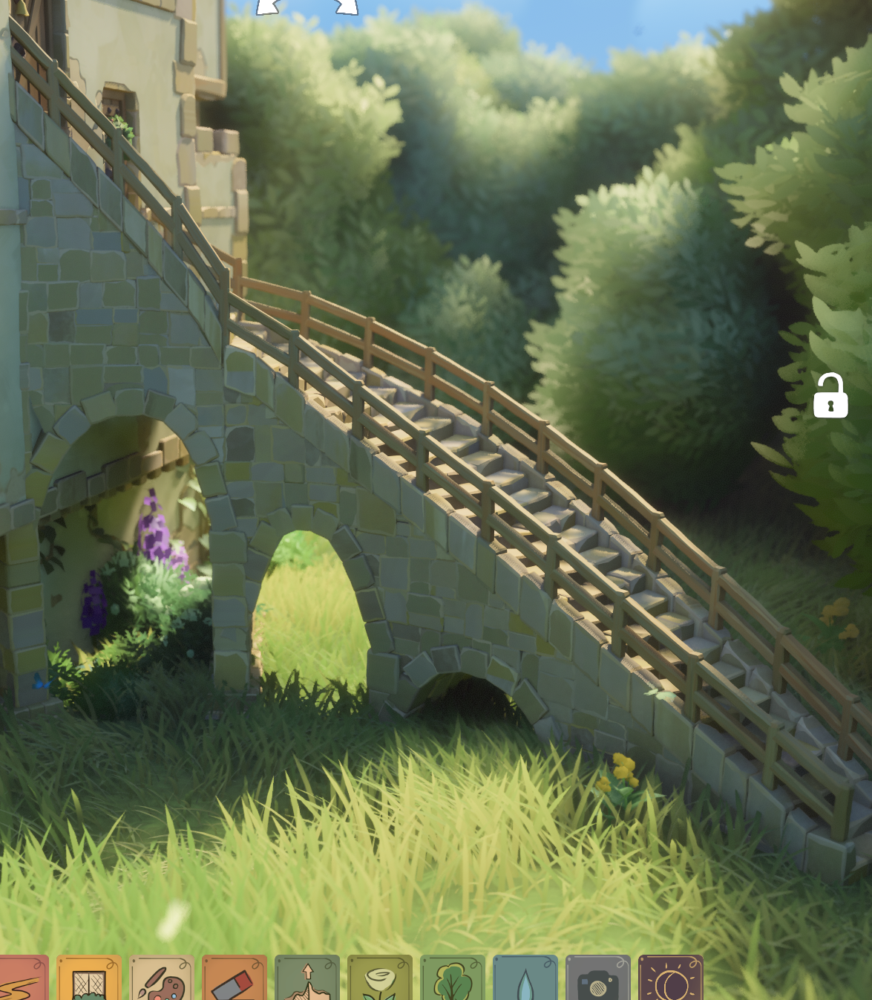
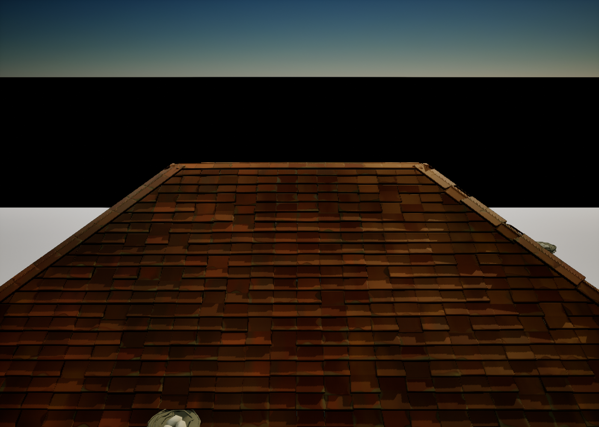
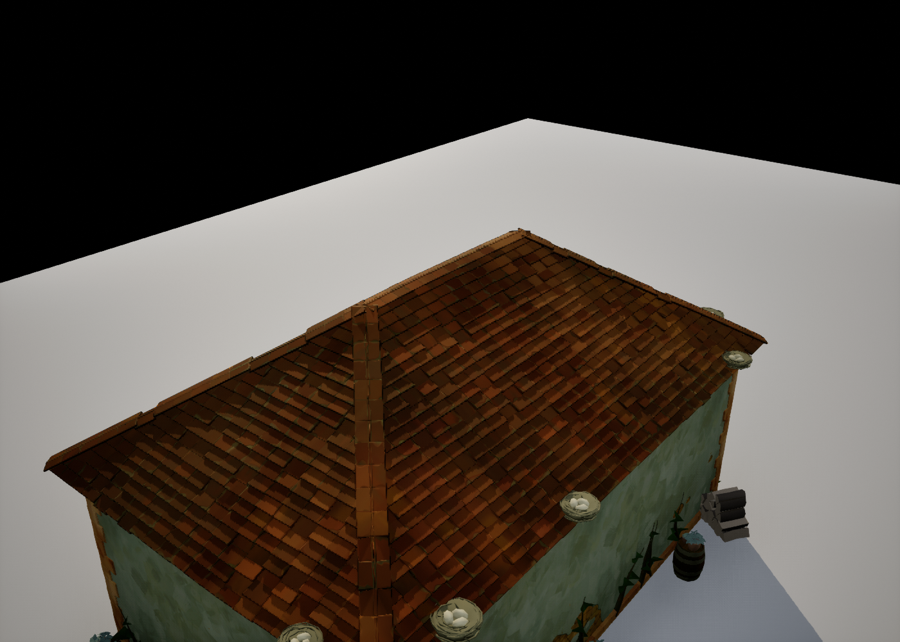
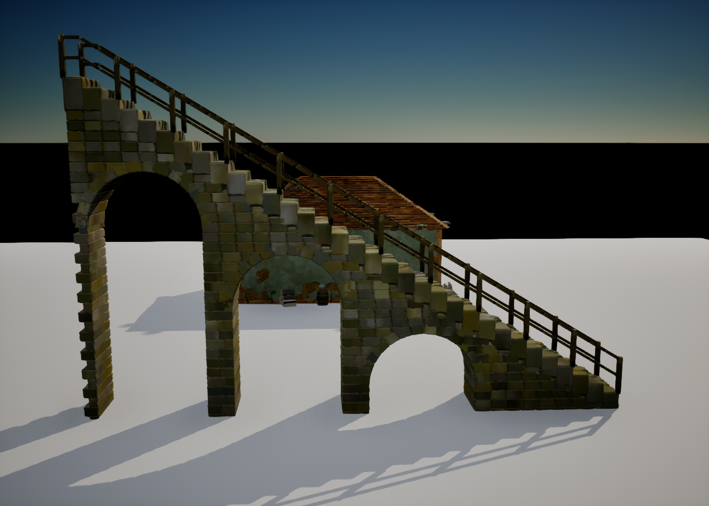
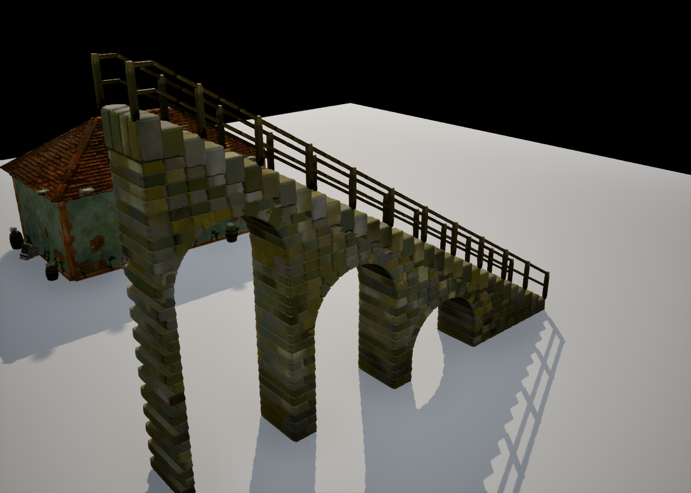
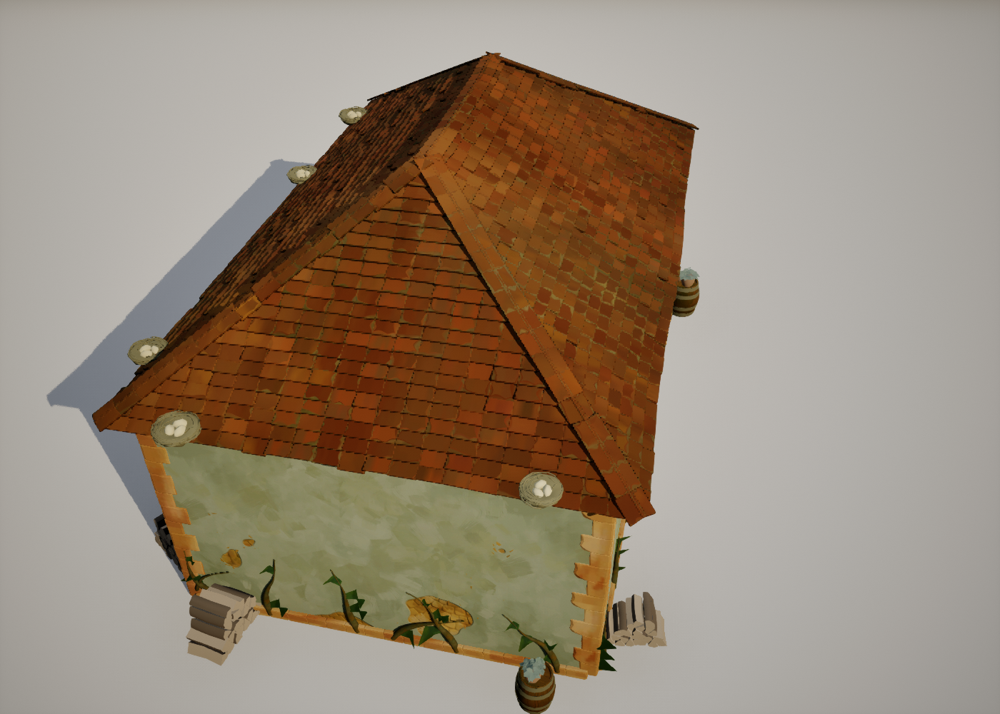
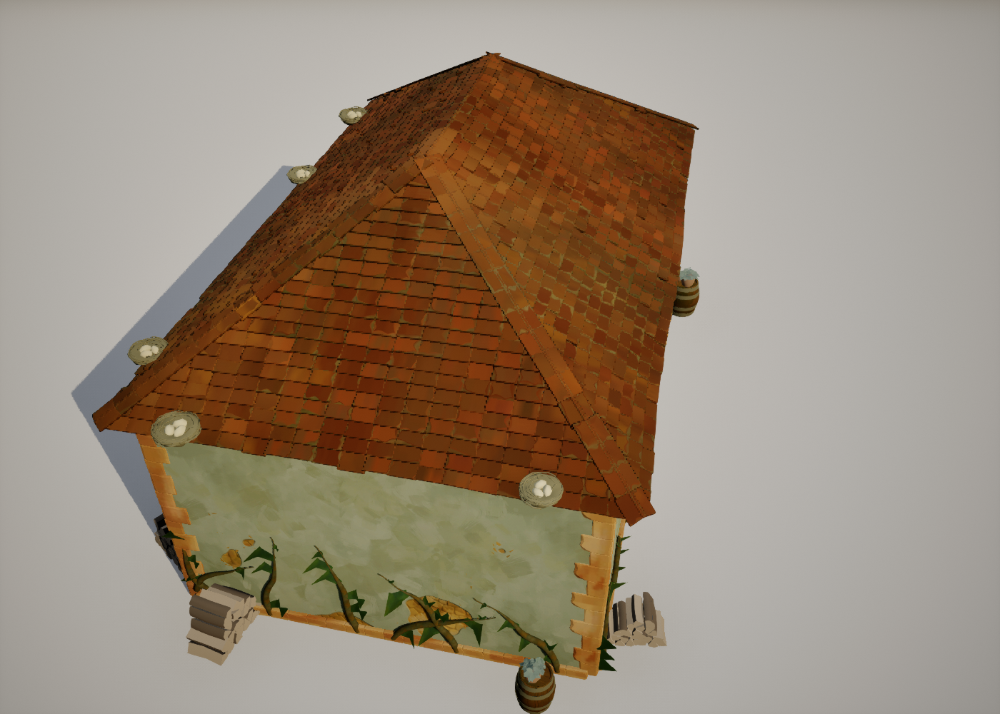

# 屋脊收口、瓦片 VSM 与楼梯拱墙

本轮请求：修复屋脊翘片，瓦片参与 VSM；在 `/PCGPlugins/HouseTest` 创建楼梯子蓝图；按反编译证据实现楼梯侧面拱墙，合并重复的拱形逻辑。

## 后续修正：楼梯砖石材质

用户指出此前截图的楼梯材质不对。实际检查发现，楼梯蓝图和示例实例的 `BrickMaterial` 都为空，最终使用 `brick` 网格的展示材质 `MI_TG_MeshProjected_brick_colors_layer00`。这套材质按单块网格局部空间投影，没有逐砖相位；相同纹理随每块砖缩放、重复，形成褐色竖向条纹。

楼梯现在显式使用 `/PCGPlugins/HouseTest/MI_TinyGladeStairsBrick`，它继承已有的 `M_TinyGladeBrick`，共用世界尺度投影和稳定的逐砖随机偏移。仅将 `BrickColor` 参数设为提取纹理 `brick_colors_layer03`，匹配参考图的灰绿、浅灰石色；房屋的默认砖色保持原设置。未新增另一套砖石着色逻辑。

原版 `wall_brick_lod0` 像素着色器确有 `brick_colors` 第 3 层分支，但目前没有证据将这张参考图精确对应到某个原版主题 ID；这里的层选择依据是参考图的外观。`TinyGladeSetupStairsBlueprint.py` 同时建立材质实例并绑定蓝图，`TinyGladeMakeBrickMaterial.py` 保留 Nanite 用途。预览等待材质编译完成后再出图，避免未就绪着色器产生黑色误判。

同机位、同灯光的修正前：

修正后：

材质检查脚本为 `Scripts/TinyGladeStairsMaterialQA.py`：`-StairsMaterialApply` 保存蓝图及三个生成示例关卡的缺省材质修正，保留显式自定义材质；`-StairsMaterialReload` 独立重载验证。对照中楼梯几何保持 33 级、377 块砖。审计结果保存在 `Saved/StairsMaterial_20260920/`。

已完成独立重载：蓝图默认、关卡实例及实际渲染组件均解析到 `MI_TinyGladeStairsBrick`，纹理为第 3 层，Nanite 用途开启。`Saved/Logs/StairsMaterial_20260920_Reload.log` 记录 `STAIR MATERIAL QA PASSED applied=False reload=True`。这次只修改材质资产、绑定与设置脚本，没有改 C++ 或楼梯几何。

## 用户参考

## 实现

- 屋脊瓦改为两侧成对贴坡，未抬起的一端在脊顶搭接，翘起的一端朝坡下。最高一排坡面瓦截到脊顶，避免越过脊顶形成突出的薄片。
- 瓦片组件通过 `SetBaseMesh` 保留静态网格的 Nanite 数据，沿用已有 GPU Scene 实例通路参与 VSM。原来 `SetBaseMeshFromGpuData` 的快照通路会丢失 Nanite 资产身份。资产启用 Nanite，材质增加 Nanite 用途；顶点色 A 清零，保持逐实例随机数正确。
- `BP_TinyGladeStairs` 继承 `ACSStairsActor`，包含默认样条、砖／栏杆／木梯组件；默认木栏杆、接地拱墙、露台自动接合。与房屋模块并列存放。
- 楼梯支撑按水平样条弧长排墙，砖层交错；沿路径规划拱洞，按踏步底部和地形缩小洞高、洞宽，保留拱间墩。低处空间不足时不挖洞。梯子不生成石墙。
- 取消旧的“每一级底下各自砌到地面”实现。踏步和支撑仍共用一个砖实例组件；支撑砖标记 `StepIndex = INDEX_NONE`，不再假装属于某一级踏步。

## 拱形逻辑收敛

`FCSWallOpening` 是房屋和楼梯共用的洞描述，`Rise()` 与 `SpringZ()` 统一拱高和起拱线。`CSHouseTrim::SplitEdge` 负责按洞剖面切砖层，`CSHouseFrame::MakeOpeningPath / EvalPath / SolveRun` 负责拱圈与排砖。楼梯只增加沿样条规划洞和定位砖的适配层 `CSStairsSupport`。

原来的墙洞为椭圆，框砖仍用正圆，同边拱间墩又用半宽算起拱线。本轮统一为洞的实际竖向半径。椭圆弧长与反求角度放在 `CSArchCurve.ush`，由 C++ 和 HLSL 共用；正圆保留原解析解。未新增“楼梯专用拱曲线”。

窗户的预制拱带属于另一类资产，不应合并成砖拱；这里整合的是程序生成的砖拱、洞剖面及拱间墩。

## 资产与逆向依据

依据 [附录 D §2.2、§3、§8](TinyGlade_楼梯逆向_附录D_玩家绘制楼梯.md) 和 [保存的汇编摘录](evidence/stairs-playermade-20260916.asm)：

- 玩家楼梯踏步和拱墙使用 `TinyGladeAsset/Meshes/brick`，木栏杆使用 `wooden_plank`。`stairs_step` 是地形石阶的资产。
- 支撑复用墙构造器；`preprocess_curve` 在已确认分支中按约 400 cm 分拱，汇编 `1407810DE–1407810EF` 为扣除端部长度后乘 0.25，再取整。
- 原版 `ArchWalker` 的全部高度阈值尚未完成逆向。当前按空间拟合的留边、墩宽和拱高是 UE 适配规则，不声称是原版常量。挂墙托架、穿房屋墙洞、分叉图不在本轮实现范围。

## 验证

验证地图：`/PCGPlugins/HouseTest/L_RoofStairsArchDemo`。复现脚本：`Scripts/TinyGladeRoofArchQA.py`；重载验证加启动参数 `-RoofStairsReload`。

- 按 Rider 当前选中配置的第一项 `Development_Editor / x64` 验证（未找到显式活动子配置标记）。修改文件单独编译通过，随后对项目 Editor 目标完成增量编译及链接；最后一次共 15 个动作，没有重建引擎。日志：`Saved/Logs/RoofStairsArch_20260920_BuildFinal.log`。
- 31 项自动化测试全部通过：30 项无警告，1 项 `RoofHeightHandle` 在测试世界缺少 RecastNavMesh 的警告下通过。覆盖楼梯接合、拱洞贯穿、反向绘制、栏杆缩宽、共享椭圆剖面、屋脊成对搭接和屋顶把手。报告：`Saved/RoofStairsArch_20260920_AutomationFinal/index.json`。
- 保存并重新加载地图及 `BP_TinyGladeStairs`，确认实例来自实际子蓝图、原版砖与木板资产可用、空闲帧不重复上传楼梯数据。
- VSM 验证使用临时 `r.Shadow.Virtual.ForceOnlyVirtualShadowMaps=1` 和 `r.Shadow.Virtual.Cache=0`。确认屋瓦组件及其 Nanite 静态网格子组件都启用动态投影；同步开关两者后，同机位屋瓦自阴影和地面投影发生明确变化。对照结束恢复投影。保存的地图始终启用投影；项目渲染配置未改动。日志：`Saved/Logs/RoofStairsArch_20260920_VSM.log`，包含 `ROOF VSM PATH OK` 与 `ROOF ARCH QA PASSED`。
- 本机验证启动时使用临时 Zen 缓存端口参数 `-ini:Engine:[Zen.AutoLaunch]:DesiredPort=8561`，避开默认端口监听失败；未修改项目缓存配置。

## 实际效果

以下为验证地图原始截图，展示几何与投影；灯光和环境不是用户参考图的场景。

### 屋脊收口与瓦片

### 楼梯拱墙

### VSM 开关对照

瓦片投影开启：

同机位仅关闭瓦片投影，屋顶实体仍在；检查屋面自阴影及地面的屋顶轮廓变化：

