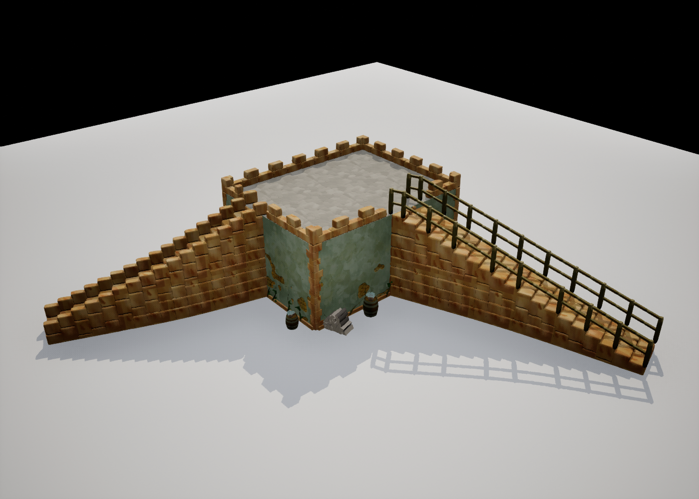
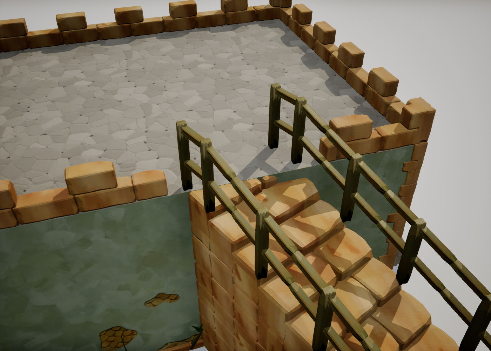
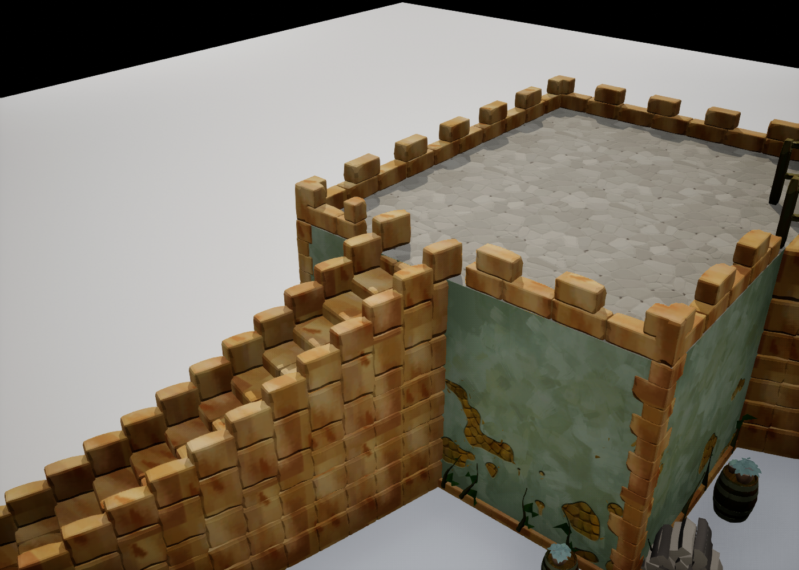

# 楼梯与露台接合（2026-09-20）

接续 [屋顶、露台与楼梯第一轮](RoofTerraceAndStairs_20260920.md)，本轮实现开放样条两端与露台的自动接合、围边入口及生命周期同步。

## 行为与操作

- `ACSStairsActor` 默认启用 `Connect Terraces`。将首点或末点放在平屋顶边缘附近，路径从房屋外侧接近，该端会对齐露台石板高度，并略伸入围边内侧。原始样条点不被写回；移开后恢复原路径。
- 水平吸附范围默认 **80 cm**，竖向差默认 **100 cm**，分别通过 `Terrace Snap Distance / Height` 调整。这是本项目交互参数，不是 Tiny Glade 逆向测得的常量。
- 每个端点只接最近的一栋房屋；距离相同时沿用房屋 GUID 的稳定顺序。斜屋顶、竖向相差过大、擦着墙平行经过、边长不足及闭环样条均不接合。
- 围边入口使用同一份接合结果，按楼梯宽度和入射角留空并加余量；跨入口的围边砖切成剩余段，多段入口重叠也保持畅通。其它围边与转角保留。
- 接口逻辑高度与露台一致，末级砖顶微降 1 cm，伸入露台的部分由石板覆盖，消除砖顶与铺地共面造成的闪烁。
- 房屋移动、墙高变化和屋顶形态切换会通知楼梯在下一次更新重新计算。楼梯移走、关闭接合或删除后，房屋补回围边；撤销会重新计算接合。
- 接合是当前位置的几何关系，不是永久父子绑定：房子离开吸附范围，连接会解除。样条及房屋参数才是存盘数据，接合和入口在加载后重算。
- 地形通知与根变换通知统一标脏，在楼梯自身下一次 Tick 合批处理；空闲时关闭 Tick。观测接口读取前兑现待处理更新，材质 / 几何哈希继续吸收重复上传。

打开 `/PCGPlugins/HouseTest/L_StairsTerraceConnectionDemo` 可查看正向木栏杆楼梯与反向绘制的石栏杆楼梯接入同一露台。脚本 `TinyGladeStairsConnectionQA.py` 首次创建专用地图，再次执行会加载它并验证存盘恢复，不改其它关卡。

## 实现边界

这次开的是露台围边入口，不是房屋墙身的门洞。挂墙托架、楼梯下的拱形支撑、穿墙开洞、分叉图仍未实现。支撑继续使用现有分层实心砌体。

## 验证

- Rider 选中 `UETest574_2`，没有显式当前子配置，按第一项推定 `Development_Editor / x64`；使用 `D:/UnrealEngine-5.7.4-release` 的项目命令。
- 五个变更翻译单元文件级编译通过。链接前检查 action plan，仅涉及项目的 `ComputeShaderGenerator`、`PCGEditorProcess`，没有引擎 / 全目标重建。
- 新增 `Stairs.TerraceGeometry`、`Stairs.TerraceOpenings`、`Stairs.TerraceLifecycle`，覆盖几何范围、旋转、入口重叠、移动、删除、撤销、斜顶切换、两端接合与闭环。
- 最终增量构建成功；自动化回归 **25 / 25 通过，0 失败**，包括原有屋顶、瓦片和把手用例。两项已有场景警告分别为测试地图无导航网格、凹轮廓按设计取凸包。
- 实景验证正向木栏杆、反向石栏杆两条楼梯接入同一露台；坡顶 / 平顶往返和楼梯移开 / 移回时，接合数与入口数同步变化。
- 另启编辑器加载保存后的演示关卡，两个连接与两个入口均恢复成功；修正后的近景已确认末级与露台无共面交错。日志：`Saved/Logs/StairsConnections_20260920_Reload.log`。

改动前源码保存在 `Saved/StairsConnections_20260920_Backup`。

最终构建日志：`Saved/Logs/StairsConnections_20260920_BuildFinal.log`；测试日志：`Saved/Logs/StairsConnections_20260920_AutomationFinal.log`；报告：`Saved/StairsConnections_20260920_Automation/index.json`。

## 重载后引擎截图

