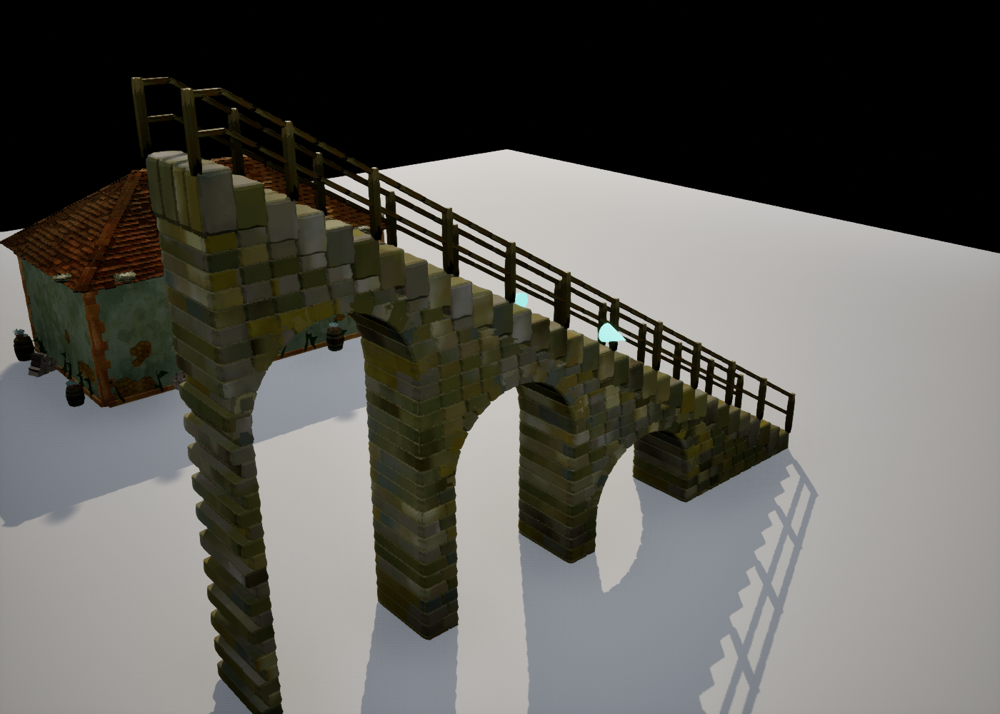
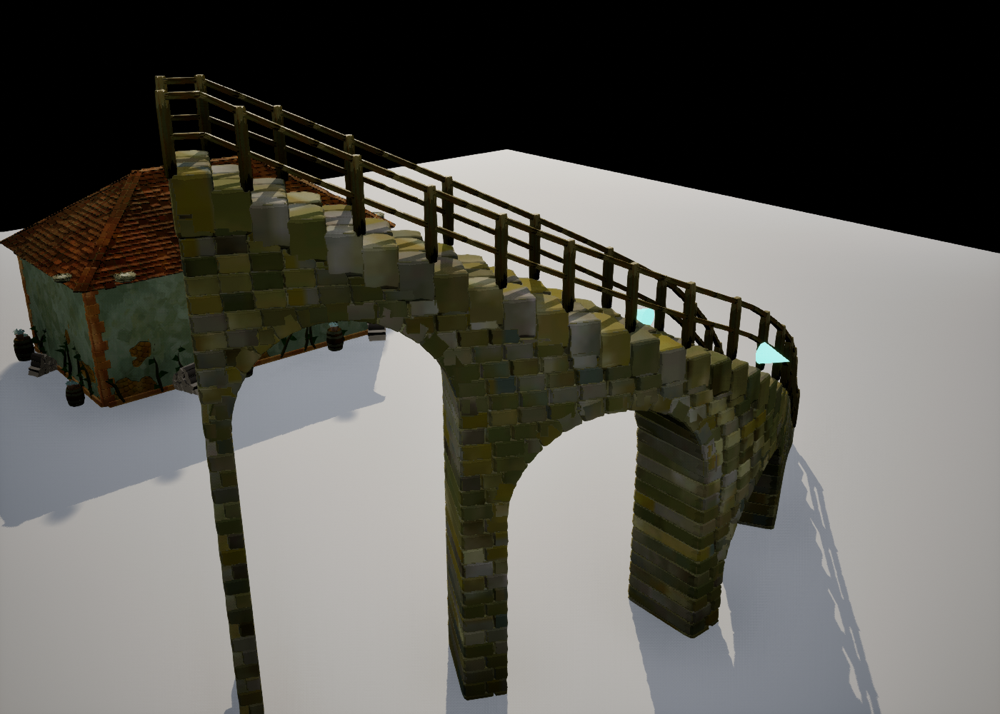
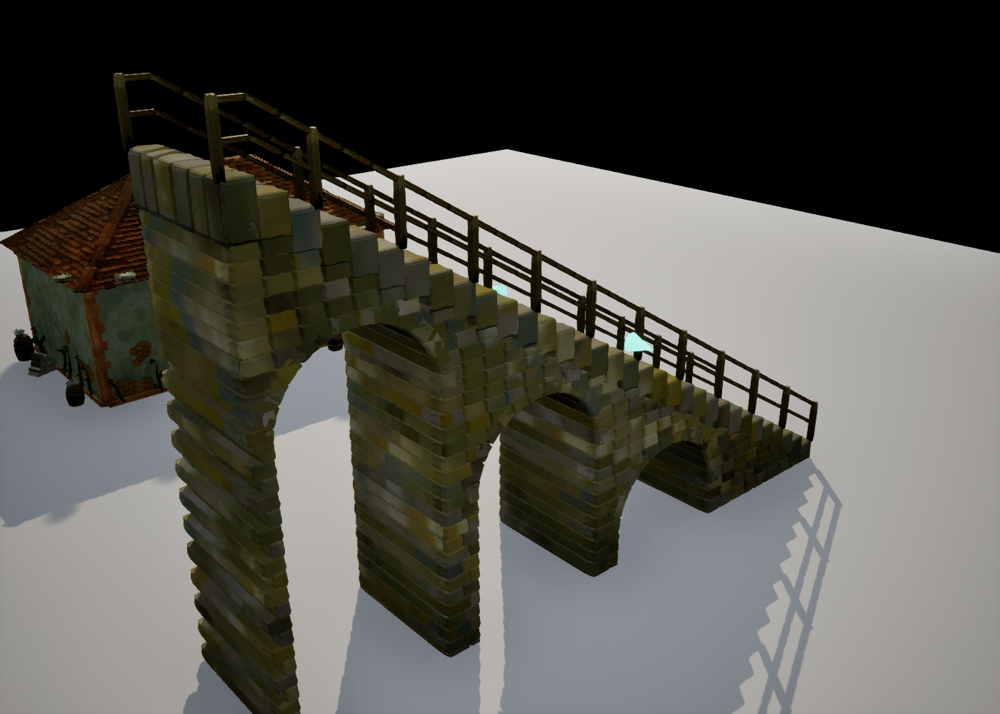

# 楼梯宽度把手

楼梯沿用房屋的使用方式：通过蓝图函数进入调整模式，在楼梯中段两侧生成临时锥形把手，选中后用编辑器移动工具横向拖动。把手样式、高亮材质、不挡射线及不投影设置复用房屋的公共辅助函数。

## 蓝图使用

目标对象为关卡里的 `BP_TinyGladeStairs` 实例（父类 `CSStairsActor`），在 `CS Stairs / Resize` 分类中调用：

- `EnterResizeMode`：产生左、右两个把手。重复调用不会叠加；某个把手被手动删除时会补齐。
- `ExitResizeMode`：销毁把手。删除楼梯或结束关卡也会自动清理。
- `IsInResizeMode` / `GetResizeHandles`：查询当前模式和把手。
- `SetStairWidth(NewWidth)`：直接以厘米设置整体宽度，限制为 45–400；返回生效值，并立即更新几何和把手。

`EnterResizeMode`、`ExitResizeMode` 也有 `CallInEditor` 按钮，可直接在详情面板触发。生成的把手是临时编辑器道具，不保存在地图中，不在游戏中显示。

若蓝图自己实现拖拽，先通过 `GetResizeHandles` 取得把手，移动其 Actor，然后调用把手的 `HandleDrag(bFinished)`；也可用 `ConsumeDragToHost` 获取该侧实际生效的位移。原生编辑器 gizmo 会自动调用，不需要蓝图逐帧轮询。

## 调整规则

- 保持样条中心线不动，向外拖一侧 10 cm，两侧各扩 10 cm，总宽增加 20 cm。反方向拖动则收窄。
- 宽度调整作用于踏步、拱墙、栏杆，以及与露台连接的围边开口。
- 保留各样条点的 Y 缩放系数；中段有宽度缩放时，把手按实际显示宽度换算。例如系数为 2，侧边拖 10 cm，基础 `Width` 增加 10 cm。
- 沿楼梯方向或竖直方向的拖动不改变宽度；把手在每次拖动后归位。达到上下限后不积攒残余位移，反向拖动立即生效。
- 支持旋转、移动及缩放宿主，并参加编辑器的撤销/重做。路径没有有效长度时不生成悬空把手。

## 实现与验证

### 样条拖动实时重建（后续修正）

此前楼梯只订阅了宿主 Actor 的变换，既未订阅样条曲线更新，也没有处理 `PostEditMove(false)`。移动控制点时宿主不动，因此不能依靠原有通知链重建；关闭拖动时运行构造脚本后尤其明显。

现在订阅样条的数据更新和组件变换通知，并补上编辑器拖动入口。控制点位置、切线、逐点 Y 缩放，以及增删点都会唤醒既有的下一帧重建队列；同帧通知合并，松手补齐待处理变化。样条组件单独撤销/重做也会通知楼梯。更换样条组件时重新绑定，楼梯销毁时解绑，空闲时不保持 Tick。

非实时视口及编辑器拖动节流可能不执行 Actor Tick。编辑器中有变化时额外登记一次性 Core Ticker 回调，消费完就移除；不依赖视口实时模式，也不进行常驻轮询。游戏世界仍使用 Actor Tick。回调弱引用宿主，销毁/退出时取消。

蓝图修改样条时使用默认的 `Update Spline = true` 即可；批量设置多个点时可先设为 false，批量结束调用 `UpdateSpline`。无需再额外调用 `RebuildStairs`。宽度把手、砖墙和栏杆沿用同一次重建同步更新。

构建沿用 Rider 的 `Development_Editor / x64` 配置：两个修改的翻译单元单独编译通过，最终增量编译/链接共 7 个动作，仅涉及 ComputeShaderGenerator 和目标元数据，没有引擎重建。日志：`Saved/Logs/StairsSplineLive_20260920_BuildFinal.log`。

14 项楼梯自动化测试全部通过，新增 `Stairs.SplineLiveRebuild` 和 `Stairs.SplineComponentUndo` 覆盖拖动中更新、同帧合并、切线/缩放/组件变换、增删点、无变化不上传以及样条组件单独撤销/重做。仅既有 `Stairs.Actor` 有测试场景缺少 RecastNavMesh 的警告。报告：`Saved/StairsSplineLive_20260920_AutomationFinal/index.json`。

实际 `/PCGPlugins/HouseTest/BP_TinyGladeStairs` 在关闭拖动构造脚本的离屏编辑器中，连续三次修改中间样条点，每次都自动重建：上传次数由 1 依次变为 2、3、4，砖数由 377 变为 390、412、427。过程中没有手动调用重建或 Actor Tick，宽度把手同步跟随。测试没有保存地图和蓝图设置。复现脚本：`Scripts/TinyGladeStairsSplineQA.py`；结果：`Saved/StairsSplineLive_20260920/result.json`。

修改前：

连续修改控制点后，台阶、栏杆、拱墙和把手自动跟随弯曲的路径：

### 宽度把手验证

`CSStairsResize.cpp` 从 `BuildRuns` 的已解析路径取得中段位置、横向和宽度系数，复用现有的地形贴合及露台吸附。把手为 `CSStairsWidthHandleActor`，拖拽记账点存于宿主局部空间，防止宿主整体变换被误认为调宽操作。`SetStairWidth` 统一修改属性、登记撤销并触发现有楼梯重建。

构建使用 Rider 所选项目第一项 `Development_Editor / x64`（未见显式活动子配置标记），4 个修改源文件编译通过，完整链接的增量计划为 9 个动作，没有引擎重建。日志在 `Saved/Logs/StairsWidthHandle_20260920_Build.log`。

18 项相关自动化测试全部通过（16 项无警告；两项既有房屋测试有测试场景缺少导航/岩壳资源及凸包纠正提示）。新增 `Stairs.WidthHandle`、`Stairs.WidthHandleTransform`、`Stairs.WidthHandleTerrace` 均无警告通过，覆盖幂等生成、限位后的反向拖动、轴向约束、撤销/重做、宿主变换、局部宽度系数、删除清理，以及露台入口随宽度更新。报告：`Saved/StairsWidthHandle_20260920_Automation/index.json`。

实际 `/PCGPlugins/HouseTest/BP_TinyGladeStairs` 已重新编译保存，并通过反射的蓝图接口完成以下验证：产生两个把手，向外拖动一侧 60 cm，宽度从 180 cm 变为 300 cm，样条点保持不动，退出后把手全部清理。材质保持 `MI_TinyGladeStairsBrick`。复现脚本 `Scripts/TinyGladeStairsWidthHandleQA.py`，记录 `Saved/StairsWidthHandle_20260920/result.json`。示例地图不保存测试中的宽度修改。

## 实际效果

初始 180 cm 宽，进入调整模式后出现两侧高亮锥形把手：

向外拖动一侧 60 cm 后，整体宽度为 300 cm；两侧栏杆和砖墙同步更新：

