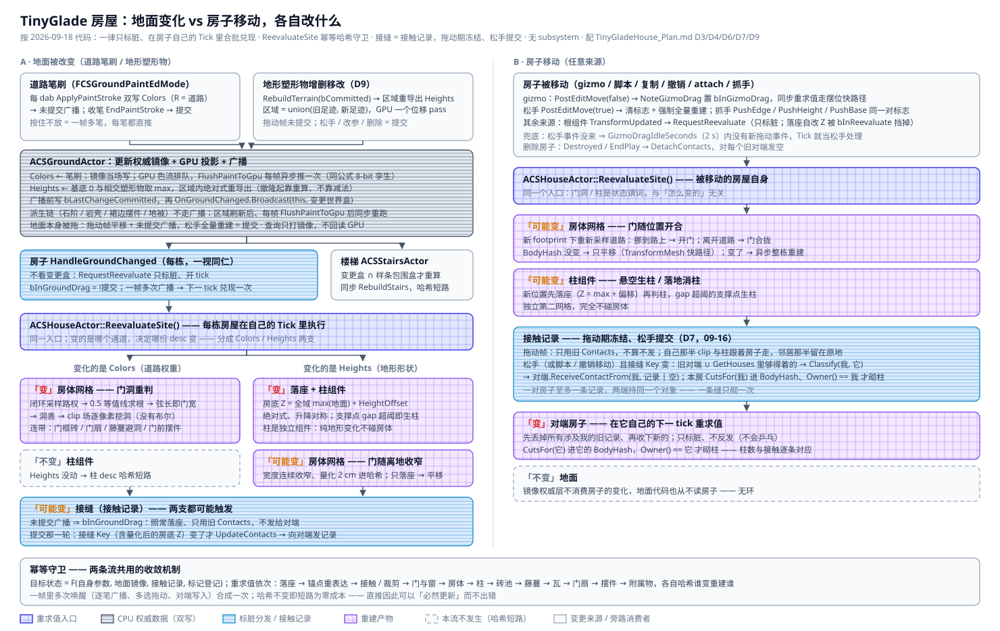
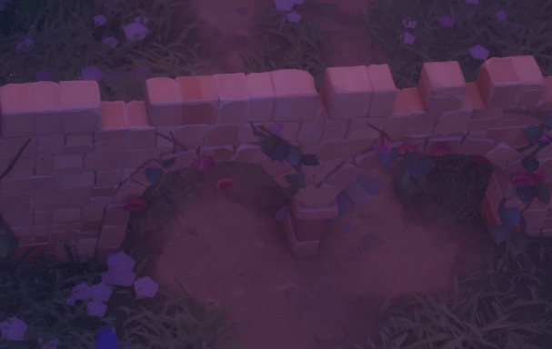
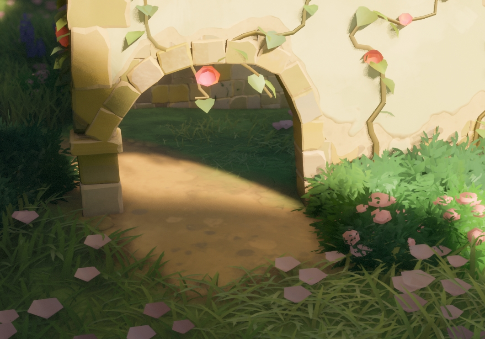
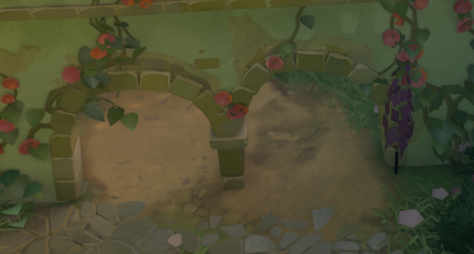
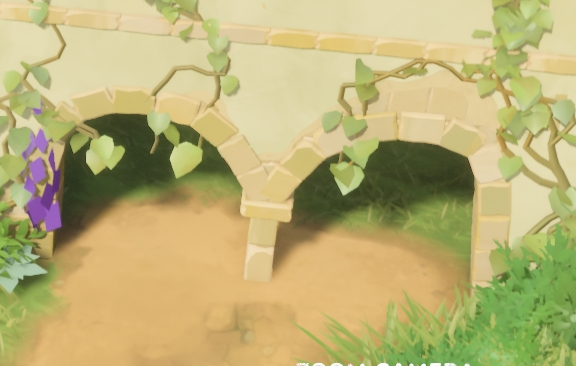
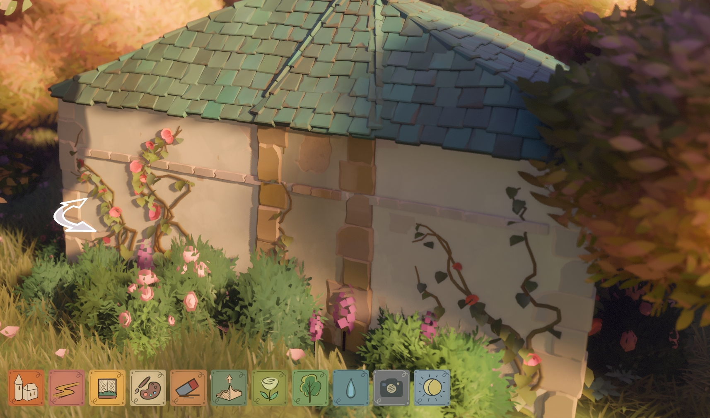
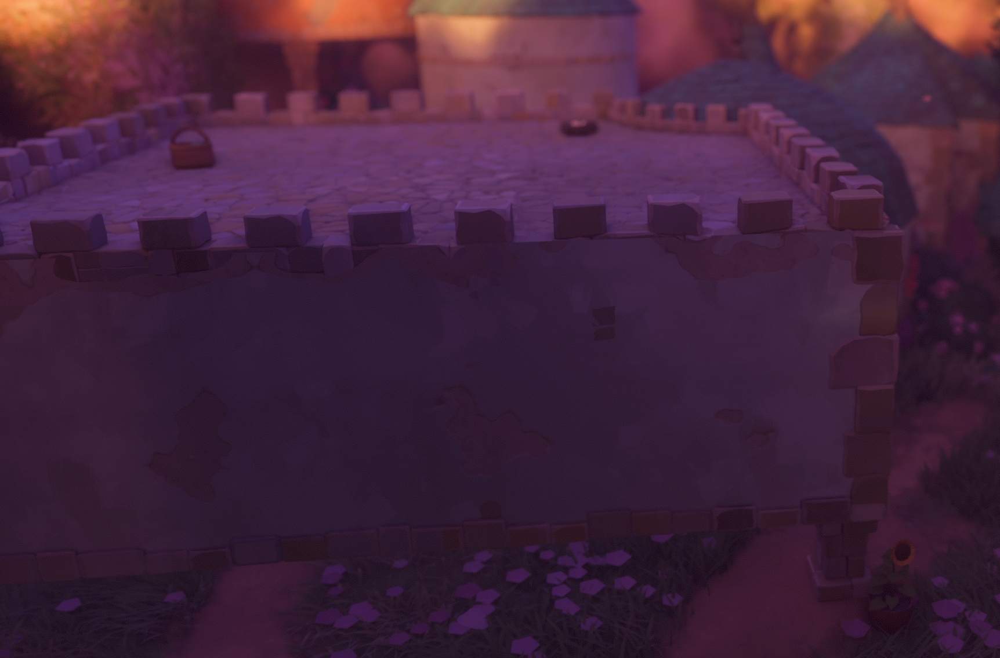
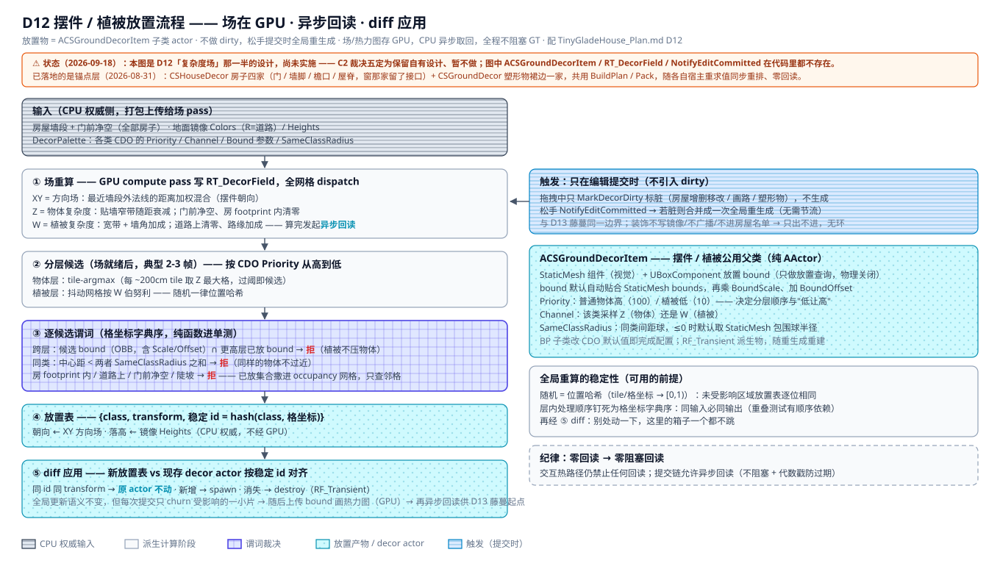

# Tiny Glade 式交互房屋计划：csmesh 地面 + 事件驱动房屋系统

用 `UCSMesh` 家族（对象 + 算子库 + 渲染组件，已全部落地，见 [`GpuMesh_DynamicMeshWrap_Plan.md`](../../../../GpuMesh_DynamicMeshWrap_Plan.md)）实现 Tiny Glade 式高交互房屋：gpumesh 地面 + 顶点色道路笔刷、房屋拉尺寸、道路穿墙自动开门/连拱、房屋相接自动生接缝角柱、特征标记（窗户等）由房子裁决生成、悬空自动生承重柱。所有行号为 2026-08-27 现状。

## 结论

- **地面不用 Landscape**：新 `ACSGroundActor` 持有规则网格 `UCSMesh`（`CopyFromMeshSnapshot` 上传，`UCSMeshRenderComponent` 渲染），同时维护一份 **CPU 权威镜像**（高度 + 顶点色，UPROPERTY 序列化）。GPU 顶点色只是镜像的投影；所有 gameplay 查询（道路判定、柱子高度）与拾取都打镜像，不做 GPU 回读、不给 gpumesh 加碰撞。
- **v1 通知不用 CSSceneDirty3D，全部直推**（用户裁决）：任何变动必然触发更新，不做区域过滤。地面侧经 `ACSGroundActor::OnGroundChanged` 多播委托广播（已实装：逐笔落笔、全量重建、编辑器拖动三处触发）；房/窗自身变动由 `UCSHouseSubsystem` 每 tick 变换快扫捕获。消费者收到即无条件重求值，无效唤醒被幂等哈希吸收成零成本。广播携带变更世界盒但 v1 无视——它是将来量级上来后切回 [`cs-scene-dirty-3d-design.md`](../../../../doc/cs-scene-dirty-3d-design.md)（仍为零代码设计稿，藤蔓/道路/水体的接入计划不受影响）的过滤接缝。
- **房屋 = 声明式重求值，不是事件驱动的增量补丁**：任何唤醒（移动、拉尺寸、地面直推、窗户增删移）都走同一条 `ReevaluateSite()`。"纯函数"说的是**推导那一步的形态**，不是不要 actor——门洞/柱/接触段这些目标状态由 `F(自身参数, 地面镜像, 邻居注册表, 特征标记列表)` 只读推导、不带历史不带副作用；actor 仍是目标状态的宿主与执行者（持参数、缓存哈希、比对后重建网格）。收益：N 种事件 × M 种中间状态的增量补丁矩阵收敛成一个入口，重复/自发唤醒被哈希短路——直推架构的"必然更新"因此可以粗暴而不出错；判定逻辑还能脱离场景直接进 automation 测试。
- **开洞不走布尔：墙板按 2D 剖面直接生成带洞真几何**（用户裁决 2026-08-29「尽可能不用 MeshBoolean」，取代早先的「闭合实体 + `ApplyMeshBoolean` 减 cutter」；更早的网格跳格方案仍然作废）。三条路线权衡后的落点——按格跳面贴不住拱/圆的剪影会漏缝；布尔的洞缘精度受 cutter 三角化限制，且引擎侧至今没有"常驻房体 − 原型 cutter"的 mesh 操作数入口；而**洞的形状本来就是有限的原型集合**（拱 / 矩形 / 圆…），每种原型配一条手写 2D 剖面，`CSHouseMeshBuilder` 生成墙板时按剖面直接砌出带洞几何，洞缘精度只受剖面分段数控制、洞口内壁一并产出。当前落地的门拱（`RebuildBodyMesh` 的墙段盒 + 12 段半圆拱带）已经是这条路线的实例，D8 窗户沿用同一形态。**布尔降级为最后手段**：仅当某形状确实写不出剖面时才考虑，届时才需要重开"给 `ApplyMeshBoolean` 补 mesh 操作数入口"这条（已关闭的开放问题）。~~逐像素 clip（Tiny Glade 的做法）作为可选的精度/成本优化留在 D14，**受 GI 代理约束限制**。~~ ⚠️ **2026-08-30 用户裁决订正：避免所有真几何洞。** 剖面仍是唯一真源，但它现在喂的是 `FCSOpeningClipField` 的**逐像素判据**而不是「砌出带洞几何」——墙板是整块实心盒，洞一律在渲染层挖（顶点色或门洞那套 clip 场）。「带洞真几何」以及「另建带真洞的低模代理」都不再允许；代价（mesh SDF / 软件 Lumen / 硬件光追里拱门是实心墙）已由用户知情接受，见 D14。
- **接缝角柱不属于任何一个房子**（针对"归属"问题的裁决）：`UCSHouseSubsystem` 检测接触对，生成/销毁中立的 transient `ACSHouseSeamActor`，key 为两房 GUID 无序对。对称关系没有自然主从；中立宿主让"任一方移动/删除 → 重建/销毁"的生命周期单点化。备选"GUID 小者拥有"已否：owner 删除要转移、对称逻辑塞进房子内部、双方重建时序耦合。接缝不序列化——可从两房状态完全重导出，加载时重建。 ⚠️ **2026-08-30 用户裁决订正：两栋房交汇时只产生接缝砖，其它任何内容都是独立的。** `ACSHouseSeamActor` 这个 **actor 形态被否决**，接缝降成 TG 那种**纯函数**（输入两房 footprint / 朝向 / 高度，输出砖列；零共享状态、零跨房簿记、零撤销）；角柱邻近合并、接缝接受 openings、跨接缝仲裁**全部退出范围**。见 D7。
- **公共基类 `ACSTinyGlade`**（用户裁决，已落地）：地面/房屋/接缝都是"CPU 权威数据 → 快照 → `UCSMesh`"的同构 actor，统一继承 `ACSTinyGlade`（`ComputeShaderGenerator/Public/CSTinyGlade.h`）。基类收敛：网格底座（`UCSMeshRenderComponent` + transient `UCSMesh` + `UploadTinyGladeSnapshot` 上传/材质绑定管道）、声明式重求值入口 `virtual ReevaluateSite()`（基类空实现；地面是权威源不消费世界变化，不 override）、未来 `UCSHouseSubsystem` 的统一注册类型。**无网格辅助 actor 是例外**，保持普通 `AActor`：拉尺寸 handle（gizmo 道具）、地形塑形物（隐形高度影响体）、特征标记（窗户等，见 D8——本身无可视网格，生成物全归宿主房）。
- **交互全部依托编辑器原生能力**：笔刷走既有 `FCSBrushEdModeBase` EdMode 曲线；移动房子用标准 transform gizmo（`PostEditMove` 触发）；**拉尺寸不做自定义 EdMode/HitProxy**（用户裁决）——`EnterResizeMode()` 生成挂在房子下的临时 handle actor，选中它用标准 gizmo 拖动，handle 在 `PostEditMove` 里把位移投影到所属墙法线并直推宿主房；失选或调用 `ExitResizeMode()` 即销毁（见 D5）。核心入口都是 Runtime 模块 BlueprintCallable，运行时（PIE 游玩）外壳后置。

## 现状盘点

### 可直接复用

| 设施 | 位置 | 用途 |
| --- | --- | --- |
| `UCSMesh` + `FCSMeshResident`（8 流含 Color，回读闭环） | `ComputeShaderGenerator/Public/CSMesh.h:70/:366` | 地面/房屋/接缝的网格载体（标记类无网格） |
| `UCSMeshOps::CopyFromMeshSnapshot`（CPU 快照上传） | `CSMeshOps.h:408` | CPU 参数化生成 → GPU 的唯一入口 |
| `UCSMeshOps::SetVertexColors`（全网格常数色） | `CSMeshOps.h:323`、`CSMeshOps.usf:337` | 球刷算子的 shader/算子模板 |
| `BuildMaterialSections`（逐三角 MaterialId → 多材质分段绘制） | `CSMeshOps.h:355` | 一个房屋网格带 墙/顶/砖/柱 多槽材质 |
| `UCSMeshRenderComponent` + proxy `SetExternalStreams` 外部绑定 | `CSMeshRenderComponent.h:32`、`CSGpuMeshSceneProxy.h:150` | 渲染叶子，重建只重绑不重跑 |
| `CSMeshBuild::BuildSnapshotFromCSTriangleData` / 法线口径 | `CSMeshBuild.h:36/:75` | 快照构建兜底；面法线必须从这里取（与引擎差一个负号） |
| `FCSBrushEdModeBase`（视口射线、笔刷球、stroke 生命周期） | `PCGEditorProcess/Private/CSBrushEdModeBase.h:55` | 顶点色笔刷 EdMode 的基类 |
| `FSelectedActorViewportOverlayBase`（选中 actor 视口浮动面板） | `SelectedActorViewportOverlayBase.h:15` | 笔刷/拉尺寸参数面板 |
| `CSGpuMeshObjectTests` / `RoadMeshSaveTests` 测试模式 | `ComputeShaderGenerator/Private/Tests/` | 新增测试的模板 |

### 缺口（本计划要补的）

- **CSSceneDirty3D 零代码**：`SceneDirty|Dirty3D` 在 `Plugins\PCGPlugins\Source` 无任何命中；全插件没有 WorldSubsystem、没有跨 actor 变更通知。现有防自环只是采集侧的 `ExcludedActor` 指针/标签黑名单（`CSBoxSceneCollection.h:82-89`）。（v1 已裁决**不补**——用直推替代，见 D3；此条保留为现状记录。）
- **无笔刷式顶点色写入**：Color 流唯一写入算子是全网格常数色；`RoadBuilder.usf:636/774` 也只写硬编码常量。
- **无 gizmo/handle/drag 代码**：`Gizmo|InteractiveTool|InputBehavior` 零命中；ITF 只是 `ModelingComponents` 的传递依赖。既有笔刷 EdMode 反而主动关掉 transform widget（`CSBrushEdModeBase.h:71-74`）。
- **无任何房屋/墙/门窗/柱代码**：纯白纸。
- **无图元生成算子**：`AppendBoxSceneTriangles` 是"从场景抽取"，不是生成盒子；墙板/砖块/柱子走 CPU 参数化生成 + 快照上传，不新写 GPU 图元 kernel。
- **gpumesh 全线 `NoCollision`**（`CSGpuMeshComponent.cpp:14`）：CPU line trace 打不到地面与房屋网格——拾取全部走解析（见 D1/D5）。
- 参考但不依赖：`ACSLandscapeRoad` 的 spline→`UCSMesh` 管线与 `ACSLandscape` 编辑层都绑在引擎 Landscape 上，本计划的道路语义是"顶点色权重"，与其无关（远期融合见开放问题）。

## 总体架构

```text
ACSGroundActor ──镜像(权威: Heights/Colors)──► gameplay 查询（道路权重 / 地面高度 / 解析拾取）
      │ 笔刷/重建/拖动 → OnGroundChanged 直推（必然广播，不过滤）        ▲
      ▼                                                                │ 查询
UCSHouseSubsystem（注册表 + 变换快扫 + 接触检测 + 分发）─────────────────┘
      ├─► ACSHouseActor.ReevaluateSite()  → 门洞/柱/自身网格重建（哈希守卫）
      ├─► ACSHouseSeamActor 生成/重建/销毁（接触对，中立归属）
      └─► 特征标记（窗户等）注册表直通 → 宿主房裁决：生成/拒绝
```

两条变更流（房子移动 / 地面被绘制）各自改什么，见对照图：[`tiny-glade-house-change-flows.svg`](tiny-glade-house-change-flows.svg)



唤醒源与通道分工——全部直推，结构化关系额外走注册表：

| 唤醒源 | 通道 | 消费动作 |
| --- | --- | --- |
| 地面：道路笔刷逐笔 / 塑形物增删移改（D9）/ 全量重建 / 拖动平移 | `OnGroundChanged` 多播直推（笔刷/重建/拖动已实装） | 全部注册房屋无条件重求值（门洞、柱） |
| 房屋移动/拉尺寸 | subsystem 每 tick 变换哈希快扫（编辑器另有 `PostEditMove`） | 自身重求值 + 涉及接触对重算 |
| 特征标记增删移（窗户等） | attach / 注册表直通（保留"哪个标记、什么诉求"的结构化信息） | 宿主房逐条裁决可行性 → 生成或拒绝 |
| 房屋网格重建产出 | 无需发布——其他房屋只关心 footprint，经快扫可见 | — |

- 直推只当**唤醒信号**，数据一律在消费时从权威源重查（地面镜像、注册表）；广播里的变更盒 v1 无视。
- 消费者注册/加载时必须**先主动重求值一次**——广播只覆盖之后的变化，与地面加载重建的注册顺序无保证。
- 变换快扫兜住一切移动来源（gizmo、蓝图、物理），不依赖删改委托的完备性。

### 模块与文件布局

```text
Plugins/PCGPlugins/Source/CSHouse/          # 新 Runtime 模块，依赖 ComputeShaderGenerator
  Public/CSHouseTypes.h                     # FCSHouseParams / FCSWallOpening / FCSHouseContact
  Public/CSHouseActor.h                     # D4 房屋 : ACSTinyGlade，override ReevaluateSite
  Public/CSHouseFeatureMarker.h             # D8 特征标记基类（隐形纯 AActor，attach 即注册；窗户 = 首个子类）
  Public/CSHouseSeamActor.h                 # D7 接缝角柱 : ACSTinyGlade（RF_Transient）
  Public/CSHouseResizeHandleActor.h         # D5 拉尺寸 handle（纯 AActor：gizmo 道具，无 csmesh）
  Public/CSHouseSubsystem.h                 # 注册表 + 快扫 + 接触检测 + wake 分发
  Public/CSHouseRoof.h                      # 屋面共享求值器（EvalZ/EvalNormal/IsUnderRoof + FCSRoofDesc），见 D4
                                            #   已落地，但落在 ComputeShaderGenerator/Public 下（CSHouse 模块尚未拆出）
  Public/CSHouseProfile.h                   # 洞的 2D 剖面求值器 CSHouse_ArchProfile —— 砌洞/内壁/重叠谓词三处唯一真源
  Private/CSHouseMeshBuilder.cpp            # CPU 参数化生成（带洞墙板/屋顶/柱/砖）→ FCSGpuMeshCPUData
  Private/Tests/CSHouseLogicTests.cpp       # 门洞区间/接触段/柱布点纯函数测试
                                            #   已落地（5 例：屋面求值/法线/脊向滞回/边缘分割/离地收窄），
                                            #   同样暂居 ComputeShaderGenerator/Private/Tests
ComputeShaderGenerator（既有模块内新增）
  Public/CSTinyGlade.h                      # 公共基类（已落地）：网格底座 + ReevaluateSite 入口
  Public/CSGroundActor.h                    # D1 地面 : ACSTinyGlade（已落地）：镜像 + 解析拾取 + OnGroundChanged 直推；
                                            #   与 ACSPointBrushActor 同居——同为"笔刷目标 actor"先例
  Public/CSGroundShaperActor.h              # D9 地形塑形物：隐形高度影响体（纯 AActor，非 ACSTinyGlade）
  Public/CSSplineBlockActor.h               # D11 Spline 块排布 : ACSTinyGlade（已落地，含单测与演示资产）
  Public/CSGroundDecorItem.h                # D12 摆件/植被公用父类（规划）；场与放置逻辑扩在 CSGroundActor，纯 CPU
  CSMeshOps 新增 PaintVertexColorsSphere    # D2 通用顶点色球刷算子（已落地）
PCGEditorProcess（既有编辑器模块内新增）
  CSGroundPaintEdMode                       # D2 笔刷外壳（已落地），继承 FCSBrushEdModeBase
  CSHouseResizeSelectionWatcher             # D5 选择监听：失选即通知宿主房 ExitResizeMode
```

unity/jumbo 构建纪律：新 TU 的 file-local helper 按模块前缀命名（`CSGround_` / `CSH_`）。

## D1 地面：`ACSGroundActor`（已落地）

实际落地在 `ComputeShaderGenerator/Public/CSGroundActor.h`（成员注释即文档）。要点：

- 继承 `ACSTinyGlade`：网格底座（渲染组件 / `UCSMesh` / `UploadTinyGladeSnapshot` 上传管道）在基类；地面是权威数据源、不消费世界变化，不 override `ReevaluateSite()`。
- CPU 镜像 `FCSGroundMirror`（`NumVertsX/Y` + `CellSize` + `Heights` + `Colors`，UPROPERTY 序列化）是唯一权威；GPU 网格是投影，`RebuildGroundMesh()` 经 `BuildSnapshotFromMirror` → 基类上传管道全量重建（加载 `PostRegisterAllComponents`、改形参、移动松手时）。
- 查询/拾取全走镜像：`SampleHeight` / `SampleRoadWeight`（R 通道）/ `SampleColor` 双线性；`RaycastGround` 解析求交（平地平面快路径 + 起伏半格步进 march），不给 gpumesh 加碰撞。
- 落笔入口 `ApplyPaintStroke(WorldCenter)` + `Begin/EndPaintStroke` 括号（BlueprintCallable，Python/测试可直接驱动）；笔刷参数（半径/衰减/强度/颜色/通道门/混合）归 actor 所有，EdMode 每次落笔读取。
- 顶点布局约定 `id = y*NumVertsX + x`（行主序）；绕序遵守常驻流口径 `cross(B-A, C-A) = +Z`；UV0 = 局部坐标 / `UVWorldPeriod` 世界平铺。
- 变换约定：仅支持平移（常驻流是世界空间）；编辑器拖动期间 `TranslateMesh` 增量平移，松手全量重建对齐。
- 地形形状变化（D9）**不走笔刷**：由不可见的地形塑形物驱动 `Mirror.Heights` 重导出（见 D9，已落地）。**区域更新 + GPU 位移**：`RefreshHeightsInRegion(union(旧足迹, 新足迹))` 只重算受影响矩形的镜像格点，GPU 侧走一个 compute pass（`UCSMeshOps::DisplaceGroundShapers`）原地改常驻流的 Z 与切线 —— 不再重建整张快照、不再整网格重传。法线在 kernel 里对同一个高度场做**解析**中心差分（不读邻居顶点，避开同 dispatch 内的读写竞态），clamp 写法与 `BuildSnapshotFromMirror` 逐字一致，所以区域更新与全量重建给出同一张法线、边界看不出接缝。`MaxAbsHeight` 直接从塑形物参数取（= max 台高），不扫全表。
- 序列化体量：默认 256² 格（257² 顶点）≈ 0.5 MB；1025² ≈ 8 MB，上限与分块见开放问题。
- PIE 里画的内容随 PIE world 丢弃属预期；持久创作在编辑器 world 进行。

## D2 顶点色笔刷（已落地）

```cpp
// UCSMeshOps 已落地的通用算子（CSMeshOps.h）：读 Positions 流（SRV）做球距衰减，写 Color 流。
// 对任何 UCSMesh 可用，不只地面。只动颜色流：计数/分段/bounds 全部保持。
UFUNCTION(BlueprintCallable, Category = "CS GpuMesh|Colors")
static UPARAM(DisplayName = "Target") UCSMesh* PaintVertexColorsSphere(
	UCSMesh* Target, FVector Center, float Radius, float Falloff, float Strength,
	FLinearColor Color, FLinearColor ChannelMask,
	ECSMeshPaintBlendOp BlendOp = ECSMeshPaintBlendOp::Replace);   // Replace/Add/Max/Erase，公式契约见枚举注释
```

- 首版全顶点 dispatch + 距离剔除（百万顶点的球刷 pass 微不足道）；网格矩形子派发留作优化。
- `ACSGroundActor::ApplyPaintStroke` 双写：GPU 算子 + 镜像 CPU 孪生（`CSGround_BrushWeight`/`CSGround_BlendColor`，与 kernel 同公式同 8-bit 量化）。查询只走镜像并过阈值，视觉只走 GPU；parity 测试用 `ReadbackMeshSync` 容差断言双侧一致（P1 验收项，测试待写）。
- EdMode 外壳 `FCSGroundPaintEdMode`：继承 `FCSBrushEdModeBase`；基类的 `TraceCandidatePoint` 已改为 protected virtual，叶子 override 成 `RaycastGround` 解析求交（地面无碰撞，`FoliageTrace` 打不到）。stroke 期间每次鼠标移动直接落笔（无 pending 预览）；Esc 与既有笔刷同样不撤销（无 Undo 是笔刷家族的既定裁决），`MouseUp`/退出关 stroke 括号并标脏包。启动方式沿用点笔刷模式：`ACSGroundActor::StartVertexColorPaint()`（CallInEditor）广播静态委托 → `PCGEditorProcess` 激活 EdMode。
- 每次落笔直推 `OnGroundChanged`（已实装）——画的过程中房屋实时重判开门；`StrokeDirtyBounds` 仍累计，一是 `EndPaintStroke` 判断要不要标脏包，二是将来切 dirty 时的区域发布素材。

## D3 通知：v1 全量直推（不用 CSSceneDirty3D）

用户裁决：v1 不引入 dirty 系统，只要 actor/地面有变动就必然触发更新。三条通道：

| 通道 | 形态 | 状态 |
| --- | --- | --- |
| 地面 → 房屋 | `ACSGroundActor::OnGroundChanged`（实例多播，携带变更世界盒）；逐笔落笔、全量重建、编辑器拖动平移三处 `Broadcast`（塑形物 Heights 重导出是 D9 的第四处） | 已实装 |
| 房/窗自身变动 | `UCSHouseSubsystem` 每 tick 变换哈希快扫 + 编辑器 `PostEditMove` | P2 |
| 特征标记 ↔ 宿主房 | attach 父链 / 注册表直通（结构化：类型、摆位、参数） | P2 |

纪律：

- 消费者收到广播**无条件**重求值，不过滤变更盒——"必然更新"的语义就是全量；无效重算被结果哈希短路。**但"零成本"只有在短路发生在昂贵计算之前时才成立**——`ACSGroundShaperActor` 今天的短路点在 `BuildStepPlan` 之后，每次广播白跑上千次采样（见 D9）。纪律精确为：**消费者可无条件重求值，但短路必须发生在昂贵计算之前**；做法是把哈希从"输出哈希"扩成"输入 + 输出"两级，不引入区域过滤。
- 消费者注册/加载时先主动重求值一次；广播只覆盖之后的变化。
- 广播频率上界 = 笔刷 tick + 拖动帧率；判定是 CPU 镜像采样，几十栋房屋量级无压力。量级上来后的升级路径是切回 [`cs-scene-dirty-3d-design.md`](../../../../doc/cs-scene-dirty-3d-design.md)：发布侧已收敛在三处 `Broadcast`，消费侧已收敛在 subsystem 分发，两边各换一层即可，房屋逻辑不动。CSSceneDirty3D 设计稿保留，藤蔓/道路/水体按原里程碑另行推进。

## D4 房屋：`ACSHouseActor`

```cpp
USTRUCT()
struct FCSHouseParams
{
	FVector2D FootprintSize = {600, 400};   // 底面尺寸 cm，拉尺寸改这里；位置/朝向用 actor transform（支持任意 yaw）
	float WallHeight    = 300;              // 檐口高
	float WallThickness = 24;               // 墙厚
	float RoofPitch     = 35;               // 双坡屋顶坡度（度）
	float HeightOffset  = 0;                // 相对地面参考高度的抬升；用户拖 Z 由 PostEditMove 反算回写
	float PanelCell     = 25;               // 砖模数（接缝角柱堆块 / 墩样式 / 洞缘装饰用）；全代码库尚无实现
};

USTRUCT()
struct FCSWallOpening   // 一个洞 = 原型剖面 + 沿边的摆位（形状是有限集合，不存任何切出几何）
{
	ECSOpeningType Type  = Door;    // Door=道路推导 | Window=特征标记注册 | Stair=第三方注入（穿墙，见下）
	ECSOpeningShape Shape = Arch;   // 原型 id：Arch（矩形下身+半圆顶）/ Rect / Circle …有限集合
	int32 EdgeIndex = 0;            // 边缘线段索引（矩形房 = 0..3；多边形 footprint 后为折线段索引）
	float CenterS   = 0;            // 沿边参数位置（从边起点算的弧长）
	float Width     = 0;            // 洞宽（沿边）
	float Z0        = 0;            // 洞底，墙空间高度；门恒 0，窗台/楼梯口 > 0
	float Z1        = 0;            // 洞顶，墙空间高度（取代早先的"从墙基算的 Height"）
	FVector2f AxisUS = {0, 1};      // 切轴在 (沿边 U, 墙内法线 In) 平面内的方向；(0,1) = 垂直墙面，楼梯斜穿时非 (0,1)
	float Skew      = 0;            // Z1 沿 S 的线性斜率；楼梯洞顶随坡倾斜
	FGuid SourceId;                 // (线段,子段) 或 特征标记 GUID / 注入方 id，滞回与哈希用
};
// 墙板生成时按 (Shape 的 2D 剖面, Z0/Z1/Skew, AxisUS) 直接砌出带洞几何与洞口内壁——不生成 cutter、不跑布尔。
// 每种形状只有一条手写 2D 剖面；开洞不携带、不生成、不回读任何 per-opening 几何。
```

**为什么现在就要 `Z0/Z1/AxisUS/Skew`（用户指令 2026-08-29：楼梯暂不做，但洞逻辑必须容纳它）**：早先的 `Height`（从墙基起算）+ 隐含的"切轴 = 墙法线"这两条硬编码，把三类洞挡在门外——① **楼梯穿墙**：洞底在半空（踏面高度）、洞顶随坡倾斜、切轴是楼梯行进方向而非墙法线；② **窗台高度**：D8 的窗至今只能从墙基起算，窗台高压根表达不出来；③ **多边形 footprint 的转角洞**：切轴需要偏离单一边的法线。三者共用这一个判决点，所以字段要在 D8/P6 冻结 openings 格式**之前**加，不能等楼梯排期。楼梯本身（Tiny Glade §4.1/§4.2）明确不在 D1–D13 范围内，见「开放问题」。

配套的两条约束：`QueryFeaturePlacement` 的重叠判定是"**同边一维 S 区间**"——比的是两个洞的**面板格**（`CSHouse_OpeningCell`：半宽 + 半个墩）按 `OpeningClearance` 膨胀后是否相交，`Z` 不参与（**用户裁决 2026-08-30，C1 选甲：永久放弃"门上开窗"**；此前一度升级成 `(S, Z)` 二维矩形，但墙板是沿 S 的单游标扫掠、每块面板只带一个 clip 场，二维谓词会放行几何砌不出来的堆叠——谓词必须与几何同维）；`AxisUS ≠ (0,1)` 的洞在墙板上是斜切，剖面要沿 `AxisUS` 扫掠而不是沿法线挤出。

- **重求值主环**：override `ACSTinyGlade::ReevaluateSite()`，三步——**① 落座**：目标房底 Z = **max(footprint 全域地面高度)** + `HeightOffset`，与当前 Z 差超容差（0.5 cm）才 `SetActorZ`（规则详解见下条）。地形抬升/下沉，房子跟着走；改 Z 会再触发一次快扫唤醒，第二轮目标不变即短路收敛。用户在编辑器拖房子 Z = 改 `HeightOffset`（`PostEditMove` 反算回写）——地形与用户意图叠加而非互相覆盖。**② 房体 desc**（输入 = 参数 + openings；注意 openings 里的门**同时依赖 Colors 与 Heights**——离地越高门越窄直至消失，见 D6，所以改地形一样会改房体）。**③ 柱 desc**（输入 = 落座后的房底 + 支撑点地面高度**而已**——拱间墩不属于柱，见 D6，所以纯地形变化只动柱组件、不重建房体）。两份 desc 各自哈希守卫，谁变重建谁。所有唤醒源都汇到这一个入口。
- **落座规则（用户裁决）：地形隆起引起的房屋抬升量 = 跟该房有关的地形隆起最大值，屋顶升高值与之一致；隆起与塌陷完全对称。**
  - 房子是刚体，房底与屋顶同抬同一个值，所以"屋顶升高 = 地形隆起最大值"等价于"房底抬升 = 地形隆起最大值"；**墙高不变**，房子整体平移。
  - **升降对称，不是只升不降的棘轮**（用户裁决）：地形塌陷/塑形物被移走时，房子同样按"与自己相交的最高地形高度"重新采样并**下降**，屋顶随之降低。这是绝对式写法自动带来的性质——每次从当前 `Heights` 重算，方向无关；若误写成增量式或 `Z = max(当前 Z, 地形最高)` 这类"顶上去"语义，房子就只升不降，地形移走后永远悬在空中。
  - **取 max 在两个方向上都保证"至少一点触地"**：隆起时房子任何一处不被埋，塌陷时房子不会整体悬空（最高点始终贴地）；`HeightOffset > 0` 是用户显式要的悬空，另算。
  - **写成绝对式而非增量式**（架构必需）：`房底 Z = max(Heights over footprint) + HeightOffset`。当前基底恒为 0（`Heights` 即塑形物隆起量），所以 `max(Heights)` 就是"地形隆起最大值"，两种表述等价。**绝不能实现成"抬升 Δ = 上次到这次的隆起增量"**——那要记住上一次地形状态，破坏"目标状态 = 当前输入的纯函数"，重求值两次就会叠加两次。将来若引入非平基底，规则按字面保持需改取 `max(Heights − BaseHeights)`，仍是绝对式。
  - **取 max 的域是 footprint 全域**（按格遍历 footprint 覆盖的镜像格），**不只周界支撑点**——否则 footprint 正中间冒起的塑形物会顶穿地板而无人察觉。支撑点采样只用于 D9 柱布点，两者的域不同，别复用同一份结果。
  - 取 max 的直接后果：房子**任何一处都不会被埋**；最深的空隙出现在 footprint 的最低点，由 D9 承重柱填上；同一空隙也让该处的门按 D6 连续收窄——三条规则在此自洽。
- **落座的几何代价**：常驻流是世界空间、渲染组件用绝对变换，`SetActorZ` **不会**带动已生成的几何。仅 Z 变而房体形状未变时走 `TransformMesh`——一个位置+切线 pass，不重建；形状也变了（门贴地条件翻转等）才全量重建。柱组件按新落座重生成。
  - ✅ **哈希已拆（2026-08-29 落地）**：此前 `ComputeDoors()` 把量化世界变换与几何参数、门集合拌进同一个哈希数组，而落座本身就改 Z、容差与量化都是 0.5 cm ⇒「地形抬 1 cm → 落座 → 全量重建」是常态而非边界，这条便宜路径根本不可达。现在是两级——`ComputeDoors()` 只出**形状哈希**（几何参数 + `RidgeAxis` + 门集合），`ComputePlacementHash()` 单出量化世界变换；房体与柱各自持 `{ShapeHash, PlacementHash, BuiltAtTransform}` 三元组，形状变→全量重建，仅摆位变→`ApplyBodyPlacement()`/`ApplyPillarPlacement()` 走一刀 `TransformMesh`。柱的形状哈希同步去掉了世界变换（柱长本就吃了世界 Z，平地纯 XY 平移不改它）。**合成顺序**：UE 的 `C = A * B` 是"先 A 后 B"，所以增量 = `BuiltAt.Inverse() * NewWorld`（写反了房子会在远离原点处飞走）。`UCSMeshOps::TransformMesh` 同 pass 改 Positions 与 Tangents（逆转置法线）并变换 `WorldBounds`，平移与 yaw 都支持。
  - **顺序纪律（写进代码注释）**：必须**先照常算完门、再比 `ShapeHash`**，绝不能"位置没变就跳过算门"——门的存亡由 `SampleRoadWeight(世界 XY)` 决定、门宽由 `GapMax = 房底 Z − SampleHeight(世界 XY)` 连续决定，**门集合本来就是世界摆位的函数**；`ShapeHash` 不是"局部量"，是"已把世界采样吸收进去的派生量"。算门很便宜（约 340 次镜像双线性）。收益范围因此如实收窄为「落座 + 门不翻转的移动」——而落座恰是 D9 塑形物场景的常态。
  - 浮点累积：连续 N 次增量变换会攒误差，`PostEditMove(bFinished=true)` 做一次全量重建对齐——`ACSGroundActor::PostEditMove` 已经是这个模式，照抄。**已落地**：`ACSHouseActor::PostEditMove` 在 `bFinished` 时置 `bForceFullRebuild`（显式 bool 而不是"哈希置 0"当哨兵——CRC32 理论上可以真的算出 0）。
- **生成**：`CSHouseMeshBuilder` 纯 CPU 直接产出**带洞的闭合实体**（带厚度的墙 + 双坡屋顶 + 山墙 + 按 openings 剖面砌出的洞与洞口内壁；`FCSGpuMeshCPUData`，`IsValid` 要求的 tangents/UV0 全填，面法线取 `CSMeshBuild::ResidentFaceNormal` 口径）→ 基类 `UploadTinyGladeSnapshot`（4 槽材质表）上传 → `BuildMaterialSections`。**没有布尔那一步**：洞在生成时就在，不是减出来的。房体材质槽固定：0 墙面 / 1 屋顶 / 2 装饰砖（预留）；柱子不在这份网格里（独立组件，见 D9）。
- 拖拽期间每帧重建 = 一次基体快照上传（千级三角，纯 CPU 生成 + 一次上传）。**取消了早先的"拖拽中只重建基体不切洞、松手补切"降级条款**——那条是为布尔链的成本准备的，它同时也是全计划唯一会造成肉眼可见"两种房子"的条款，违反 Tiny Glade §1.1 那条很强的简化纪律（"画线进行中与抬笔定稿走**完全相同的重建管线**，砖 SSBO 无任何预览专用变体"）。新的验收判据照抄它：**拖拽中任意一帧暂停，画面与松手后逐三角相同**。
- 拾取：房屋是参数化 OBB，subsystem 提供 `PickHouse(Ray)` 解析求交；不加碰撞体。
- 变更检测：编辑器 `PostEditMove`/`OnConstruction`；PIE/运行时由 subsystem 每 tick 变换哈希快扫兜底。重建产出不发布任何通知——其他房屋只关心 footprint，经快扫可见。

### 房体生成必须走异步编辑（前置改造，用户确认）

房子的最终产物在 GPU，**不该为它阻塞游戏线程**——尤其标记拖拽期间每帧都要重建墙板。核实现状：

- ✅ **异步原语已有**：`UCSMesh::EditMeshAsync`（`CSMesh.h:511`），注释写明的适用场景正是这条——"a generation triggered from the editor UI, where the flush is the whole hitch"。
- ❌ **算子层还没通**：`UCSMeshOps` 的算子**全部**经 `EditMeshSync`（`CSMeshOps.h:23` 明写），而 `EditMeshSync` = `ENQUEUE_RENDER_COMMAND` + **`FlushRenderingCommands()`**（`CSMesh.cpp:948-957`）。去掉布尔后房子稳态是 **2 次 flush**（`CopyFromMeshSnapshot` 一次 + `BuildMaterialSections` 一次），柱组件再 1 次。

**这是当前代码对计划已定纪律的不合规，不是计划的空白。** 「零阻塞回读」节已经写死"交互热路径禁止任何 `*Sync` 算子"，但今天两条热路径都在违反它：

- `ACSGroundActor::ApplyPaintStroke`（`CSGroundActor.cpp:217-233`）**每次鼠标移动无条件**调 `PaintVertexColorsSphere` = 1 次 flush，且该算子 `ThreadCount = VertexCapacity`、**全网格 dispatch**（1024² 地面 = 105 万线程去改 169 个格点）。
- 20 栋房的村庄画一笔穿过的路，某个鼠标 tick 里门集合翻转 ⇒ `1（笔刷）+ 20×2（房体）+ 20×1（柱） = 61 次 FlushRenderingCommands 落在一个 GT tick 内`。危害不是 61 个停顿，而是**彻底取消 GT/RT 流水并行**——帧率被钉在「GT 时间 + RT 时间」的串行和上。对照 Tiny Glade：同一操作设备同步 **0** 次（CPU→GPU 全部是持久 SSBO 的增量子区间写，§1.4/§2.1/§5.1）。

三步修，从便宜到贵：

1. **`PaintVertexColorsSphere` 加区域参数**（约 20 行）：照抄同文件 `DisplaceGroundShapers`（`CSMeshOps.cpp:1414-1459`）的形态——`FIntPoint RegionMin/RegionMax` → `FUintVector4` + 行主序 id 解码（地面顶点布局 `id = y*NumVertsX + x` 已是约定），`ThreadCount = RegionW*RegionH`。默认半径 300 / `CellSize` 50 ⇒ 13×13=169 格点：256² 从 66,049 → 169，1024² 从 1,050,625 → 169。**这一步只省 GPU 线程数、不省 flush**，价值是让 dispatch 不再随地面尺寸线性膨胀。
2. **落笔路径去掉 flush**：`ApplyPaintStroke` 只写镜像（本就是权威）+ 把笔刷矩形并进 `StrokeGpuDirtyRect`；新增 `FlushPaintToGpu()` 由 EdMode 每帧调一次，走 `EditMeshAsync`；被在途拒绝时把脏矩形合并进下一帧（pending 合并纪律见下）。落笔 flush：每帧 1 → 0。副作用只有"GPU 顶点色比镜像滞后 ≤1 帧"，纯视觉——所有查询走镜像。
3. **整栋房子一次异步编辑，而不是每个算子一次。** 一个 edit 内可放任意多 pass，把"上传基体 → 排序分段"组进**同一个 `EditMeshAsync` 的 EditFunc**、同一张 RDG 图。重构形状：每个算子拆成「内部 `AddXxxPasses(FCSMeshEditContext&, 参数)`」+「外层薄 UFUNCTION 包一层 `EditMeshSync`」——`AddSetCountersPass` / `InvalidateSections` 已经是这个形状。**不能**用"每个算子各发一次异步编辑"：见下条，会互相拒绝。**只把上传异步化是 2→1 而不是 2→0**，`BuildMaterialSections` 必须一起进去。

**三条硬约束（`EditMeshAsync` 的契约，踩了就是崩溃或静默失效）**：

1. **EditFunc 是 owned**（`TFunction` 移入），它读到的一切也必须由它拥有。`EditMeshSync` 那种"捕获栈上快照的裸指针"在这里是 use-after-free——房体快照必须 `MoveTemp` 进 lambda。
2. **在途时会被拒绝**：已有异步编辑未完成时再发 → 返回 false 且 `OnComplete` 永不触发。所以房子必须做**最新态合并**：被拒时把目标 desc 存进 pending 槽，`OnComplete` 里比对 pending 与已应用的 desc，不一致就再发一次。拖拽 30 Hz 下这条是常态而非边界情形。
3. **别在后面跟同步算子**：异步编辑在途时发起的 `EditMeshSync` 虽然 FIFO 有序、结果正确，但**会一直阻塞到两者都跑完**——等于把省下的 flush 又还回去。房体链路里 `ComputeWorldBoundsSync`、`EnsureCapacitySync` 都是这类；bounds 房子能从参数算出（不必调），容量则**预留足量**、只在真正不够时接受一次同步扩容。
4. **`BuildMaterialSections` 的 `SetSections` 必须搬进 `OnComplete` 的游戏线程尾巴**（异步化时最容易静默失效的一处）：它的 `bSorted` 标志在 lambda 体内置位（`CSMeshOps.cpp:1495-1497` 注释明写"Set inside the edit, read after EditMeshSync's flush"），随后才 `SetSections`。异步化后 lambda 体在渲染线程录图时执行，游戏线程会在它置位前就读到 `false` ⇒ **症状是"房子永远只画一个材质"且无任何报错**（代理 `bVerifyUsedMaterials=false`，不校验）。

**收益边界**：异步只解决"不阻塞 GT"，不减少 GPU 工作量。**去掉布尔后不再需要 `CachedOthersMesh` 单刀增量与 `csh.LiveCutHz` 节流**——重建成本降到"一次 CPU 生成 + 一次上传"，且 `EditMeshAsync` 的在途拒绝 + pending 合并给出的速率**自动等于 GPU 实际完成速率**，不需要调参，也不会像固定节流那样在最后一个 tick 落进窗口时吞掉末帧。保留的只有"连续两帧位移小于阈值跳过"，那是输入去抖不是限速。

**验收口径**（并入 P1/P2）：一次落笔 + N 栋房复评期间 `FlushRenderingCommands` 调用数 = 0。

### 屋面：抽一个共享求值器，脊向要显式

Tiny Glade 的屋面是被瓦、梁、尖顶、雪、老虎窗**共同引用的单一求值器**——报告 §3.3【确凿】写明支撑梁 VS "沿 `circle_normal` 按 `roof_profile` 平移，并施加与瓦片**完全相同**的屋面凹陷噪声"，雪 mesh"加与瓦片一致的抖动噪声保证贴合"。不共享就会脱开。

本项目现状：屋面方程散在 `CSHouseActor.cpp:422-437` 的函数内局部量里（`TanP`/`RidgeH`/`EaveOut`/`EaveZ` 全是 const 局部），屋面是两块实体板、山墙是独立三角棱柱；**脊向由 `:417` 的 `bLongX = FootprintSize.X >= FootprintSize.Y` 隐式导出**；计划全文"脊/ridge"零命中。

- ✅ **已落地（2026-08-29）**：`Public/CSHouseRoof.h` —— `ECSRidgeAxis` + `FCSRoofDesc` + 纯函数 `CSHouseRoof_EvalZAcross / EvalZ / RidgeZ / EaveOuterZ / EvalNormal / IsUnderRoof / ChooseRidgeAxis`，全部 header-inline、无 GPU 无 world 依赖。一维内核是 `Z(b) = EaveZ + tan(pitch)·(HalfSpan − |b|)`：屋脊、墙顶、檐口外沿三处关键高度**从同一条方程派生**，不再各写一遍（此前 `RidgeH` 与 `RidgeH0` 就是同一个量算了两次）。房体生成的两块坡板与两端山墙改调它，三角数与像素不变；将来铺瓦、铺梁、以及 D8 那条"落屋顶 → 不生成"的谓词复用同一个求值器。
- ✅ **脊向显式化 + 滞回（同日落地）**：`ACSHouseActor::RidgeAxis` 是 `UPROPERTY(EditAnywhere, NonTransactional)`（`NonTransactional` 的理由同 `DoorSlotOpen`——它是滞回的记忆，被无关改参的 Ctrl+Z 回滚会让屋顶莫名翻面），每次重求值前经 `CSHouseRoof_ChooseRidgeAxis(FootprintSize, RidgeAxis, RidgeSwitchRatio)` 更新，并**进形状哈希**。滞回带默认 `RidgeSwitchRatio = 1.15`：另一根轴要长出当前脊轴 1.15 倍才换向，正方形是带的正中心（谁进来谁留下）。单测钉死"连续单边推拉扫过穿越点全程恰好翻一次"。不做的话 D5 单边推拉一旦让 X 穿过 Y，脊与山墙**原地 90° 跳变**，且 `FootprintSize` 在形状哈希里 ⇒ 拖动中用户看到屋顶"啪"地翻过去。
- ✅ **用户裁决（2026-08-30）：不改 TG 的连续脊长；改用「房屋尺寸更换有最小距离」把翻轴挡在发生之前。**
  PDB 实证 `roof_shape::ridge_length_01_from_rectangle_ratio` —— TG 的脊长是长宽比的**连续函数**，
  根本没有「翻轴」这个事件（状态文件的 C-D5-1）。本可以改成连续形变，**用户明确否决**：
  保留离散脊向 + `RidgeSwitchRatio` 滞回，另加一条最小距离约束，使长宽比不停在翻转点附近。
  - ⚠️ **口径 D5 动工时定死，本条不阻塞下游**：驱动方读作「在 `|X − Y|` 上开一条**禁带** ——
    单边推拉若让差值落进带内，就 clamp / 跳到带外沿」，因为只有它真的**消掉现象**；
    另一种读法「拖动增量小于阈值不改尺寸（死区）」只消抖动、不消翻转。若用户要的是后者，
    改一个常量的事，规格其余部分不变。
  - 上面那条单测「连续单边推拉扫过穿越点全程恰好翻一次」按新口径改写 —— 禁带口径下应是**一次都不翻**。
- 可选、需另行拍板：加 `RidgeLength` / `ProfileCurvature` + 变高墙板。**注意"RidgeLength>0 落出 hip"是逆向报告的【推测】，不是既定事实**。真做的话变高墙板必须改走逐顶点手填 `V = 世界Z/UVScale`（`AddQuad` 的 UV 从 quad 局部 (0,0) 起算），否则山墙纹理随高度拉伸；`RidgeLength` 进哈希后 D5 拖 handle 会整栋重建，需照 `DoorWidthQuantum` 量化。

## D5 拉尺寸：实体 handle actor + 标准 gizmo（用户裁决）

不做自定义 EdMode / HitProxy——手柄是真实的临时 actor，选中它用编辑器原生 transform gizmo 拖，**拖动本身就是通知源**。

- `ACSHouseResizeHandleActor`：小箭头网格（沿所属墙外法线指向）+ 宿主房弱引用 + `WallIndex` + 规范位置（墙外皮中心沿外法线偏出若干 cm）。`RF_Transient` 不存盘；生成后 `AttachToActor` 挂在房子下，房子整体移动/旋转时跟着走。
- `EnterResizeMode()`（BlueprintCallable + CallInEditor）在四面墙各生成一个；`ExitResizeMode()` 全部销毁。进入/退出经静态事件 `ACSHouseActor::OnResizeModeChanged` 广播——沿用笔刷启动的静态委托模式，编辑器模块据此接管监听。
- **拖动 = 通知**：handle 的 `PostEditMove` 把自身当前位置投影到所属墙的外法线轴，算出推拉量后直调宿主房 `NotifyHandleDragged(WallIndex, Offset)`；侧向/竖向分量忽略。房屋单边推拉该墙（对侧不动、中心随动——Tiny Glade 行为，clamp `MinFootprint` 如 200 cm）→ `ReevaluateSite()`（门洞随墙长重判、接触对随即重算）。
- ⚠️ **父子回路：不加记账量的话，墙的位移是鼠标位移的 2 倍**（动工前免费修掉的设计缺陷，D5 尚未落地）。"对侧不动、中心随动"= `FootprintSize += Offset` 且 actor 中心沿该墙外法线移动 `Offset/2`；handle 是子级，父级移 `Offset/2` 会把 handle 世界位置一并带走，而 handle 的规范位置随该墙移动 `Offset`。设第 n 次 `PostEditMove` 开始时残差 `e_n = handle 位置 − 规范位置`、本次 gizmo 增量 `δ`：

  ```text
  Offset = e_n + δ                      # 按"当前位置投影到外法线"算出的推拉量
  e_{n+1} = e_n + δ + Offset/2 − Offset = (e_n + δ)/2
  稳态 e* = δ  ⇒  每次事件 Offset → 2δ
  ```

  **修法：记账量法**（约 15 行，与下条"拖拽期不回写 handle 位置"逐字兼容）——handle 上加 transient `FVector LastConsumedWorld`，`Offset = Dot(GetActorLocation() − LastConsumedWorld, OutNormalWorld)`；调完 `NotifyHandleDragged`（此时房子已改完尺寸与中心、attach 已把 handle 拖走）**之后**立刻 `LastConsumedWorld = GetActorLocation()`。代入递推得 `Offset ≡ δ`，且只更新一个记账变量、不写 handle transform。备选"去掉父子关系、由房子统一摆放全部 handle"**会违反下条**（房子会在拖拽中写正在被拖的那个 handle），要用必须限定为"摆放除 `ActiveHandle` 外的全部"，复杂度反超记账法。
  - 配套单测（进 `CSHouseLogicTests`）：把推拉抽成纯函数 `CSHouse_ApplyEdgePush(FVector2D& InOutSize, FVector& InOutCenter, int32 EdgeIndex, float Yaw, float Offset, float MinFootprint)`——① 连续 10 次 `Offset=0` 不改变任何量；② 单次 `Offset=Δ` 后对侧墙世界位置不变、被推墙恰好移动 `Δ`（这条正好把 2× 钉死）。
  - 不修的代价：P4 验收门会以"拖 1 m 墙走 2 m"失败，而症状（拖拽期高频重建、门拱随墙长重排）与风险节的"门洞抖动""每帧重建的 flush 代价"高度相似，**极易误诊到别处**。
  - PIE 外壳（开放问题）自写拖拽路径时需要同一条累加器纪律，写在同一处头注释。
- **回位规则**：拖拽期间（`bFinished=false`）程序**不回写** handle 位置——gizmo 正在持续写它，双方写会打架；`bFinished=true` 时把四个 handle 统一摆回各自规范位置（顺带清掉用户拖出的侧向偏移）。
- **销毁时机**（任一满足）：显式 `ExitResizeMode()`（结束编辑函数）；编辑器选择变化后，选中集里既没有宿主房、也没有它的任何 handle（选中 handle 视同仍在编辑）；宿主房被删/`EndPlay`。handle 自身兜底：宿主弱引用失效即自毁。
- **选择监听放编辑器模块**：`PCGEditorProcess` 新增轻量 `CSHouseResizeSelectionWatcher`——收到 `OnResizeModeChanged` 后维护"处于编辑态的房屋集"，集合非空时绑 `USelection::SelectionChangedEvent`，失选即调该房 `ExitResizeMode()`。Runtime 模块零编辑器依赖，沿用"runtime 请求、editor 应答"的既有分工。
- 运行时（PIE 游玩）后置方案复用同一 handle actor：拾取换 subsystem 解析射线、拖拽自写，`NotifyHandleDragged` 通知路径不变。
- 注：`RF_Transient` 的 handle 是否会被复制进 PIE world 落地时验证；即使带进去，宿主弱引用失效自毁兜底，无害。

## D6 门洞：边缘线段分割制（单门与连拱同一套逻辑）

判定纯函数（进 `CSHouseLogicTests`）。用户裁决的最终形态：**门依赖房子 actor 的边缘线段生成——按线段长度分割线段，再按分割后的段长创建门**。宽路点亮连续多个子段 = 连拱（配图效果），窄路点亮一个子段 = 单门，同一条路径无特例。早先两版已弃：run 居中单门（run 中点随路加宽漂移，门会滑）、固定模数槽位（余量/护角特判多）。

- **线段抽象**：门的逻辑只认**边缘线段**（P0 / P1 / 外法线），不认"矩形四面墙"——矩形房 = 4 条底边线段；将来多边形 footprint、接缝角柱的接触段都是线段，复用同一函数。
- **按长度分割**：可用长 = 线段长 − 2×`CornerMargin`（60 cm 护角）；N = `clamp(round(可用长 / csh.DoorPitchTarget), 1, ∞)`（目标段距 150 cm），实际段长 = 可用长 / N——**等分**，拱阵天然对称、没有余量特判；段长在目标值附近浮动，拱宽随之微伸缩（Tiny Glade 的"拱会呼吸"观感）。
- **按段长创建门**：每个子段一个门候选——拱宽 = 段长 − `PierWidth`（40 cm），拱心 = 段中点，剖面 = `Arch` 原型（矩形下身 + 半圆顶），`Z0 = 0`、`Z1 = ArchHeight` ≤ 墙高 − 过梁带 `MinLintelBand`（保住墙顶连续砖带）。相邻点亮子段之间的墙体就是砖墩——**连拱不生成额外几何，墙板生成时按各洞剖面直接砌，墩是两洞之间没被剖面吃掉的那截墙**。
  - **拱的分段数应自适应而非写死**：现状 `CSHouse_ArchSegments = 12`（`CSHouseActor.cpp:18`），半圆弦高 = `R·(1−cos(π/24)) = 0.008555·R`，按默认拱宽 110 cm（R=55）是 **0.47 cm** 折角，房子放大即线性放大。公式 `N = Clamp(CeilToInt(PI / (2 * Acos(1 - Tol/R))), 6, 48)`——**注意分母那个 2**，漏掉会在 `Tol=0.2, R=55` 时给出 37 段而非正确的 19 段。
  - **顶带可以合并**：现状在拱段循环里逐段 `AddQuad`（12 段 = 24 三角），而 `SRel = CenterS − R·cos(A)`、A 从 0 到 π 单调 ⇒ 顶带是单调平面带，可合成 1 个 quad = 2 三角，每门省 22 个；且 cos 在两端变化慢，A≈0 与 A≈π 处现在是极窄细条，合并顺带治掉细缝。
- **逐段点亮 + 滞回**：沿子段按 `csh.DoorSampleStep`（25 cm）采样 `SampleRoadWeight`（墙线内外各偏 `DoorProbeOffset` 30 cm 双探测线取大），覆盖率 ≥ `csh.SlotOn`（0.6）→ 开，已开的 < `csh.SlotOff`（0.4）才关。`SourceId` = (线段索引, 子段索引)——N 不变时索引稳定，路加宽只点亮新子段，**已有拱一动不动**；擦除道路逐拱合拢。
  - ⚠️ **滞回表必须序列化，且必须 `NonTransactional`**：`DoorSlotOpen`（`CSHouseActor.h:237`）目前是**裸 C++ 成员、无 `UPROPERTY`**。滞回让 `ReevaluateSite()` 成为路径依赖函数，而承载路径的表冷加载时为空 ⇒ **存盘时覆盖率落在 `[0.4, 0.6)` 的已开拱，重开关卡直接消失**；`RebuildHouse()` 里的 `DoorSlotOpen.Empty()` 还让"手动强刷"与"自然重求值"在同一世界状态下产出不同几何。现有冷加载 VERIFY 抓不住它（只验"加载后再复评不变"，第二次有了表就自洽了）。改成 `UPROPERTY(NonTransactional) TMap<uint32, bool> DoorSlotOpen;`——**`NonTransactional` 不能省**：普通 `UPROPERTY()` 会被事务缓冲整份捕获，一次无关的 details 改参 + Ctrl+Z 就把滞回表回滚到旧代。
  - **纪律（同型的坑还有两处）**：凡双阈滞回，开关表必须与宿主同生命周期序列化且 `NonTransactional`。墩样式双阈（60/75）与接触双阈（`LinkMinOverlap` / `SeamMinExposure` 40-30）是同型；因此 D10 的 `ContactStates` **应挂在房子上而不是 transient 的 seam actor 上**。
  - 相应地，"目标状态 = 纯函数"的表述要精确成 `F(世界状态, 上一次的开关表)`——滞回本来就是有记忆的，把记忆显式化不违反声明式，藏起来才违反。
- **离地越高门越窄，直至消失**（用户裁决；不是二值开关）：同一批采样点上取落差 `Gap(s) = 房底 Z − SampleHeight(s)`，子段内取最大值 `GapMax`，映射成宽度系数——

  ```text
  WidthScale = 1 − saturate((GapMax − csh.DoorGapFull) / (csh.DoorGapZero − csh.DoorGapFull))
  拱宽 = 基础拱宽 × WidthScale        # DoorGapFull 默认 30cm（贴地，全宽）
  拱宽 < csh.DoorMinWidth（40cm）→ 该子段不点亮   # DoorGapZero 默认 120cm（完全消失）
  ```

  房子略微离地时门照常有效（只是稍窄），随着抬升连续收窄，到阈值才彻底消失——**没有二值跳变，因此这一路不需要滞回**（消失点在拱已经很窄时发生，观感上不突兀）。
  - 拱高是否随宽等比缩（避免变成竖缝）留作视觉调参项。
  - **哈希要量化**：`WidthScale` 是连续量，地形每动一点都会改它 → 房体 desc 每次都变 → 全量重建。宽度按 `csh.DoorWidthQuantum`（2 cm）量化后再进哈希，小幅地形抖动不触发重建。**理由订正**：早先写成"防布尔重切"，实际病因是 `CopyFromMeshSnapshot` 的同步 flush（与布尔无关），去掉布尔后这条**依然必需**——它是这条链上唯一的节流器，删掉会让 flush 频率**上升**。与上面"连续量不需要滞回"不矛盾：滞回管的是开关翻转，量化管的是重建频率。
- 推论：**门洞集合同时依赖 Colors 与 Heights**——地形抬升/下沉、房子落座 Z 变化都会改门宽甚至让门消失。这就是"改地形会重建房体网格"的原因，别当成只有道路才动门。
- **让位规则**：门拱优先于特征标记——子段被点亮后，与之相交的窗标记判为不可行（D8 裁决），避免拱窗互切。
- 触发：`OnGroundChanged` 直推 / 房屋移动 / 拉尺寸（状态谓词，与"怎么变的"无关）。拉尺寸使 N 跨越取整边界时该线段整体重流，拖拽中拱重排、松手即稳。
- 两个纯函数分开测：`分割(线段长) → 子段表`、`点亮(子段表, 采样函数, 旧开关) → 开集`。

### 拱间墩与转角墩（用户配图裁决；**与承重柱是两回事**）

参考实拍：[连拱与墩](img/tiny-glade-ref-arcade-piers.jpg) · [转角墩](img/tiny-glade-ref-corner-pillar.jpg) · [双拱之间的墩](img/tiny-glade-ref-twin-arch-pier.jpg)





两张红框图指的是同一件事：**拱之间 / 转角处剩下的那截墙太细，就按叠砖墩的样式表现它**——注意它长得像承重柱，但不是承重柱（见下表）。

### Tiny Glade 本体实拍（用户提供，2026-08-30）



用户原话：**「在原版 TG 中连续的拱门会导致墙体完全不被看到，而是只能看到柱子。」**

这张图把本节挂了很久的问题一次性钉死了，读出三件事：

1. **连续拱之间没有"墙"这个表面**。起拱线以下只有一根**细墩**，两侧直接透到背景的草地。
   本节 `:330` 原先把"整面墙全点亮 ⇒ 退化成敞廊"写成**风险**，实拍说明那不是风险，
   **那就是 TG 的常态观感**。
2. **墩是砖，不是残料墙**。拱圈的楔石**不间断地一路砌到地面** —— 中间那根墩就是相邻两拱的
   砖脚合在一起，砖的走向、尺寸、缝宽与拱圈完全连续，看不出"这里是墙、那里是拱"的接缝。
3. **墙面本身是灰泥**（平滑无砖纹），砖只出现在三处：拱圈、墩、以及墙顶那道**水平砖带**。
   这与「灰泥是独立的四边形网格、砖是另一套实例」那条实测结论一致。

**先厘清概念（用户订正）**：连续门洞之间那截东西**只是看上去像承重柱，实际与承重柱（D9）是两个东西**。

| | 拱间墩 / 转角墩（Pier） | 承重柱（Pillar，D9） |
| --- | --- | --- |
| 成因 | 相邻拱剖面之间**没被吃掉的墙体** | 房子**悬空**，需要落地支撑 |
| 竖向范围 | 墙基 → 拱起拱线 | 房底 → 地面（往下扎） |
| 驱动数据 | 点亮子段的排布 | 支撑点处的地面落差 |
| 归属 | **房体网格**（生成时的自然剩余） | 独立 `PillarMeshComponent` |

两者只是**视觉语言相同**（都是叠砖块），不共享数据、不共享组件、不合并。

**核心规则**：

- 点亮子段确定后，算出周界上的**残料跨度**（未被任何拱剖面吃掉的墙段）。
- 跨度 ≤ `csh.PierStyleMaxWidth`（默认 60 cm）→ 该段按**墩**处理：不额外生成实体，只在渲染上换叠砖样式（独立材质槽，或按 `PanelCell` 在房体网格里生成错缝块面）。
- **零额外几何**：残料本来就是拱剖面之间的自然剩余，墙板生成一次就带出来了。
- ✅ **归属矛盾已由实拍收敛（2026-08-30）**：原文两条互斥（表格说墩归房体网格做"样式切换"、
  末尾说墩进 `PillarMeshComponent`），当时倾向前者，理由是"在残料墙上叠砖柱 = 两份互穿几何"。
  **实拍推翻了这个两难的前提** —— TG 的墩根本不是"残料墙换个样式"，它就是**拱圈砖的延续**。
  所以正确落点是**第三条，两条原方案都不是**：

  > **窄跨度上不生成灰泥面板；墩由已有的门框砖（`BuildFramePlan` 的 U 形砖路）自然构成。**

  这条恰好绕开了原来那个两难：不存在"残料墙 + 叠砖柱互穿"，因为**残料墙不生成**；
  也不需要新组件，因为砖脚**本来就已经砌到地面了**（U 形路径的两条竖直段）。
  "零额外几何"这句语言仍然成立，只是主语从"墙板的自然剩余"换成了"砖路的自然延续"。

  ⚠️ 代价要认：这**推翻**了「墙板生成一次就带出墩」的说法，`RebuildBodyMesh` 的面板循环
  必须支持**跳过**某个跨度。那个循环目前是单游标沿 S 的单调扫掠，跳过一段是小改；
  但它与 **C1**（开洞谓词是二维、面板铺设是一维）是同一段代码，动它时要留意别把 C1 挖深。
- **块列锚点纪律**：墩跨度是连续量，`floor(跨度 / PanelCell)` 会在跨过整数倍时让整墩块面重排——块列必须**从墩的一端锚定**（与 D7 角柱"块列从柱底锚定"同一条纪律）。另注：`PanelCell` 至今**全代码库零实现**，承重柱仍是光板方盒（`CSHouseActor.cpp:465-495`）。

**转角情形的补充**：路斜穿房角时，转角两侧的末端子段都会点亮。此时**允许拱剖面越过子段端点延伸进转角**（否则转角会留一整块方墙，与配图不符）；转角墩的跨度按周界弧长算 = `d1 + d2`（转角两侧各自到最近点亮子段的距离），过阈同样按墩处理。跨转角的洞正是 `FCSWallOpening.AxisUS` 要用到的第一个非楼梯场景——切轴不再等于单一边的法线。

**迟滞**：跨度卡在阈值附近会让样式反复切换——双阈（60 cm 转墩 / 75 cm 转回墙），与门拱滞回同一纪律。

**与特征标记的交互**：墩跨度不接受窗——`QueryFeaturePlacement` 里要把这些跨度从可放置墙矩形中扣掉，否则窗会挖在墩上。

~~**风险**~~ **→ 预期观感（实拍确认）**：整面墙全点亮时房子退化成敞廊（全是拱与墩），屋顶靠这些墩承担——不只是「非 bug」，这正是 TG 连续拱的常态样子，见本节顶部实拍；此时若房子还悬空，D9 的承重柱会**另外**从房底伸到地面，两者并存不冲突（成因不同、竖向范围不同）。

## D7 接缝角柱：相接检测 + 中立归属

> ✅ **用户裁决（2026-08-30）：两栋房交汇时只产生接缝砖，其它任何内容都是独立的。**
> ⇒ 本节的 **actor 形态被否决**：`ACSHouseSeamActor` + 弱引用 + 自 tick + 交点表生命周期 +
> 角柱邻近合并 + 跨接缝仲裁**全部退出范围**。接缝降成 TG 那种**纯函数**（TG 侧实证：三个系统共 12 个参数，
> `IntraShapeCorners → InterShapeBrickStitches` 那一级只有两个参数）：输入两房 footprint / 朝向 / 高度，
> 输出砖列，零共享状态、零跨房簿记、零撤销。
> ⇒ **C-D7-1 的「相交处先开洞」不做成真几何洞**（受下面「避免所有真几何洞」约束）——
> 相交处互相插进对方房间的墙，要么由接缝砖遮挡，要么走渲染层 clip。
> ⇒ **下面「归属形态」「一对房子可能有多处接缝」「复评：做成 actor 还剩哪些障碍」三节自此降级为历史留档，不再是路线。**

```cpp
// 触发条件（用户裁决）：两房 footprint box 真正相交才生角柱——不是"靠得近"。
// 一个轮廓交点 = 一根角柱；两矩形可交出 2/4 点（带 yaw 最多 8）。
struct FCSHouseSeam
{
	FVector2D Point;              // 两房 footprint 轮廓的交点（世界 XY）
	FVector2D BisectDir;          // 两墙夹角的角平分方向，决定角柱朝向
	float ExposureA, ExposureB;   // 交点沿各自轮廓到下一交点/本房转角的外露走线长
	float Top, Bottom;            // Top = min(两侧檐口)；Bottom = max(两房底 Z, 柱下地面高度)
};
// key = (HouseGuidA, HouseGuidB) 无序对 —— 一对房子一个接缝 actor，内部持 0..N 个交点
```

- **触发 = footprint box 相交**（用户裁决，取代早先的"间距 ≤ `LinkGapMax`"）：两房 2D footprint OBB 真正重叠、且 Z 区间相交，才生接缝；靠得再近只要没碰上就不生。所见即所得，没有"多近算近"的调参问题。检测与生命周期全部归 `UCSHouseSubsystem` 仲裁，算法、每帧顺序、迟滞与风险评估见 [D10](#d10-ucshousesubsystem注册表变换快扫接触仲裁)。
- **归属**：中立 `ACSHouseSeamActor`（`RF_Transient`，不序列化，加载时重导出），由**本次运动的房子**创建、两端任一失效即自毁（见「复评」与「归属形态」）。任一端移动/拉尺寸/删除 → 交点表重算：变了重建，全空即销毁。
- **生成**：每个交点一根**叠砖角柱**——按 `PanelCell` 模数逐层错缝堆块（**块列从柱底锚定**，避免交点微动导致整柱重排），截面 ≥ 两侧墙厚 + 余量以盖住穿插处，从 `Bottom` 砌到 `Top`；`ACSHouseSeamActor : ACSTinyGlade`，CPU 生成经基类上传管道进自己的 `UCSMesh`（材质槽 2 砖）。instanced 路线（`UCSGpuInstancedMeshComponent`）暂不用：`SetInstances` 是 `UPROPERTY() TArray<FTransform>`（96 B/实例进关卡包）且每次 mutator 全量 repack + Morton 重排 + 一次阻塞 flush，对静态小段墙无收益。**"无 per-instance custom data"这条理由已过期**——见 D14，它离可用只差顶点工厂里的两行；真要走实例化路线应直接用 `SetInstanceSourceGPU`（GPU 产实例、零回读），不要经 `PerInstanceTransforms`。

### 归属形态：自管理接缝 actor vs subsystem 集中管理

候选：**A = 自管理**（接缝 actor 只引用两个房子；**运动的那个房子创建它**，之后任一房变更都通知它自更新）；**B = 集中管理**（subsystem 检测、创建、销毁，接缝只是几何载体）。

**用户指出的关键前提：actor 的移动/修改是有先后顺序的**——不存在 A、B 同时交互，因此不会各建一个接缝。这条前提成立（编辑器逐 actor 触发 `PostEditMove`；多选拖动、蓝图批量、关卡加载、流送进出都是顺序的），据此**"重复创建"这条反对意见不成立**，早先记的"跨接缝仲裁是硬阻塞"也判重了（复评见下）。

| 维度 | A 自管理 actor | B subsystem 集中 |
| --- | --- | --- |
| 谁创建（诞生） | ✓ 运动的房子创建；顺序性保证唯一 | ✓ 单点仲裁 |
| 扫描"我和谁叠上了" | △ 需要一份全体房屋登记表（可以是类静态表，不必是 subsystem）；村庄量级线性扫足够 | ✓ 空间哈希，天然在手 |
| 自维护（重算自己的缝） | ✓ 两操作数一次 OBB SAT，推送式，无变更零开销 | △ 轮询快扫 |
| 跨接缝角柱合并 | △ 可做：邻居 = 两端房子各自的接缝表之并；合并归属按 key 定序，两侧独立算出同一结论 | ✓ 全局视图直接聚簇 |
| 相位/时序 | △ 自 tick + 标脏 + pull 式 `EnsureRefreshed(Gen)`（"tick group 分两相"已否，见复评）；否则同帧重复算、合并读到未更新的兄弟缝 | ✓ 一个循环里排好序 |
| 生命周期 / 清理 | ✓ 弱引用失效或收到删除通知即自毁 | △ 需 flush 清理 |
| 确定性 | ✓ 存在性是几何的纯函数，与创建顺序无关；合并用 key 定序 | ✓ 同 |
| 逻辑内聚 / 可扩展 | ✓ 接缝算法在接缝里；不同接缝类型 = 不同子类 | △ 规则堆进 subsystem |

### 一对房子可能有多处接缝：身份与内容分开

用户指出的问题：房子是立方体，A 与 B 之间**可以有多处接缝**（轴对齐十字叠合 = 4 处；两个带 yaw 的矩形轮廓最多可交出 8 个点）。而房子更新后，接缝**可能要变也可能不用变**——旋转是一定要变的。这直接推翻了早先"box 相交 ⇒ 一对房子至多一处接缝"的简化。

**解法：一对房子一个接缝 actor，actor 内部持一份可变长的交点表。**

```cpp
// ACSHouseSeamActor —— 身份 = 这一对房子，与接缝数量无关
FGuid HouseA, HouseB;                  // 规范化无序对，就是它的全部身份
TArray<FCSHouseSeam> Seams;            // 0..N 个交点，每次刷新整表重算
uint32 InputSignature = 0;             // 两房 OBB + Z 区间的量化哈希，决定要不要重算
uint32 SeamsHash      = 0;             // 交点表哈希，决定要不要重建网格
```

- **身份不随几何变**：交点数从 1 变 4、从 4 变 0，actor 都不销毁不重建——旋转导致交点表内容大改时，actor 与 key 都不动，没有早先"`EdgeIndex` 变 → key 漂移 → 销毁重建"的那种闪烁。
- **但旋转超过 90° 时接缝销毁是正常的**（用户裁决）：那已经不是"同一处接缝换了姿态"，而是重叠关系本身变了——原交点消失、新交点出现，甚至整对不再相交。交点表照实反映即可，**不必为此设计任何延续/补间**。
- **交点表是两个 OBB 的纯函数**：逐边对求交（4×4 = 16 次线段求交，纯 CPU 微秒级）得到轮廓交点，按重叠区质心的极角排序 → 稳定顺序 → 交点表。整表重算，不做增量匹配，因此没有"哪个交点对应上一帧哪个"的配对难题。
- **要不要更新，两级判断**：
  1. `InputSignature` = 两房位置/yaw/footprint/底 Z/檐口高量化后的哈希（约 14 个 float）。**不变就整段跳过**——这就是"房子更新后接缝可能不需要变"的判定；譬如 A 只是改了顶点色或开了扇窗，签名不变，接缝一次浮点都不算。
  2. 签名变了才重算交点表，再比 `SeamsHash`；表不变则不重建网格（例如 A 沿自身墙面方向平移一点点，交点位置动了但落在 epsilon 内）。
- **对"重复计算"的收敛**（用户已接受的那条）：地形抬升导致 A、B 先后落座时，接缝会被通知两次；第一次读到 B 的旧 Z，第二次读到新 Z。因为整表重算是幂等的，第二次直接覆盖第一次，最终状态正确；标脏 + 自 tick flush 可把两次并成一次。

**每处接缝生成什么：角柱**（用户裁决）。触发条件改成"box 真正相交"之后，两房之间已经没有缝隙可填，"砌一段砖墙桥接"的语义不再成立——转而在每个轮廓交点立一根**叠砖角柱**遮住墙体穿插处，与 [D6 拱间墩](#拱间墩与转角墩用户配图裁决与承重柱是两回事) 同一套视觉语言（三者都是叠砖块，但成因各不相同）（这也是用户一直称它为"转角"而非"链接墙"的原因）。接缝表因此就是**交点表**：一个交点 = 一根角柱。

**空间过小则不生成**（用户裁决）：两房虽然相交，但交点处**能给角柱的空间太小**时，直接不生成——两面墙已经近乎齐平/深度融合，没有穿插需要遮，硬塞一根柱子反而突兀。



判据（纯 CPU，两个 OBB 就够）：交点两侧沿各自房屋轮廓的**外露走线长度**——从该交点沿边走到下一个交点或本房转角的距离，两侧都要 ≥ `csh.SeamMinExposure`（默认 40 cm，约角柱截面的一倍多）。任一侧不足即跳过该交点。这条与「侵入过深整体不生」是两个尺度上的同一件事：前者按单个交点跳过，后者（`LinkMaxOverlap`）按整对房子跳过。

### 复评：做成 actor 还剩哪些障碍

按用户前提重新过一遍，**结构性不可能的只剩零条**，剩下的都是工程细节：

1. **仍需一份全体房屋登记表**。运动的房子要问"我现在和谁叠上了"，得有东西能枚举房屋。`TActorIterator` 每次拖动帧遍历全世界 actor 太浪费，所以还是要一张表——但它可以是 `ACSHouseActor` 的类静态 `TArray<TWeakObjectPtr>`，注册/注销在 `PostRegisterAllComponents` / `EndPlay`，**不需要 subsystem 的 tick 循环**。村庄量级（≤ 数百栋）线性扫 OBB 完全够，空间哈希是纯优化。
2. **角柱合并的相位**（最尖锐的一条，但不是阻塞）。邻居可查：接缝 A–B 的候选冲突方 = 房子 A 的接缝表 ∪ 房子 B 的接缝表 − 自己；合并归属按规范化 key 比较，**两侧各自独立算出同一结论**，不需要中央仲裁。剩余问题是"算的时候兄弟缝是否已更新"——**定死为 pull 式 `EnsureRefreshed(Gen)`，"tick group 分两相"那条作废**：① 同一 TickGroup 内 actor 无顺序保证，要有序必须 `AddTickPrerequisiteActor`，而**房子根本不 tick**（`CSTinyGlade.cpp:12` 基类构造 `bCanEverTick = false`，落地是 delegate 同步回调），两者不在同一调度域；② 编辑器 world 里 actor 默认不 tick，而这套系统的主场景恰恰是编辑器；③ P5 验收门全是几何断言，测不到相位错误。
   - pull 式的原语已齐：`ReevaluateSite` 幂等 + 双 desc 哈希短路 + `bInReevaluate` 重入保护。`ACSTinyGlade::EnsureRefreshed(uint64 Gen)`，seam 的 `RefreshFromOperands()` 第一件事就是对两端房子各调一次——落座必然先于交点表求解，**相位约束从"调度顺序"降级成"函数调用顺序"**。
   - 两个必须写进实现的点：① **代数不要用 `GFrameCounter`**（同一帧内的多次外部变更——逐笔 Broadcast 就是——会被误判为已刷新），用变更代数计数器，**且与 D12 的输入代数戳共用一个**；② `bInReevaluate` 今天是"重入就 return"，pull 模型下这会让一次本该刷新的调用静默变 no-op 而 `LastRefreshedGen` 却已写——重入被拒时**不写** `LastRefreshedGen`，或直接 `ensure()` 报出来。
   - **已知盲区**：该启发式假设"会撞在一起的角柱一定来自共享房子的接缝"。四栋房紧密堆叠、两条互不共享房子的接缝角柱恰好贴上时会漏合并。发生条件苛刻，v1 接受；出现即回落集中合并。
3. **同帧重复计算**。A 更新 → 通知 → 接缝算一次（此时 B 尚未更新，读到旧值）→ B 更新 → 通知 → 再算一次。标脏 + 接缝自 tick 里 flush 可收敛成一次，代价是每条接缝一个 tick。
4. **职责扩散**。房子要多背两件不属于"房子"的事：维护自己参与的接缝列表、变更时扫全场。逻辑总量没变，只是从 subsystem 挪进了 house + seam。

### 结论

**A 可行，且在生命周期与内聚性上更好；剩下的都是可解的时序问题。** 采用形态：

- `ACSHouseActor` 持类静态房屋登记表 + 自己参与的接缝列表；变更结束时扫表，新叠上的由**本次运动的房子**创建接缝，已有的收到通知。
- `ACSHouseSeamActor`（原 `ACSHouseLinkActor`）持两个弱引用，收到通知只**标脏**（不同步重算，避开读到半更新的房子），自 tick 里 `RefreshFromOperands()`；两端任一失效即自毁。
- 角柱邻近合并在 `RefreshFromOperands()` 内、对两端房子各调一次 `EnsureRefreshed(Gen)` 之后做，邻居经两端房子的接缝表取得，归属按 key 定序。
- `UCSHouseSubsystem` **保留但瘦身**：不再负责接触检测与接缝生死，只留"地面直推分发 + 低频兜底快扫（捕捉不发通知的改动）+ 调试统计"。若这些也能挂到房子自身，subsystem 可以完全去掉——留作落地时的取舍。

## D8 特征标记：`ACSHouseFeatureMarker`（窗户等）

用户裁决：窗户这类物体**本身不带任何可视网格组件**——它 attach 到房子上，作用只是通知房子"这里有一扇窗（或别的什么）"；**房子根据自身状况决定要不要生成**。可见几何（窗框、窗洞）全部由宿主房在自己的网格里产出，标记只是一份诉求声明。

- **`ACSHouseFeatureMarker`（隐形基类，纯 `AActor`）**：只有一个 `USceneComponent` 根 + 编辑器线框/图标示意（`bIsEditorOnlyActor` 视觉，运行时零渲染），不继承 `ACSTinyGlade`（无 csmesh）。携带：特征类型（`Window` / 后续 `Door` / `Chimney` / `Balcony`…）、**原型形状 id + 宽高**（不携带任何几何资产）。`ACSWindowMarker` = 首个子类。
- **自动 attach，找不到宿主即自毁**（用户裁决，取代早先"无宿主时自由摆放不挖洞"）：放入场景后自行解析宿主——**射线检测**命中房子则 `AttachToActor` 挂上去并吸附到命中墙面；**检测不到房子 → `Destroy()` 自删**。
  - **射线走解析求交，不是引擎 trace**：房子的 gpumesh 全线 `NoCollision`（`CSGpuMeshComponent.cpp:14`），引擎 line trace 打不到——必须调 subsystem/登记表的 `PickHouse(Ray)`（房子是参数化 OBB，D4 已定的拾取方式）。这条不写清楚，实现时用 `LineTraceSingle` 会得到"永远检测不到、窗户一放就没"的结果。
  - 探针：从标记位置沿自身朝向（面向墙的方向）发长 `csh.HostProbeDistance` 的射线；未命中再退一步做 `csh.WindowSnapDist` 内的就近墙面查询（贴着墙但朝向没摆正时不至于误删）。两者都空才自毁。
  - **时机分两层**（用户裁决）：**拖拽期间逐 tick 实时解析并通知宿主**（洞要跟手）；**自毁只在松手时判定**——否则窗户从房 A 拖向房 B 的途中会半路消失。详见下条。
  - **换宿主**：解析到与当前不同的房子 → 先向旧宿主注销 opening、detach，再 attach/登记新宿主——两边各触发一次 `ReevaluateSite`。
  - **宿主被删**：标记随之自毁（"无宿主的标记不存在"是不变量）；编辑器里这是一次可撤销的 transaction，Undo 能把房子和窗户一起找回来。
- **拖拽期间开 tick 实时通知，松手关 tick**（用户裁决）：
  - **开**：拖入场景 / 开始拖动时（首次 `PostEditMove(bFinished=false)`，或拖入生成的预览 actor 在 `PostRegisterAllComponents` 里判定处于拖拽态）→ `SetActorTickEnabled(true)`。
  - **每 tick 做两件事**：① 解析宿主（`PickHouse(Ray)` 解析求交）；② 把当前世界摆位实时通知该房 → 房子跑 `QueryFeaturePlacement` 谓词 + 接受则按新 openings 表重生成墙板（一次 CPU 生成 + 一次异步上传，速率由在途拒绝自动限制）。**本 tick 找不到宿主只是不通知，不自毁**。
  - **关**：`PostEditMove(bFinished=true)` → `SetActorTickEnabled(false)`，随后做最终裁决：解析到宿主 → attach + 登记 opening；解析不到 → `Destroy()`。
  - ⚠️ **编辑器 tick 的老坑**（与接缝 actor 同一个）：actor 默认在编辑器 world 不 tick，必须 `PrimaryActorTick.bStartWithTickEnabled` 配合 override `ShouldTickIfViewportsOnly() → true`，否则整条实时通知在编辑器里静默失效。
  - **兜底**：tick 开启后若连续 `csh.MarkerDragIdleSeconds`（默认 2 s）既无位移也没收到结束事件 → 自动关 tick 并按当前位置做一次最终裁决，防止漏掉 `bFinished` 导致永久 tick。
  - **与"松手才生成"不冲突**：两者消费的东西不同——**洞（房体网格）要跟手**，所以标记拖拽期实时通知；**decor / 热力图 / 藤蔓**只在 `NotifyEditCommitted` 后跑（D12/D13）。标记松手时既触发自己的最终裁决，也汇入 `NotifyEditCommitted`。
- **注册即诉求**：解析到宿主后登记的内容是"诉求"不是"结果"：特征类型 + 世界摆位 + 参数。`EndPlay` / detach / 删除 → 注销。
- **房子裁决（核心）**：宿主 `ReevaluateSite()` 遍历标记，逐条判定**可行性**，只有通过的才进 openings / 生成几何：
  - 落点不在任何一面墙的有效矩形内（挂太高超过檐口、落在屋顶/山墙上、悬在墙外）→ 不生成；
  - 距墙角 < `csh.FeatureCornerMargin` 或与门拱子段冲突（门优先）→ 不生成；
  - 与已通过的标记重叠 → 后者让位（按 `SourceId` 稳定排序，不看注册先后，避免重启后结果翻转）；
  - 通过 → 吸附到墙面（对齐法线、贴外皮）→ 登记 opening（`Type=Window`，`SourceId=标记 GUID`，带 `Z0/Z1` 窗台与窗顶）→ 墙板生成时按该剖面直接砌出洞与洞口内壁，窗框几何一并并入房体网格。
  - 裁决结果回写标记（`bCausesCut` + 拒绝原因），编辑器里以线框颜色区分"已生成 / 被拒（附原因）"——否则用户只会看到"放了个东西但什么都没发生"。`bCausesCut` 的语义就是"房子确实为它切了洞"（用户指定的那个 bool）。
- **洞的实现**：由原型的 2D 剖面按 `(Width, Z0, Z1, Skew)` 沿 `AxisUS` 扫掠出洞与洞口内壁，与门拱同走 openings 通路、同一批剖面；重叠在登记前就被谓词判掉，不需要布尔去"求并"。
- 移动标记 → 重判：从"通过"变"被拒"则墙面合拢（按新的 openings 表重生成墙板），反之亦然——纯状态谓词，无增量补丁。
- 好处：标记零几何、零材质、删了不留痕；"无宿主标记"这一整类状态被自毁规则消灭，房子的 openings 表里不会留下悬空诉求；房子是所有可见几何的唯一产出者（材质槽、生成链、哈希守卫全在一处）；将来加"烟囱/雨棚/花箱"只是新增一个标记子类 + 房子里一段生成分支，不动通知与生命周期。

### 洞的记录形式：剖面 + 摆位（不存任何切出几何，也不切）

**门是固定的扇形/拱形，窗同理——形状是有限集合，根本不需要保存切出来的形状**（用户裁决，推翻此前的"CPU 侧切出碎片"方案）。CPU 只存原型 id + 一组摆位参数；判重叠时把原型的已知剖面按同样参数变换比较；生成墙板时按剖面直接砌出洞。

2026-08-29 的追加裁决把这条推到了终点：**既然剖面已经在手上，就不需要先用它生成 cutter 再去减了**——直接拿剖面砌墙板。于是原方案的负担在"不存几何"之外又消掉了一层：

| 原方案的负担 | 现在 |
| --- | --- |
| 布尔弃片捕获（`MB_SRC_KEEP` compact 到 retained buffer） | 不需要 |
| 每次提交一次回读刷新碎片记录 | **回读彻底归零**（不只是热路径零，是全程零） |
| `FCSOpeningCutRecord` 分桶、世界空间三角、失效重捕获 | 不需要 |
| cutter 资产必须开 `bAllowCPUAccess` | 不需要（不读任何网格顶点） |
| 拖拽开始建"除自己外"的冻结集 | 不需要（openings 表本身就是记录，随时可查） |
| 三角对三角距离 + AABB 粗筛的精度分档 | 退化为矩形比较，几十次浮点 |
| cutter 原型**资产**（每形状一份静态网格） | 不需要——只要一条手写 2D 剖面（C++ 或 `UDataAsset`） |
| `ApplyMeshBoolean` 的 mesh 操作数入口（引擎侧待补） | 不再是前置，开放问题关闭 |
| 布尔链的 TDR 三道闸 / `CachedOthersMesh` 单刀增量 / `csh.LiveCutHz` | 全部删除 |

**判重叠 = 沿边一维区间比较**（**用户裁决 2026-08-30，C1 选甲**）：同一 `EdgeIndex` 上，两个洞的**面板格**（`CSHouse_OpeningCell`：`[CenterS ± (Width/2 + PierWidth/2)]`）按 `csh.OpeningClearance` 膨胀后是否相交。**`Z` 不参与**——`Z0/Z1` 只描述洞自身，不再用来判冲突，代价是**永久放弃"门上开窗"**（TG 里这种堆叠也确实罕见）。一度写成 `(S, Z)` 二维矩形，但墙板生成是沿 S 的单游标扫掠、每块面板只带一个 clip 场，二维谓词会放行"谓词说能放、几何砌不出"的堆叠，直接违反下面那条唯一真源纪律。比**格**而不是比洞，是因为格才是扫掠真正消费的那个区间。不同 `EdgeIndex` 只需在转角附近做一次角余量检查。

**"重复挖洞"问题自然消失**（用户点明的收益）：洞是**声明式的参数记录**，重叠在进 openings 表之前就被判掉——同一处不会被登记两次。门拱本就锚在互不相交的子段上，天然无重叠；窗由谓词挡在门口。

**剖面求值器必须是唯一真源**：`CSHouse_ArchProfile()` 一个纯函数，三处共用——① 墙板生成时砌洞、② 洞口内壁的扫掠、③ `QueryFeaturePlacement` 的重叠谓词。三处各写一份是这条路线最容易出的错（谓词说能放、几何砌出来却穿帮）。进 `CSHouseLogicTests`。

**代价与边界**：形状受限于剖面集合。将来要真正任意的窗形，就加一条剖面——扩展成本是"多一条 2D 剖面 + 一个枚举值"，不是"回到碎片方案"，也不再是"多一份美术资产"。**形状扩展的成本形态因此变了**：从"美术加资产"变成"程序加剖面函数"，若团队更希望美术自助，这是净损失——缓解是把剖面做成 `UDataAsset`（一串 2D 点 + 圆弧段），美术仍可自助。

### 拖拽握手与吸附回位（零回读）

用户要的交互：拖动期间逐帧把候选位置报给房子问"这里能开窗吗"，房子答应才让标记记住这个位置；与已切过的洞太近/相交则**什么都不做、不回话**；松开鼠标后标记弹回最后一个被答应的位置。

**成本担忧的答复：这条握手一次 GPU 回读都不需要，也不需要每帧全量重建网格。** 前提是守住一条纪律——

> **可行性完全由 CPU 描述符裁决，GPU 只执行、绝不被查询。** 判"能不能开"读的是房子参数、边缘线段、openings 列表（全是 CPU 侧结构）与地面镜像（本就是权威、从不回读）；**绝不允许**出现"先生成一次看看成不成 / 读回网格量一量 / 问 GPU 洞在哪"这类实现。几何生成是裁决的下游，不是裁决的依据。

去掉布尔后这条纪律**没有放松，反而更硬**：`QueryFeaturePlacement` 从"布尔的上游裁决"升级为**唯一真源**——它和墙板砌洞用的是同一个 `CSHouse_ArchProfile()`，谓词说能放就一定砌得出，砌不出的一定被谓词挡住。

```cpp
// 房子侧：纯 CPU 谓词，无 RDG、无 flush、无 *Sync 调用，微秒级
struct FCSFeaturePlacement
{
    bool       bAccepted = false;
    ECSFeatureReject Reason = None;  // NotOnWall / AboveEave / NearCorner / OverlapsOpening / ConflictsArch
    FTransform SnappedWorld;         // 吸附到墙面后的规范摆位，仅 bAccepted 时有效
};
FCSFeaturePlacement QueryFeaturePlacement(const ACSHouseFeatureMarker& Marker, const FTransform& Candidate) const;
```

- **每帧只做谓词**：世界位置 → 墙局部（几次点积）→ 墙矩形内 + 檐口/护角余量 → 候选洞的 `(S, Z)` 矩形 vs 同边已有 openings 的矩形按 `OpeningClearance` 比较（上节；**排除标记自己的那个洞**，否则微移即自撞）。几十次浮点，没有 RDG pass、没有渲染 flush、没有 `*Sync`、**没有回读**。
- **接受了才发 GPU 重建**（用户裁决的实时反馈）：谓词通过 → 更新 `LastAcceptedWorld` → 按新 openings 表重生成一次墙板；被拒的帧什么都不做（GPU 完全空闲）。**不再需要增量路径**——去掉布尔后一次重建就是"一次 CPU 生成 + 一次上传"，`CachedOthersMesh` 单刀增量、`UCSMeshPool` 借还暂存网格、`csh.LiveCutHz` 固定节流三样一并删除。限速交给 `EditMeshAsync` 的在途拒绝 + pending 合并（速率自动等于 GPU 实际完成速率）；保留"连续两帧位移小于阈值跳过"作为输入去抖。
- **代价核对**：拖拽期间每帧 = 一次 CPU 矩形谓词 + 至多一次墙板重生成；**整个交互的回读次数 = 0，异步化后 flush 次数也 = 0**。
- **回位规则**：拖动中程序**不回写**标记位置（与 gizmo 抢写会抖——与 D5 拉尺寸 handle 同一条教训）；松手时若当前位置被拒，`SetActorTransform(LastAcceptedWorld)` 弹回；从未被接受过则弹回吸附前的原位或保持游离（`bCausesCut=false`）。
- **握手语义分两层**，别混：*可行*（每帧谓词，便宜，决定标记能不能停在这）与 *已实现*（提交后房子真的切了洞，置 `bCausesCut`）。用户描述的"告诉附加物体你可以存在在这里"是前者，`bCausesCut` 记的是后者。
- 运行时（PIE）拖拽走同一套谓词，只是位置来源换成解析射线。

**顺带避开的两个真回读**（都在 `UCSMeshOps` 里，拖拽热路径一律禁用）：`ComputeWorldBoundsSync`（GPU 停顿读六个 uint）与 `GetTriangleCountSync` / `GetCountsSync`。房子的 bounds 在 CPU 侧从参数算得出，无需问 GPU。

## D9 承重柱 + 地形塑形物

- **柱布点**（纯函数；注意与 D4 落座取 max 的域不同——落座遍历 footprint 全域，这里只用周界支撑点）：支撑点 = 四角 + 每条底边内部按 `csh.PillarSpacing`（250 cm）等分；逐点 `gap = 房底 Z - SampleHeight(点)`，`gap > csh.PillarMinGap`（10 cm）→ 生柱：方柱截面 `PillarSize`（30 cm），从房底伸到地面并扎入 5 cm。逐点判定天然覆盖"半悬空"（坡地）与整体悬空。
- **岩石与石阶都归塑形物 actor 持有**（用户提问的裁决）：生命周期是纯从属关系 —— 删掉塑形物 = 地形塌回 + 产物全消失，代码里已经是原子的（`Destroyed()` → 注销 + 区域重导出）；这与下面"柱子归房子"是同一形态。做成独立岩石 actor 只会多出一条必须与地面刷新配对的销毁路径（编辑器里删塑形物是一次 transaction，孤儿 actor 要么残留要么要额外的 undo 配对）；归地面所有则违反 D9 已裁决的通知归属（地面只是高度权威 + 广播源，不是 per-shaper 几何工厂），而且岩石重建本身是 `OnGroundChanged` 的消费者，放进地面就成了"在自己的广播里写自己的产物"的自环。**两份产物的组件与重建条件必须分开**：只改道路时不该重跑岩石的切割链（同 D9 "柱子不并进房体网格"的理由逐字成立）。连带结论：塑形物一旦持有 GPU 岩石几何，"无网格辅助 actor 例外"的前提就不成立了 —— `ACSGroundShaperActor` 因此改为继承 `ACSTinyGlade`（空实例零 GPU 分配、无 scene proxy，不花钱），基类的 `UCSMesh` 槽位就是岩石的落点；石阶因为要 GPU 实例化 + 剔除 + LOD，走自己的 `UCSGpuInstancedMeshComponent`（每个 palette 条目一个）。
- **柱子 = 房子 actor 上的独立组件**（用户提议采纳）：第二个 `UCSMeshRenderComponent` + 独立 transient `UCSMesh`（`PillarMeshComponent` / `PillarMesh`，单槽柱材质），仍归房子所有、随房移动删除——归属无歧义不变。**不并进房体网格**的理由（布尔退场后依然成立，只是量级变小）：房体重建要重跑整份墙板 + 屋顶 + 全部洞的剖面砌筑并整份上传，而柱子的输入只有底边 + 支撑点地面高度——塑形物在房下改地形时逐次直推，拆开后每次只重生成几个盒子，房体那份完全不动；并在一起则每次改地形都白跑一遍完整房体生成。也不做独立 actor：柱子生命周期完全从属于单个房子，没有接缝那种对称归属问题，独立 actor 只添注册/销毁同步负担。
- 基类 `UploadTinyGladeSnapshot` 现在只服务主网格；P7 动工时把它参数化成"目标组件 + 目标 mesh"的可复用形式（或加 static 变体），柱组件与房体走同一条上传管道。
- **地形塑形物**（用户裁决：高度**不是**笔刷画的；**已落地** `Public/CSGroundShaperActor.h`）：`ACSGroundShaperActor`——放在地面上的**不可见高度影响体**，它的高度/位置变化影响地形形状。v1 参数化足迹按用户的 Houdini 原型（`TinyGlade.hip` `/obj/geo1/DeformSource`）定形：**圆盘 + 羽化裙边** —— `Radius` 盘内高度恒为台高（原型里 circle 是 poly 面，`xyzdist` 面内为 0，故台顶是平的）、`FalloffDistance` 外沿羽化到 0（原型 bspline lerp 斜坡 ≙ smoothstep）、台高 = 自身 Z 相对地面基面的偏移 + `LiftHeight`（直接把 actor 往上拖 = 整座台加高）⚠️ **口径订正（用户 2026-08-30 裁决七：选甲，照原型）**：二次抬升落地后台顶实为 `LiftHeight × (1 + SecondaryLiftScale)`（默认 300 → 306.3），`LiftHeight` 的契约是**抬升幅度**而不是台顶高；断言一律和 `SampleHeight` 比，不许写死绝对台高。非 `ACSTinyGlade`（同 handle 例外）：游戏内不渲染任何自身网格，**编辑器里用圆柱 + billboard 示意**（`bIsEditorOnly` + `HiddenInGame`），阶梯是它唯一的真实产物。
> ⚠️ **下面两条描述的是 2026-08-30 之前的 CPU 决策版本，已被本节末的「石阶改造：100% GPU 决策 + 零回读」取代。**
> 保留在这里只为读懂现有代码（`BuildStepPlan` / `RDG_SmoothSpline` / `SolveBlockLayout` 那条路仍在仓库里）。

- **塑形物阶梯**（用户指定；**取原型之形，不逐节点搬**）：原型那条 `line→resample→copytopoints→ray→blast @road>0→copytopoints Step` 链在 UE 侧压成三件事 —— 一个解析高度场、一条等高线、一次 GPU 实例散布。塑形物持 `TArray<UStaticMesh*> StepMeshes`（应放**几块不同长度的石阶**）。按 `StepHeight` 把台高切层，**该层等高线的环半径有闭式解**（剖面是纯 smoothstep，反函数 `W = 0.5 − sin(asin(1−2y)/3)`，`R = Radius + Falloff·(1−W)`）——不需要像原型那样把环 copy 上去再 ray 回地面，也不需要二分。只在道路权重过阈的弧段上摆阶梯（画路穿过土台就长出上坡石阶，擦掉路即消失——与 D6 门洞同一条"道路决定开口"的语言）。弧段铺装复用 D11 的 `ACSSplineBlockActor::SolveBlockLayout`（随机取不同长度的石阶填到越界，再整体缩放恰好占满弧长）。
- **石阶散布全在 GPU 线程上**（用户裁决"必须在 gpu 线程中进行"）：CPU 只解"哪一层、哪段弧、第几块石阶落在弧长哪里"这类小规模判定（规模 = 层数 × 弧段数），几何与变换全部在渲染线程的一张 RDG 图里生成 ——
  · 曲线求值用**用户既有的 GPU spline** `UComputeShaderBasicFunction::RDG_SmoothSpline`（三次 B 样条，控制点进 → 位置/切线 buffer 出）；
  · 散布 pass `CSGroundSteps.usf` 消费它的采样，直接写 `UCSGpuInstancedMeshComponent` 的 packed 实例行（5×float4/实例，`InterlockedAdd` 领槽位），**实例个数只活在 GPU 的 counter 里**，CPU 不算一个变换、不回读一个字节，GPU 侧再做剔除 + LOD + DrawIndexedIndirect。
  · 两条必须知道的样条口径：均匀三次 B 样条**不能精确表示圆**（等角控制点会把半径整体缩到 `R(2+cosΔ)/3`），所以控制点半径预先放大 `3/(2+cosΔ)` 补回来；端点因 clamp 会内缩 1/6 弦长，所以两端各**外延一格控制点**、石阶只取内区间的参数。Δ ≤ 10° 时残余纹波 ~1e-5·R。
  · 朝向 = 局部 +X 径向朝外（踏面进深）、+Y 环切向（长度轴）、+Z 世界上；`StepEmbed` 沿半径向内推进扎进坡里（原型 `attribwrangle7` 的 Noffset）。
  · 重散布只是重跑 pass 覆写同一批 buffer 的 counter；**只有容量或包围盒真变了才再调一次 `SetInstanceSourceGPU`**（那条路内部是阻塞的 sync 链 + 立刻重建 render state），拖动期因此不触发。
  · ✅ **散布路径那次 `FlushRenderingCommands` 已去掉（2026-08-29 按下述拆法落地）**：现在是 `EnsureCapacity`（只在真扩容时 enqueue + flush，稳态零 enqueue）+ `Scatter`（按值捕获 palette 数组，录完 pass 直接 return）；调用方两步顺序调用。原分析留档 ——`Work` 在栈上、渲染命令按引用捕获它，所以函数返回前必须阻塞。稳态下容量够用、`MoveTemp` 回写是彻底的 no-op，**这一次停顿纯属技术性的**。拖动塑形物时足迹相交者每帧付一次。修法是拆成 `EnsureCapacity`（只在真需要扩容时 ENQUEUE + flush，`AllocatePooledBuffer` 必须在渲染线程）+ `Scatter`（**按值捕获** `TArray<FPaletteBuffers>`，`TRefCountPtr` 拷贝即加引用，录完 pass 直接 return）。**顺序不能颠倒**——不先拆 `EnsureCapacity` 就去掉 flush，GT 侧的 `Palettes` 永远学不到新分配的 buffer，会从"多一次停顿"退化成"画不出石阶 + 显存 churn"。同步改 `CSGroundShaperSteps.h:50` 的契约注释（"返回时缓冲区可用"正是 flush 在维持的语义）。
  · ⚠️ **哈希短路点在昂贵计算之后**：`RebuildSteps` 的短路发生在 `BuildStepPlan` 之后，而 `OnGroundChanged` 的回调直接把 `ChangedBounds` 注释掉、无条件重跑。默认参数下 `BuildStepPlan` 是 9 层 × 120 方向 ≈ 1080 次 `SampleRoadWeight`，非孤立时加验证采样与割线细分逼近 1 万次；更脏的是 `IsFootprintIsolated()` 每次跑一遍完整 `TActorIterator` 世界遍历。**修法用输入哈希前置**（约 30 行，零裁决冲突）：在 `BuildStepPlan` 之前先算「本座参数 + actor 变换 + 地面单调递增 `GroundRevision`」的输入哈希，不变就 return；顺手缓存 `IsFootprintIsolated()` 的结果。这与 D7 已裁决的 `InputSignature` / `SeamsHash` 两级判断逐字同构，**一个字都没改 D3 的"不做区域过滤"裁决**——只是把哈希从"输出哈希"扩成"输入 + 输出"两级。相应地 D3 的措辞要改准：「消费者可无条件重求值，但**短路必须发生在昂贵计算之前**」。
- **声明式重导出**：受影响区域的 `Mirror.Heights` = 基底 + 全部相交塑形物合成（按羽化权重，重叠取 max）——增删移改任一塑形物 → 对 union(旧足迹, 新足迹) 区域从头重导出（幂等）→ 更新 GPU（区域位移 pass）+ `MaxAbsHeight` + 区域法线重算 → `OnGroundChanged.Broadcast(受影响盒)`。塑形物 `PostRegister` 向地面登记、`EndPlay` 注销、`PostEditMove`/属性变更通知地面。
- **高度传导链与通知归属**（用户问题裁决：地面发给房子，不是塑形物发给房子）：塑形物**永远只与地面对话**（登记/注销/变更通知），房子**永远只订阅地面**——链路 = 塑形物变更 → 地面区域重导出 Heights → `OnGroundChanged.Broadcast` → 房子落座（D4 ①）+ 柱重判。理由：① 地面镜像是高度的唯一权威，房子重求值要读 `SampleHeight`，"重导出完成后才广播"天然保证读到新值——塑形物直发房子存在读到旧高度的时序竞态；② 来源无关——将来高度来源不止塑形物（道路压地、其他系统），房子侧永远只有一条订阅；③ 落座改 Z 后经快扫自然级联（两房底边高度变 → 接触段变 → 接缝重建），全走既有机制，塑形物与房子互不相识。
- **触发闭环**：移动/拉尺寸走快扫；地形形状变化走 `OnGroundChanged` 直推。验收即"房下放置/抬高塑形物 → 柱子自动伸缩增减"。塑形物侧**双向接线已落地**：向地面登记（`RegisterShaper`/`UnregisterShaper`，销毁时刷新 → 地形塌回），同时**反过来订阅 `OnGroundChanged`** —— 别人画路/改地形时本座重摆阶梯（只读地面不写，无自环）。
- 远期：任意 mesh 形状的塑形物走 GPU 光栅化（`RasterizeIndexedMeshToHeightmapRDG` 现成）+ 区域回读进镜像——一次性的权威更新，不违反"查询不回读"纪律（见开放问题）。

### 石阶改造：100% GPU 决策 + 零回读（marching squares）

**用户裁决 2026-08-30：石阶的层 / 弧段 / 摆位全部改由 GPU 从高度场直接推导，CPU 不接触单个台阶，
且不引入任何回读。** 形状照 Tiny Glade `_rocky_terrain_stairs_stairs.cs`（拆解见
[`CSGroundShaper.md`（同目录）](CSGroundShaper.md) 的「对照 Tiny Glade」）。
本节**取代**上面「塑形物阶梯」「石阶散布全在 GPU 线程上」两条已落地描述。

**注意两者不共用扫描域**：岩壳是**逐三角**扫一份烘焙好的壳（无格），石阶是**逐格**扫。
共用的只有高度场（`GroundShaperHeightAt`）与 road mask。TG 也是这么分的 ——
`contouring_grid_dims` 是一张**独立于 `terrain_heightmap_dims` 的格**。

⚠️ **格边长直接决定石阶间距**（每条穿越边出一级），所以它必须 **≈ 石阶长度**：
格太密 → 石阶重叠；格太疏 → 断断续续。这是 TG 把 contouring 格单列一个维度、
而不是复用 heightmap 分辨率的原因。本项目现有石阶长 60 / 100 / 150 cm，
地面 `CellSize` 是 50 cm —— **不能直接拿地面格来扫**，要单开一张约 100 cm 的格。

#### 算法（一线程一格）

```hlsl
// Shaders/Private/CSGroundStairs.usf
[numthreads(8, 8, 1)]
void ScanStairsCS(uint3 Id : SV_DispatchThreadID)
{
    // 1) 四角高度 —— 解析求值，不需要高度纹理（TG 要采 heightmap，我们不用）
    float H[4];
    [unroll] for (uint c = 0; c < 4u; ++c) H[c] = GroundShaperHeightAt(CornerXY(Id, c));

    // 2) 早退：整格落在同一层区间，或路权重不过阈
    const float HMin = min(min(H[0], H[1]), min(H[2], H[3]));
    const float HMax = max(max(H[0], H[1]), max(H[2], H[3]));
    if (floor(HMin / StepHeight) == floor(HMax / StepHeight)) return;
    if (SampleGroundRoad(CellCentreXY(Id)) < StepRoadThreshold) return;

    // 3) 层循环只跑本格真正跨过的层
    for (int L = (int)floor(HMin / StepHeight) + 1; L <= (int)floor(HMax / StepHeight); ++L)
    {
        const float Level = L * StepHeight;
        uint Case = (H[0] > Level) | ((H[1] > Level) << 1) | ((H[2] > Level) << 2) | ((H[3] > Level) << 3);
        if (Case == 0u || Case == 15u) continue;
        // 5 / 10 是鞍点：用格心高度消歧（TG 同样单独处理这两个 case）
        // 每条穿越边先线性插值定位，再 2 次二分精化（同 TG）
        float2 A, B;  if (!SolveCrossing(Case, H, Level, A, B)) continue;

        // 4) 变换在 GPU 组装
        const float2 Mid = 0.5f * (A + B);
        const float3 N   = AnalyticGroundNormal(Mid);          // 或中心差分，见岩壳裁决三
        const float3 T   = normalize(float3(B - A, 0.0f));      // 等值线段方向 = 长度轴
        const float2 In  = -normalize(GroundGradient(Mid));     // 沿坡向内推
        const float3 Pos = float3(Mid + In * StepEmbed, GroundBaseZ + Level + StepZOffset);

        // 5) 领槽位；越界静默丢弃（写入段原样复用 CSGroundSteps.usf）
        uint Slot; InterlockedAdd(RWStepCounter[0], 1u, Slot);
        if (Slot >= StepMaxInstances) return;
        WriteStepInstance(Slot, Pos, T, N, StepInstanceRandom(Slot));
    }
}
```

#### 零回读怎么保住

CPU 不再知道实例数，所以**容量必须一次性定死、永不重算**：

- 上界在 CPU 端由「格数 × 每格最大跨层数 × 2」算出，或直接给一个够用的常数（TG 就是固定 buffer）。
- 越界静默丢弃 —— `CSGroundSteps.usf` 现有的 `if (Slot >= StepMaxInstances) return;` 原样留用。
- **`CSShaperSteps::EnsureCapacity` 整个删掉**。它是这条路上唯一的阻塞点
  （`AllocatePooledBuffer` 必须在渲染线程，真扩容那一趟是阻塞的，见 `CSGroundShaperSteps.h:50` 的契约注释）。
  固定容量之后**连这一次阻塞都没有**，比现在还严格。
- **包围盒不能靠实例算**（只有 GPU 知道）：按「地面矩形 × `MaxAbsHeight`」写死。
  与岩壳 NaN 顶点污染包围盒是同一条处置。

#### 必须放弃的两样（用户 2026-08-30 已确认接受）

1. **`SolveBlockLayout` 变长铺装**。marching squares 每条穿越边出一级，间距由格密度决定，
   没有"沿弧长打包"这个概念。替代照 TG：**单一网格 + 逐实例哈希**驱动尺寸/倒角随机
   （`CSGroundSteps.usf` 的 `StepInstanceRandom` 已经在，正好接上）。`StepMeshes` palette 可保留，
   但改成按位置哈希选，**不再保证首尾相接**。
   *连带好处*：`ACSSplineBlockActor` 取 bounds 的 X、石阶取 Y 这条**长度轴口径分叉**
   （逆向报告第二轮记的）随之消失；`SolveBlockLayout` 只剩 `ACSSplineBlockActor` 与
   `CSHouseActor` 两个消费者，`CSSplineBlockTests.cpp` 不受影响。
2. **B 样条平滑**（`RDG_SmoothSpline` + `3/(2+cosΔ)` 半径补偿 + 两端各外延一格）。
   marching squares 直接给折线，TG 不平滑、靠格够细。**石阶排布会比现在略不规整** ——
   用户 2026-08-30 明确接受这一观感变化，本条不再是待议项。

#### 换来的

- **星形假设消失**：`AnalyticRingRadius` / `AnalyticSlopeAt` 只对"关于本座中心星形"的等值线成立，
  逆向报告第一轮那条「路穿过两座相接土台时接合处石阶弧段断掉」的缺陷**直接不存在了**。
- `IsFootprintIsolated()` 每次跑全世界 `TActorIterator`（报告第二轮）**没了**。
- `RebuildSteps` 的哈希短路点在 `BuildStepPlan` 之后（报告 M4）**不再是问题** —— 整条链就是一次 dispatch。
- **归属**：扫描域是全局的 ⇒ **石阶也归地面**。这把 :504 的**另一半**也翻了，
  `ACSGroundShaperActor` 退回它头注释原本的样子 —— 一个纯粹的"不可见高度影响体"，**零产物**。

#### 保留不变的

等距分层（`StepHeight`）不改成 TG 的非等距 `mix(0.8, 10, i/16)` —— 石阶语义要求等高。
但必须给层数上限防爆（`LiftHeight` 越大层越多）。道路门控仍用 `StepRoadThreshold`，
与岩壳的隐藏阈值共用同一个数（见碎石裁决四）。

#### 分期

1. ✅ **S1 已落地**（2026-08-30）：`Shaders/Private/CSGroundStairs.usf` + `Private/CSGroundStairs.{h,cpp}`，
   宿主在 `ACSGroundActor::RebuildStairs`（`StairMesh` / `StairCellSize=100` / `StairStepHeight` /
   `StairRoadThreshold` / `StairMaxLayersPerCell=32` / `MaxStairInstances=4096`）。
   核查通过：运行时路径零回读（`DebugReadInstancesSync` 只被 `ACSGroundActor` 的调试访问器调用）；
   容量固定、只在首次分配时阻塞一次；石阶归**地面**持有。
2. ✅ **S2 已落地**：逐实例抖动 `StairLengthBloat` / `StairLengthJitter` / `StairSizeJitter` / `StairYawJitter`。
3. ⬜ **S3 未做 —— 且当前有双份石阶的风险**：`ACSGroundShaperActor::RebuildSteps` / `BuildStepPlan`
   （181 行）/ `CSShaperSteps::EnsureCapacity` / `RDG_SmoothSpline` 那条旧路**仍在跑**，只在
   `StepMeshes` 为空时才早退。**塑形物填了 `StepMeshes` 且地面填了 `StairMesh` ⇒ 同一处会摆两套石阶。**
   S3 要做的：删旧路、`CSGroundShaperSteps.{h,cpp}` 瘦身、`ACSGroundShaperActor` 去掉 `StepComponents`
   与 `StepMeshes` 等属性，头注释改回"零产物的不可见高度影响体"。

   ✅ **2026-08-30 用户裁决：照删（原「门框设施冲突」选乙）。** 门框砖不再寄生在这条旧路上 ——
   先把 `ACSHouseActor::BuildFramePlan` 迁成 **100% GPU 解析推导**（一线程一砖，直接从拱参数
   `CSHouse_ComputeClipField` 给出的 `CenterS / HalfWidth / RefZ / InvScaleZ` + 墙框架算位置与朝向，
   **不要样条、不要 CPU 记录、容量恒定因此不需要扩容**），跑绿回归**之后**再删旧路 ——
   顺序反了会让门框先坏一轮。顺带预期消掉门框砖当前的朝向 bug：B 样条会把「门樘→拱→门樘」的 90° 折角
   抹圆并在折角处产生退化切线，解析推导没有这个问题；`CSShaperSteps::ResampleUniform` 那条等弧长
   重采样契约在门框这条路上随之作废。演示关卡的 `legacy_shaper_steps()` 自备夹具在旧路删除后一并删掉。

### 侧面碎石：Tiny Glade 式披挂岩壳（方案，未动工）

原型链与逐节点口径见 [`CSGroundShaper.md`（同目录）](CSGroundShaper.md) 的「链 B」，
Tiny Glade 的实测拆解见同文档的「对照 Tiny Glade」一节；机制示意见
[`CSGroundShaper_Algorithms.svg`](CSGroundShaper_Algorithms.svg) 的 ④。这里只写落地方案。

**裁决一：照 Tiny Glade 做 —— 碎裂图案是 2D 静态资产，三维形态 100% 运行时披挂。**
不在运行时跑 Voronoi、不挤出、不减面。烘一份**平的**碎裂图案（顶圈 + 横向错开的底圈两层），
运行时一趟 compute 逐三角：取 mask 决定显隐 → 每个顶点用**自己的 XY** 取地面高度 → 重算面法线。

原型那条 `Voronoiscatter → connectivity → attribpromote → polyextrude → Findmargin → remesh →
polyreduce → normal(cusp)` 整条链**全部落在离线**：`connectivity`/`attribpromote` 的聚合结果压成逐顶点
`CellId` / `DirToCentroid`；`polyreduce` 的存在理由（`remesh` 过量生产）在离线烘焙里根本不出现。

**裁决二：归属翻转 —— 碎石归地面 actor，不归塑形物。** 这推翻 D9 :504「岩石与石阶都归塑形物持有」
的**岩石那一半**（石阶不变，仍归塑形物 + GPU 实例化）。理由：
- 碎裂图案覆盖整张地面、与任何单座塑形物无关；mask 由**全部塑形物合成后**的坡度决定，归任一座都不对。
- :504 当初的论据是"删掉塑形物 = 地形塌回 + 产物全消失，已经是原子的"。披挂壳把这条做得更彻底：
  删掉塑形物 → 高度场塌回 → 坡度降到阈下 → 那批胞腔自己写 NaN。**归属簿记整个消失，不是变简单。**
- 壳是常驻定长 buffer，没有容量问题，因此也没有"谁负责扩容"的问题。

**裁决三：解析高度场直接喂，省掉 TG 的两张纹理。** TG 要采 `terrain_heightmap`，还要跑一趟
`_terrain_derivative.cs` 求 `|∇h|`；我们的高度是解析的 —— shader 里直接调
`GroundShaperHeightAt`（`CSMeshOps.usf:634`，与地面位移 pass 同一份 `GroundShaperParams`），
**岩壳与地面的一致性因此是构造保证的，不是靠两条路算出同一个数**。

坡度仍用**中心差分**而不是解析导数：高度场是"全部塑形物重叠取 max"，接缝处不可导，
解析导数在那里会给出错误的陡峭度。差分与 TG 的 `_terrain_derivative.cs:104` 同形。

**裁决六：交汇不需要任何代码。** TG 的笔画合成实测就是逐 texel 取 `max`
（`rasterize_terrain_stroke.cs:830` 的 `bool _1785 = _1784 > _319`），与 `CSMeshOps.usf:646` 逐字相同；
壳的胞腔不与任何塑形物对齐，跨在交汇处的胞腔照常披挂。**但**：TG 把 FBM 侵蚀加在 `max` **之前**，
折痕被每笔自己的噪声打碎；我们的高度场没有逐塑形物噪声，两座相接处会留一条干净的几何折痕。
D9 的裙边噪声因此不只是观感项，**它还承担藏折痕的职责** —— 排期时按这个权重算。

**裁决五：路上的壳是"沉下去"，不是"隐藏"。** TG 的隐藏判据里**没有 path mask**（实测
`displace_rocky_terrain.cs:202-206` 只有 `rocky_terrain.x/.z` 与 `water_mask.y`）。路是靠三件事连续压掉的：
噪声关掉（`:581` 只有 `path_mask == 0` 才进 FBM 分支）→ 逐胞腔凹凸乘 `(1 − path)` 淡出 →
整体沿地形法线下沉（`:563` 的 `−10×path` 把 Y 从 +0.2 翻到 −0.4 m，`:577` 的 `− N × path` 再压最多 1.0 m）。
壳仍然在，只是沉到地表以下被地面网格挡住。**必须照抄这条**：用 NaN 关掉的话，画路时三角会一个一个
啪地消失（popping）；沉降是连续的，看着就是"石头慢慢埋进土里"。

**裁决四：裙边高度不写代码。** 底圈相对顶圈**横向错开** `LipOffset`（TG 实测中位 21.4 cm），
两圈各自采自己位置的高度 ⇒ 裙边竖直高度 = 局部坡度 × `LipOffset`。平地自动塌成零高度，
陡坡自动拉成岩壁。这是整套做法里最省的一处 —— 没有任何一行代码在算"这里的岩壁该多高"。

#### 数据契约

壳是地面 actor 上的第二个 `UCSMesh`（与地面本体分开，重建条件不同），标准 5 条流之外
加两条 aux（`FCSMeshResident::AddStream` + `ECSGpuStreamRole::AuxVertex` 现成）：

```cpp
// Public/CSGroundRockShell.h
namespace CSRockShell
{
/** 烘死的逐顶点数据，进 aux 流。位置只有 XY 有意义，Z 只当层标志用。 */
struct FBakedVertex
{
    FVector2f RestXY;          // 静止姿态的世界 XY（相对地面原点）
    FVector2f DirToCentroid;   // 水平，= 原型 attribwrangle3 的 normalize(@P − v@center)
    int32     CellId;          // = 原型 connectivity1 的 @class，逐胞腔随机的种子
    uint8     bIsTopRim;       // 1 = 顶圈，0 = 底圈（底圈已在烘焙时横向错开 LipOffset）
    uint8     bIsCorner;       // = KALOU Voronoiscatter 的 @intersectionpt，供着色/磨圆用
};

struct FBuildParams
{
    float SlopeLo = 0.75f;     // mask = smoothstep(SlopeLo, SlopeHi, |∇h|)，与 TG 同口径
    float SlopeHi = 1.25f;
    float RoadFade = 10.0f;    // road 的沉降权重（TG 用 10×：很小的路权重就足以把壳压下去）
    float RoadSink = 160.0f;   // road 满值时沿地形法线的下沉量 cm（TG 合计约 1.6 m）
    float CellJitter = 0.0f;   // 逐胞腔沿 DirToCentroid 的随机胀缩幅度（TG: −0.195..+0.52 m）
    float CellRelief = 30.0f;  // 逐胞腔沿地形法线的进/出幅度 cm（TG: cell_bby 选 −0.3 m 或 0..+0.3 m）
};
}
```

`RestXY` 是**烘焙时**就定死的世界 XY，运行时唯一会变的是 `Position`（标准流）与面法线。

#### kernel 骨架

```hlsl
// Shaders/Private/CSGroundRockShell.usf —— 一线程一三角，照 TG 的 displace_rocky_terrain
[numthreads(64, 1, 1)]
void DisplaceRockShellCS(uint3 Id : SV_DispatchThreadID)
{
    const uint Tri = Id.x;
    if (Tri >= ShellTriangleCount) return;

    // 1) 显隐：只看坡度，**road 不参与**（road 走 3) 的连续下沉，见裁决五）
    //    三个顶点任一过阈就保留整个三角（同 TG）
    bool bAlive = false;
    [unroll] for (uint k = 0; k < 3u; ++k)
        bAlive = bAlive || smoothstep(SlopeLo, SlopeHi, CentralDiffSlope(RestXY[Tri * 3u + k])) > 0.0f;
    if (!bAlive)
    {
        // 只写第 0 个顶点：一个 NaN 就够让整个三角在裁剪阶段出局，写入量省 2/3（TG 的做法）
        RWPositions[(Tri * 3u) * 3u + 0u] = asfloat(0x7fbfffffu);
        return;
    }

    // 2) 披挂：每个顶点用自己的 XY 取高度 —— 裙边高度就是这一步的副产品
    float3 P[3];
    [unroll] for (uint k = 0; k < 3u; ++k)
    {
        const uint V = Tri * 3u + k;
        float2 XY = RestXY[V];
        XY += DirToCentroid[V] * CellJitter * (CellRandom(CellId[V]) * 2.0f - 1.0f);
        float3 Pos = float3(XY, GroundBaseZ + GroundShaperHeightAt(XY));   // 与地面位移同一条公式

        // 3) 逐胞腔沿地形法线的进/出（块感的来源）+ 道路连续下沉（不是隐藏）
        const float3 N = AnalyticGroundNormal(XY);
        const float  Rock = smoothstep(SlopeLo, SlopeHi, CentralDiffSlope(XY));
        const float  Road = saturate(SampleGroundRoad(XY) * RoadFade);
        const float  Relief = CellIsRaised(CellId[V]) ? CellRandom(CellId[V]) * CellRelief
                                                      : -CellRelief;
        Pos += N * (Relief * Rock * (1.0f - Road) - RoadSink * Road);

        P[k] = Pos;
        WriteVertex(V, Pos);
    }

    // 3) 面法线：侧壁/顶盖都用面法线 ⇒ 天然硬边，不需要原型的 normal cuspangle=29.9
    RWTriangleNormals[Tri] = normalize(cross(P[2] - P[0], P[1] - P[0]));
}
```

**NaN 的一处代价**：它会污染包围盒。TG 不受影响（固定 tile 就是包围盒），我们要么同样按地面
矩形写死 `Resident.WorldBounds`，要么在算包围盒时跳过 NaN。**按地面矩形写死**是对的做法。

#### 密度与尺度（动工前必须先定的一条）

披挂岩壳的三角数由**视觉需要的三角边长**决定，与地面网格密度无关：

| | Tiny Glade | 本项目（建议口径） |
| --- | --- | --- |
| 世界跨度 | ±68.25 m | 128 m（`NumCells 256` × `CellSize 50`） |
| 地表网格三角 | 16,200（91 列） | 131,072 |
| 岩壳三角 | 49,598（地表的 3.06 倍） | ~44,000（**不跟地表走**） |
| 胞腔尺寸 | ~5.5 m（609 个） | ~3 m（~1,820 个） |
| 三角边长 | ~1.2 m | ~1.2 m（同 TG 绝对密度） |
| 常驻显存 | ~8.3 MiB | ~8 MiB |

⚠️ **尺度不对位是真问题**：默认 `Radius=150` / `FalloffDistance=200` 的塑形物裙边只有 2 m 宽，
**装不下 3 m 的胞腔 ⇒ 一块碎石都不会出现**。两条出路，动工前二选一：

1. **放大塑形物**（推荐）：`L_TerrainOpsDemo` 改成 `Radius=600` / `Falloff=800`。这也更贴 TG 的
   艺术口径 —— 1.5 m 的小土包本来就不该长岩壁，TG 里也只有大悬崖长。
2. **缩小胞腔**到 ~1.5 m：三角数 ×4 ≈ 176,000、显存 ~32 MiB，偏重，且 1.2 m 边长的细分在
   2 m 宽的裙边上只有一圈半，观感未必成立。

#### 宿主接线

```cpp
// ACSGroundActor
UPROPERTY(Transient) TObjectPtr<UCSMesh> RockShellMesh;        // 常驻定长，只重写 Position/法线
UPROPERTY(Transient) TObjectPtr<UCSMeshRenderComponent> RockShellComponent;
void RebuildRockShell();                                        // 挂在 RefreshHeightsInRegion 之后
uint32 RockShellInputHash() const;                              // 塑形物集合 + GroundRevision + 参数
```

- 触发点与地面位移**同一趟**：`RefreshHeightsInRegion` 更新完 `Mirror.Heights` + GPU 位移之后，
  紧接着跑一次壳的 displace pass —— 两者读同一份 `GroundShaperParams`，天然同帧一致。
- **短路必须在昂贵计算之前**（`RebuildSteps` 现在的短路点在 `BuildStepPlan` 之后，是本节已记的缺陷，
  别复制那个形状）：`RebuildRockShell()` 第一句就是哈希比较。
- 壳的 mask 依赖 road，石阶也依赖 road，**两者共用 `StepRoadThreshold`**：石阶要 `road > 阈`、
  碎石要 `road < 阈`，严格互补，对应原型 `blast8` / `blast10` 那一对。
- 烘焙侧：碎裂图案由一个 editor commandlet 或 Houdini 导出一次即可（`CellId` / `DirToCentroid` /
  `bIsCorner` 都是 KALOU `Voronoiscatter` 现成的输出），**不需要运行时 Voronoi**。

#### 分期与验收

1. **P1**：手工造一张规则六边形图案（不做 Voronoi）跑通披挂 + NaN 显隐 + 面法线。
   验收：`L_TerrainOpsDemo` 抬台 → 裙边自动出现岩壁、台顶与平地不出现；抬台 300→400 岩壁跟着长高；
   删掉塑形物 → 岩壁自己消失（不需要任何注销代码）。
2. **P2**：换成真 Voronoi 图案（用 `Tiny Glade/extract/rocky_terrain2glb.py` 导出的
   `rocky_terrain_shell.glb`，或自己按我们的尺度重烘），加逐胞腔随机胀缩。
3. **P3**：**块感与噪声** —— 逐胞腔沿地形法线的进/出（TG `displace:577`：`cell_bby` 选
   −0.3 m 或 0..+0.3 m，这一层才让壳读成一块块石头而不是一张毯子）+ 沿法线的 FBM。
   噪声口径照 TG：**gain 0.55、lacunarity 1.9、每层旋转约 36.87°**（矩阵 `[0.8,−0.6; 0.6,0.8]`，
   防止各层格子对齐出轴向条纹），底层用现成的 `VinePerlinNoise3D`
   （`Shaders/Private/VinePerlinNoise.ush`）套十行 FBM 循环即可。**角点不加噪声**
   （TG `:579` 的 `is_corner == 0` 才进分支），否则相邻胞腔的共享角会裂开缝。
   倍频数 TG 侧无法从反编译确证，先取 4 层试。
4. **P4**：与石阶的接缝实测 —— 画路穿台，确认「有路长石阶、没路长碎石」严丝合缝、不重叠不留空环带。

**已知代价**：岩壳是 gpumesh 几何，和房子/地面一样对 Lumen / 距离场 / 光追隐形（见 D14「GI 代理」），
低角度阳光下没有自投影。它是第一个**贴着坡面**的产物，缺自投影最显眼。

## D10 `UCSHouseSubsystem`：注册表、变换快扫、接触仲裁

**已瘦身**（见 [D7 复评](#复评做成-actor-还剩哪些障碍)）：接触检测、接缝生死、角柱合并都已下放给房子与接缝 actor 自管理。这里只剩三件事——**地面直推分发**、**低频兜底快扫**（捕捉蓝图直设/物理这类不发通知的改动）、**调试统计**。下面保留的每帧顺序与风险评估，在自管理形态下由「房子变更 → 通知 → 接缝标脏 → 接缝自 tick 两相刷新」承担，**相位约束一条不变**（尤其"落座改 Z 必须先于接缝重算"）。若最终连分发也挂到房子自身订阅，本 subsystem 可整体去掉。

### 数据

```cpp
// 接触 key：无序对规范化（GuidLo < GuidHi）即可。一对房子可能有多个轮廓交点，
// 但它们同属一个接缝 actor 的交点表，key 与交点数无关 —— 旋转改变交点表内容，
// key 不漂移；超过 90° 时整对不再相交而销毁，属预期（用户裁决）。
struct FCSContactKey { FGuid GuidLo, GuidHi; };

struct FCSHouseTracked
{
    TWeakObjectPtr<ACSHouseActor> House;
    uint32 TransformHash = 0;   // 位置 + yaw + footprint + 檐口高，量化后哈希
    FBox   FootprintBox;        // broadphase 用，随重求值刷新
};

TMap<FGuid, FCSHouseTracked>                     Tracked;
TMap<FCSContactKey, TObjectPtr<ACSHouseSeamActor>> Seams;    // 一对房子一个接缝 actor
TMap<FCSContactKey, FCSContactState>             ContactStates; // 迟滞状态
TSet<FGuid>                                      DirtyHouses;
FCSSpatialHash2D                                 Broadphase;    // footprint AABB，格边 ≈ 房屋典型尺寸
```

### 每帧循环（**顺序是承重的**）

1. flush 注册 / 注销队列（新房、被删房、流送进出）。
2. 收集本帧到达的 `OnHouseChanged` 推送 → 填 `DirtyHouses`（主通道）；低频兜底再跑一次变换快扫，捕捉不发委托的改动（蓝图直设、物理）。
3. 若本帧收到 `OnGroundChanged` → 全体入 `DirtyHouses`（v1 直推不过滤）。
4. 逐个 dirty house 调 `ReevaluateSite()`——**这一步会改 Z（落座）**。
5. **回写哈希基线**：用落座后的变换重算 `TransformHash` 存回 `Tracked`。漏了这步，落座改的 Z 会在下一帧被当成"外部移动"再次唤醒，形成永不停止的 1 帧空转（重求值本身幂等，所以不会出错，只会白烧 CPU 且掩盖真实的抖动问题）。
6. **接触重算**：只处理"至少一端在 `DirtyHouses` 里"的 pair——必须在第 4 步之后，因为接触段的底高取决于落座后的房底 Z。subsystem 只判**存在性**（该不该有这面墙）。
7. 接缝增删：新成立的 `SetOperands` 后建，失效的销毁。
8. 存活链接各自 `RefreshFromOperands()` 重算自己的缝（见 [D7 归属形态](#归属形态自管理-actor-vs-subsystem-集中管理)）。
9. **角柱邻近合并 pass**：全部交点算完后统一聚簇（D10 角柱撞角柱一节）。堆块在合并之后。

### 接触检测

**触发条件就是 box 相交**（用户裁决）：不再有"间距阈值"这个概念——用户把两间房推到叠上才生角柱，所见即所得。

- **粗筛**：`FootprintBox` 原样进空间哈希（不再按间距膨胀），取候选对；每对只处理一次（key 规范化去重，绝不让 A、B 各报一次建出两面墙）。
- **精筛**（纯函数进测试）：2D footprint 的 **OBB × OBB SAT**（4 条候选轴，任意 yaw 天然成立，不再需要"近反平行"判定）→ 不相交直接出局；再要求 Z 区间 `[Bottom, Eave]` 相交，否则山上山下两间房会被砖墙硬连起来。
- **产交点**：相交成立后逐边对求交（4×4 = 16 次线段求交）得到两房轮廓交点集，按重叠区质心极角排序保证顺序稳定。每个交点算 `ExposureA/B`（沿各自轮廓到下一交点或本房转角的走线长），任一侧 < `csh.SeamMinExposure` 即丢弃该交点（空间太小不立柱，见 D7 配图）。`Top` = min(两侧檐口)；`Bottom` = max(两房底 Z, 柱下地面高度)——角柱要落地，不能悬空。
- **迟滞**（防阈值抖动）：`Absent → Present` 要侵入深度 ≥ `csh.LinkMinOverlap`（默认 5 cm，防蹭一下就生柱）；`Present → Absent` 要真正分开（深度 < 0）。迟滞区间就是"已叠上但还没分开"这段。交点位移小于 `csh.SeamPointEpsilon`（2 cm）视为未变，不重建；`SeamMinExposure` 同样双阈（40 cm 生成 / 30 cm 撤销）。

### 接缝生命周期

| 事件 | 动作 |
| --- | --- |
| 接触新成立 | 由**运动方**建 `ACSHouseSeamActor`（`RF_Transient`），按交点表立角柱 |
| 交点表变化超 epsilon | 原地重建几何，actor 不换（旋转致交点大改也不换，避免选中态丢失） |
| 接触消失（迟滞出） | 销毁 actor，清 key |
| 任一端房屋被删 / 流送出 | 销毁该房参与的全部 link |
| 关卡加载完成 | **settle pass**：一次性全量检测，而不是逐房注册时增量——否则加载过程中会反复生灭 |

**不变量（要写成 `check`）**：接缝是**纯消费者**，其存在与几何**永不回写**任何房屋状态。这是"房子移动 → 接缝变 → 房子再变"这类环的唯一防线。

### 风险评估

**承重风险（不处理必错）**

| 风险 | 症状 | 缓解 |
| --- | --- | --- |
| 编辑器不 tick | 创作全程失效——所有 authoring 都在编辑器 world | 谁 tick 谁要开：subsystem 走 `IsTickableInEditor() = true` + `DoesSupportWorldType`；**自管理形态下接缝 actor 要开 `bIsEditorOnlyActor=false` + `PrimaryActorTick.bStartWithTickEnabled` 且允许编辑器 tick**（actor 默认在编辑器不 tick，这是同一个坑换了个位置） |
| 检测早于落座 | 接缝底高永远落后一帧，拖动时上下跳 | 循环顺序第 4 步先于第 6 步（见上） |
| 落座后不回写哈希 | 每帧全员重求值空转，且掩盖真实抖动 | 第 5 步 |
| 阈值抖动 | 房子停在临界距离，角柱每帧生灭闪烁 | 双阈迟滞 + `SeamPointEpsilon` + `SeamMinExposure` 双阈 |
| 加载/流送顺序 | 加载过程中接缝反复生灭，甚至连到一半加载完的房子 | settle pass + 注销即销毁该房全部 link |
| A、B 各报一次 | 同一接触建出两面重叠砖墙 | **自管理形态下由"移动有先后、只有运动方创建"天然排除**；仍保留 key 规范化 + 创建前查自身接缝列表作为二次保险 |

**几何风险**

| 风险 | 症状 | 缓解 |
| --- | --- | --- |
| **多接缝角柱落在同一房角**（不是罕见情形） | 两根（或三四根）角柱重合，块体穿插、z-fighting | 见下方专条 |
| 侵入过深（一间房大幅吃进另一间） | 交点落进两房内部，角柱埋在房体里根本看不见 | 交点级用 `SeamMinExposure` 逐点丢弃；整对级用 `Penetration > csh.LinkMaxOverlap`（默认 = 较小房子半宽）视为"合并意图"：整对不生 + 编辑器提示 |
| 角柱挡住门拱 | 房子刚开的拱被角柱堵住 | 角柱足迹与该房已点亮子段求交 → 该交点不立柱（门优先，同 D8 让位纪律） |
| 叠块重排抖动 | 交点微动，整柱错缝全部重排，视觉上"抖一下" | 块列从**柱底**锚定（与 D6 线段等分同一纪律），顶端补半块 |

### 角柱撞角柱：邻近合并

接缝形态改成"每个轮廓交点一根角柱"之后，早先"两面墙端头互相叠进体积、需要裁剪让位"的问题**形态变了也变简单了**：墙没有了端头，剩下的风险是**不同接缝的角柱落得太近甚至重合**。

触发布局仍是那几种（一间房同时与两间房重叠，且两处重叠都靠近它的同一个角）：

| 布局 | 形态 | 出现频率 |
| --- | --- | --- |
| 三房摆成 L（A 压 B 西侧、C 压 B 北侧，两处重叠都靠近 B 的西北角） | A–B 与 B–C 各自的角柱落在同一个角附近 | 常见，摆三间房推到一起就会遇到 |
| 前排两间 + 后排一间横跨（A、B 互压，C 同时压住两者） | 三对都成立，三根角柱汇在一点附近 | 盖村子的自然摆法，可达 |
| 四房围成田字，中心互压 | 四根角柱共点 | 少见但可达 |

**缓解：邻近合并，比裁剪简单得多。**

1. 收集本轮全部接缝的交点（跨接缝，来源见「复评」——邻居 = 两端房子各自的接缝表之并）。
2. 距离 < `csh.PostMergeDistance`（默认 = 角柱截面）的交点聚成一簇。
3. 每簇只立**一根**角柱：位置取簇质心，`Top`/`Bottom` 取簇内最宽区间，截面取最大值。归属判给**规范化 key 最小**的那条接缝（确定、与注册顺序无关、重启一致），其余接缝在该簇不出柱。

比裁剪好在：不需要"谁缩掉谁半个厚度"的对称协商，合并结果与处理顺序无关；三根、四根共点也是同一条规则，不必特判。

**性能与规模**

| 风险 | 症状 | 缓解 |
| --- | --- | --- |
| 拖房时逐帧重建接缝 | 拖动掉帧（砖生成 + 上传 + flush） | 段哈希守卫 + `csh.LinkRebuildHz` 节流；拖动中可只更新包围盒不重砌 |
| O(N²) 配对 | 房屋多了快扫变慢 | 空间哈希 + 只重算"至少一端 dirty"的 pair |
| 全员唤醒（v1 直推） | 画一笔路唤醒全部房屋 | 重求值幂等哈希短路兜底；量级上来再切 dirty（D3 接缝） |

**标识与生命周期**

| 风险 | 症状 | 缓解 |
| --- | --- | --- |
| GUID 在 PIE / 复制下的稳定性 | key 漂移导致接缝重建或重复 | 用房子自持的、随关卡序列化的 `FGuid`（`DuplicateTransient` 语义需实测：复制出的房子必须拿到新 GUID，否则两房同 key） |
| 悬垂弱引用 | 房子被 GC / 流送后仍被配对 | 每帧 flush 时清理失效 `TWeakObjectPtr` 并连带销毁其 link |
| Undo 删除房子 | 房子回来了但接缝没回来 | link 是派生态，settle pass / 下一次快扫自然重建；不做特殊 undo 处理 |

## D11 Spline 块排布：`ACSSplineBlockActor`（已落地，单测 4/4）

参考实拍（红框：墙顶城齿、转角角石、勒脚石排——同一种"离散块沿线累积"）：[城齿与沿边块排](img/tiny-glade-ref-crenellation-trim.jpg)



类似 SplineMesh 但**不是弯曲变形**——块是刚体，沿样条切向逐个排列（配图里的块本来就是离散的）。已落地：`Public/CSSplineBlockActor.h` + `Private/CSSplineBlockActor.cpp` + `Private/Tests/CSSplineBlockTests.cpp`；演示关卡 `/PCGPlugins/SplineBlock/L_SplineBlockDemo` + 同文件夹子蓝图 `BP_SplineBlockRow`（实例 4 点弧线 1677.6 cm → 17 块 cube、816 三角、候选 A 压缩 ≈0.987；关卡重载后 OnConstruction 从权威数据重建 transient 网格已实证）。消费场景：城齿/檐口/勒脚/角石，D6 墩样式亦可复用。

- **形态**：`ACSSplineBlockActor : ACSTinyGlade`（ComputeShaderGenerator）——`USplineComponent` + 基类网格底座；`BlockPalette : TArray<UStaticMesh*>`（默认一个引擎 cube）、`Seed`（FRandomStream，重建可复现）、`Gap`、`OverrideMaterial`。生成 = 逐条目提取 CPU 三角（缓存）→ 按序列变换 append 进快照 → `UploadTinyGladeSnapshot` → 多槽时 `BuildMaterialSections`。常驻流世界空间，OnConstruction 重建（拖样条点/移动 actor 都触发）。
- **排布算法**（用户指定，static 纯函数 `SolveBlockLayout` 进单测）：
  1. 贪心随机填充：随机取 palette 条目累加长度（含 gap）直到 ≥ 样条长（最后一块越界）；
  2. 两候选取舍：**A 保留最后一块整体压缩**（scale = L/S ≤ 1）vs **B 去掉它整体拉伸**（scale = L/S′ ≥ 1），取 |log(scale)| 小者——即"评估选择添加新 mesh 再整体缩放，或直接整体缩放"；
  3. 缩放只作用于沿样条方向的块长与 gap（pitch），截面不缩，块不变形不弯曲，**恰好占满样条全长**。
- 与 D6 墩、D7 角柱、D9 承重柱并列为第四种叠块语汇，但驱动数据不同：这条由**用户摆的样条**驱动，纯装饰。
- 落地注记：求解器实签名 `SolveBlockLayout(TotalLength, InGap, PaletteLengths, Rand, OutSequence) → scale`（`Gap` 参数改名 `InGap` 避 C4458 shadow）；加 65536 块防御上限（微小块长 × 超长样条不拖死 OnConstruction）；单测 4 项 + 边界断言，运行：`-ExecCmds="Automation RunTests PCGPlugins.ComputeShaderGenerator.SplineBlock"`。
- ⚠️ 落地时发现口径矛盾待查：`CSMeshOps.usf` 的 `UploadStaticMeshIndicesCS` 注释称"默认保留绕序即可正确绘制"，与 `CSMeshBuild.h` 的常驻流口径（与 StaticMesh 差一个负号）冲突；本 actor 按 CSMeshBuild 口径翻转（CSGroundActor 实证支持），矛盾另行核对。


## D12 近房复杂度场与摆件/植被（全局重生成）

房子会在地面上"晕开"一圈**复杂度 + 方向场**；地面更新时据此**先摆普通物体（箱子/水果摊等），再撒植被**。当前不做 dirty 系统，**每次全局重生成**（用户裁决）。放置物是 **actor**（用户裁决，父类见下）——因此整条链纯 CPU：场、候选、重叠测试、spawn 全在 CPU，GPU 只渲染各物体自己的 StaticMesh，零回读天然成立。

流程图：[`tiny-glade-decor-placement-flow.svg`](tiny-glade-decor-placement-flow.svg)



### 场 buffer（GPU 主存储，CPU 异步取回）

`RT_DecorField`（RGBA16F，与地面镜像同格、分辨率可 1/2）——纯派生不序列化，每次提交由 compute pass 全量重算；通道语义按用户定义：

```text
XY = 方向场：最近墙段外法线的距离加权混合 —— 摆件朝向（水果摊面朝外）
Z  = 物体复杂度：沿墙外侧窄带、贴墙峰值随距离衰减；门前净空清零；房 footprint 内清零
W  = 植被复杂度：更宽的带 + 墙角加成；道路上清零、路缘加成（读镜像 Colors R）
```

- 场 = F(全部房屋墙段 + 门洞净空, 镜像 Colors/Heights)：墙段与净空矩形每次提交打包上传成小 structured buffer（几十房 × 4 段，字节级）；Colors/Heights 走地面已有的常驻流/上传。
- **全网格 dispatch 即可**，无需"只算房子附近"的局部优化——逐格并行正是 GPU 的形态（在 CPU 上则必须逐房局部累加才够快，这也是它上 GPU 的主要理由）。
- gameplay 不查询它；**放置逻辑查询**——经异步回读取得，见下节。

### 放置物父类（用户裁决）

```cpp
UCLASS(Abstract)
class ACSGroundDecorItem : public AActor   // 摆件/植被公用父类；RF_Transient 派生物，随重生成重建
{
	UPROPERTY(VisibleAnywhere) TObjectPtr<UStaticMeshComponent> Mesh;      // 视觉
	UPROPERTY(VisibleAnywhere) TObjectPtr<UBoxComponent> PlacementBound;   // 放置重叠测试用 bound
	UPROPERTY(EditAnywhere) FVector BoundScale  = FVector(1);    // 控制 bound 缩放
	UPROPERTY(EditAnywhere) FVector BoundOffset = FVector(0);    // 控制 bound 位移
	UPROPERTY(EditAnywhere) int32  Priority = 100;               // 普通物体高（100）、植被低（10）
	UPROPERTY(EditAnywhere) ECSDecorChannel Channel = Object;    // 采样 Z（物体）还是 W（植被）
	UPROPERTY(EditAnywhere) float SameClassRadius = 0;           // 同类最小间距球；<=0 取 mesh 包围球半径
};
// OnConstruction：PlacementBound 默认自动贴合 StaticMesh bounds，再乘 BoundScale 加 BoundOffset（用户
// 裁决：默认 bound 等于 staticmesh 大小，参数可缩放/位移）；SameClassRadius<=0 时取 mesh 包围球半径。
// bound 与间距球都只做放置期查询，物理碰撞关闭（是否兼作玩家碰撞见开放问题）。
```

地面持 `TArray<TSubclassOf<ACSGroundDecorItem>> DecorPalette`，按 CDO 的 `Priority` **从高到低分层放置**——"普通物体优先度高、先物体后植被"由同一字段表达，将来插中间层（雕像等）不改流程；BP 子类改默认值即完成配置。

### 放置流程（CPU，逐优先层；输入的场经异步回读取得）

1. **候选**：物体层 tile-argmax（每 `csh.DecorObjectTileSize` ≈200 cm 取 tile 内 Z 最大格，过阈即候选）；植被层抖动网格按 W 伯努利。随机一律位置哈希（下节）。
2. **逐候选谓词**（纯函数进单测）：
   - **跨层不重叠（低让高）**：候选 bound（OBB，含 Scale/Offset）vs 已放置的更高优先层全部 bound，相交即拒——"植被不可与普通物体重叠"即此规则的实例。
   - **同类间距球**：与同 class 已放实例中心距 < 两者 `SameClassRadius` 之和 → 拒（避免同样的物体过近）。
   - 房 footprint 内 / 道路上 / 门前净空 / 陡坡 → 拒。
   - 已放集合撒进与场同格的 occupancy 网格，逐候选只查邻格——避免 O(N²)。
3. 通过 → 记录放置项 `{class, transform, 稳定 id = hash(class, 格/tile 坐标)}`；朝向取 XY 场，落高采镜像 Heights。
4. **全局重算、diff 应用**：新放置表与现存 decor actor 按稳定 id 对齐——同 id 且 transform 未变 → 原 actor 不动；新增 → spawn；消失 → destroy。全局更新语义不变，但 actor 不整场重建——**每次提交只 churn 受影响的一小片**（否则每次松手全场 decor 销毁重建，选中态丢失且肉眼可见地闪一下）。

### 全局重生成的稳定性（关键工程点）

"全局更新"可用的前提是**结果确定**：随机一律位置哈希（tile/格坐标 hash → [0,1)），不用序贯随机流——未受影响区域每次重算得到逐位相同的放置表，diff 后一个 actor 都不动。tile-argmax 取代 MeshFill 式序贯贪心同理（贪心全局耦合，改一处全场重排）。一个注意点：重叠/间距测试天然有**顺序依赖**（先放的挤掉后放的）——层内处理顺序钉死为格坐标字典序，保证同输入必同输出。

### 触发与方向（不引入 dirty）

- **只在编辑提交时重生成**（用户裁决，与 D13 藤蔓同一边界）：房屋增删移改、画路、塑形物改地形都只调 `Ground->MarkDecorDirty()` **标脏**；拖拽全程不生成。各交互的松手边界统一汇进 `NotifyEditCommitted()`（`PostEditMove(bFinished=true)` / `ExitResizeMode()` / 特征标记松手提交 / `EndPaintStroke()`），此时若脏则**合并成一次**全局重生成。因此**不需要 `DecorRegenHz` 这类节流**——拖拽期间本就零开销。
- **装饰不写镜像、不广播 `OnGroundChanged`、decor actor 不进房屋注册表** → 房→地装饰是只出不进的末端，无环。
- 架构表述限定范围："地面不消费世界变化"只指镜像权威层；装饰层消费房屋变化。

### 分工：场存 GPU，放置决策在 CPU，回读**异步**（用户裁决）

| 环节 | 落点 | 理由 |
| --- | --- | --- |
| 场重算（方向 + 复杂度） | **GPU compute pass** | 逐格计算的天然形态；上 GPU 后连"逐房局部累加"的省法都不必要，全网格 dispatch 即可 |
| 热力图栅格化 | **GPU pass** | 从上传的已放 bound 列表画进 RG16F |
| 候选 + 谓词 + spawn/diff | **CPU** | 输出物是 actor；且谓词天然**顺序依赖**（先放的挤掉后放的），GPU 并行化要多趟冲突消解，不划算 |
| 材质消费 | GPU 直接采样 | 两张贴图本就在 GPU，渲染侧零成本白拿 |

两张贴图（`RT_DecorField` RGBA16F：XY 方向 / Z 物体 / W 植被；`RT_DecorHeat` RG16F：R 物体热力 / G 植被热力）**主存储在 GPU**；CPU 需要时经**异步回读**取得。

### 提交链 = 分级异步状态机（不阻塞 GT）

松手触发，之后逐帧推进，**任何一级都不阻塞游戏线程**：

1. `NotifyEditCommitted` → 上传墙段/门前净空 → dispatch 场 pass → 发起异步回读（`FRHIGPUTextureReadback`）→ **立即返回**
2. 场就绪（典型 2-3 帧）→ CPU 跑候选 + 谓词 + diff 应用 → 上传已放 bound → dispatch 热力图 pass → 发起异步回读
3. 热力图就绪 → 各房重算藤蔓点 desc → 变了才重跑 vine 生成（vine 本身已异步且带帧保护）

总延迟约 6–10 帧（松手后 ~100 ms 装饰陆续出现）——对"松手才生成"的语义完全够用，拖拽期间依旧零开销。

**在途请求纪律（做错就会把过期的场喂给新放置）**：

- 每个请求打**输入代数戳**（房屋集合 + 镜像 + palette 的哈希）。回读完成时若当前代数已变 → **丢弃并按最新状态重发**。
- 同时只保留**最新一个**在途请求；提交期间又提交 → 旧的作废，不排队堆积。
- 任何路径都不得为等它调 `FlushRenderingCommands` 或 `*Sync`——一旦阻塞，这套设计的收益全部归零。
- 状态机要能容忍"关卡切换/actor 被删/地面改分辨率"发生在在途期间：回调里先验对象有效性与代数，再决定是否应用。

### 纪律修订：零回读 → **零阻塞回读**

原先写死的"整条管线不存在任何回读"就此收紧为更准确的一条：

- **交互热路径**（拖标记、拖 handle、画笔刷、拖拽期间的实时墙板重生成）——**仍然一次回读都不许有**，谓词一律用 CPU 侧参数数据裁决，`ComputeWorldBoundsSync` / `GetCountsSync` 一律禁用。这条不变。
- **提交链**（decor / 热力图 / 藤蔓）——允许**异步**回读：不阻塞 GT，延迟对本特性无感。
- 放宽的边界就这两条：**必须异步 + 不在交互热路径**。任何一条不满足就退回禁用。

**前置**：项目现有 `UCSMeshOps` 算子全是 `*Sync`，通用异步回读层（GpuMesh 计划里的 L0）**未实施**。本特性不必等它——用 `FRHIGPUTextureReadback` + 逐帧 `IsReady()` 轮询自建一个小的即可（vine 已异步化，工程上有先例可循）；将来 L0 落地再换实现。

### 当前摆放热力图（第二块 buffer，用户新增）

与期望场并列的第二块 CPU float4 数组（同格、transient）——**期望 vs 现状**：期望场喂放置器，热力图记录放置**结果**，给下游（首个消费者 = D13 藤蔓起点）回答"这里实际有什么"。

```text
XY = 保留（暂无语义）
Z  = 物体热力：每个已放摆件的 PlacementBound XY 足迹画入（1.0，可羽化）
W  = 植被热力：每个已放植被的 bound 足迹画入
```

- 写入时机：⑤ diff 应用完成后，CPU 上传已放 bound 列表 → GPU pass **全量重画**（几百个小矩形，全局重生成语义下增量不值得做）。
- 只由 decor 流程写；GPU 侧被地面材质直接采样。**不序列化**，随 decor 重生成重建。
- ⚠️ **它的 CPU 回程应该删掉**：热力图完全由 CPU 从"已放 bound 列表"上传上去画的，而它唯一的 CPU 消费者是 D13 的藤蔓起点吸附——**那一级回读是把自己刚写出去的数据读回来**，而且位于总延迟里靠后那段。改法：`RT_DecorHeat` 降级为**单向写**（只喂材质），藤蔓 source 改查"已放植被实例列表"的空间哈希（diff 本来就在维护这份列表，稳定 id = `hash(class, 格坐标)`；`FCSSpatialHash2D` 模块内已有、D10 已在用）。答得还更准——吸到真实实例而非"W 超阈的格"。连带删掉三级状态机的第 ③ 级与那一路的代数戳，总延迟从 6–10 帧降到约 4–6 帧。**不触碰"场存 GPU + 异步回读"的用户裁决**——被删的只是热力图这一半的回程。
- ⚠️ **三处描述自相矛盾，实现前必须结掉**：本节说它是"CPU float4 数组、XY 保留 / Z 物体 / W 植被"，而上文的分工表说它是"`RT_DecorHeat` RG16F、R 物体 / G 植被、主存储在 GPU"，P8 验收门又写"CPU 场 + 上传贴图"。格式、通道号、存储位置全对不上，按哪条写都能找到依据。**保留 GPU 版为正文**（格式 RG16F、R 物体 / G 植被），改掉另外两处；"XY 保留通道"这条只在 float4 那版里讲得通，随之作废。

### 风险

- **actor 数量**：植被上千时逐 actor 开销可观。v1 靠 diff 把 churn 压成增量；量级真上去再降级渲染宿主（父类字段不变——列开放问题）。**降级目标是 `UCSGpuInstancedMeshComponent`，不是引擎 ISM**：ISM 的 `PerInstanceSMData` 同样是 CPU 侧序列化数组，等于把 actor 的 GT 成本换成数组的 GT 成本；而本插件已经有一条实例根本不经过 CPU 的路（D9 石阶实证：容量/包围盒不变时重散布连一次阻塞交接都不需要）。散布 kernel 照 `CSGroundShaperSteps` 的三件套复刻，间距靠构造（格边长 = `SameClassRadius`，每格至多一个候选）而非逐候选比较。
  - ⚠️ kernel 的输入**不要去读地面 `UCSMesh` 的常驻流**——那些流的访问必须经 `EditMeshSync`（阻塞）或 `EditMeshAsync`（在途会被拒），从第三方 pass 直接绑 SRV 不是既有形态。把需要的一切放进场纹理。
  - 必须一起接受的代价：`UCSGpuInstancedMeshComponent` 目前 `CastShadow = false`（见 D14）⇒ 植被无影子，而物体层 actor 有影子，**两层观感不一致**；且植被不再能逐株选中/删除。
- **排除规则有两份实现**：场 pass 已把硬排除烘进 `RT_DecorField`（门前净空清零、footprint 内清零、道路清零），**然后 CPU 谓词又判一次**（房 footprint 内 / 道路上 / 门前净空 / 陡坡 → 拒）；坡度只在 CPU 侧存在。同一条规则两份实现 = 半径改一处忘一处，症状是"门口偶尔冒出一个箱子"而两份代码对着各自的定义都是正确的。**改法**：① 硬排除**单开一张 `RT_DecorMask`**（R8G8，257² 约 66 KB），不挤占热力语义——热力写在放置**之后**、硬排除必须在放置**之前**就绪，同一张 RT 两阶段写容易互相冲掉；② 每个通道存**清晰版 + 膨胀版**（照 Tiny Glade 的 `buildings_mask` 双版，§6.5），膨胀半径取 palette 里最大 `PlacementBound` 的外接半径——**没有膨胀就不能删 CPU 谓词**，因为候选是一个格、放置物却带 bound，中心在排除区外而盒子压在房子上的候选会被放行；③ 坡度移进场 pass 的同一个全网格 dispatch；④ CPU 侧只保留两条真正顺序依赖的谓词：跨层 bound 相交与同类间距球。代价是提交链回读从 1 张变 2 张（仍在允许边界内，但代数戳要覆盖两张），且膨胀是保守的会让摆件离墙更远——观感不可接受就退回"膨胀版只用于植被"。
- **边界翻转 churn**：房子微动使某候选被挤掉/放出，经同类间距连锁替换局部几件——观感可接受；不可接受再给"已存在实例"加保留加成（迟滞）。
- 摆件 v1 纯装饰：不进任何 gameplay 判定，物理碰撞关闭。
- 谓词顺序依赖已被字典序钉死，勿在实现里引入并行乱序。


## D13 藤蔓点系统：房面 target 散布 + 地面植被 source（接现有藤蔓管线）

每个房子按**"面长宽 + 房子 id"为种子**在各墙面散布 target 点；藤蔓**起点**从地形的**实际植被区域**采样（D12 热力图 W）；**房屋与地面过近或交叉才产生起点**；bound 变化 → target 与起点都重生成；两类点各自有最小间距，成员变量可调（均为用户裁决）。

- **target 散布（房面）**：逐墙面矩形拒绝采样——`FRandomStream(seed = hash(HouseGuid, 面索引, quantize(面宽), quantize(面高)))`（用户指定的种子构成，长宽量化到 cm 防浮点噪声换种）；`N = 面积 × VineTargetDensity`；点间距 ≥ `VineTargetMinSpacing`；落在 openings 剪影内的剔除（藤不能吸在洞的空气上；洞缘偏好权重留调参项）。种子含长宽 ⇒ **bound 一变整面重散**，正是用户要的更新语义；bound 不变则逐位复现（与 D12 同一稳定性纪律）。
- **source 生成（地面植被区）**：沿房屋 footprint 周界按步长采样 p——`gap(p) = 房底 Z − SampleHeight(p)`，`gap < VineMaxGroundGap`（过近）或 `gap < 0`（交叉，地面吃进房底）→ 该处允许起点；在 p 的 `VineSourceSearchRadius` 内找热力图 **W ≥ VineHeatmapThreshold** 的格，把起点**吸到植被处**；候选沿周界弧长序按 `VineSourceMinSpacing` 稀疏化（确定性，无序贯随机）。悬空房屋处处超阈 ⇒ 零起点 = 无藤，与"贴地才爬藤"的直觉一致。
- **只在编辑提交时生成**（用户裁决）：拖拽期间**完全不动**——各交互的"松手"边界统一汇进一个 `NotifyEditCommitted()`：`PostEditMove(bFinished=true)`（移房/拉尺寸 handle/塑形物）、`ExitResizeMode()`、特征标记松手提交、`EndPaintStroke()`。拖动中只累积"藤蔓待重算"标记，不散点、不生成。
  - **decor 与藤蔓同一边界**（D12 亦已改为提交时生成）：拖拽期间地面装饰与藤蔓一律不动，松手后按序跑完。藤蔓读到的必然是**最终**热力图，"吸附在中间态植被上"这类隐患整类消失。
- **顺序（承重约束）**：藤蔓点 desc = hash(targets ∪ sources)，输入 = 房 bound + 地面 Heights + 热力图 W，因此必须排在 **decor 重生成与热力图重画之后**。提交时的完整链是 D12 的**分级异步状态机**：`NotifyEditCommitted` → 场 pass + 异步回读 → CPU 放置 + diff 应用 → 热力图 pass + 异步回读 → 各房重算藤蔓点 desc → **变了才**重散点 + 重跑生成。藤蔓因此排在链尾，读到的必然是最终热力图；总延迟 6–10 帧，松手后无感。藤蔓不写镜像/热力图、不广播 → 链条末端只出不进，无环。
- **异步 + 帧保护是现成的**（用户指出）：vine 管线本身已异步（游戏线程 12-15 ms，原 691 ms）且自带帧保护，所以松手瞬间多栋房一起重算也不会卡帧——**不需要在本计划里再加节流或分帧调度**。哈希短路保留，但理由从"防卡"改为"省掉无谓重跑"。
- **vine 解算的确定性已结案（读源码直接答，不必等落地）：几何形态确定，输出缓冲里线的排列顺序不确定。**
  - 分叉归属用 `InterlockedMax(RW_ProposalOwners[NearAttractor], P + 1u)`（`SpaceColonizationQueue.usf:380`），紧邻注释写明这是为了复现"CPU 顺序提交时最高提议者胜出"——**与 GPU 执行顺序无关**；`RW_ClaimCounts` 的 `InterlockedAdd` 只是计数；下游位移噪声按**世界位置**哈希（`VVVoxel.usf:1476-1478`）而非索引。
  - 唯一非确定处是 `InterlockedAdd(RW_LineCounter[0], 1u, LineIndex)`（`:573`），而 `LineIndex` 只流向 `RW_LineLength` / `RW_NodeLineIndex` / `LineOffset` / `SegBase`——**纯 buffer 布局，没有 shader 拿它当种子**。
  - 两条推论：① 哈希短路从"承重设计"降级为纯省算力；② **不要对输出网格做内容哈希**（那会每次都不同），desc 哈希只能建在 source/target 输入上——本节本来就是这么写的，正好自洽。
  - 两条残余非确定性写进结论，别宣称"完全确定"：容量溢出时（`:574` 的 `if (LineIndex >= TargetCount) return;`）哪几条线被丢取决于原子顺序；上游 source/target 的**输入顺序**必须由本节自己保证确定。
- **一个便宜的观感升级**：`VineUVScan*` 三个 pass 已在 GPU 上算出逐点沿曲线的累计弧长并写进 `TexCoord.y`（`VVVoxel.usf:1753-1765`，分段扫描、每条线各自从 0 起算）。加一个 `GrowthFront` 标量 + 材质 `clip(V − GrowthFront)`，**任何 compute pass 都不重跑**就能做出生长动画。落地前确认两件事：① `V` 的方向（反了就从梢往根长）；② SC 的线是从 tip 回溯到 root 的完整链，多条线共享主干 ⇒ 主干段有重复几何，clip 边界处有 z-fighting 风险，要实测。**这不是 Tiny Glade 的增量生长**（TG 是 CPU 逐帧模拟 + 持久 `VecDeque<IvyPoint>`，§6.4），分支形态从第 0 帧就定死，用户中途改墙时是整条重解后重新揭示一遍。**不建议**为此做真·逐帧模拟：那要引入持久藤状态 + 墙面约束 + 跨墙跳跃 + 修剪四套东西，与"声明式重求值 + 哈希守卫"架构和"提交时才生成"的用户裁决正面冲突。
- **成员变量**（用户点名"放出来让我调整"，全 `EditAnywhere`）：`VineTargetDensity` / `VineTargetMinSpacing` / `VineSourceMinSpacing` / `VineMaxGroundGap` / `VineSourceSearchRadius` / `VineHeatmapThreshold`。
- **接现有藤蔓管线**：点集喂给既有 vine 生成（已异步化）。红线照旧——SC 的 18 个手写 `AddPass` 依赖"未读参数"的多余边保序，**不能**顺手换 `FComputeShaderUtils::AddPass`（实测 TDR），改动验证必须开 `r.RDG.ImmediateMode 1`；接线前先核对/修复 vine 类搬 Runtime 的资产遗留（4 个资产仍指旧模块，`VineGpuMesh` 读成 null 时生成**静默失败**，症状是"有点无藤不报错"）。

## D14 渲染与光照：材质通道、阴影、GI 代理

计划此前完全没有覆盖这一层，而它是 Tiny Glade 观感的物质基础——报告结语第 1 条把 TG 的整套风格化归结为"字典 mesh × 实例参数 SSBO + seed 驱动的 VS 变形"，§8.3【确凿】更是把"**改色不重建 mesh**"（`system_color` 直接写 `WallColorIds` SSBO，shader 按 `source_id` 查表）立成纪律。本节把这条纪律和它在 UE 侧的四条通道写下来。

### 纪律：纯外观量绝不进 desc 哈希

另一条同级纪律（用户裁决 2026-08-30）：**任何交付路径上的材质都不许是 `MSM_Unlit`。**
✅ **已执行（2026-08-30）**：`M_TG_Texture` 本体已翻成 `MSM_DefaultLit` —— 贴图（参数名 `Tex`）
从 `EmissiveColor` 搬到 `BaseColor`、Emissive 钉 0、Roughness 0.85、新增法线参数 `NormalTexture`
（默认 `default_normal`，已验过是 `TC_NORMALMAP`）。459 个 MI 一次性全部受光，**不另建母材质**，
岩壳照旧用 `MI_rocky_terrain`。藤蔓那两个本来就合规（`M_TinyGladeIvyBranch/Leaf` 是
`MSM_TWO_SIDED_FOLIAGE`）。全仓 49 张母材质里，交付路径上 unlit 的只有这一张；另外四张
（`M_SimpleBrush` / `M_Bound` / `M_TransformTest` / `M_Color`）是别的子系统的调试可视化材质，有意不动。
**当前阶段的材质验收面收窄到两条：法线正确 + 颜色贴图正确**，粗糙度/金属度/AO/次表面一律不追。

外观量骑在几何重建入口上今天已经出问题，而且是两个相反方向的错：

- **房屋改材质静默无效**：材质**只**在 `ACSTinyGlade::UploadTinyGladeSnapshot` 里绑，唯一调用点是 `RebuildBodyMesh`，而它被 `BodyDescHash` 守卫、哈希输入不含任何材质 ⇒ 改 `WallMaterial` → `PostEditChangeProperty` → `OnConstruction` → `ReevaluateSite` → 哈希不变 → 跳过 → **材质从未被重新绑定**，画面零变化，必须手点 `RebuildHouse()`。柱子同病。
- **地面改底色是一次纯空转的全量重建**：`GroundMaterial` / `BaseColor` 被算进了"形状属性"，改一下就重建整张 13 万三角的网格并广播全场唤醒。

底座早就具备 TG 那条能力：`UCSMesh::SetMaterial` → `NotifyMaterialsChanged`（注释明写"Deliberately does not touch Generation"）→ `HandleMeshChanged` 只重解 batch 材质、**一个三角形都不重传**。✅ **两条都已落地（2026-08-29）**：① 地面把 `GroundMaterial`/`BaseColor` 从形状属性里摘出来——前者改走 `BindTinyGladeMaterials`，后者压根不参与快照（权威是 `Mirror.Colors`，要铺新底色点 `ResetPaint()`），所以早先"改底色就全量重建"是一次纯空转；② `ACSTinyGlade::BindTinyGladeMaterials()` 从 `UploadTinyGladeSnapshot` 里抽出来（后者改为调它），房屋 `PostEditChangeProperty` 认 `WallMaterial`/`RoofMaterial`/`PillarMaterial` 三个属性走 `BindHouseMaterials()`，柱那份同治。

**纪律写进 `ComputeDoors` / `ComputePillars` 的注释**：desc 哈希只接受"决定顶点位置或索引的量"；颜色、材质、高亮、季节 t 一律走下面三条通道之一。

### 通道一：逐图元 `CustomPrimitiveData`（36 float，链路已通，只差两处 `nullptr`）

这是 TG"实例参数 SSBO"在 UE 侧最直接的等价物，**且已经全链路接好**：`FDynamicPrimitiveUniformBuffer::Set(...)` 的最后一个实参正是 `const FCustomPrimitiveData*`，两个自定义 proxy 都传了 `nullptr`（`CSGpuMeshSceneProxy.cpp:121`、`CSGpuInstancedMeshSceneProxy.cpp:655`）。换成 `GetCustomPrimitiveData()` 即可——`SetCustomPrimitiveDataFloat` 走的是 `FScene::UpdateCustomPrimitiveData`，**不重建 proxy、不动一根顶点**，且引擎自带 memcmp 短路。

顺带解一个今天无解的问题：`UCSMeshRenderComponent` 构造里 `SetUsingAbsoluteLocation/Rotation/Scale(true)`（常驻流是世界空间）⇒ 材质里 `LocalPosition` 恒等于世界位置、`ObjectOrientation` 恒等——**"沿墙面横向的砖列相位""从房底到檐口的竖直渐变""按房子朝向的三平面投影"今天在材质里根本无法表达**。推进 `[0..4]` 就能恢复物体空间：`LocalP = Rz(−yaw) · (AbsoluteWorldPosition − Origin)`。

在 `ACSTinyGlade` 上加 protected 的 `PushPrimitiveParams()`，与 `UploadTinyGladeSnapshot` 并列，头文件里钉死布局：

```cpp
// CustomPrimitiveData 前 12 个 float 的布局（钉死，不进任何 desc 哈希）
// [0..2] 房子原点世界坐标      [3..4] yaw 的 (cos, sin)
// [5..6] FootprintSize         [7]    WallHeight
// [8]    hash(HouseGuid) 归一化 seed  [9] 季节/主题 t
// [10]   选中/高亮强度          [11]   年久/湿度
```

四条限制写进注释：36 float 是硬上限；**这条通道只在 UE 运行期存在、不进存盘 StaticMesh**（`SaveToStaticMesh` 烘出去的资产不带它，静态化的房子会退回白模）；只推变了的下标，别每 tick 全量重推；实例化那条 VF 是 `PrimID_ForceZero`，逐图元参数对一个 component 内的**所有实例是同一份**。

### 通道二：逐顶点语义（只有 Color 那 32 bit，要先定通道字典）

Tiny Glade 有 **41 种自定义语义顶点属性 / 全库 47 种组合**（§9.1【确凿】：`is_bevel`/`prim_center`/`appear_pos`/`age`/`wind_bend`/`rest_pos`/`roof_profile_mult`/`autumn_color`…），那是它全部程序化动画与风格化的物质基础。本项目 `UCSMesh` 的固定流里能被材质读到的自定义语义**只有 Color 的 32 bit**。

- 房体的 32 bit 今天**全空**（四通道恒 `(1,1,1,1)`），且房体是**无共享顶点的三角汤**（每个三角新建三个顶点）⇒ 位域打包是免费的、也不会被邻接顶点插值污染。
- 地面的 R 已被道路权重占用，且地面顶点是共享的、插值会毁掉位域——**地面不要打包位域**。
- **通道字典必须在 P2 冻结房体格式之前定**，建议钉死：`R = 色号 / G = SourceId 低 8 位（悬停高亮用）/ B、A 保留`，写进 `CSHouseActor` 类注释。全项目目前没有任何一处文件仲裁哪个通道归谁，正在被先到先得地占用。
- 扩一条 UV1 流的路**在 proxy 绑定处有静默地雷**：`CSGpuMeshSceneProxy.cpp:303` 的 `Data.TextureCoordinatesSRV = S.SRV` 在流循环里，后一条 TexCoord 流会直接覆盖前一条；TexCoord 描述符写死 `ElementsPerUnit = 2`；引擎 `LocalVertexFactory.ush` 的 `VertexFetch_TexCoordBuffer` 是**交错取数**，两条独立 buffer 物理上表达不了。真要 UV1 得改 5 个 C++ 处 + 7 个 `.usf` 的 stride——只在"确实需要 float 精度的逐顶点向量"时才做，且必须在 P2 冻结前决定口径。

### 通道三：per-instance custom data（离可用只差两行）

TG 的逐瓦裁剪平面（§3.2【确凿】：`uvec2 clipping_plane_` = half4 世界平面，PS `if (dot(vec4(p,1), plane) < 0) discard;`——"瓦片在屋顶边缘被平面裁掉，**不换网格**实现精确切边"）在 UE 侧的等价接口就是 per-instance custom data。

早先记的"无 per-instance custom data"已经过期。本项目 VF 恰好 `USE_INSTANCING=1` 且不注册 `SupportsPrimitiveIdStream`，引擎 `MaterialTemplate.ush` 里 `#elif USE_INSTANCING && USES_PER_INSTANCE_CUSTOM_DATA` 那条分支**自动成立**；真实缺口只有 `CSGpuInstancedMeshVertexFactory.cpp:47-48` 两行（`InstanceCustomDataBuffer` 是占位、`NumCustomDataFloats = 0`）。补 5 处约 40 行：aux slot 加 `SourceCustomData/VisibleCustomData` → 各加一次 `AddAux(..., PF_R32_FLOAT, ...)`（引擎声明是 `Buffer<float>`，**不是 float4**）→ `OnStreamsAllocated` 多取一个 SRV → VF 填真值 → `CSGpuInstancedMesh.usf` 的压缩写入后按同一个 `Dst` 补拷贝。**索引口径**：CustomData 必须按**可见槽**写，不是按源实例写。首个消费者 = D9 石阶（现役用户，可直接冒烟测）。

**必须同时接受的边界**：平面裁剪只对**薄片**成立。对闭合实体（屋顶板、墙盒、D7 角柱）裁剪会露出没有 cap 的内壁，所以它**不能**用来解"屋顶与墙相交"，也**不能**解"接缝角柱穿插"——后者已裁决用邻近合并解决。将来铺瓦时山墙斜边**必须**配封边构件（博风板），否则会直接看到瓦的断面（TG 就是靠 `flags&8/32` 的构件遮住断口的）。

### 阴影：整栋房子（含屋顶、柱、地面）现在一点影子都没有

`CSMeshRenderComponent.cpp:82-84` 与 `CSGpuInstancedMeshComponent.cpp:65` 写死 `CastShadow = false`，注释给的理由是"GPU-Scene instance culling overrides the custom indirect args in the Virtual Shadow Map pass"。更精确的阻塞点是：**custom indirect args 在 VSM pass 被 instance culling 覆盖成 `NumPrimitives × 3 = 0`**，而主 pass 恰好绕过了它——所以房子在主 pass 有像素、在 VSM 里画 0 个三角形。

这对 Tiny Glade 式画面是致命的：低角度阳光下屋檐无投影，"悬空 / 落座 / 承重柱"三种状态在画面上读不出来，P7 验收门的"抬房生柱""塑形物隆起 Δ → 屋顶升高 Δ"几乎无法目视判读。**根因是 indirect draw，与开洞方案完全正交**——别把它当成开洞路线的风险。

路线：给 `UCSMeshRenderComponent` 加 `bDirectDraw`（默认关），为真时走已知计数的直接 draw 而非 indirect。两条必须先接受的账：① `DrawDesc.NumPrimitives` 全代码库**从未被赋过值**、恒为 0——是死代码不是可用退路；② `SubmitGpuBufferDraw` 的参数表里根本没有 `FirstIndex`（写死 0），**多 section 的 direct draw 必须改这个 public static 函数的签名**，改动半径波及所有 gpumesh 派生代理；③ `CSMeshRenderComponent.cpp:55-57` 明写 section 的 `FirstTriangle/TriangleCount` "deliberately never read"、`CSMesh.h:56-62` 自陈它们在 CPU 侧的正常态是 `INDEX_NONE`——要影子就得在房体这条路径上破例维护一份 CPU 侧镜像。**明确不做**"自定义非 GPU-Scene 顶点工厂"那条：它强依赖一个默认为 1 且被 Epic 明写 deprecated 的 CVar，且新增一整套 shader permutation。

实例化那条路（石阶 / 点刷 / 将来的 decor）不受 args 覆盖之累、打开 `CastShadow` 就有影子，但剔除只跑主视锥——缺 TG 的三个阴影级联槽（§1.5【确凿】），降级方案是给阴影用一套"全实例不剔除"的 args。

### GI 代理：gpumesh 对 Lumen / 距离场 / 光追全线隐形

`CSGpuMeshSceneProxy.cpp:26` 关掉了距离场表示，也没有实现 `GetDynamicRayTracingInstances`。Tiny Glade 的渲染器是 kajiya 血统、画风高度依赖 GI，而它的**光追表示是另建的一套**（§9.3【确凿】：prefab 的 `rt` 段是粗代理 `mesh:Aabb`，配 `RtWorld/RtBvhSsbo/GpuRtTriangle`，BVH 由 CPU worker 构建后 SSBO 上传；§1.3【确凿】`construct_walls` 的签名里写着 `RtWorld`，**墙一变就级联重建光追世界**）。本项目的重建链里完全没有这一环。

**硬约束（本节最重要的一条，写进 `CSHouseActor.h` 头注释）**：

> ~~**光照代理表示必须保留真几何洞口；逐像素 clip 只允许存在于 raster 表示。**~~
>
> ✅ **这条已被用户裁决推翻（2026-08-30）：避免所有真几何洞 —— 所有洞（门拱、窗、楼梯穿墙、形状相交处）
> 一律用顶点色或门洞那套逐像素 clip 场在渲染层挖，几何上永远是实心。**
>
> 取而代之的不变量：**几何永远实心；GI / 距离场 / 光追里拱门没有洞，这是已知并接受的代价。**
> 下面这张表因此从「约束的由来」变成「代价清单」——它逐行核对过 UE 5.7.4 源码，一条都没变，只是立场反了。

这条约束的由来（UE 5.7.4 源码逐行核对）——masked 材质的洞只在**一部分**通路里是洞：

| 通路 | 洞是洞吗 | 依据 |
| --- | --- | --- |
| base pass / depth prepass / custom depth | ✅ | — |
| 阴影深度（SM 与 VSM） | ✅ | 引擎为 `!bWritesEveryPixelShadowPass` 的材质编译真 PS（`ShadowDepthRendering.cpp:371,488`）——与 TG"shadow PS 保留同一条 discard"等价 |
| 网格距离场 | ❌ 当成实心墙 | 离线生成只按 blend mode 分"半透明 vs 不透明或 masked"，masked 三角全量计入、**opacity mask 从不求值**（`MeshRepresentationCommon.cpp:303-304`） |
| Lumen 硬件光追 | ❌ 当成实心墙 | 默认追踪走全局 hit group `FLumenHardwareRayTracingMaterialHitGroup`（`FGlobalShader`，仅 2 个 hit group，any-hit 是自相交规避而非材质掩码）——**根本不走材质 any-hit** |
| 软件 Lumen | ❌ 当成实心墙 | 走 mesh SDF，同距离场 |

三段判定：**今天完全安全**（gpumesh 三条都不进，这个分界线碰不到）；**修完阴影之后仍然安全**（阴影通路认 mask）；**只在引入 GI 代理那一刻变错**，且错法致命——拱门在 GI 里被当实心墙，光不会从拱洞洒进室内、DFAO 把拱周围当实墙压暗，而那正是 Tiny Glade 连拱最标志性的一张图。

⚠️ **以下整段是被推翻的旧路线，留档不删** —— ~~**本计划已选的"参数化生成真几何洞"路线自动满足这条约束**，代价为零：`RebuildBodyMesh` 产出的就是唯一几何权威，将来接光追实例时 BLAS 直接从常驻流建、烘 StaticMesh 代理时 `SaveToStaticMesh` 从同一份常驻流出资产。**逐像素 clip 因此降级为可选优化**，且只有在"确定 GI 永不做代理"或"另建带真洞的光照代理"两个前提之一成立时才允许启用——若启用，安全性来源是"gpumesh 目前对距离场/光追/Lumen 全部隐形"这个**缺陷**而不是设计保证，必须在注释里标明它是"暂时安全"。~~

**现行路线（2026-08-30 用户裁决）**：墙是整块实心盒，洞由 `FCSOpeningClipField` 逐像素 discard 切出
（`CSHouseActor.cpp:44-45` 的现状即是），**这就是正式路线，不再是「暂时安全的可选优化」**。
上表的代价照单全收：mesh SDF / 软件 Lumen / Lumen 硬件光追都把拱门当实心墙 ——
光不会从拱洞洒进室内、DFAO 会把拱周围当实墙压暗。**「另建带真洞的低模代理」这条出路一并作废**，
它本身就是真几何洞。

**终局烘焙（用户 2026-08-30 新增要求：最后把所有内容保存为 StaticMesh）**：洞在烘焙后**仍然**靠材质
discard，几何仍是实心 ⇒ ① `SaveToStaticMesh` 那条出口必须对每一类 GPU 生成物都走得通（房体、门框砖、
石阶、岩壳、藤）；② 顶点色通道字典与多组 UV 必须随网格一起保住；③ 材质必须是能直接挂在 StaticMesh 上的
普通材质，**不能依赖只有 gpumesh 代理才提供的逐图元数据**。

### 选中 / 悬停高亮：零几何、零重建

TG 把高亮做成**渲染分桶 + 每实例 flags**（§1.5【确凿】：7 个 draw 槽里 2 个是高亮批；§1.4【确凿】：`source_id` 的 bit30 是悬停位、bit31 置位时低 4 位内嵌色号），成本为零。本计划此前对此零设计。

- **先花五分钟实测**：点选一栋房子看有没有引擎原生描边。自定义 proxy 未必被 `FHitProxyVS::ShouldCompilePermutation` 排除——而且**把墙材质改成 Masked 反而会让它为之编译**（`SceneHitProxyRendering.cpp:62-71`），这条与逐像素 clip 是同一个开关的两个后果。
- **绝不要走"换网格 / 加描边组件"**：几何变了就要重跑 `RebuildBodyMesh`（`BodyDescHash` 会变），等于每次悬停整栋重建。
- 廉价等价物：opening 的 `SourceId` 低 8 位写进 Color 的 G 通道，材质里 `abs(VertexColor.g*255 − HighlightId) < 0.5` 混高亮色，`HighlightId` 走通道一的 `[10]`。命中测试继续解析（openings 表本身就是 `(EdgeIndex, CenterS, Width, Z0, Z1)`）。

### 世界空间 value-noise：只有低频那一半能白嫖

TG 的 VS 第 3 步（§1.6【确凿】）：世界坐标 ×0.4（2.5 m 晶格）8 角点哈希三线性插值 → XZ ±3 cm，"相邻砖共享噪声场，墙面歪而不散"。

**需要限定**：TG 是在每块砖原点求值后**刚体平移整块砖**，产出砖间离散错位；同一个场逐顶点作用在连续墙面上只得到**平滑曲面扭曲**，砖级不连续感（这条技巧真正的卖点）拿不到。2.5 m 晶格 × ±3 cm 在 6 m 墙上仍留下一段可用的手作感低频起伏，值得做，但别在文档里宣称它是"TG 第 3 步的等价物"。第 1/4 步（`seed&3` 旋转、四角起伏）绑死"砖是独立刚体"，整块网格做不了。

实现要点：`MF_TinyGladeWallJitter` 接 `Absolute World Position × 0.004`（UE 是 cm、Z-up）；**槽 0 与槽 1 必须挂同一函数同一幅度**（山墙棱柱走槽 0、屋顶坡板走槽 1，是互插实体不是共享顶点，`RoofThickness=12` 远大于 3 cm 不会露缝，但幅度不一致会让屋顶与山墙相对滑动），柱子第三种材质同理。**不要**接到地面网格（顶点数量级差三个数量级，且顶点色 R 已被道路权重占用）。房子移动时 `TransformMesh` 改写世界坐标 ⇒ 噪声重掷，与 TG 同构，属预期。

**一条非显然的性质**：房体是无共享顶点的三角汤，同一世界位置的多份副本在世界空间噪声下算出的偏移逐位相同，所以逐顶点位移不会撕缝。将来若"优化"成索引化共享顶点，只要位移仍是世界坐标的纯函数就还安全，但一旦改成依赖顶点法线/切线的位移（同一位置在不同面上法线不同）会立刻炸开。

## 已知缺陷（2026-08-29 评审 → **同日全部修复**）

与 Tiny Glade 无关，是对着现有代码读出来的正确性问题，合计不到 40 行。六条已全部落地：

| # | 位置 | 症状 | 修法 |
| --- | --- | --- | --- |
| 1 | `CSHouseActor.cpp` 拱上墙 | 内脸 6 个顶点 UV 全写 `(0,0)`（外脸与拱腹都正常）——屋里看拱正上方一片纯色。切线基由位置算、不读 UV，所以**只坏纹理不坏光照**，最容易被误诊成材质问题 | ✅ 内外脸共用同一套 `(沿墙弧长 S, 高度 Z) / UVScale` 参数化；顺带把 `PrevS/PrevZ` 显式化，不再从 `(PrevOuter − Start)·U` 反推 |
| 2 | `CSHouseActor.h` `DoorSlotOpen` | 无 `UPROPERTY` ⇒ 存盘时覆盖率落在 `[0.4, 0.6)` 的已开拱重开关卡消失（详见 D6） | ✅ `UPROPERTY(NonTransactional)` |
| 3 | `CSGroundActor.h` `Mirror` | 事务型 `UPROPERTY` 且全项目零 `PostEditUndo` ⇒ 改属性 → 画路 → Ctrl+Z 撤那次属性改动，镜像被回滚成"无路"，而**屏幕上路还在**、`SampleRoadWeight` 说没有，房子下次重求值时拱全关。附带 257² 每次事务捕获约 528 KB | ✅ `UPROPERTY(NonTransactional)` + `ACSGroundActor::PostEditUndo`（`EnsureMirrorInitialized` + 全量重建）与 `ACSHouseActor::PostEditUndo`（`ReevaluateSite`） |
| 4 | `CSTinyGlade.cpp` 材质绑定 | 细节面板换材质静默无效（详见 D14） | ✅ 抽出 `ACSTinyGlade::BindTinyGladeMaterials`（直写材质表 + 一次 `NotifyMaterialsChanged`，一个三角形都不重传）；房屋 `PostEditChangeProperty` 认三个材质属性走它，地面把 `GroundMaterial`/`BaseColor` 从形状属性里摘出来 |
| 5 | `CSGroundShaperSteps.cpp` | 编辑热路径上一次可零代价去掉的 `FlushRenderingCommands`（详见 D9） | ✅ 拆成 `EnsureCapacity`（只在真扩容时 enqueue + flush）+ `Scatter`（按值捕获 palette，录完 pass 立刻返回）。稳态零 flush |
| 6 | `CSGroundActor.cpp` 落笔 | 每次鼠标移动一次全网格 dispatch（详见 D4「异步编辑」第一步） | ✅ 新增 `UCSMeshOps::PaintVertexColorsSphereInRegion`（`uint4 BrushRegion` + 行主序 id 解码，同 `DisplaceGroundShapersCS`）；地面新增 `ComputeBrushGridRect` 供 CPU 孪生与 GPU 派发**共用同一个矩形**。默认参数下 dispatch 从 66,049（256²）/ 1,050,625（1024²）降到 169 |

#3 的依据（留档）：`AActor::PostEditUndo` 在 `ActorEditor.cpp:803-822`（**不在 UnrealEd 下**），函数体只做 `InternalPostEditUndo` + 一条 `UpdateAllPrimitiveSceneInfos`，**不调 `PostEditMove`、不保证跑构造脚本**——重建逻辑必须放在 override 里。
#6 只省 GPU 线程数、**不省 flush**：落笔路径的 flush 归零是 D4「异步编辑」的第二步，尚未做。

**顺带修掉两条 unity 构建掩盖的缺失 include**（本轮为了逐 TU 验证才暴露出来，全项目 `-SingleFile` 编译此前是坏的）：`CSGpuMeshComponent.h` 缺 `struct FMeshDescription;` 前置声明；`CSMeshOps.cpp` 缺 `UObject/Package.h`（`GetTransientPackage()` 的 `UPackage` 不完整）。两处都只在非 unity 路径下露馅，正是既定纪律「新 TU 的 file-local helper 按模块前缀命名」之外的另一类 unity 陷阱。

仍待补的两条 automation 断言（需要 world/GPU，不是纯函数）：房体快照里不允许出现三顶点 UV 全等的三角形；把路画到覆盖率 ~0.5 → 存盘 → 重开 → 断言开拱数不变。

## 阶段计划

| 阶段 | 内容 | 验收门 |
| --- | --- | --- |
| P0 | `ACSGroundActor`（镜像/快照重建/解析拾取/序列化/`OnGroundChanged` 直推） | 摆地面、赋顶点色材质、保存重开镜像与画面一致 |
| P1 | `PaintVertexColorsSphere` 算子 + 镜像双写 + `CSGroundPaintEdMode` | 编辑器画路可见；parity 测试（镜像 vs `ReadbackMeshSync`）绿 |
| P2 | `CSHouse` 模块：`ACSHouseActor` 带洞墙板生成（剖面求值器 `CSHouse_ArchProfile` + `Z0/Z1/AxisUS/Skew`）+ **算子拆 `AddXxxPasses` + 整栋一次 `EditMeshAsync`** + `UCSHouseSubsystem`（注册/快扫/分发，D10 每帧顺序）+ **房体顶点色通道字典冻结** | 摆房移动房重求值触发可见；任意 `(Shape, Z0, Z1, Skew, AxisUS)` 组合砌出的洞与内壁闭合无漏缝；**整栋房子一次异步编辑完成、期间 GT 不阻塞**（一次落笔 + N 栋房复评期间 `FlushRenderingCommands` 调用数 = 0）；**`SetSections` 在 `OnComplete` 的 GT 尾巴执行**（否则房子只画一个材质且不报错）；**在途被拒时 pending 合并生效**（连续快速改参不丢最后一次）；**编辑器 world 下 subsystem 确实在 tick**；`ShapeHash`/`PlacementHash` 已拆——拖动房子 100 帧且门集合不翻转时 `RebuildBodyMesh` 调用数 = 0 |
| P3 | 门洞：边缘线段分割 + 拱剖面 + 滞回 + 离地收窄 + 墩样式 | 画路穿房自动开拱、擦路合拢、移房上路开拱；**抬高房子门连续变窄直至消失**；**连拱之间与转角处呈叠砖墩**（对照参考图）；**存盘重开后开拱数不变**（滞回表已序列化）；拱分段数随半径自适应；分割/点亮/收窄/墩跨度单测绿 |
| P4 | 拉尺寸：`ACSHouseResizeHandleActor` + 标准 gizmo 拖拽 + 编辑器失选监听 | 拖 handle 实时改尺寸、松手 handle 回位；**拖 1 m 墙恰好走 1 m**（记账量法，`CSHouse_ApplyEdgePush` 单测把 2× 钉死）；失选/`ExitResizeMode` 后 handle 消失；门洞随墙长重判；**长短轴穿越时屋脊不跳变**（滞回） |
| P5 | 接缝：`ACSHouseSeamActor` 自管理（OBB 相交 + 可变交点表 + 两级哈希）+ 迟滞 + 角柱邻近合并 | **推到叠上才生、拉开即消**；靠得极近但没碰上不生；任意夹角贴合都生；停在刚接触处不闪烁；旋转小幅时交点表变而 actor 不重建（无 key 闪烁）、**超过 90° 接缝销毁属预期**；**两房深度融合、交点外露走线不足时不立柱**（对照参考图）；**A 改顶点色/开窗时接缝签名不变、一次浮点不算**；**三房摆 L 形、前二后一横跨两种布局下角柱合并为一根**；SAT/交点表/迟滞/合并单测绿 |
| P6 | 特征标记：`ACSHouseFeatureMarker` + 自动 attach/自毁 + 参数化 openings + `QueryFeaturePlacement` 谓词 + 拖拽握手/实时重建/吸附回位 | 放到墙上自动 attach 并挖洞；**拖入过程中洞实时跟手**（编辑器 world 下确实在 tick）；**放到空地上松手即自删**（且 Undo 可找回）；从房 A 拖到房 B **中途不消失**、松手后换宿主；宿主房被删则窗随之消失；松手后 tick 确实关闭（无常驻开销）；挂太高/落屋顶/贴已有洞 → 明确拒绝且原因可见；拖动实时看到洞跟随、松手弹回最后可行位；**profile 断言全程零阻塞回读**；**拖拽中任意一帧暂停，画面与松手后逐三角相同**（无预览专用路径） |
| P7 | 承重柱 + 地形塑形物（`ACSGroundShaperActor` + Heights 区域重导出） | 抬房生柱落房消柱；房下放/调塑形物后柱子立即自适应（直推）；**塑形物隆起 Δ → 屋顶恰好升高 Δ**（含隆起点在 footprint 正中、周界无感的用例）；**移走塑形物后房子完整落回原高**（升降对称，非棘轮）；**同一地形连续重求值两次房子不再动**（绝对式非增量式）；柱布点单测绿 |
| P8 | 近房复杂度场 + 摆件/植被（D12：`ACSGroundDecorItem` 父类 + CPU 场 + diff 应用 + 场/热力图上传贴图） | 摆房后墙边出现箱子/摊位且朝向出墙；门前无摆件；**植被不与摆件重叠（盒测）、同类不过近（球测）**；画路后路面无植被、路缘变密；**别处变更后未受影响区域 decor actor 一个不动**（位置哈希 + 稳定 id diff）；**拖动全程无 decor 变化、松手才生成**（与藤蔓同一边界）；`RT_DecorField`/`RT_DecorHeat` 材质可采样；**提交链全程不阻塞 GT**（profile 断言无 `FlushRenderingCommands`/`*Sync`）；**提交期间连续再提交，旧在途结果被代数戳丢弃而非误用** |
| P9 | 藤蔓点系统（D13：房面 target 散布 + 植被区 source + 热力图 + 接现有 vine 管线） | **拖动全程无藤蔓变化、松手才生成**；拉尺寸后该面藤蔓点重散（种子含面长宽）；**贴地/插地才有起点，悬空无藤**；起点吸附在植被热力图处；Target/Source 间距成员变量调整生效；未变化房屋藤蔓不重跑（点 desc 哈希）；松手多房齐算不卡帧（依赖现成异步+帧保护）；vine 资产遗留已修复（有点必有藤） |

每阶段独立可回退。判定类逻辑（门洞区间、接触段、柱布点、openings 排布）全部做成无 GPU 依赖的纯函数 + automation 测试（`CSHouseLogicTests.cpp`，仿 `CSGpuMeshObjectTests` 注册模式）；无头跑测按项目惯例以日志断言为准、不信退出码。

进度注记（2026-08-29）：
- **P0 + P1 代码已落地并编译通过**（D1/D2；含 `FCSBrushEdModeBase::TraceCandidatePoint` 改 protected virtual 的基类缝、`OnGroundChanged` 直推、公共基类 `ACSTinyGlade`）。P1 的 parity 测试与"顶点色混合"的地面材质资产仍待补。原 dirty 骨架阶段已按用户裁决移出本计划（D3）。
- **房-地交互切片已落地**（用户指令"先实现房子和地面的交互"）：`Public/CSHouseActor.h` + `Private/CSHouseActor.cpp`——D4 落座（footprint 全域取 max、绝对式）+ D6 门洞（边缘等分 + 双探针道路采样 + 滞回 + 离地收窄，拱=矩形+半圆参数化直接砌进房体）+ D9 柱布点（周界支撑点逐点 gap 判定，独立 `PillarMeshComponent`/`PillarMesh`）；订阅 `OnGroundChanged` 直推 + OnConstruction 重求值覆盖编辑器拖动；双 desc 哈希（房体/柱分离）短路自唤醒。演示资产 `/PCGPlugins/HouseTest/`：`L_HouseGroundDemo` + 子蓝图 `BP_TinyGladeGround`、`BP_TinyGladeHouse`；关卡内 `House_Road`（画南北向路穿房 → 南北墙各 3 拱，逐笔直推 1→3→4→6，幂等复评不重建）、`House_Pillar`（HeightOffset=150 → 周界 6 柱、落座 z=150）。无头断言 DEMO OK / 冷加载 VERIFY（镜像序列化 + 复评稳定）。
- **切片相对 P2/P3 的偏差**：① 门洞未走布尔——本会话实证 `ApplyMeshBoolean` 是场景提取制（对 generator 的盒子跑整场布尔、整网格替换），没有"常驻房体 − 原型 cutter"的网格操作数入口，当前拱洞在 `RebuildBodyMesh` 里参数化生成。**这一条已于 2026-08-29 由用户裁决转正**（"尽可能不用 MeshBoolean"）——参数化生成从"有意偏差"变成正式路线，见结论节与 D8；②（仍是偏差）整栋仍是同步快照上传（`CopyFromMeshSnapshot`），**未**做"算子拆 `AddXxxPasses` + 整栋一次 `EditMeshAsync`"——那是 P2 的正式验收门。`UCSHouseSubsystem` 未建：本切片只有地面一个上游，直推 + 构造重跑已覆盖，快扫等 D7/D8 需要跨房关系时再上（D10）。
- **两轮逆向对比评审（2026-08-29）**：对照 `D:/MyProject/Tiny Glade/MESH_GENERATION_ANALYSIS.md`（Tiny Glade 本体的 PDB/GLSL/资产逆向）跑了两轮多 agent 对比，结论已并入本计划（D4 屋面 / D5 记账量 / D6 滞回序列化 / D8 剖面路线 / D9 短路点与 flush / D10 pull 相位 / D12 热力图回程与排除规则 / D13 藤蔓确定性 / **新增 D14 渲染与光照** / 新增「已知缺陷」）。原始报告存 [`TinyGlade_对比逆向报告.md` 卷一](TinyGlade_对比逆向报告.md) 与 [`TinyGlade_对比逆向报告.md` 卷二](TinyGlade_对比逆向报告.md)，含被否条目与"看似该抄其实不该抄"的清单。
- **地形塑形物 + 塑形物阶梯已落地**（用户指令"新建一个专门展示地形操作的关卡"，形状与阶梯链照用户 Houdini 原型 `D:/MyProject/Houdini/TinyGlade/TinyGlade.hip` `/obj/geo1` 复刻）：`Public/CSGroundShaperActor.h` + `Private/CSGroundShaperActor.cpp`（圆盘+羽化高度场、编辑器圆柱+billboard 示意、坡面分层找环半径、道路过阈弧段用 `SolveBlockLayout` 铺不同长度石阶、每 palette 条目一个 `UCSGpuInstancedMeshComponent`——**不是引擎 ISM**，此前这行流水注记写错了，D9 正文一直是对的），地面侧新增 `RegisterShaper`/`UnregisterShaper`/`RebuildHeightsFromShapers()` —— **这是 `Mirror.Heights` 的第一条写入路径**（此前 `MaxAbsHeight` 恒 0）。演示资产 `/PCGPlugins/HouseTest/`：`L_TerrainOpsDemo` + `BP_GroundShaper` + 三块石阶 `SM_StoneStep_{S,M,L}`（60/100/150cm 长，暂用引擎 Cube 改 `BuildScale3D` 变形而来）。无头断言：台顶 300 / 裙边中点 150 / 影响外 0；未画路 0 阶；画路穿台 → 27 级石阶；台顶房子落座 z=300，抬台 300→400 房子恰好 +100、降回恰好落回（D9 的"隆起 Δ = 屋顶升高 Δ"与升降对称当场兑现）。
- **两条实测陷阱**（写进脚本注释）：① 顶点色笔刷是 **3D 球**，脚本落笔必须自己 `SampleHeight` 贴地——固定 Z=0 会让抬高的坡面整段落在球外，看起来像"路没画上/镜像没保存"；② 新建未编译的 BP，`get_default_object(bp.generated_class())` 上写的默认值**不传播到同会话 spawn 的实例**，脚本必须在实例上再写一份（CDO 那份仍要写，供用户手动拖放时带默认值）。
- D11 Spline 块排布已由 subagent 完成并验证（编译一次过；`/PCGPlugins/SplineBlock/` 演示关卡+子蓝图；独立无头会话按日志断言 VERIFY OK；单测 4/4），不占下表阶段位。

进度注记（2026-08-29 第二轮，本轮改动）：

- **「已知缺陷」六条全部修复**，另修两条 unity 构建掩盖的缺失 include（详见该节的修法列）。
- **P2 已完成三项**（逐 TU `-SingleFile` 编译通过；全量链接与跑测待编辑器退出后补）：
  1. **两级哈希拆分**：房体/柱各自 `{ShapeHash, PlacementHash, BuiltAtTransform}`，仅摆位变时走 `TransformMesh` 一刀而不是全量重建。见 D4 那条已勾掉的 ⚠️。
  2. **屋面共享求值器 `CSHouseRoof.h` + 脊向显式化与滞回**。见 D4「屋面」节。
  3. **判定纯函数外提 + `CSHouseLogicTests.cpp`（5 例）**：`ACSHouseActor::SplitEdgeIntoSlots`（边缘等分）与 `ComputeDoorWidthScale`（离地收窄）从 `ComputeDoors` 里抽出来单测；屋面求值器/法线/脊向滞回各一例。
- **P2 四项已全部落地**：
  1. **算子拆 `AddXxxPasses` + 整栋一次 `EditMeshAsync`**。`CopyFromMeshSnapshot` 拆成「游戏线程打包 `BuildUploadPayload` + 录图 `AddCopyFromSnapshotPasses`」；`BuildMaterialSections` 拆成 `AddMaterialSectionPasses`（录图）+ `PublishMaterialSections`（GT 尾巴）；`TransformMesh` 同样拆出 `AddTransformPasses`。房体把「上传基体 → 排序分段」组进**同一个** `EditMeshAsync`；在途被拒走 pending 最新态合并。笔刷同治：落笔只写镜像 + 排队，EdMode 每帧一次 `FlushPaintToGpu()` 把一批落笔录进一张图。
  2. **洞 = 剖面 + 摆位**：新 `Public/CSHouseProfile.h` —— `FCSWallOpening`（`Z0/Z1/AxisUS/Skew` 齐备，容纳楼梯）+ Arch/Rect/Circle 三种原型剖面 + 二维 `(S, Z)` 重叠谓词。分段数随半径自适应，顶带合并成单 quad，圆弧按**外接**建。`ACSHouseActor::QueryFeaturePlacement` 已就位（门拱优先于特征标记）。
  3. **`UCSHouseSubsystem`**：GUID 注册表 + 低频兜底快扫 + 落座后回写哈希基线；`DoesSupportWorldType` 放行 Editor、`IsTickableInEditor` 为 true。
  4. **房体顶点色通道字典冻结**：`R = 构件色号 ECSHousePart / G = 洞 Tag / B、A 保留`，写进 `ACSHouseActor` 类注释作为全项目唯一仲裁点。

进度注记（2026-08-29 第三轮：异步链缺陷修复 + 回归自动化）：

- **异步化自己引入的三处缺陷，同轮修掉**：

  | 症状 | 修法 |
  | --- | --- |
  | 摆位快路径仍走同步 `TransformMesh`。拖动房子正是交互热路径，而且**拖过路面**时门集合翻转 ⇒ 异步重建在途 ⇒ 下一帧的同步变换会阻塞到两者都跑完，把刚省下的 flush 原样还回去 | 拆出 `AddTransformPasses`，摆位也走 `EditMeshAsync` |
  | 上条改异步后，在途被拒时旧写法照样推进 `BodyPlacementHash` ⇒ 这一帧的位移永远丢了，而快扫看到变换没再变、不会来第二次唤醒 | `ApplyBodyPlacement` 改返回 bool，只有真送出去才推进哈希；`OnBodyEditComplete` 补送。增量始终相对 `BuiltAtTransform`（GPU 实际所在）算，所以重试是累计量而非重放，天然自愈 |
  | `EditMeshAsync` 因非"在途"原因被拒时，落笔直接丢（镜像有色、GPU 没有，且**再也不会自愈**——正是本 actor 第一纪律要防的那种分叉）；房体快照存进 pending 则永远没人补发（`OnComplete` 不会触发） | 两处都退回同步一次并记警告。宁可付一次 flush，也不能静默丢几何 |

- **验收门从口号变成断言**：新增 `UCSMesh::GetBlockingFlushCount()`（进程级计数器；`CSMesh.cpp` 里 12 个 `FlushRenderingCommands` 站点全部改走 `CSMesh_CountedFlush`）。「交互热路径零设备同步」这条纪律因此可自动化检验 —— 没人检查的纪律，会在下一个人顺手拿 `*Sync` 算子时悄悄失效。
- **演示关卡无头回归已入库**：[`Scripts/TinyGladeDemoRegression.py`](../../Scripts/TinyGladeDemoRegression.py)，**27/27 全绿**（`REGRESS OK`）。覆盖：无路无门 / 路穿房出 6 拱 / 幂等复评 / 擦路合拢 / 落座与 6 根周界柱 / 落回地面柱全消 / 纯平移不改门集合 / 脊向滞回带内不翻带外翻 / 高度场三点 / 石阶随路生灭 / 抬台 Δ 房子恰好 +Δ 且升降对称 / 连续复评不漂移，以及**两条 P2 验收门：10 次平移复评 flush = 0、一次 12 笔落笔 flush = 0**。
- **两条跑测纪律**（写进脚本头注释）：① 演示回归**必须用真 RHI**，`-nullrhi` 下全局着色器没编译，`AddSetCountersPass` 的 `TShaderMapRef` 会直接断言失败（纯 CPU 的 `CSHouseLogicTests` 不受影响，照常跑 `-nullrhi`）；② 断言要在**非空**状态下测 —— 摆位快路径那条最初写成了 `0 == 0`，就算整条路径坏掉也照样绿。

## 风险

- **拾取全靠解析**：gpumesh 无碰撞是既定架构（`CSGpuMeshComponent.cpp:14`），本计划不给它加 `UBodySetup`。地面=高度场求交、房/窗/handle=OBB 求交，都要求权威参数与渲染网格严格同步——重建入口收敛在 `RebuildMesh()`/`RebuildFromMirror()` 单点保证。
- **镜像/GPU 双写漂移**：同公式浮点差异无害（查询只走镜像），但**语义**分叉有害——任何新的地面写入路径必须双写并 `OnGroundChanged.Broadcast`，写进 `ACSGroundActor` 头注释作为纪律。
- **门洞抖动**：拖房/画路期间 run 端点漂移。滞回双阈值 + `SourceId` 沿用已覆盖主路径；仍抖再加确认帧数。
- **算子访问态纪律**：`PaintVertexColorsSphere` 等新算子必须以 `SetVertexColors` 为模板走 `EditMeshSync` + 恢复 per-role 访问态，否则症状是"画完某笔后网格再也不显示"。
- **每帧重建的 flush 代价**：`EditMeshSync` = 一次 `FlushRenderingCommands`，而 20 栋房的村庄画一笔可以在**一个 GT tick 内攒出 61 次**——危害不是 61 个停顿，是彻底取消 GT/RT 流水并行（详见 D4「异步编辑」的三步修法与验收口径）。塑形物驱动的 Heights 重导出绝不走全量快照，只做区域增量（位移 pass + 区域法线重算）。
- **`PostEditUndo` 缺失导致的语义分叉**：见「已知缺陷」#3。这是"镜像/GPU 双写漂移"里没被预见到的那一种成因——分叉来自事务系统而不是浮点。
- **外观量误入几何哈希**：见 D14。今天是两个相反方向的错（房屋改材质无效 / 地面改底色全量重建），纪律是"desc 哈希只接受决定顶点位置或索引的量"。
- **零阻塞回读纪律**（贯穿全计划的承重规则）：所有"能不能/在哪/多大"的判定一律用 CPU 侧数据回答——地面镜像、房子参数、边缘线段、openings 参数表。GPU 网格是**只写投影**：没有拾取回读（解析求交）、没有可行性回读（参数谓词先行）、没有 bounds/计数回读（参数算得出）、没有切除结果回读（洞是声明式的，不问 GPU 切成什么样）。
  - **交互热路径**（拖标记、拖 handle、画笔刷、拖拽期间的实时墙板重生成）：**一次回读都不许有**，禁止任何 `*Sync` 算子。破坏它的典型写法是"生成一次看看结果"或顺手调 `ComputeWorldBoundsSync`——症状是拖拽掉帧且难以定位（每次 `*Sync` 是一次 GT 停顿）。**今天两条热路径都在违反这一条**（笔刷落笔、房体重建），修法见 D4「异步编辑」。
  - **提交链**（D12 decor / 热力图 / D13 藤蔓）：允许**异步**回读（`FRHIGPUTextureReadback` + `IsReady()` 轮询 + 代数戳），因为它不阻塞 GT 且延迟对这些特性无感。放宽的边界只有两条——**必须异步、且不在交互热路径**；任一条不满足就退回禁用。
- **剖面求值器是正确性关键路径**（取代原"布尔开洞进了重建热路径"这条——布尔已按 2026-08-29 裁决退出主路径，TDR 与三道闸随之作废）：`CSHouse_ArchProfile()` 同时供墙板砌洞、洞口内壁扫掠、`QueryFeaturePlacement` 重叠谓词三处使用，三处不同式就会出现"谓词说能放、几何砌出来穿帮"。防线是把它做成唯一的纯函数并进 `CSHouseLogicTests`；另加一条断言"墙板生成后洞缘是闭合环"（内壁与外脸/内脸首尾相接，无自由边）。
- **洞口内壁的接缝精度**：内壁是 N 段折线、剖面判据是精确曲线，折线**内接**会漏最多一个弦高的缝——必须按**外接**多边形建（半径 × `1/cos(π/2N)`），宁可微覆盖不可漏缝。内壁法线朝洞内、Opaque 单面；**不要**为省这步开双面材质（会露出墙板背面成黑洞）。
- **直推的规模上界**：每笔刷 tick 广播 × 全部房屋无条件重判（CPU 镜像采样，量级 = 房屋数 × 墙基线采样点），几十栋以内无压力。量级上来先在 subsystem 分发处合并同帧多次广播，再考虑切 dirty（接缝已留，见 D3）。
- **仓库分叉**：只改本仓库 `Plugins\PCGPlugins`，勿动另一副本；`Plugins` 根下 `Binaries/Intermediate` 是 junction 目标勿删。
- **unity 构建同名符号**：新 TU file-local helper 一律 `CSH_` 前缀（`CSMB_` 教训）。

## 开放问题

- 地面规模上限与分块：单 actor 单网格先行；超大地面是否拆多 tile actor（各自镜像 + 无缝拼接）待定。
- 道路语义通道固定 R 是否够用：多种地表绘制（草/石/路）会争通道，届时引入通道→语义映射表。
- 与 `ACSLandscapeRoad` 的远期融合：其 spline→`UCSMesh` 管线不依赖 landscape 渲染，若把取高改读地面镜像即可在 gpumesh 地面上跑 spline 路，并反向把路面光栅化成顶点色权重（`RasterizeIndexedMeshToHeightmapRDG` 现成）。
- 运行时（PIE 游玩）交互外壳的时机与输入方案（PlayerController 组件；拉尺寸复用同一 handle actor，拾取/拖拽换解析射线实现）。
- 侵入过深（一间房大幅吃进另一间）时：v1 取"整对不生 + 提示"，是否值得改走整体合并（对两房 footprint 求并、按外轮廓重建成一栋）。
- 角柱的截面 / 高度取值与叠块随机度，按目视调（形态已定：每交点一根叠砖角柱，空间不足则跳过）。
- decor：植被量级上去后按 class 降级为 `UCSGpuInstancedMeshComponent`（父类字段不变只换渲染宿主，**不是引擎 ISM**——理由见 D12 风险）；bound 是否兼作玩家碰撞；已存在实例的保留加成（防边界翻转 churn）。
- 藤蔓：per-house 集成形态（每房一个 vine 容器 vs 共享容器按房分段）——读现有 `AVineContainer` 的 source 输入形态后定；洞缘/墙角 target 偏好权重。（**"vine 解算是否确定性"已结案**，见 D13；"热力图 XY 保留通道用途"随 float4 版作废而消失。）
- 特征标记挂到接缝角柱上是否允许：当前接缝不接受 openings，且它是 transient 重导出对象；叠加自毁规则后，放在角柱旁而射线打不到房子的标记会被直接删除——需要支持时得给接缝也开一条登记通路，或让标记接受"挂某一侧房子、由接缝查询"的间接形态。
- 原型形状清单：门拱一种起步，窗需要几种（矩形 / 圆 / 拱 / 尖顶）——按美术需求定；每加一种 = **一条解析 2D 剖面**（原型静态网格资产随布尔退场一并不再需要）。剖面载体是 C++ 常量还是 `UDataAsset`（一串 2D 点 + 圆弧段，美术可自助）待定——后者是"形状扩展从加资产变成改代码"这一退步的缓解。
- 特征类型清单与各自的可行性规则：`Window` 首发；`Chimney`（必须落在屋顶斜面）/ `Balcony`（需要足够檐口高度）/ `Door`（强制开拱，绕过道路判定）等按需扩展。
- 门洞装饰升级：Tiny Glade 式砖拱/门框砖沿洞缘排布。剖面已经给出洞缘的解析曲线，装饰砖沿它排布是纯几何工作；对应 TG 的 `flags&32` 构件族（拱内楣/门框，§1.7）。宿主是洞口内壁那份几何。
- PIE 内绘制是否需要回写编辑器 world（当前按丢弃处理）。
- ~~`ApplyMeshBoolean` 的 cutter 操作数如何供给~~ —— **已关闭**（2026-08-29 用户裁决"尽可能不用 MeshBoolean"）。洞改由剖面直接生成，不再需要 mesh 操作数入口。若将来某个形状确实写不出剖面而必须回到布尔，这条重新打开。
- 任意 mesh 形状的塑形物：GPU 光栅化（`RasterizeIndexedMeshToHeightmapRDG` 现成）+ 区域回读进镜像的实现时机；v1 参数化足迹（矩形/圆 + 羽化）先行。
- 接缝角柱上过路开拱：接触段本身就是一条边缘线段，D6 的分割/点亮纯函数直接复用（配图的连拱本就是院墙形态）；前置是接缝接受 openings。
- 直推 → CSSceneDirty3D 的切换阈值：房屋数量 / 笔刷广播频率到多少时值得引入区域过滤。
- **楼梯的范围声明（不是待办，是边界）**：今天做的塑形物石阶对应 Tiny Glade §4.3（岩地台阶，GPU 从数据场推导）。TG 另有两套——§4.1 玩家绘制楼梯（持久可撤销的图状态 `StairsState` + 穿墙开洞 + parry 形状重叠算结构形变 + 楼梯下自动生成拱/托架/柱）与 §4.2 平台楼梯（墙顶步道跨高差自动分段）——**明确不在 D1–D13 范围内**。理由：§4.2 在当前房屋模型里**没有落点**（前提是"墙顶步道 + 沿墙高差"，而本项目的墙是刚性矩形、`WallHeight` 恒定、整栋座在单一 Z ⇒ 墙顶本来就是水平的；要有它先得有"墙路径"这个概念）；§4.1 的真门槛不是几何而是**状态形态**（持久可撤销的节点共享图 vs 本项目"每 actor 一份参数、派生物全 transient、零撤销"）。**但楼梯的洞需求已经作为约束写进 D4 的 `FCSWallOpening`**（`Z0/Z1/AxisUS/Skew`，用户指令 2026-08-29）——洞模型必须现在就容纳它，不能等排期。将来真做的顺序：沿自由路径的踏步 + 底下砖石支撑（不穿墙、不进图状态）→ 穿墙开洞（前置 = openings 的第三方注入通路 + 楼梯扫掠体 vs 墙的相交查询）→ 图状态（最贵，且需先解决零撤销）。起点是已跑通的 `ACSGroundShaperActor` 分层铺装链（切层 → 每层一条曲线 → `SolveBlockLayout` 沿弧长铺），把"等高线环"换成"用户样条"即可。
- **openings 的第三方注入通路**：今天 openings 只有两个生产者（道路推导的门、特征标记的窗），都在房子内部裁决。楼梯这类外部产洞者需要一条 `ICSWallOpeningProvider` 注入接口——但要保住"房子是唯一裁决者"这条不变量（注入方只提诉求，房子仍可拒）。楼梯动工时再定。
- **画线成墙：明确不做**（方向裁决，非待办）。Tiny Glade 自己就有 rect/circle 形状放置 + snapping（§8.5/§3.1），画线只是它的交互模式之一；而本项目侧零 `HHitProxy` / 零 `UInteractiveGizmo` / 零 `UInputBehavior` / 零撤销，自建画线交互的体验会低于现在的拉尺寸。**但 footprint 应该从 `FVector2D` 升级为闭合折线**：今天"矩形四边"这个假设有五处硬编码，任何多边化都要同时改五处 + 换数据表示；而 D6 的线段分割/点亮纯函数、D7 的接触段本来就是按线段写的，可直接复用。这是 D6/D7 之前值得做的一次前置重构。
- **是否 spike GPU Scene 路径**：`CSGpuInstancedMeshVertexFactory.h:18-19` 那句立论（"GPU Scene instance data can only be filled from the CPU"）在 UE 5.6+ 已过时，引擎里有三个可抄的参考实现（`UNiagaraStaticMeshComponent` 几乎是模板类、`PCGInstanceDataInterface` 是完整范例含容量重试与 GPU 计数）。买到 GPU Scene 就白拿逐实例 HZB 遮挡剔除、VSM 阴影、Lumen/距离场/光追、per-instance custom data、hitproxy 与选中。**诚实的定价**：今天实例负载只有石阶（十级）与点刷（百到千级），遮挡剔除只省 <0.1 ms，**单看这条不足以支撑 spike**——支撑它的是阴影 + Lumen + custom data 三项一起。重估阈值 = 门洞装饰砖化 或 decor 降级实例化后实例数上万。**同时明确不做**：nani 的 1024 桶深度计数排序（UE 有完整 depth prepass）、32 实例合并窗口（对应 `FInstanceCullingMergedContext`）、自建两阶段 HZB（正确做法是打开 `r.InstanceCulling.OcclusionCull`）、NaniTrimeshChunk 式 primitive 内部 chunk 剔除表（UE 的剔除与光照全部以 primitive 为键，那是对引擎再隐身一层）。
- **背景撒布层**：Tiny Glade 的周边植被是**离线烘焙撒点**（§9.3【确凿】：`trees.json` 索引到 32 字节/实例的序列化数组，"这也解释了依赖表中没有 poisson crate"），只有玩家手植树才走运行时随机。本项目 D12 只有"近房响应层"，离房子远的地方是空的。补法是一类新资产（`UCSGroundBackgroundScatter : UDataAsset`，一次编辑器烘焙产出，**压根不参与 D12 的重生成**），宿主直接用 `UCSGpuInstancedMeshComponent` 的 CPU 数组路径。纯新增、不碰 D12 任何裁决；等"要空地本身就有草甸与树"时再做。
