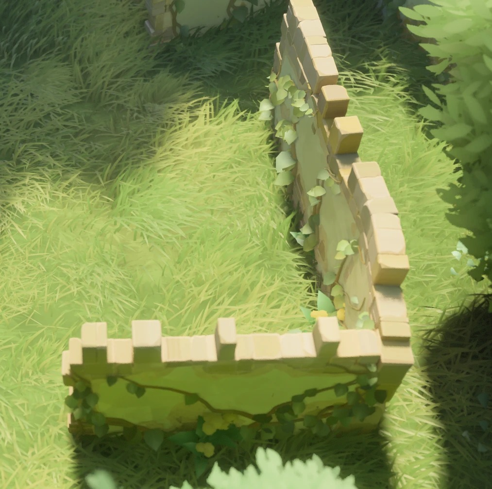
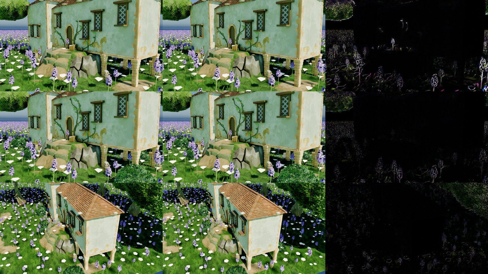
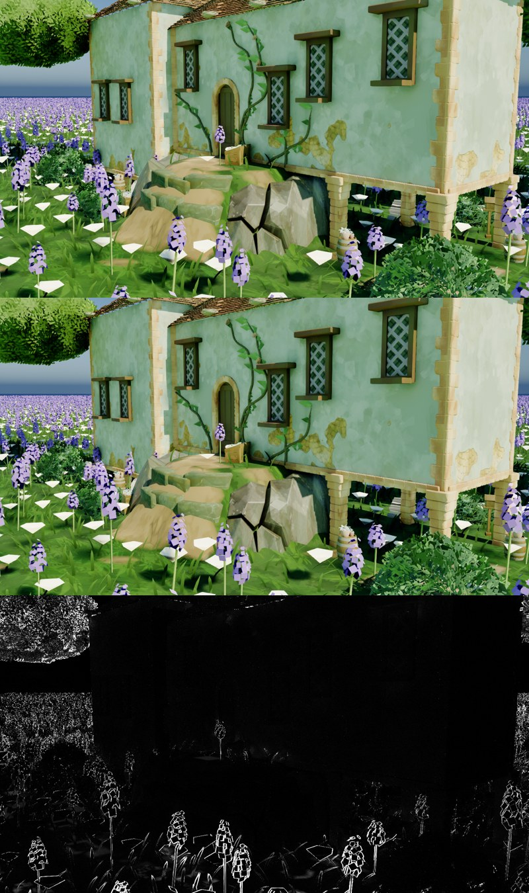
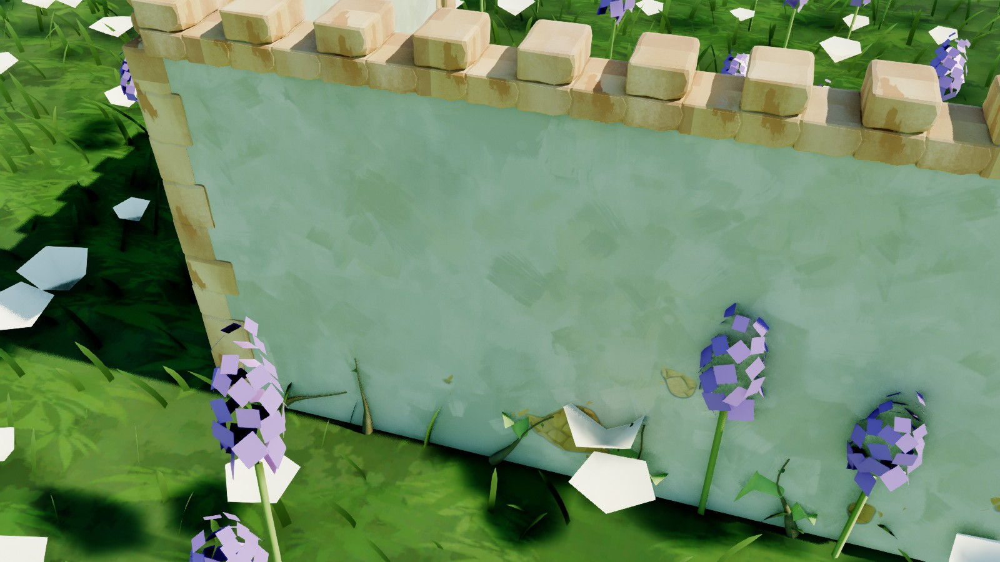
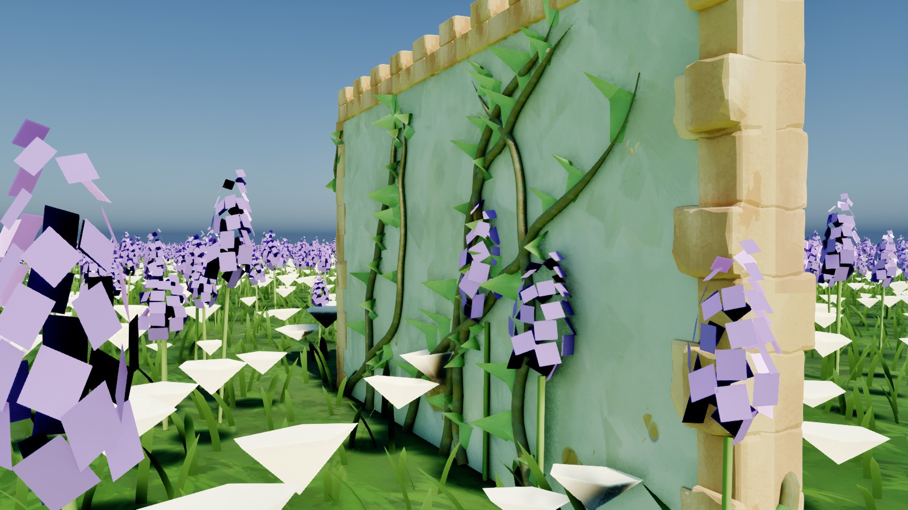
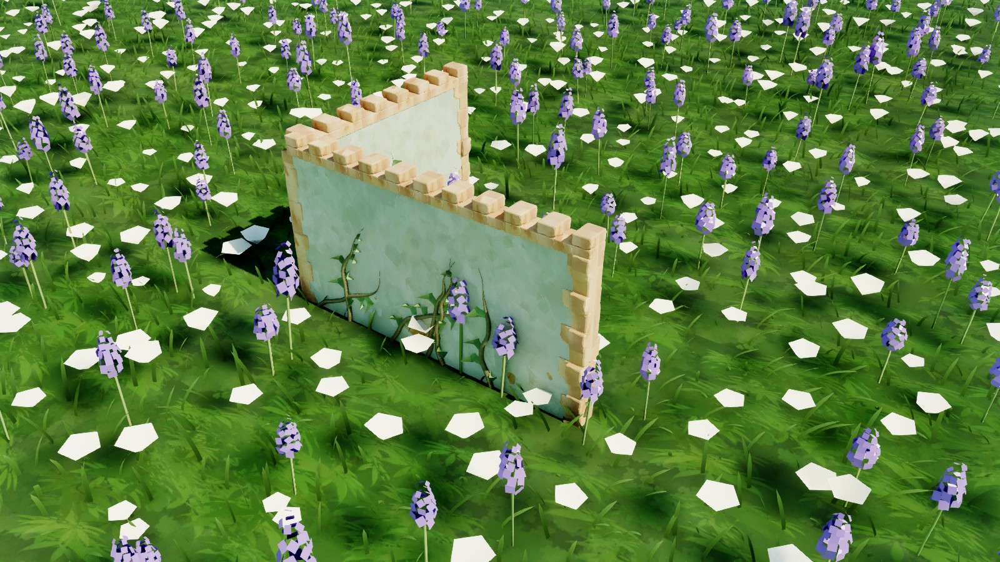
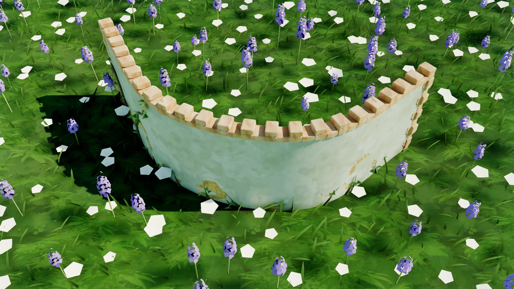

# 墙化重构计划：房子变成墙

2026-09-22 起。用户原话："我应该重构我的插件，让房子变成墙""我需要一个新的 actor，它包含一个 spline component，可以根据 spline 生产出墙……将之前房子的逻辑移到这个上面，并且未来也要让房子使用墙的逻辑"。

世界级 buffer 与 dirty 的那一半在 [`../cs-scene-dirty-3d-design.md`](../cs-scene-dirty-3d-design.md)，本文只管"墙"这条主线。

## 一、为什么是墙

PDB 符号（`D:\MyProject\Tiny Glade\tmp\pdb_symbols.txt`）给出的 TG 模型：

| 证据 | 说明 |
| --- | --- |
| `InnerWalls`（`new_wall_from_curve` / `new_wall_w_params` / `update_wall_state_height`） | 墙的私有真值 |
| `publish_public_wall_state`（L9042） | 把私有真值发布成只读快照，同时发 `OnWallChanged` / `OnWallDeleted` |
| `PublicWalls`（`get` / `wall_ids` / `get_shape_params` / `has_roof` / `roof_entity`） | 所有下游读的那一份 |
| `mode_manager::WallShape` = rectangle / circle / freehand | 墙的三种形状；`PublicWallState::is_rectangle` / `is_circle` / `try_get_wall_shape` |
| `Roof` 组件 + `wall_roof_hashmap` | 屋顶是**另挂**在墙上的实体 |
| 带 Building 的符号只有 `GroundedBuildingsSsbo`、`BuildingHadArchesLastFrame`、`BuildingAudioState` | "建筑"只是派生叫法：围合的形状墙 + 屋顶。配色也分 `default_building_color_id` / `default_freeform_wall_color_id` |

拱、门洞、门阶、窗、接缝砖、藤、灌木，全部按墙 id 从 `PublicWalls` 取数。本项目的 `ACSHouseActor` 把墙、屋顶、门窗、藤、摆件揉在一个 8000 行的 actor 里；这份计划把**墙自己的那部分**拆出来，房子最后变成"闭合的墙 + 屋顶"。

## 二、参考截图



截图里能读出的构件，以及第 1 步各自落在哪：

| 构件 | TG 截图 | 第 1 步 |
| --- | --- | --- |
| 墙身 | 灰泥面，局部剥落露砖，墙脚埋在草里 | `CSWall::BuildBodySoup` + 房子同一张 `MI_TinyGladeWall` |
| 压顶 | 一排砖骑在墙顶，比墙略宽 | `CSWall::BuildTopElements` 压顶层（`bCoping`） |
| 垛口 | 压顶之上隔一块抬一块，参差不齐 | 同上，垛口层（`bMerlons`、`MerlonEvery = 2`） |
| 拐角 | 两段墙在直角处相接，角上一根砖柱 | 拐角外侧角石 + 压顶在拐角处断开 |
| 墙端 | 砖在端头收口 | 墙端两侧角石（`bEndQuoins`） |
| 藤 | 两面都有，叶片大、贴墙长 | `CSHouseVine` 规划，墙面走折线形态，两面各一条 |
| 贴地 | 墙脚随地形起伏 | 逐点采地面：墙脚 = 墙厚两侧与中线三处最低点 − 埋深 |

## 三、架构

```text
   样条（中线）─ BuildSkins ─────────┐          ┌─ footprint（外皮）─ BuildEnclosureRing
                                      ▼          ▼
                  ┌───────────────────────────────────────────────────────────┐
                  │  CSWall（纯函数核心，CSWall.h）                            │
                  │  路径 FCSWallPath ─▶ 皮线 FCSWallSkins（斜接）              │
                  │     ├─▶ BuildBody        墙体：面板规划器（洞/墩/接缝）       │
                  │     │                     + 出面 Continuous | Faceted        │
                  │     ├─▶ BuildTopElements  墙顶：压顶 + 垛口 | Plain（平顶）   │
                  │     ├─▶ BuildQuoins       角石：Freestanding | Enclosure 规矩 │
                  │     └─▶ BuildVineStrips   藤的墙面：两面折线带 | 外皮逐边平面带 │
                  └───────────────────────────────────────────────────────────┘
                  ┌───────────────────────────────────────────────────────────┐
                  │  ACSWallBase（墙的基类，CSWallBase.h）                       │
                  │   GetWallPath（路径来源，虚）· GetWallKind · GetVineSettings  │
                  │   藤的胶水：组件 / MID / 快照 / 交接 / 生长相位 / 管子（一份）  │
                  └───────────────────────────────────────────────────────────┘
                        ▲ ACSWallActor（样条，Freestanding，Continuous，压顶 + 垛口）
                        ▲ ACSHouseActor（footprint，Enclosure，Faceted，平顶 + 屋顶）
```

- **路径**以墙厚中线为准、两边各偏半个墙厚；接点沿平分线斜接，与房子 `CSHouse_CornerInset` / `FCSHouseCornerFrame::PointAtDepth` 同一个式子。开口路径两头是方头端面；闭合路径首尾相接。
- **逐点墙脚 / 墙顶高**：墙可以随地形起伏，不再假定"墙基平"。房子是它的特例（闭合、墙基平、墙高恒定）。
- **拐角按夹角判**（2026-09-22 用户："当 spline 转化为线段夹角过大时就不会产生转角，而是产生圆滑的墙"）：样条折成线段后，相邻两段的转角小于 `CornerTurnDegrees`（默认 30°，即夹角大于 150°）的接点是**圆滑的墙** —— 侧面共用平分线法线、不出角石、墙顶砖不断开、藤的法线照常插值；大于等于它才是**拐角** —— 硬棱、凸侧角石（不比直角尖时）、墙顶砖断开、藤两侧各用各的面法线。四处只问一条判据（`CSWall::IsCorner`），与点是不是样条控制点无关。采样间距 50 cm 时 30° 约合半径 1 m 的弯。
- **砖**：压顶、垛口、角石都走房子门框砖那条 GPU 解析砖路（`CSHouseFrame::AppendFlatRun` / `CSHouseQuoin::BuildQuoinElements`），同一块 `brick`、同一个 kernel、同一套"注册期定容、交互期零阻塞"的交接纪律。TG 里转角、墙裙、缝砖、垛口本来就是同一块砖（合卷卷五 §1）。
- **藤**：`CSHouseVine::FWallStrip` 加了折线形态（`PathBase` / `PathS` / `PathN` / `bLoop`）。平面墙两处映射保留原式，房子的藤逐位不变；弯墙的一面是一整条带，不会每半米撞一次"墙角"。开口墙绕墙一圈四条（右面 → 远端面 → 左面 → 近端面，首尾相接成环），藤走到墙端绕过端面上另一面（`JumpChance`），不会从墙体里穿过去。
- **世界空间**：样条墙的产物全部是世界空间，地面采样也在世界里。
- **重建**：本帧标脏、下一帧重建（与房子 09-10/09-11 的裁决同一条）；墙体、砖、藤各自哈希守卫。

## 四、房子的模块在墙里的去向

| 模块 | 房子 | 样条墙 | 现状（2026-09-22 晚「统一房子和墙的逻辑」之后） |
| --- | --- | --- | --- |
| 路径 / 斜接 | footprint = 外皮，`CSWall::BuildEnclosureRing`（逐点取 `CSHouse_GetCorner`） | 样条 = 中线，`CSWall::BuildSkins` | **同一种路径**（`FCSWallPath` + `FCSWallSkins`），来源是 `ACSWallBase::GetWallPath` 虚函数 |
| 墙体 | `CSWall::BuildBody(Faceted)` | `CSWall::BuildBody(Continuous)` | **一个函数、一个面板规划器**（洞 / 墩 / 接缝裁剪）；房子原来 `CSHouse_BuildBodySoup` 的逐边那套逐字搬进来，外壳只剩平屋顶面 |
| 网格写手 | `FCSWallMeshWriter`（`CSWallMesh.h`） | 同左 | **一份**；房子那份（`FCSHouseMeshWriter`）已删 |
| 墙顶 | 平顶（`FTopParams::Plain`）；平屋顶的露台垛口归屋顶 | 压顶 + 垛口 | **一个函数**（`BuildTopElements`），房子的墙顶样子不变 |
| 角石 | `CSWall::BuildQuoins(Enclosure)`（`CSHouseQuoin::BuildQuoins` 成了它的外壳） | `CSWall::BuildQuoins(Freestanding)` | **一个函数**，两套规矩 |
| 藤的墙面 | `CSWall::BuildVineStrips(Enclosure)`：外皮逐边平面带 | `CSWall::BuildVineStrips(Freestanding)`：两面折线带 | **一个函数**，两套规矩 |
| 藤的胶水 | `ACSWallBase::EnsureVineRig` / `PackVine` / 管子 | 同左 | **一份**（样条墙原来抄了房子一份，已删）；参数从 `GetVineSettings()` 取 |
| 生长相位 | `CSHouseVine::ResolveSpawnTimes` | 同左 | **一份**纯函数 |
| 砖路 | 门框 / 接缝 / 角石 / 包边 / 砖层 | 压顶 + 垛口 + 角石 | 发射器与组件纪律共用；两家的砖组件胶水仍各一份（见第 4 步"没做的"） |
| 包边（墙顶压顶石 / 墙脚勒脚） | `CSHouseTrim::BuildBand`（逐边、避洞） | 无 | 仍在房子（见第 4 步"没做的"） |
| 门洞（路穿墙开拱） | `ComputeDoors` / `CSHouseDoorRuns` / `ResolvePierSpans` | 未做 | 第 2 步 |
| 窗 / 门标记 | `ACSHouseFeatureMarker` 锚在墙面 | 未做 | 第 3 步 |
| 接缝 | 房 × 房 `FCSHouseContact` | 未做 | 第 5 步 |
| 屋顶 / 瓦 / 尖顶 / 露台 | 房子独有 | 不属于墙 | 留在房子（TG：屋顶另挂在墙上） |
| 摆件 / 鸟窝 | 锚在房子上 | 未做 | 以后 |
| 建筑周边灌木 | 房子推外皮给地面 | 墙不推 | —（TG 的 `GroundedBuildingsSsbo` 只有圆 / 矩形，freehand 墙不算建筑） |

## 五、分步计划

每一步都能单独交付，C++ 回归与演示回归各自有验收。

### 第 1 步：样条墙（2026-09-22，本轮）

- `Public/CSWall.h` / `Private/CSWall.cpp`：纯函数核心。
- `Public/CSWallActor.h` / `Private/CSWallActor.cpp`：`ACSWallActor`，默认一条 L 形三点样条（照截图）；属性分形状、砖、藤三组，藤收成 `FCSWallVineSettings`。
- `CSHouseVine::FWallStrip` 加折线形态；`CSHouseFrame::EPathFamily` 登记 `WallCoping` / `WallMerlon` 两个家族盐。
- 测试 `PCGPlugins.ComputeShaderGenerator.Wall.*` 六条：皮线斜接、墙体闭合且朝外（散度定理验体积）、墙顶砖奇偶与断点 + 角石落位、拐角按夹角判、藤的墙面、actor 贴地实跑（GPU 回读砖数 / 叶数、幂等、改样条、闭合、删地面）。

### 第 2 步：路穿墙开拱

TG 的规则是"墙与路的交集切段，段成为拱"（`sample_wall_path_intersections` → `calculate_wall_path_segmentation` → `ArchSegment(WallPathSegment)`，见 [`TinyGlade_模块对照与进度.md`](TinyGlade_模块对照与进度.md) 卷一的拱那节）。

- 洞表改成**沿路径的全局弧长 S**，不再是"边号 + 边内 S"。弯墙上一个拱跨好几块面板，每块面板带同一个裁剪场、原点按 `S_start` 反推。
- `ComputeDoors` 的路权采样、`CSHouse_SolveRoadRuns`、墩的迟回挪进 `CSWall`。
- 门框砖：拱在弦平面上铺（弯墙上拱宽几米时会离墙面几厘米，验收时量）。

### 第 3 步：墙表与世界级登记处

- `FCSPublicWallState`：形状（折线、开口 / 闭合）、墙高、墙脚、有无屋顶、平顶高 —— TG `PublicWallState` 的对应物。
- 墙 actor 与房子各自发布一份（对应 `publish_public_wall_state`），真值仍留在 actor 上（subsystem 不随关卡存盘、没有撤销）。
- 登记处与 dirty 通道是同一个世界级 subsystem，见 dirty 设计稿「登记处 / 通道 / 订阅」一节。
- 下游改读墙表：灌木（现在读地面上的 `BuildingFootprints`）、接缝、石阶找平顶、窗标记找宿主。
- ⚠️ **会推翻 2026-09-16「名单 = `TActorRange`、无登记表」那条裁决**，动手前请用户确认。

### 第 4 步：房子用墙的逻辑（2026-09-22 晚落地）

用户："接下来统一房子和墙的逻辑。注意要兼容房子墙顶端的表现"。

**做了的**：

- **路径**：房子的 footprint 转成闭合 `FCSWallPath`（`CSWall::BuildEnclosureRing`：外皮 = footprint 顶点本身，内皮 / 中线 / 平分线 / 转角逐点**原样取自** `CSHouse_GetCorner`，不从中线再算一遍 —— 所以拿右皮现组的边框架与 `CSHouse_GetEdge` 逐位相同）。
- **墙体**：`CSWall::BuildBody` 一个函数，里面是房子原来的面板规划器（洞按格切面板、墩跨度整片裁、重叠接缝合并、窗台盒），出面二选一：`Faceted`（房子一贯的逐面板斜接棱柱）/ `Continuous`（样条墙的连续 UV、贴地、弯墙平滑）。样条墙因此也吃得下洞与接缝（计划第 2 步的地基，`Wall.ContinuousOpenings` 钉着）。`CSHouse_BuildBodySoup` 只剩一个外壳 + 平屋顶面（屋顶是房子的）。
- **网格写手**：`FCSWallMeshWriter`（`CSWallMesh.h`）一份，房子那份删了。
- **墙顶**（用户点名要兼容）：房子的墙是**平顶** —— `CSWall::FTopParams::Plain()`，墙顶就是墙体自己的顶面，一块砖都不出；坡屋顶的檐口压在墙顶上，出压顶 / 垛口就会从瓦里戳出来（2026-08-31 用户裁决也是"TG 的墙没有上沿"）。平屋顶的露台垛口是屋顶的构件（`CSHouseRoof_BuildParapet`），原样不动。样条墙照旧压顶 + 垛口。
- **角石 / 藤的墙面**：`CSWall::BuildQuoins` / `BuildVineStrips` 各一个函数，按 `ECSWallKind` 分两套规矩：`Enclosure`（房子：只出外皮凸角、角号 = 房子口径、退化环不出；藤只长外皮、逐边平面带）/ `Freestanding`（样条墙）。`CSHouseQuoin::BuildQuoins` 成了外壳。
- **类层级**：`ACSWallBase : ACSTinyGlade`，`ACSWallActor` 与 `ACSHouseActor` 都派生自它。路径来源是虚函数 `GetWallPath`（样条墙给世界空间中线，房子给局部空间的环 + `GetBuildTransform()`），`GetWallKind` 给规矩。
- **藤的胶水**：组件、季节 / 生长 MID、基础网格快照、GPU 实例源交接、生长相位（`CSHouseVine::ResolveSpawnTimes`）、管子，全在基类里一份；各家只给容量与交接包围盒（`EnsureVineRig` 的回调）与哈希。参数一律从 `GetVineSettings()` 取。

**刻意没做的**（都不影响画面，要做请先确认）：

- **藤的 38 个平铺属性没迁**：房子的 `GetVineSettings()` 从平铺属性**现组** `FCSWallVineSettings`（`Wall.HouseVineSettingsAdapter` 用反射钉住"一个都不漏"）。迁数据要在 `PostLoad` 里迁一次，并逐个核对 `BP_TinyGladeHouse` 与关卡里的覆盖值、脚本里的 `vine_*` 属性名 —— 这是会碰存档的改动，没有用户点头不做。
- **包边**（`CSHouseTrim`：墙顶压顶石 `bTrimTop` 默认关、墙脚勒脚）仍在房子里：它逐边避洞，与样条墙的压顶是两套排法，并过来要么改房子的画面、要么在墙的核心里再养一套房子专用的排法。
- **砖组件的胶水**（门框砖 `FrameComponent` 一家挂门框 / 接缝 / 角石 / 包边 / 砖层，样条墙 `BrickComponent` 挂压顶 / 垛口 / 角石）仍各一份：两边共用的只有发射器与交接纪律，组件级的并法要等第 2 步（样条墙开拱）有了门框砖再定。

**逐位不变的证据**（冻结旧实现对照，`PCGPlugins.ComputeShaderGenerator.Wall.*`）：见下面「第 4 步的验证」。

#### 第 4 步的验证（2026-09-22 晚）

- **冻结旧实现逐位对照**（`Private/Tests/CSWallUnifyTests.cpp`，旧代码原文只改名字，⚠️ 别跟着新代码改）：
  - `Wall.HouseBodyMatchesLegacy`：房体三角汤 **193 组逐个 float 相同** —— 矩形（整数 / 非整数尺寸）、三角形、五 / 六 / 八边形 ×
    两种墙厚 × 房底开关 × 平顶开关 × 恒等 / 旋转平移变换 × 有无洞与接缝（配墩的一对拱、窗台窗、圆窗、无效洞、装不下的洞、
    重叠接缝合并），外加厚墙（内皮翻转、不铺房底）。同一条里断言**房子的墙顶是平的**：朝上的面全在墙高上、`FTopParams::Plain()` 一块砖都不出。
  - `Wall.HouseQuoinsAndVinesMatchLegacy`：角石 168 组 / 648 根、藤的墙面 168 组（含 9696 个"脚下没有地面"的采样）逐位相同，含退化矩形（不出角石）。
  - `Wall.ContinuousMatchesLegacy`：样条墙的墙体 40 组（20 组逐位相同，其余只差 fast-math 的末位 —— 模块按 fast-math 编译，
    同一个式子换个调用处可能被编成 float 倒数乘，40/200 得 0.199999988）、角石 40 组。
  - `Wall.ContinuousOpenings`（新能力）：开了门拱 + 窗台窗 + 接缝的连续墙仍闭合、体积 = T·H·L，洞只在 UV1。
  - `Wall.HouseVineSettingsAdapter`：反射枚举 `FCSWallVineSettings` 的 38 个字段，逐个在房子上找到同名同型属性、改值后现组逐字段相等。
- C++：`Wall.*` + `House.*` 109 条全绿；插件全套 211 条 207 过，挂的 4 条 = 既有的 3 条（`ResizeWatcherSelection`、藤的 `StrandMatchesRecords` /
  `TubePath`，失败数值与改动前逐字相同）+ 同时段另一会话在做的 `MeshBoolean.GpuRepair`。
- 演示回归 `TinyGladeDemoRegression.py`：FAIL 集与改动前逐条相同（30 条），PASS 集相同（多出的那一条是按房子 GUID 抽签、时有时无的接缝检查）。
- 房子画面：`TinyGladeShotBushes.py` 三个机位，改动前（16:21）/ 改动后（18:08）同机位对照 —— 房子区域平均差 0.37–0.44 / 255，
  **比改动前自己两次运行之间的差（12:16 vs 16:21：0.73–1.05）还小**；差异只在随风摆的草与花上。
  ⚠️ 中间有一次出图（18:00）差得多：它正好跑在另一会话重编 shader 之后，三张图之间隔了 45 s（正常 5 s），藤的生长相位与光照收敛都被拖慢 ——
  同一份新代码重拍一次（v3b）就回到噪声水平。出图对照要看两次同代码运行的噪声带，别拿单次对单次下结论。
  对照条（上两行：近景两张，下：全景；左：改动前，中：改动后，右：差异 ×4，黑 = 相同）：

  
- 样条墙：`TinyGladeShotWall.py` 的计数逐项与改动前相同（172 三角、压顶 36 / 垛口 19 / 角石 5、GPU 砖 105 = CPU、藤 23 根 / 叶 219 / 花 9、
  S 形弯墙 29 点 / 压顶 45 / 垛口 23 / 角石 4），像素判据 OK；墙面像素亮度 134.4（改动前 135.1），S 形弯墙那张与改动前逐图平均差 6 / 255（草在摆）。
  同样有一次（18:10）是慢跑的离群值：弯墙那张的捕获相机没跟上（同框里的花整体小了一圈），同代码重拍即复原 —— 出图脚本的已知毛病，不是墙。

### 第 5 步：墙与墙、墙与房子

- freehand 墙端点相接 → 吸附并**拓扑合并**成一面墙（TG `snapping_to_ends` / `merge_walls`，没有接缝构件）。
- 形状相交 → 开洞 + 缝砖（`inter_shape_stitches`，本项目 D7 接触记录的推广）。

### 第 6 步：形状墙与"围合体 → 建筑"

- 矩形 / 圆形墙（TG `shape_id` 1 / 0），闭合 + 屋顶 = 建筑；`BuildingHadArchesLastFrame` 那种跨"围合体 → 建筑"的迟回。

## 六、第 1 步的已知限制

- 没有洞、没有门窗、没有与房子 / 别的墙的相交处理。
- 没有碰撞：gpumesh 全线无碰撞，编辑器放置射线打不到墙（同房子，见 memory `ue-editor-placement-trace`）。
- 藤爬的高度整面墙取一个值（`FWallStrip::Height` 的约定），取的是全墙最矮处；坡上高的那段藤会停得早一点。
- 地被（草、花）不知道墙在哪，会从墙体里穿出来（见下方对照图）。TG 用 `foliage_exclusion` 顶视 mask 让草让开墙脚；本项目的对应物是第 3 步的墙表进登记处之后，地被链按墙表剔除。
- 藤的疏密用的是房子的默认值（藤距 90 cm、每段 0.72 片叶），比参考截图稀；调 `Vine.StrandSpacing` / `Vine.LeafChance` 即可，默认值等用户看过再定。
- 场景里有多块地面时只认第一块（同房子 / 楼梯）。
- 砖容量默认 2048 块，约合 300 m 的墙；更长的墙调 `BrickReserveCapacity`。

## 七、用法

1. Place Actors 面板搜 `CS Wall Actor` 拖进关卡：默认一条 L 形墙（6 m + 4.5 m、墙高 3 m），落在地面上。
2. 选中后编辑样条：拖控制点、Alt 拖出新点、在细节面板的 Spline 组件里勾 `Closed Loop` 闭合。点类型改成 `Curve` 就是弯墙。
3. 细节面板 `CS Wall`：`WallHeight`（默认 300，用户 09-22 定）、`WallThickness`（34）、`CornerTurnDegrees`（30，拐角 / 圆滑的分界）、`bFollowGround`、`GroundSink`、`TopSmoothing`。
4. `CS Wall|Brick`：压顶 / 垛口 / 角石的开关与尺寸；`CS Wall|Vine`：藤的全部参数（与房子同名属性同一套默认值）。把墙调矮时记得一起调小 `Vine.MaxSegments`，否则花开不出来（花从第 `FlowerFromFrac × MaxSegments` 段起开）。
5. 状态不对时点 `Rebuild Wall`（全量重建，清掉所有哈希短路）。

## 八、第 1 步的验证（2026-09-22）

- C++：`PCGPlugins.ComputeShaderGenerator.Wall.*` 六条（皮线斜接、墙体闭合且朝外、墙顶砖与角石、拐角按夹角判、藤的墙面、actor 贴地实跑）与 `House.Vine*` 十一条全绿 —— 后者证明 `FWallStrip` 加折线形态没有碰到房子的藤。插件全套 `PCGPlugins` 204 条 201 过，挂的 3 条正是既有基线（`ResizeWatcherSelection`、藤的 `StrandMatchesRecords` / `TubePath`）。
- actor 实跑（地面 + 土包 + 默认 L 形）：墙脚逐点 = 三处地面最低点 − 埋深（22 个点零误差），墙脚高度跟着土包从 −10 爬到 143；GPU 回读砖数 = CPU 砖数；两面长藤；无变化重求值零上传；改样条、闭合、删地面三条路径都对。
- 出图（`Scripts/TinyGladeShotWall.py`，`L_HouseGroundDemo` 中部空地现生成、不存盘）：默认 3 m 墙同机位有墙 / 无墙差异像素 72.5%，墙体平均亮度 135；砖 105 块（CPU = GPU）、藤 23 根 / 叶 219 / 花 9。⚠️ 演示内容挤在 512 m 地面的一角，第一版把墙放在房子西南 12 m，一半落在地面外（悬空无藤）—— 脚本现在默认放在地面中部 (20000, 20000)。
- **房子的墙没被带坏**（用户："确保之前房子墙的表现也是正常的"）：
  - 同机位对照：`TinyGladeShotBushes.py` 的三个机位在改动前（09-22 12:16，墙的工作开始之前）与改动后各拍一次。房子立面（墙、窗、角石、门、墙上的藤）平均差 0.66 / 255、超过 12 的像素 0.065%，即逐像素相同；全图的差异全在随风摆动的草、花、树冠上。
  - 演示回归 `TinyGladeDemoRegression.py`：FAIL 集与 12:16 的基线逐条相同（30 条既有失败）；少的那一条 PASS 是按房子 GUID 抽签、时有时无的接缝检查。
  - 对照条（近景机位；上：改动前，中：改动后，下：差异 ×4，黑 = 相同）：

    
- S 形弯墙（四个控制点全是 `Curve`）：29 个采样点、一段压顶 45 块、垛口 23、角石只有墙端 4 根 —— 整面圆滑，没有拐角。








