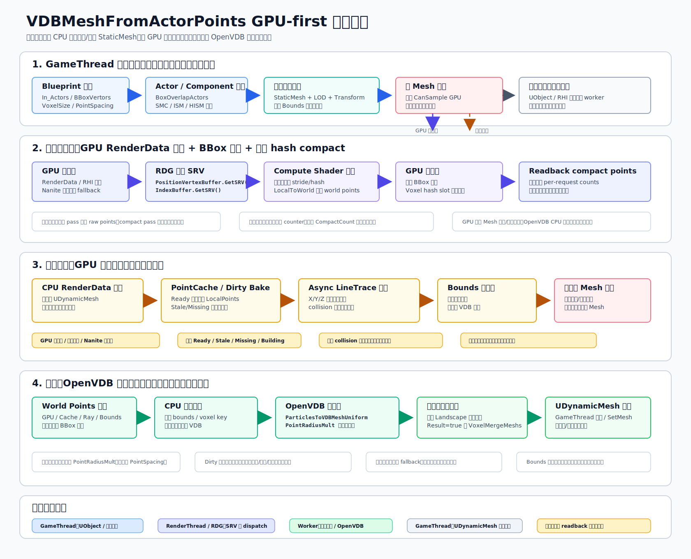

# VDBMeshFromActorPoints 加速方案



`VDBMeshFromActors` 当前用于把场景中影响藤蔓/空间殖民的 StaticMesh 群转成可查询的 VDB/动态网格。超大 Mesh 群卡顿的主要原因不是 OpenVDB 单点栅格化，而是前置的 CPU Mesh 读取、实例展开、三角裁剪和补边。

当前主路径已改为：在 GPU Compute Shader 中直接读取 StaticMesh RenderData 对应的 GPU 顶点/索引 SRV，生成表面采样点，在 GPU 端做 BBox 过滤和体素 hash compact，再读回 CPU 交给 OpenVDB。这样避免进入 `UDynamicMesh`，也避免 CPU 全量遍历高面数 Mesh。

## 当前卡点

| 阶段 | 现有路径 | 性能风险 |
| --- | --- | --- |
| Actor 收集 | `BoxOverlapActors` 后遍历 `UStaticMeshComponent` / `UInstancedStaticMeshComponent` | 组件和实例数量大时开销线性增长 |
| Mesh 读取 | `CopyMeshFromStaticMesh` 读取 StaticMesh RenderData 到 `UDynamicMesh` | 大资产、Nanite/高 LOD 或大量唯一 Mesh 会很慢 |
| 实例展开 | 每个 transform 复制一份 `FDynamicMesh3` 并应用世界变换 | 多实例会把顶点/三角面数量放大 |
| 裁剪与补边 | 对每个三角形做 Bounds 检查，再 `BlurVertexNormals` / `ExtrudeUnclosedBoundary` | 三角数越高越慢，且补边会继续增加面数 |
| Voxel 合并 | `VoxelMergeMeshs` 做体素 CSG union | 输入面数越大越慢 |

## 新入口

新增函数：

```cpp
static UDynamicMesh* VDBMeshFromActorPoints(
    TArray<AActor*> In_Actors,
    TArray<FVector> BBoxVertors,
    bool Result,
    int32 ExtentPlus = 3,
    float VoxelSize = 10,
    float LandscapeMeshExtrude = 50,
    float PointSpacing = 0,
    float PointRadiusMult = 2,
    int32 MaxPointsPerComponent = 20000);
```

该入口不进入 `UDynamicMesh` 读取 StaticMesh。当前实现会先收集组件/实例对应的 StaticMesh、LOD、world transform 和目标 Bounds，批量调用 GPU RenderData 采样；如果某个请求没有采到 GPU 点，则退回到 `UPrimitiveComponent::LineTraceComponent` 碰撞表面点，仍失败时退回包围盒表面点。点云随后进入已有 `UVDBExtra::ParticlesToVDBMeshUniform`，最后仍追加 Landscape 上下平面和边界网格，`Result=true` 时走 `VoxelMergeMeshs`。

参数建议：

| 参数 | 建议 |
| --- | --- |
| `PointSpacing` | `0` 表示使用 `VoxelSize`；需要更细表面时设为 `VoxelSize * 0.5` |
| `PointRadiusMult` | 默认 `2`，点更稀时可加大，避免 VDB 表面断开 |
| `MaxPointsPerComponent` | 控制单组件采样上限，避免大型 Bounds 生成过多射线 |
| `Result` | 调试时先用 `false` 看点云 VDB 和边界是否覆盖目标区域 |

当前实现文件：

| 文件 | 内容 |
| --- | --- |
| `Source/ComputeShaderGenerator/Public/StaticMeshRenderDataPointSampler.h` | GPU 采样请求结构和同步 helper |
| `Source/ComputeShaderGenerator/Private/StaticMeshRenderDataPointSampler.cpp` | RDG compute dispatch、index/position SRV 绑定、GPU compact、GPU readback |
| `Shaders/Private/StaticMeshPointSampler.usf` | 三角中心点 stride/hash 采样 shader，以及体素 hash compact shader |
| `Source/GeometryScriptExtraEditor/Private/GeometryGenerate.cpp` | `VDBMeshFromActorPoints` GPU-first + trace/bounds fallback |

## 总体策略

后续加速建议不是二选一，而是主路径和备用路径配合：

| 路径 | 触发时机 | 主要用途 | 线程策略 |
| --- | --- | --- | --- |
| GPU Compute RenderData 采样 | 生成 VDB 前，目标 StaticMesh RenderData/RHI 资源可用 | 主路径：直接从 GPU 顶点/索引 buffer 生成表面点 | GameThread 收集快照，RenderThread/RDG dispatch，异步 readback |
| CPU RenderData 降级采样 | GPU 资源不可用、调试或小资产 | 备用路径：直接读 CPU 侧 LOD 顶点/索引数据 | GameThread 快照后，worker 处理纯数组 |
| StaticMesh dirty 预采样 | StaticMesh 资产被编辑、导入、重导入或保存前后 | 可选缓存：为高复用资产生成局部点云缓存 | GameThread 只做 UObject 快照，后台线程生成点云 |
| 射线监测点 fallback | RenderData 不可用、缓存缺失、或 collision 更可靠 | 备用路径：在场景空间补充真实表面点 | 分批提交 async trace，后台合并点云/VDB |
| Bounds 表面采样 | collision 不可用或射线结果太少 | 最低成本兜底 | 可完全后台执行 |

目标是让 `GenerateVines` 等调用方优先走 GPU 采样；GPU 资源或 readback 不适合时，再使用 CPU RenderData、dirty 缓存或射线监测点；最后才退回 bounds 点或旧的完整 Mesh 转换。

## 组合决策流程

生成阶段不要直接问“是否读取 Mesh”，而是先判断每个 StaticMesh 是否可走 GPU RenderData 采样，再决定是否使用缓存或射线补点。

| 状态 | 使用策略 | 是否触发射线监测点 |
| --- | --- | --- |
| GPU 可采样 | 直接提交 RDG compute 任务，输出压缩后的 world points | 否，除非需要 collision 修正 |
| GPU 不可采样 | 尝试 CPU RenderData 降级采样或已有缓存 | 视结果而定 |
| `Ready` | 直接把 `LocalPoints` 按组件/实例 transform 转到世界空间 | 否，除非需要 collision 修正 |
| `Stale` | 可先用旧缓存生成预览，同时排队 dirty 重采样 | 是，用于补最新场景表面 |
| `Missing` | 排队 dirty/手动预采样任务 | 是，作为本次生成的主数据来源 |
| `Building` | 不阻塞编辑器，使用上一版缓存或射线结果 | 是，避免等待后台任务 |
| `Failed` | 标记资产需要检查 collision 或 mesh 设置 | 是，然后退回 Bounds 表面点 |

推荐决策顺序：

```cpp
if (GpuSampler.CanSample(StaticMesh, LODIndex))
{
    QueueGpuRenderDataSampling(StaticMesh, ComponentTransforms);
}
else if (CpuRenderDataSampler.CanSample(StaticMesh, LODIndex))
{
    QueueCpuRenderDataSampling(StaticMesh, ComponentTransforms);
}
else if (PointCache.IsReadyFor(StaticMesh, BuildSettings))
{
    UseCachedLocalPoints();
}
else
{
    QueueStaticMeshDirtyBake(StaticMesh);
    QueueRayMonitorFallback(ComponentOrInstanceBounds);
}

if (RayPoints.Num() < MinPointCount)
{
    AddBoundsSurfacePoints();
}
```

组合后的数据流：

| 步骤 | 输入 | 输出 | 说明 |
| --- | --- | --- | --- |
| GPU 快照 | `UStaticMesh` + LOD + 组件/实例 transform | render command 参数 | 只保存必要对象弱引用和纯数据 |
| GPU 采样 | position/index SRV + transform buffer | compacted point buffer | 在 RDG compute 中生成点 |
| 异步读回 | GPU point buffer | CPU `TArray<FVector>` | 只读回压缩后的点，不同步阻塞 |
| Dirty 监听 | `UStaticMesh` package / property / asset registry event | dirty mesh set | 只记录，不做重采样 |
| 缓存构建 | StaticMesh 快照数据 | `LocalPoints` 缓存 | 资产局部空间，适合复用 |
| 场景生成 | 组件/实例 transform + BBox | world points | 优先使用 GPU/readback 点，缓存为备选 |
| 射线补点 | BBox 监测网格 + collision | hit points | 缓存缺失、过期或需要 collision 修正时使用 |
| VDB 输入 | cached points + ray points + bounds points | merged point set | 去重后进入 `ParticlesToVDBMeshUniform` |

## 不读取 Mesh 获得“上面的点”

| 方案 | 是否读 Render Mesh | 精度 | 适用场景 |
| --- | --- | --- | --- |
| GPU Compute RenderData 采样 | GPU 读 position/index SRV，不在 CPU 读 Mesh | 高，可控 | 当前推荐主路径；大 Mesh、大量实例、需要避免 `UDynamicMesh` |
| CPU RenderData 降级采样 | 是，但不进入 `UDynamicMesh` | 高，可控 | GPU 路线不可用、调试、小范围资产 |
| StaticMesh dirty 预采样 | 编辑器更新时读取一次，可运行时不读 | 可控 | 大量复用 Mesh、Foliage、ISM/HISM，或需要稳定离线点云 |
| 组件碰撞射线采样 | 否 | 取决于 collision 设置 | RenderData 不可用或 collision 更符合遮挡/贴附需求 |
| 射线监测点 fallback | 否 | 取决于监测点密度和 collision | 缓存缺失、地形/摆放变化、局部修正 |
| 组件/实例 Bounds 表面采样 | 否 | 粗略 | 碰撞缺失时兜底，适合只需要占位体积 |
| 预烘焙 Asset 点云 | 运行时否 | 可控 | 大量复用 Mesh、Foliage、ISM/HISM |
| SceneCapture 深度图反投影 | 否 | 中高 | 大范围场景，适合 GPU/纹理流水线 |
| 低 LOD/HLOD/Proxy Mesh | 是，但读简化 Mesh | 中等 | 需要真实形状但可接受近似 |

## GPU Compute RenderData 采样

GPU 采样是当前推荐主路径。它不把 StaticMesh 转成 `UDynamicMesh`，也不在 CPU 上展开所有三角形；只把 StaticMesh 已经上传到 GPU 的顶点/索引 buffer 作为 SRV 绑定给 Compute Shader。

关键区别：

| 概念 | 说明 |
| --- | --- |
| `UStaticMesh::GetRenderData()` | CPU 侧渲染数据对象，管理 LOD 和 buffer 资源 |
| `PositionVertexBuffer.GetSRV()` | GPU 侧 position buffer 的 Shader Resource View |
| `IndexBuffer.GetSRV()` | GPU 侧 index buffer 的 Shader Resource View |
| `FRHIGPUBufferReadback` | 把 GPU 输出点异步读回 CPU，供 OpenVDB 使用 |

当前数据流：

```text
GameThread 收集组件/实例 transform 与 BBox
  -> RenderThread/RDG 注册 StaticMesh position/index SRV
  -> Compute Shader 按三角形 stride + hash jitter 采样中心点
  -> GPU 上做 BBox 过滤
  -> GPU 上按 VoxelSize * 0.25 做体素 hash compact
  -> 同步等待 compact points + per-request counts readback
  -> CPU 端做最终 bounds/voxel 去重保护
  -> 当前同步入口内调用 ParticlesToVDBMeshUniform
  -> GameThread 创建/更新 UDynamicMesh
```

当前 Blueprint 函数仍是同步返回 `UDynamicMesh*`，因此 helper 内部会 `FlushRenderingCommands()` 等待 readback 完成，OpenVDB 转换也仍在该同步调用链内。当前版本已经把 BBox 过滤和体素 hash compact 放到 GPU，但 readback 仍是同步等待；完全异步版本需要新增任务式 API 或回调式接口，不能直接塞进当前同步返回值。

Compute Shader 第一版可以先做三角中心点跳采样：

```hlsl
uint sample_id = DispatchThreadId.x;
uint tri_id = sample_id * TriangleStep;

uint i0 = Indices[tri_id * 3 + 0];
uint i1 = Indices[tri_id * 3 + 1];
uint i2 = Indices[tri_id * 3 + 2];

float3 p0 = Positions[i0];
float3 p1 = Positions[i1];
float3 p2 = Positions[i2];
float3 local_p = (p0 + p1 + p2) / 3.0;
float3 world_p = mul(LocalToWorld, float4(local_p, 1.0)).xyz;

OutPoints[sample_id] = float4(world_p, 1.0);
```

更高质量时再升级为面积加权采样。面积均匀采样需要额外的 prefix sum、alias table 或分块累计面积；第一版不建议一开始做复杂采样，先用 `TriangleStep` / hash 抽样验证 VDB 质量和耗时。

### GPU 端压缩

如果 CPU OpenVDB 仍是后续步骤，readback 会成为新的瓶颈。推荐先在 GPU 上做一次粗体素去重，只读回每个体素代表点。

| 压缩方式 | 成本 | 效果 |
| --- | --- | --- |
| 固定 stride 抽样 | 最低 | 快速验证，可能漏小三角 |
| hash 随机抽样 | 低 | 分布比 stride 更自然 |
| BBox 过滤 | 低 | 避免读回目标区域外的点 |
| 体素 key 去重 | 中 | 显著减少 readback 点数 |
| prefix/compact | 中高 | 输出紧凑 buffer，适合大场景 |

目标不是把 100w 三角形全部变成 100w 点读回 CPU，而是把目标 BBox 内、以 `VoxelSize` 为尺度有意义的点读回来。

当前版本已经实现 GPU 体素 key 去重和 compact：采样 pass 输出 raw world points，compact pass 用 voxel hash slot 抢占每个体素的代表点，并写出 per-request counts。hash slot 使用过量分配和短距离 probing 来降低碰撞概率；CPU 仍保留一层最终 bounds/voxel 去重，避免重复点进入 VDB。

当前实现为了保持同步接口简单，compact buffer 容量仍等于本次 raw sample 上限；它已经减少进入 CPU 去重和 OpenVDB 的有效点数，但 readback 字节数还没有做到真正按 compact count 变长。下一步如果 readback 明显成为瓶颈，应改成任务式两阶段：先异步读回 counter，再只读回 `CompactCount * sizeof(FVector4f)` 的点数据。

### 预估耗时

以下是经验级预估，具体取决于 GPU、LOD、点数、readback 同步方式和 BBox 命中比例：

| 输入规模 | 输出点数 | GPU compute | 异步 readback | 备注 |
| --- | --- | --- | --- | --- |
| 100w 三角 | 1w 点 | `<1ms` | `1-3ms` | 适合交互预览 |
| 100w 三角 | 10w 点 | `0.2-2ms` | `1-10ms` | 推荐目标区间 |
| 100w 三角 | 100w 点 | `1-5ms` | `5-30ms` | 不建议常态读回 |

如果后续 OpenVDB 构建仍在 CPU，总耗时还要加上 `ParticlesToVDBMeshUniform` 和 mesh 输出时间。GPU 采样主要解决“读取/展开超大 StaticMesh”的卡点，不会自动消除 CPU OpenVDB 的成本。

### 线程和资源边界

| 操作 | 线程/管线 | 注意 |
| --- | --- | --- |
| 收集 `UStaticMesh` / component transform | GameThread | UObject 和组件状态只做短时快照 |
| 访问 RHI buffer / SRV | RenderThread / RDG | 不在普通 worker thread 直接访问 |
| Compute dispatch | RDG pass | 可使用项目已有 ComputeShader/RDG 基础设施 |
| GPU readback poll | RenderThread + GameThread 调度 | 避免同步 flush |
| OpenVDB 栅格化 | Worker | 只处理 readback 后的纯点数组 |
| `UDynamicMesh` 创建/更新 | GameThread | UObject 操作回主线程 |

需要注意 Nanite：普通 StaticMesh LOD RenderData 不一定等于 Nanite 实际渲染三角形。若目标资产大量使用 Nanite，第一版可以选择非 Nanite fallback LOD、碰撞射线 fallback，或后续评估硬件 RayTracing/TLAS 路线。

## StaticMesh Dirty 预采样

StaticMesh dirty 方案用于把重采样成本前移到编辑器资产变更阶段。它不需要改引擎源码，只需要在插件 Editor 模块中监听公开委托。

在采用 GPU Compute 主路径后，dirty 预采样不再是必须持久化的主方案，而是可选缓存：用于 GPU readback 不可接受、资产复用极高、或需要离线稳定点云的情况。

推荐监听：

```cpp
UPackage::PackageMarkedDirtyEvent       // 每次 MarkPackageDirty 都触发
UPackage::PackageDirtyStateChangedEvent // clean/dirty 状态变化时触发
FCoreUObjectDelegates::OnObjectPropertyChanged
IAssetRegistry::OnAssetUpdated()
```

建议以 `PackageMarkedDirtyEvent` 做主入口，`PackageDirtyStateChangedEvent` 只适合“第一次变 dirty 才处理一次”的策略。dirty 回调里不要直接生成点云，只记录资产并延迟批处理。

```cpp
void OnPackageMarkedDirty(UPackage* Package, bool bWasDirty)
{
    // GameThread: 只找出 package 内的 UStaticMesh 并加入 dirty set
    // 不在这里读 RenderData，不生成 OpenVDB，不创建 UDynamicMesh
}
```

批处理流程：

| 阶段 | 线程 | 内容 |
| --- | --- | --- |
| dirty 收集 | GameThread | 记录 `FSoftObjectPath` / package name / mesh revision key |
| debounce | GameThread | 等 `0.5-2.0s` 无新 dirty 后开始处理 |
| 快照 | GameThread | 读取 StaticMesh bounds、socket/marker、必要 LOD 信息或已有缓存版本 |
| 点云生成 | Worker | 根据快照生成局部点云，做去重、降采样、半径估计 |
| 提交缓存 | GameThread | 写入 `UDataAsset`、DerivedData、metadata 或项目自定义缓存资产 |

缓存数据建议：

| 字段 | 用途 |
| --- | --- |
| `SourceMesh` | 对应的 `UStaticMesh` soft path |
| `SourceRevision` | 用于判断缓存是否过期，可来自 package dirty/save 计数或自定义 hash |
| `LocalBounds` | 快速裁剪和实例变换 |
| `LocalPoints` | Mesh 局部空间采样点 |
| `PointRadius` | VDB 粒子半径或推荐 `PointRadiusMult` |
| `BuildSettings` | `VoxelSize`、`PointSpacing`、采样方式 |

运行时/生成时只需要把 `LocalPoints` 乘以组件或 ISM/HISM 实例 transform，再进入 `ParticlesToVDBMeshUniform`。这样场景里成千上万个相同 Mesh 实例不会重复读 mesh 或重复采样。

## 射线监测点 Fallback

射线监测点是 GPU RenderData/dirty 缓存之外的备用路径，适合以下情况：

- StaticMesh 点云缓存不存在或版本过期。
- GPU RenderData 采样不可用，或异步 readback 结果太少。
- Mesh 的 collision 比 render mesh 更符合藤蔓/遮挡需求。
- 场景摆放、缩放、地形投影导致只靠局部点云不够准确。
- 只需要局部 BBox 内表面点，不值得重建完整资产点云。

推荐把监测点理解为“在目标 BBox 内生成的射线采样网格”。每个监测点产生一条或多条射线，从 X/Y/Z 三个方向探测组件表面。

| 监测类型 | 射线方向 | 目的 |
| --- | --- | --- |
| 水平 X/Y | `-X -> +X`、`-Y -> +Y`，也可反向补一条 | 捕获墙面、树干、石块侧面 |
| 垂直 Z | `+Z -> -Z` 或 `-Z -> +Z` | 捕获上表面、下沿、悬空物 |
| 边界补点 | BBox 表面点 | collision 失败时保证 VDB 有粗体积 |

优先使用 `UWorld::AsyncLineTraceByChannel` / `AsyncLineTraceByObjectType` 分批提交查询。不要在大量点上同步调用 `LineTraceComponent`，否则 dirty 监听只是触发器，实际卡顿仍会回到 GameThread。

```cpp
// GameThread: 分批提交 async trace
World->AsyncLineTraceByChannel(
    EAsyncTraceType::Single,
    Start,
    End,
    ECC_WorldStatic,
    QueryParams,
    FCollisionResponseParams::DefaultResponseParam,
    &TraceDelegate,
    UserData);
```

Trace 回调只收集 `FHitResult::ImpactPoint`、normal、组件 weak pointer 或自定义 `UserData`。点云去重、半径估计和 OpenVDB 转换放到 worker 线程；最终创建/更新 `UDynamicMesh` 或缓存资产时回到 GameThread。

## 线程边界

| 操作 | 推荐线程 | 原因 |
| --- | --- | --- |
| 监听 dirty delegate | GameThread | UObject/package 状态变化来自编辑器主线程 |
| 遍历 `UPackage` 内对象 | GameThread | UObject 遍历和加载状态不适合后台直接访问 |
| 读取组件 transform / bounds | GameThread | 组件状态属于场景对象 |
| 读取 StaticMesh GPU SRV | RenderThread / RDG | RHI 资源只能在渲染管线中安全绑定 |
| GPU Compute 采样 | RDG pass | 让 GPU 直接读顶点/索引 buffer |
| GPU readback | RenderThread 异步提交，GameThread/Worker 消费结果 | 不同步等待，避免编辑器卡顿 |
| 生成采样网格和去重 | Worker | 纯数据计算 |
| OpenVDB 粒子栅格化 | Worker | 纯 CPU 重计算，应避免阻塞编辑器 |
| `NewObject<UDynamicMesh>` / `SetMesh` | GameThread | UObject 创建和资产修改需要回主线程 |

核心原则：后台任务只处理快照后的纯数据，例如 `FBox`、`FTransform`、`TArray<FVector>`、`FDynamicMesh3`。不要把 `UStaticMesh*`、`UStaticMeshComponent*` 或 `UDynamicMesh*` 直接带进 worker 线程长期访问。

## 推荐迭代顺序

1. 先实现 GPU Compute RenderData 采样：position/index SRV 输入，输出三角中心点或 hash 采样点。
2. 已增加 GPU 端 BBox 过滤和体素 key compact；后续可继续改成按 compact count 变长 readback。
3. 把 readback 后的点接入 `ParticlesToVDBMeshUniform`，验证不经过 `UDynamicMesh` 的 VDB 质量。
4. 保留 `VDBMeshFromActorPoints` 的射线/Bounds 路径，作为 GPU 不可用、Nanite 不匹配或 collision 更可靠时的 fallback。
5. 需要稳定离线结果时再接 StaticMesh dirty 预采样；dirty 只排队，延迟批处理，不阻塞编辑器。
6. 保留 `VDBMeshFromActors` 作为高精度 fallback，仅用于小范围、少资产或离线生成。

## 注意事项

- 碰撞射线不会读取渲染 Mesh，但命中结果会受 `CollisionEnabled`、collision complexity、channel 响应影响。
- GPU Compute 读的是 GPU buffer，不是 CPU 直接读显存；CPU 需要结果时必须异步 readback。
- `UStaticMesh::GetRenderData()` 是 CPU 侧渲染数据对象；真正给 shader 读的是 position/index buffer 的 SRV。
- 不要在普通 worker thread 长期持有 `UStaticMesh` / `FStaticMeshLODResources` / RHI 资源引用；worker 只处理快照或 readback 后的纯数组。
- Nanite 资产的普通 LOD RenderData 可能不等于最终 Nanite 渲染三角形，需要 fallback 或单独评估。
- Bounds fallback 会把物体近似为盒体，速度快但可能让 VDB 过厚。
- 如果 VDB 断裂，优先增大 `PointRadiusMult` 或减小 `PointSpacing`，而不是回到完整 Mesh 转换。
- 当前 `MultThread` 参数已接回 `VDBMeshFromActors` 的多线程收集分支，但该分支仍会读取 Mesh，只是用于旧路径加速。
- dirty 回调不能直接做重活；否则资产编辑、导入、保存都会出现明显编辑器卡顿。
- 射线监测点适合作为缓存缺失时的备用方案，不适合作为每帧持续扫描方案。
