# MeshBoolean 焊接流程的失败情况

MeshBoolean 的输出经过焊接（`VertexWeldDistance`）和后续修复（补 T 缝、平滑 T 点、补洞）之后，仍可能有破面或拓扑错误。本文用 Houdini 把除 T 缝以外的六种失败情况逐一复现，另附一条精度说明（第 5 节，不是失败）。每种情况都配了截图、在插件代码里的位置，以及 Lycoris 实际运行日志里的对应数字。

2026-09-22 起 GPU 直写路径改用新的焊接修补（第 8 节），第 1–7 节的复现针对的是它之前的焊接与 CPU 快照路径的后处理。

## 概述

- 所有截图出自同一个 Houdini 场景。场景由 [`Scripts/HoudiniMeshBooleanWeldFailureCases.py`](../Scripts/HoudiniMeshBooleanWeldFailureCases.py) 生成：在 Houdini 的 Python Shell 里 `exec` 这个文件，就会在 `/obj` 下重建 `weld_case1_…` 到 `weld_case7_…` 七个对象，另有一个 `weld_case3b_fixes` 用来对比情况 3 的修法。
- 每个对象里的 `plugin_weld*` 节点是插件 GPU 焊接的逐位复刻：哈希函数相同，每个哈希桶只记最小序号，查找周围 27 格，单趟完成，不做传递合并。此外还包括 CPU 后处理的 Stage 13（删退化、去重）和 Stage 14（按源法线纠正绕序）。焊接距离、桶数倍率和两个阶段的开关都做成了节点参数。
- `report*` 节点做拓扑体检，把问题边画成粗线或小球标出来。
- 为了看得见，演示的尺度比实际放大过，各节只要改过参数都会注明。真实管线里焊接距离是 0.1 cm，现象相同，只是更小。

颜色含义：

| 颜色 | 含义 |
| --- | --- |
| 黄线 | 裂缝边：开放边，而且旁边很近处还有另一条开放边，即两侧本该焊上却没配上 |
| 红线 | 一条边挂了 3 片以上的面（非流形边） |
| 红球 | 蝴蝶点：几块曲面只在这一个点上相连 |
| 紫线 | 相邻两片面同向经过同一条边 |
| 面上的绿 / 红 | 朝向正常 / 翻了 |

## 1. 焊接压翻三角，绕序修正后与邻面同向

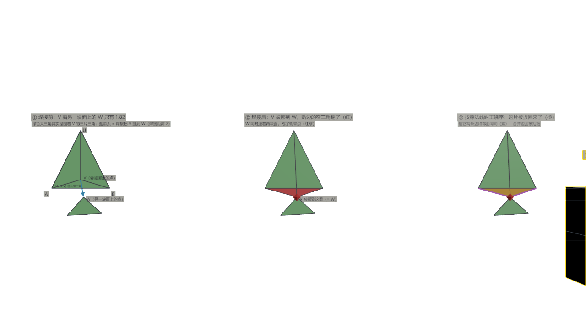

| 焊接前 | 焊接后 | 纠正绕序后 |
| --- | --- | --- |
| 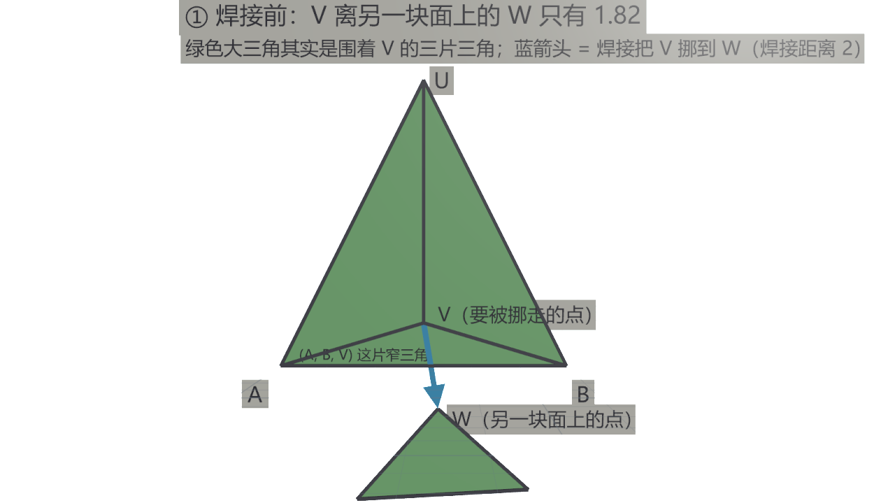 | 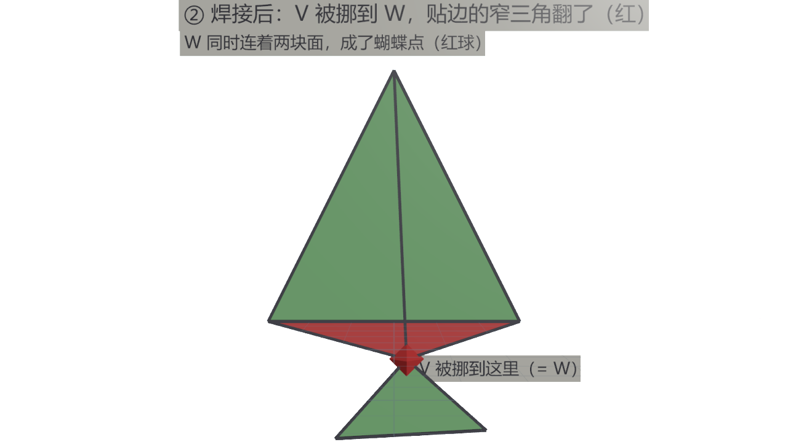 | 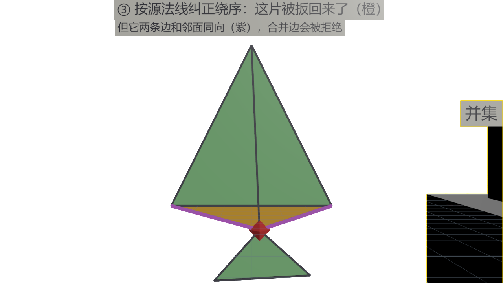 |

- **焊接前**：绿色大三角其实是围着顶点 V 的三片三角。贴着底边的是窄三角 `(A, B, V)`，V 只比底边 AB 高 0.9。下面的小三角属于另一块面，它的顶点 W 离 V 只有 1.82。蓝色箭头表示焊接会把 V 从这里挪到 W。
- **焊接后**：V 和 W 在焊接距离（演示用 2）以内，W 序号更小、被选成代表点，于是 V 的坐标变成 W 的坐标。W 在底边另一侧，`(A, B, V)` 变成 `(A, B, W)`，这片三角翻了（红）。另外两片只是被拉长，朝向不变。同时 W 连着两块互不相连的面，成了蝴蝶点。
- **纠正绕序后**：Stage 14 发现这片三角的朝向和源三角相反，交换了两个角点，面朝向恢复了（橙）。但几何上它仍然折叠在邻面上，而且与两片邻面共用的两条边都变成了同向（紫）。DynamicMesh 的 `FDynamicMesh3::MergeEdges` 遇到同向边会返回 `Failed_SameOrientation`，拒绝合并，这两条边会一直开着。

插件里的对应：

- Stage 14：`Source/ComputeShaderGenerator/Private/ComputeShaderMeshBoolean.cpp:1804`。注释写明不开焊接时这一步必然零修正，所以纠正掉的全是焊接挪点压翻的三角。
- Lycoris 7 次运行（焊接距离 0.1 cm）：每次纠正 746–1912 片。

## 2. 埋面保留、棱接触、点接触：非流形

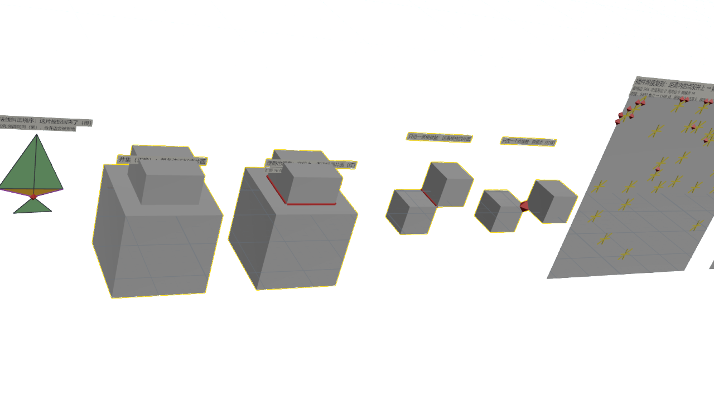

| 埋面保留 | 棱接触与点接触 |
| --- | --- |
| 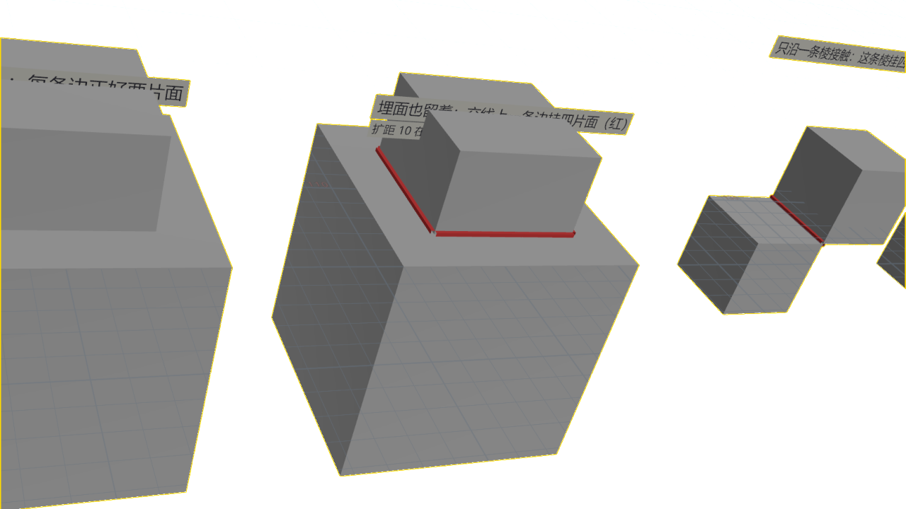 | 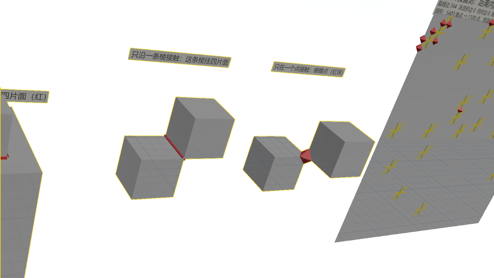 |

- **并集**：每条边正好挂两片面，没有标记。
- **埋面保留**：用 Boolean 的 `resolve` 运算把两个输入沿交线切开、所有面都留下。板子根部那一圈交线上，每条边挂了四片面（红，共 8 条）：外表面两片，埋在里面的两片。
- **棱接触**：两个方块只沿一条棱接触，这条棱挂四片面（红）。
- **点接触**：两个方块只在一个角点接触，那里成了蝴蝶点（红球）。
- 这类边上的配对没有唯一解。只配唯一对时（WeldMeshEdges 的默认行为），整条交线都配不上；不限唯一对，又可能把外表面和埋面配到一起。

插件里的对应：

- 扩距 `RetainedTriangleExpansionDistance`（`Source/ComputeShaderGenerator/Public/ComputeShaderMeshBoolean.h:298`）会把埋在里面、但离表面在「采样偏移 + 扩距」以内的面留下。实际运行中，只有盖在上面的物件薄于约 10 cm 的地方才会这样；`resolve` 是「全部留下」的极端情况。
- 2026-07-30 L_Test 那次运行时代码还处理非流形，焊接后记录到 209493 次非流形回退、358655 次蝴蝶点拆分。现在的代码已经不再处理这些情况。

## 3. 焊接配对不可靠

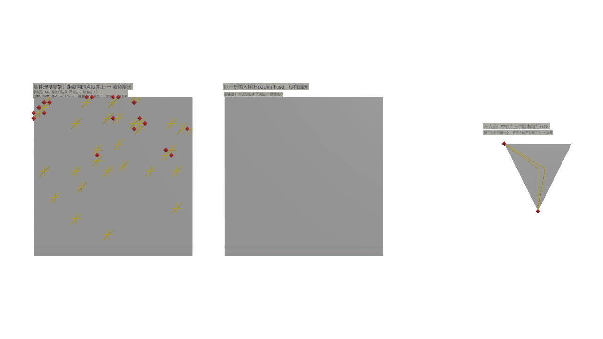

| 插件焊接漏焊（局部） | 不传递 |
| --- | --- |
| 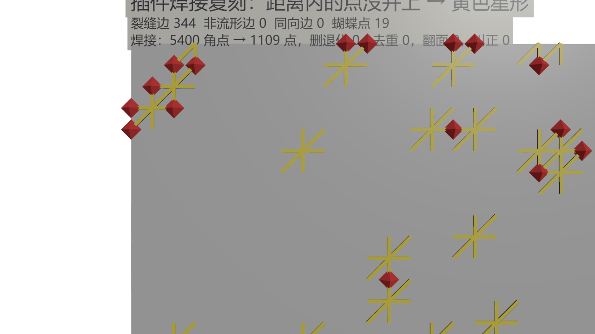 | 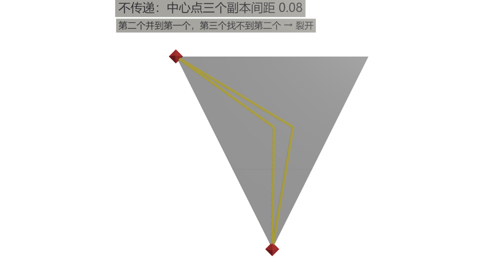 |

下面复现的是插件原来的配对规则（2026-09-22 之前），只有两条，两种失败都出在这里。现行做法见本节末尾的「解决办法」与第 8 节。

1. 每个哈希桶只记一个点，就是落进这个桶的点里序号最小的那个，作为这一格的代表点。
2. 每个点只在周围 27 格的代表点里找距离以内的点，并过去。只看代表点，单趟完成，不做传递合并。

### 网格上的黄色星形：哈希冲突

- 输入是 30×30 网格拆成的三角汤。每个角点加 ±0.005 的抖动来模拟 float 误差，焊接距离 0.1，桶数按插件规则取「源三角数 × 6，至少 1024」。
- 网格的每个顶点有 6 个副本（周围 6 片三角各一个），副本之间最远只有 0.014，都在焊接距离以内，应该并成一个点。
- 两个格子被哈希到同一个桶时，桶里只留序号更小的那个点，序号大的那一格就丢了代表点。它里面的 6 个副本谁都找不到可以并的点，全部原样保留。这个顶点周围的 6 片三角于是互相断开，它们之间的 6 条边都成了开放边，看起来就是一个黄色星形。
- 红球是只有一部分副本并上的点：并上的那几片三角在这个点上不相邻，就成了蝴蝶点。
- 结果：5400 个角点并成 1109 个点，理想值是 961，所以有 148 个点没并上，留下 344 条裂缝边和 19 个蝴蝶点。同一份输入换成 Houdini Fuse，一条都没有。
- 这种失败和误差大小无关，误差再小也会发生。

### 右边的扇形：不传递

```text
c0 ──0.08── c1 ──0.08── c2          焊接距离 0.1
└─── 同一格 ───┘        └ 隔壁格
```

- 扇形的中心点有三个副本，间距 0.08。c0 和 c1 在同一格，这一格的代表是 c0；c2 在隔壁格，代表是它自己。c1 不是任何一格的代表。
- c1 看到 c0，相距 0.08，于是并过去，位置变成 c0 的位置。
- c2 能看到的代表只有 c0（相距 0.16，超出焊接距离）和它自己，所以谁也不并。c2 离 c1 其实只有 0.08，但 c1 不是代表点，c2 不会拿它来比。
- 结果：c0、c1 成了一个点，c2 单独一个点，三片三角里有一片没连上，中间裂开 0.16。如果按「c2 挨着 c1、c1 挨着 c0」传递合并（比如用并查集），这里就不会裂开。
- 同一顶点的浮点误差副本不会连成这样一串。这种情况只出现在几个本来就不同、却挨得比焊接距离还近的顶点之间，比如窄碎片的角点。

插件里的对应（现行实现）：

- 焊接 kernel：`Shaders/Private/CSGpuTriangleUtilities.ush` 的 `OutputWeldSaltedHashCS` / `OutputWeldSaltedResolveCS` / `OutputWeldOrphanHashCS` / `OutputWeldOrphanResolveCS` / `OutputWeldFlattenCS`
- 调度与桶数：`Source/ComputeShaderGenerator/Private/CSGpuTriangleUtilities.cpp` 的 `AddVertexWeldPasses`

### 解决办法

对象 `weld_case3b_fixes` 用与情况 3 完全相同的输入，把几种修法并排比较：

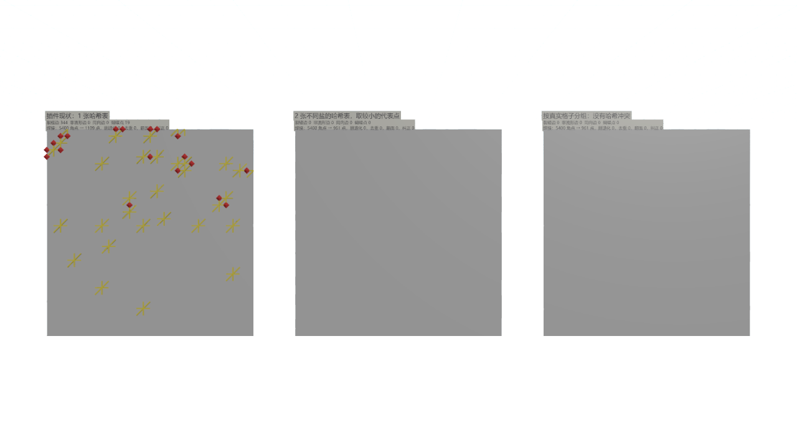

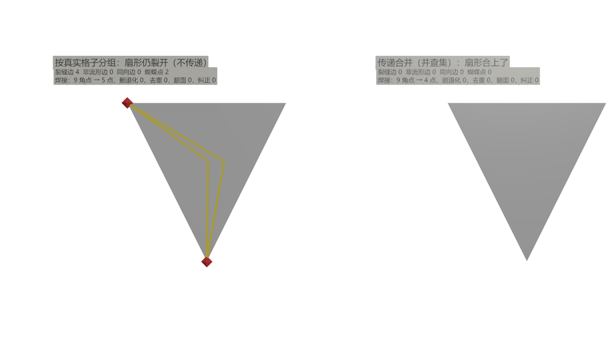

| 做法 | 焊接后点数（理想 961） | 裂缝边 | 扇形 |
| --- | --- | --- | --- |
| 原规则：1 张哈希表 | 1109 | 344 | 裂开 |
| 2 张不同盐的哈希表，取较小的代表点 | 961 | 0 | 裂开 |
| 按真实格子分组 | 961 | 0 | 裂开 |
| 传递合并（并查集） | — | — | 合上 |

- 第 1 张表里有 181 个角点（3.4%）所在格子的桶被别的格子占了，这就是星形的来源。插件的桶数按源三角数算，焊接的却是输出碎片的角点，所以实际运行时冲突只会更多。
- **现行实现（2026-09-22 起，所有焊接调用方共用）是多张不同盐的表，外加三条规则：**
  - 每轮 2 张不同盐的表，取距离以内序号最小的代表点。一个格子两张表同时被挡住的概率约为单表的平方。
  - 第一轮谁也没看到的角点（孤点）换两个新盐再哈希一轮，只有孤点参与。同一格里另一个顶点的代表点不会再挡住它们。
  - 代表点不再要求比自己的序号小。位置相同的副本看到的候选一样，选出的就一定是同一个点；原规则下序号更小的那个副本会留下自己，把一个顶点拆成两处。
  - 最后做 4 次指针跳跃，让代表点的代表点就是它自己，挪过去的角点都落在同一处。
- 代价：桶从 1 张表变成 2 张 + 2 张 1/4 大小的表（显存约 2.5 倍），pass 从 2 个变成 8 个（两轮各 2 个，压平 4 个）。焊接统计（孤点、第二轮仍孤立的点、跳过的链、焊接后顶点数）写进第 8 节的修补日志。
- **扇形（不传递）仍然裂开，不建议硬修。** c2 看不到 c1，因为 c1 不是任何一格的代表点；指针跳跃只压平「代表点又选了别人」的链，补不上这一段。传递合并能把扇形合上，但同样会把一串本来就不同、间距小于焊接距离的顶点一路并成一团。更稳妥的做法是把焊接距离降到浮点误差的量级（在 y≈−21000 到 −29500 cm 的坐标范围内约 0.01–0.02 cm）。这样同一顶点的副本彼此都在距离以内，单趟就够；本来就不同的近邻顶点也不再被焊接合并，情况 1 的压翻和情况 4 的压扁都因此少得多。

## 4. 焊接距离大于薄件厚度：去重只留一面

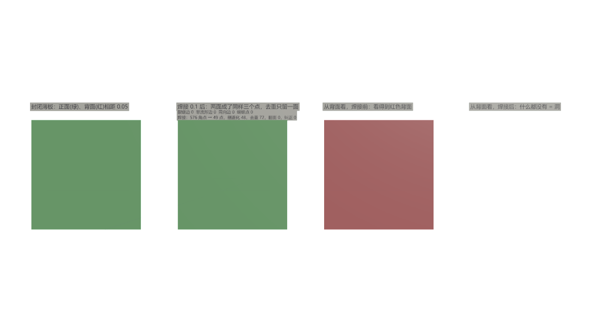

- 左一：封闭薄板，厚 0.05，正面绿、背面红，四周有侧壁。
- 左二：焊接 0.1 之后，正反两面被焊到同样三个点上。576 个角点并成 49 个点；48 片侧壁三角被压成退化三角删掉；72 片背面三角被当成重复删掉，只剩正面一层。
- 右边两块只保留朝向背面的三角，相当于从背面、开着背面剔除去看。焊接前能看到红色背面；焊接后什么都没有，从这一侧看就是一个洞。
- 这一节把桶数倍率调到 1000，用来排除情况 3 的哈希冲突，只看去重本身的效果。

插件里的对应：

- 去重按「三个代表点相同」判断，不看朝向：`Source/ComputeShaderGenerator/Private/ComputeShaderMeshBoolean.cpp:1778`
- Lycoris 7 次运行：焊接每次删退化三角 8.6k–21.6k 片、去重 76–306 片。

## 5. 精度说明（不是焊接失败）：比焊接距离小得多的容差

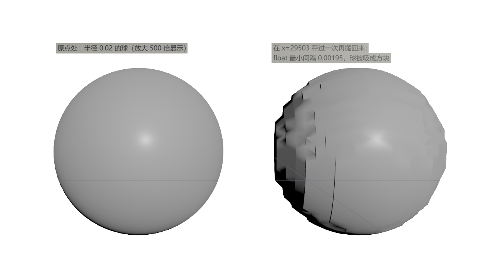

- 这张图只是把 float 网格画出来看：半径 0.02 的球在 x=29503 处存过一次再搬回来，坐标只剩那个量级的精度（2^-9 ≈ 0.00195），球被吸成台阶状。按 0.1 cm 的焊接距离，这么小的球本来就会被焊成一个点，所以它不是焊接会遇到的情况。
- 焊接距离 0.1 cm 是 float 最小间隔的 50 倍，精度不影响焊接本身。Lycoris 运行时的包围盒在 y≈−21000 到 −29500 cm，正好是这个间隔。
- 精度只限制那些远小于焊接距离的容差。例如给零面积补面撑出的高度、判断 T 点是否落在边上的容差、零面积判定，都要比这个间隔大几倍（约 0.01 cm）。否则坐标一存盘舍入，结果就会变回零面积甚至翻面。
- 按 0.01 cm 的高度撑补面，足够跨过插件 `BuildGpuMeshDescription` 的面积判据（≤ 5×10⁻⁵ cm² 就删）。焊接之后剩下的 T 缝，两段都不会短于焊接距离（T 点离端点更近的话，已经被焊到端点上了），所以补面面积至少是 ½ × 0.2 × 0.01 = 1×10⁻³ cm²。

## 6. 同一输入，每次结果不同

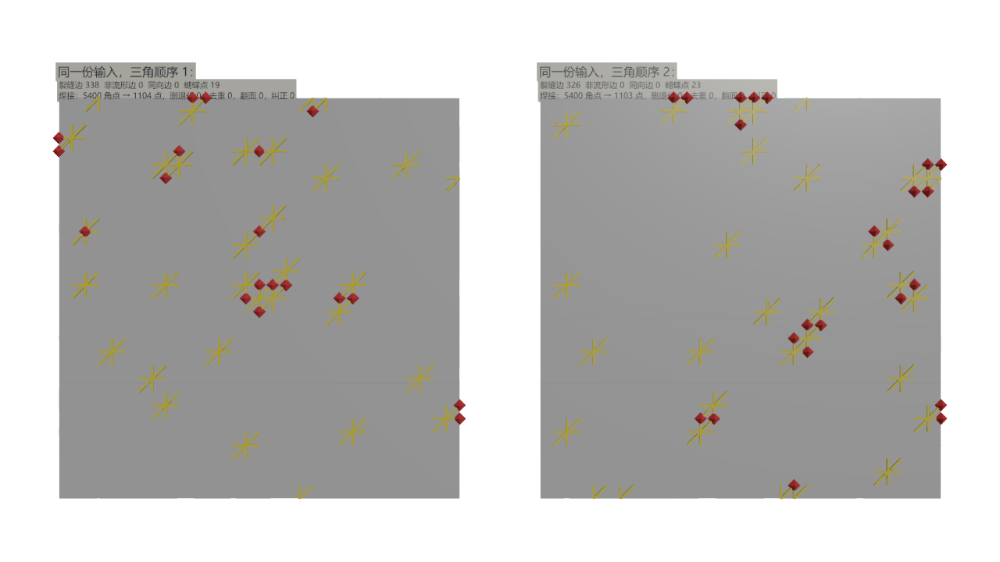

- 与情况 3 同一份输入，只打乱三角顺序：顺序 1 得到 338 条裂缝边、19 个蝴蝶点、1104 个点；顺序 2 得到 326 条、23 个、1103 个。漏焊出现的位置也不同。
- 原因：GPU 管线每次写出的三角顺序都不同（`Source/ComputeShaderGenerator/Public/ComputeShaderMeshBoolean.h:117` 的注释说明了这一点），而焊接按「最小序号」选代表点。
- Lycoris 2026-09-21 最后三次运行，包围盒和源三角数（399651）完全相同，输出分别是 437029、437039、437017 片，绕序纠正分别是 760、753、746 片。
- 所以某次看到的失败，下次不一定能复现。调试时可以先用 `FCSMeshBooleanCapture` 抓下一次管线输出，在这批固定的数据上反复试。

## 7. 下游：展开成三角汤、面积判据删掉补面

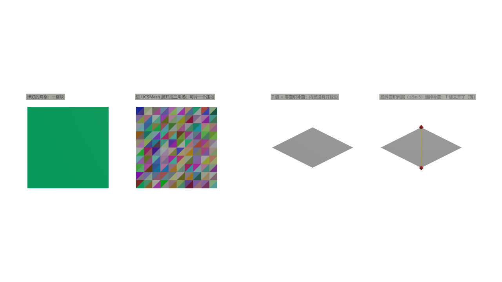

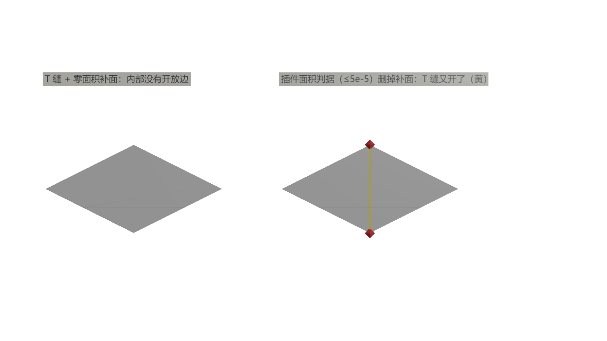

- **左边两块**：焊好的网格是一整块（同一种颜色）。展开成三角汤后，每片三角都成了孤岛（每片一种颜色）。UCSMesh 的常驻流逐顶点存储，焊接快照写进 UCSMesh 时就会这样展开（`Source/ComputeShaderGenerator/Public/CSMeshOps.h:516`）。
- **右边两块**：一个 T 缝面片。左边是一片大三角；右边两片三角的公共顶点 V 落在大三角的竖边上；V 和竖边两端之间补了一片零面积三角。
  - 补面在时，内部没有开放边。
  - 插件把 StaticMesh 写成 MeshDescription 时，会删掉面积 ≤ 5×10⁻⁵ cm² 的面（`Source/ComputeShaderGenerator/Private/CSGpuMeshComponent.cpp:248`）。补面被删后，T 缝的三条边重新变成裂缝（黄），竖边两端成了蝴蝶点。

## 8. GPU 直写路径的焊接修补

`VertexWeldDistance > 0` 时，GPU 直写路径（`RunBooleanToGpuMesh`；BP_Boolean 的 `BooleanUnion` 按钮与 `CSMeshOps.ApplyMeshBoolean` 都走它）在管线和输出重建之间多跑一张修补图，不再回退 CPU 快照路径。实现：`Shaders/Private/MeshBooleanRepair.usf`、`Source/ComputeShaderGenerator/Private/MeshBooleanRepair.cpp`，读取约定在 `MeshBooleanRepair.ush`。CPU 快照路径（`RunBooleanToSnapshot`）仍是第 1–4 节的 Stage 13/14，两条路径在焊接时结果不同。

修补图依次做：

1. **焊接全部碎片，含 Stage B 删掉的**（第 3 节的现行焊接）：被删碎片要和它所在的表面共用顶点，后面才能放回。
2. **只挪点**：只删被焊成一条边的三角；三个代表点相同的重复三角保留序号最小的一片（与 CPU 去重同一规则）。绕序按焊接前定下，焊平的薄片不会翻。
3. **标出缝**：从每条开放边沿边界绕一圈，平均宽度（2 × 面积 / 周长）小于焊接距离的闭合小环是缝（T 形缝、交错的 T 形缝、弯曲接缝两侧不一致的细分）。绕行时同一顶点有多条开放边，先选折返、再选直行、最后选转角最大的，这样两条缝相碰时拆成两个简单环，T 点处不会拐进旁边的缝。
4. **洞口放回被删碎片**：不在缝上的开放边，沿活面外法线一侧绕边扫，碰到的第一片是封闭表面需要的邻面。它被 Stage B 删了、弯折不超过 `HoleRestoreMaxBendDegrees`，而且用 Stage B 同一个 winding 场复查时有一部分露在外面，就放回来；下一轮只看刚放回的碎片。一片碎片常常同时是好几条开放边的邻面，所以露出复查单独一趟、每片只查一次，查不过的记下来不再查（L_Test 上这一条把放回的开销从 28 s 压到 4 s）。露出复查挡住了整片埋在另一实体里的碎片：贴放接触处要放回的三角有一部分在外面，嵌入切开的接缝后面的那片完全在里面。
5. **缝按长轴拉链补面**：缝的两侧顶点各自朝自己的面内挪 `SlitNudgeDistance`，缝张成有面积的细条，补面才不会被下游当退化面删掉。
6. **焊平的薄片撑开**：不在缝上的零面积三角，把中间顶点沿自身源平面挪开 `SlitNudgeDistance`。

| 选项 | 默认 | 作用 |
| --- | --- | --- |
| `bRestoreHoleFragments` | true | 洞口放回被删碎片 |
| `HoleRestoreMaxBendDegrees` | 45 | 放回碎片与活面之间的最大弯折（度）；贴放接触的洞是 0 |
| `HoleRestoreRounds` | 16 | 放回轮数上限 |
| `bFillSlitCracks` | true | 缝补面与零面积撑开 |
| `SlitNudgeDistance` | 0.01 | 撑开距离（cm），实际不低于查询盒坐标量级的 4 个 float ulp |

日志：`[MeshBoolean:<actor>] GPU weld+repair: ...` 一行给出焊接后顶点数、孤点数、放回数、去重数、开放边数、缝环数、补面数、仍开放的边数（`stillOpen`，即补不上的真洞）、撑开的顶点数，以及撑开后仍会被下游删掉的三角数（`stillDegenerate`）。

实测（焊接 0.1 cm；A 为 100 cm 方块，B 为 23 × 50 × 20 方块；开放边按位置精确匹配统计）：

| 场景 | 不焊接 | 焊接 + 补缝 + 放回 |
| --- | --- | --- |
| B 贴放在 A 上 | 洞 631 cm²，面积 62820 | 无洞，面积 64070（= 解析值），仅 B 底边一圈 8 条零宽接触边开放 |
| B 绕 Z 转 30° 贴放 | 洞 1194 cm² | 无洞，面积 64070，同上 |
| B 下沉 1 cm | 51 条开放边 | 0 条开放边（14 个缝环、23 片补面）；面积差 −4.5 cm²，是 90° 折角处缝被撑开后的斜补面比两侧让出的面窄 |
| 半径 30 球半嵌入 A | 约 130 条开放边（仅焊接） | 30–40 条，剩下的是接缝上的宽洞：BSP 每源三角 64 切 / 64 胞的上限一到，跨界的胞整片按质心判，留下的缺口比焊接距离宽，不是缝。这个场景每次运行的输出都不同（第 6 节），只能看量级 |
| L_Test（161 万源三角、272 万碎片） | 13 s | 补缝 12 s、加放回 16 s（放回 2.6 万片、仍开放 9.5 万条边） |

已知限制：

- 宽度超过焊接距离的洞不补，计入 `stillOpen`。
- 放回的碎片可能一部分埋在另一实体里（看不见），接触处会留零宽的开放边（贴放的 B 底边就是这样）。
- 缝被撑开时，折角两侧的面各让出一条 0.01 cm 的边，面积会差到约 2 × 0.01 × 缝长。
- 扇形（第 3 节）这种不传递的近邻顶点仍然焊不到一起。
