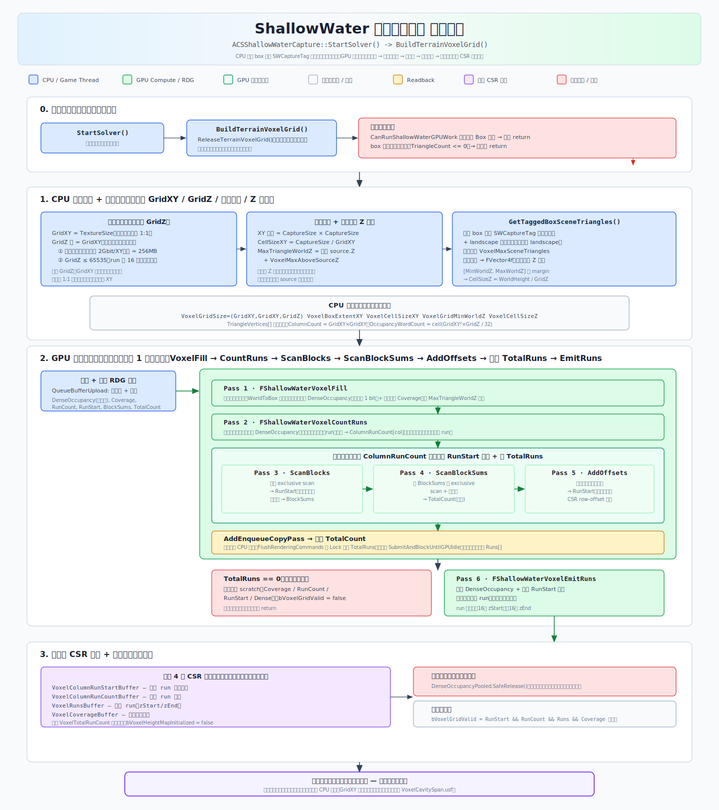

# 浅水模拟 — 线程重映射架构

## 概述

浅水模拟通过一系列 GPU Compute Shader Pass 运行。为避免对整张纹理（如 512x512 = 262,144 像素）调度全量线程，系统使用了**稀疏调度**策略：仅处理包含活跃水体的区域。

当前系统实现了**两层稀疏调度**（协同工作）：

```text
全尺寸纹理 (512x512)
  └── AABB 调度区域（可变，紧包活跃区域）
        └── Compact Tile 调度（仅 AABB 内的活跃 16x16 Tile）
```

---

## 地形体素网格构建（求解前置步骤）

`ACSShallowWaterCapture::StartSolver()` 在启动求解前会先调用 `BuildTerrainVoxelGrid()`：CPU 采集 box 内带 `SWCaptureTag` 的场景三角形并定标，GPU 光栅化稠密位网格 → 统计列游程 → 前缀和 → 回读总数 → 发射紧凑稀疏 CSR 体素网格，作为浅水求解的地形碰撞输入。



---

## Pass 执行流水线

### 每帧执行顺序

```
┌────────────────────────────────────────────────────┐
│  CopyTexture: VelocityHeight → VelHeightSimA       │
│  CopyTexture: ResultSmoothHeight → SmoothHeightA   │
├────────────────────────────────────────────────────┤
│  CompactActiveTiles   (全屏 tile 扫描)              │
│  FinalizeCompact      (写入 indirect args)          │
├────────────────────────────────────────────────────┤
│  ┌─── 迭代循环 (N 次) ──────────────────────────┐  │
│  │  CalVelocityHeight   (通过 compact 间接调度)  │  │
│  │  CalShallowIntegrate (通过 compact 间接调度)  │  │
│  │  (乒乓交换 SimA ↔ SimB, SmoothA ↔ SmoothB)  │  │
│  └───────────────────────────────────────────────┘  │
│  CalShallowWaterResult (通过 compact 间接调度)     │
├────────────────────────────────────────────────────┤
│  CopyTexture: 结果 → RenderTarget                   │
└────────────────────────────────────────────────────┘
```

---

## 线程重映射详解

### 1. AABB 调度区域（旧方案，shader 中保留但模拟 pass 不再使用）

**文件**: `ShallowWater.usf` 第 352–474 行

三个 Pass 计算活跃水体的轴对齐包围盒 (AABB)：

| Pass | 函数 | 调度方式 | 说明 |
|------|------|----------|------|
| `SW_ResetDispatchRegion` | `ResetDispatchRegion` | 单线程 | 重置 min/max 为哨兵值 |
| `SW_ScanDispatchRegion` | `ScanDispatchRegion` | 全屏（每像素 1 线程） | 每个活跃像素通过 `InterlockedMin`/`InterlockedMax` 原子更新全局 min/max |
| `SW_FinalizeDispatchRegion` | `FinalizeDispatchRegion` | 单线程 | 扩展 `DispatchExpandPixels`，合并水源点，写入 `RWB_DispatchIndirectArgs` |

**输出缓冲区**:
- `RWB_DispatchRegion[0..4]` → `(MinX, MinY, SizeX, SizeY, MaxX)`
- `RWB_DispatchIndirectArgs[0..2]` → `(GroupsX, GroupsY, 1)`

**当前状态**: 这三个 Pass 在 `ShallowWaterSolverSoucePoint` 和 `ShallowWaterSolverSplineRange` 中**已不再被调度**。AABB 相关缓冲区（`RWB_DispatchRegion`、`RWB_DispatchIndirectArgs`、`B_DispatchRegion`、`DispatchIndirectArgs`）仍声明在 shader 参数结构体中，但模拟 pass 中**均设为 nullptr**。AABB 代码路径保留在 `.usf` 文件的 `#if !USE_COMPACT_TILES` 分支中。

> **待办**: 彻底删除 AABB 的三个 Pass（Reset/Scan/Finalize）及相关缓冲区声明，精简代码。

---

### 2. Compact Tile 调度（当前生效方案）

**文件**: `ShallowWater.usf` 第 1139–1229 行, `ComputeShaderShallowWater.cpp`

这是**当前生效**的稀疏调度机制，以 **Tile 粒度**（16x16 像素/Tile）运作。

#### 2.1 CompactActiveTiles Pass

**调度方式**: 固定全屏 Tile 粒度调度
```
GroupCount = (ceil(Width/16), ceil(Height/16), 1)
ThreadGroup = (16, 16, 1)
```

**逻辑**（`CompactActiveTiles` 函数）：
1. 每个 Group 中仅 thread `(0,0)` 执行工作（其余 255 个线程提前返回）
2. 每个 Group 1:1 映射到一个全局 Tile：`TileCoord = DispatchThreadId.xy / TileSize`
3. 扫描范围 `[TileOrigin - DispatchExpandPixels, TileOrigin + TileSize + DispatchExpandPixels]`，步长为 2
4. 检查三个活跃条件：
   - `RW_VelHeightSimA[p].z > 0.0001`（水面高度）
   - `T_ResultDepthWet[p].x > 0.001 || T_ResultDepthWet[p].y > -9000`（深度/湿润数据）
   - `T_SplineScaleDist` 距离检查（仅 `USESPLINERANGE` 模式）
5. 如果扫描范围内任意像素活跃，通过 `InterlockedAdd` 在 `RWB_CompactCounter[0]` 上原子递增，并追加 `PackTileCoord(TileCoord)` 到 `RWB_CompactTileCoords`

**Tile 坐标打包格式**: `uint packed = (tileY << 16) | tileX`

**DispatchExpandPixels**: CPU 端计算为 `clamp(Iteration * 4 + 12, 8, TextureSize)`。确保活跃水体邻近的 Tile 也被激活，使水体可以向外传播。

> **当前低效点**: 每个 Group 的 256 个线程中仅 1 个线程在工作，其余 255 个线程立即返回。可改为 Group 内协作扫描 + shared memory reduce 来提升效率。

#### 2.2 FinalizeCompact Pass

**调度方式**: 单个 Group `(1,1,1)`

**逻辑**（`FinalizeCompact` 函数）：
- 读取 `RWB_CompactCounter[0]` 得到 `tileCount`
- 写入 `RWB_CompactIndirectArgs = (max(tileCount, 1), 1, 1)`
- 设置 **1D 间接调度**：每个 Group 索引映射到一个活跃 Tile

#### 2.3 模拟 Pass 的 Compact Tile 模式

三个模拟 Pass 均使用 `#if USE_COMPACT_TILES`（编译时对 `SW_VelocityHeightSim`、`SW_ShallowIntegrate`、`SW_Result` 设为 1）：

**调度方式**: `DispatchIndirect`，使用 `CompactIndirectArgs` → `(tileCount, 1, 1)`

**线程到像素的映射**（Compact 模式）：

```hlsl
// GroupId.x = 活跃 Tile 列表中的索引 (0..tileCount-1)
// GroupThreadId.xy = Tile 内的本地坐标 (0..15, 0..15)
int2 TileCoord = UnpackTileCoord(B_CompactTileCoords[GroupId.x]);
int2 Pixel = TileCoord * int2(16, 16) + GroupThreadId.xy;
```

辅助函数：
- `GetCompactTilePixel(GroupId, GroupThreadId, MaxCell)` — 返回 clamp 后的像素坐标
- `IsCompactTileThreadActive(GroupId, GroupThreadId, MaxCell)` — 像素超出纹理边界时返回 false

**Shared Memory 填充**（Compact 模式）：

```hlsl
void FillSharedGroupCompactTile(GroupId, GroupThreadId, MaxCell, GroupIndex)
{
    TileCoord = UnpackTileCoord(B_CompactTileCoords[GroupId.x]);
    GroupTopLeftGlobal = TileCoord * TileSize - Extent;
    // 256 个线程协作填充 (TileSize + 2*Extent)^2 个元素
}
```

每个线程组协作填充带 padding 的 shared memory 区域：
- `CalVelocityHeight`: `GENERAL_SHAREGROUP_EXTENT = 5` → shared memory 尺寸 `(26 x 26)` = 676 个 `half4`
- `CalShallowWaterResult`: `GENERAL_SHAREGROUP_EXTENT = 2` → shared memory 尺寸 `(20 x 20)` = 400 个 `half4`
- `CalShallowIntegrate`: 无 shared memory（未定义 `CREATE_SHARE_DATA_FUNC`，直接读取纹理）

---

## 各 Pass 的资源绑定

| Pass | UAV 写入 | SRV 读取 | IndirectArgs |
|------|----------|----------|--------------|
| CompactActiveTiles | `RWB_CompactTileCoords`, `RWB_CompactCounter` | 各纹理 | 无（固定调度） |
| FinalizeCompact | `RWB_CompactIndirectArgs`, `RWB_CompactCounter` | — | 无（固定调度） |
| CalVelocityHeight | `RW_VelHeightSimB`, `RW_SmoothHeightB`, `RW_DebugView` | `B_CompactTileCoords`, 各纹理 | `CompactIndirectArgs` |
| CalShallowIntegrate | `RW_VelHeightSimB` | `B_CompactTileCoords`, 各纹理 | `CompactIndirectArgs` |
| CalShallowWaterResult | `RW_ResultVelHeight`, `RW_ResultDepthWet`, `RW_ResultSmoothHeight` | `B_CompactTileCoords`, 各纹理 | `CompactIndirectArgs` |

模拟 Pass 中，`RWB_CompactTileCoords/Counter/IndirectArgs` 的 UAV 均设为 `nullptr`，避免 RDG 对同一缓冲区同时绑定 UAV + SRV 的冲突。

---

## C++ 端：缓冲区管理

### 每帧创建的 Compact 缓冲区

```cpp
// Tile 坐标缓冲区 — 存储每个活跃 Tile 的打包坐标 (tileX, tileY)
CompactTileCoordsBuffer: uint32 × MaxTileCount
// 原子计数器 — CompactActiveTiles 递增，FinalizeCompact 读取
CompactCounterBuffer: uint32 × 1   (CompactActiveTiles 前上传 0)
// 间接调度参数 — FinalizeCompact 写入，DispatchIndirect 消费
CompactIndirectArgsBuffer: FRHIDispatchIndirectParameters × 1
```

### SetHeight 函数的特殊处理

`SetHeight()` 对整张纹理操作（SetHeight Pass 本身不使用稀疏调度），但它调用的 `Result` Pass 仍使用 Compact Tile 模式。因此它上传**所有** Tile 坐标到 `CompactTileCoordsBuffer`，使 `Result` 处理全纹理：

```cpp
for (ty = 0..TilesY) for (tx = 0..TilesX)
    AllTileCoords[ty * TilesX + tx] = (ty << 16) | tx;
CompactIndirectArgs = { TotalTiles, 1, 1 };
```

---

## 可优化方向

### 1. 删除 AABB Pass
AABB 的三个 Pass（`ResetDispatchRegion`、`ScanDispatchRegion`、`FinalizeDispatchRegion`）及相关缓冲区（`RWB_DispatchRegion`、`RWB_DispatchIndirectArgs`、`B_DispatchRegion`、`DispatchIndirectArgs`）已不再被调度。应彻底删除以精简代码。

### 2. Group 内协作扫描
当前 `CompactActiveTiles` 每个 Group 浪费 255/256 线程。优化方案：
- 256 个线程并行扫描 Tile 的扩展区域
- 使用 shared memory（`groupshared uint`）做 reduce 得到 "any active" 标志
- Thread 0 根据标志决定是否追加 Tile

### 3. 提取 C++ 端辅助函数
`ShallowWaterSolverSoucePoint`、`ShallowWaterSolverSplineRange`、`SetHeight` 中有大量重复的缓冲区创建和参数清理代码，应提取为辅助函数消除重复。

### 4. 两阶段 Tile 标记
替代当前通过 `DispatchExpandPixels` 扩大扫描范围的方式：
- 阶段 1：标记实际包含水体的 Tile
- 阶段 2：对 Tile 掩码做 1 环膨胀（仅激活活跃 Tile 的相邻 Tile）

这样可以缩小扫描区域，同时保证水体传播的覆盖范围。
