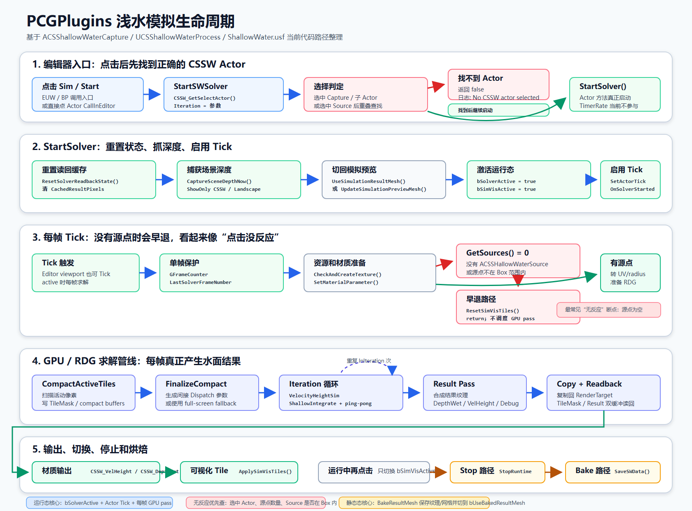
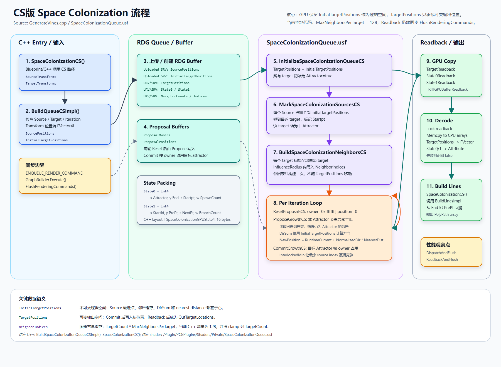
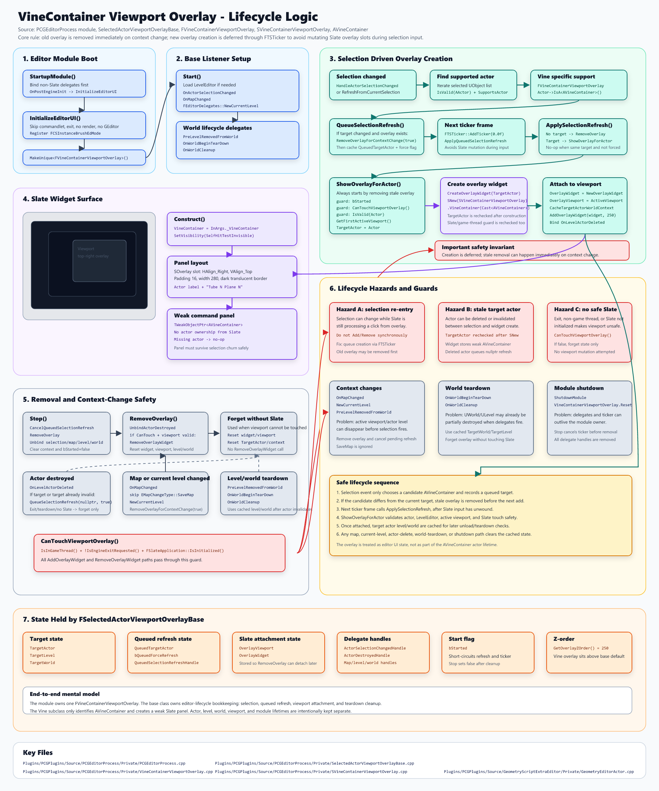
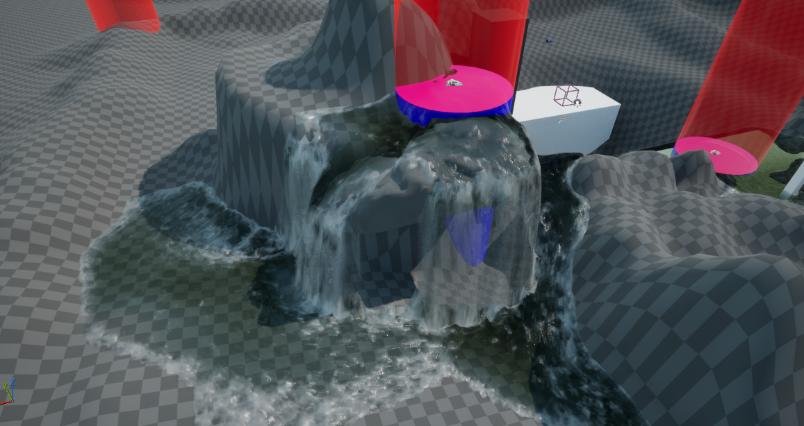
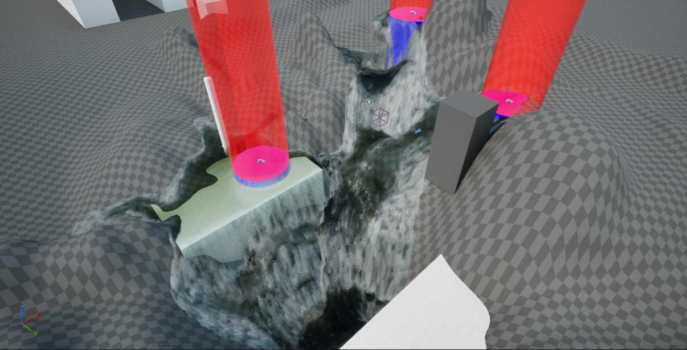
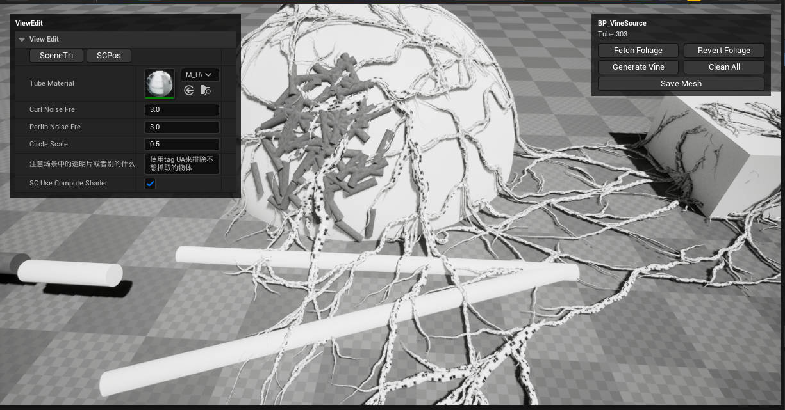

# PCGPlugins

面向 **Unreal Engine 5.7** 的程序化内容生成（PCG）工具集。插件以 **GPU Compute Shader** 与 **Geometry Script** 为核心，提供 GPU 浅水模拟、藤蔓/空间竞争生长（Space Colonization）、体素网格生成、Landscape 与 Foliage 编辑等一系列关卡制作与地形装饰工具。

> **状态**：研究 / 生产原型阶段。当前经过验证、可直接打开运行的测试内容见下方 [可运行的测试场景](#可运行的测试场景)；其余 `Content/` 目录为开发过程资产，未必可靠。

---

## 环境要求

| 项目 | 要求 |
|------|------|
| 引擎 | **Unreal Engine 5.7，源码编译版**（`Need ue5.7 build from source`） |
| 平台 | **Win64**（`ComputeShaderGenerator` / `PCGEditorProcess` 仅在 Win64 加载） |
| 依赖引擎插件 | GeometryProcessing、GeometryScripting、ModelingToolsEditorMode、EditorScriptingUtilities、Landmass |
| 第三方库 | OpenVDB、IntelTBB、Blosc、zlib、UVAtlas、DirectXMesh、ProxyLODMeshReduction（均由引擎自带 ThirdParty 提供，无需额外安装） |

之所以需要**源码编译的引擎**：多个模块直接链接引擎渲染层（`Renderer`/`RenderCore`/`RHI`）与 OpenVDB 等 ThirdParty，并使用自定义全局 Shader，Launcher 版引擎无法编译。

---

## 安装

1. 将本仓库放入工程的 `Plugins` 目录：
   ```text
   <YourProject>/Plugins/PCGPlugins/
   ```
2. 右键 `.uproject` → **Generate Visual Studio project files**。
3. 用源码编译的 UE 5.7 打开工程，让编辑器编译插件模块（首次会编译 Shader）。
4. 在 **Edit → Plugins** 中确认 `PCGPlugins` 已启用（默认 `EnabledByDefault`）。

> Shader 通过 `ShaderArchive: "PCGPlugins"` 注册，源码位于 [`Shaders/Private`](Shaders/Private)。

---

## 模块总览

`.uplugin` 注册了 5 个模块：

| 模块 | 类型 · 加载阶段 | 平台 | 职责 |
|------|----------------|------|------|
| **GeometryMath** | Runtime · Default | 全平台 | 底层数学库：通用数学工具与 Noise（Perlin/Curl 等），无编辑器依赖。 |
| **GeometryEditor** | Editor · Default | 全平台 | 编辑器几何编辑工具函数。 |
| **GeometryScriptExtraEditor** | Editor · Default | 全平台 | 扩展 Geometry Script 的蓝图节点库 + `AVineContainer` 藤蔓生成 Actor + Foliage 互转。 |
| **ComputeShaderGenerator** | Runtime · PostConfigInit | Win64 | GPU Compute Shader 核心：浅水模拟、体素/三角网格生成、CliffGenerate、MeshFill、场景捕获、GPU 骨架树、StaticMesh 点采样等。 |
| **PCGEditorProcess** | Editor · PostConfigInit | Win64 | 编辑器工具流程：浅水烘焙、Landscape 图层编辑、实例笔刷编辑模式、视口叠加 UI、Actor Tag 快捷操作等。 |

> 公共调试头位于 `Source/PCGPluginsShared`；`PCGPLUGINS_DEBUG` 宏在非 Shipping 配置下默认开启，可用环境变量 `PCGPLUGINS_DEBUG=0/1` 覆盖。

> 🧩 **GPU 网格产出统一**：MeshGenerator / Road / Vine 三条 GPU 三角形产出向共享 `SceneProxy` 基类下沉、汇入同一处 readback / 存盘 → `UStaticMesh` 的数据流，见 [`Docs/GpuTriangleBuffer_Unification_Flow.svg`](Docs/GpuTriangleBuffer_Unification_Flow.svg)。

---

## 核心功能

### 1. GPU 浅水模拟 · Shallow Water

基于一系列 GPU Compute Shader Pass 的实时浅水/水流模拟，采用**两层稀疏调度**（AABB + Compact Tile）只处理含活跃水体的区域，显著降低满纹理调度开销。核心 Actor 为 `ACSShallowWaterCapture`（可在编辑器视口中实时 Tick），配套 `UCSShallowWaterProcess` 蓝图库负责保存/烘焙/调试（`SaveSWData`、`StartSWSolver`/`StopSWSolver`、`DebugDumpSWPassResults` 等）。

- Shader：[`Shaders/Private/ShallowWater.usf`](Shaders/Private/ShallowWater.usf)
- C++：`ComputeShaderShallowWater.cpp` / `CSShallowWaterProcess.cpp`
- 📖 **架构详解见** [`README-SW.md`](README-SW.md)（Pass 流水线、线程重映射、Compact Tile 调度、缓冲区管理与优化方向）

[](Docs/shallow-water-lifecycle.svg)

### 2. 藤蔓生成 · Space Colonization

`AVineContainer`（`GeometryEditorActor.h`）以 **空间竞争生长（Space Colonization）** 算法为核心，从「源点 + 生长目标体」出发生成攀爬藤蔓网格：

```text
AVineContainer.GenerateVines()
  ├─ 构建 Bounds / 体素输入
  ├─ Space Colonization  → SpaceColonizationQueue.usf（GPU 队列求解）
  ├─ 生成 TubeLines
  └─ 藤蔓可视化 / 网格化  → VineVisualization.usf
```

- 参数：`FSpaceColonizationOptions`（Iteration、VoxelSize、InfluenceRadius、Fork Taper 等）、`FVV`（噪声/重采样/线宽等可视化参数）
- Shader：`SpaceColonizationQueue.usf`、`VineVisualization.usf`、`Connectivity.usf`、`SparseTileDispatch.ush`
- 编辑器交互：选中藤蔓 Actor 后由视口叠加 UI（`VineContainerViewportOverlay`）触发 `GenerateVineAction()`
- 📖 GPU 算法流程详见 [`Docs/VisVineGPU_AlgorithmFlow.svg`](Docs/VisVineGPU_AlgorithmFlow.svg)（CPU 仅做线条平滑重采样，表面投射 / CurlNoise / PerlinNoise / 切线重建统一在 GPU 完成）；Voxel 数据流见 [`Docs/VisVineGPU_Pipeline.svg`](Docs/VisVineGPU_Pipeline.svg)

| 空间竞争 GPU 求解 | 视口叠加交互逻辑 |
|---|---|
| [](Docs/SpaceColonizationCS.svg) | [](Docs/VineContainerViewportOverlayLogic.svg) |

### 3. Geometry Script 扩展节点库

`GeometryScriptExtraEditor` 提供大量可在 Geometry Script / 蓝图中调用的静态节点，主要类别：

- **网格生成**（`GeometryGenerate`）：`VDBMeshFromActors`、`SurfaceVoxelsToVDBMesh`、`VoxelMergeMeshs`、`CSTriangle*ToDynamicMesh`、`FixUnclosedBoundary` 等（含 OpenVDB 体素化）
- **网格属性/工具**（`GeometryGeneral`）：法线（`CreateVertexNormals`/`BlurVertexNormals`）、UV/颜色属性转移、焊接、距离场查询、树木风场数据、`SaveDynamicMeshToStaticMesh` 等
- **VDB 扩展**（`VDBExtra`）：`ParticlesToVDBMesh`、Mesh↔VDB 转换
- **曲线/PolyPath**（`PolyLine` / `PointFunction`）：`SmoothLine`、按数量/长度重采样、`ConvertPolyPathToTransforms`、弧长/CurveU、最近点迭代
- **Landscape**（`LandscapeExtra`）：投影平面、地形数据采样与纹理数据生成
- **Foliage 互转**（`FoliageConverter`）：Foliage 实例 ↔ Transform 数组、增删改查实例、自定义数据、距离排序

### 4. 编辑器工具 · PCGEditorProcess

Landscape 图层/临时图层编辑（`ComputeShaderLandscape*`）、实例笔刷编辑模式（`CSInstanceBrushEdMode`）、资产处理（`CSAssetProcess`）、Actor Tag 快捷操作、选中 Actor 的视口叠加基类等。

---

## 可运行的测试场景

以下两个测试场景经过验证，**测试文件可用**，是了解插件功能的最佳入口。

### 🌊 CSSW · GPU 浅水模拟

> **📍 测试关卡**：[`Content/ShallowWater/VelocityHeight/L_VelocityHeight.umap`](Content/ShallowWater/VelocityHeight)

| 溪流漫流 | 多水源侵蚀地形 |
|:---:|:---:|
|  |  |

- **示例蓝图**：`BP_CSSW_Capture`（捕获/求解器）、`BP_CSSW_Source`（水源，即截图中的粉色圆盘）、`BP_CSSW_Flux30` / `BP_CSSW_Flux30_CloseBound`（水流示例，即红色圆柱）
- **运行方式**：打开关卡 → 选中 `BP_CSSW_Capture` 实例 → 编辑器视口中即会实时模拟（Actor 在 Viewport-only 下也 Tick）。可在 `SWParameter` 分类下调 `Iteration`、`DT`、`Friction`、`WorldPixelSize` 等参数；`RT_*` 为各阶段调试 RenderTarget。

### 🌿 VineGenerator · 藤蔓 / 空间竞争生长

> **📍 测试关卡**：[`Content/SpaceColonization/L_TestWorld.umap`](Content/SpaceColonization)（关卡内已放置 `AVineContainer` 藤蔓 Actor）



- **配套资产**：`SMF_*_FoliageType`（Tube/Plane/Target 三类 FoliageType）、`Mesh/`（Tube/Plane/Target 源网格）、`Material/`（藤蔓/调试材质）
- **运行方式**：打开关卡 → 选中场景中的藤蔓 Actor → 设置 `GrowTarget`（生长目标实例）与源实例 → 调整视口叠加面板中的 `SC` / `VV` 参数（`Curl Noise Fre`、`Perlin Noise Fre`、`Circle Scale` 等）→ 通过视口叠加按钮（`Fetch Foliage` → `Generate Vine` → `Save Mesh`）或调用 `GenerateVineAction()` 生成藤蔓；`Save Mesh` / `SaveStaticmesh()` 可将结果烘焙为 StaticMesh。

> 其它目录（如 `Content/ShallowWater/Material30`、`Content/TreeWindData`、`Content/GeneralTest` 等）为开发中/参考资产，不保证可直接运行。

---

## 目录结构

```
PCGPlugins/
├─ PCGPlugins.uplugin        # 插件描述文件（5 个模块）
├─ README.md                 # 本文件
├─ README-SW.md              # 浅水模拟架构详解
├─ VoxelTest.hip             # Houdini 参考文件
├─ Config/
│  └─ DefaultPCGPlugins.ini  # CoreRedirects（旧 TAToolsPlugin/GeometryScriptExtra 重定向）
├─ Docs/                     # 算法/管线流程图（SVG + 预览 PNG + 设计笔记）
├─ Shaders/Private/          # GPU 全局着色器（.usf/.ush）
├─ Source/
│  ├─ GeometryMath/              # Runtime 数学库
│  ├─ GeometryEditor/            # Editor 几何编辑
│  ├─ GeometryScriptExtraEditor/ # Editor 几何脚本节点 + 藤蔓
│  ├─ ComputeShaderGenerator/    # Runtime GPU 计算（Win64）
│  ├─ PCGEditorProcess/          # Editor 工具流程（Win64）
│  └─ PCGPluginsShared/          # 公共调试头
└─ Content/
   ├─ ShallowWater/VelocityHeight/  # ✅ 浅水测试场景
   ├─ SpaceColonization/            # ✅ 藤蔓测试场景
   ├─ ShallowWater/Material30/      # 水面材质（参考）
   ├─ TreeWindData/                 # 树木风场数据（参考）
   └─ Landscape/ MeshFill/ GPUTree/ ...  # 其它开发测试内容
```

---

## 备注

- 所有 Editor 模块在 `Shipping` 配置下被列入 `BlacklistTargets`，本插件面向**编辑器 / 开发**用途。
- `Config/DefaultPCGPlugins.ini` 中的 CoreRedirects 兼容了历史命名（`TAToolsPlugin` → `PCGPlugins`、`GeometryScriptExtra` → `GeometryScriptExtraEditor` 等），从旧版本工程迁移的资产可自动重指向。
