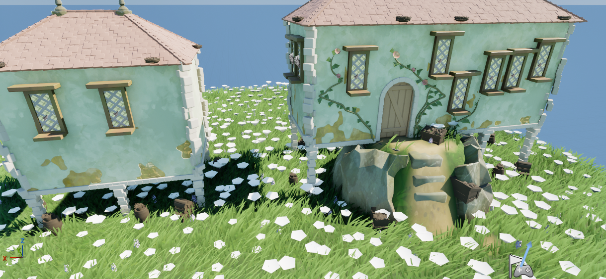

# PCGPlugins

面向 **Unreal Engine 5.7** 的程序化内容生成（PCG）工具集。插件以 **GPU Compute Shader** 与 **Geometry Script** 为核心，提供 GPU 常驻网格对象层（CSMesh）、GPU 浅水模拟、藤蔓/空间竞争生长（Space Colonization）、Tiny Glade 式交互房屋与地面、体素网格生成、Landscape 与 Foliage 编辑等一系列关卡制作与地形装饰工具。

> **状态**：研究 / 生产原型阶段。当前经过验证、可直接打开运行的测试内容见下方 [可运行的测试场景](#可运行的测试场景)；其余 `Content/` 目录为开发过程资产，未必可靠。

---

## 环境要求

| 项目 | 要求 |
|------|------|
| 引擎 | **Unreal Engine 5.7，源码编译版**（`Need ue5.7 build from source`） |
| 平台 | **Win64**（`ComputeShaderGenerator` / `PCGEditorProcess` / `EditorShortcuts` 仅在 Win64 加载） |
| 依赖引擎插件 | GeometryProcessing、GeometryScripting、ModelingToolsEditorMode、EditorScriptingUtilities、Landmass（`.uplugin` 已声明） |
| 引擎插件模块 | `ProxyLODMeshReduction`：`GeometryScriptExtraEditor` 直接链接，用于 VDB 转网格与体素 CSG。它属于引擎的 `ProxyLODPlugin`，该插件默认不启用，`.uplugin` 也没有声明这条依赖 |
| 第三方库 | OpenVDB、IntelTBB、Blosc、zlib（引擎 ThirdParty）；UVAtlas、DirectXMesh（`ProxyLODPlugin` 自带，插件代码不直接调用）；DX12 / `D3D12RHI`（Win64，显存预算查 DXGI 实时预算）。均随引擎提供，无需额外安装 |

之所以需要**源码编译的引擎**：多个模块直接链接引擎渲染层（`Renderer`/`RenderCore`/`RHI`）与 OpenVDB 等 ThirdParty，并使用自定义全局 Shader，Launcher 版引擎无法编译。

---

## 安装

1. 将本仓库放入工程的 `Plugins` 目录：
   ```text
   <YourProject>/Plugins/PCGPlugins/
   ```
2. 右键 `.uproject` → **Generate Visual Studio project files**。
3. 用源码编译的 UE 5.7 打开工程，让编辑器编译插件模块（首次会编译 Shader）。
4. 在 **Edit → Plugins** 中确认 `PCGPlugins` 已启用（默认 `EnabledByDefault`）。

> Shader 源码位于 [`Shaders/Private`](Shaders/Private)，由 `ComputeShaderGenerator` 启动时经 `AddShaderSourceDirectoryMapping` 映射为 `/Plugin/PCGPlugins/Shaders/Private`；全局 shader 要在引擎编译 shader 之前注册，这也是该模块用 `PostConfigInit` 加载的原因。`.uplugin` 里的 `ShaderArchive` 字段 5.7.4 引擎源码并不读取，不起注册作用。

---

## 模块总览

`.uplugin` 注册了 4 个模块。依赖方向：`GeometryScriptExtraEditor` 依赖 `ComputeShaderGenerator`，`PCGEditorProcess` 依赖前两者，`EditorShortcuts` 独立。

| 模块 | 类型 · 加载阶段 | 平台 | 职责 |
|------|----------------|------|------|
| **ComputeShaderGenerator** | Runtime · PostConfigInit | Win64 | GPU Compute Shader 核心：CSMesh 常驻网格对象层、浅水模拟（`ACSShallowWaterCapture`）、藤蔓生成（`AVineContainer`）、体素 / 三角网格生成（`AComputeShaderMeshGenerator`）、MeshBoolean、CliffGenerate、MeshFill、场景捕获、GPU 骨架树、PointBrush、Tiny Glade 房屋与地面等。 |
| **GeometryScriptExtraEditor** | Editor · Default | 不限（依赖 Win64-only 的 `ComputeShaderGenerator`，实际同样只能 Win64） | 扩展 Geometry Script 的蓝图函数库：OpenVDB 体素化、网格属性工具、PolyPath、Landscape 采样、Foliage 互转等。纯函数库，不含 actor / 组件。 |
| **PCGEditorProcess** | Editor · PostConfigInit | Win64 | 编辑器工具流程：四种笔刷 EdMode（实例 / 点 / 地面顶点色 / 窗）、浅水烘焙、Landscape Edit Layer 与道路、选中 Actor 的视口叠加面板、资产处理、GPU 骨架树的骨骼网格生成、拉尺寸失选监听。 |
| **EditorShortcuts** | Editor · Default | Win64 | 编辑器全局快捷键：按键组合 → 调用任意 UFunction（函数库里的静态函数，或逐个选中 actor 上的函数），附 Actor Tag 增删 / 切换函数库。 |

> 调试宏 `PCGPLUGINS_DEBUG` 由 `ComputeShaderGenerator` / `GeometryScriptExtraEditor` / `PCGEditorProcess` 三个 Build.cs 定义，非 Shipping 为 1。**编译期**可用环境变量 `PCGPLUGINS_DEBUG=0` 关掉：它由 UBT 读取，不是运行时开关；Shipping 下 `PCGPLUGINS_DEBUG_ENABLED` 恒为 0，设成 1 也没用。头文件 `PCGPluginDebug.h` 在 `Source/ComputeShaderGenerator/` 的 `Public/` 与 `Private/` 各有一份，内容逐字相同。

> 🧩 **GPU 网格产出统一**：MeshGenerator / Road / Vine 三条 GPU 三角形产出先向共享 `SceneProxy` 基类下沉、汇入同一处 readback / 存盘 → `UStaticMesh` 的数据流（[`Docs/GpuTriangleBuffer_Unification_Flow.svg`](Docs/GpuTriangleBuffer_Unification_Flow.svg)）；此后进一步对象化为「`UCSMesh` 网格对象 + `UCSMeshOps` 算子库 + `UCSMeshRenderComponent` 渲染组件」，见下方核心功能第 1 节。

---

## 核心功能

### 1. GPU 网格对象 · CSMesh（常驻网格 + 算子库 + 渲染组件）

`ComputeShaderGenerator` 里所有「GPU 上生成、GPU 上留着、只在存盘时才回 CPU」的网格都长在这一层上。它把引擎 `UDynamicMesh` 那套「数据对象 / 算子库 / 渲染组件」的分工原样搬到 GPU 侧：几何归一个可独立持有、可传递、可链式加工的 UObject 所有，渲染组件只负责画，算子只负责往常驻流里录 RDG pass。

| 引擎侧 | 本插件对应物 | 位置 |
|---|---|---|
| `FDynamicMesh3`（CPU 网格数据） | `FCSMeshResident`：描述符驱动的常驻 pooled buffer 集 | [`CSMesh.h`](Source/ComputeShaderGenerator/Public/CSMesh.h) |
| `UDynamicMesh`（UObject 容器） | `UCSMesh`（`BlueprintType`，持 `TSharedPtr<FCSMeshResident>`） | 同上 |
| `UGeometryScriptLibrary_*` | `UCSMeshOps`（静态算子库，Target 首参、返回 Target 链式） | [`CSMeshOps.h`](Source/ComputeShaderGenerator/Public/CSMeshOps.h) |
| `UDynamicMeshComponent` | `UCSMeshRenderComponent`（只绑定，不生成） | [`CSMeshRenderComponent.h`](Source/ComputeShaderGenerator/Public/CSMeshRenderComponent.h) |
| `UBaseDynamicMeshComponent` | `UCSGpuMeshComponent` + `FCSGpuMeshSceneProxy`（描述符驱动的渲染基座） | [`CSGpuMeshComponent.h`](Source/ComputeShaderGenerator/Public/CSGpuMeshComponent.h) |
| `UDynamicMeshPool` | `UCSMeshPool`（按显存而非对象数设上限） | [`CSMeshPool.h`](Source/ComputeShaderGenerator/Public/CSMeshPool.h) |
| `CopyMeshToStaticMesh` 等 sink | `UCSMeshOps::CopyToStaticMesh` → `CSStaticMeshAssetSink` | [`CSStaticMeshAssetSink.h`](Source/ComputeShaderGenerator/Public/CSStaticMeshAssetSink.h) |

> **明确不复刻**：`FDynamicMesh3` 式的拓扑编辑。GPU 上没有半边结构，`EditMesh(lambda)` 的逐元素随机访问无从迁移。对应物是「算子 = 一段写入常驻流的 RDG pass 序列」，链式语义与变更事件照搬。
>
> 名字相邻但语义无关：数据资产 `UCSMeshAsset`（`ComputeShaderSceneCapture.h`，MeshFill 家族）与本对象没有关系。

#### 流布局：描述符驱动

一份网格就是一组 `FCSGpuStreamDesc`。基座按描述符做分配、顶点工厂绑定和回读，**加一条 buffer 只是在叶子的 `RegisterStreams()` 里多一次 `AddStream(...)`**，alloc / VF-bind / readback / 存盘代码一行不动。

| 维度 | 取值 |
|---|---|
| `ECSGpuStreamRole` | `Position` / `TangentBasis` / `TexCoord` / `Color` / `Index` / `IndirectArgs` / `MeshCounters` / `AuxVertex` |
| `ECSGpuCountSource` | `PerVertex` / `PerIndex` / `PerTriangle`（= `IndexCapacity / 3`，逐面数据用） / `Fixed` |
| `ECSGpuMeshSemantic` | 回读时填 `FCSGpuMeshCPUData` 的哪个成员：`Position` / `TangentBasis` / `TexCoord` / `Index` / `Color` / `MaterialId` / `None` |

- `AddStandardTriangleStreams()` 注册标准三角集（渲染基座用的 7 条 + 一条逐三角材质 id）；`FCSMeshStreamLayout` 在其上追加额外流，并声明 UV 组数（`NumTexCoordSets`，房子墙那种「UV0 贴图 + UV1 传解析场」是加宽同一条交错流而非新增一条）与 indirect arg 组数。
- 一条流由 `(Role, SlotIndex)` 寻址，重复的 pair 会被拒绝而不是静默遮蔽。`ResizeStreamsSync` 只改已声明的 `Fixed` 流，且**尺寸精确、内容清零**——尺寸随活计数变的流是按那个计数寻址的，幸存的字节会停在不再表示原意的偏移上。`SetStreamLayoutSync` 重分配时只拷贝逐单元步长没变的流：新增的流与被加宽的流（`EnsureTexCoordSets`）一律清零，由调用方重传。
- **布局常量只有一份**：packed 实例行的 stride、custom data 步长、LOD 上限、门框砖路 stride 与塑形物场步长都在 [`Shaders/Private/CSGpuSharedLayout.ush`](Shaders/Private/CSGpuSharedLayout.ush) 里，C++ 与 .usf 都 include 它（只含 `#define`）。改数不会报错、只会错位，所以两边不许各写一份。
- **容量是显式的**，这一点和 CPU 网格根本不同：buffer 定长，真实计数由 GPU 写在 `MeshCounters` 流里，CPU 侧只知道上限。

#### 三条写入通道，没有第四条

| 入口 | `EKind` | 谁拥有 RDG 图 | 游戏线程阻塞 | 用在哪 |
|---|---|---|---|---|
| `UCSMesh::EditMeshSync` | `OwnedGraph` | 自建自执行 | **是**（flush 即栅栏） | 绝大多数算子、编辑器 / 离线路径 |
| `UCSMesh::EditMeshAsync` | `OwnedGraphAsync` | 自建自执行 | **否**（`OnComplete` 才是栅栏） | 交互式生成（藤蔓 `GenerateVineGPU`，耗时见藤蔓测试场景的「生成耗时基线」；Tiny Glade 网格槽的 `SubmitMeshSlotAsync`） |
| `FCSMeshRenderThreadEdit` | `BorrowedGraph` | 借调用方的图 | —（本就在渲染线程） | 渲染线程逐帧 pass（实例剔除等） |

三条共用同一套「注册常驻流 → 跑算子 → 恢复每条流的最终访问状态」。游戏线程读的三样对象状态（分段表、包围盒、已知计数）只经 `FCSMeshEditContext` 的发布接口写：同步通道在 flush 之后落地，异步通道暂存到完成回调才在游戏线程落地，借图通道一律拒绝——渲染线程不许直写它们。**恢复访问状态正是这一层存在的理由**：流被 RDG 留在默认 epilogue 状态（`SRVMask`）上做索引 / 间接绘制是非法的，症状是「某个算子跑完组件就不画了」，几乎无法回溯到原因。借图那条要立刻取变换（`UseExternalAccessMode`），因为读这些流的 pass 就在同一张图的后面——epilogue 的变换会晚于它们，等于永不发生。

异步通道的代价写在契约里：`EditFunc` 是**被移入拥有**的（`TFunction`），它读到的一切也必须归它所有——同步版靠 flush 兜住的「指向调用方栈的裸指针」在这里就是 use-after-free；计数要等完成回调才对游戏线程可见。同一时刻只允许一个异步编辑在飞（`IsEditInFlight()`），第二次直接被拒。

#### 两个代数

- `Generation` —— 每次编辑完成 +1，消费者据此判断自己的缓存视图是否过期。
- `AllocationGeneration` —— 只在 buffer **换了身份**（分配 / 扩容 / 释放 / 改流布局）时 +1。只借用 buffer 的消费者可以忽略内容变更，但必须在这个数动时重新绑定，否则会继续从已经释放的 buffer 上画。同一次变动会**丢弃 section 表**：表描述的 arg 组已被重置，留着它只会画出垃圾或什么都不画，而这两种症状都不会把人指回那张过期的表。

#### 算子库 `UCSMeshOps`

全部同步（这是本子系统的既有契约：flush 栅栏是游戏线程敢往渲染线程递裸指针的前提）。首参恒为 `Target` 并原样返回，蓝图里可以直接串起来。

| 分类 | 节点 |
|---|---|
| Create | `AllocateGpuMesh` |
| Copy | `CopyFromStaticMesh`（按 LOD / 变换 / 翻绕序上传，可带入材质槽）、`CopyToStaticMesh`、`CopyToDynamicMesh` |
| Scene | `AppendBoxSceneTriangles`（世界盒取景，直接写常驻流）、`MakeGeneratorBoxSceneOptions` |
| Boolean | `ApplyMeshBoolean`、`ApplyMeshArrangement`（只做 Stage A：消互穿，不做内外删除） |
| Repair | `WeldVertices`（纯 GPU 重写索引；**故意不合并属性**，以保住 UV / 法线接缝） |
| Transform | `TransformMesh`、`TranslateMesh` |
| Normals | `FlipNormals` |
| Colors | `SetVertexColors`、`PaintVertexColorsSphere`（`Replace` / `Add` / `Max` / `Erase` 四种混合） |
| Sections | `BuildMaterialSections`（GPU 直方图 → 前缀和 → 按材质重排三角） |
| Bounds | `ComputeWorldBoundsSync` |

仅 C++（未反射的类型进不了蓝图）：`PaintVertexColorsSphereInRegion`（局部脏区重绘）、`DisplaceGroundShapers`（Tiny Glade 地形塑形物）、`CopyFromMeshSnapshot`，以及供其它翻译单元复用的 `AddXxxPasses` 系列 pass 录制器。Shader 落在 [`Shaders/Private/CSMeshOps.usf`](Shaders/Private/CSMeshOps.usf)。

**唯一的 CPU 例外**：`ApplyMeshBoolean` 在 `VertexWeldDistance > 0` 时仍走 CPU 快照路——焊接后处理要去掉重复三角，在 GPU 上复现需要全局哈希表。其余分支全程不回 CPU。

#### 容量、显存与「交互路径零阻塞」纪律

- `EnsureCapacitySync` 只涨不缩，扩容时把已有内容拷过去；**被显存预检拒绝时整个请求作废，不做截断**——截断出来的不是「小一点的网格」，而是「尾巴被某个算子悄悄剪掉的网格」，能降级的调用方需要知道自己必须降级。
- `ShrinkCapacitySync` 是它的反面：道路和藤蔓反复重建，只涨不缩会让 buffer 一路棘轮到本次会话的历史最大值。`ShrinkSlackRatio`（默认 0.5，即「分配超出需求 1.5 倍才缩」）是滞回带，避免尺寸来回抖的网格每次重建都重分配 + 拷贝。计数只有 GPU 知道时，`bAllowCounterReadback` 决定是付一次两 uint 回读还是拒绝收缩——**绝不按猜测截断**。
- 每次分配前过 [`CSGpuMemoryBudget`](Source/ComputeShaderGenerator/Public/CSGpuMemoryBudget.h) 预检（`bCheckGpuMemoryBudget` / `GpuMemoryBudgetSafetyRatio`，默认吃可用显存的 70%）。D3D12 下走 DXGI 实时预算（含其它进程占用），其余 RHI 按 RHI 跟踪量推算；峰值按「本次请求 + 已有分配」算，因为重分配期间两套 buffer 同时在。查不到显存不构成拒绝理由（记日志放行）。
- `UCSMeshPool` 的存在理由和 CPU 版**相反**：`UDynamicMeshPool` 归还即清空、清空即释放内存，省的是 UObject；这里**存储才是贵的**，归还的网格保留分配，命中即省掉一次显存分配。所以上限按显存卡（`MaxCachedVideoMemoryRatio` 默认 0.25、`MaxCachedBytesOverride`）而不是按对象数。
- `UCSMesh::GetBlockingFlushCount()` / `CountedBlockingFlush()`：本层每一次 `FlushRenderingCommands` 都记数，让「交互热路径不许有设备同步」这条纪律**可断言**——快照计数，画一笔 / 重算 N 栋房子，增量必须为 0。任何新的阻塞点都必须走 `CountedBlockingFlush`；绕过去等于把这条纪律唯一的自动化防线关掉（曾经就漏过：塑形物 / 石阶的 pooled buffer 分配各自裸调 `FlushRenderingCommands`，那条路上的阻塞对断言完全隐形）。

#### 画：`UCSMeshRenderComponent`

`SetGpuMesh()` 绑一个 `UCSMesh` 就画它，自己不生成任何东西，并订阅 `OnMeshChanged` 以跟上后续算子。与自持 buffer 的叶子相比，差别是承重的：**渲染状态重建从「重跑一遍生成 compute」变成「重新绑定一次」**，而且存盘不再要求有东西正在渲染它。

- 常驻数据是**世界空间**，组件以绝对变换渲染——挪动组件不会挪动几何。三条随之而来、每一条错了都无声的后果，见 [`RoadMeshComponent.h`](Source/PCGEditorProcess/Public/RoadMeshComponent.h) 的类注释。
- 网格带 section 表时逐 section 出一个 `FMeshBatch`，各吃自己的 `DrawIndexedIndirect` arg 组——材质排序已让同材质三角连续，拆分全在 args 里，共用同一条索引 buffer；没有 section 表就是整网格一个 batch 用 `MeshMaterial` 画（不经过 section builder 的网格的既有行为，逐位不变）。
- `GetUsedMaterials` 报的是**所有** batch 材质：漏报一个 section 材质，引擎就不会为它准备 shader、纹理流送与编辑器用途查询。
- `HasGeneratedGeometry()` 问的是网格对象而不是 scene proxy——从「重建 = 重绑」那一刻起，「有没有 proxy」就不再是几何存在的证据了。
- `SaveToStaticMesh(BakeSpace, ...)` 把当前几何烘回调用方给定的局部空间存成资产（`bEnableNanite` 必须在构建前给定，建完再改只标脏、不会真的产出 Nanite 数据）。生产方若把 `UCSMesh` 存在自己身上（如 `AComputeShaderMeshGenerator::DirectGpuMesh`），要显式传 `SourceMeshOverride`——解绑只该让它不显示，不该让生产方连自己的几何都存不出来。

#### 光追与阴影

- **光追 BLAS**（2026-09-09）：`FCSGpuMeshSceneProxy` 给每个 `UCSMeshRenderComponent`（含 `URoadMeshComponent`）建底层加速结构，每个 section 一段，让硬件 Lumen、光追阴影与光追反射看得见 GPU 常驻网格。本工程的 Lumen 走硬件光追、追的是 TLAS，给 GPU mesh 写距离场对它没用——代理也一直关着距离场表示。开关是 `r.CSGpuMesh.RayTracing`（默认 1），`CSGpuMesh.DumpRayTracing` 打印现状。
- BLAS 的三角数只能来自 CPU（RHI 没有 indirect BLAS build），所以它跟着 `FCSMeshResident` 的 draw-args 回读镜像走：每次拥有图的编辑结束都请求一次 args 回读，落地时 `GetDrawArgsPublishSerial()` +1，proxy 在 `OnEndFrameRT` 泵里比对 serial 决定是否重建。回读在途时旧 BLAS 保留；连续逐帧编辑时新请求会顶掉在途的那份，所以编辑停下才重建，天然限流。重建是全量 fast build，不走 refit，也不进帧预算。
- ⚠️ Index 流的最终访问状态必须含 `SRVMask`（现为 `VertexOrIndexBuffer | SRVMask`）：BLAS 构建按 SRV 读输入，RHI 不会替你转换。
- 实例化叶子（`BaseMesh` 没开 Nanite 时的 GPU 剔除路）不建 BLAS（`WantsRayTracingGeometry() = false`）：它的流里只有一份源网格，实例变换在 GPU buffer 里，单实例 BLAS 会在原点冒出一个幻影。所以门框砖、瓦、草这类实例化产物目前都不在 TLAS 里。
- 没有 surface cache（proxy 只有 dynamic relevance，做不了 card capture），GPU mesh 在 Lumen 里「能遮挡、命中点发黑」；反射可开 `r.Lumen.Reflections.HardwareRayTracing.HitLighting=1` 补色。
- **VSM 阴影**（2026-09-08 修）：非 Nanite 的 VSM 光栅会把每个 batch 送进 GPU-Scene 实例剔除，那条路按 `NumPrimitives` 重建 indirect args，而带 `IndirectArgsBuffer` 的 batch `NumPrimitives` 必须为 0——结果画 0 个索引，表现为 CSM 有影、VSM 没影。现在阴影深度视图改发**直接绘制**，计数取自 draw-args 的 CPU 镜像 `FCSGpuDrawArgs`（镜像还没落地时退回间接形式），其它视图仍是精确的间接绘制。实例化叶子的 GPU 剔除路 VSM 阴影仍未修，会被 VSM 的准入检查拒掉（`BaseMesh` 开了 Nanite 的走 Nanite 路，有 VSM 阴影）。
- 📖 [`Docs/GpuMeshRayTracing.md`](Docs/GpuMeshRayTracing.md)；测试 `GpuMeshObject.RayTracingGeometry`（要真 RHI）与 `GpuMeshObject.DrawArgsMirror`。

#### 出：回读与落盘

- `CSMeshReadback::ReadCountersSync` / `ReadbackResidentSync` 作用在 `FCSMeshResident` 上而非 scene proxy 上，所以**没在渲染的网格也能存**；proxy 只是常驻集的一种来源（`FCSGpuMeshSceneProxy::BuildResidentView`）。
- `ReadUintBufferSync` 是诊断 / 验收专用的「任意 uint buffer 回读」通路，专门对付「CPU 断言全绿、画面是错的」那类**陈旧 GPU 计数器**。`FinalAccessRole` 决定读完把 buffer 放回哪个访问状态——不放回去，下一帧的剔除 pass / 间接绘制会在错误状态上撞见它。
- 落盘统一走 [`CSStaticMeshAssetSink`](Source/ComputeShaderGenerator/Public/CSStaticMeshAssetSink.h) 的四步：`ResolveTarget`（只读探测：清洗路径、校验、建目录、看同名资产能否复用）→ 调用方构建 `FMeshDescription` → `PrepareMesh`（破坏性）→ `PopulateFromDescription` → `Finalize`（注册 + 标脏 + 可选写盘）。分四步是为了让破坏性操作**晚于**可能失败的几何构建；同名资产**就地重建**、保留同一个 UObject，引用自动跟上，而不是 `DeleteAsset`（那会打断所有已有引用，且只要还有人在内存里引用它就直接失败）。
- 法线口径：常驻流用 `cross(B-A, C-A)`，与 UE StaticMesh / `FDynamicMesh3` **差一个负号**（引擎那边取的是反向叉积，左手系）。这个差别是真实且承重的，不能「统一掉」；边界上的显式转换是 `bReverseOrientation`。所有「从三角形推法线」的代码都从 `CSMeshBuild::ResidentFaceNormal` 取——写反了不报错，只会让整块网格朝里。

#### GPU 实例化叶子 · `UCSGpuInstancedMeshComponent`

同一基座上的另一条叶子：基础网格一次性上传进 GPU 流，之后**只有逐实例数据在变**，剔除、LOD 选择与绘制在 GPU 上闭环。

- 三种实例源：CPU `FTransform` 数组（`AddInstance` / `AddInstances` / `UpdateInstanceTransform` / `SetInstances` / `RemoveInstance` / `ClearInstances`）；GPU 打包实例 buffer（`FCSGpuInstanceSourceGPU`，5 × float4 / 实例，活计数在 `Counter[0]`，从不回 CPU）；GPU 点集（`FCSGpuInstancePointSourceGPU`，位置 + 法线，proxy 在每次剔除前自己拼实例行——`ACSPointBrushActor` 就是这么在不回读的前提下驱动显示的）。
- 最多 4 级 LOD（`CS_GPU_INSTANCED_MAX_LODS`）共用一条顶点 / 索引 buffer，每级一个 indirect arg 组，由 `FCSGpuInstancedLODRange` 寻址。`bGpuFrustumCulling` / `bGpuLODSelection` / `InstancesPerCluster`（默认 64）/ `LODScreenSizeScale` / `InstanceEndCullDistance` 控制簇剔除与 LOD 切换。
- `FCSGpuInstancedGpuLayout` 在游戏线程派生一次后整份拷进 proxy，而不是两边各推一遍：`MaxInstancesPerLod` 是可见实例 buffer 里一个 LOD 区段的**步长**，两边算出不同的数会把幸存实例压到区段之外——那是设备错误或静默垃圾，不是任何人能追溯的报错。
- `DebugReadDrawnInstanceCountSync()` / `DebugGetDrawnAssetMismatchSync()` 是 Development-only 的验收口子，读的是 GPU 上真正被 indirect draw 消费的那份计数。
- **Nanite 路（自动，没有开关）**：`BaseMesh` 是一张开了 Nanite 的资产（`UStaticMesh::IsNaniteEnabled()`）就自动走这条路，没开就走上面的 GPU 剔除路；`IsNaniteRenderPath()` 只报告结果。编辑器里在资产上勾 / 取消 Nanite，资产重建完（`OnPostMeshBuild`）组件会在下一次帧末更新前自己换路。同样三种实例源，但不画自己的常驻网格——挂一个渲染替身 `UCSGpuInstancedNaniteComponent`（`UStaticMeshComponent`，网格就是 `BaseMesh`），引擎在 GPU-Scene 里给它分一段只在 GPU 上的实例区间，由写入 pass 把 packed 行直接写进去（引擎接口 `FScene::UpdatePrimitiveInstancesFromCompute`，与 PCG 的 GPU 生成同一套）。剔除 / LOD / VSM 阴影 / 光追全归引擎；这台机器画不了 Nanite（`r.Nanite 0`、平台或材质不支持）时由引擎 ISM 代理画资产的回退网格，平台连 GPU-Scene 都没有才退回 GPU 剔除路；`SetBaseMeshFromGpuData` 喂的网格不是资产，永远走 GPU 剔除路。不进 Lumen card 与距离场（引擎要求 CPU 端实例数据，开着是 `check()` 崩溃）。GPU 源每帧重写一遍（生产者原地改 buffer 从不通知），代价是 VSM 每帧作废这批实例的影子缓存，可用 `ShadowCacheInvalidationBehavior = Static` 换缓存。⚠️ 顶点色 alpha 是资产自己的，`PerInstanceRandom + VertexColor.A` 那条通道字典在这条路上不成立。
- Shader：[`Shaders/Private/CSGpuInstancedMesh.usf`](Shaders/Private/CSGpuInstancedMesh.usf)（剔除 / LOD / 点云打包）、[`Shaders/Private/CSGpuInstancedNaniteWriter.usf`](Shaders/Private/CSGpuInstancedNaniteWriter.usf)（Nanite 路的 GPU-Scene 写入）。

#### 谁在用

| 消费者 | 持有的网格对象 | 画它的组件 |
|---|---|---|
| `AComputeShaderMeshGenerator`（`AVineContainer`、`ACSShallowWaterCapture`、`ACSLandscape*`、`AComputeShaderMeshBoolean` 都继承它） | `DirectGpuMesh`（常驻场景三角汤）、`DebugDisplayMesh`（体素方向箭头） | `DirectMeshRenderComponent` / `DisplayComponent` |
| `ACSLandscapeRoad` | 道路网格（组件自持的 `GpuMesh`） | `RoadMesh`：`URoadMeshComponent`（派生自 `UCSMeshRenderComponent`） |
| `AVineContainer` | `VineGeometry` | `VineGpuMesh` |
| `ACSTinyGlade`（地面 / 房体 / 样条块的主网格） | `TinyGladeMesh` | `TinyGladeMeshComponent` |
| `ACSHouseActor` | `PillarMesh`、`VineTubeMesh`（藤管） | `PillarMeshComponent`、`VineTubeComponent` |
| `ACSGroundActor` | `RockShellMesh` | `RockShellComponent` |
| `ACSPointBrushActor` | `PointArrowMesh`（点箭头调试几何） | `PointArrowComponent` |
| `UCSGpuInstancedMeshComponent` | `InstancedGpuMesh`（基础网格 + 逐实例流） | 自身 |

GPU 实例化叶子的用户（每个组件各持一份 `InstancedGpuMesh`）：地面的石阶 / 石阶卵石 / 裙边摆件 / 地被，房屋的门框砖（接缝、角石、包边、砖墙共用这一个组件）/ 承重柱砖 / 藤蔓枝叶花 / 屋瓦 / 摆件，以及 PointBrush 的实例显示。房屋的尖顶、门扇与窗的预制网格是普通 `UStaticMeshComponent`，不在这一层。

- 📖 设计与落地计划：[`Docs/GpuTriangleUnified_Plan.md`](Docs/GpuTriangleUnified_Plan.md)；架构图 [`Docs/GpuTriangleUnified_Architecture.svg`](Docs/GpuTriangleUnified_Architecture.svg)、数据流 [`Docs/GpuTriangleBuffer_Unification_Flow.svg`](Docs/GpuTriangleBuffer_Unification_Flow.svg)
- 🧪 自动化测试（`Source/ComputeShaderGenerator/Private/Tests/`）：`CSGpuMeshObjectTests`（对象 / 编辑 / 桥接口径）、`CSGpuInstancedMeshTests`、`CSGpuInstancedNaniteTests`（Nanite 路：按资产自动选路、真渲染一帧从深度图数实例）、`CSGpuMemoryBudgetTests`、`CSDirectMeshSaveTests`、`CSMeshBooleanParityTests`；全部测试组与跑法见 [自动化测试](#自动化测试)

### 2. GPU 浅水模拟 · Shallow Water

基于一系列 GPU Compute Shader Pass 的实时浅水/水流模拟，采用 **Compact Tile 稀疏调度**：`SW_CompactActiveTiles` → `SW_FinalizeCompact` 压出活跃 tile 表，模拟 pass 只派发这些 tile，只处理含活跃水体的区域，显著降低满纹理调度开销（早期的 AABB 调度区域已从 shader 移除）。

- 核心 Actor `ACSShallowWaterCapture`（`ComputeShaderGenerator`）本身**不 Tick**：求解由 `StartSolver(TimerRate, Iteration)` 挂在世界 `TimerManager` 上定时驱动，`StopSolver` 停止。`StartSolver` 带参数，细节面板不会给它出按钮，编辑器里从蓝图或下面的 `StartSWSolver` 调。
- 配套蓝图库 `UCSShallowWaterProcess`（`PCGEditorProcess`）负责保存 / 烘焙 / 调试：`SaveSWData`、`StartSWSolver` / `StopSWSolver`（转发到上面两个）、`DebugDumpSWPassResults` 等。
- 体素地形变体 `ACSShallowWaterVoxelCapture` 目前只有骨架（`BuildTerrainVoxelGrid()` 未实现），[`Docs/ShallowWater_VoxelGridBuild_Flow.svg`](Docs/ShallowWater_VoxelGridBuild_Flow.svg) 是它的构建流程图。
- Shader：[`Shaders/Private/ShallowWater.usf`](Shaders/Private/ShallowWater.usf)（含 `SparseTileDispatch.ush`）
- C++：`ComputeShaderShallowWater.cpp` / `CSShallowWaterProcess.cpp`
- 📖 原架构详解 `README-SW.md`（Pass 流水线、线程重映射、Compact Tile 调度、各 pass 资源绑定、缓冲区管理与优化方向）已于 2026-08-31 随 `9ea2ed6` 从仓库删除，目前没有替代文档；需要时用 `git show 9ea2ed6^:README-SW.md` 取回。

[](Docs/shallow-water-lifecycle.svg)

### 3. 藤蔓生成 · Space Colonization

`AVineContainer`（`GeometryEditorActor.h`，`ComputeShaderGenerator` 模块，2026-08-31 从 `GeometryScriptExtraEditor` 迁来）以 **空间竞争生长（Space Colonization）** 算法为核心，从「起点实例 + 生长目标实例」出发生成攀爬藤蔓网格。唯一的生成入口是 `GenerateVineGPU()`：整条链路录进同一张 RDG 图，经 `UCSMesh::EditMeshAsync` 异步执行，游戏线程不等渲染线程：

```text
AVineContainer::GenerateVineGPU()          # 录完图即返回（"已递交"），绑定网格发生在完成回调里
  ├─ 表面体素         AddCSSurfaceVoxelPasses（录进同一张图，零回读）
  ├─ 空间竞争求解     AddVineSCPasses → SpaceColonizationQueue.usf（每源一遍）
  ├─ 前缀和 + concat  AddVineFusedSCConcatPasses（逐源计数合并，计数只在 GPU 上）
  └─ 建网格           AddVineMeshPasses → VVVoxel.usf（噪声 / 投影 / 平滑 / 扫掠管截面），写进 VineGeometry
```

- 参数：`FSpaceColonizationOptions`（`Iteration`、`VoxelSize`、`InfluenceRadius`、`ForkTaperForkOrdinal` 等）、`FVV`（`CurlNoise*` / `PerlinNoise*`、`ResampleLength`、`LineScale` / `CircleScale`、`bSurfaceAdsorption` 等）。C++ 上的 `SC` / `VV` / `GrowTarget` / `TubeVineSource` 只是 `BlueprintReadWrite`，细节面板里看不到，由蓝图（`BP_VineSource`）的 `ViewEdit` 变量拼进去。
- 其它入口：`EnsureVineGeometry()`（幂等补建——GPU 数据不存盘，关卡加载后靠它重新生成）、`Clean()`、`FetchFoliage()` / `RevertFoliage()`、`SaveStaticmesh()`。
- Shader：`SpaceColonizationQueue.usf`、`VVVoxel.usf`（含把 GPU 计数换算成派发参数的 `VineDispatchArgsCS`）、`VineFrameCommon.ush`、`VinePerlinNoise.ush`。
- 编辑器交互：旧的藤蔓专用视口面板已泛化为 `FViewEditCategoryViewportOverlay`（见第 7 节），按钮移到了蓝图侧。
- 📖 现状与剩余计划见 [`Docs/VineGpuResidency.md`](Docs/VineGpuResidency.md)。[`VisVineGPU_AlgorithmFlow.svg`](Docs/VisVineGPU_AlgorithmFlow.svg)、[`VisVineGPU_Pipeline.svg`](Docs/VisVineGPU_Pipeline.svg) 与下图都画于 2026-07-23 GPU 常驻化之前（那时 SC 结果和网格还要回读、网格落在 `UDynamicMesh`），只当算法示意看。

[](Docs/SpaceColonizationCS.svg)

### 4. Geometry Script 扩展节点库

`GeometryScriptExtraEditor` 是纯蓝图函数库模块（10 个 `UBlueprintFunctionLibrary`，不含 actor / 组件），节点可在 Geometry Script / 蓝图中调用。主要类别：

- **网格生成**（`UGeometryGenerate`）：`VDBMeshFromActors` / `VDBMeshFromActorPoints` / `VDBMeshFromSurfaceVoxels`、`VoxelMergeMeshs`（体素 CSG）、`FixUnclosedBoundary` / `ExtrudeUnclosedBoundary`（含 OpenVDB 体素化）。GPU 三角数据直接落进 `UCSMesh`：`CSTriangleDataToGpuMesh` / `CSTriangleBuffersToGpuMesh`、`VDBVoxelsToOpenGpuMesh`，要 `UDynamicMesh` 再走 `UCSMeshOps::CopyToDynamicMesh`。旧的 `SurfaceVoxelsToVDBMesh` 已删除，带生成器的版本改为 `AComputeShaderMeshGenerator::SurfaceVoxelsToVDBGpuMesh`（返回 `UCSMesh*`）
- **网格属性/工具**（`UGeometryGeneral`）：法线（`CreateVertexNormals` / `BlurVertexNormals` / `CreateVertexNormalFromOverlay`）、UV / 颜色属性转移、焊接、自定义属性、OBB 朝向、距离场查询、树木风场数据（`WindDataForTree`）、`SaveDynamicMeshToStaticMesh`（转发到唯一实现 `SaveDynamicMeshToStaticMeshWithMaterials`，材质槽取自 `MaterialSource` 组件）
- **VDB 扩展**（`UVDBExtra`）：`ParticlesToVDBMesh` / `ParticlesToVDBMeshUniform`（粒子 → level set → 网格）。VDB → 网格的 `ConvertMeshVDBExtra` 只有 C++ 版，没有网格 → VDB 的节点
- **曲线/PolyPath**（`UPolyLine`，与 `UNoise` / `UPointFunction` / `UGeneralMath` 同在 `GeometryMathUtils.h`）：`SmoothLine`、按数量 / 长度重采样（`ResamppleByCount` / `ResamppleByLength`，拼写如此）、`ConvertPolyPathToTransforms`、`CurveU`（逐点累计弧长，可归一化）。最近点迭代 `FindNearPointIteration` 只有 C++ 版
- **噪声 / 数组归约**（`UNoise` / `UGeneralMath`）：Curl / Perlin 噪声位移；`Reduce_*` 数组归约
- **Landscape**（`ULandscapeExtra`）：投影平面、点投影、地形高度 / 法线采样。⚠️ 蓝图节点 `CreateLandscapeMeshTextureData` 目前恒返回空数组，真正填数据的是 C++ 版 `CreateLandscapeTextureData`（`ACSLandscape` 在用）
- **Foliage 互转**（`UFoliageConverter`）：Foliage 实例 ↔ Transform 数组（转发到 `AVineContainer` 的导入 / 导出）、增删改查实例、自定义数据、距离排序
- **可视化**（`UGeometryVisualization`）：调试绘制顶点法线、把 RenderTarget 画成点阵

### 5. GPU 地形编辑 · Landscape Edit Layer

`ACSLandscape`（`PCGEditorProcess` 模块，编辑器专用）通过 UE 5.7 的程序化 Landscape Edit Layer 接入地形高度图合并管线。每个 Actor 自动维护一个 `UCSLandscapeEditLayer`，编辑结果先在 GPU 上以 RDG Compute Pass 生成并参与 Landscape 合并，可实时预览、调整或移除；只有调用 `BakeLandscape()` 时才会将当前结果永久写入基础高度图并删除对应 Edit Layer。

地形编辑区域由 Actor 的 `Box` 决定，支持旋转后的局部坐标映射和边缘衰减。实时编辑可选择以下高度来源：

| `SourceMode` | 输入 | 用途 |
|---|---|---|
| `ExternalRT` | `ExternalHeightRT` 或 `SetExternalHeightRT()` | 接收蓝图、模拟器或其他 GPU 工具生成的高度 RenderTarget。 |
| `FlatOffset` | `HeightOffset` | 在框选区域内整体抬高或降低地形。 |
| `ProceduralNoise` | `NoiseFrequency`、`NoiseAmplitude`、`NoiseOctaves` | 在世界空间生成多层程序噪声地形。 |

- `BlendMode` 支持 `Alpha`、`Override`、`Additive`、`Subtract`、`Multiply`；`LayerAlpha` 控制本次 GPU 混合强度，`EditLayerAlpha` 控制 Landscape 图层整体权重。⚠️ 枚举里还有第六个值 `MaterialDrive`，shader 没有它的分支，会落进 `Multiply`；`Alpha` 与 `Override` 在 shader 里算的是同一个结果。
- `FalloffWidth` 以厘米定义 `Box` 边缘的过渡宽度；移动 Actor 或修改参数后会请求 Landscape 重新合并，也可在蓝图中调用 `RefreshLayer()`。
- `CopyLandscapeData()` 捕获框选区域的现有地形并发布为可持久化的 Edit Layer 结果；`RT_Result`、`RT_RealtimeResult` 和 `RT_DebugView` 可用于结果或调试检查。
- `ApplyHeightmapRTToLandscape()` 是预留的统一「高度 RT → 地形」入口，目前没有调用方——道路并不经过它，而是直接写 `RT_Result`。

`ACSLandscapeRoad` 是道路专用扩展：它收集自身及附属 Actor 的 Spline，在 `RoadBuilder.usf` 的 GPU Pass 中构建道路和交叉口网格，再将三角形栅格化到 `RT_RoadHeight` 并驱动同一套 Landscape Edit Layer。`RoadInfluence`、`RoadHeightOffset` 和 `RoadEdgeFalloff` 分别控制贴合强度、道路相对高度和路肩过渡宽度（后者换算成平滑迭代次数），`RebuildRoad()` 可在编辑器或蓝图中重建结果。

- 路面本身由 `URoadMeshComponent`（派生自 `UCSMeshRenderComponent`）直接从 GPU 流绘制，可用 `SaveToStaticMesh` 存成资产；形状由 `RoadMaterial` / `RoadWidth` / `SampleStep` / `IntersectionMergeFactor` / `UVTileLength` 控制。
- `RebuildRoad()` 会把 `Box` 拟合到道路范围，RT 尺寸与 Landscape 高度图 1:1；关卡加载后由 `EnsureRoadGeometry()` 在组件注册后的下一帧幂等地补建一次。
- 同文件另有 `ACSLandscapeRiver`：沿 Spline 生成河床（`TargetRiverWidth` / `RiverDepth`、`GenerateRiverBed()`），仍是原型。
- Shader：[`Shaders/Private/CSLandscape.usf`](Shaders/Private/CSLandscape.usf)、[`Shaders/Private/RoadBuilder.usf`](Shaders/Private/RoadBuilder.usf)
- C++（均在 `Source/PCGEditorProcess/`）：`CSLandscapeEditLayerBase.*`、`CSLandscapeEditLayer.*`、`ComputeShaderLandscape.*`、`ComputeShaderLandscapeRoad.*`、`RoadMeshComponent.*`、`RoadBuilderShaders.*`、`RoadTypes.h`
- 开发测试内容：`Content/Landscape/`（包括 Copy、River 与 RoadLandscape 相关资产；仍属于原型内容）

### 6. Tiny Glade 式交互房屋与地面

以 Tiny Glade 为原型的交互式场景搭建：在地面上画路，房子沿路自动开门拱；堆起土台，房子跟着落座、悬空处长出承重柱；两栋房相交，交点立接缝砖柱；用窗笔刷在墙上点一下就挂上一扇窗。整套系统建在第 1 节的 CSMesh 家族上，运行时代码全部在 `ComputeShaderGenerator`；笔刷 EdMode、拉尺寸的失选监听等编辑器应答在 `PCGEditorProcess`（运行时只广播请求，零编辑器依赖，所以无头测试能走完整条交互）。



> `L_HouseGroundDemo` 编辑器视口（2026-09-10）：四坡瓦顶与尖顶、窗、门拱与门扇、藤蔓、墙面灰泥剥落、角石、承重柱，塑形物土台上的岩壳与石阶，以及摆件和草花地被。

| 类 | 角色 | 头文件 |
|---|---|---|
| `ACSTinyGlade` | 抽象基类：「CPU 权威数据 → 快照 → `UCSMesh`」的网格槽（异步上传、在途只留最新）、声明式重求值入口 `ReevaluateSite()`、实例族清单（诊断 / 烘焙）；显存各归各，gpumesh 组件销毁时自己放 | [`CSTinyGlade.h`](Source/ComputeShaderGenerator/Public/CSTinyGlade.h) |
| `ACSGroundActor` | 地面：高度 + 顶点色的 CPU 权威镜像（R = 道路权重）与顶点色笔刷；由它派生地面网格、高度场、石阶、岩壳、裙边摆件、地被（草 + 花）六条链 | [`CSGroundActor.h`](Source/ComputeShaderGenerator/Public/CSGroundActor.h) |
| `ACSGroundShaperActor` | 塑形物：放在地面上的不可见高度影响体，地面从「基底 + 相交塑形物」声明式重导出高度 | [`CSGroundShaperActor.h`](Source/ComputeShaderGenerator/Public/CSGroundShaperActor.h) |
| `ACSHouseActor` | 房屋：落座、道路驱动的门拱与门扇、墙体与门框砖、四坡瓦顶、承重柱、接缝、角石、包边石、窗洞、藤蔓、摆件 | [`CSHouseActor.h`](Source/ComputeShaderGenerator/Public/CSHouseActor.h) |
| `ACSWindowMarker`（基类 `ACSHouseFeatureMarker`） | 窗：自带预制网格，序列化的是锚点（边号 + 离角距离 + 窗台高）而非世界变换；房子只按诉求挖洞并裁决可行性（门拱优先） | [`CSHouseFeatureMarker.h`](Source/ComputeShaderGenerator/Public/CSHouseFeatureMarker.h) |
| `ACSHouseResizeHandleActor` / `ACSHouseHeightHandleActor` | 拉尺寸抓手：四面墙各一个锥子推拉墙面，外加一个高度框改墙高；公共基类 `ACSHouseHandleActor`，用编辑器原生 gizmo 拖 | [`CSHouseResizeHandleActor.h`](Source/ComputeShaderGenerator/Public/CSHouseResizeHandleActor.h) |
| `UCSHouseSubsystem` | 房屋花名册（按 GUID 升序）、0.25 s 兜底变换快扫、点击放窗的执行面 `PlaceMarkerAlongRay` | [`CSHouseSubsystem.h`](Source/ComputeShaderGenerator/Public/CSHouseSubsystem.h) |
| `ACSSplineBlockActor` | 样条块排布：刚体块沿样条排列，只缩沿线步距、恰好占满样条（不是 SplineMesh 弯曲） | [`CSSplineBlockActor.h`](Source/ComputeShaderGenerator/Public/CSSplineBlockActor.h) |

纯函数层（剖面 / 接缝 / 角石 / 包边 / 屋面 / 拉尺寸 / 门段）是 header-inline 的 `CSHouseProfile.h`、`CSHouseSeam.h`、`CSHouseQuoin.h`、`CSHouseTrim.h`、`CSHouseRoof.h`、`CSHouseResize.h`、`CSHouseDoorRuns.h`，带逻辑单测。实例化产物各有一个打包 / 散布 kernel，直接写 `UCSGpuInstancedMeshComponent` 的 GPU 实例行：门框砖 `CSHouseFrame.usf`、瓦 `CSHouseTile.usf`、藤蔓 `CSHouseVine.usf`、摆件 `CSHouseDecor.usf`、承重柱砖 `CSHousePillar.usf`、石阶 `CSGroundStairs.usf`、地被 `CSGroundCover.usf`；岩壳则是一张 `UCSMesh`，由 `CSGroundRockShell.usf` 在常驻流上做位移、法线平均与倒角载荷。

贯穿全系统的四条约定（逐条理由见设计文档）：

- **声明式重求值**：任何唤醒（移动、改参、`OnGroundChanged` 直推、subsystem 快扫）都汇到同一个 `ReevaluateSite()`，目标状态 = 当前输入的纯函数，哈希变了才重建。重复唤醒收敛为零成本，所以不需要脏标记系统来防自环。
- **CPU 镜像是权威，GPU 网格只是投影**：道路权重、地面高度、拾取等查询只打镜像，永不回读 GPU。gpumesh 全线 `NoCollision`，拾取一律解析求交——照引擎 trace 写，窗户会「一放就没」（找不到宿主即自毁，且不报任何错）。
- **开洞不挖几何**：门、窗、接缝裁剪都是逐像素 clip。房体 UV1 传解析裁剪场，材质里的判据与 `CSHouse_ClipKeeps()` 逐字对应；洞缘断口由门框砖或预制窗框盖住。与 TG 原版同构，也不走 MeshBoolean。
- **交互热路径零阻塞**：拖房子、拖抓手、画笔刷期间一次设备同步都不许有。回归脚本在这些路径上断言 `UCSMesh::GetBlockingFlushCount()` 增量为 0；摆件、藤蔓这类「松手才生成」的提交链允许异步回读。

- 📖 文档入口 [`Docs/TinyGlade/index.md`](Docs/TinyGlade/index.md)：设计裁决主文档 `TinyGladeHouse_Plan.md`（D1–D14）、模块对照与进度合卷、窗户专卷、树冠着色专卷，以及完成进度速览。编排层的整体结构审查在插件根 [`TinyGlade_结构审查.md`](TinyGlade_结构审查.md)。
- 🎬 演示关卡与跑法见下方 [Tiny Glade 演示](#-tiny-glade--房屋与地面)；材质建图、演示搭建与出图脚本在 `Scripts/TinyGlade*.py`。
- 📦 TG 原版提取资产在 `Content/HouseTest/TinyGladeAsset/`（StaticMesh / 材质 / 贴图，另有 `TinyGladeGallery`、`TG_GrassWindDemo` 两张陈列关卡），尺寸一律按它实测。

### 7. 编辑器工具 · PCGEditorProcess / EditorShortcuts

**笔刷编辑模式**全部是 `FEdMode`，共用基类 `FCSBrushEdModeBase`（笔刷球、表面 trace、圆盘采样、间距，以及拖拽 / 松开 / `Esc` 的笔画生命周期）。每个模式都由运行时 actor 上的按钮广播请求、本模块应答激活——运行时模块不认识 EdMode：

| EdMode | 作用对象 | 行为 |
|---|---|---|
| `FCSInstanceBrushEdMode` | `AMeshGeneratorBrushCache` | 往 actor 自己的实例化网格组件上画实例 |
| `FCSPointBrushEdMode` | `ACSPointBrushActor` | 采样 GPU 深度缓冲，把点直接追加进 actor 的 GPU 点 buffer（见下节） |
| `FCSGroundPaintEdMode` | `ACSGroundActor` | 画地面顶点色（道路权重）；拾取走地面自己的解析射线，不靠碰撞 |
| `FCSWindowBrushEdMode` | `ACSHouseActor` | 在墙上点一下放一扇窗（`UCSHouseSubsystem::PlaceMarkerAlongRay`），随即退出 |

- **视口叠加面板** `FViewEditCategoryViewportOverlay`：把任意选中 actor 细节面板里的 `ViewEdit` 分类搬进视口（基类 `FSelectedActorViewportOverlayBase`，前身是藤蔓专用的 `FVineContainerViewportOverlay`）。
- **浅水烘焙** `UCSShallowWaterProcess`：`SaveSWData` 在模块启动时绑到 `ACSShallowWaterCapture::OnBakeResultMeshDelegate`；另有 `StartSWSolver` / `StopSWSolver`、`DebugDumpSWPassResults`。
- **资产处理** `UCSAssetProcess`：网格高度 → RT、RT → 贴图、材质实例辅助、按 RT 位移网格；另有 `UGeometryEditorFunction::CreateStaticMeshAsset`。
- **GPU 骨架树**：`GenerateGPUSkeletalTree` 为 `AGPUSkeletalTree` 建临时骨架与骨骼网格。
- **拉尺寸失选监听** `FCSHouseResizeSelectionWatcher`：选择离开房子及其附属 actor 时退出拉尺寸模式；只在有房子处于该模式时监听，晚一个 tick 判定。
- Landscape Edit Layer 与道路也在本模块，见第 5 节。

**EditorShortcuts** 是编辑器全局快捷键：把按键组合绑到任意 UFunction 上（2026-08-31 取代了 `PCGEditorProcess` 里旧的 `ActorTagShortcut`）。

- 配置在 **Project Settings → Plugins → Editor Shortcuts**（`UEditorShortcutSettings`，存进项目的编辑器用户配置）。每条 `FEditorShortcutBinding` = `Chord` + `TargetClass` + `FunctionName`，另有 `bTransactional` / `bRequiresSelection` / `bShowNotification`。
- 调用目标二选一：填 `TargetClass`（蓝图函数库、蓝图类或原生类，静态 / 抽象类调在 CDO 上）；留空则逐个调选中 actor 上的同名函数。参数只能是 actor 数组（收到当前选择）、单个 actor、`__WorldContext` 或带默认值的参数。
- 每次调用包一个撤销事务，出错即取消；PIE 中、按键重复时不触发，文本框有焦点时默认也不触发。启动时对缺键、缺目标、键位冲突打警告。
- `UEditorShortcutTagLibrary` 提供可撤销的 `AddTagToActors` / `RemoveTagFromActors` / `ToggleTagOnActors`。绑定没法传参，所以每个 tag 要一个包装函数：`UEditorShortcutSetupLibrary::CreateTagToggleLibrary(PackageName, Tags, bSave)` 生成一个 Editor Utility Blueprint，每个 tag 一个 `Toggle<Tag>(Actors)`，把返回的类路径填进 `TargetClass` 即可。
- 蓝图 / Python 可经 `UEditorShortcutSubsystem` 直接执行绑定（`ExecuteBindingByIndex` / `ExecuteBindingByLabel` / `RunBinding` / `ValidateAllBindings`）。
- ⚠️ 宿主工程 UETest574_2 的 `Config/DefaultEditorPerProjectUserSettings.ini` 里有 4 条绑定（Toggle CSSW / UA / Pick / Ref），都指向 `/PCGPlugins/EditorShortcuts/BPFL_ShortcutActions`，但这个资产目前不存在（`Content/EditorShortcuts/` 是空的），要先用 `CreateTagToggleLibrary` 生成，否则这 4 条会报找不到目标类。

### 🖌️ PointBrush · 绘制点 → GPU 可直读 buffer

放置 `ACSPointBrushActor`，点 `Start Point Brush` 进入笔刷模式。每次鼠标移动都排一次 GPU 深度缓冲采样（`FCSDepthBrushSampleService` + `CSDepthPointBrush.usf`），命中点**直接写进** actor 的 GPU 点 buffer，采到即提交；松开鼠标只刷新显示，`Esc` 退出模式但不撤销已画的点。

- **GPU buffer 是活数据**：`GetPointBuffers()` —— float4 位置 / float4 法线 / 2-uint 计数器（`[0]` = 有效点数，`[1]` = 容量）。消费者 `RegisterExternalBuffer` 后按计数器间接派发，点和数量都不回 CPU。
- ⚠️ **笔刷画的点不存盘**：`PaintedPoints`（`UPROPERTY`）仍随关卡保存，但笔刷已不再写它；`RebuildPointBuffer` 只按 `PaintedPoints` 重新播种，会丢掉笔刷画的点，关卡重载同理。
- **显示**有两条路，由 `InstanceMesh` 决定：留空（默认）时一个 compute pass（`CSPointArrowMesh.usf`）把 buffer 转成 `PointArrowMesh`，由 `PointArrowComponent` 每点画一根沿法线的箭头；设了网格则由 `UCSGpuInstancedMeshComponent` 经 `FCSGpuInstancePointSourceGPU` 每点画一个实例，同样不回读。
- **生命周期**：pooled buffer 在重建 / `Release Point Buffer` / `EndPlay` / 删除 Actor / GC（关关卡、关引擎）时于渲染线程释放。⚠️ 设了 `InstanceMesh` 时实例组件的 GPU 点源里另有一份引用，而 `Release Point Buffer` 与「把 `InstanceMesh` 清空、切回箭头」两条路目前只调 `ClearInstances()`（只清 CPU 实例表），放不掉这份引用：组件会继续占着显存，还可能继续画旧点（读代码所得，未实测）。

---

## 可运行的测试场景

以下测试场景经过验证，**测试文件可用**，是了解插件功能的最佳入口。

### 🌊 CSSW · GPU 浅水模拟

> **📍 测试关卡**：[`Content/ShallowWater/VelocityHeight/L_VelocityHeight.umap`](Content/ShallowWater/VelocityHeight)

| 溪流漫流 | 多水源侵蚀地形 |
|:---:|:---:|
|  |  |

- **示例蓝图**：`BP_CSSW_Capture`（捕获/求解器）、`BP_CSSW_Source`（水源，即截图中的粉色圆盘）、`BP_CSSW_Flux30` / `BP_CSSW_Flux30_CloseBound`（水流示例，即红色圆柱）
- **运行方式**：打开关卡 → 选中 `BP_CSSW_Capture` 实例 → 调 `UCSShallowWaterProcess::StartSWSolver`（作用于当前选中的 CSSW actor，可给 `Iteration` / `TimerRate`）启动求解，`StopSWSolver` 停止（actor 本身不 Tick、细节面板上也没有启动按钮，见第 2 节）。
- **调参**：细节面板 `SWParameter` 分类下可调 `Iteration`、`WorldPixelSize` 等；`DT`、`Friction` 只是 `BlueprintReadWrite`，面板里看不到，要在蓝图里设。`RT_*` 为各阶段调试 RenderTarget。

### 🌿 VineGenerator · 藤蔓 / 空间竞争生长

> **📍 测试关卡**：[`Content/SpaceColonization/L_TestWorld.umap`](Content/SpaceColonization)（关卡内已放置 `AVineContainer` 藤蔓 Actor）


> 截图摄于 2026-07：左侧是 `ViewEdit` 分类浮窗；右上角那块按钮面板属于已删除的 `FVineContainerViewportOverlay`，现在已经没有了。

- **配套资产**：`SMF_*_FoliageType`（Tube/Plane/Target 三类 FoliageType）、`Mesh/`（Tube/Plane/Target 源网格）、`Material/`（藤蔓/调试材质）
- **运行方式**：打开关卡 → 选中场景中的藤蔓 Actor（`BP_VineSource` 实例），视口叠加面板会浮出它的 `ViewEdit` 分类，`Curl Noise Fre`、`Perlin Noise Fre`、`Circle Scale` 等参数在那里调 → 蓝图侧提供取回 / 还原场景 Foliage（`FetchSceneFoliage` / `RevertSceneFoliage`）、生成（调 `GenerateVineGPU()`）与清理（`CleanAll`）的入口。要烘焙成 StaticMesh 调 `SaveStaticmesh()`（蓝图可调）。
- **管线形态**：全程 GPU 常驻。表面体素（位置/法线/目标点场）由 `AddCSSurfaceVoxelPasses` 录进生成的同一张 RDG 图，不回读（`PrepareBoxSceneSurfaceVoxelsGPU` 只剩体素调试箭头在用）；空间竞争的生长状态留在显存；藤蔓网格归 `AVineContainer` 自己持有的 `UCSMesh`（`VineGeometry`）所有，由 `VineGpuMesh`（`UCSMeshRenderComponent`）直接从 GPU 流绘制，不再经 `UDynamicMesh`——渲染状态重建因此只是重新绑定，不会重跑一遍生成。
- **仅剩的 CPU 回读**（一处）：`Save Mesh` 时对渲染流的一次性读取。SC 之后那次 4-uint 线段计数回读已随合图去掉，buffer 尺寸改由 CPU 侧容量决定、dispatch 规模改由 GPU 计数经 `VineDispatchArgsCS` 换算。
- **详细状态与剩余计划**：[`Docs/VineGpuResidency.md`](Docs/VineGpuResidency.md)

#### 生成耗时基线

`GenerateVineGPU()` 走 [`UCSMesh::EditMeshAsync`](Source/ComputeShaderGenerator/Public/CSMesh.h)：录完 RDG 图就返回，**游戏线程不等渲染线程**。所以耗时要分两个数看，别再当成一个。

`L_TestWorld` / `BP_VineSource`，980 个 `GrowTarget`、2 个 `TubeVineSource`，`SC.Iteration=55`、`SC.VoxelSize=5`、`VV.VisVineGPUTubeSegments=3`、`VV.VisVineGPUNoiseIterations=10`，交互编辑器 Development：

| 段 | 稳态耗时 | 线程 | 说明 |
| --- | --- | --- | --- |
| `GenerateVineGPU.PrepareSurfaceVoxelInputs` | 10–12 ms | game | 占游戏线程耗时的绝大部分 |
| `SpaceColonization.PrepareInputs` | 0.05 ms | game | 只递交输入，求解在 GPU |
| **`GenerateVineGPU.Total`** | **12.4–14.6 ms** | game | **卡顿只有这么多**；返回即表示"已递交"，不表示已建好 |
| `VisVineGPUTiming tube buildLeaf(wallclock)` | 305–311 ms | render | 图在渲染线程跑完的墙钟，**不阻塞游戏线程** |
| 被 in-flight 挡下的重复请求 | 0.002 ms | game | 上一次未完成时直接拒，不做 CPU 准备 |

- 改异步前，同一台机器同一关卡的冷启动生成是 `Total: 691.8 ms`（其中 `buildLeaf` 675.8 ms 全是阻塞等待）。**游戏线程卡顿降低约 98%**，渲染线程总工作量不变。
- 完成回调稳定落在下一帧（f0→f1、f83→f84、f170→f171）。
- 产物在所有生成间完全一致：`Vertices=593880 Indices=3563280`，可直接当回归判据。
- 开 `r.RDG.ImmediateMode 1` 复验：干净、无 TDR、顶点数一致。**改动藤蔓 RDG 图后必须过这一关**——普通模式下依赖边丢失不报错。
- ⚠️ `buildLeaf(wallclock)` 混着"图本身的量"和"当时渲染线程有多堵"，交互编辑器里天生抖（实测同一进程内出现过 164 ms 与 553 ms 的尖峰）。要 GPU 侧真实耗时请用 `stat gpu` 或 Unreal Insights 抓 `VineMesh.Build`。
- 复现脚本：`Saved/CodexTests/measure_vine_after_move.py`（在宿主工程 UETest574_2 的 `Saved/` 下，不在插件仓库里；环境变量 `VINE_RDG_IMMEDIATE=1` 切立即模式）。注意异步之后**连续生成必须隔帧**——完成回调要游戏线程 tick 才会跑，`-ExecutePythonScript` 里连着调第二次会被 in-flight 挡下。

#### CPU 版本耗时预估（对照）

> ⚠️ **这一节是估算，不是实测。** 仓库里已经没有可跑的 CPU 藤蔓路径了，下面的数是「历史 CPU 实现的调用次数 × 单次成本」算出来的。单次成本大部分实测（见下表标注），少数只能估。**当量级参考，别当基准数据引用。**

**可参照的历史 CPU 实现**（都能从 git 取回，是估算里调用次数的依据）：

| 实现 | 位置 | 表面投影方式 | 状态 |
| --- | --- | --- | --- |
| CPU 空间竞争 `BuildSpaceColonizationQueueImpl` | `git show e941364^:Source/GeometryScriptExtraEditor/Private/GeometryEditorActor.cpp` | 不涉及 | 删于 `e941364`；带 `bMultThread` / `ProcessAsync` 并行分支 |
| CPU 线预处理 `PrepareVVLinesProjected` | `git show b12e1c2^:Source/GeometryScriptExtraEditor/Private/GeometryEditorActor.cpp` | 体素哈希（与 GPU 同算法） | 删于 `b12e1c2`，删时已零调用 |
| 更早的 BVH 版 `AVineContainer::VisVine` | `git show e2f16bc:...`（旧历史分支，非当前 main 祖先） | `FDynamicMeshAABBTree3` 最近三角 | 只作上界参考 |

GPU 版本是照着这些实现做的逐条对齐移植（shader 注释里的 “matching the CPU sequential commit loop”、“Mirrors PopulateSpaceColonizationAssociatesFromNeighbors”），所以算法和产物形状一致，可以按同一份工作量对比。

**工作量**（三角数为测试场景实测；其余由上面同一次生成的产物反推）：

```text
拾取三角       ≈ 1 000 000                          # BuildBoxSceneTriangleRequests 收进来的场景三角
表面体素       ≈ 1 090 000                          # VoxelSize=5，模型值，见下方说明
路径点数 P     = 593880 / ProfileCount(3) = 197960   # 也 = 2 源 × 980 target × (SC_MAX_BACKTRACK+1)
段数           = 3563280 / (3 × 6)        = 197960
输出三角       = 3563280 / 3              = 1187760
SC 规模        = 980 target × 2 源 × 55 迭代，MaxNeighbors = 128
```

体素数没有日志可查——GPU 常驻路径下真实数只在 `Counter[0]` 里，不回 CPU。这里的 109 万是把 `TriangleSurfaceVoxelsCS` 的体素化规则原样转写、在 100 万三角的合成表面上跑出来的**模型值**。它决定投影走下表哪一档（72 MB 那档，已超出本机 30 MB L3），是估算里对三角数最敏感的一环。

**单次成本**（本机 i7-13700KF，MSVC `/O2`，单线程，[`Docs/VineCpuCostBench.cpp`](Docs/VineCpuCostBench.cpp)）：

| 原语 | 成本 | 来源 |
| --- | --- | --- |
| 表面体素化（100 万三角 @ `VoxelSize=5`） | **547 ns/三角 → 合计 548 ms** | 实测转写 |
| `UNoise::CurlNoise`（= 5 × `PerlinNoise3D`，样本同格） | **154.4 ns** | 实测 |
| `FMath::PerlinNoise3D`（散点） | **65.0 ns** | 实测 |
| 体素哈希投影 8 角（体素表 1.1 / 4.5 / 18.1 / 72.2 MB） | 72.6 / 99.4 / 124.3 / **165.0 ns** | 实测 |
| BVH 最近三角（100 万三角，65.7 MB） | **1411 ns**；建树 **240 ms** | 实测下界 |
| `UCurveLinearColor::GetUnadjustedLinearColorValue` | 80–200 ns | 估（4 条 `FRichCurve`） |
| `FDynamicMesh3` 追加带属性三角 | 150–400 ns | 估 |

BVH 那一行标「下界」：基准里用的是节点 32 字节、叶子 4 三角的紧凑数组 BVH，比 UE 的 `FDynamicMeshAABBTree3` 更贴 cache——UE 那边节点更胖、要过 `FDynamicMesh3` 的间接层，Geometry Script 封装每次查询还多走一次 `ProcessMesh`。

**分段估算**（单线程，调用次数按终态 P 计）：

| 段 | 主要调用 | 估算 | 随三角数伸缩 |
| --- | --- | --- | --- |
| 三角收集 / 解析 | `BuildBoxSceneTriangleRequests` + `ResolveStaticMeshTriangleRequests` | 10–12 ms（实测，两条路都要） | 是 |
| 表面体素化 | 100 万三角 × 547 ns | **0.55 s** | **是** |
| 空间竞争求解 | 邻居表 2×980²，生长循环 55×980×2 源×≤128 邻居扫描 | 0.08–0.20 s | 否 |
| 噪声 + 投影（10 轮） | CurlNoise ×2 177 560、Perlin ×1 979 600、投影 ×1 979 600、曲线求值 ×1 979 600，外加每轮 `ResamppleByLength` + `ClonePolyPath` 全量重建 | **1.00–1.29 s** | 间接（体素表大小） |
| 合并 + 最终投影 + 平滑 + 帧 | 投影 ×395 920、15.8 万点排序、4 遍重采样/平滑、逐点 `MakeFromXZ` | 0.16–0.24 s | 间接 |
| 网格生成 | `AppendSweepPolygon` → `FDynamicMesh3`（594K 顶点 / 119 万三角）→ 整份拷进容器网格 → `UDynamicMeshComponent` 渲染缓冲重建 | **0.6–1.6 s** | 否 |
| **合计** | | **约 2.4–3.9 s** | |

体素化逐三角天然并行，线与线之间也独立，噪声/投影段按线 `ParallelFor` 可以接近线性扩展；网格段的合并与渲染缓冲重建基本串行。按 16 线程理想估：**约 0.6–1.4 s**。

**对照结论**：

| 口径 | GPU（实测） | CPU 体素投影版（估算） | 倍数 |
| --- | --- | --- | --- |
| 游戏线程卡顿 | **12.4–14.6 ms** | 2.4–3.9 s（单线程） | **165–315×** |
| 游戏线程卡顿 | **12.4–14.6 ms** | 0.6–1.4 s（16 线程理想） | **40–115×** |
| 端到端（到网格可见） | 691.8 ms（改异步前同步实测） | 2.4–3.9 s（单线程） | 3.5–5.6× |
| 端到端（到网格可见） | 691.8 ms（改异步前同步实测） | 0.6–1.4 s（16 线程理想） | 0.9–2.0× |

- **100 万三角把体素化推成了独立大头。** 它在 GPU 版本里是融合图里的一个 pass，在 CPU 版本里是实打实的 0.55 s（单线程，占总量一到两成），而且是唯一严格随三角数线性伸缩的一段——场景几何翻倍它就翻倍。次级效应同样来自这个数：109 万体素的哈希表约 72 MB，超出本机 30 MB L3，逐次投影从 1.1 MB 表的 72.6 ns 涨到 165.0 ns，光噪声段就多出约 180 ms。
- **GPU 的赢面不在吞吐倍数。** 把 CPU 版本认真并行化之后，端到端总时间和 GPU 同步版本仍是同一量级（0.9–2.0×）。真正的差距在两处：一是**落点**——GPU 版本只在游戏线程花 12–14 ms，其余全在渲染线程，编辑器里可以拖参数条实时看；CPU 版本整段压在游戏线程上，编辑器直接卡死 2–4 秒。二是**网格落地**——CPU 必须建 `FDynamicMesh3` 再重建渲染缓冲（估 0.6–1.6 s，占单线程总量两到四成），GPU 版本直接写 `VineGeometry`（`UCSMesh`）的常驻流，这一段整体消失。
- **BVH 版没有可比性。** 它不需要体素化，但全流程 12 次投影 × 197 960 点 = 237 万次最近三角查询，按 100 万三角实测的 1411 ns 算就是 **3.35 s**，加建树 0.24 s 和其余各段，**下界约 5–6.5 s**；算上 UE 那层封装（更胖的节点、`FDynamicMesh3` 间接、每次查询一遍 `ProcessMesh`）实际估 **8–13 s**，是 GPU 游戏线程耗时的 550–1050 倍。历史上真实卡的就是这一版。
- **误差来源**：曲线求值、`FDynamicMesh3` 追加与渲染缓冲重建这两项没有实测常量；体素数是模型值不是实测值；SC 求解按操作计数粗估。这四项是区间宽的主要原因。另外调用次数按终态点数计，而 CPU 版本每轮噪声后都重采样、前几轮点数更少，所以噪声段偏保守（估高）。UE Development 配置比独立基准多一层容器/边界检查开销，实际只会更慢。
- **想要真数**：把上表里的 CPU 实现接回去，再走 `measure_vine_after_move.py` 那套计时；体素数可以临时在 `AddCSSurfaceVoxelPasses` 后加一次 `Counter[0]` 回读打出来。

### 🏠 Tiny Glade · 房屋与地面

> **📍 演示关卡**：[`Content/HouseTest/`](Content/HouseTest) 下的 `L_HouseGroundDemo.umap` 与 `L_TerrainOpsDemo.umap`；样条块排布单独在 [`Content/SplineBlock/L_SplineBlockDemo.umap`](Content/SplineBlock)。

| 关卡 | 演示内容 | 主要蓝图 / 资产 |
|---|---|---|
| `L_HouseGroundDemo` | 画路开门拱、承重柱、窗、接缝、藤蔓、摆件、拉尺寸、地被 | `BP_TinyGladeGround`、`BP_TinyGladeHouse`、`BP_Window_Cottage_1x1` / `BP_Window_Gothic_1x1` |
| `L_TerrainOpsDemo` | 塑形物堆台、石阶、披挂岩壳、裙边摆件、房子随台升降、地被 | `BP_GroundShaper`、`BP_TinyGladeGround` |
| `L_SplineBlockDemo` | 块沿样条排列、缩放后恰好占满 | `BP_SplineBlockRow` |

- **画路**：选中地面 → 细节面板点 `StartVertexColorPaint` 进入顶点色笔刷，左键拖拽落笔、松开提交、`Esc` 退出；R 通道就是道路权重，路画过墙脚，房子当场开拱。`ResetPaint` 清空笔迹。
- **改房子**：选中房子点 `EnterResizeMode`，冒出四个锥子（推拉墙面）和一个高度框（改墙高），用 gizmo 拖，失选自动退出；点 `StartWindowBrush` 后在墙上点一下放一扇窗（窗型取 `WindowBrushClass`）。
- **改地形**：拖动塑形物或改 `Radius` / `LiftHeight` / `FalloffDistance`，地面重导出高度，房子随之升降、柱子与石阶跟着重排。
- **怀疑状态不同步**时点一次 `ReevaluateSite` 即对齐。实例化产物要落成资产，从蓝图 / Python 调 `SaveInstancedToStaticMeshes`（阻塞，离线操作，一族一张 `SM_<actor>_<family>`）；网格路走 `UCSMeshRenderComponent::SaveToStaticMesh`。
- **回归**：两张关卡由 `Scripts/TinyGladeDemoRegression.py` 无头回归覆盖，跑法与当前基线见 [自动化测试](#自动化测试)。

> 其它目录（如 `Content/ShallowWater/Material30`、`Content/TreeWindData`、`Content/GeneralTest` 等）为开发中/参考资产，不保证可直接运行。

---

## 自动化测试

两套判据，都要真 RHI：不能加 `-nullrhi`（全局 shader 不编译、光追用例跑不了，Python 里 spawn actor 还会除零崩溃），也别加 `-NoShaderCompile`（5.7.4 启动即崩）。判定一律看日志里的业务标记，不看退出码——无头编辑器退出时偶发异常，与测试结果无关。

```powershell
# C++ 自动化测试：过滤串可换成下表里更细的前缀
& "<UE>\Engine\Binaries\Win64\UnrealEditor-Cmd.exe" "<Project>.uproject" -ExecCmds="Automation RunTests PCGPlugins" -TestExit="Automation Test Queue Empty" -unattended -nopause -nosplash -stdout -AbsLog="<log>"

# Tiny Glade 演示关卡回归：每条断言打一行 [PASS]/[FAIL]，末尾 REGRESS OK / REGRESS FAILED
& "<UE>\Engine\Binaries\Win64\UnrealEditor-Cmd.exe" "<Project>.uproject" -ExecutePythonScript="<Project>/Plugins/PCGPlugins/Scripts/TinyGladeDemoRegression.py" -unattended -nosplash -stdout -AbsLog="<log>"
```

C++ 用例 120 余条，全部是 `IMPLEMENT_SIMPLE_AUTOMATION_TEST`，位于 `Source/ComputeShaderGenerator/Private/Tests/` 与 `Source/PCGEditorProcess/Private/Tests/`：

| 过滤串（`PCGPlugins.` 之后） | 测试文件 | 覆盖 |
|---|---|---|
| `ComputeShaderGenerator.GpuMeshObject` | `CSGpuMeshObjectTests` | 流契约、StaticMesh 往返、算子、焊接、池、section 排序、draw-args 镜像、光追 BLAS、渲染线程编辑等 19 条 |
| `ComputeShaderGenerator.GpuInstancedMesh` | `CSGpuInstancedMeshTests`、`CSGpuInstancedNaniteTests` | 打包、簇、流、扩容、门框砖烘焙存活、Nanite 路（按资产自动选路） |
| `ComputeShaderGenerator.{MemoryBudget, DirectGPUMesh, MeshBoolean, GpuDebugDraw, PointBrush}` | `CSGpuMemoryBudgetTests` / `CSDirectMeshSaveTests` / `CSMeshBooleanParityTests` / `CSGpuDebugDrawTests` / `CSPointBrushTests` | 显存预算、直出网格存盘、布尔 GPU 对拍、体素调试、点 buffer 生命周期 |
| `ComputeShaderGenerator.House` | `CSHouseLogicTests` / `CSHouseTileTests` / `CSHouseDecorTests` / `CSHouseVineTests` | 屋面、门段、剖面与裁剪场、门框砖与墩、窗、接缝、角石、包边、抓手、瓦、摆件、藤蔓 |
| `ComputeShaderGenerator.{GroundDecor, RockShell, GroundShaper, GroundStairs}` | `CSGroundDecorTests` / `CSGroundRockShellTests` / `CSGroundShaperFieldTests` / `CSGroundStairsTests` | 裙边摆件、岩壳、塑形场 CPU / GPU 对拍、石阶 |
| `ComputeShaderGenerator.SplineBlock` | `CSSplineBlockTests` | 样条块排布 |
| `TinyGladeHouse.Vine` | `CSHouseVineTests` | 藤管路径（与同文件其它用例的前缀不同） |
| `PCGEditorProcess` | `CSWindowBrushEdModeTests` / `CSHouseResizeWatcherTests` / `RoadMeshSaveTests` | 窗笔刷 EdMode、拉尺寸失选监听、道路存盘 |

另有 `ComputeShaderGenerator.MeshBoolean.SourceSoupOrientation` 注册在 `ComputeShaderMeshGenerator.cpp` 里，不在 `Tests/` 目录下。

- ⚠️ **基线不是全绿**：截至 2026-09-10，C++ 有 3 条、演示回归 249 条断言里有 25 条是既有失败，多为断言没跟上被测代码或关卡内容漂移。跑完先对照这份基线，别把既有失败读成「刚改坏了」。
- ⚠️ 回归脚本的全部断言在**同一帧**里跑完。凡是「推迟到帧末 / 下一帧」兑现的更新，脚本改完紧接着读都会读到旧值；多数 C++ 用例不建世界，碰不到这类时序。改更新时序的改动，两套判据都要跑。

---

## 设计文档

各功能节里已就近链接对应文档，这里汇总 `Docs/` 与插件根的全部文档及其状态。

| 文档 | 内容 | 状态 |
|---|---|---|
| [`Docs/TinyGlade/index.md`](Docs/TinyGlade/index.md) | Tiny Glade 复刻的文档入口：设计裁决、模块对照与进度、窗户 / 树冠专卷、逆向报告 | 持续更新 |
| [`TinyGlade_结构审查.md`](TinyGlade_结构审查.md) | Tiny Glade 编排层的整体结构审查，子代理报告在 `Docs/TinyGlade/` 附录 A/B/C | 2026-09-06～07 审查，09-11 复核 |
| [`Docs/GpuTriangleUnified_Plan.md`](Docs/GpuTriangleUnified_Plan.md) | GPU 三角形统一：可拓展储存 + 单一 readback，CSMesh 对象层的前身 | ⚠️ 历史文档：L0 回读层与 sink B 未按此落地，对象层取代了它（2026-09-10 标注） |
| [`Docs/GpuMeshRayTracing.md`](Docs/GpuMeshRayTracing.md) | GPU 常驻网格的光追 BLAS 接入（Lumen 硬件光追 / 光追阴影 / 反射） | 2026-09-09 落地 |
| [`Docs/VineGpuResidency.md`](Docs/VineGpuResidency.md) | 藤蔓生成链路的 GPU 常驻化现状与剩余计划 | 2026-08-14；现状表于 2026-09-10 订正过两行 |
| [`Docs/FrameQuotaScheduler_Plan.md`](Docs/FrameQuotaScheduler_Plan.md) | GPU 生成作业的统一帧配额（分帧）调度 | 设计基线，暂不实施 |
| [`Docs/GpuClothSim_Plan.md`](Docs/GpuClothSim_Plan.md) | XPBD 布料模拟：常驻算子逐帧驱动 `UCSMesh` 形变 | 计划，未实施 |
| [`Docs/GpuRigidSettle_Plan.md`](Docs/GpuRigidSettle_Plan.md) | 批量刚体沉降（粒子簇形状匹配），布料计划的姊妹篇 | 计划，未实施 |
| [`Docs/CSLandscapeLayer_Framework.md`](Docs/CSLandscapeLayer_Framework.md) | CS 地形图层编辑框架的模块关系、数据流与已知架构问题 | 2026-07-23 写成 |
| [`Docs/InstanceBrushPaintDesign.md`](Docs/InstanceBrushPaintDesign.md) | Actor 自持的实例笔刷方案 | 2026-07-23 设计稿 |
| [`Docs/VDBMeshFromActorPoints.md`](Docs/VDBMeshFromActorPoints.md)、[`Docs/VDBMeshFromSurfaceVoxels.md`](Docs/VDBMeshFromSurfaceVoxels.md) | VDB 网格生成的 GPU 加速方案 | 2026-07-23 写成；之后 `*ToDynamicMesh` 系列已改为 `*ToGpuMesh` |
| [`Docs/ComputeShaderMeshGeneratorVoxelTriangleCache.md`](Docs/ComputeShaderMeshGeneratorVoxelTriangleCache.md)、[`Docs/ComputeShaderMeshGeneratorTriangleCachePitfalls.md`](Docs/ComputeShaderMeshGeneratorTriangleCachePitfalls.md) | `AComputeShaderMeshGenerator` 的体素激活与脏页三角缓存 | ⚠️ 所述子系统已于 2026-08-12 删除（`fd95aff`），仅作历史 |
| [`Docs/VineCpuCostBench.cpp`](Docs/VineCpuCostBench.cpp) | 藤蔓 CPU 版的单次成本基准 | 数据见藤蔓测试场景「CPU 版本耗时预估」 |

---

## 目录结构

```text
PCGPlugins/
├─ PCGPlugins.uplugin        # 插件描述文件（4 个模块）
├─ README.md                 # 本文件
├─ TinyGlade_结构审查.md      # Tiny Glade 编排层的整体结构审查
├─ VoxelTest.hip             # Houdini 参考文件
├─ Config/
│  └─ DefaultPCGPlugins.ini  # CoreRedirects（历史命名 + AVineContainer 迁模块）
├─ Docs/                     # 设计文档与算法/管线流程图（SVG + 预览 PNG），见「设计文档」
│  └─ TinyGlade/             # Tiny Glade 复刻的全部文档，入口 Docs/TinyGlade/index.md
├─ Scripts/                  # Tiny Glade 演示搭建 / 材质建图 / 出图 / 无头回归（Python）
├─ Shaders/Private/          # GPU 全局着色器（.usf/.ush）
├─ Source/
│  ├─ ComputeShaderGenerator/    # Runtime GPU 计算 + CSMesh + 藤蔓 + Tiny Glade（Win64）
│  ├─ GeometryScriptExtraEditor/ # Editor Geometry Script 函数库
│  ├─ PCGEditorProcess/          # Editor 工具流程、EdMode、Landscape（Win64）
│  └─ EditorShortcuts/           # Editor 全局快捷键（Win64）
└─ Content/
   ├─ ShallowWater/VelocityHeight/  # ✅ 浅水测试场景
   ├─ SpaceColonization/            # ✅ 藤蔓测试场景
   ├─ HouseTest/                    # ✅ Tiny Glade 演示关卡；TinyGladeAsset/ 为 TG 原版提取资产
   ├─ SplineBlock/                  # ✅ 样条块排布演示
   ├─ ShallowWater/Material30/      # 水面材质（参考）
   ├─ TreeWindData/                 # 树木风场数据（参考）
   └─ Landscape/ MeshFill/ MeshBoolean/ GPUTree/ ...  # 其它开发测试内容
```

`.gitignore` 排除了 `Binaries/`、`Intermediate/`、`backup/`（Houdini 自动备份）、`Docs/TinyGlade/geo/`（约 105 MB 的 TG 原始几何，仅供本地对照）、`Content/MeshBoolean/AutoResult/` 与 23 个 ≥ 1 MB 的测试网格（2026-09-07 移出仓库）——这些只在本地存在，不随仓库分发。

---

## 备注

- 本插件面向**编辑器 / 开发**用途。三个 Editor 模块靠 `"Type": "Editor"` 挡在非编辑器目标之外；`.uplugin` 里它们的 `"BlacklistTargets": ["Shipping"]` 其实不起作用——该字段是 `TargetDenyList` 的弃用别名，只接受目标类型（Game / Editor / Client / Server / Program），按构建配置排除要用 `TargetConfigurationDenyList`。
- `Config/DefaultPCGPlugins.ini` 中的 CoreRedirects 兼容了历史命名（`TAToolsPlugin` → `PCGPlugins`、`GeometryScriptExtra` → `GeometryScriptExtraEditor`、`CSEditorProcess` → `PCGEditorProcess`、`CSLandscapeTempLayer` → `CSLandscape` 等），以及 2026-08-31 `AVineContainer` 从 `GeometryScriptExtraEditor` 迁到 `ComputeShaderGenerator` 后的类 / 结构 / 属性 / 函数重定向，从旧版本工程迁移的资产可自动重指向。其中 `GenerateVineAction` 那条函数重定向的目标已随函数删除（入口现为 `GenerateVineGPU()`）。
