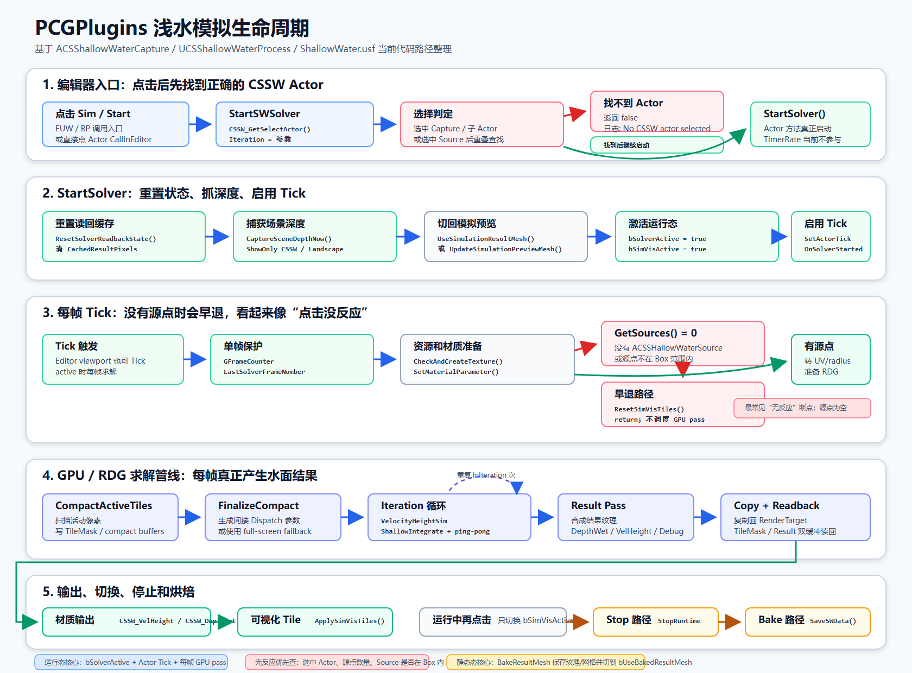
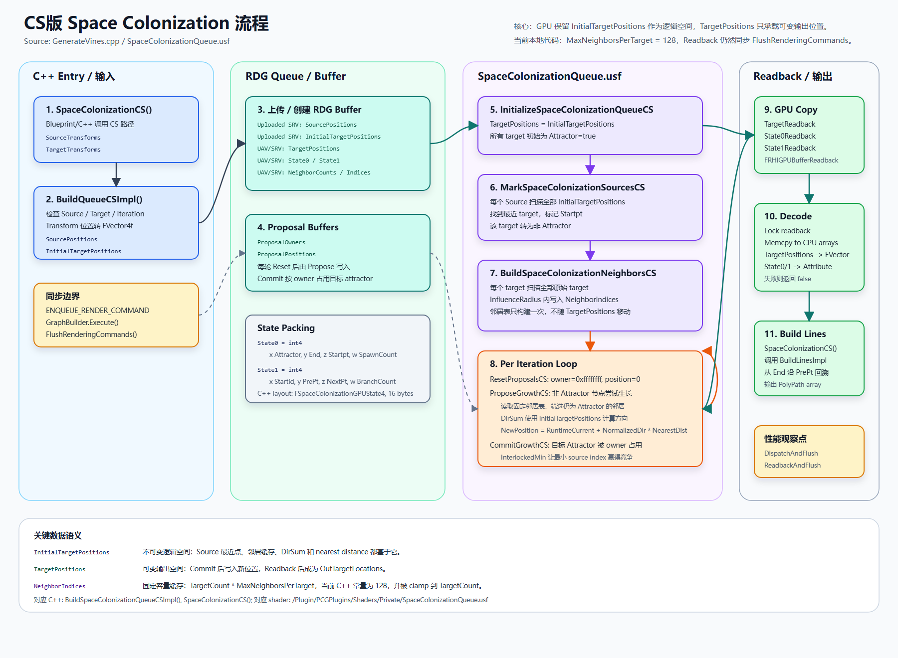
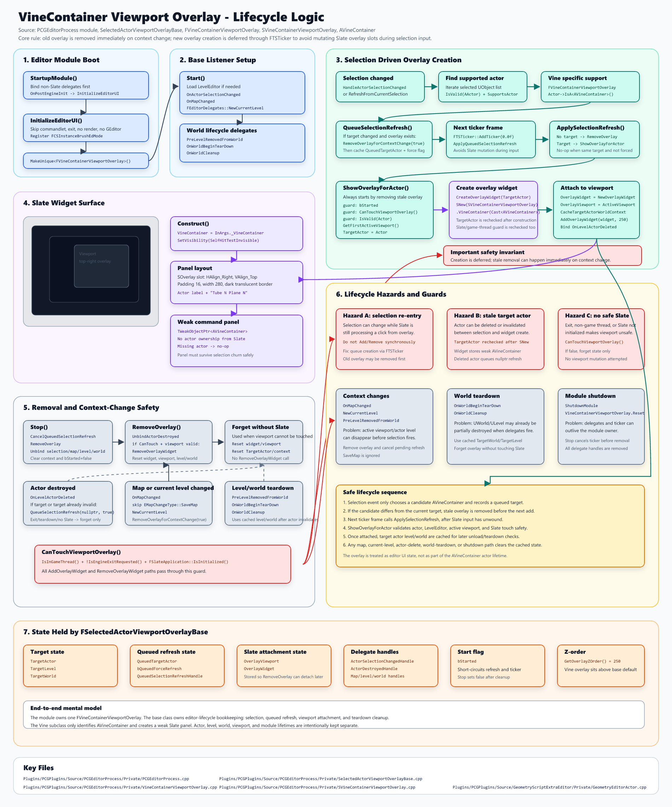
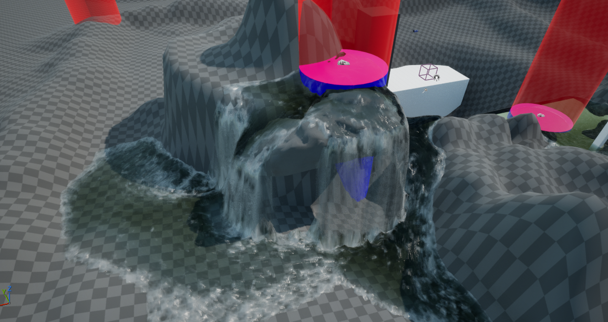
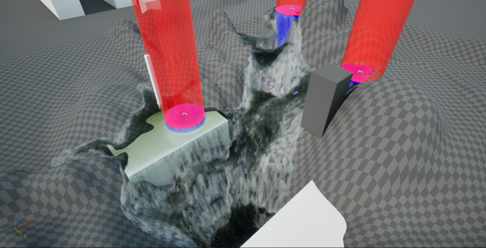
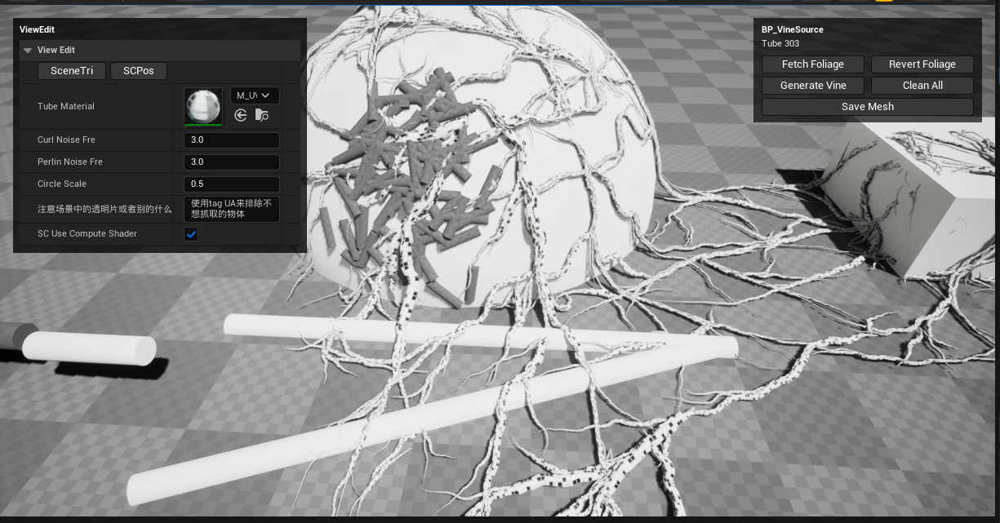

# PCGPlugins

面向 **Unreal Engine 5.7** 的程序化内容生成（PCG）工具集。插件以 **GPU Compute Shader** 与 **Geometry Script** 为核心，提供 GPU 浅水模拟、藤蔓/空间竞争生长（Space Colonization）、体素网格生成、Landscape 与 Foliage 编辑等一系列关卡制作与地形装饰工具。

> **状态**：研究 / 生产原型阶段。当前经过验证、可直接打开运行的测试内容见下方 [可运行的测试场景](#可运行的测试场景)；其余 `Content/` 目录为开发过程资产，未必可靠。

---

## 环境要求

| 项目 | 要求 |
|------|------|
| 引擎 | **Unreal Engine 5.7，源码编译版**（`Need ue5.7 build from source`） |
| 平台 | **Win64**（`ComputeShaderGenerator` / `PCGEditorProcess` 仅在 Win64 加载） |
| 依赖引擎插件 | GeometryProcessing、GeometryScripting、ModelingToolsEditorMode、EditorScriptingUtilities、Landmass |
| 第三方库 | OpenVDB、IntelTBB、Blosc、zlib、UVAtlas、DirectXMesh、ProxyLODMeshReduction（均由引擎自带 ThirdParty 提供，无需额外安装） |

之所以需要**源码编译的引擎**：多个模块直接链接引擎渲染层（`Renderer`/`RenderCore`/`RHI`）与 OpenVDB 等 ThirdParty，并使用自定义全局 Shader，Launcher 版引擎无法编译。

---

## 安装

1. 将本仓库放入工程的 `Plugins` 目录：
   ```text
   <YourProject>/Plugins/PCGPlugins/
   ```
2. 右键 `.uproject` → **Generate Visual Studio project files**。
3. 用源码编译的 UE 5.7 打开工程，让编辑器编译插件模块（首次会编译 Shader）。
4. 在 **Edit → Plugins** 中确认 `PCGPlugins` 已启用（默认 `EnabledByDefault`）。

> Shader 通过 `ShaderArchive: "PCGPlugins"` 注册，源码位于 [`Shaders/Private`](Shaders/Private)。

---

## 模块总览

`.uplugin` 注册了 5 个模块：

| 模块 | 类型 · 加载阶段 | 平台 | 职责 |
|------|----------------|------|------|
| **GeometryMath** | Runtime · Default | 全平台 | 底层数学库：通用数学工具与 Noise（Perlin/Curl 等），无编辑器依赖。 |
| **GeometryEditor** | Editor · Default | 全平台 | 编辑器几何编辑工具函数。 |
| **GeometryScriptExtraEditor** | Editor · Default | 全平台 | 扩展 Geometry Script 的蓝图节点库 + `AVineContainer` 藤蔓生成 Actor + Foliage 互转。 |
| **ComputeShaderGenerator** | Runtime · PostConfigInit | Win64 | GPU Compute Shader 核心：浅水模拟、体素/三角网格生成、CliffGenerate、MeshFill、场景捕获、GPU 骨架树、StaticMesh 点采样等。 |
| **PCGEditorProcess** | Editor · PostConfigInit | Win64 | 编辑器工具流程：浅水烘焙、Landscape 图层编辑、实例笔刷编辑模式、视口叠加 UI、Actor Tag 快捷操作等。 |

> 公共调试头位于 `Source/PCGPluginsShared`；`PCGPLUGINS_DEBUG` 宏在非 Shipping 配置下默认开启，可用环境变量 `PCGPLUGINS_DEBUG=0/1` 覆盖。

> 🧩 **GPU 网格产出统一**：MeshGenerator / Road / Vine 三条 GPU 三角形产出先向共享 `SceneProxy` 基类下沉、汇入同一处 readback / 存盘 → `UStaticMesh` 的数据流（[`Docs/GpuTriangleBuffer_Unification_Flow.svg`](Docs/GpuTriangleBuffer_Unification_Flow.svg)）；此后进一步对象化为「`UCSMesh` 网格对象 + `UCSMeshOps` 算子库 + `UCSMeshRenderComponent` 渲染组件」，见下方核心功能第 1 节。

---

## 核心功能

### 1. GPU 网格对象 · CSMesh（常驻网格 + 算子库 + 渲染组件）

`ComputeShaderGenerator` 里所有「GPU 上生成、GPU 上留着、只在存盘时才回 CPU」的网格都长在这一层上。它把引擎 `UDynamicMesh` 那套「数据对象 / 算子库 / 渲染组件」的分工原样搬到 GPU 侧：几何归一个可独立持有、可传递、可链式加工的 UObject 所有，渲染组件只负责画，算子只负责往常驻流里录 RDG pass。

| 引擎侧 | 本插件对应物 | 位置 |
|---|---|---|
| `FDynamicMesh3`（CPU 网格数据） | `FCSMeshResident`：描述符驱动的常驻 pooled buffer 集 | [`CSMesh.h`](Source/ComputeShaderGenerator/Public/CSMesh.h) |
| `UDynamicMesh`（UObject 容器） | `UCSMesh`（`BlueprintType`，持 `TSharedPtr<FCSMeshResident>`） | 同上 |
| `UGeometryScriptLibrary_*` | `UCSMeshOps`（静态算子库，Target 首参、返回 Target 链式） | [`CSMeshOps.h`](Source/ComputeShaderGenerator/Public/CSMeshOps.h) |
| `UDynamicMeshComponent` | `UCSMeshRenderComponent`（只绑定，不生成） | [`CSMeshRenderComponent.h`](Source/ComputeShaderGenerator/Public/CSMeshRenderComponent.h) |
| `UBaseDynamicMeshComponent` | `UCSGpuMeshComponent` + `FCSGpuMeshSceneProxy`（描述符驱动的渲染基座） | [`CSGpuMeshComponent.h`](Source/ComputeShaderGenerator/Public/CSGpuMeshComponent.h) |
| `UDynamicMeshPool` | `UCSMeshPool`（按显存而非对象数设上限） | [`CSMeshPool.h`](Source/ComputeShaderGenerator/Public/CSMeshPool.h) |
| `CopyMeshToStaticMesh` 等 sink | `UCSMeshOps::CopyToStaticMesh` → `CSStaticMeshAssetSink` | [`CSStaticMeshAssetSink.h`](Source/ComputeShaderGenerator/Public/CSStaticMeshAssetSink.h) |

> **明确不复刻**：`FDynamicMesh3` 式的拓扑编辑。GPU 上没有半边结构，`EditMesh(lambda)` 的逐元素随机访问无从迁移。对应物是「算子 = 一段写入常驻流的 RDG pass 序列」，链式语义与变更事件照搬。
>
> 名字相邻但语义无关：数据资产 `UCSMeshAsset`（`ComputeShaderSceneCapture.h`，MeshFill 家族）与本对象没有关系。

#### 流布局：描述符驱动

一份网格就是一组 `FCSGpuStreamDesc`。基座按描述符做分配、顶点工厂绑定和回读，**加一条 buffer 只是在叶子的 `RegisterStreams()` 里多一次 `AddStream(...)`**，alloc / VF-bind / readback / 存盘代码一行不动。

| 维度 | 取值 |
|---|---|
| `ECSGpuStreamRole` | `Position` / `TangentBasis` / `TexCoord` / `Color` / `Index` / `IndirectArgs` / `MeshCounters` / `AuxVertex` |
| `ECSGpuCountSource` | `PerVertex` / `PerIndex` / `PerTriangle`（= `IndexCapacity / 3`，逐面数据用） / `Fixed` |
| `ECSGpuMeshSemantic` | 回读时填 `FCSGpuMeshCPUData` 的哪个成员：`Position` / `TangentBasis` / `TexCoord` / `Index` / `Color` / `MaterialId` / `None` |

- `AddStandardTriangleStreams()` 注册标准三角集（渲染基座用的 7 条 + 一条逐三角材质 id）；`FCSMeshStreamLayout` 在其上追加额外流，并声明 UV 组数（`NumTexCoordSets`，房子墙那种「UV0 贴图 + UV1 传解析场」是加宽同一条交错流而非新增一条）与 indirect arg 组数。
- 一条流由 `(Role, SlotIndex)` 寻址，重复的 pair 会被拒绝而不是静默遮蔽。`ResizeStreamsSync` 只改已声明的 `Fixed` 流，且**尺寸精确、内容清零**——尺寸随活计数变的流是按那个计数寻址的，幸存的字节会停在不再表示原意的偏移上。
- **容量是显式的**，这一点和 CPU 网格根本不同：buffer 定长，真实计数由 GPU 写在 `MeshCounters` 流里，CPU 侧只知道上限。

#### 三条写入通道，没有第四条

| 入口 | `EKind` | 谁拥有 RDG 图 | 游戏线程阻塞 | 用在哪 |
|---|---|---|---|---|
| `UCSMesh::EditMeshSync` | `OwnedGraph` | 自建自执行 | **是**（flush 即栅栏） | 绝大多数算子、编辑器 / 离线路径 |
| `UCSMesh::EditMeshAsync` | `OwnedGraphAsync` | 自建自执行 | **否**（`OnComplete` 才是栅栏） | 交互式生成（藤蔓 `GenerateVineGPU`，耗时见下节基线） |
| `FCSMeshRenderThreadEdit` | `BorrowedGraph` | 借调用方的图 | —（本就在渲染线程） | 渲染线程逐帧 pass（实例剔除等） |

三条共用同一套「注册常驻流 → 跑算子 → 恢复每条流的最终访问状态」。**恢复访问状态正是这一层存在的理由**：流被 RDG 留在默认 epilogue 状态（`SRVMask`）上做索引 / 间接绘制是非法的，症状是「某个算子跑完组件就不画了」，几乎无法回溯到原因。借图那条要立刻取变换（`UseExternalAccessMode`），因为读这些流的 pass 就在同一张图的后面——epilogue 的变换会晚于它们，等于永不发生。

异步通道的代价写在契约里：`EditFunc` 是**被移入拥有**的（`TFunction`），它读到的一切也必须归它所有——同步版靠 flush 兜住的「指向调用方栈的裸指针」在这里就是 use-after-free；计数要等完成回调才对游戏线程可见。同一时刻只允许一个异步编辑在飞（`IsEditInFlight()`），第二次直接被拒。

#### 两个代数

- `Generation` —— 每次编辑完成 +1，消费者据此判断自己的缓存视图是否过期。
- `AllocationGeneration` —— 只在 buffer **换了身份**（分配 / 扩容 / 释放 / 改流布局）时 +1。只借用 buffer 的消费者可以忽略内容变更，但必须在这个数动时重新绑定，否则会继续从已经释放的 buffer 上画。同一次变动会**丢弃 section 表**：表描述的 arg 组已被重置，留着它只会画出垃圾或什么都不画，而这两种症状都不会把人指回那张过期的表。

#### 算子库 `UCSMeshOps`

全部同步（这是本子系统的既有契约：flush 栅栏是游戏线程敢往渲染线程递裸指针的前提）。首参恒为 `Target` 并原样返回，蓝图里可以直接串起来。

| 分类 | 节点 |
|---|---|
| Create | `AllocateGpuMesh` |
| Copy | `CopyFromStaticMesh`（按 LOD / 变换 / 翻绕序上传，可带入材质槽）、`CopyToStaticMesh`、`CopyToDynamicMesh` |
| Scene | `AppendBoxSceneTriangles`（世界盒取景，直接写常驻流）、`MakeGeneratorBoxSceneOptions` |
| Boolean | `ApplyMeshBoolean`、`ApplyMeshArrangement`（只做 Stage A：消互穿，不做内外删除） |
| Repair | `WeldVertices`（纯 GPU 重写索引；**故意不合并属性**，以保住 UV / 法线接缝） |
| Transform | `TransformMesh`、`TranslateMesh` |
| Normals | `FlipNormals` |
| Colors | `SetVertexColors`、`PaintVertexColorsSphere`（`Replace` / `Add` / `Max` / `Erase` 四种混合） |
| Sections | `BuildMaterialSections`（GPU 直方图 → 前缀和 → 按材质重排三角） |
| Bounds | `ComputeWorldBoundsSync` |

仅 C++（未反射的类型进不了蓝图）：`PaintVertexColorsSphereInRegion`（局部脏区重绘）、`DisplaceGroundShapers`（Tiny Glade 地形塑形物）、`CopyFromMeshSnapshot`，以及供其它翻译单元复用的 `AddXxxPasses` 系列 pass 录制器。Shader 落在 [`Shaders/Private/CSMeshOps.usf`](Shaders/Private/CSMeshOps.usf)。

**唯一的 CPU 例外**：`ApplyMeshBoolean` 在 `VertexWeldDistance > 0` 时仍走 CPU 快照路——焊接后处理要去掉重复三角，在 GPU 上复现需要全局哈希表。其余分支全程不回 CPU。

#### 容量、显存与「交互路径零阻塞」纪律

- `EnsureCapacitySync` 只涨不缩，扩容时把已有内容拷过去；**被显存预检拒绝时整个请求作废，不做截断**——截断出来的不是「小一点的网格」，而是「尾巴被某个算子悄悄剪掉的网格」，能降级的调用方需要知道自己必须降级。
- `ShrinkCapacitySync` 是它的反面：道路和藤蔓反复重建，只涨不缩会让 buffer 一路棘轮到本次会话的历史最大值。`ShrinkSlackRatio`（默认 0.5，即「分配超出需求 1.5 倍才缩」）是滞回带，避免尺寸来回抖的网格每次重建都重分配 + 拷贝。计数只有 GPU 知道时，`bAllowCounterReadback` 决定是付一次两 uint 回读还是拒绝收缩——**绝不按猜测截断**。
- 每次分配前过 [`CSGpuMemoryBudget`](Source/ComputeShaderGenerator/Public/CSGpuMemoryBudget.h) 预检（`bCheckGpuMemoryBudget` / `GpuMemoryBudgetSafetyRatio`，默认吃可用显存的 70%）。D3D12 下走 DXGI 实时预算（含其它进程占用），其余 RHI 按 RHI 跟踪量推算；峰值按「本次请求 + 已有分配」算，因为重分配期间两套 buffer 同时在。查不到显存不构成拒绝理由（记日志放行）。
- `UCSMeshPool` 的存在理由和 CPU 版**相反**：`UDynamicMeshPool` 归还即清空、清空即释放内存，省的是 UObject；这里**存储才是贵的**，归还的网格保留分配，命中即省掉一次显存分配。所以上限按显存卡（`MaxCachedVideoMemoryRatio` 默认 0.25、`MaxCachedBytesOverride`）而不是按对象数。
- `UCSMesh::GetBlockingFlushCount()` / `CountedBlockingFlush()`：本层每一次 `FlushRenderingCommands` 都记数，让「交互热路径不许有设备同步」这条纪律**可断言**——快照计数，画一笔 / 重算 N 栋房子，增量必须为 0。任何新的阻塞点都必须走 `CountedBlockingFlush`；绕过去等于把这条纪律唯一的自动化防线关掉（曾经就漏过：塑形物 / 石阶的 pooled buffer 分配各自裸调 `FlushRenderingCommands`，那条路上的阻塞对断言完全隐形）。

#### 画：`UCSMeshRenderComponent`

`SetGpuMesh()` 绑一个 `UCSMesh` 就画它，自己不生成任何东西，并订阅 `OnMeshChanged` 以跟上后续算子。与自持 buffer 的叶子相比，差别是承重的：**渲染状态重建从「重跑一遍生成 compute」变成「重新绑定一次」**，而且存盘不再要求有东西正在渲染它。

- 常驻数据是**世界空间**，组件以绝对变换渲染——挪动组件不会挪动几何。三条随之而来、每一条错了都无声的后果，见 [`RoadMeshComponent.h`](Source/PCGEditorProcess/Public/RoadMeshComponent.h) 的类注释。
- 网格带 section 表时逐 section 出一个 `FMeshBatch`，各吃自己的 `DrawIndexedIndirect` arg 组——材质排序已让同材质三角连续，拆分全在 args 里，共用同一条索引 buffer；没有 section 表就是整网格一个 batch 用 `MeshMaterial` 画（不经过 section builder 的网格的既有行为，逐位不变）。
- `GetUsedMaterials` 报的是**所有** batch 材质：漏报一个 section 材质，引擎就不会为它准备 shader、纹理流送与编辑器用途查询。
- `HasGeneratedGeometry()` 问的是网格对象而不是 scene proxy——从「重建 = 重绑」那一刻起，「有没有 proxy」就不再是几何存在的证据了。
- `SaveToStaticMesh(BakeSpace, ...)` 把当前几何烘回调用方给定的局部空间存成资产（`bEnableNanite` 必须在构建前给定，建完再改只标脏、不会真的产出 Nanite 数据）。生产方若把 `UCSMesh` 存在自己身上（如 `AComputeShaderMeshGenerator::DirectGpuMesh`），要显式传 `SourceMeshOverride`——解绑只该让它不显示，不该让生产方连自己的几何都存不出来。

#### 出：回读与落盘

- `CSMeshReadback::ReadCountersSync` / `ReadbackResidentSync` 作用在 `FCSMeshResident` 上而非 scene proxy 上，所以**没在渲染的网格也能存**；proxy 只是常驻集的一种来源（`FCSGpuMeshSceneProxy::BuildResidentView`）。
- `ReadUintBufferSync` 是诊断 / 验收专用的「任意 uint buffer 回读」通路，专门对付「CPU 断言全绿、画面是错的」那类**陈旧 GPU 计数器**。`FinalAccessRole` 决定读完把 buffer 放回哪个访问状态——不放回去，下一帧的剔除 pass / 间接绘制会在错误状态上撞见它。
- 落盘统一走 [`CSStaticMeshAssetSink`](Source/ComputeShaderGenerator/Public/CSStaticMeshAssetSink.h) 的四步：`ResolveTarget`（只读探测：清洗路径、校验、建目录、看同名资产能否复用）→ 调用方构建 `FMeshDescription` → `PrepareMesh`（破坏性）→ `PopulateFromDescription` → `Finalize`（注册 + 标脏 + 可选写盘）。分四步是为了让破坏性操作**晚于**可能失败的几何构建；同名资产**就地重建**、保留同一个 UObject，引用自动跟上，而不是 `DeleteAsset`（那会打断所有已有引用，且只要还有人在内存里引用它就直接失败）。
- 法线口径：常驻流用 `cross(B-A, C-A)`，与 UE StaticMesh / `FDynamicMesh3` **差一个负号**（引擎那边取的是反向叉积，左手系）。这个差别是真实且承重的，不能「统一掉」；边界上的显式转换是 `bReverseOrientation`。所有「从三角形推法线」的代码都从 `CSMeshBuild::ResidentFaceNormal` 取——写反了不报错，只会让整块网格朝里。

#### GPU 实例化叶子 · `UCSGpuInstancedMeshComponent`

同一基座上的另一条叶子：基础网格一次性上传进 GPU 流，之后**只有逐实例数据在变**，剔除、LOD 选择与绘制在 GPU 上闭环。

- 三种实例源：CPU `FTransform` 数组（`AddInstance` / `AddInstances` / `UpdateInstanceTransform` / `SetInstances` / `RemoveInstance` / `ClearInstances`）；GPU 打包实例 buffer（`FCSGpuInstanceSourceGPU`，5 × float4 / 实例，活计数在 `Counter[0]`，从不回 CPU）；GPU 点集（`FCSGpuInstancePointSourceGPU`，位置 + 法线，proxy 在每次剔除前自己拼实例行——`ACSPointBrushActor` 就是这么在不回读的前提下驱动显示的）。
- 最多 4 级 LOD（`CS_GPU_INSTANCED_MAX_LODS`）共用一条顶点 / 索引 buffer，每级一个 indirect arg 组，由 `FCSGpuInstancedLODRange` 寻址。`bGpuFrustumCulling` / `bGpuLODSelection` / `InstancesPerCluster`（默认 64）/ `LODScreenSizeScale` / `InstanceEndCullDistance` 控制簇剔除与 LOD 切换。
- `FCSGpuInstancedGpuLayout` 在游戏线程派生一次后整份拷进 proxy，而不是两边各推一遍：`MaxInstancesPerLod` 是可见实例 buffer 里一个 LOD 区段的**步长**，两边算出不同的数会把幸存实例压到区段之外——那是设备错误或静默垃圾，不是任何人能追溯的报错。
- `DebugReadDrawnInstanceCountSync()` / `DebugGetDrawnAssetMismatchSync()` 是 Development-only 的验收口子，读的是 GPU 上真正被 indirect draw 消费的那份计数。
- Shader：[`Shaders/Private/CSGpuInstancedMesh.usf`](Shaders/Private/CSGpuInstancedMesh.usf)。

#### 谁在用

| 消费者 | 持有的网格对象 | 画它的组件 |
|---|---|---|
| `AComputeShaderMeshGenerator` | `DirectGpuMesh`（常驻场景三角汤）、`DebugDisplayMesh`（体素方向箭头） | `DirectMeshRenderComponent` / `DisplayComponent` |
| `ACSLandscapeRoad` | 道路网格 | `URoadMeshComponent`（派生自 `UCSMeshRenderComponent`） |
| `AVineContainer` | `VineGeometry` | `VineGpuMesh` |
| `ACSHouseActor` | `PillarMesh` | `UCSMeshRenderComponent` |
| `ACSGroundActor` | `RockShellMesh` | 同上 |
| `ACSTinyGlade` | `TinyGladeMesh` | 同上 |
| `ACSPointBrushActor` | `PointArrowMesh`（点箭头调试几何） | 同上 |
| `UCSGpuInstancedMeshComponent` | `InstancedGpuMesh`（基础网格 + 逐实例流） | 自身 |

- 📖 设计与落地计划：[`Docs/GpuTriangleUnified_Plan.md`](Docs/GpuTriangleUnified_Plan.md)；架构图 [`Docs/GpuTriangleUnified_Architecture.svg`](Docs/GpuTriangleUnified_Architecture.svg)、数据流 [`Docs/GpuTriangleBuffer_Unification_Flow.svg`](Docs/GpuTriangleBuffer_Unification_Flow.svg)
- 🧪 自动化测试（`Source/ComputeShaderGenerator/Private/Tests/`）：`CSGpuMeshObjectTests`（对象 / 编辑 / 桥接口径）、`CSGpuInstancedMeshTests`、`CSGpuMemoryBudgetTests`、`CSDirectMeshSaveTests`、`CSMeshBooleanParityTests`

### 2. GPU 浅水模拟 · Shallow Water

基于一系列 GPU Compute Shader Pass 的实时浅水/水流模拟，采用**两层稀疏调度**（AABB + Compact Tile）只处理含活跃水体的区域，显著降低满纹理调度开销。核心 Actor 为 `ACSShallowWaterCapture`（可在编辑器视口中实时 Tick），配套 `UCSShallowWaterProcess` 蓝图库负责保存/烘焙/调试（`SaveSWData`、`StartSWSolver`/`StopSWSolver`、`DebugDumpSWPassResults` 等）。

- Shader：[`Shaders/Private/ShallowWater.usf`](Shaders/Private/ShallowWater.usf)
- C++：`ComputeShaderShallowWater.cpp` / `CSShallowWaterProcess.cpp`
- 📖 **架构详解见** [`README-SW.md`](README-SW.md)（Pass 流水线、线程重映射、Compact Tile 调度、缓冲区管理与优化方向）

[](Docs/shallow-water-lifecycle.svg)

### 3. 藤蔓生成 · Space Colonization

`AVineContainer`（`GeometryEditorActor.h`）以 **空间竞争生长（Space Colonization）** 算法为核心，从「源点 + 生长目标体」出发生成攀爬藤蔓网格：

```text
AVineContainer.GenerateVines()
  ├─ 构建 Bounds / 体素输入
  ├─ Space Colonization  → SpaceColonizationQueue.usf（GPU 队列求解）
  ├─ 生成 TubeLines
  └─ 藤蔓可视化 / 网格化  → VineVisualization.usf
```

- 参数：`FSpaceColonizationOptions`（Iteration、VoxelSize、InfluenceRadius、Fork Taper 等）、`FVV`（噪声/重采样/线宽等可视化参数）
- Shader：`SpaceColonizationQueue.usf`、`VineVisualization.usf`、`Connectivity.usf`、`SparseTileDispatch.ush`
- 编辑器交互：选中藤蔓 Actor 后由视口叠加 UI（`VineContainerViewportOverlay`）触发 `GenerateVineAction()`
- 📖 GPU 算法流程详见 [`Docs/VisVineGPU_AlgorithmFlow.svg`](Docs/VisVineGPU_AlgorithmFlow.svg)（CPU 仅做线条平滑重采样，表面投射 / CurlNoise / PerlinNoise / 切线重建统一在 GPU 完成）；Voxel 数据流见 [`Docs/VisVineGPU_Pipeline.svg`](Docs/VisVineGPU_Pipeline.svg)

| 空间竞争 GPU 求解 | 视口叠加交互逻辑 |
|---|---|
| [](Docs/SpaceColonizationCS.svg) | [](Docs/VineContainerViewportOverlayLogic.svg) |

### 4. Geometry Script 扩展节点库

`GeometryScriptExtraEditor` 提供大量可在 Geometry Script / 蓝图中调用的静态节点，主要类别：

- **网格生成**（`GeometryGenerate`）：`VDBMeshFromActors`、`SurfaceVoxelsToVDBMesh`、`VoxelMergeMeshs`、`CSTriangle*ToDynamicMesh`、`FixUnclosedBoundary` 等（含 OpenVDB 体素化）
- **网格属性/工具**（`GeometryGeneral`）：法线（`CreateVertexNormals`/`BlurVertexNormals`）、UV/颜色属性转移、焊接、距离场查询、树木风场数据、`SaveDynamicMeshToStaticMesh` 等
- **VDB 扩展**（`VDBExtra`）：`ParticlesToVDBMesh`、Mesh↔VDB 转换
- **曲线/PolyPath**（`PolyLine` / `PointFunction`）：`SmoothLine`、按数量/长度重采样、`ConvertPolyPathToTransforms`、弧长/CurveU、最近点迭代
- **Landscape**（`LandscapeExtra`）：投影平面、地形数据采样与纹理数据生成
- **Foliage 互转**（`FoliageConverter`）：Foliage 实例 ↔ Transform 数组、增删改查实例、自定义数据、距离排序

### 5. GPU 地形编辑 · Landscape Edit Layer

`ACSLandscape` 通过 UE 5.7 的程序化 Landscape Edit Layer 接入地形高度图合并管线。每个 Actor 自动维护一个 `UCSLandscapeEditLayer`，编辑结果先在 GPU 上以 RDG Compute Pass 生成并参与 Landscape 合并，可实时预览、调整或移除；只有调用 `BakeLandscape()` 时才会将当前结果永久写入基础高度图并删除对应 Edit Layer。

地形编辑区域由 Actor 的 `Box` 决定，支持旋转后的局部坐标映射和边缘衰减。实时编辑可选择以下高度来源：

| `SourceMode` | 输入 | 用途 |
|---|---|---|
| `ExternalRT` | `ExternalHeightRT` 或 `SetExternalHeightRT()` | 接收蓝图、模拟器或其他 GPU 工具生成的高度 RenderTarget。 |
| `FlatOffset` | `HeightOffset` | 在框选区域内整体抬高或降低地形。 |
| `ProceduralNoise` | `NoiseFrequency`、`NoiseAmplitude`、`NoiseOctaves` | 在世界空间生成多层程序噪声地形。 |

- `BlendMode` 支持 `Alpha`、`Override`、`Additive`、`Subtract`、`Multiply`；`LayerAlpha` 控制本次 GPU 混合强度，`EditLayerAlpha` 控制 Landscape 图层整体权重。
- `FalloffWidth` 以厘米定义 `Box` 边缘的过渡宽度；移动 Actor 或修改参数后会请求 Landscape 重新合并，也可在蓝图中调用 `RefreshLayer()`。
- `CopyLandscapeData()` 捕获框选区域的现有地形并发布为可持久化的 Edit Layer 结果；`RT_Result`、`RT_RealtimeResult` 和 `RT_DebugView` 可用于结果或调试检查。
- `ApplyHeightmapRTToLandscape()` 提供统一的“高度 RT → 地形”入口，供其他 GPU 生成器复用。

`ACSLandscapeRoad` 是道路专用扩展：它收集自身及附属 Actor 的 Spline，在 `RoadBuilder.usf` 的 GPU Pass 中构建道路和交叉口网格，再将三角形栅格化到 `RT_RoadHeight` 并驱动同一套 Landscape Edit Layer。`RoadInfluence`、`RoadHeightOffset` 和 `RoadEdgeFalloff` 分别控制贴合强度、道路相对高度和路肩过渡宽度，`RebuildRoad()` 可在编辑器或蓝图中重建结果。

- Shader：[`Shaders/Private/CSLandscape.usf`](Shaders/Private/CSLandscape.usf)、[`Shaders/Private/RoadBuilder.usf`](Shaders/Private/RoadBuilder.usf)
- C++：`CSLandscapeEditLayerBase.*`、`ComputeShaderLandscape.*`、`ComputeShaderLandscapeRoad.*`
- 开发测试内容：`Content/Landscape/`（包括 Copy、River 与 RoadLandscape 相关资产；仍属于原型内容）

### 6. 编辑器工具 · PCGEditorProcess

笔刷编辑模式（`CSBrushEdModeBase` 基类，派生出实例笔刷 `CSInstanceBrushEdMode` 与点笔刷 `CSPointBrushEdMode`）、资产处理（`CSAssetProcess`）、Actor Tag 快捷操作、选中 Actor 的视口叠加基类等。

### 🖌️ PointBrush · 绘制点 → GPU 可直读 buffer

放置 `ACSPointBrushActor`，点 `Start Point Brush` 进入笔刷模式：拖拽只累积预览点（`DrawDebugPoint`），松开鼠标才提交；`Esc` 取消并退出。

- **两份表示，一个 owner**：`PaintedPoints`（`UPROPERTY`，随关卡存盘）是 CPU 真值；`GetPointBuffers()` 是由它重建的 GPU 镜像 —— float4 位置 / float4 法线 / 2-uint 计数器（`[0]` = 有效点数）。消费者 `RegisterExternalBuffer` 后按计数器间接派发，点和数量都不回 CPU。
- **显示**：走共享的 GPU debug draw（`UCSDisplayComponent` + `FCSGpuDebugPooledSource`），每点一个点图元加一条可选法线线，全部由 compute pass 从上述 buffer 直接生成。
- **生命周期**：pooled 引用只有该 Actor 持有，在重建 / `Release Point Buffer` / `EndPlay` / 删除 Actor / GC（关关卡、关引擎）时于渲染线程释放。

---

## 可运行的测试场景

以下两个测试场景经过验证，**测试文件可用**，是了解插件功能的最佳入口。

### 🌊 CSSW · GPU 浅水模拟

> **📍 测试关卡**：[`Content/ShallowWater/VelocityHeight/L_VelocityHeight.umap`](Content/ShallowWater/VelocityHeight)

| 溪流漫流 | 多水源侵蚀地形 |
|:---:|:---:|
|  |  |

- **示例蓝图**：`BP_CSSW_Capture`（捕获/求解器）、`BP_CSSW_Source`（水源，即截图中的粉色圆盘）、`BP_CSSW_Flux30` / `BP_CSSW_Flux30_CloseBound`（水流示例，即红色圆柱）
- **运行方式**：打开关卡 → 选中 `BP_CSSW_Capture` 实例 → 编辑器视口中即会实时模拟（Actor 在 Viewport-only 下也 Tick）。可在 `SWParameter` 分类下调 `Iteration`、`DT`、`Friction`、`WorldPixelSize` 等参数；`RT_*` 为各阶段调试 RenderTarget。

### 🌿 VineGenerator · 藤蔓 / 空间竞争生长

> **📍 测试关卡**：[`Content/SpaceColonization/L_TestWorld.umap`](Content/SpaceColonization)（关卡内已放置 `AVineContainer` 藤蔓 Actor）



- **配套资产**：`SMF_*_FoliageType`（Tube/Plane/Target 三类 FoliageType）、`Mesh/`（Tube/Plane/Target 源网格）、`Material/`（藤蔓/调试材质）
- **运行方式**：打开关卡 → 选中场景中的藤蔓 Actor → 设置 `GrowTarget`（生长目标实例）与源实例 → 调整视口叠加面板中的 `SC` / `VV` 参数（`Curl Noise Fre`、`Perlin Noise Fre`、`Circle Scale` 等）→ 通过视口叠加按钮（`Fetch Foliage` → `Generate Vine` → `Save Mesh`）或调用 `GenerateVineAction()` 生成藤蔓；`Save Mesh` / `SaveStaticmesh()` 可将结果烘焙为 StaticMesh。
- **管线形态**：全程 GPU 常驻。表面体素（位置/法线/目标点场）由 `PrepareBoxSceneSurfaceVoxelsGPU` 建好后不回读；空间竞争的生长状态留在显存；藤蔓网格归 `AVineContainer` 自己持有的 `UCSMesh`（`VineGeometry`）所有，由 `VineGpuMesh`（`UCSMeshRenderComponent`）直接从 GPU 流绘制，不再经 `UDynamicMesh`——渲染状态重建因此只是重新绑定，不会重跑一遍生成。
- **仅剩的 CPU 回读**（一处）：`Save Mesh` 时对渲染流的一次性读取。SC 之后那次 4-uint 线段计数回读已随合图去掉，buffer 尺寸改由 CPU 侧容量决定、dispatch 规模改由 GPU 计数经 `VineDispatchArgsCS` 换算。
- **详细状态与剩余计划**：[`Docs/VineGpuResidency.md`](Docs/VineGpuResidency.md)

#### 生成耗时基线

`GenerateVineGPU()` 走 [`UCSMesh::EditMeshAsync`](Source/ComputeShaderGenerator/Public/CSMesh.h)：录完 RDG 图就返回，**游戏线程不等渲染线程**。所以耗时要分两个数看，别再当成一个。

`L_TestWorld` / `BP_VineSource`，980 个 `GrowTarget`、2 个 `TubeVineSource`，`SC.Iteration=55`、`SC.VoxelSize=5`、`VV.VisVineGPUTubeSegments=3`、`VV.VisVineGPUNoiseIterations=10`，交互编辑器 Development：

| 段 | 稳态耗时 | 线程 | 说明 |
| --- | --- | --- | --- |
| `GenerateVineGPU.PrepareSurfaceVoxelInputs` | 10–12 ms | game | 占游戏线程耗时的绝大部分 |
| `SpaceColonization.PrepareInputs` | 0.05 ms | game | 只递交输入，求解在 GPU |
| **`GenerateVineGPU.Total`** | **12.4–14.6 ms** | game | **卡顿只有这么多**；返回即表示"已递交"，不表示已建好 |
| `VisVineGPUTiming tube buildLeaf(wallclock)` | 305–311 ms | render | 图在渲染线程跑完的墙钟，**不阻塞游戏线程** |
| 被 in-flight 挡下的重复请求 | 0.002 ms | game | 上一次未完成时直接拒，不做 CPU 准备 |

- 改异步前，同一台机器同一关卡的冷启动生成是 `Total: 691.8 ms`（其中 `buildLeaf` 675.8 ms 全是阻塞等待）。**游戏线程卡顿降低约 98%**，渲染线程总工作量不变。
- 完成回调稳定落在下一帧（f0→f1、f83→f84、f170→f171）。
- 产物在所有生成间完全一致：`Vertices=593880 Indices=3563280`，可直接当回归判据。
- 开 `r.RDG.ImmediateMode 1` 复验：干净、无 TDR、顶点数一致。**改动藤蔓 RDG 图后必须过这一关**——普通模式下依赖边丢失不报错。
- ⚠️ `buildLeaf(wallclock)` 混着"图本身的量"和"当时渲染线程有多堵"，交互编辑器里天生抖（实测同一进程内出现过 164 ms 与 553 ms 的尖峰）。要 GPU 侧真实耗时请用 `stat gpu` 或 Unreal Insights 抓 `VineMesh.Build`。
- 复现脚本：`Saved/CodexTests/measure_vine_after_move.py`（环境变量 `VINE_RDG_IMMEDIATE=1` 切立即模式）。注意异步之后**连续生成必须隔帧**——完成回调要游戏线程 tick 才会跑，`-ExecutePythonScript` 里连着调第二次会被 in-flight 挡下。

#### CPU 版本耗时预估（对照）

> ⚠️ **这一节是估算，不是实测。** 仓库里已经没有可跑的 CPU 藤蔓路径了，下面的数是「历史 CPU 实现的调用次数 × 单次成本」算出来的。单次成本大部分实测（见下表标注），少数只能估。**当量级参考，别当基准数据引用。**

**可参照的历史 CPU 实现**（都能从 git 取回，是估算里调用次数的依据）：

| 实现 | 位置 | 表面投影方式 | 状态 |
| --- | --- | --- | --- |
| CPU 空间竞争 `BuildSpaceColonizationQueueImpl` | `git show e941364^:Source/GeometryScriptExtraEditor/Private/GeometryEditorActor.cpp` | 不涉及 | 删于 `e941364`；带 `bMultThread` / `ProcessAsync` 并行分支 |
| CPU 线预处理 `PrepareVVLinesProjected` | `git show b12e1c2^:Source/GeometryScriptExtraEditor/Private/GeometryEditorActor.cpp` | 体素哈希（与 GPU 同算法） | 删于 `b12e1c2`，删时已零调用 |
| 更早的 BVH 版 `AVineContainer::VisVine` | `git show e2f16bc:...`（旧历史分支，非当前 main 祖先） | `FDynamicMeshAABBTree3` 最近三角 | 只作上界参考 |

GPU 版本是照着这些实现做的逐条对齐移植（shader 注释里的 “matching the CPU sequential commit loop”、“Mirrors PopulateSpaceColonizationAssociatesFromNeighbors”），所以算法和产物形状一致，可以按同一份工作量对比。

**工作量**（三角数为测试场景实测；其余由上面同一次生成的产物反推）：

```text
拾取三角       ≈ 1 000 000                          # BuildBoxSceneTriangleRequests 收进来的场景三角
表面体素       ≈ 1 090 000                          # VoxelSize=5，模型值，见下方说明
路径点数 P     = 593880 / ProfileCount(3) = 197960   # 也 = 2 源 × 980 target × (SC_MAX_BACKTRACK+1)
段数           = 3563280 / (3 × 6)        = 197960
输出三角       = 3563280 / 3              = 1187760
SC 规模        = 980 target × 2 源 × 55 迭代，MaxNeighbors = 128
```

体素数没有日志可查——GPU 常驻路径下真实数只在 `Counter[0]` 里，不回 CPU。这里的 109 万是把 `TriangleSurfaceVoxelsCS` 的体素化规则原样转写、在 100 万三角的合成表面上跑出来的**模型值**。它决定投影走下表哪一档（72 MB 那档，已超出本机 30 MB L3），是估算里对三角数最敏感的一环。

**单次成本**（本机 i7-13700KF，MSVC `/O2`，单线程，[`Docs/VineCpuCostBench.cpp`](Docs/VineCpuCostBench.cpp)）：

| 原语 | 成本 | 来源 |
| --- | --- | --- |
| 表面体素化（100 万三角 @ `VoxelSize=5`） | **547 ns/三角 → 合计 548 ms** | 实测转写 |
| `UNoise::CurlNoise`（= 5 × `PerlinNoise3D`，样本同格） | **154.4 ns** | 实测 |
| `FMath::PerlinNoise3D`（散点） | **65.0 ns** | 实测 |
| 体素哈希投影 8 角（体素表 1.1 / 4.5 / 18.1 / 72.2 MB） | 72.6 / 99.4 / 124.3 / **165.0 ns** | 实测 |
| BVH 最近三角（100 万三角，65.7 MB） | **1411 ns**；建树 **240 ms** | 实测下界 |
| `UCurveLinearColor::GetUnadjustedLinearColorValue` | 80–200 ns | 估（4 条 `FRichCurve`） |
| `FDynamicMesh3` 追加带属性三角 | 150–400 ns | 估 |

BVH 那一行标「下界」：基准里用的是节点 32 字节、叶子 4 三角的紧凑数组 BVH，比 UE 的 `FDynamicMeshAABBTree3` 更贴 cache——UE 那边节点更胖、要过 `FDynamicMesh3` 的间接层，Geometry Script 封装每次查询还多走一次 `ProcessMesh`。

**分段估算**（单线程，调用次数按终态 P 计）：

| 段 | 主要调用 | 估算 | 随三角数伸缩 |
| --- | --- | --- | --- |
| 三角收集 / 解析 | `BuildBoxSceneTriangleRequests` + `ResolveStaticMeshTriangleRequests` | 10–12 ms（实测，两条路都要） | 是 |
| 表面体素化 | 100 万三角 × 547 ns | **0.55 s** | **是** |
| 空间竞争求解 | 邻居表 2×980²，生长循环 55×980×2 源×≤128 邻居扫描 | 0.08–0.20 s | 否 |
| 噪声 + 投影（10 轮） | CurlNoise ×2 177 560、Perlin ×1 979 600、投影 ×1 979 600、曲线求值 ×1 979 600，外加每轮 `ResamppleByLength` + `ClonePolyPath` 全量重建 | **1.00–1.29 s** | 间接（体素表大小） |
| 合并 + 最终投影 + 平滑 + 帧 | 投影 ×395 920、15.8 万点排序、4 遍重采样/平滑、逐点 `MakeFromXZ` | 0.16–0.24 s | 间接 |
| 网格生成 | `AppendSweepPolygon` → `FDynamicMesh3`（594K 顶点 / 119 万三角）→ 整份拷进容器网格 → `UDynamicMeshComponent` 渲染缓冲重建 | **0.6–1.6 s** | 否 |
| **合计** | | **约 2.4–3.9 s** | |

体素化逐三角天然并行，线与线之间也独立，噪声/投影段按线 `ParallelFor` 可以接近线性扩展；网格段的合并与渲染缓冲重建基本串行。按 16 线程理想估：**约 0.6–1.4 s**。

**对照结论**：

| 口径 | GPU（实测） | CPU 体素投影版（估算） | 倍数 |
| --- | --- | --- | --- |
| 游戏线程卡顿 | **12.4–14.6 ms** | 2.4–3.9 s（单线程） | **165–315×** |
| 游戏线程卡顿 | **12.4–14.6 ms** | 0.6–1.4 s（16 线程理想） | **40–115×** |
| 端到端（到网格可见） | 691.8 ms（改异步前同步实测） | 2.4–3.9 s（单线程） | 3.5–5.6× |
| 端到端（到网格可见） | 691.8 ms（改异步前同步实测） | 0.6–1.4 s（16 线程理想） | 0.9–2.0× |

- **100 万三角把体素化推成了独立大头。** 它在 GPU 版本里是融合图里的一个 pass，在 CPU 版本里是实打实的 0.55 s（单线程，占总量一到两成），而且是唯一严格随三角数线性伸缩的一段——场景几何翻倍它就翻倍。次级效应同样来自这个数：109 万体素的哈希表约 72 MB，超出本机 30 MB L3，逐次投影从 1.1 MB 表的 72.6 ns 涨到 165.0 ns，光噪声段就多出约 180 ms。
- **GPU 的赢面不在吞吐倍数。** 把 CPU 版本认真并行化之后，端到端总时间和 GPU 同步版本仍是同一量级（0.9–2.0×）。真正的差距在两处：一是**落点**——GPU 版本只在游戏线程花 12–14 ms，其余全在渲染线程，编辑器里可以拖参数条实时看；CPU 版本整段压在游戏线程上，编辑器直接卡死 2–4 秒。二是**网格落地**——CPU 必须建 `FDynamicMesh3` 再重建渲染缓冲（估 0.6–1.6 s，占单线程总量两到四成），GPU 版本直接写 `UCSGpuMeshComponent` 的常驻 stream，这一段整体消失。
- **BVH 版没有可比性。** 它不需要体素化，但全流程 12 次投影 × 197 960 点 = 237 万次最近三角查询，按 100 万三角实测的 1411 ns 算就是 **3.35 s**，加建树 0.24 s 和其余各段，**下界约 5–6.5 s**；算上 UE 那层封装（更胖的节点、`FDynamicMesh3` 间接、每次查询一遍 `ProcessMesh`）实际估 **8–13 s**，是 GPU 游戏线程耗时的 550–1050 倍。历史上真实卡的就是这一版。
- **误差来源**：曲线求值、`FDynamicMesh3` 追加与渲染缓冲重建这两项没有实测常量；体素数是模型值不是实测值；SC 求解按操作计数粗估。这四项是区间宽的主要原因。另外调用次数按终态点数计，而 CPU 版本每轮噪声后都重采样、前几轮点数更少，所以噪声段偏保守（估高）。UE Development 配置比独立基准多一层容器/边界检查开销，实际只会更慢。
- **想要真数**：把上表里的 CPU 实现接回去，再走 `measure_vine_after_move.py` 那套计时；体素数可以临时在 `AddCSSurfaceVoxelPasses` 后加一次 `Counter[0]` 回读打出来。

> 其它目录（如 `Content/ShallowWater/Material30`、`Content/TreeWindData`、`Content/GeneralTest` 等）为开发中/参考资产，不保证可直接运行。

---

## 目录结构

```
PCGPlugins/
├─ PCGPlugins.uplugin        # 插件描述文件（5 个模块）
├─ README.md                 # 本文件
├─ README-SW.md              # 浅水模拟架构详解
├─ VoxelTest.hip             # Houdini 参考文件
├─ Config/
│  └─ DefaultPCGPlugins.ini  # CoreRedirects（旧 TAToolsPlugin/GeometryScriptExtra 重定向）
├─ Docs/                     # 算法/管线流程图（SVG + 预览 PNG + 设计笔记）
│  └─ TinyGlade/             # Tiny Glade 复刻的全部文档，入口 Docs/TinyGlade/index.md
├─ Scripts/                  # 演示关卡搭建 / 出图 / 无头回归脚本（Python）
├─ Shaders/Private/          # GPU 全局着色器（.usf/.ush）
├─ Source/
│  ├─ GeometryMath/              # Runtime 数学库
│  ├─ GeometryEditor/            # Editor 几何编辑
│  ├─ GeometryScriptExtraEditor/ # Editor 几何脚本节点 + 藤蔓
│  ├─ ComputeShaderGenerator/    # Runtime GPU 计算（Win64）
│  ├─ PCGEditorProcess/          # Editor 工具流程（Win64）
│  └─ PCGPluginsShared/          # 公共调试头
└─ Content/
   ├─ ShallowWater/VelocityHeight/  # ✅ 浅水测试场景
   ├─ SpaceColonization/            # ✅ 藤蔓测试场景
   ├─ ShallowWater/Material30/      # 水面材质（参考）
   ├─ TreeWindData/                 # 树木风场数据（参考）
   └─ Landscape/ MeshFill/ GPUTree/ ...  # 其它开发测试内容
```

---

## 备注

- 所有 Editor 模块在 `Shipping` 配置下被列入 `BlacklistTargets`，本插件面向**编辑器 / 开发**用途。
- `Config/DefaultPCGPlugins.ini` 中的 CoreRedirects 兼容了历史命名（`TAToolsPlugin` → `PCGPlugins`、`GeometryScriptExtra` → `GeometryScriptExtraEditor` 等），从旧版本工程迁移的资产可自动重指向。
