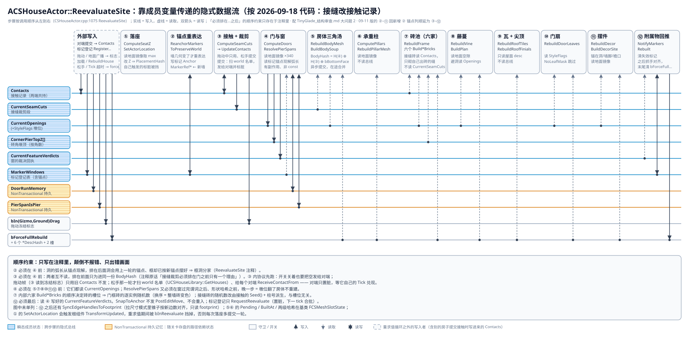
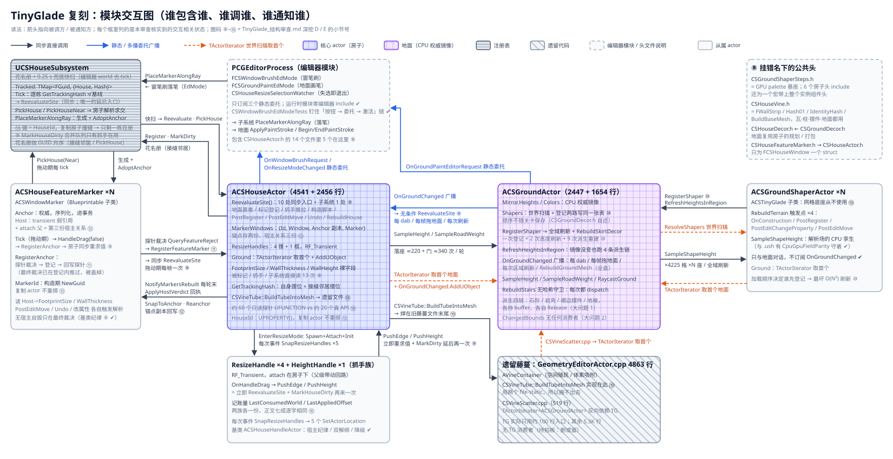
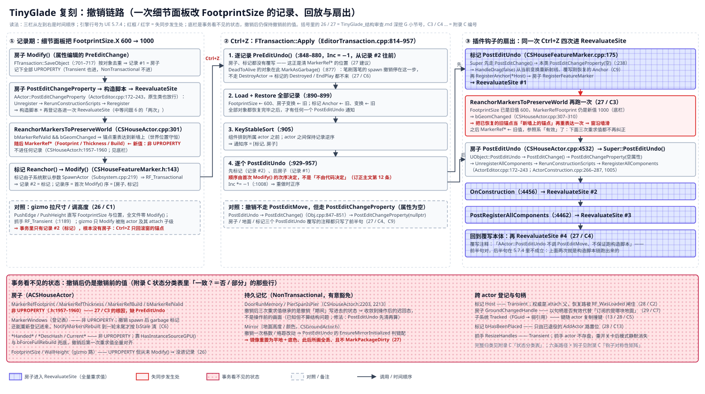

# Tiny Glade 复刻：结构审查

对 `ACSGroundActor` / `ACSHouseActor` / `UCSHouseSubsystem` 一族（[`Docs/TinyGlade/`](Docs/TinyGlade/index.md) 所记的 D1–D14）做一次整体结构审查。只谈结构性问题，不收集单点 bug；单点缺陷只在它能证明某个结构性问题时才列出。

- **2026-09-11 复核**：对照当日工作区重核全部 30 条。基准是插件仓库 HEAD `4820ca3`，加上未提交的 43 个源文件（+2599 / −1427 行），内容包括基类网格槽与实例族清单、房子自 Tick 合批、交接收敛、共享布局头、组件自放显存、实例组件 Nanite 路。五个只读子代理分组核查，主审查抽查了推翻原结论与新发现的关键引文。逐条现状见「复核总览（2026-09-11）」，新发现编为 31–38。各条开头的「**现状（09-11）**」段用复核时刻的行号；原句里的旧行号保留不改，仍按函数名定位。
- 审查基准：2026-09-06 14:50 前后的工作区，含尚未提交的改动（`git diff --stat -- Source`：32 个文件，+7997 / −1446）。源码在审查期间仍在被修改，行号按读取时刻记录，引用以函数名为主，行号在 ±30 内自行核对。
- 三条深挖：A「实例化产物管线」与 B「重求值数据流与哈希覆盖」已完成，结论并入对应小节；C「墙体 / 剖面契约 / 矩形假设」当日中断，2026-09-07 由子代理 A 补完并并入大问题 3、4（完整报告见附录 A）。
- 深挖 D「模块交互」与 E「冗余代码」于同日晚些时候完成，见「模块交互」「冗余代码」两节。其基准工作区已再变动（`CSHouseActor.cpp` 4541 行、`.h` 2456 行；`CSHousePillar` / `CSGroundDecor` / `CSVineTube` 三对文件已在），那两节的行号以该时刻为准。
- 2026-09-07 用三个只读子代理并行复核与扩面：B「GPU 基座与打包契约」已完成，主审查抽查关键证据后并入「GPU 基座与打包契约（深挖 F）」一节，完整报告存 [`Docs/TinyGlade/TinyGlade_结构审查_附录B_GPU基座.md`](Docs/TinyGlade/TinyGlade_结构审查_附录B_GPU基座.md)；它推翻了中等问题 6 的半句、把冗余代码 17 的计数从 6 改成 9。A「深挖 C 补完」已完成并并入大问题 3、4 与「已知但不算结构问题」——推翻「三重叠」、订正矩形计数与 `CSHouse_SillMinZ`、升级接缝矩形专用为已核实，新增拱曲线三种定义、圆窗两套口径、迟回记忆不随 Undo 回滚三条发现，完整报告存 [`Docs/TinyGlade/TinyGlade_结构审查_附录A_墙体剖面.md`](Docs/TinyGlade/TinyGlade_结构审查_附录A_墙体剖面.md)；C「生命周期与持久化」同日完成，主审查逐条抽查 C1–C13 的插件侧引文与 C1 / C2 / C3 / C4 / C5 / C6 / C8 的引擎侧引文后并入「生命周期与持久化（深挖 G）」一节（26–30）——推翻第 12 条「`PostEditUndo` 先后不由代码决定」半句、把中等问题 6 扩到「撤销是三次」、给第 13 条补引擎先例、给迟回记忆条补 `Mirror` 对应条，并把附录里四条「推测」升级为已核实；完整报告存 [`Docs/TinyGlade/TinyGlade_结构审查_附录C_生命周期.md`](Docs/TinyGlade/TinyGlade_结构审查_附录C_生命周期.md)。
- 标注：**已核实** = 读到源码原文（含 UE 5.7.4 引擎源码）；**推测** = 由已核实事实推演、未跑过用例。

## 结论

- **09-11 复核**：30 条里 2 条已修（21、22），6 条部分修（1、15、23、24、25、29），3 条换了形态（9、11、19），19 条原样成立。GPU 基座的契约层四条已修三条半；编排层与生命周期的结论几乎原样成立。另订正原结论 24 处，多为计数与引文；其中推翻缺陷判断的有三处：标记其实有 `PostEditChangeProperty`，砖层容量并非固定 512，C13 的首次松手降级在常规拖动里不会发生。新增 8 条（31–38）。审查之后有 5 条用户裁决，改写了第 2、9、29、34 条的建议与建议顺序，见复核总览。
- 底层架构站得住：CPU 权威镜像 → 声明式重求值 → 哈希守卫 → GPU 常驻，这条链的方向正确。纯函数层（`CSHouseProfile.h` / `CSHouseSeam.h` / `CSHouseQuoin.h` / `CSHouseTrim.h` / `CSHouseRoof.h` / `CSHouseResize.h` / `CSHouseDoorRuns.h`）质量高、有单测。
- 结构性问题集中在**编排层**：两个 actor 把十几条产物管线的状态机全部手写在自己身上，产物之间靠成员变量与注释约定的顺序传递数据，哈希输入靠手工枚举。本审查发现的绝大多数缺陷都由这一层产出，而且同一类缺陷会反复出现。
- 与 Tiny Glade 模型差异最大、也最贵的一条是矩形 footprint；其次是墙体两套表示并存而终局未定。这两条是方向问题，需要拍板而不是重构。
- 模块之间的交互（深挖 D）与编排层同病：四类客户端用三种策略同步叫醒房子（09-10 起地面 / 标记改为只标脏，但执行面变成了四种，见 34）、地面一次登记触发九次派生重建、标记的回执被自己的探针盖掉（09-11 已换形态，见 11）、身份 GUID 随复制撞键——都是「协议只写在注释里」的产物。冗余（深挖 E）几乎没有字面复制，全是同构不同文：抓手两族、九份哈希收尾、健康检查链、约 60 个只读探针。
- 生命周期（深挖 G）与前两者同源：状态该归权威 / 派生 / 持久记忆 / 拖动期临时哪一类，头注释写得很清楚；「谁负责让它回到一致」却没有落到代码——权威量的写入者不 `Modify()`、参照系与登记表不进事务、三道闸门判「来历」不判「状态」、解绑与释放在三个销毁钩子里各做一部分（显存 09-11 已改为各放各的，解绑仍分散）。六条生命周期路径只有两条有测试，09-11 仍是如此。

| 层 | 现状 | 评价 |
| --- | --- | --- |
| 纯函数层（剖面 / 接缝 / 角石 / 包边 / 屋面 / 拉尺寸 / 门段） | header-inline 纯函数，36 条逻辑单测（其中 5 条建世界 spawn actor） | 好，保持；但拱曲线在三个消费者里有三种定义、`Circle` 竖向两套口径（大问题 4 深挖 C 补充 1、2） |
| GPU 基座（`UCSMesh` / `UCSGpuInstancedMeshComponent` / `CSShaperSteps`） | 描述符驱动、异步编辑、计数阻塞刷新；09-10 起有共享布局头与 Nanite 路（资产开了 Nanite 就自动走 GPU-Scene） | 机制层好。契约层四条已修三条半：21 清零并看交接结果、22 暂存发布、23 共享布局头，24 只在诊断回读出声；剩原子槽位泄漏到烘焙产物、经典路交接必阻塞（24）。buffer 设施五份同构体（大问题 1）；新缺口见 33、35 |
| 编排层（`ACSHouseActor` / `ACSGroundActor`） | 约 10.9K 行、257 个可编辑属性、8 条实例化产物家族（含柱砖）+ 5 条 `UCSMesh` 产物（房体 / 盒柱 / 藤管 / 地面 / 岩壳）；网格槽簿记、实例族清单、显存回收已上提到基类 `ACSTinyGlade` | **主要问题所在**（大问题 1、2，中等问题 6；新增 31、32、34） |
| 数据模型（footprint / 洞 / 墙） | 矩形四边硬编码；墙 = 面板 + clip，砖层半成品（09-11 代码零变化） | **方向待拍板**（大问题 3、4） |
| 通知与注册（`UCSHouseSubsystem` / `OnGroundChanged` / 标记登记） | 地面 / 标记只标脏，由房子自己的 Tick 合批（09-10）；另有同步入口 7 处、子系统 `DirtyHouses`（抓手）、0.25 s 快扫、读时补票 48 处 | 可用。地面 N 倍放大已收成每帧每栋一次；但四种执行面并存，快扫基线只由子系统回写，邻居落座改出的新 Z 只靠 0.25 s 快扫传过来（34）。登记链重复重建、GUID 复制撞键仍在（10、13）；标记回执换了形态（11） |
| 生命周期（事务 / 存读 / 复制 / PIE / 卸载） | 状态四类在头注释里分得清；`RF_WasLoaded` / `bHasBeenPlaced` / `FDelegateHandle` 三处以来历或句柄代状态 | 拉尺寸不进事务、撤销顺序确定但 `MarkerRef*` 不回滚、一次 Ctrl+Z 三次同步重求值（26–28）；显存改为组件自放 + actor 在 `EndPlay` / `Destroyed` 放生产者缓冲（29 部分修）；样条块在 PIE / 打包里没有网格（37）；六条路径只测两条（30） |
| 模块边界（include 方向 / 公共头归属 / 遗留耦合） | 地面反向依赖房子四处；三个公共头挂在一侧名下，其中 `CSGroundShaperSteps.h` 又接下了交接状态机；藤管入口焊在 4.9K 行旧文件里 | 拆模块前先搬头（8、19）；非编辑器构建今天链接不过（38） |
| 测试与回归 | 纯函数单测 + 5 条建世界单测 + 需真 RHI 的 Python 回归（13 处零阻塞断言，单帧跑完）；两套判据都不全绿（09-11：C++ 3 条、演示回归 27 条既有失败，其中 2 条是 33 的假红） | 编排层只有合批一条（`House.MarkerDragBatchesRebuilds`）；砖层开着拖尺寸 / 墙高 / `LiftHeight` / 地被 / Undo / 销毁没有零阻塞断言；09-10 起的修复（21、22、A2、F4 / D1 / D2、组件自放）都没有测试钉住；五条生命周期路径零断言（30） |

## 复核总览（2026-09-11）

状态分四种：**已修**；**部分修**；**换形态** = 问题还在，但形态变了；**成立** = 原样成立。正文每条开头有同名的「现状（09-11）」段，给当前引文。

| 条 | 现状 | 一句话 |
| --- | --- | --- |
| 1 实例化产物管线 | 部分修 | 交接判据与动作已收成一份（`CSShaperSteps::HandOverInstanceSources` / `EHandoverResult`），其余五类样板仍逐家手写；实为 9 家（原文漏数柱砖）；门框砖仍漏 `ReserveCount` |
| 2 隐式数据流与哈希覆盖 | 成立 | 顺序与约束原样；已核实的哈希缺口 15 → 12 条（F4 / D1 / D2 已修），新增 31；A2 已修，A1 仍在 |
| 3 矩形 footprint | 成立 | 代码零变化；计数改为带模式的 35 行 / 13 文件与 72 行 / 14 文件 |
| 4 墙体两套表示 | 成立 | 窗台砖第四段与 `CSHouse_SillMinZ` 已删，窗台盒只剩字面量 `0.5f`；「容量 512」原结论有误 |
| 5 变换契约 | 成立 | 编辑钩子仍不钉 pitch / roll / scale；交接盒已统一映射，算缓解 |
| 6 一次改动两次重求值 | 成立 | 改属性 2 次、gizmo 松手 2 次、抓手 2 次、撤销 3 次，全部同步 |
| 7 模块边界与仓库卫生 | 成立 | 模块未拆；工程根 PLY 缓存已清，其余原样 |
| 8 依赖方向 | 成立 | 四个头原样；`CSGroundShaperSteps.h` 又接下交接状态机，「只为一个宏」的前提失效 |
| 9 唤醒协议 | 换形态 | 建议被 09-10 裁决否决，改为房子自 Tick 合批；地面 / 标记只标脏，抓手仍付两次；执行面变成四种，见 34 |
| 10 地面登记链 | 成立 | 一次登记 2 次刷新 + 9 次派生，原样；改参订正为 3 次刷新 + 12 次派生 |
| 11 标记回执 | 换形态 | 最终裁决总在探针之后，画面问题消失；松手回位与 `LastAcceptedAnchor` 仍按探针判 |
| 12 锚点与宿主多份 | 成立 | 各份存储原样；撤销时窗滑的机制挪进了房子自己那轮重求值 |
| 13 GUID 复制撞键 | 成立 | 零改动；补一条：`HouseId` 还是砖抖动的种子 |
| 14 诊断面契约 | 成立 | 三种哨兵、陈旧窗判据原样；`GetGpuMesh()` 判据在 Nanite 路下假红，见 33 |
| 15 字面重复 | 部分修 | 烘焙出口已并入基类，剩 3 段 |
| 16 抓手两族 | 成立 | 两个文件自 09-06 未动 |
| 17 哈希九份 | 成立 | 份数不变；石阶那对其实有对照测试（订正）；同步锚点注释的行号已漂 |
| 18 诊断链与探针面 | 成立 | 按全量口径，只被 Python 引用的探针 42 个、零引用 8 个 |
| 19 基类与旧藤蔓 | 换形态 | 基类已承担网格槽、实例族清单、显存回收、`OnConstruction`；旧藤蔓 5.8K 行原样 |
| 20 Python 脚本 | 成立 | 零共享模块，同名 helper 只增不减 |
| 21 扩容不清零 | 已修 | `GrowTo` 三条 buffer 分配即清零，早退门改看 `EHandoverResult`；无测试 |
| 22 异步编辑无栅栏 | 已修 | 异步通道先暂存，完成回调在游戏线程发布；无测试 |
| 23 布局契约 | 部分修 | `CSGpuSharedLayout.ush` 收掉行 stride 等常量；逐家记录 stride、BGRA 字节序仍两侧手写 |
| 24 原子槽位 / 阻塞 | 部分修 | 超容量只在诊断回读出声；绘制序、烘焙三角序、经典路交接必阻塞仍在 |
| 25 释放模型 / 包围盒 | 部分修 | 注释已改写、组件自放、交接盒统一；残留两处字段注释，网格身份仍不进哈希 |
| 26 权威量写入不进事务 | 成立 | 零改动 |
| 27 撤销链 | 成立 | 房子仍 3 次同步重求值、仍无 `PreEditUndo`；地面的下游已合批 |
| 28 来历代替状态 | 成立 | 三道闸原样；C13 主症状订正为只剩一次性 `PostEditMove(true)` 入口 |
| 29 跨 actor 登记与释放 | 部分修 | 显存改为各放各的（房子 2 / 3）；句柄订阅、解绑分散、静态委托无守卫仍在 |
| 30 生命周期测试 | 成立 | 2 / 6 |

### 审查之后的用户裁决

- 2026-09-10：房屋合批由房子自己的 tick 兑现，**不经** `UCSHouseSubsystem`，至多一帧延迟可以接受。这否决了第 9 条「子系统单点执行」。[`Docs/FrameQuotaScheduler_Plan.md`](Docs/FrameQuotaScheduler_Plan.md) 落地顺序第 2 步（房屋只标脏、子系统每帧限量执行）与此冲突，实施前先定哪一方让步。
- 2026-09-10：窗周围不走任何砖头补全。`FPath::bSill` / `SillLen`、`CSHouse_SillMinZ` 与 `CSHouseFrame.usf` 第四段整条删除，砖路恒为三段（单测改名 `House.FrameSkipsWindows`）。
- 2026-09-10：实例组件的基础网格资产开了 Nanite，就自动走 GPU-Scene 路，不暴露开关。
- 2026-09-11：删除时显存各放各的。实例组件与渲染组件在 `OnComponentDestroyed` 里放自己那份；actor 只在 `EndPlay` / `Destroyed` 放自己分配的生产者缓冲（`ReleaseInstancedBuffers`）。这取代了第 29 条「一个 `Teardown()` 统一放 GPU」那一半。
- 2026-09-11：本帧标脏、下一帧重建，不存在先后关系。被动唤醒一律只标脏；重建一律推到下一帧，不在标脏的同一帧兑现。不做中央待办表，也不排先后。挂点由此定为下一帧。同日早些时候的版本要求「标脏那一刻把别人要读的便宜 CPU 输入写定」，并把塑形物 → 地面的高度镜像重算、房子落座 Z 列为违例；这条要求随本裁决撤销，两处不再算违例。落地要做的事见 9、34。

### 09-11 二轮上提候选（只读审计，未做）

09-11 另做了一轮「还有什么能收进基类」的只读审计，候选如下，已排进建议顺序第 2、3 步，做不做待拍板：

- ① 编辑钩子兜底 + 首建进基类。已被「本帧只标脏、稍后统一算」的方向取代（9 的建议）。
- ② 主网格槽状态归基类：房子的 `BodySlot` 与基类的组件 / 网格合到一处；地面拖动改走 `ApplyMeshSlotPlacement`（36）。
- ③ 外观绑定：基类在每个编辑事件末尾调虚函数 `BindAppearance()`；实例组件加「变了才刷」的 `SetInstanceMaterial`，替掉 11 处 `Ensure*` 直写 `InstanceMaterial`（即大问题 2 说的「材质直写不刷」）。这是「只标脏」的前置。
- ④ 小件：`FlushPending` 空虚钩子；烘焙自检 helper（15 剩下的第一段）。

### 原结论订正

以下是复核中确认写错或少算的地方，均已在正文原位改掉：

- 大问题 1「8 份」实为 9 份：漏数了柱砖 `EnsurePillarBrickComponent`（`CSGroundShaperSteps.h` 自己的注释写的就是「九处」）。
- 大问题 2 的步骤表漏了 ① 与 ② 之间的 `ReanchorMarkersToPreserveWorld`（它写 `MarkerWindows[].Anchor`、标记 `Anchor` 与 `MarkerRef*`）。
- 大问题 2「标记没有 `PostEditChangeProperty`」错：自 `109b28d` 起就有（`CSHouseFeatureMarker.cpp:238–249`）。改 `Width` / `Height` / `Shape` 会经 `HandleDrag(false)` 重新登记，走的是 27 C9 那条路。
- 大问题 3「约 94 行」「现在是 47 处」都复现不出，已改为带模式的计数。
- 大问题 4「默认容量 512 < 一栋房 1000+ 块」错：砖层开着时 `EffectiveFrameCapacity()` = `Clamp(Authored + GetBrickWallBrickBudget(), 64, 65536)`，审查基线已是如此。「③ 只服务门拱」不精确：`SplitEdge` 对任何洞都算剪切。
- 第 7、20 条的「`TinyGladeShotStairsWhere1` 到 `7`」「八个」：实为 `StairsWhere.py` 加 `2`–`7`，共 7 个。第 7 条「单地面 3 处取第一个」实为 2 处：`CSVineScatter.cpp` 取的是包含探针点的第一块；另漏计 `ResolveShapers` 不过滤归属。
- 第 8 条「摆件 1」是一行注释，不是调用；`CSVineTube.h` 并不 include `CSHouseVine.h`。
- 第 10 条：细节面板改塑形物一个参数 = 3 次 `RebuildTerrain`（原文漏了 `PostRegisterAllComponents` 那次）= 3 次区域刷新 + 12 次派生重建。
- 第 12 条 `Window.CenterS`「无人读」：锚点无效时，`BuildWindowOpenings` 会回退读它。
- 第 17 条：石阶那对 CPU / GPU 哈希一直有测试钉住（`GroundStairs.JitterIsCellDeterministic` / `PebblesAreCellDeterministic`）。「`CSHouseDecor.cpp` 同时调两份 `IdentityHash`」错，另一份只出现在注释里。
- 第 18 条：`EffectiveFrameCapacity` 不是零引用（房子内部 8 处调用）；健康检查链「17 / 4」的口径复现不出。
- 第 21 条「柱的退化记录 `return` 不写行」错：柱 kernel 只有越界 `return`。
- 第 27 条「三个类的 `PostEditUndo` 注释」实为房子、地面两个。
- 第 28 条 C13 主症状不成立：`bHasBeenPlaced` 在任意一次 `PostEditMove`（含 `false`）都会置位；gizmo 拖动先发 `PostEditMove(false)`，所以真松手时已经置位。
- 第 29 条：`ActiveHouses` 的残留绑定只活到下一次选择变化，因为 `EvaluateSelection` 末尾也调 `UpdateSelectionBinding`。
- 深挖 G 引言「`bRunConstructionScriptOnDrag` 默认真」只对 `UBlueprint` 的同名开关成立。`AActor` 那一位默认假，原生 TG 类拖动帧不重跑构造脚本。
- 「已知但不算结构问题」一节说回归「只用 `Windows` 属性表」，错：自 `109b28d` 起回归就有标记段（笔刷落窗、两份并存、拖动、删除）。只用 `Windows` 的只有 `TinyGladeShotWindow.py`。

## 审查范围与量化

TG 相关源码（`CSHouse*` / `CSGround*` / `CSTinyGlade*`）全部位于 `Source/ComputeShaderGenerator/`。09-11 按 `.h` / `.cpp` 全行数（含空行）计：不含测试 23.6K 行，另有 8 个 TG 测试文件 8.7K 行；模块合计 78.1K 行。审查基准的「30.2K / 72.8K」没有留下口径，两组数不直接相减。

| 文件 | 行数（09-06 → 09-11） | 说明 |
| --- | --- | --- |
| `Public/CSHouseActor.h` + `Private/CSHouseActor.cpp` | 2274 + 4217 → 2538 + 4247 | 房屋编排层，`EditAnywhere` 142 → 157 |
| `Public/CSGroundActor.h` + `Private/CSGroundActor.cpp` | 1648 + 2447 → 1745 + 2321 | 地面编排层，`EditAnywhere` 93 → 100 |
| `Public/CSTinyGlade.h` + `Private/CSTinyGlade.cpp` | 119 → 274 + 292 | 基类；网格槽、实例族清单、显存回收、`OnConstruction` 已上提到这里 |
| `Public/CSHouseProfile.h` | 1019 → 1009 | 洞剖面 / 裁剪场 / 谓词 / 边框架，header-only |
| `CSHouseSeam.h` / `Quoin.h` / `Trim.h` / `Roof.h` / `Resize.h` / `DoorRuns.h` / `BrickWall.h` | 353 / 139 / 192 / 195 / 72 / 257 / 130（未变） | 纯函数层 |
| `CSHouseFrame` / `Vine` / `Tile` / `Decor` / `Pillar`（h + cpp） | 972 / 988 / 626 / 735 / — → 997 / 1117 / 626 / 735 / 258 | 实例化产物的记录生成与 GPU 打包 |
| `CSGroundRockShell` / `Stairs` / `Cover`（h + cpp） | 1288 / 502 / 506 → 1433 / 514 / 611 | 地面派生产物 |
| `CSGroundShaperSteps`（h + cpp） | — → 604 | GPU palette 基座；09-10 起兼作交接状态机（8） |
| `CSHouseFeatureMarker` / `HandleActor` / `Subsystem` / `GroundShaperActor`（h + cpp） | 653 / 265 / 278 / 380 → 954 / 283 / 375 / 379 | 标记、抓手基类、注册表、塑形物 |
| `Private/Tests/CSHouseLogicTests.cpp` | 4209 → 4610 | 36 条单测，其中 5 条建世界 spawn actor；TG 自动化测试合计 85 条（运行时模块 81 + 编辑器模块 4） |
| `Shaders/Private/CSHouse*.usf` + `CSGround*.usf/.ush` | 2203 → 2588 | 8 个 kernel + 1 个 `.ush`；另有共享布局头 `CSGpuSharedLayout.ush`（23） |

| 指标 | 09-06 | 09-11 | 出处 |
| --- | --- | --- | --- |
| `Ensure*` / `Rebuild*` 函数 | 房子 13、地面 11；实例化 `Ensure*` 每个 88–172 行 | 房子 14、地面 11；实例化 `Ensure*` 53–176 行（交接段已并入 `CSShaperSteps`） | 大问题 1 |
| 房子头文件里的缓存 / 哈希 / 交接 / BuiltFrom 字段 | 44 个 | 按名字含 `Hash` / `Handed` / `Handover` / `BuiltFrom` / `BuiltAt` / `Pending` / `Ready` / `Snapshot` 计：`c7db336` 33 个 → 今 21 个 + 2 个 `FCSMeshSlotState`（状态原子没减，只是装进了结构体） | `CSHouseActor.h` 私有段 |
| 把 footprint 当矩形的代码行 | 同模式 35 行 / 13 文件；扩展口径「约 94 行」 | 同模式 35 行 / 13 文件（其中 2 行是注释误报，实为 33）；扩展口径 72 行 / 14 文件 | 大问题 3 |
| 单地面假设 | 3 处 | 2 处取首个 + 1 处取包含探针点的首个；另 `ResolveShapers` 不过滤归属 | 7 |
| 哈希守卫缺口 | 已核实 15 + 推测 3 + 提交侧 2 | 已核实 12 + 新增 1（31）+ 推测 3 + 提交侧 1 | 大问题 2 |
| 拷贝间现存不一致（深挖 A） | 12 条 | 摆件 Pop 撤源、石阶 / 地被盒量化已修，其余仍在（见大问题 1 现状） | 大问题 1 |
| Python 脚本 | 72 个，`TinyGladeShot*` 41 个 | 78 个，`TinyGladeShot*` 43 个 | `Scripts/` |
| 回归零阻塞断言 | 13 处（26 次 `get_blocking_flush_count`） | 13 处（28 次） | `Scripts/TinyGladeDemoRegression.py` |
| `ReevaluateSite` 入口 | 房子自身 10 处同步 + 子系统 tick 1 处 | 同步 7 处（房子 6 + 基类 `OnConstruction` 1）+ 子系统 1 + 合批兑现 1（`FlushPendingReevaluate`：房子 Tick 与 48 个读入口）；`RequestReevaluate` 3 处 | 9、34 |
| 房子被外部直接触碰的成员 | 17 个；三个裸字段被读 13 次 | 未变 | 8 |
| `CSHouseActor.h` 的包含者 | 14 个文件（5 个在编辑器模块） | 未变 | 8 |
| 字面重复（扫描器口径） | C++ 4 段 / 44 逻辑行；shader 0；Python 114 段 / 1987 逻辑行 | C++ 剩 3 段（未重跑扫描器） | 15、20 |
| 同一段哈希收尾的手抄份数 | 9 + 1 份死代码（另有一份同名不同算法） | 未变 | 17、25 |
| 组件健康检查链的复制 | 房子 17、地面 4 | 原口径复现不出；按 `IsRegistered` 链头计，`c7db336` 9 / 2 → 今 8 / 3 | 18 |
| 只被 Python 引用 / 零引用的 UFUNCTION | 24 / 7 | 全量口径（9 个 TG 头共 134 个 UFUNCTION）42 / 8 | 18 |
| 阻塞点 | 模块内 31 处全部经 `CountedBlockingFlush`（按 API 计）；盲区 2 处在引擎调用 | 按调用点计 51 处（37 处 `UCSMesh::CountedBlockingFlush` + `CSMesh.cpp` 内部 14 处）；裸 `FlushRenderingCommands` 1 处（模块卸载路径）；引擎盲区仍在 | 24 |
| packed 行 stride `5u` 的字面量 | 16 处（8 个 usf + 8 处 cpp） | 生产代码 0 处（改用 `CS_GPU_INSTANCED_ROW_FLOAT4S`），测试里 24 行 | 23 |
| 扩容后交接陈旧 / 垃圾行的早退门 | 4 家不看容量身份，只有瓦做对 | 0 家（改看 `EHandoverResult`） | 21 |
| `Modify()` 调用（`CSHouseActor.cpp`） | 0 处 | 0 处 | 26 |
| 一次 Ctrl+Z 的重建次数 | 房子 3 次全量重求值（墙上有标记时 4 次）；地面 2 次整张上传 + 2 次全场广播 + 4 条派生链；塑形物 3 次 `RebuildTerrain` | 房子 3 次同步（标记那次已改为只标脏）；地面同前，但下游每栋房合成 1 次延迟重求值；塑形物 3 次（推测，按代码推演） | 27 |
| 释放 GPU 缓冲的销毁钩子 | 地面 2 / 3（`EndPlay`、`Destroyed`）；房子 0 / 3 | 地面 2 / 3、房子 2 / 3（都经基类 `ReleaseInstancedBuffers`）；组件那份由组件 `OnComponentDestroyed` 自放 | 29 |
| 生命周期六条路径的测试覆盖 | 2 / 6（新建、`DestroyActor`） | 2 / 6，未变 | 30 |

## 大问题

### 1. 实例化产物管线：同一套状态机复制了 9 份

**现状（09-11）：部分修。** 交接那一段已经收成一份（未提交，`CSGroundShaperSteps.cpp:126–290`）：

- `CSShaperSteps::EnsureInstancedComponent(s)` 负责建组件（地被例外，仍手写 `NewObject`）；
- `WantsHandover` 判五条件；
- `HandOverInstanceSources` 负责交接与回写；
- `MergeHandoverBounds` 让包围盒只涨不缩；
- 结果以 `EHandoverResult` 返回。

仍逐家手写的有：材质直写、BuiltFrom / Ready 快照判据、`Num() != N` 三连（6 处）、BaseSphere / BlockSize / 容量上界 / 包围盒公式、早退门（5 处）、撤源序列（5 处）。

家数实为 9：原文写 8，漏数了柱砖 `EnsurePillarBrickComponent`。实例化 `Ensure*` 今 53–176 行；房子四家合计 621 → 509 行，地面三家 365 → 269 行。

**现象。** 房子里 Frame / PillarBrick / Vine / RoofTile / Decor，地面里 Stair(+Pebble) / SkirtDecor / Cover / RockShell，每一家都在 actor 上手写同一套「Ensure 组件 → 预留容量 → 交接实例源 → 哈希短路 → 打包 → 撤源清零」的状态机。共同骨架如下（**已核实**，深挖 A 的 12 步矩阵）；09-11 起，其中第一行（建组件）与后三行（包围盒合并、五条件判据、交接与回写）已由 `CSShaperSteps` 统一执行：

```cpp
// 八份 Ensure*Component 的共同骨架（伪代码；逐家写法见下表）
if (!IsValid(Component)) { Component = NewObject<UCSGpuInstancedMeshComponent>(this, NAME_None, RF_Transient); RegisterComponent(); }
Component->InstanceMaterial = Material;                        // 材质直写，不经哈希
SetBaseMesh / SetBaseMeshFromGpuData; *MeshBuiltFrom; b*Ready; // 后者无幂等早退，所以 actor 要自己记 BuiltFrom
if (GpuBuffers.Num() != N) { ReleaseOnRenderThread(); SetNum(N); Handed*.Reset(); }
Buffers.BaseSphere / BlockSize = f(网格包围盒, 参数);          // 只在这里算，之后烘进实例记录
CSShaperSteps::ReserveCapacity(Buffers, ReserveCount(上界));   // 注册期一次付清；漏 ReserveCount = 拖动中周期性阻塞
LocalBounds = QuantizeUp(...); if (!bForceFullRebuild) LocalBounds += Handed*LocalBounds;   // 只涨不缩
bNeedHandover = 容量变 || 盒变 || !HasInstanceSourceGPU() || ...;                           // 五条件
if (bNeedHandover) { Component->SetInstanceSourceGPU(Source); Handed* = ...; }             // 阻塞
```

| 产物 | `Ensure*`（09-06 → 09-11） | `Rebuild*`（09-06 → 09-11） | 备注 |
| --- | --- | --- | --- |
| 房子 Frame（门框 / 接缝 / 转角墩 / 角石 / 包边 / 砖层六家共用一个组件） | 88 → 62 行 | 106 → 101 行 | 六家 `Build*Bricks` 的顺序决定槽位 |
| 房子 PillarBrick（砖柱，默认；盒柱走 `UCSMesh` 槽） | 原文漏数 → 53 行 | → 69 行（`RebuildPillarMesh`） | 砖柱路每轮都重排，见 32 |
| 房子 Vine（枝 / 叶 / 花三调色板 + 管子 `UCSMesh`） | 170 → 176 行 | 148 → 161 行 | 管子走 `EditMeshAsync` |
| 房子 RoofTile | 127 → 105 行 | 64 → 66 行 | 尖顶另走普通 `UStaticMeshComponent` |
| 房子 Decor（N 调色板） | 162 → 113 行 | 90 → 90 行 | |
| 地面 Stair + Pebble | 103 → 76 行 | 136 → 111 行 | 容量 / 包围盒 / 交接放在 `Rebuild` 里；只能手填 `FHandoverSource` |
| 地面 SkirtDecor（N 调色板） | 172 → 118 行 | 83 → 83 行 | |
| 地面 Cover（N 物种） | 90 → 75 行 | 152 → 150 行 | 任一网格变 ⇒ 全部重建；只能手填 `FHandoverSource` |
| 地面 RockShell（`UCSMesh`，非实例路） | 138 → 130 行 | 111 → 111 行 | 不适用交接，但同样的哈希 / BuiltFrom 形态 |

**深挖 A 的补充发现（除注明外均已核实，行号为读取时刻）。**

1. 公共部分不止八份 Ensure：buffer 结构、分配、释放各有三份同构体（`CSShaperSteps::FPaletteBuffers` / `CSGroundStairs::FStairBuffers` / `CSGroundCover::FCoverBuffers`；`ReserveCapacity` / `CSGroundStairs::EnsureBuffers` / `CSGroundCover::EnsureBuffers`；三份 `ReleaseOnRenderThread`），组件侧还有第四份同构体 `FCSGpuInstanceSourceGPU`。（09-11：三份原样都在，交接收敛又加了第五份 `CSShaperSteps::FHandoverSource`；分配契约进一步分叉，只有 `GrowTo` 清零。）
2. 门框砖是现存唯一漏掉 `ReserveCount` 台阶的一份：`EnsureFrameComponent` 把 `EffectiveFrameCapacity()` 直接喂 `ReserveCapacity`。砖层开着时，该上界 = `Authored + EstimateBricks(FootprintSize, WallHeight, …)`，是连续量，而 `ReserveCapacity` 只对齐 64。这正是藤蔓那轮「拖一段 21 次阻塞刷新」的同一失败模式。（09-11：仍成立。`CSHouseActor.h` 那段「只截断不扩容」的注释与代码相反：每轮重求值都会按新上界扩容，每次扩容一次计数阻塞。回归现在会开一次砖层，但从不在开着时拖尺寸，所以 13 处零阻塞断言仍看不见它。）
3. `*HandedCapacities` / `*HandedLocalBounds` 是组件已有状态的副本：`FCSGpuInstanceSourceGPU` 自带 `Capacity` 与 `LocalBounds`，组件公开 `GetInstanceSourceGPU()`。八家 actor 侧缓存可以零行为变化地删掉；历史上「撤源后没清 Handed」的漂移只会发生在副本上。（09-11：具名 `Handed*` 字段没了，换成 9 个 `CSShaperSteps::FHandoverCache`，仍是 actor 侧副本。）
4. 释放路径不对称：地面在 `EndPlay` / `Destroyed` 里释放三家；房子四家在 `Destroyed` / `EndPlay` / `BeginDestroy` 里一处都不释放，组件自己也没有 `BeginDestroy`（对比 `UCSMesh::BeginDestroy`）。UE 5.7 的 `FRDGPooledBuffer` 是原子引用计数、池子 30 帧滞后释放，所以今天不是竞争，是显存滞留到 GC 加纪律不对称。（09-11：已修大半。房子与地面都经基类 `ACSTinyGlade::ReleaseInstancedBuffers`，在 `EndPlay` / `Destroyed` 放生产者缓冲；`BeginDestroy` 两边都不放，由 GC 析构兜底。组件那份由 `UCSGpuInstancedMeshComponent::OnComponentDestroyed` 自放。测试只钉住了渲染组件那一半：`GpuMeshObject.RenderComponentReleasesOwnedMesh`。）
5. 八处注释里「蓝图重跑构造脚本会销毁组件」这句成因写错（引擎源码核实）：`DestroyConstructedComponents` 只销毁 `CreationMethod ∈ {SCS, UCS}` 的组件，`NewObject` 出来的组件恒为 `Native`。`IsValid` / `HasInstanceSourceGPU` 兜底仍然必要，真实触发源是 Undo 回滚 Transient 指针、加载 / 复制 / PIE 后指针为空、以及自家 `DestroyComponent` 路径。（09-11：这句错误成因的注释今有 10 处，分布在 `CSGroundShaperSteps.h/.cpp`、`CSGroundActor.cpp`、`CSHouseActor.cpp/.h`；真实触发源还要加一条「删除后撤销」，因为组件已在 `OnComponentDestroyed` 里把源清掉。）
6. 其它现存差异：
   - 摆件 Pop 时不 `ClearInstanceSourceGPU` 就 `DestroyComponent`。
   - 裙边包围盒没有 `bForceFullRebuild` 概念，永不收紧。
   - 石阶 / 地被包围盒不量化、不棘轮，且吃 `MaxAbsHeight`（拖 `LiftHeight` 会每帧交接，无断言）。
   - 地被 / 岩壳把哈希短路放在 Ensure 之前：组件失效而输入未变时静默不画。
   - `SetBaseMeshFromGpuData` 没有幂等早退，这是六个 `*BuiltFrom` / `b*Ready` 字段存在的根因。
   - 三份 buffer 结构的「必须有效」契约不同：石子必须始终有效，藤的花可选，地被要求 buffer 数等于物种数。

   09-11 现状：
   - 已修两项：摆件 Pop 不撤源（改为组件销毁时自清，代价是每销毁一个经典路组件多一次计数阻塞）；石阶 / 地被的包围盒已过 `QuantizeUp`（不做只涨不缩是有意为之）。
   - 其余四项仍成立。`SetBaseMeshFromGpuData` 相关的字段今为 6 个 `*BuiltFrom` + 4 个 `b*BaseMeshReady`；岩壳 `Ensure` 里新加的 `IsSlotMeshLive` 判据，在哈希命中时走不到。

**后果。** 同一个 bug 要修 N 遍，且回归只覆盖其中几份。历史上已经发生三次：藤蔓漏台阶 21 次阻塞刷新、门框砖撤源前没清 counter 留下 12 层幽灵砖、组件重建后新组件没实例源。

**建议：两层拆分（深挖 A 的归属方案，推测）。**

- 交接缓存归组件：`bNeedHandover` 改为比较 `Component->GetInstanceSourceGPU()` 的 buffer 指针 / `Capacity` / `LocalBounds`，删掉八家 `Handed*`。撤源即清缓存，零行为变化。（09-11：未照做。现在是 actor 侧统一的 `FHandoverCache` 加统一判据 `WantsHandover`，副本仍在 actor 上。）
- pooled buffer + 家族编排归 actor 持有的 helper struct，一份泛型 Ensure。注意：下面的结构名与基类现有的 `FCSInstancedFamily`（`CSTinyGlade.h:51–60`）撞名。那个结构是诊断与烘焙用的清单，一个组件一条记录（`{Component, Label, AssetSuffix, bExpectDrawn}`），注释写明「显存不走这里」，语义不同，落地时这里须改名。

```cpp
struct FCSInstancedPalette {                              // 一个 palette = 一张网格 = 一个组件 = 一对 buffer
	TObjectPtr<UCSGpuInstancedMeshComponent> Component;   // 宿主 actor 以 UPROPERTY(Transient) TArray 暴露
	CSShaperSteps::FPaletteBuffers Buffers;               // Packed / Counter / Capacity / BaseSphere / BlockSize
	TObjectPtr<UStaticMesh> MeshBuiltFrom;                // 仅 SetBaseMeshFromGpuData 路需要
	bool bOptional = false;                               // 藤的花：网格可空、buffer 照分配
};
struct FCSInstancedFamily {
	TArray<FCSInstancedPalette> Palettes;
	FBox HandedBounds;                                    // 只涨不缩的记忆；bForceFullRebuild 时丢弃
	bool bBaseMeshReady = false;
	uint32 DescHash = 0;
	// Ensure(Desc)：Desc 只提供策略——每 palette 的网格 / 材质 / 换轴码 / BlockSize 公式、
	//   容量上界（类型上强制已过 ReserveCount）、包围盒公式、bForceFullRebuild
	// Release() / ZeroAndClear()：唯一的撤源顺序（ZeroCounters → Clear → 清缓存）与唯一的释放入口
};
```

- 变体表达：Frame = 1 个 palette，六家只是同一张记录表的六个生产者；Vine = 3 个 palette（花 `bOptional`），管子不是实例，保持 `VineTubeComponent` + `VineTubeMesh`；Cover = N 个 palette，逐 palette 带材质与投影；Stair + Pebble = 2 个 palette 共享一份 `HandedBounds`，`FStairBuffers` 拆成两条 `FPaletteBuffers`；RockShell 不进这套。
- 不用 `CreateDefaultSubobject` 解决：它没有多买到任何「重跑存活」（Native 的 `NewObject` 组件本来就存活），也表达不了 N 调色板。
- 规模估算：现状约 1310 行（四份房子 Ensure 543 + 撤源 84 + 地面 522 + 三份 buffer 设施 165），抽象后约 550 行，净删约 700 行；约 60 个平行字段合并为 7 个 `FCSInstancedFamily` 实例。（09-11：交接状态机那块已并入 `CSGroundShaperSteps.cpp`，Ensure 体合计少了 208 行，共享设施多了 167 行。剩下能合并的是五类样板：buffer 数对齐、快照判据、撤源、早退门、释放清单。逐家相加约 250 行，属粗估。）
- 最容易踩的坑：容量上界必须在类型上强制过 `ReserveCount`，否则砖层那条缺口会以新面孔回来；撤源顺序与「Ensure 在哈希前」必须保住；释放入口在两个 actor 的 `EndPlay` 和 `Destroyed` 都要调，`BeginDestroy` 里不能放任何 `*Sync`。回归脚本对砖层、墙高拖动、`LiftHeight`、开关家族、Undo、销毁、地被整条都没有零阻塞断言，重构前先补。（09-11：释放已按「各放各的」落地。actor 的释放清单 `ReleaseInstancedBuffers` 与诊断 / 烘焙清单 `GetInstancedFamilies` 是两份手写清单。实例组件 `OnComponentDestroyed` 里的 `ReleaseGpuMesh` 正是一次 `*Sync`，GC 同样会走到，见 35。）

### 2. `ReevaluateSite`：靠成员变量传递的隐式数据流，哈希守卫手工枚举

**现状（09-11）：顺序与数据流原样成立。** `ReevaluateSite`（`CSHouseActor.cpp:1002–1084`）仍按下表 ①–⑪ 走，只多了三处：入口清 `bReevaluatePending`，房体 / 柱改走基类 `ReconcileMeshSlot`，尾部 `++ReevaluateCount`。

- 下表漏列了 ① 与 ② 之间的 `ReanchorMarkersToPreserveWorld`，它原本就在，写 `MarkerWindows[].Anchor`、标记的 `Anchor` 与 `MarkerRef*`。
- 顺序约束仍只靠注释。接缝仍在一次重求值里算两遍；快扫的 `GetTrackingHash` 再算一遍，是第三遍。
- 房体 / 柱的 `Pending*Snapshot` / `*BuiltAtTransform` / `*PlacementHash` 已并进基类 `FCSMeshSlotState{Pending, BuiltAt, ShapeHash, PlacementHash}`；藤管仍是独立的 `PendingVineTubePath`。
- `FCSHouseSiteState` 与切片哈希都未落地。

**现象。** 重求值按固定顺序跑 11 步，步骤之间通过成员变量传中间结果，「必须排在…之后」只写在注释里。每个产物手工枚举自己的哈希输入，读集与哈希集靠人对齐。



生产者 / 消费者（**已核实**。步骤编号：① 落座 ② `ComputeSeamCuts` ③ `ComputeDoors` + `ResolvePierSpans` ④ 房体 ⑤ 柱 ⑥ `RebuildFrame` ⑦ 藤 ⑧ 瓦 + 尖顶 ⑨ 门扇 ⑩ 摆件 ⑪ `NotifyMarkersRebuilt`）：

| 成员状态 | 写 | 读 | 循环之外的写入者 |
| --- | --- | --- | --- |
| Actor 变换 Z | ① | ②③④⑤⑥⑦⑧⑨⑩⑪ | gizmo / `PushEdge` / 序列化；循环外还有读者：邻居在自己的 Tick 里经 `MakeSeamHouse` 读（34） |
| `CurrentSeamCuts` | ② | ④ | — |
| `CurrentOpenings`（含 `StyleFlags`） | ③（Reset → 重建 → Sort → 打墩位） | ④⑥⑦⑨⑩ | Undo 恢复（Transient UPROPERTY）；循环外还有读者：标记探针经 `MakeOpeningSite` 读，按设计不补票（11） |
| `CornerPierTopZ[4]` | ③ | ⑥（转角墩、角石） | — |
| `CurrentFeatureVerdicts` | ③ | ⑪ | — |
| `MarkerWindows` | ⑪（清失效） | ③ | `RegisterFeatureMarker` / `UnregisterFeatureMarker`（标记 Tick / PostEditMove / Undo / 销毁）；09-10 起写完只 `RequestReevaluate()` |
| `DoorRunMemory` / `PierSpanIsPier`（NonTransactional 持久） | ③ | ③ | 序列化加载；`RebuildHouse` 清空 |
| `bForceFullRebuild` + 8 个 `*DescHash`（今 6 个 + `BodySlot` / `PillarSlot`） | 尾部清零 | ④⑤⑥⑦⑧⑨⑩ | `RebuildHouse` / `PostEditMove(true)` / `PushEdge` / `PushHeight` / `ReleaseInstancedBuffers`（撤销删除后强制全量） |
| `Pending*Snapshot`、`*BuiltAtTransform`、`*PlacementHash`（房体 / 柱今在 `FCSMeshSlotState` 里） | ④⑤⑦ | 异步尾巴 | `OnBodyEditComplete` / `OnPillarEditComplete` / `OnVineTubeEditComplete` |

只存在于注释里的顺序约束（**已核实**，代码没有任何断言或类型保障）：

| 约束 | 颠倒后的症状 |
| --- | --- |
| ① 在 ②③⑤⑦⑩ 前（都读落座后的 Z） | 门宽收窄、柱长、藤空隙、摆件落高按落座前的 Z 算一轮 |
| ② 与 ③ 在 `BodyHash` 前；③ 内部窗谓词在门后、`ResolvePierSpans` 在窗后、形状哈希在墩后 | 被拒的窗算进墩；墩位翻了哈希不翻 ⇒ 房体不重建 |
| ③ 在 ④⑥⑦⑨⑩ 前 | 各家用上一轮洞表，只有下一次唤醒才追上，而下一次唤醒无人保证 |
| ⑥ 内六家顺序（门框 → 接缝 → 转角墩 → 角石 → 包边 → 砖层） | 槽位推移 ⇒ 门框砖逐实例随机换色；撞容量时被截断的换家 |
| ⑪ 在 ③ 后 | 被挤掉的窗仍说「我切出洞了」 |
| ⑦ 在 ⑥ 后、⑧ 瓦在尖顶前、⑩「排最后」 | 无数据依赖，颠倒无症状（注释把它们写成了约束） |

另外两条结构性细节：接缝在一次重求值里算两遍（`ComputeSeamCuts` 与 `BuildSeamBricks` 各调一次 `GatherSeamNeighbours`）；`ComputeDoors` 是有副作用的非 const 函数，`MakeOpeningSite` 在它循环中途读半成品的 `CurrentOpenings`（有意为之，但只有注释保护）。

**哈希守卫缺口（深挖 B，逐一对照哈希输入与 `Rebuild*` 的真实读集）。** 09-11 复核：F4 / D1 / D2 已修（均无测试），其余逐行仍成立，新增 Q1。

| # | 产物 | 缺口 | 触发操作 | 标注 | 严重度 |
| --- | --- | --- | --- | --- | --- |
| V1 | Vine | 哈希只记枝 / 叶 / 花三个计数；`BuildPlan` 对洞是侧移 / 镜像绕行不删段 | 窗标记沿墙挪 30 cm、门加宽 | 已核实 | 高（藤穿新洞） |
| F4 | Frame | 容量涨 ⇒ `GrowTo` 新分配不拷不清，哈希不变 ⇒ 早退 | 改大 `FrameReserveCapacity` | 已核实；**09-10 已修**（`GrowTo` 清零 + `HandedOver` 时强制重排） | 高（砖消失 / 垃圾） |
| D1 | Decor | palette 数不入哈希 ⇒ 新 buffer 从未 Pack（地面侧 `SkirtDecorHash` 反而含） | 往 `DecorGateMeshes` 加一张 | 已核实；**09-10 已修**（palette 数变 ⇒ 交接 ⇒ 强制重打包） | 高 |
| V7 | Vine | `WallThickness` 不入哈希，`Strip.Origin` 随它变 | 改墙厚 ⇒ 藤悬空或嵌墙 | 已核实 | 中 |
| V5 | Vine | `BlockSize` 只在快照期算，记录里的绝对长度却每次算 | 改 `VineLeafSize` ⇒ 叶变长不变宽 | 已核实 | 中 |
| F1 | Frame | 砖尺寸参数只在有洞时才 append 进哈希 | 无洞房改 `FrameBrickBloat` ⇒ 角石不胀 | 已核实 | 中 |
| F2 | Frame | `FrameBrickMesh` 身份 / 包围盒不入哈希，`BlockSize` 已烘进记录 | 换一张不同尺寸的砖 | 已核实 | 中 |
| Q1 | Frame（角石） | `QuoinJitter` / `QuoinSplitJitter`（09-08 新参数）不入哈希 | 改这两个参数 ⇒ 角石不变 | 已核实（09-11 新增，见 31） | 中 |
| V3 | Vine | `bVineUseTube` 不入哈希 | 关管子模式 ⇒ 管子留着、实例不出 | 已核实 | 中 |
| V6 | Vine | 网格身份不入哈希 | 换 `VineLeafMesh` ⇒ 旧 BlockSize 配新网格 | 已核实 | 中 |
| L1 | DoorLeaf | `ArchRise` 不入哈希 | 改 `DoorMaxArchRise` ⇒ 门扇高度不跟 | 已核实 | 低–中 |
| V4 / V2 | Vine | `VineTubeSegments` / `VineTubeSubdivide` / `VineHoleClearance` 不入哈希 | 改这些参数不重建 | 已核实 | 低 |
| D2 | Decor | `PierWidth` 只进容量上界不进哈希 | 改它跨过台阶 ⇒ 未 Pack | 已核实；**09-10 已修**（同 D1） | 低 |
| B1 | Body | `PierWidth` 不入哈希 | 面板格边界变、UV 接缝挪动 | 已核实 | 极低 |
| B2 | Body | `RoofPitch` / `RoofOverhang` 过度包含 | 改坡度 ⇒ 房体白重传 | 已核实 | 性能 |
| F3 / V8 / D3 | Frame / Vine / Decor | 自动厚度经 1 cm 量化间接入、采样密度经 max 间接入、`Facing` 不入 | — | 推测 | 低 / 形式 |
| — | Tile / Finial / Placement / Seam / Trim / BrickWall / 地面三家 | 无缺口（Quoin 今有 Q1；Pillar 不漏更新，但砖柱路没有短路，见 32） | — | 已核实 | — |

**提交侧与重入（深挖 B）。**

- A2（**已核实，真 bug**）：`RebuildPillarMesh` 空表分支置 `PillarMesh = nullptr` 但不清 `PendingPillarSnapshot`。帧 1 两次唤醒攒下 pending，帧 2 地面抬高柱集合变空，随后旧编辑完成补发 pending ⇒ 已作废的柱子复活，并被相等的哈希锁死。对照 `RebuildVine` 的关闭分支会 `PendingVineTubePath.Reset()`。**09-10 已修**：柱的空表分支与砖分支都改调基类 `ClearMeshSlot`，连 pending 一起作废（`CSTinyGlade.h:236–243`）。无测试。
- A1（已核实）：`BuildUploadPayload` 失败只打 Warning，`BodyShapeHash` 已推进 ⇒ 形状再变前不重试；`SubmitVineTube` 被拒同样不重试。（09-11 仍在：`ReconcileMeshSlot` 在 `Rebuild()` 之后无条件推进 `ShapeHash`。基类的「两级哈希」是形状 / 摆位两级，不是这里要的 Submitted / Acked 两级。`SubmitVineTube` 被拒时，`VineDescHash` 已经推进。）
- 重入：主审查假设的「⑪ `SnapToAnchor` → 标记 `PostEditMove` → `RegisterFeatureMarker` → 嵌套 `ReevaluateSite`」在 5.7 里不可达（`SetActorTransform` 不发 `PostEditMove`），所以没有诉求被吞；但 `bInReevaluate` 早退没有待办补偿，一旦将来可达就是静默丢失（快扫的 `GetTrackingHash` 不含 `MarkerWindows`，标记下一 tick 又因 `Window == Demand` 早退）。（09-11 部分修：`bReevaluatePending` 在守卫之后才清，经 `RequestReevaluate` 来的通知不会再丢；7 个同步入口重入时仍静默丢弃。）
- 标记的 `PostEditChangeProperty`（09-11 订正，原写「标记没有这个覆写，改参要再拖一次才生效」，有误）：`ACSHouseFeatureMarker` 自 `109b28d` 起就覆写了它（`CSHouseFeatureMarker.cpp:238–249`，`ACSWindowMarker` 继承）。改 `Width` / `Height` / `Shape` 会先 `RefreshPieceLayout()`，再 `HandleDrag(false)` 重新登记。它的真问题是对空属性事件（撤销）也照跑，见 27 的 C9。
- 落座的 `SetActorLocation` 不会同步再入（引擎里不触发 `PostEditMove`），`bInReevaluate` 是防御性守卫。但它让快扫基线漂移：只有子系统自己驱动的重求值才回写基线，其它入口落座改 Z 后 0.25 s 内必再醒一次，邻居因 `N.BaseZ` 进哈希也各醒一次。（09-11 仍成立，而且不回写的入口更多了：房子自己的 Tick、`PostEditMove`、`PushEdge` 都不回写，见 34。）
- 「哈希短路零成本」只对 GPU 录 pass 成立：每次重求值的 CPU 规划相（约 450–550 次镜像双线性采样 + 六家砖求解 + 藤规划 + 锚点规划）每次全付，估 0.1–0.5 ms / 栋（推测）。地面直推是 N 倍放大器：每 dab 一次广播，每栋无视 `ChangedBounds` 全量规划。（09-11：地面广播已改为 `RequestReevaluate()`，每 dab 一次收成每帧每栋至多一次；`ChangedBounds` 仍被丢掉，单次仍全量规划。砖柱路连哈希短路都没有，见 32。）

**建议：把重求值输入固化成只读的 `FCSHouseSiteState`（深挖 B 的方案，推测）。**

- `ReevaluateSite` 入口、落座之后唯一一次触碰属性 / 地面 / 子系统 / 资产包围盒 / 组件变换，拍成一个按值拷贝的只读 struct：摆位（`Build` 变换、`WorldToComponent`）、几何参数、`FCSRoofDesc`、门参数块、地面探针（落座采样、环采样权重与空隙、柱空隙、四面墙条空隙）、邻居表、诉求（`Windows` + `MarkerWindows` 展开后的候选）、资产身份 + 包围盒、各家参数块、容量。
- 派生层 `CSHouseDerive::Run(const State&, const Memory& Prev, Memory& Next, Derived& Out)` 是纯函数：产出 openings（含 `StyleFlags`、verdicts）、seam cuts、corner tops、pillars、frame elements、vine plan、tiles、leaves、decor plan。两张持久记忆变成显式的 Prev / Next 入参，不再是成员副作用；`RebuildHouse` = 传空 Prev。它能进无 world 的单测。
- 每家一个切片结构体，切片类型就是 `Rebuild*` 的参数类型；哈希由通用的「量化字段序列化 + CRC」对整个切片求，不再手写 `H.Append({...})`。读集与哈希集因此天然相等，漏字段只剩「没放进切片」一种错误。材质单独走 `AppearanceHash` 驱动 `Bind*Materials` + `MarkRenderStateDirty`。Vine / Decor 这类「产物才是诚实来源」的家，切片 = 输入 ⊕ 产物摘要（每根 strand 的 RootKey + 点数 + 末点），不是三个计数。
- 改完后自动消失的缺口：V1–V8、F1–F3、D3、L1、B1、B2，以及 09-11 新增的 Q1（F4 / D1 / D2 已另修）。
- 不会消失、要另修的：
  - A1：提交侧要 `SubmittedHash` 与 `AckedHash` 两级。
  - 材质直写不刷：`CSHouseActor.cpp` 7 处、`CSGroundActor.cpp` 4 处 `Ensure*` 直写 `InstanceMaterial`。
  - 7 个同步入口的 `bInReevaluate` 无待办。
  - 快扫基线漂移：改为在 `ReevaluateSite` 末尾回写基线。

  A2 与 `GrowTo` 不清零已于 09-10 另修；原列的「标记缺 `PostEditChangeProperty`」是误判，已删去。
- 09-11 裁决（本帧标脏、下一帧重建）下，快照在下一帧重建开头拍，标脏那一帧的写入都已完成，拍快照不引入先后问题。快照里的跨 actor 输入（邻居落座 Z、地面镜像）若在同一帧被对方的重建改掉，由对方再标脏本房、下一帧重拍，不需要在标脏时预先写定（34）。

### 3. 矩形 footprint 硬编码已渗透到 14 个文件

**现状（09-11）：成立，代码零变化。** 两种口径在基线（`2229775`）与工作区逐文件相同。

- **同一模式**：`Edge < 4|\[4\]|& 3|% 4`，`CSHouse*`，不含测试。今 35 行 / 13 文件；其中 `CSHouseBrickWall.h:28`、`CSHouseProfile.h:418` 两行是注释里的 `flags & 32`，实为 33 行。含测试是 59 行 / 17 文件。
- **扩展口径**：在同一模式上再加 `Side < 4|Corner < 4|case [0-3]\s*:|\bHX\b|\bHY\b|<= 3\b|> 3\b|ClampMax = "3`，去掉 9 条误报后是 72 行 / 14 文件。
- **更宽口径**：用 `\b\w+ < 4\b` 代替前两项，是 80 行 / 14 文件。多出的 8 处都是真实的四边 / 四角循环，分布在 `ComputePillars`、`BuildVineStrips`、`CSHouseQuoin.h`、`CSHouseRoof.h`、`CSHouseSeam.h`。逐文件数见下表。
- 原「约 94 行」的扩展模式没留下原文，复现不出；下文「现在是 47 处」同理作废。
- `EdgeIndex` 的 `ClampMax = "3"`、`CornerPierTopZ[4]`、`CSHouse_GetEdge` 的 `switch (EdgeIndex & 3)`、四锥一框都在。
- 「若升折线」清单里的函数都没有删除或改名；`FPath::bSill` / `CSHouse_SillMinZ` 删了，但它们不在清单里。

**现象（已核实；计数 2026-09-07 由子代理 A 复核订正，09-11 再订正）。** 把 footprint 当矩形的代码：

- 同一 grep 模式今 35 行 / 13 文件（不含测试）。
- 加上该模式漏掉的 `Side < 4` / `Corner < 4` / `case 0..3` / `HX, HY` 后，是 72 行 / 14 个非测试文件（模式见上）。原「47 / 15」不可复现，旧模式还系统性漏计了屋面 / 瓦 / 摆件一族。
- 其余硬编码：`FCSHouseWindow::EdgeIndex` 的 `ClampMax = 3`；`CornerPierTopZ[4]`；`CSHouse_GetEdge(int32 EdgeIndex, FVector2D, T)` 按 0..3 switch；四个拉尺寸抓手 + 一个高度框。

| 文件 | 同模式命中行（09-07 = 09-11） | 更宽口径（09-11） | 类别 |
| --- | --- | --- | --- |
| `Private/CSHouseActor.cpp` | 11（另有 `Corner < 4` 3 处） | 21 | 门的闭环采样、跨角配对、四面墙条、抓手生成、柱角 |
| `Public/CSHouseSeam.h` | 5 | 18 | 接缝：`Intersects` 只取两根轴的 SAT、`CutOnEdge` 对轴对齐矩形的 Liang–Barsky（已核实矩形专用）、`BuildCorners` 4×4 |
| `Public/CSHouseProfile.h` / `Roof.h` | 5（含 1 条注释误报）/ 2 | 11 / 4 | 边框架 switch + 东西面缩短 `2T` 的对接约定；屋面直骨架取四条边的最小内距 |
| `Private/CSHouseDecor.cpp` / `CSHouseTile.cpp` | 2 / 0（`Side < 4` 各 1 / 3 处） | 3 / 3 | 檐口锚点逐边、瓦逐坡与角斜脊 |
| `Public/CSHouseQuoin.h` / `Trim.h` / `BrickWall.h` / `Resize.h` / `CSHouseActor.h` | 1 / 1 / 2（含 1 条注释误报）/ 1 / 1 | 8 / 1 / 1 / 4 / 2 | 角石四角（`Diag = 1/√2`）、包边四边、砖层四边、推拉边号、窗边号钳位 |
| `HeightHandleActor` / `ResizeHandleActor` / `CSHouseFrame.cpp` | 1 + 2 / 1 / 0 | 1 + 2 / 1 / 0 | 抓手摆位；门框边号循环已搬到 `BuildFrameArches` |

**为什么是结构问题。** 计划书开放问题里自己写了「footprint 应从 `FVector2D` 升级为闭合折线，是 D6/D7 之前值得做的前置重构」（[`TinyGladeHouse_Plan.md`](Docs/TinyGlade/TinyGladeHouse_Plan.md) 约第 1923 行，当时数到五处硬编码），但 D5 / D6 / D7 / D8 / D12 / D13 全在矩形上又盖了一层，现在同模式 35 行、扩展口径 72 行（与计划书「五处」口径不同，不宜当进度尺）。TG 的墙是任意闭合曲线，这是本项目与 TG 模型差异最大的一条，也是拖得越久越贵的一条。`ComputeDoors` 已经把四条边接成闭合周界求解（2026-09-04），说明代码在往「周界折线」走，只是数据表示没跟上。

**若升折线，各类要改什么（子代理 A 已核实函数清单，逐函数表见附录 A；行数为量级）。**

- 机械改动（约 22 处 / 60 行，半天）：`CSHouse_GetEdge` 从 switch 变查表、`RayHitWall` / `NearestWall` 的 `Edge < 4`、锚点与谓词的 `<= 3` / `& 3`、`FootprintCorners` / `Reach`、`BuildCorners` 改 N×M、`ComputeDoors`（已是闭合周界求解，最接近折线的一段）、`ComputePillars`、各处循环上界、`CornerPierTopZ[4]` 变 `TArray`、顶点表进哈希、`Reach = max(X, Y) · 0.6` 五处。
- 天然可推广（0 行，前提是先有「段框架提供者」替换 `CSHouse_GetEdge`）：clip 场、`ClipKeeps`、`HalfWidthAtZ` / `SpanForBand` / `TopShear`、`OpeningCell` / `OpeningsOverlap`、`PierSpanBetween`、`AnchorS` / `AnchorToLocal`、门段求解、包边、砖层、藤条、摆件锚点、门扇。
- 必须重写（5 组，约 23 个函数 / 700–800 行）：① `GetEdge` 的东西面缩短 `2T` 对接约定 + `CSHouse_BuildBodySoup` 的面板端面（约 80 行；非 90° 角要换斜接，**一切的前置**，Quoin / HeightHandle / 测试夹具都默认它）；② 接缝 `Intersects` / `CutOnEdge` + `FCSWallCut` 改多区间（约 120 行；凸用 Cyrus–Beck，凹要分解）；③ 角石 / 转角墩 / 跨角配对的「角」——角平分线随内角变、凹角不出角石、`ResolvePierSpans` 的「跨度 = 墙厚」是直角 butt joint 的推论（约 120 行）；④ 屋面 + 瓦 + 檐口锚点（约 300 行，最大单项；凸多边形 `InsetDistance` 可改成到各边距的 min，脊 / 角脊 / 法线要从高度场重推，凹多边形要真直骨架）；⑤ 拉尺寸语义（折线没有「对侧」）+ 两族抓手（约 150 行）。

### 4. 墙体两套表示并存，两套都不是终局

**现状（09-11）：成立。**

- 面板路（`AddPanel` → `Writer.SetPanel`）仍是实际在画的路；接缝与窗两个探针都把「墙材质不是 Masked」当致命项。
- 砖层仍默认关（`bBrickWallEnabled = false`）。③ 仍是端头砖剪切，shader 段今在 `CSHouseFrame.usf:276–302`。砖实例记录仍无 clip 参数，砖材质仍无洞判据（`M_TinyGladeBrick` 里没有 Custom 节点）。
- 灰泥层仍零代码（`Coverage` 在 `Source/` 零命中），`PeelBias` 仍在材质里顶替覆盖度。
- 窗台变了一处：`CSHouse_SillMinZ` 与门框砖第四段已删（09-10 用户裁决）。窗台盒仍在，`AddPanel` 里的字面量 `if (Z0 > 0.5f)` 成了唯一定义。16 个洞曲线消费者仍是 16 个。
- `CLIP_HLSL` 与 `CSHouse_ClipKeeps` 仍逐字对应，仍无对照测试。`TinyGladeMakeWallMaterials.py` 的未提交改动只删了 `M_TinyGladeReveal` 与 `PillarMaterial` 两处，两段 HLSL 未动。

**09-06 的路线表（已核实）。**

| 路线 | 状态 | 位置 |
| --- | --- | --- |
| 实心面板三角汤 + UV1 解析裁剪场 + 材质 `OpacityMask` 逐像素 discard | **实际在画的路**；两层裁决后按计划「将退役」 | `CSHouse_BuildBodySoup`、`FCSOpeningClipField` / `CSHouse_ClipKeeps`（`CSHouseProfile.h`）、`M_TinyGladeWall` |
| 砖层（TG 真两层之 A）= `CSHouseTrim::BuildBand` 一摞包边带 | 默认关，头注释自述「不是终局形态」；①删实例 ②水平贴合已做；③已以端头砖剪切落地（`CSHouse_OpeningTopShear` + `FRun::Shear` + usf 今 276–302；`SplitEdge` 对任何洞都算剪切，拱形窗也吃）；TG 式逐顶点曲线缩放与 ④ 普通砖逐像素裁未做；砖实例记录没有 clip 参数、砖材质没有洞判据。容量上界随 footprint 自动加够（`EffectiveFrameCapacity()`；原写「默认容量 512 < 一栋房 1000+ 块」有误），真问题是它每轮随尺寸扩容、每次扩容一次阻塞（大问题 1 补充 2） | `CSHouseBrickWall.h`、`BuildBrickWallBricks` |
| 灰泥层（两层之 B）= 规则栅格 + 逐顶点覆盖度 | 零代码；`PeelBias` 仍在材质里顶替覆盖度 | 计划书 D4「墙的两层结构」 |
| ④ 逐像素兜底 | 2026-09-06 裁决作废，但面板路完全靠它 | 同上 |

同一条洞曲线的消费者有 16 个（逐个的 `<` / `<=`、拱脚以下有无下界、`ArchRise` 取法、Clearance 方式、三种 `Shape` 的处理见附录 A 对照表）：面板裁剪场（UV1）、材质里手翻的 `CLIP_HLSL`（[`Scripts/TinyGladeMakeWallMaterials.py`](Scripts/TinyGladeMakeWallMaterials.py) 约第 90 行，自称「逐字翻译」，无任何自动校验）、CPU `CSHouse_ClipKeeps`、`CSHouse_OpeningHalfWidthAtZ`（砖层 / 包边裁行，有意用 `<=` 而 `ClipKeeps` 用 `<`，且以 `[Z0, Z1]` 为下界）、`CSHouseFrame` 沿洞缘铺砖、同边墩 `CSHouse_PierSpanBetween`、转角墩 `ResolvePierSpans`、`CSHouseVine` 避洞（胀洞后调 `CSHouse_ClipKeeps`）、摆件锚点 `CSHouseDecor_InsideHole`（包围盒）、`CSHouse_QueryOpening` 谓词、门扇、窗台、砖层整体、接缝 / 墩矩形场、形状哈希，以及产线零消费者的 `CSHouse_SampleOpeningProfile`。

**深挖 C 的补充发现（子代理 A，2026-09-07；除注明外均已核实，主审查抽查了引文）。**

1. **拱曲线有三种定义。** 灰泥裁剪场是椭圆：`CSHouse_ComputeClipField`（`CSHouseProfile.h:329–331`）`RefZ = Z1 − Rise()`、`InvScaleZ = 1 / Rise`，`Rise()` = `ArchRise` 或半宽再夹到洞高。门框砖路是**正圆**：`CSHouseFrame::MakeOpeningPath`（`CSHouseFrame.cpp:139–144`）`Radius = HW`、`TopZ = max(RefZ, Z0)`，`FPath` 只有一个半径，`EvalPath` / `CSHouseFrame.usf` 按圆参数化。同边墩顶用半宽：`CSHouse_PierSpanBetween`（`:541`）`Z1 − HalfWidth()`，它同时喂墩裁剪场、`MakePierPath` 与谓词；转角墩却用 `Rise()`（`CSHouseActor.cpp:842`，注释自称「与 `PierSpanBetween` 同一个取法」）。2026-09-04「拱高与洞宽解耦」只改了裁剪场与哈希。默认 `DoorMaxArchRise = 70`、`DoorMaxWidth = 160`（`CSHouseActor.h:663, 615`）⇒ 宽 ∈ (140, 160] 的门 `Rise = 70 < HW`：拱圈砖顶端比灰泥洞顶高至多 10 cm、两肩脱开洞缘；拱廊的同边墩只砌到 `Z1 − HW`，与拱圈之间断 10 cm，墩顶悬一条 10 cm 高的灰泥横带；同一栋房里转角墩与同边墩墩顶差 10 cm。相关单测夹具全是 `Width ≤ 140` 或 `ArchRise = 0`，恰好落在两种定义相等的那一点上。（09-11 仍成立：`FPath` 仍只有一个 `Radius`，`PierSpanBetween` 仍用半宽，转角墩仍用 `Rise()`，默认值未变。夹具仍全落在相等点上：`CSHouseTest_DemoArch` 宽 140，`FrameSkipsWindows` 的拱窗没有 ArchRise，砖层测试的拱 ArchRise = 100 恰等于半宽。`CSHouseFrame.cpp:145` 的注释「RefZ = Z1 − 半宽」、`CSHouseFrame.h:44` 的「拱与圆恒等于半宽」也都按旧定义写。）
2. **`Circle` 的竖向范围两套口径。** 裁剪场与门框砖用半宽当竖向半径（`CSHouseProfile.h:320–323`，`Height` 被无视），谓词 / 砖层裁行（`:371`）/ 面板分割 / 藤蔓下界 / 摆件包围盒全用 `[Z0, Z1]`。`Width ≠ Height` 的圆窗：下弧被窗台盒截平、洞顶越过 `Z1` 那段灰泥消失而砖层砖照砌、谓词按 `Z1` 判 `AboveEave`；`FCSHouseWindow::Shape` 与 `ACSWindowMarker` 都开放这种输入。
3. **谓词与几何同维成立**（`House.WindowPredicateMatchesGeometry` 钉住）；`OnPierSpan` 的高阈是单向误差（多拒不漏放），对两条独立的路开出的相邻拱可达；`LintelBand` / `CornerMargin` 只是谓词余量，几何里没有对应构件，拒绝文案「吃掉了墙顶的连续砖带」描述的是不存在的东西。
4. **窗台的定义**：09-06 时 `CSHouse_SillMinZ`「两处共用」不成立，`AddPanel` 用字面量 `0.5f`，门框路那一处对窗已掐、对门恒 false。09-10 起，`CSHouse_SillMinZ` 与门框路那一处已随窗台砖第四段一起删除，窗台盒只剩 `AddPanel` 的字面量 `0.5f`（今 `CSHouseActor.cpp:1379`），「两处共用」的问题随之不复存在。`CSHouse_SampleOpeningProfile` 仍零产线消费者，只有测试在调。`CSHouseProfile.h` 文件头「同一条剖面供三处使用」、`:289` 与 `CSHouseFrame.cpp:147` 两处注释仍按已退役架构写。
5. **「三重叠」推翻**：窗不出框砖（`CSHouseFrame.cpp:263`）⇒ 窗台砖不存在；砖层开着时砖两面各外凸 6 cm、层层相接（层高 = 砖高 20），把**整块**灰泥板包在里面，窗下只是「窗台盒 + 砖层砖」双重叠，而且只是全墙双重叠的一部分。（09-11：更彻底。第四段删了，窗台砖连路径都没有了。）
6. 接缝：`Intersects`（两根轴的 SAT）、`CutOnEdge`（对轴对齐矩形的 Liang–Barsky、单区间输出）矩形专用，`BuildCorners` 可机械推广；A/B 对称靠 `Canonical`（单测钉住），粗筛与 `GetTrackingHash` 同一函数、口径一致；一次重求值 `GatherSeamNeighbours` 调 2 次、每邻居 `Intersects` 3 次、`BuildCorners` 2 次。（09-11：`CSHouseSeam.h` 自基线未改，仍成立。）

逐语句比对 `CLIP_HLSL` 与 `CSHouse_ClipKeeps`（Arch / Rect / Circle、`Shape * 255 + 0.5` 量化、哨兵 (8, 8)、B 通道 255、`p.y <= 0` 的拱脚分支、无 epsilon）：判据本体一致（子代理 A 复核）；HLSL 多一项只缩不放的洞缘噪声 `t = 1 − Amp·v`（默认 `HoleEdgeNoise = 0.045`），CPU 侧所有消费者用标称曲线，今天靠砖层 `Clearance = 3`、门框砖进深 + 外凸、藤蔓让 12 盖住。风险不在今天，而在「改一处漏一处」没有任何防线。

**后果。** 两层做完之前面板路和砖层路都得维护，验收门又要求两条路逐像素相同；改洞的任何语义要动三到四处——起拱线今天就已经分叉成三种（补充 1）。

**建议。** 先统一起拱线与拱曲线（`PierSpanBetween` 改读 `Rise()`；`FPath` 增加竖向半径，`EvalPath` / `FrameEvalPath` 走椭圆参数化；补一组 `Width = 160, ArchRise = 70` 的夹具同时过 `MakeOpeningPath` / `PierSpanBetween` / `ClipKeeps`），clip 场搬到砖上之前砖与灰泥必须先认同一条曲线（09-11：未做）。两层落地的最小差距如下（子代理 A 按依赖顺序；括号内为 09-11 现状）：

- ② 砖实例记录带 clip 参数：第六行或独立 buffer。（未做，落点变了。行宽今是共享常量 `CS_GPU_INSTANCED_ROW_FLOAT4S`，剔除 pass、九条打包路与 Nanite 的 GPU-Scene 写入 pass 都在用，加第六行要连带改 Nanite 写入。逐实例 custom data 已有通道，但 Nanite 路上限 4 个 float，而且门框砖交接时显式不带 custom data。）
- ③ 砖材质接同一份判据，并决定砖是否也吃缩洞噪声。（未做。`M_TinyGladeBrick` 还是柱的材质、石阶的备选材质，接判据就要给墙外的用户一个「无洞」哨兵。）
- ④ 灰泥层。（仍零代码。）
- ⑤ 窗台盒退役。（部分：`CSHouse_SillMinZ` 已随窗台砖删掉；窗台盒仍在，而且被回归 `the sill boxes add real geometry` 钉住，退役前要先翻这条断言。）
- ⑥ 容量。（原写「512 → 每栋 ≥ 1400 或砖层单独组件」，前提有误：上界本来就随 footprint 加够。剩下的是扩容阻塞，解法是按 `ReserveCount` 台阶预留，或砖层单独一个组件。）
- ⑦ 一条 CPU / 灰泥 HLSL / 砖 HLSL 三方采样点对照测试。（未做。）

如果两层要推迟，就明确把面板路定为当前终局、把 `bBrickWallEnabled` 标成「预览层」，并让 HLSL 判据从 C++ 常量生成或加对照测试，把「逐字对应」从人肉变成自动。（09-11：注释写了「不是终局形态」，但没改名，也没标成预览层。）

## 中等问题

### 5. 变换契约靠约定不靠代码

**现状（09-11）：成立。** 房子 / 地面的编辑钩子里仍没有任何钉死或 `ensure`，`GetBuildTransform()` 仍只取 yaw。缓解一处：五家交接包围盒已统一经 `CSHouse_BuildBoundsToComponent` 映射到组件空间（25）。

房子只支持 yaw（`GetBuildTransform()` 只取 yaw + 位置），地面只支持平移（`CSGroundActor.h` 类注释「仅支持平移」），但 `PostEditMove` / `PostEditChangeProperty` 不夹任何 pitch / roll / scale。实例组件用完整的组件变换，构建空间只取 yaw，`EnsureFrameComponent` 的注释自己写着「只有在房子没有 pitch/roll/缩放时才重合」。用户在编辑器里随手一转就静默错。建议在编辑钩子里把不支持的分量钉死，或至少 `ensure`；若要支持，就把 `GetBuildTransform()` 与组件变换统一成一个口径。

### 6. 每次属性改动 = 两次全量重求值

**现状（09-11）：成立，而且都还是同步。**

- 改一个属性：基类 `OnConstruction`（`CSTinyGlade.cpp:276`）+ `PostRegisterAllComponents`（`CSHouseActor.cpp:4175`），共 2 次。房子自己的 `PostEditChangeProperty` 现在只重绑材质。
- gizmo 松手：2 次。快扫基线不回写，还可能再多 1 次（34）。
- 抓手每个事件：2 次，`PushEdge` 同步 1 次，`MarkHouseDirty` 又让子系统再来 1 次。
- 撤销：3 次。标记那一路已改成只标脏，下一帧最多再兑现 1 次。

09-10 的合批只接了地面与标记，这几条入口都没接。

**已核实（引擎 5.7.4 源码，深挖 A / B 共同结论）。** 细节面板改任一属性：`AActor::PostEditChangeProperty` → `UnregisterAllComponents` → `RerunConstructionScripts`（原生类也放行）→ `ReregisterAllComponents`。链上 `OnConstruction` 触发第一次 `ReevaluateSite`，`PostRegisterAllComponents` 触发第二次并重写快扫基线；Unregister / Reregister **不会**让实例组件丢掉实例源（2026-09-07 订正：实例源是组件的普通成员，注销只拆渲染状态；未注册期的重建只记 `bGpuMeshDirty`，`OnRegister` 按旗子决定要不要重建，`CSGpuInstancedMeshComponent.h:522–532`、`.cpp:1173–1182`；「每帧 3 次阻塞」是这面旗子出现之前的旧症状，回归脚本的 `set_editor_property` 走的正是这条注销 / 重注册路且 `flushes=0`）。gizmo 松手帧同样两次（`Super::PostEditMove(true)` 先重跑构造脚本走一次无 force 的普通轮，回到 override 后再置 force 走一次）；抓手每个拖动事件也是两次（`PushEdge` 自己重求值一次，`MarkHouseDirty` 又让子系统下一 tick 再来一次）。蓝图子类拖动中每帧还多一次 `OnConstruction`。

这一条取代主审查最初的判断「transient 组件被构造脚本重跑销毁」：组件对象存活，被拆掉的只是注册状态。建议：`PostRegisterAllComponents` 判「已登记且 `TrackingHash` 未变」则跳过；`PushEdge` / `PushHeight` 不再 `MarkHouseDirty`。「细节面板改一个属性」的 flush 计数已被回归覆盖（`set_editor_property` 即这条路），不必另加。撤销是**三次**（2026-09-07 深挖 G 扩展）：`UObject::PostEditUndo → PostEditChange()` 以空属性事件走同一条注销 / 重跑 / 再登记链，房子 `PostEditUndo` 覆写再加一次，见 27。

### 7. 模块边界与仓库卫生

**现状（09-11）：成立。**

- 插件仍是 4 个模块，`CSHouseActor.h` 仍 include 13 个 TG 头。
- 塑形物仍继承 `ACSTinyGlade`，基类构造仍无条件建渲染组件。但继承现在有了一处真实用途：基类 `OnConstruction` → `ReevaluateSite` → `RebuildTerrain`。附带还白捡了三个对塑形物恒空的 UFUNCTION：`SaveInstancedToStaticMeshes`、`DebugGetGpuAssetMismatchSync`、`GetTinyGladeMesh`。

**原文（单地面、脚本、文档几条已按 09-11 订正）。**

- 计划里的 `CSHouse` 模块没拆（计划书「模块与文件布局」约第 73 行）。3 万行 TG 代码住在 7.3 万行的 `ComputeShaderGenerator` 里：Runtime、Win64、链 OpenVDB / TBB / D3D12 / Landscape / Foliage。`CSHouseActor.h` 包含 13 个 TG 头，改任何一个头全量重编。拆之前要先解开 8 里的四条「地面 → 房子」依赖与三个挂错名下的公共头。
- `ACSGroundShaperActor` 继承 `ACSTinyGlade` 但从不用网格底座（石阶已搬去地面），每座塑形物白带一个 `UCSMeshRenderComponent`；计划书写的是「纯 AActor，非 ACSTinyGlade」（约第 101 行）。
- 单地面假设：真正「取第一个、无守卫」的有 2 处，`CSGroundShaperActor.cpp` 与 `CSHouseActor.cpp`。`CSVineScatter.cpp` 取的是包含探针点的第一块，不算同一类。另有一处原文漏计：`ACSGroundActor::ResolveShapers` 把全世界的塑形物都收进本地面、不过滤归属，而塑形物只登记到第一块地面 ⇒ 两块地面时 `Shapers` 表不一致（代码已核实，症状推测）。
- `Scripts/` 78 个脚本里 43 个 `TinyGladeShot*`，含 `TinyGladeShotStairsWhere.py` 与 `…Where2` 到 `7` 这 7 个调试探针。
- `Docs/TinyGlade/` 下：
  - `backup/` 的 7 个 `.hip` 已被 `.gitignore` 排除，仍在本地；
  - `out/` 里的 bgeo / obj 二进制仍入库；
  - PLY 缓存 `lextab.py` / `yacctab.py` 只剩文档目录那份，工程根那份已清。
- `Content/HouseTest` 189 MB 中 473 个网格无引用：这是 09-06 的数据，未重数；09-11 清掉了顶层 9 个废弃资产。
- 文档三份合卷约 1.05 MB，追加式加删除线；`index.md` 仍自述「权威进度在卷零但卷零尚未回填」。新读者要从三层裁决订正里反推当前状态。

## 模块交互（深挖 D）

只回答三个问题：谁包含谁、谁调谁 / 谁通知谁、同一个事实在几个 actor 上各存了几份。行号按 2026-09-06 晚些时候的工作区。



### 8. 依赖方向：三个 House 头其实是公共库，一个 Ground 头其实是 GPU 基座

**现状（09-11）：成立。**

- 下表四个头的角色与依赖原样。
- `CSHouseActor.h` 仍被 14 个文件包含，其中编辑器模块 5 个。
- 三个裸字段仍被外部读 13 次，与 `c7db336` 逐行相同；其中 2 次在编辑器的 `CSWindowBrushEdMode.cpp`，原文列举读者时漏了它。
- `BuildTubeIntoMesh` 仍在 `GeometryEditorActor.cpp`；`CSHouseSubsystem.cpp` 的重复 include 仍在。
- 变化一处：`CSGroundShaperSteps.h` 09-10 起又接下了交接状态机（`FHandoverSource` / `FHandoverCache` / `HandOverInstanceSources`，+158 行），基类 `CSTinyGlade.cpp` 也成了它的依赖方。
  - `FHandoverSource::IsReady()` 内联了 `::IsValid(Component)`，需要实例组件的完整类型，所以「那一行 include 只为一个宏」的前提失效，要断开得先把 `IsReady` 挪出头文件。
  - 那个宏本身已搬进 `CSGpuSharedLayout.ush`。

**已核实（include 图 + 符号引用计数）。**

| 头文件 | 挂在谁名下 | 实际角色 | 谁在依赖它 |
| --- | --- | --- | --- |
| `CSGroundShaperSteps.h`（命名空间 `CSShaperSteps`） | Ground | GPU 实例 palette 基座：`FPaletteBuffers` / `ReserveCapacity` / `ReleaseOnRenderThread` / `ZeroCounters` / `QuantizeUp` / `ReserveCount` | 房子 6 个头（Actor / Decor / Frame / Pillar / Tile / Vine）+ 地面 3 个；头注释自述「文件名与命名空间是历史遗留」 |
| `CSHouseVine.h` | House / 藤 | 公共几何与哈希：`FWallStrip`（藤以外 13 处）、`Hash01` + `IdentityHash`（瓦 12、柱 5；原写的「摆件 1」其实是 `CSHouseDecor.cpp` 里一行注释）、`BuildBaseMesh`（地面裙边摆件也调，`CSGroundActor.cpp:1608`）、`Palette_Num` | 瓦 / 柱 / 房子 / 地面（`CSVineTube.h` 只在注释里提到它，并不 include） |
| `CSHouseDecor.h` | House / 摆件 | 锚点规划与打包：`FAnchor` / `FParams` / `BuildPlan` / `Pack` / `IdentityHash` | `CSGroundDecor.h` 直接 include；地面 actor 用 17 处 |
| `CSHouseHandleActor.h` | House / 抓手 | `MakeEditorGizmoProp` 静态配法 | `CSGroundShaperActor.cpp` |

- 「地面 → 房子」因此有四条依赖，「房子 → 地面」一条（`CSGroundActor.h`：采样与订阅）。两个 actor 互相依赖，中等问题 7 的模块拆分之前必须先把上表四个头搬到中性名字下（`CSInstancedPalette.h` / `CSHash.h` / `CSWallStrip.h` / `CSDecorPlan.h` 之类）。
- `CSGroundShaperSteps.h` 第 7 行 `#include "CSGpuInstancedMeshComponent.h"`（533 行）只为 `CS_GPU_INSTANCED_CUSTOM_DATA_FLOATS`，而这个宏在头里只出现在注释里，真正用它的是 `CSGroundShaperSteps.cpp:28`。这一行让全部 TG 头都传递包含了实例组件头。（09-11：前提失效，见上方现状；实例组件头也从 533 行涨到 614 行。）
- `CSHouseFeatureMarker.h` 第 5 行 include `CSHouseActor.h` 只为 `FCSHouseWindow`（定义在 `CSHouseActor.h:132`），`ACSHouseActor` 在标记头里只以指针 / 引用出现。后果：460 行的标记头带上 2456 行的房子头及其 13 个 TG 头；`CSHouseActor.h` 共被 14 个文件包含，其中 5 个在编辑器模块 `PCGEditorProcess`（窗笔刷 EdMode、失选监听、模块入口、两个测试）——改任何一个房子侧的头，编辑器模块跟着重编。`FCSHouseWindow` 挪进 `CSHouseProfile.h`（`FCSWallAnchor` / `FCSWallHit` 已在那里）即可断开。
- 裸字段：`FootprintSize` / `WallThickness` / `WallHeight` 是公开属性，被标记、子系统、两族抓手直接读 13 次（如 `CSHouse_MakeWallAnchor(Hit, House->FootprintSize, House->WallThickness, …)`）。大问题 3 若升折线，这 13 处全在编排层之外。
- `CSVineTube.h` 声明的 `BuildTubeIntoMesh` 实现在 `GeometryEditorActor.cpp:4779`（4863 行的旧藤蔓文件），注释明说是因为要用那个文件里两个 file-static；反过来 `CSVineScatter.cpp`（旧藤蔓的散布输入）include `CSGroundActor.h` 并 `TActorIterator<ACSGroundActor>`。TG 与旧藤蔓在翻译单元层面互相咬住（见 19）。
- `CSHouseSubsystem.cpp` 把 `CSHouseActor.h` 与 `Engine/World.h` 各 include 了两次（第 3 / 8、6 / 10 行）。
- 做对的一侧：编辑器模块只靠三个静态多播委托接线（`ACSHouseActor::OnWindowBrushRequest` / `OnResizeModeChanged`、`ACSGroundActor::OnGroundPaintEditorRequest`），运行时模块零编辑器 include；`CSWindowBrushEdModeTests.cpp` 钉住了「按钮 → 委托 → 模块 → 激活」整条链。

### 9. 唤醒协议：四类客户端、三种策略、十一个同步入口

**现状（09-11）：换形态。** 本条原建议（所有客户端只 `MarkHouseDirty`、子系统单点执行）已被 2026-09-10 用户裁决否决，合批改由房子自己的 tick 兑现：

- `RequestReevaluate()` 置 `bReevaluatePending` 并开 tick；
- `Tick` 先关 tick，再 `FlushPendingReevaluate()`；
- 读派生状态的 48 个入口读前补票；
- `House.MarkerDragBatchesRebuilds` 钉住这套机制。

当前入口：

| 入口 | 位置（09-11） | 方式 |
| --- | --- | --- |
| 地面广播 `HandleGroundChanged` / 标记登记 / 标记注销 | `CSHouseActor.cpp:271 / 467 / 475` | `RequestReevaluate()`：只标脏，由房子 Tick 在本帧或下一帧兑现 |
| `RebuildHouse` / `PushEdge` / `PushHeight` | `1126 / 1160 / 1184` | 同步；后两者另外 `MarkHouseDirty`（抓手付两次仍在） |
| `PostRegisterAllComponents` / `PostEditMove` / `PostEditUndo` | `4175 / 4230 / 4245` | 同步 |
| 基类 `OnConstruction` | `CSTinyGlade.cpp:276` | 同步 |
| `FlushPendingReevaluate` | `CSHouseActor.cpp:990` | 合批兑现点：房子 Tick + 48 个读入口 |
| 子系统 `Tick` | `CSHouseSubsystem.cpp:172` | 延后，按 `DirtyHouses`；只剩抓手与快扫在用 |

- 地面「每 dab 全部房子同步重求值」已收成每帧每栋至多一次。
- 标记拖动期仍是每帧一次完整重求值（早退比较里仍含现算的 `CenterS`），但 N 个标记合成一次。
- 执行面由此变成四种：同步入口、房子 Tick、子系统 Tick、读时补票。快扫基线仍只由子系统回写，跨房的执行先后由 actor tick 顺序决定，见 34。

**09-06 的原始分析（已核实；行号为当时）。** `ACSHouseActor::ReevaluateSite` 的全部调用点：

| 入口 | 位置 | 策略 |
| --- | --- | --- |
| 地面直推 `HandleGroundChanged` | `CSHouseActor.cpp:264` | 同步、立即、无视 `ChangedBounds`（大问题 2 已记） |
| 标记登记 `RegisterFeatureMarker` / `UnregisterFeatureMarker` | 458 / 465 | 同步、立即；早退条件是诉求逐位相等 |
| 抓手 `PushEdge` / `PushHeight` | 1137 / 1161 | 同步立即，**并且** `MarkHouseDirty` 让子系统下一 tick 再来一次 |
| `RebuildHouse` / `OnConstruction` / `PostRegisterAllComponents` / `PostEditMove` / `PostEditUndo` | 1103 / 4459 / 4470 / 4525 / 4539 | 同步 |
| 子系统 `Tick` | `CSHouseSubsystem.cpp:172` | 延后，按 `DirtyHouses` 合并 |

- 合并队列（`MarkHouseDirty` → `DirtyHouses`）只有抓手在用，而抓手自己已经同步重求值过了：队列没有省掉任何一次，反而每个拖动事件多付一次（中等问题 6 的「两次」之一）。地面与标记两类客户端根本不经过它。（09-11 仍成立；地面与标记改走房子自 Tick，同样不经过它。）
- 标记拖动期：`Tick → HandleDrag(false) → OnHandleDrag → RegisterAnchor → RegisterFeatureMarker → ReevaluateSite`，每帧一次完整重求值（接缝邻居收集、`ComputeDoors` 约 340 次双线性采样、六家砖 / 藤 / 瓦 / 摆件的 CPU 规划、`NotifyMarkersRebuilt` 对本房其它所有标记各写一次 `SetActorTransform`）。`RegisterFeatureMarker` 的早退条件 `Window == Demand` 在拖动期永远不成立：`MakeDemand` 把 `CenterS` 从锚点现算，每帧都在变。（09-11：仍是每帧一次完整重求值，但 `RegisterFeatureMarker` 只标脏，N 个标记合成一次。）
- 地面侧同型：`ACSGroundActor::PostEditMove(bFinished = false)` 每帧广播 `OnGroundChanged`，全部房子每帧全量重求值；`RebuildGroundMesh` 广播整张地面盒；`RefreshHeightsInRegion` 镜像一变就广播。（09-11：广播仍每帧发，房子一侧已收成每帧每栋一次；地面自己每帧还有一次同步编辑，见 36。）
- 建议（09-11 按用户裁决改写；原「子系统单点执行」已否决）：
  - 被动唤醒一律只标脏，重建一律推到下一帧（09-11 裁决）。标脏那一帧的写入在重建之前全部完成，不需要标脏时预先写定别人要读的输入。
  - 重建自己改出、别人要读的值同样只标脏读者，下一帧兑现：落座改了 Z 的房子标脏外接圆内的邻居（今天只靠 0.25 s 快扫，见 34）；地面镜像重算后照旧广播。代价是依赖链每深一层多一帧。
  - 房子 Tick 从「本帧或下一帧」收紧成一律下一帧，例如记下首次标脏的帧号，Tick 只兑现更早帧的脏。
  - 抓手、改属性、撤销这几条同步入口也改走 `RequestReevaluate`，子系统 Tick 按 `DirtyHouses` / 快扫直调 `ReevaluateSite` 的那一路同样改成只标脏；要同帧结果的地方（抓手的 `Applied`、`PlaceMarkerAlongRay` 的吸附、回归的零阻塞窗口）读前补票。
  - 基线回写挪进 `ReevaluateSite` 末尾。
  - 可以先做的前置：实例组件加「变了才刷」的 `SetInstanceMaterial`；推迟的计算不落在编辑事务里。

### 10. 地面登记链：一次登记 = 两次高度刷新 + 九次派生重建

**现状（09-11）：成立。** 首次登记仍全域刷新，末尾仍 `RebuildSkirtDecor`；`RebuildStairs` 仍无输入哈希，`RebuildGroundMesh` 仍清三条派生链哈希；`ResolveShapers` 与 `RegisterShaper` 仍两路写 `Shapers`。一次登记仍是 2 次高度刷新 + 9 次派生重建；新 spawn 时基类 `OnConstruction` 还会再来一次，合计 3 + 13。`RebuildTerrain` 仍是 4 个触发点，其中 `OnConstruction` 那个挪到了基类。

**已核实（`CSGroundActor.cpp` `RegisterShaper` 约 587 行、`RefreshHeightsInRegion` 约 627–735 行；`CSGroundShaperActor.cpp` `RebuildTerrain` 113–128）。** 一座塑形物 spawn / 加载时：

1. `ACSGroundShaperActor::PostRegisterAllComponents` → `RebuildTerrain` → `ResolveGroundAndRegister` → `Ground->RegisterShaper(this)`。
2. `RegisterShaper`（首次）→ `RebuildHeightsFromShapers()` = `RefreshHeightsInRegion(整张地面)`：65 × 65 = 4225 个格点 × 已登记座数次 `SampleShapeHeight`（每次先打包三个 float4 再算解析场 + 噪声）。镜像变了 → GPU 位移 + `OnGroundChanged` 广播 + 石阶 / 岩壳 / 裙边摆件 / 地被四条重建；镜像没变（加载）→ 同样四条重建（`!bChanged` 分支 2026-08-31 特意放行）。
3. `RegisterShaper` 末尾再 `RebuildSkirtDecor()` 一次。
4. 回到 `RebuildTerrain` → `RefreshHeightsInRegion(区域)` → 又是四条重建。

合计 2 次高度刷新（一次全域）、石阶 / 岩壳 / 地被各 2 次、裙边摆件 3 次。石阶那条没有哈希守卫（`RefreshHeightsInRegion` 注释：「石阶是定容单 dispatch」），每次都真 dispatch；走到 `RebuildGroundMesh` 时岩壳 / 摆件 / 地被的哈希被清零，也是真做。加载 N 座时谁先登记由加载顺序决定：地面先跑 `ResolveShapers()`（世界扫描）则每座只付区域刷新；塑形物先跑则第 k 座付 4225 × k 次采样，最坏 O(N²)——`RefreshHeightsInRegion` 里那段 2026-08-31 的注释描述的正是这种顺序依赖。

- `Shapers` 这张表有两个写入者：`ResolveShapers`（世界扫描，`PostRegisterAllComponents` 调一次）与 `RegisterShaper`（推）。`CSGroundDecor.h` 头注释自己说这张表「顺序不随关卡保存、也不保证两次加载相同」，于是摆件身份改用 actor 名 CRC——这是在为两路登记的不定序打补丁，不是去掉其中一路。
- 塑形物的 `RebuildTerrain` 有四个触发点（`OnConstruction` / `PostRegisterAllComponents` / `PostEditChangeProperty` / `PostEditMove`）。细节面板改一个参数 = 构造脚本重跑、`PostEditChangeProperty`、再登记（`PostRegisterAllComponents`）各一次 = 三次区域刷新 + 十二次派生重建（原写两次 / 八次，漏了再登记那次）；蓝图子类拖动中每帧还多一次 `OnConstruction`。与中等问题 6 同型。
- 建议：`RegisterShaper` 只登记不重建，刷新交给调用方 `RebuildTerrain` 那次区域刷新（它本来就会跑）；`ResolveShapers` 与 `RegisterShaper` 二选一；`RebuildStairs` 补上与其它三条同样的输入哈希。

### 11. 标记回执：探针裁决盖掉了最终裁决

**现状（09-11）：换形态。** `RegisterAnchor` 的顺序没变：探针 → `RegisterFeatureMarker` → `ApplyHostVerdict(探针)`。但 `RegisterFeatureMarker` 已不再同步重求值，改为 `RequestReevaluate()`，所以最终裁决总在探针之后，才由那一轮的 `NotifyMarkersRebuilt` 推到。「画面停在探针那一版」和加载期「先出框不出洞」都不再持久。

- 残留的是记账：松手回位、`LastAcceptedAnchor` 与 `AdoptAnchor` 仍按探针判。探针读的是上一轮的 `CurrentOpenings`，按设计不补票；最终裁决到了也不回头修记账。推测：松手与最后一次移动落在同一帧、还没兑现时，回位可能与最终裁决相反。
- 下文修法的第一种（`RegisterFeatureMarker` 返回「是否真的重求值了」）已不适用；第二种（早退路上也推 `CurrentFeatureVerdicts`、标记不再调 `QueryFeatureReject`）仍可用。
- 谓词仍求两遍。

**已核实（`CSHouseFeatureMarker.cpp` `RegisterAnchor` 301–327、`CSHouseActor.cpp` `RegisterFeatureMarker` 427–459、`NotifyMarkersRebuilt` 1070–1094）。**

```cpp
// ACSHouseFeatureMarker::RegisterAnchor —— 实际执行顺序
const ECSFeatureReject Reason = InHost.QueryFeatureReject(Probe);   // ① 探针：对上一轮的 CurrentOpenings 判
InHost.RegisterFeatureMarker(MarkerId, Demand, this);                // ② 诉求变了 ⇒ 同步 ReevaluateSite ⇒ ComputeDoors 写 CurrentFeatureVerdicts
                                                                     //    ⇒ NotifyMarkersRebuilt ⇒ 本标记 ApplyHostVerdict(最终裁决)
ApplyHostVerdict(Reason);                                            // ③ 用 ① 的探针裁决把 ② 推过来的最终裁决盖掉
```

注释写的是「先在这里回写一次……真重建了的话，`NotifyMarkersRebuilt` 会拿最终结果再盖一次」，但 `NotifyMarkersRebuilt` 是在 ② 内部同步跑完的，③ 排在它之后。只要探针与最终裁决不同，画面就停在探针那一版，直到别的原因再触发一次重求值；`OnHandleDrag` 松手时的回位与 `LastAcceptedAnchor` 记账读的也是被盖过的 `bCausesCut`。两者何时不同（推测，未跑用例）：探针的 `MakeOpeningSite` 拿的是上一轮的 `CurrentOpenings`，最终裁决是在 `ComputeDoors` 的循环里按 `MarkerId` 升序逐个过谓词、「先放的挤掉后放的」。把窗 A 拖到窗 B 上且 A 的 GUID 更小：探针看见上一轮的 B 说「冲突」，最终裁决先放 A、拒 B——A 的网格被藏起来而墙上开了 A 的洞。

- 修法两行：`RegisterFeatureMarker` 返回「是否真的重求值了」，③ 只在返回 false 的早退路上做；或者房子在早退路上也推一次 `CurrentFeatureVerdicts[MarkerId]`，标记根本不再调 `QueryFeatureReject`。后者顺手删掉标记侧对谓词的依赖。
- 同一函数把谓词求了两遍（探针一次、`ComputeDoors` 一次），拖动期每帧。

### 12. 同一个事实存两到三份：锚点与宿主

**现状（09-11）：成立。** 标记 `Anchor` 仍进事务，房子的 `FCSMarkerWindow` 与 `MarkerRef*` 四个参照系字段仍不是 UPROPERTY，`Window.CenterS` 仍参与相等比较。撤销后窗沿墙滑的机制仍在，只是「重表达」从标记回调里的嵌套重求值，挪到了房子自己的第一轮同步重求值里。订正一处：`Window.CenterS` 不是「无人读」，锚点无效时 `BuildWindowOpenings` 会回退读它。

**已核实。**

| 事实 | 存放处 | 谁写 | 谁读 |
| --- | --- | --- | --- |
| 窗在墙上的位置 | 标记 `Anchor`（UPROPERTY，序列化，`Modify()` 进事务） | `OnHandleDrag` / `AdoptAnchor` / `Reanchor` | `SnapToAnchor` / `RegisterAnchor` |
| 同上 | 房子 `FCSMarkerWindow::Anchor`（Transient 表的一格） | `RegisterFeatureMarker`（从标记抄）/ `ReanchorMarkersToPreserveWorld`（直接写） | `BuildWindowOpenings`（洞的弧长从它现算） |
| 同上的派生量 | 房子 `FCSMarkerWindow::Window.CenterS` | `RegisterFeatureMarker` | 只在锚点无效时被 `BuildWindowOpenings` 回退读；注释明写「不用 `Window.CenterS`」，但它仍参与早退比较 `Window == Demand` |
| 谁是宿主 | 标记 `Host`（Transient 弱引用） | `SetHost` | `SnapToAnchor` / `OnDetachFromHost` |
| 同上 | 场景图 attach 父 | `AttachToActor` / `DetachFromActor` | 加载时 `PostRegisterAllComponents` 从它反推 `Host` |
| 同上 | 房子 `MarkerWindows` 的成员资格 | `RegisterFeatureMarker` / `UnregisterFeatureMarker` | `NotifyMarkersRebuilt` |
| 上一次调和用的墙几何 | 房子 `MarkerRefFootprint` / `MarkerRefThickness` / `MarkerRefBuild` / `bMarkerRefValid`（非 UPROPERTY） | `ReanchorMarkersToPreserveWorld` | 同上 |

- 锚点两份里只有标记那份进事务；房子那份 Transient，参照系四个字段既不序列化也不进事务。撤销后两者的先后**由代码决定**（2026-09-07 订正，机制见 27）：引擎先恢复全部记录，再按首次 `Modify()` 的逆序逐个 `PostEditUndo`——细节面板改尺寸时房子先记、标记后记 ⇒ 标记先跑，用已恢复的旧锚点重新登记，房子在那次重求值里拿**未回滚**的参照系把它再「重表达」一次 ⇒ 窗沿墙滑（机制已核实，画面推测）。gizmo 拉尺寸时房子根本不在事务里（26），只有标记的锚点回滚，症状同样是窗滑。
- `Window.CenterS` 已被判定「不可信」却仍参与相等比较：`RegisterFeatureMarker` 用 `Window == Demand` 判「诉求没变」，而 `Demand.CenterS` 每帧现算，拖动期这个比较永远为假（见 9）。
- 建议：`FCSMarkerWindow` 只留 `MarkerId` + 弱引用；诉求与锚点每轮从标记现取（`Marker->MakeDemand(Marker->GetAnchor(), *this)`），房子不抄任何一份。参照系四个字段改从上一轮的 `FCSHouseSiteState`（大问题 2 的方案）取。

### 13. 身份 GUID 随 actor 复制而撞键

**现状（09-11）：成立，零改动。** 两个 GUID 仍没有任何 DuplicateTransient 类说明符或 `PostDuplicate` 处理。花名册仍 `FindOrAdd(Id)`；编辑器里删除时由子系统 Tick 按 Id 清失效项，效果同样是连坐。补充（已核实）：`HouseId` 还是角石、包边、砖层的随机种子（`Seed = HouseId.IsValid() ? GetTypeHash(HouseId) : …`），所以复制出的房子，砖抖动逐块相同。

**已核实机制：`CSHouseActor.h:2452` `UPROPERTY() FGuid HouseId`，只在 `PostRegisterAllComponents` 里「无效才生成」；`CSHouseFeatureMarker.h:320` `UPROPERTY(VisibleAnywhere) FGuid MarkerId`，只在构造函数里生成；两个类都没有 `PostDuplicate` / `DuplicateTransient` / `NonPIEDuplicateTransient`。症状推测。**

- 编辑器里复制一栋房（Alt 拖、Ctrl+D、复制粘贴）复制走 `HouseId`。子系统 `Tracked` 是 `TMap<FGuid, …>`，`RegisterHouse` 用 `FindOrAdd`：第二栋覆盖第一栋的登记项——第一栋从此不在花名册（不快扫、`PickHouse` 打不到、`GetTrackedHouses` 只剩一栋）；`GatherSeamNeighbours` 跳过 `Neighbour.Id == HouseId`，两栋副本永远不互切接缝；`UnregisterHouse` 任一栋退出都把对方的登记一起删掉。`HouseId` 的注释只考虑了「随关卡序列化」。
- 复制一扇窗标记同理：`RegisterFeatureMarker` 把第二个当成同一格覆盖（`Marker` / `Anchor` 换成新实例），两扇窗只出一个洞；谓词的「自己不与自己冲突」放任两者重叠。`MarkerId` 注释只考虑了「重开关卡后必须还是同一个」。
- 修法：两个字段加 `NonPIEDuplicateTransient`（PIE 复制世界时必须保住，否则 PIE 里花名册全空），房子已有的「无效才生成」照旧兜底，标记把生成从构造函数挪到 `PostRegisterAllComponents`（或 `PostDuplicate`）。
- 引擎先例（深挖 G 补充，已核实）：`AActor::Serialize` 对 `ActorGuid` 在 `(PortFlags & (PPF_Duplicate | PPF_DuplicateForPIE)) == PPF_Duplicate` 时 `NewGuid()`、PIE 保留（`Actor.cpp:1030–1032`），与上面的修法同一语义；`NonPIEDuplicateTransient` 在二进制复制与文本粘贴两条路都生效（`Property.cpp:1058, 1161`）。复制标记还会抢走原标记的登记格，见 28。

### 14. 诊断面契约：同一件事三种哨兵、一条陈旧判据

**现状（09-11）：成立，并多了一种假红。**

- 三种哨兵原样。房子的 `CSHouse_ReadGpuInstanceCount` 缺组件时仍返回 0，而声明处注释写「−1 = 读不到」；摆件合计在同一个函数里就有两套口径。裙边 / 地被的注释仍与被引用的石阶代码相反。
- `GetWindowUndrawableReason` 的 `Windows.IsEmpty()` 判据与 `ComputeDoors` 开头的陈旧注释都还在。新单测 `House.MarkerDragBatchesRebuilds` 恰好构造了只有标记窗的房子，但没调这个探针。
- 新增：`GetSeamUndrawableReason` 以 `FrameComponent->GetGpuMesh()` 判「GPU 网格没分配」，而 Nanite 路从不建这个网格。门框砖资产开了 Nanite，它就恒假红，回归因此多出两条失败，见 33。

**已核实。** 回归脚本消费的 GPU 计数与「可画性」探针在两个 actor 上口径不一：

| 探针 | 组件缺失时返回 | 出处 |
| --- | --- | --- |
| 房子 5 个 `DebugRead*CountGpuSync`（经 `CSHouse_ReadGpuInstanceCount`） | 0 | `CSHouseActor.cpp:4234` |
| 地面 `DebugReadStairCountGpuSync` / `DebugReadStairPebbleCountGpuSync` | 0（注释：「读到的就是 0」） | `CSGroundActor.cpp:1028` |
| 地面 `DebugReadSkirtDecorInstanceCountGpuSync` / `DebugReadGroundCoverCountGpuSync` | −1，注释写「把读不到当 0 会让断言假绿（同 `DebugReadStairCountGpuSync` 的口径）」 | 1847 / 2227 |

后两条引用的先例恰恰返回 0——注释与被引用的代码相反。「关掉之后必须归零」这类断言在房子五家与石阶上分不清「真 0」与「组件没了」。

- `GetWindowUndrawableReason`（`CSHouseActor.cpp:2647`）第二条判据 `if (Windows.IsEmpty()) return TEXT("Windows 列表是空的（窗只从这份显式列表来）")`：2026-09-06 之后窗的正路是标记（`MarkerWindows`），`CurrentWindowCount` 也把标记窗算在内（`ComputeDoors` 约 720 行），于是只有标记窗的房子被判「不可画」——`TinyGladeShotWindow.py` 用的正是 `IsWindowDrawable` / `GetWindowUndrawableReason`。`ComputeDoors` 开头注释「窗来自 `Windows` 那份显式列表」同样过期。
- 建议：三家哨兵统一成 −1 = 缺组件、≥ 0 = 真计数（房子那份 helper 与石阶两处各改一行）；窗的判据改成 `CurrentWindowCount + CurrentWindowRejectCount == 0`。

## 冗余代码（深挖 E）

### 15. 字面重复很少，同构重复很多

**现状（09-11）：部分修，剩 3 段。** 烘焙出口已随基类收紧并成一份：`ACSTinyGlade::SaveInstancedToStaticMeshes` 按 `GetInstancedFamilies` 逐族走。但 C++ 与 Python 都没有调用它，也没有测试钉住。烘焙自检、诊断回读尾巴（连同 B4b 加的超容量告警也各抄了一份）、枢轴补偿三段仍在。本次未重跑扫描器，新文件未计入。

**已核实（扫描器：6 个逻辑行一窗、连续 ≥ 8 行才计；逻辑行 = 去掉空行 / 注释 / 单括号行后的行）。** 约 30K 行 TG C++（不含测试）只有 4 段字面重复、44 个逻辑行；8 个 TG shader 一段都没有：

| 段 | 两处 | 行 | 内容 |
| --- | --- | --- | --- |
| 烘焙自检 | `CSGroundActor.cpp:2309–2326` ↔ `CSHouseActor.cpp:4337–4344` | 13 | 读回实例随机数 → `SaveToStaticMesh` → 取 `MeshDescription` 顶点色 / UV → 量化去重 |
| 烘焙出口 | `CSGroundActor.cpp:2248–2258` ↔ `CSHouseActor.cpp:4380–4387` | 8 | `SaveInstancedToStaticMeshes` 的目录规则 + `BakeOne` lambda 逐字相同；09-10 已并入基类 `CSTinyGlade.cpp` |
| 诊断回读尾巴 | `CSGroundCover.cpp:341–363` ↔ `CSGroundStairs.cpp:323–336` | 11 | `DebugReadInstancesSync` 的行 → 原点解包 |
| 枢轴补偿 | `CSHouseTile.cpp:235–249` ↔ `346–354` | 12 | 铺瓦与脊瓦各一份，注释自认「与铺瓦逐字同一段」 |

本项目的冗余不是复制粘贴，是**同一形状换了名字再写一遍**：大问题 1 的八份 `Ensure*` 是最大的一类，16–20 是扫描器看不见的其它几类。

### 16. 抓手两族：七成正文逐字相同

**现状（09-11）：成立。** 两个 `.cpp` 自 `c7db336` 起没改过，四组函数仍各一份，也没有中间层。

**已核实（`CSHouseHeightHandleActor.cpp` 145 行 vs `CSHouseResizeHandleActor.cpp` 134 行）。** `ConsumeDragToHost` 两份完全相同；`OnDetachFromHost` 相同；`SnapToCanonical` 只差一句 `UpdateFrameGeometry()`；`OnHandleDrag` 只差「位移怎么投影」（世界 Z vs 点乘外法线）与「推给房子哪个函数」；记账量 `LastConsumedWorld` / `LastAppliedOffset` 连同注释各一份。基类 `ACSHouseHandleActor` 的头注释已经把这两族称为「有规范位置的抓手」，差的只是一个中间层：

```cpp
// 建议：一个中间类收掉两族的公共正文（推测，约 −60 行）
class ACSHouseCanonicalHandleActor : public ACSHouseHandleActor
{
	virtual FVector ComputeCanonicalWorldLocation() const = 0;
	virtual float ProjectDrag(const FVector& Delta) const = 0;      // 框：Delta.Z；锥：dot(Delta, 外法线)
	virtual float PushToHost(float Offset, bool bFinished) = 0;      // 框：PushHeight；锥：PushEdge(EdgeIndex, …)
	// SnapToCanonical / ConsumeDragToHost / OnHandleDrag / OnDetachFromHost / 记账量：只此一份
};
```

### 17. 哈希：一份数学、九处手抄

**现状（09-11）：成立。**

- 收尾仍是 9 份 + 1 份死代码；新文件 `CSGpuInstancedNaniteWriter.usf` / `CSGpuSharedLayout.ush` 不含哈希。同名不同算法那份原样。
- 同一组乘数的出现处比原文数的更多：还有 `CSCover_CellSeed`、`CSCover_ClumpSeed`、`CSRockShell_CellRandom`、`CSGroundDecor.cpp`。
- 唯一的同步锚点已漂：5 处注释写「与 `CSGpuInstancedMesh.usf:120-126` 同一份」，函数今在 124–130。
- `CSGpuSharedLayout.ush` 自订规矩只放 `#define`，所以建议的 `CSHash` 放不进去，仍得另起一对，或者写成宏。
- 两处订正已改进下文：对照测试的覆盖面、`CSHouseDecor.cpp` 调几份 `IdentityHash`。

**已核实。** 同一段 uint → [0, 1) 的收尾（`((H >> ((H >> 28) + 4)) ^ H) * 277803737`，再 `(H >> 22) ^ H`，取低 24 bit 除以 2^24）：

| 处 | 名字 | 备注 |
| --- | --- | --- |
| `CSHouseDecor.cpp:87` | `CSHouseDecor::Hash01` | 与下一行逐字相同 |
| `CSHouseVine.cpp:72` | `CSHouseVine::Hash01` | 瓦（6 处）、柱（3 处）、摆件都调这一份 |
| `CSGpuInstancedMesh.usf:126` | `InstanceRandom` 的后三行 | `CSHouseDecor.h` 注释：「与 `CSGpuInstancedMesh.usf:120-126` 同一份数学」 |
| `CSGroundStairs.usf` | `CSStairs_Hash01` | |
| `CSGroundStairsTests.cpp:82` | `CSStairsTest_Hash01` | 测试侧再抄一份当「CPU 孪生」 |
| `CSGroundShaperField.h:49` | `CSGroundShaperField::Hash01(Cx, Cy, Seed)` | **同名不同算法**（另一套乘数），用于噪声格点 |

子代理 B 复核后（25）表外还有四份：`CSGpuInstancedMeshComponent.cpp:59–65`（CPU `InstanceRandom`）、`CSHouseFrame.usf:64–69`、`CSGroundCover.usf:89–93`、`CSGroundRockShell.usf:83–87`，加上无人调用的 `CSGroundStairs.usf:102–105` `StairInstanceRandom`——共 9 份 + 1 份死代码。

`IdentityHash` 同理：`CSHouseDecor::IdentityHash(Family, AnchorId, …)`、`CSHouseVine::IdentityHash(Edge, Strand, Segment, …)`、`CSGroundStairs.usf` 的 `CSStairs_CellSeed`、测试里的 `CSStairsTest_CellSeed`，四份靠注释「常数与 … 同一套」保持一致（原写「`CSHouseDecor.cpp` 自己同时调用两份」有误：它只调自己那份，另一份只出现在注释里）。CPU ↔ GPU 手抄对里有测试的是两对：`CSGroundShaperField.h ↔ .ush`（`CpuGpuFieldParity`），以及石阶那对（`GroundStairs.JitterIsCellDeterministic` / `PebblesAreCellDeterministic` 把 GPU 回读逐实例比对 CPU 孪生）。没有测试的是 `InstanceRandom` 的 CPU 份（`CSGpuInstancedMeshComponent.cpp`）↔ GPU 份、`FrameInstanceRandom`，以及大问题 4 的 `CLIP_HLSL`。建议一对 `CSHash.h` / `CSHash.ush`，加一条与 `CpuGpuFieldParity` 同型的采样点对照测试。

### 18. 诊断链与探针面：21 份健康检查、7 对 Is / Get、约 60 个只读 UFUNCTION

**现状（09-11）：成立，口径订正。**

- 健康检查链仍没有收成 helper，三种写法并存。原文「17 / 4」在任何单一判据下都复现不出；以「`IsRegistered` 链头」计，`c7db336` 为 9 / 2，今 8 / 3（窗判据删掉了砖那半条）。「母材质勾」这一环：房子 4、地面 2、组件层 2（含新的 Nanite 替身）。
- 7 个 `Is*Drawable` 包装原样，其中 `IsGroundCoverDrawable` 零调用；是否删除待拍板。
- 全量扫 9 个 TG 头的 134 个 UFUNCTION：只有 Python 消费者的 42 个（房子 35、地面 7），零引用 8 个。`Current*` 成员 26 个。

**已核实。**

- 「组件存在 → 已注册 → 可见 → 母材质勾了 `bUsedWithInstancedStaticMeshes`」这条健康检查链在 `CSHouseActor.cpp` 出现 17 次、`CSGroundActor.cpp` 4 次（口径未留；09-11 见上），三种写法并存（`return TEXT(...)`、`OutReason = …; return OutReason;`、`FString::Printf` 带前缀）。7 个 `Is*Drawable(FString&)` 全是 `OutReason = Get*UndrawableReason(); return OutReason.IsEmpty();` 的包装。一个 `CSHouse_CheckInstancedComponent(Component, Label, OutReason)` 收掉 21 份。
- `ACSHouseActor` 公开方法约 80 个，其中 `Get*Count` / `Is*Drawable` / `Get*UndrawableReason` / `Debug*Sync` 这类只读探针约 60 个，真正的行为 API（`ReevaluateSite` / `RebuildHouse` / `PushEdge` / `PushHeight` / `EnterResizeMode` / `ExitResizeMode` / `RegisterFeatureMarker` / `RayHitWall` / `NearestWall` / `AnchorToWorld` / `QueryFeatureReject` / `SaveInstancedToStaticMeshes` …）约 20 个。24 个探针只被 Python 回归调用（主要是 `TinyGladeDemoRegression.py`），C++ 侧零调用（09-11 全量口径为 42 个，原「24」的口径未留）。在 C++ 与 Python（含 `call_method` 字符串）里都零调用的 `UFUNCTION`，09-11 全量口径有 8 个：`QueryFeaturePlacement`、`GetPillarMesh`、`GetGroundCoverSpeciesCount`、`SampleColor`、`GetScanWakeCount`、`HasHost`、`GetTinyGladeMeshComponent`、`IsGroundCoverDrawable`。原列的 `EffectiveFrameCapacity` 在房子内部有 8 处调用，不算零引用。
- 探针读的全是「上一轮算出来的计数」（`CurrentSeamBrickCount` 等 20 余个 `Current*` 成员）：每加一家产物就多三个成员、三个 getter、一个 `Get*UndrawableReason`。建议一个 `FCSHouseInspector`（或静态蓝图库 `UCSHouseDebugLibrary`）承接全部探针，actor 头只留行为 API；探针的数据源改成大问题 2 方案里的派生结果切片。

### 19. 基类与旧藤蔓：形式上的共享、实际上的死重

**现状（09-11）：换形态。** 09-06 时基类名不副实：没有任何一处以 `ACSTinyGlade*` 持有或 `Cast`，房子自写异步上传，两个类真正共用的只有 `BindTinyGladeMaterials` 与构造函数里的两个组件。09-10 起，基类已不是空壳：

- 网格槽：`FCSMeshSlotState` + `SubmitMeshSlotAsync` / `ApplyMeshSlotPlacement` / `ReconcileMeshSlot` / `ClearMeshSlot` / `BindMeshSlotMaterials`，房体 / 柱 / 藤管 / 岩壳都走它；
- 实例族清单 `GetInstancedFamilies`，驱动诊断 `DebugGetGpuAssetMismatchSync` 与烘焙 `SaveInstancedToStaticMeshes`；
- 显存回收 `ReleaseInstancedBuffers`（`EndPlay` / `Destroyed`）；
- `OnConstruction → ReevaluateSite`。

其余几点：

- 「没有任何一处以 `ACSTinyGlade*` 持有」仍字面成立，因为多态全在基类内部完成。
- 头注释已不再称「子系统统一注册类型」；子系统 API 仍全是 `ACSHouseActor*`。
- 房子已不自写异步上传，走 `RebuildBodyMesh → SubmitBodyMesh → SubmitMeshSlotAsync`。剩下的问题是主槽拆在两处：组件与网格在基类，`BodySlot` 状态在房子（见建议顺序里的二轮候选 ②）。
- 塑形物的情况见 7。

**已核实（旧藤蔓与 `ResampleUniform` 两条，09-11 仍成立）。**

- 旧藤蔓：`GeometryEditorActor.h/.cpp`（437 + 4863 行，`AVineContainer` 空间殖民 + 体素吸附）与 `CSVineScatter.cpp`（519 行）。TG 只用其中 `CSVineTube::BuildTubeIntoMesh` 约 100 行，而它被焊在那个文件末尾（见 8）；`VineScatter::` 命名空间在 TG 侧零消费者。这 5.8K 行就是「待拍板」里「旧 `AVineContainer` 与实例枝路径是否删除」的规模。
- `CSShaperSteps::ResampleUniform`（36 行）产线零消费者，只为单测里的旧路镜像保留，头注释已自述——它应当跟着那份镜像住进测试文件。

### 20. Python 脚本：1987 行重复、零共享模块

**现状（09-11）：成立。** 仍零共享模块；唯一的串联是 `SetupRockShellBevel.py` 用 `exec` 跑一个 TG 脚本，属于跑批，不是共享 helper。同名 helper 只增不减（顶层 `def` 口径）：`look_at` ×33、`find` ×31、`tick` ×27（另有 11 个文件是嵌套 `def`）、`build` ×20、`report` ×16、`log` ×15、`sample_pixels` ×13、`zero_ratio` ×12、`paint_line` ×11、`find_ground` ×4。

**已核实（同一扫描器，8 行一窗、连续 ≥ 12 行）。** `Scripts/` 72 个脚本、41 个 `TinyGladeShot*`：114 段重复、1987 个逻辑行；没有任何脚本 import 另一个 TG 脚本（import 只有 `unreal` / `math` / `os` / `traceback` / `numpy` / `PIL` / `json`）；同名 helper 各文件各写一份：`look_at` ×33、`find` ×31、`tick` ×25、`build` ×19、`report` ×14、`sample_pixels` ×13、`zero_ratio` ×12、`paint_line` ×11、`log` ×10、`find_ground` ×4。`TinyGladeShotStairsWhere.py` 与 `…Where2.py` 到 `…Where7.py` 七个探针两两之间都有 12–14 行的重复段。建议一个 `tinyglade_shot_common.py`（取景 / 找 actor / tick / 出图 / 像素统计 / 画路）并删掉编号探针；这一步不动任何回归判据，只动 `TinyGladeShot*`。

## GPU 基座与打包契约（深挖 F）

> 2026-09-10 复核与修复状态见附录 B 末尾「复核与修复记录」：21 已修（`GrowTo` 清零 + 早退门看交接结果）、22 已修（异步编辑改经暂存发布）、23 收敛为共享布局头 `CSGpuSharedLayout.ush`、24 的超容量已出声、25 的注释与组件级释放已改；B8 已修；B9 / B10 与实例化叶子的渲染路线一并待拍板。09-11 复核确认这份记录属实，残留项见下面各条的「现状」。

子代理 B 于 2026-09-07 只读审查 `UCSMesh` / `UCSGpuInstancedMeshComponent` / `CSShaperSteps` 与九条打包路；主审查抽查了 21、22、24、25 的关键证据与「中等问题 6」的校核，全部成立。完整报告（含九条路的布局对照表、31 处阻塞点计数表、容量与确定性表）见 [`Docs/TinyGlade/TinyGlade_结构审查_附录B_GPU基座.md`](Docs/TinyGlade/TinyGlade_结构审查_附录B_GPU基座.md)。总评：**机制层成立**——`FCSMeshEditContext` 的登记 + 访问态恢复、`CountedBlockingFlush` 计数、pooled buffer 的引用持有方式，读透之后没有真竞争；**契约层四条**——布局靠魔数与注释对齐、扩容后不清零且早退门看不见容量身份、异步编辑在渲染线程改写游戏线程读的字段、原子槽位的不确定性泄漏到产物。

### 21. 扩容不清零，四家早退门不看容量身份

**现状（09-11）：已修，无测试、无回归断言。**

- `CSShaperSteps_GrowTo` 对行、counter、CustomData 三条 buffer 分配即 `AddClearUAVPass`（`CSGroundShaperSteps.cpp:29–47`）。
- 四家早退门不直接比容量，改看交接结果：`Ensure*` 返回 `EHandoverResult`，`HandedOver` 时 `Rebuild*` 强制重排。门框砖只在有砖时强制；瓦两样都看。
- 柱交接时不再带 CustomData（`bWithCustomData = false`）。
- 残留两处：同一 buffer 重打包时，退化槽仍留着上一代的行（藤 / 瓦 / 摆件 kernel 的退化 `return`）；石阶 / 地被的 `EnsureBuffers` 仍不清零，靠调用方随后无条件 `Scan` / `Scatter`。
- 订正：柱 kernel 只有越界 `return`，没有退化 `return`，下文「柱」那一项不成立。

**已核实（主审查抽查）。** `CSShaperSteps_GrowTo`（`CSGroundShaperSteps.cpp:11–40`）三条 `AllocatePooledBuffer` 之后没有任何 `AddClearUAVPass`，行 / counter / CustomData 都不清；引擎池子把 `GetRefCount() == 1` 的同尺寸 buffer 直接复用（`RenderGraphResourcePool.cpp:87–108`），新 buffer 里就是上一位租客的字节。门框砖的早退门 `CSHouseActor.cpp:2171–2173` 只判 `FrameHandedCapacities.Num() == 1 && Buffers.IsValid()`，不判「交接的是当前容量」；藤（`3063`）、摆件（约 `4138`）、地面裙边摆件（`CSGroundActor.cpp:1774`）同型。唯一做对的是瓦：`3481` `RoofTileHandedCapacity == RoofTileGpuBuffers[0].Capacity`。

- 触发：有砖的房子调大 `FrameReserveCapacity`，或砖层开着拖尺寸越过 64 对齐台阶。`EnsureFrameComponent` 扩容并把新 buffer 交给组件（容量变 ⇒ `bNeedHandover`），回到 `RebuildFrame` 时哈希未变（`FrameReserveCapacity` 不进哈希）⇒ 早退，`Scatter` 不跑 ⇒ 画上一代砖的幽灵或纯垃圾行，`GetFrameBrickCount` / 三角数 / 零阻塞全绿。这是大问题 2 表内 F4 的结构化版：不止门框砖一家，counter 与 CustomData 也在其中。
- 同族：柱把从未被 kernel 写过的 `CustomData` 交给剔除（`CSHouseActor.cpp:1665`，`CSHousePillar.usf` 里没有任何 `CustomData` 参数）⇒ 剔除 pass 把未初始化字节抄进 `VisibleCustomData`，今天柱材质不读它所以无症状；藤 / 瓦 / 摆件的退化记录在 kernel 里 `return` 不写行，但 counter 已按记录数写死，那一槽是池残值行（原文把柱也列在内，有误：柱 kernel 只有越界 `return`）。
- 石阶 / 地被的 `EnsureBuffers` 同样不清，但 `RebuildStairs` / `RebuildGroundCover` 紧接着无条件 `Scan` / `Scatter`（含 counter 清零）——**同一种分配写法，一边安全一边不安全，取决于调用方是否早退**。
- 建议：`GrowTo` 至少 `AddClearUAVPass(Counter, 0)`；早退门统一加 `Handed*Capacities[i] == Buffers[i].Capacity`（瓦那一行抄到其余四家）；根本解法是让 `ReserveCapacity` 返回「是否真的换了 buffer」并强制重打包——这正是大问题 1 建议的 `FCSInstancedFamily` 该在类型上保证的事。

### 22. 异步编辑在渲染线程改写游戏线程读的字段，没有栅栏

**现状（09-11）：已修，无专门测试。** `FCSMeshEditContext` 新增 `SetWorldBounds` / `GetWorldBounds` / `InvalidateSections`，与 `SetKnownCounts` 分三条通道处理：

- 同步通道直写；
- 异步通道先暂存，完成回调在游戏线程 `ApplyTo` 之后再 `++Generation`；
- 借图通道拒绝。

游戏线程的读者读到的都是已发布值。残留风险（推测）：同一网格上异步编辑在途时插入一次同步编辑，较早的异步结果会在尾巴里把它覆盖掉；TG 现有路径里没找到这种交错。

**已核实（主审查抽查）。** `CSMesh.h:87–94`（`Sections`）、`115–119`（`KnownVertexCount`）自述「渲染线程在编辑里写、游戏线程在**那次编辑的 flush 之后**读」；守卫 `CSMesh_CanPublishCounts`（`CSMesh.cpp:513–520`）只拦 `BorrowedGraph`。但 `OwnedGraphAsync` 同样在渲染线程写：`CSMeshOps.cpp:518` `InvalidateSections`、`1217` `Resident.WorldBounds = Payload.WorldBounds`、`1610` 材质分段——正是房体 / 柱 `EditMeshAsync` 录的那两条。游戏线程并发读者：`CSMeshRenderComponent.cpp:190 / 212` `ResolveBatchMaterials` 先读 `Sections.Num()` 再按下标取（`GetUsedMaterials` 随编辑器任意时刻调用）、`226` `CalcBounds` 读 48 字节的 `WorldBounds`、`125` `IsEmpty`。异步完成回调只在游戏线程 `++Generation` 与广播，不把这三样搬回来。

- 症状：拖房子期间房体走 `EditMeshAsync`，此时细节面板 / 缩略图 / 材质用量查询命中 `GetUsedMaterials`，或 `UpdateBounds` 命中 `CalcBounds`：`Num` 与 `[i]` 之间被渲染线程清零 ⇒ 开发版 `check`、发布版读旧内存；`WorldBounds` 撕裂读 ⇒ 一帧错误包围盒。窗口小、难复现，但它是设计自己承认的不变量被第二条路破坏。
- 建议：`OwnedGraphAsync` 的 context 把三样写进暂存，完成回调（已在游戏线程）再发布——计数已有 `SetKnownCounts` 入口，`Sections` / `WorldBounds` 照做；或把 `CSMesh_CanPublishCounts` 扩到三样并对 `OwnedGraphAsync` 也拒绝，让写法只剩一种。

### 23. 布局契约靠两侧各写一份字面量

**现状（09-11）：大部分已修。**

- `Shaders/Private/CSGpuSharedLayout.ush` 由 C++ 与 `.usf` 共同 include（`Build.cs` 加了 include 路径），收了这些常量：行 stride `CS_GPU_INSTANCED_ROW_FLOAT4S 5`、`CUSTOM_DATA_FLOATS 2`、`MAX_LODS 4`、门框砖路 `HOUSE_FRAME_PATH_FLOAT4S 8` 与 4 个位标志、塑形物场步长 `GROUND_SHAPER_FLOAT4S 3`。
- 生产代码里 `5u` 字面量已是 0 处，测试里还有 24 行 `* 5`。门框砖那处注释漂移已改。
- 仍两侧手写的是逐家记录 stride：藤 / 瓦 / 柱的 `Num() * 4` 对 usf 的 `Index * 4u`，摆件是 3。藤那两处「3 个 float4」的注释仍错；`CSGroundCover.h:63–64` 还留着「`* 5u` 散在两个 .usf 与四处 CPU 路径」的旧话。
- BGRA 字节序仍是 6 份；另有两份 CPU 同构体原先没计：`CSMeshOps.cpp`、`CSGroundActor.cpp`。
- 前缀拷贝已修：`CSMesh_ReallocateResidentWithDescs` 只拷逐单元步长没变的流。

**已核实（子代理 B）。** packed 行 stride `5u` 散在 8 个 usf 与 8 处 C++（`CSGpuInstancedMeshComponent.h:88–91` 自己写「散在两个 .usf 与四处 CPU 路径里」，实际 16 处）；`CS_GPU_INSTANCED_CUSTOM_DATA_FLOATS` 在 `.h:24` 与 `CSGpuInstancedMesh.usf:23` 各 `#define` 一份，`CSHouseVine.usf:65` 直接写 `* 2u`；`FRAME_PATH_STRIDE 7` 与位标志两侧各一份；BGRA 字节序六份独立实现；`CSGroundShaperField.h:32` `Float4sPerShaper = 3` 对应 `.ush` 四处 `i * 3u`。两处注释已经先漂了：`CSHouseFrame.usf:17, 50` 说「6 个 float4 / 砖路」实际 7；`CSHouseVine.h:131` / `CSHouseVine.usf:13` 说「3 个 float4」实际 4。另有 `CSMesh_ReallocateResidentWithDescs`（`CSMesh.cpp:219–234`）按字节前缀拷贝旧流，对 stride 变化（`EnsureTexCoordSets` 加宽 UV 流）不安全，今天靠每个调用方紧接着整流重传掩盖。

- 后果：任一侧改数不报错、只错位；「注释即契约」在这一层已经失效过一次。
- 建议：一份只含 `#define` 的 `CSGpuInstancedLayout.ush`，C++ 以普通头 include 同一文件；stride / 步长 / 位标志 / 颜色字节序都从它取，注释里不再写数字；前缀拷贝改成「同 stride 才拷，stride 变则清零」。

### 24. 原子槽位泄漏、阻塞盲区、交接永远一次阻塞

**现状（09-11）：部分修。**

- (a) 经典路仍成立。Nanite 路不适用：写入的槽位等于源下标，没有原子压缩。
- (b) 只在诊断回读时出声（counter > 容量打 Warning）；运行时仍静默，丢哪一格仍由原子序决定。
- (c) 仍成立，烘焙出口也没重排。
- 阻塞点按调用点计今 51 处：37 处 `UCSMesh::CountedBlockingFlush` + `CSMesh.cpp` 内部 14 处，其中附录 B 范围内 24 处。原「31」按 API 计，不能直接比。裸 `FlushRenderingCommands` 有 1 处（`CSGpuInstancedMeshSceneProxy.cpp:718`，模块卸载路径，09-09 引入）；引擎盲区 `CheckMaterialUsage_Concurrent` 仍在。
- 「交接永远一次阻塞」：经典路仍成立（`RebuildGpuMesh` 无条件 `EditMeshSync`），Nanite 路 0 次。但走 `SetBaseMeshFromGpuData` 的藤 / 瓦 / 摆件 / 裙边永远进不了 Nanite 路，对它们这一条永久存在。B9 与实例化叶子的渲染路线一并待拍板。

**已核实（子代理 B；材质排序与阻塞点表由主审查抽查）。**

- 原子槽位的不确定性三处未封装：(a) 剔除压缩 `CSGpuInstancedMesh.usf:223–227` 的可见槽位次序逐帧变，身份安全但**绘制次序**不是——门框 / 接缝 / 柱砖靠 `FrameBrickBloat ≥ 1` 互穿，共面重叠带内谁赢由绘制序定 ⇒ 逐帧闪烁（机制已核实、画面未跑，推测）；(b) 石阶 / 地被超容量时先 `InterlockedAdd` 后判 `Slot >= Max` 静默丢弃（`CSGroundStairs.usf:372–374`、`CSGroundCover.usf:234–236`）⇒ **丢哪一格**由线程完成顺序决定，「格身份决定一切」在超容量时失效，且诊断口径把 counter 钳到容量，超容量对所有断言不可见；(c) 材质排序 `CSMeshOps.usf:548` `InterlockedAdd(RW_SlotCursors[Slot], 1u, DstTri)`，注释自述段内序「not reproducible between runs」，它改写的是常驻索引流，`SaveToStaticMesh` 原样带出 ⇒ **同一栋房体两次烘焙的三角序不同**，而项目终局是烘 StaticMesh。
- 阻塞计数：模块内 31 处阻塞点全部经 `CountedBlockingFlush`（表见附录 B）。盲区在引擎：`UCSGpuInstancedMeshComponent::CreateSceneProxy`（`.cpp:1226`）调 `CheckMaterialUsage_Concurrent`，缺 usage 的材质首次建代理时引擎 `SetMaterialUsage → FMaterialUpdateContext` 两次裸 `FlushRenderingCommands` + 着色器编译（`Material.cpp:2058–2069`、`MaterialShared.cpp:4826, 4878`）——正是「换一张没勾 flag 的材质拖一下」那一帧。计数器数的是 flush 次数不是 GPU idle，够做诊断、不够做预算。
- 交接永远一次阻塞：`SetInstanceSourceGPU` → `RebuildGpuMesh` 里 `EditMeshSync`（`CSGpuInstancedMeshComponent.cpp:1082–1142`）**无条件**重传基础网格 ⇒ 稳态交接 = 1 次 flush，撤源又 1 次。八家 `Handed*` 缓存、`bNeedHandover` 五条件、空表分支「先清 counter 再撤源」、`RebuildFrame` 的「全 0 ⇒ 0」特判，全是为了绕开它。给基础网格快照一个 generation、未变则跳过上传，交接变成零阻塞之后 `Handed*` 可以直接比组件的实例源指针（大问题 1 的 A3 方案）。
- 建议：(c) 用「按槽位前缀和 + 源三角序」做稳定散射，或落盘前按源三角序排一遍；(b) 超容量至少打一条日志，`DebugRead*` 把「counter > 容量」作为独立返回值；(a) 只能靠几何避免共面（互穿改成微小偏移）或接受。

### 25. 「交回渲染线程释放」是错误模型；包围盒口径；哈希九份

**现状（09-11）：大部分已修。**

- 「交回渲染线程释放」的注释主体已改写（`CSGroundShaperSteps.h`、`CSGroundStairs.h`、`CSMesh.cpp`、`CSGroundActor.cpp`）。残留两处字段注释：`CSHouseActor.h:2329`、`CSGroundActor.h:1634` 仍写「渲染线程分配、渲染线程释放」。
- `UCSGpuInstancedMeshComponent::OnComponentDestroyed` 已撤源、`ReleaseGpuMesh`、销毁 Nanite 替身；构造脚本建的组件只撂下引用。但它没有 `GExitPurge` 守卫，见 35。
- 房子五家交接盒都经 `CSHouse_BuildBoundsToComponent` 映射。
- 未做：网格身份进各家哈希（F2 / V6）。哈希份数见 17。

**已核实（主审查抽查引擎事实与哈希计数）。**

- `FRDGPooledBuffer` 是原子引用计数（`RenderGraphResources.h:1194`，`FRefCountBase : TTransactionalAtomicRefCount`），池子恒持最后一份引用，`GetRefCount() == 1` 且 30 帧未用才真释放（`RenderGraphResourcePool.cpp:214, 226`）。游戏线程 `Reset()` 只减计数，析构永远发生在渲染线程的池子 tick 里。所以三份 `ReleaseOnRenderThread`、`UCSMesh::BeginDestroy` 里的搬运、`CSGroundActor.cpp:1994–1997`「`SetNum` 缩短会把在途帧正在读的 buffer 抽走」这类注释，在保护一个不存在的竞争；`GrowTo` 自己就在游戏线程 `Palettes = MoveTemp(Work)` 释放旧引用。真实风险是**复用**（21）与 **GC 滞留**：`UCSGpuInstancedMeshComponent` 没有 `BeginDestroy` / `OnComponentDestroyed`，`DecorComponents.Pop()` 直接 `DestroyComponent`，房子四家在三个销毁钩子里一处不释放 ⇒ 被销毁组件的常驻集与实例源引用拖到 GC 才回池。深挖 A 4 的「不是竞争是滞留」成立，还要再进一步：连「必须交回渲染线程」这条纪律本身也不必要——那些注释会把下一个人引向错误的修法。
- 交接包围盒：五家里只有门框砖把构建空间盒映射到组件空间（`CSHouseActor.cpp:2013–2014`），柱 / 藤 / 瓦 / 摆件直接把 yaw-only 盒当组件空间盒 ⇒ 有 pitch / roll / scale 时剔除盒偏、视锥边缘闪（中等问题 5 的又一处）；石阶 / 地被的盒吃未量化的 `MaxAbsHeight`（深挖 A 6 已记）。行本身无此问题：所有 kernel 用组件完整逆变换把世界记录转进组件空间，往返精确。
- 哈希收尾实为 9 份 + 1 份死代码：冗余代码 17 表外还有 `CSGpuInstancedMeshComponent.cpp:59–65`（CPU `InstanceRandom`）、`CSHouseFrame.usf:64–69`、`CSGroundCover.usf:89–93`、`CSGroundRockShell.usf:83–87`，以及无人调用的 `CSGroundStairs.usf:102–105` `StairInstanceRandom`；`CSGroundShaperField.h:49` 同名不同算法照旧。
- 建议：`UCSGpuInstancedMeshComponent::OnComponentDestroyed` 里 `ClearInstanceSourceGPU + ReleaseGpuMesh`；改写那三处注释；交接盒统一经 `BuildToComponent` 映射；网格身份（指针 + 包围盒量化）进各家哈希（大问题 2 的 F2 / V6）。

## 生命周期与持久化（深挖 G）

子代理 C 于 2026-09-07 只读审查六条生命周期路径（新建 / 存读 / 复制 / Undo / PIE / 卸载）上 `ACSHouseActor` / `ACSGroundActor` / `ACSGroundShaperActor` / `ACSHouseFeatureMarker` / 两族抓手 / `UCSHouseSubsystem` 与编辑器模块三个 EdMode 的状态归属；主审查逐条抽查了 C1–C13 的插件侧引文与 C1 / C2 / C3 / C4 / C5 / C6 / C8 的引擎侧引文（UE 5.7.4 源码），全部成立，另把附录里四条「推测」升级为已核实（`UBlueprint::bRunConstructionScriptOnDrag` 默认真——09-11 订正：`AActor` 的同名位默认假，原生 TG 类拖动帧不重跑构造脚本；`AActor::Modify` 连带根组件、`DestroyActor` 对子级 detach、C8 的「游戏线程丢引用」按 25 不是竞争）。完整报告（状态分类表、六条路径矩阵、钩子对称性矩阵、既有结论校核表）见 [`Docs/TinyGlade/TinyGlade_结构审查_附录C_生命周期.md`](Docs/TinyGlade/TinyGlade_结构审查_附录C_生命周期.md)。总评：**状态的分类是清楚的**——头文件注释把权威 / 派生 / 持久记忆 / 拖动期临时分得很明白；**失同步全部发生在「谁负责让它回到一致」没有落到代码上**——权威量的写入者不 `Modify()`、参照系与登记表不进事务、闸门判「来历」不判「状态」、解绑与释放分布在三个钩子里各做一部分。



### 26. 权威量的写入者不进事务：拉尺寸 / 调高度 / 落笔的 Ctrl+Z 只回滚副作用

**现状（09-11）：成立，零改动。**

- `PushEdge` / `PushHeight` 仍直写，`CSHouseActor.cpp` 仍零 `Modify()`。
- 抓手仍以 `RF_Transient` 生成。它旁边的注释说「真正该被撤销的是 `FootprintSize`，而它由 `PushEdge` 直接写」，这个前提并未实现，注释与代码自相矛盾。
- `Reanchor` 仍 `Modify()`；笔刷落笔包在 `FScopedTransaction` 里。
- `ApplyPaintStroke` 仍不标脏。

**已核实（主审查抽查）。** `PushEdge`（`CSHouseActor.cpp:1110`）/ `PushHeight`（`:1141`）直接写 `FootprintSize` / `WallHeight` 并 `SetActorLocation`，整个文件没有一处 `Modify()`；抓手以 `RF_Transient` 生成（`:1189`），引擎 `SaveToTransactionBuffer` 对无 `RF_Transactional` 的对象直接跳过（`UObjectGlobals.cpp:3369–3372`）；gizmo 拖动只对被拖 actor 及其 attach **子级** `Modify()`（`ActorElementEditorViewportInteractionCustomization.cpp:29–35`），宿主房是父级、不在其中。同一次拖动里 `ReanchorMarkersToPreserveWorld`（`:301`）→ 标记 `Reanchor` 调 `Modify()`（`CSHouseFeatureMarker.h:143`），而标记由子系统以默认参数 `SpawnActor`（`CSHouseSubsystem.cpp:219–221`，即 `RF_Transactional`）⇒ **标记进了事务、房子没有**。地面同型：`ApplyPaintStroke`（`CSGroundActor.cpp:310`）自开括号、写镜像、广播，`MarkPackageDirty` 只在 `EndPaintStroke`（`:248`）；`ApplyPaintStroke` 是 `BlueprintCallable`，只调它的脚本得到「镜像改了、包不脏、保存被跳过」（`Mirror` 本身 `NonTransactional` 是有意裁决，不在此列）。

- 症状（机制已核实，画面推测）：拉尺寸模式推一面有窗的墙后 Ctrl+Z——房子尺寸与位置不动，标记锚点回滚 ⇒ 标记 `PostEditUndo` 按旧锚点在新墙上重登记 ⇒ 洞与窗框一起沿墙滑；再按一次撤的是上一件不相干的操作。调高度同理，表现为「Ctrl+Z 无反应且吃掉一步撤销」。
- 修法：`PushEdge` / `PushHeight` 写权威量前 `Modify()`——`AActor::Modify` 连带 `RootComponent->Modify()`（`Actor.cpp:2211–2215`），一次调用同时覆盖尺寸与落座位置；`FTransaction::SaveObject` 按对象去重（`EditorTransaction.cpp:701–717`），拖动期每帧调也只序列化一次。`ApplyPaintStroke` 首笔 `MarkPackageDirty()`。必须与 27 的 `PreEditUndo` 配套，否则只是把窗滑从本条的形态换成 27 的形态。

### 27. 撤销链：顺序确定、参照系与登记表不回滚、一次撤销三次重求值

**现状（09-11）：成立。** 全模块仍无 `PreEditUndo`，`MarkerRef*` 仍不是 UPROPERTY。合批之后，标记 `PostEditUndo` 里的登记只置脏，撤销后的第一次重求值换成了房子自己的（基类 `OnConstruction`）；它照样拿未回滚的参照系判 `bGeomChanged`，窗仍会滑。

- 次数（推测，按现码推演）：
  - 房子仍 3 次同步（`OnConstruction` / `PostRegisterAllComponents` / `PostEditUndo` 覆写），没有早退。
  - 地面仍是 2 次整张上传 + 2 次广播 + else 分支四条链；但下游已合批，每栋房从同步 2 次变成下一 tick 1 次。
  - 塑形物仍 3 次 `RebuildTerrain`。
- `PostEditUndo` 注释：房子那处已改对，地面那处仍写「不保证跑构造脚本」。原文说「三个类」，实为两个。
- C9（标记 / 地面 / 塑形物的 `PostEditChangeProperty` 都不对空属性事件早退）与 C6（garbage 标记重新登记；stale 清理仍在切洞之后；标记 `PostEditUndo` 没有 `!IsValid(this)` 分支）原样，只是洞推迟到下一 tick 才切。
- 修法里「一次撤销只重求值一次」原本依赖 9 的单点执行，这个前提已不存在：房子已有本地合批入口，撤销链改走 `RequestReevaluate` 即可。

**已核实（引擎 `EditorTransaction.cpp` `FTransaction::Apply` 814–957，主审查抽查）。** 撤销 `Inc = −1`（`Transactor.h:304`）从最后一条记录往前：第一轮对每条记录 `PreEditUndo()` 并把 `DeadToAlive` 的对象 `MarkAsGarbage()`（`848–880`）；然后 **`Load` + `Restore` 全部记录**（`890–899`）；`KeyStableSort` 让组件排到所属 actor 前（`905`）；最后才逐个 `PostEditUndo`（`929–957`）。记录序 = 首次 `Modify()` 序（`SaveObject` 去重，`701–717`）。所以 actor 的 `PostEditUndo` 顺序**由代码决定**：撤销时是首次 `Modify()` 的逆序，且任何一个被通知时所有 UPROPERTY 都已恢复完毕。这条推翻第 12 条「先后不由代码决定」那半句；预测的症状成立，成因不同：

- **参照系不回滚（C3，高）。** 细节面板改 `FootprintSize`：房子先 `Modify()`（属性编辑）、`ReanchorMarkersToPreserveWorld` 里标记后 `Modify()` ⇒ 撤销时**标记先** `PostEditUndo`（`CSHouseFeatureMarker.cpp:175–197`）→ `RegisterAnchor` → 房子 `ReevaluateSite`：此刻 `FootprintSize` 已是旧值、`MarkerRefFootprint` 仍是新值（`CSHouseActor.h:1957–1960`，非 UPROPERTY）⇒ `bGeomChanged`（`CSHouseActor.cpp:307–310`）⇒ 把**已恢复的旧锚点**当「新墙上的锚点」再重表达一次 ⇒ 窗滑；随后房子自己的三次重求值也不纠正，因为参照系此时已「有效」。全仓库没有任何 `PreEditUndo` 覆写。
- **撤销 = 三次全量重求值（C4，中）。** `UObject::PostEditUndo → PostEditChange()`（`Obj.cpp:847–851`）→ `AActor::PostEditChangeProperty(空属性)`：`bReregisterComponents` 只排除 `ActorLabel`，`ReregisterComponentsWhenModified()` 对编辑器 world 恒真（`ActorEditor.cpp:172, 335–344`）⇒ `UnregisterAllComponents → RerunConstructionScripts → ReregisterAllComponents / PostRegisterAllComponents`（`:181–243`；原生类照样放行，`ActorConstruction.cpp:266–287, 1005`）⇒ `OnConstruction` + `PostRegisterAllComponents` 各一次，房子 `PostEditUndo` 覆写（`CSHouseActor.cpp:4532–4540`）再加一次；房子、地面两个类的 `PostEditUndo` 注释都写着「`AActor::PostEditUndo` 不调 `PostEditMove`、不保证跑构造脚本」（原写「三个类」，09-11 订正）——前半句对，后半句在 5.7.4 里不成立（房子那处 09-10 已改对）。地面：空属性事件落进 `PostEditChangeProperty` 的 else 分支跑四条链（`CSGroundActor.cpp:2484`）+ `PostRegisterAllComponents` 整张上传 + `PostEditUndo` 再整张上传（`:2487–2496`），每次广播让每栋房子全量重求值——多房关卡一次地面撤销 = N × 2 次。塑形物三次 `RebuildTerrain`。这是中等问题 6 的撤销版。
- **空属性事件被当成用户编辑（C9，中）。** 标记 `PostEditChangeProperty`（`CSHouseFeatureMarker.cpp:238–249`）无条件 `RefreshPieceLayout(); HandleDrag(false);`，`OnHandleDrag` 从当前变换重新射线并覆写 `Anchor`——类头自己列为禁令的「让洞去追标记」，在每一次撤销 / 重做上都发生一次。多数时候变换与锚点同时恢复，差异只有量化漂移；与 26 叠加（变换未记录、锚点记录了）时就把错固化。
- **spawn 的撤销不走销毁钩子（C6，中）。** 事务中 spawn 的对象记为 `DeadToAlive`（`UObjectGlobals.cpp:4984–4986`），撤销只 `MarkAsGarbage()`，`ULevel::PostEditUndo` 只把非 garbage 的 actor 补回数组（`Level.cpp:2758–2767`），整条链没有 `DestroyActor` ⇒ 标记的 `Destroyed` / `EndPlay` 都不来、`UnregisterFeatureMarker` 不被调；更糟的是 garbage 标记仍在 `ChangedObjects` 里，`PostEditUndo` 照跑 → `Anchor` 无效、`Host` 空 → `HandleDrag(false)` 用 spawn 时的变换再解析 ⇒ **一个 garbage actor 重新登记进房子**，`NotifyMarkersRebuilt` 要到那一轮**末尾**才按 `IsStale()` 清它（`CSHouseActor.cpp:1070–1079`），洞已按含它的表切好。症状（推测）：笔刷点一扇窗、Ctrl+Z，框消失、洞多留一轮，Ctrl+Y 后正常。
- 修法：房子覆写 `PreEditUndo()` 置 `bMarkerRefValid = false`（引擎在 `Restore` 之前对每条记录调它），让撤销后的第一次重求值只重建基线不重表达；三个 `PostEditChangeProperty` 覆写在 `Super` 之后、自己的逻辑之前对 `PropertyChangedEvent.Property == nullptr` 早退（撤销由各自 `PostEditUndo` 负责）；房子 / 地面 `PostEditUndo` 覆写改成 `TrackingHash` 未变则早退（引擎链已经跑了两次）；`NotifyMarkersRebuilt` 的 stale 清理挪到 `BuildWindowOpenings` 之前，标记 `PostEditUndo` 在 `!IsValid(this)` 时先 `DetachFromHost()` 再返回。

### 28. 用「来历」代替「状态」的三道闸：`RF_WasLoaded`、构造期 GUID、`bHasBeenPlaced`

**现状（09-11）：成立，C13 订正。**

- `RF_WasLoaded` 闸门原样，注释仍引用已被否定的「`AddActor` 先落位后旋转」。TG 各类都没有 `BeginPlay` / `PostLoad`，也就没有第二条登记路。生成路径仍是 `SpawnActor` + `AdoptAnchor`。GUID 见 13。
- C13 的主症状不成立：`bHasBeenPlaced` 在任意一次 `PostEditMove`（含 `false`）都会置位，而 gizmo 拖动的每个 delta 帧都先发 `PostEditMove(false)`，所以真松手那次到来时已置位，不会被降级。残留只剩「第一个事件就是一次性 `PostEditMove(true)`」的入口（如 `EditorServer.cpp:3662`、镜像），影响小。
- 复制标记那条（C5）仍成立：副本的 `bHasBeenPlaced` 不随复制，`EditorActor.cpp:444` 那次被降级后，按同一个 `MarkerId` 命中原格。

**已核实（主审查抽查）。** 三处都用「这个对象是怎么来的」推断「它现在该做什么」，而来历标志在复制 / PIE / 换入口时不再与状态对应：

- **`RF_WasLoaded` 闸门让 PIE 丢窗（C2，高）。** 标记 `PostRegisterAllComponents`（`CSHouseFeatureMarker.cpp:96`）`if (!HasAnyFlags(RF_WasLoaded)) return;` 之后才走「attach 父 → `Host` → `RegisterAnchor` → `SnapToAnchor`」。该标志只由链接器给出（`LinkerLoad.cpp:5544–5587`，包级在 `UObjectGlobals.cpp:1989`）；PIE 复制 `StaticDuplicateObjectEx` 的副本标志 = `ApplyFlags | Source->GetMaskedFlags(FlagMask)`（`UObjectGlobals.cpp:3178`；`World.cpp:4406–4407` 只给 `DuplicateMode::PIE` + `PPF_DuplicateForPIE`）⇒ **源对象没有它，PIE 副本就没有**。`FDuplicateDataWriter` 是持久化写入器（`DuplicateDataWriter.cpp:40`）⇒ Transient 的 `Host` / `bCausesCut` 与非 UPROPERTY 的 `MarkerWindows` 在 PIE 里全是默认值；标记 `bStartWithTickEnabled = false`（`:24`）、无 `BeginPlay` 覆写，没有第二条登记路。症状（推测）：笔刷放一扇窗、不存盘直接 Play ⇒ PIE 里墙上无洞、窗框贴在实墙上；存盘 `load_map` 后再 Play 正常——时有时无。闸门注释给的理由「`AddActor` 先落位后应用旋转」已被同仓库 `CSHouseHandleActor.cpp:96–101` 的注释与引擎源码（`EditorEngine.cpp:5143–5144` 把 `Rotation` 一起传给 `SpawnActor`）双双否定，且标记已 `NotPlaceable`、只经 `PlaceMarkerAlongRay` 生成。修法：闸门改判状态——`Anchor.IsValidAnchor()` + `Cast<ACSHouseActor>(GetAttachParentActor())`；`AdoptAnchor` 在 spawn 之后才写锚点，届时 `Anchor` 无效、闸门自然不放行。
- **GUID 在构造期 / 首次注册时生成，复制沿用（C5，中）。** 第 13 条已述机制与引擎先例。补复制标记的具体链：粘贴 / Ctrl+D 后引擎 `PostEditMove(true)`（`EditorActor.cpp:444`）→ 基类降级为 `HandleDrag(false)` → 射线解析 → `RegisterFeatureMarker(MarkerId, …)` 命中**原标记那一格**、把 `Marker` 反引换成副本 ⇒ 原标记不再收裁决与吸附；删副本 → `UnregisterFeatureMarker` 把原标记的洞一起删掉。症状（推测）：Alt 拖复制一扇窗只出一个洞、两个框；删副本，原窗的洞消失、框还在。
- **`bHasBeenPlaced` 只由退役入口置位（C13，中）。** `ACSHouseHandleActor::PostEditMove`（`CSHouseHandleActor.cpp:114–120`）`bSynthetic = bFinished && !bHasBeenPlaced` 把「spawn 后 `AddActor` 补的那次 `PostEditMove(true)`」降级为非最终裁决，`bHasBeenPlaced` 只在此处置位。标记现在只经 `PlaceMarkerAlongRay` 直接 `World->SpawnActor`（`CSHouseSubsystem.cpp:219`）生成、不经 `UEditorEngine::AddActor`（`EditorEngine.cpp:5156` 才有那次合成事件）⇒ 出生后 `bHasBeenPlaced == false`。注释自己写着「能走到这条合成事件的子类已经一个都没有了」。（09-11 订正：原写「用户第一次真松手被判 synthetic ⇒ 不回位、不吸附」不成立。`bHasBeenPlaced = true` 在任意一次 `PostEditMove` 里无条件执行，gizmo 拖动先发 `PostEditMove(false)`，所以常规拖动的第一次松手不会被降级。只有第一个事件就是一次性 `PostEditMove(true)` 的入口会被判 synthetic，走 `HandleDrag(false)`：不写 `LastAcceptedAnchor`、被拒不回位、不 `SnapToAnchor`、不自毁。）修法：`AdoptAnchor` 完成时置位（`MarkPlaced()`），或删掉降级逻辑；优先级随订正降低。

### 29. 跨 actor 登记的身份与释放：句柄代身份、三处钩子各做一部分、先来者提前跑

**现状（09-11）：部分修。**

- 显存按「各放各的」落地。房子与地面都经基类 `ReleaseInstancedBuffers`，在 `EndPlay` / `Destroyed` 放生产者缓冲；房子由 0 / 3 变 2 / 3，回收时置 `bForceFullRebuild`，撤销删除会复活同一对象，这时强制全量。组件常驻网格由组件 `OnComponentDestroyed` 自放。编辑器换图只来 `BeginDestroy` 时，GC 走 `UActorComponent::BeginDestroy → OnComponentDestroyed`，也放得到。
- 仍在：
  - C7 句柄代身份：`ResolveGroundAndSubscribe` 原样；地面 `Destroyed` 改走基类，仍不通知订阅者；`Ground` 是 `EditAnywhere`，在细节面板换地面同样不换订。
  - 解绑 / 注销仍分散在三个钩子里，见下表。
  - C11：三个静态委托入口仍无世界类型守卫。
- C12 换形态：标记先于房子注册时只置脏，不再在房子组件注册前跑全量，加载期的回执会被合批那轮覆盖；塑形物先于地面时仍立即全域刷新。
- 订正：`ActiveHouses` 的残留绑定只活到下一次选择变化。

| 09-11 | `Destroyed` | `EndPlay` | `BeginDestroy` |
| --- | --- | --- | --- |
| 房子 | 退拉尺寸模式 + 放缓冲 | 退模式 + 退订 + 注销 + 放缓冲 | 仅退订 |
| 地面 | 放缓冲（基类） | 放缓冲（基类） | 无 |
| 塑形物 | 注销 + 刷高度 | 注销 | 无 |
| 标记 | 解绑宿主（注销 + 断 attach） | 同左 | 无 |

**已核实（主审查抽查）。**

- **地面订阅以 `FDelegateHandle` 有效性代替地面身份（C7，中）。** `ResolveGroundAndSubscribe`（`CSHouseActor.cpp:244–253`）：`if (!Ground && GetWorld()) {找第一个}`、`if (GroundChangedHandle.IsValid()) return;`。`Ground` 是强引用 `TObjectPtr`（`.h:1297`），被删的地面在 GC 前非空 ⇒ 继续拿它采样；GC 后引用清空 ⇒ 下一次重求值找到新地面赋给 `Ground`，但句柄仍「有效」（它属于已死的委托）⇒ **不再订阅**。`ACSGroundActor::Destroyed`（`CSGroundActor.cpp:553–574`）只释放 GPU、不通知订阅者；`UnsubscribeGround` 只在房子 `EndPlay` / `BeginDestroy`（`:4487, 4497`）。症状（推测）：删地面再建一块，房子落座到新地面，但此后画路、拖塑形物都不再唤醒它，只剩 0.25 s 快扫比对房子自身变换，直到重开关卡。修法：记「订阅的是哪块地面」（`TWeakObjectPtr<ACSGroundActor> SubscribedGround`），不等时换订；判有效用 `IsValid(Ground)`。
- **编辑器 world 的卸载只来 `BeginDestroy`，解绑 / 释放在三处钩子里各做一部分（C8，中）。** 引擎：`RouteEndPlay` 整体被 `bActorInitialized` 闸住（`Actor.cpp:3196`），该位只在 `PostInitializeComponents`（`:6550`）置位，编辑器 world 的 actor 不初始化 ⇒ `EndPlay` 永不来；换图 `CleanupWorld → DestroyWorld → MarkAsGarbage` ⇒ 只有 `BeginDestroy`；流送卸载的 `RouteEndPlay(RemovedFromWorld)`（`Level.cpp:3918`）同样被闸。插件三条路的覆盖（`CSHouseActor.cpp:4474–4499`）：`Destroyed` 只退拉尺寸模式；`EndPlay` 退模式 + 退订 + 注销；`BeginDestroy` 只退订；房子五家 `*GpuBuffers` 三条路**都不释放**（`ReleaseOnRenderThread` 只在五处 `Ensure*` 里：`1615 / 1966 / 2838 / 3325 / 3961`；09-11 已改为经基类在 `EndPlay` / `Destroyed` 释放）；地面 `EndPlay` / `Destroyed` 释放三家、`BeginDestroy` 没有。子代理担心的「游戏线程直接丢引用会抽走在途 buffer」按 25 已证不是竞争——后果是显存滞留到 GC，与大问题 1 补充 4 同一件事。编辑器模块同型：`FCSHouseResizeSelectionWatcher::ActiveHouses` 只惰性清理（今 `CSHouseResizeSelectionWatcher.cpp:70–73`），拉尺寸模式中换图，`USelection` 绑定保持到下一次选择变化。（09-11 订正：原写「保持到下一次任何房子进 / 退模式」偏长，`EvaluateSelection` 末尾也会调 `UpdateSelectionBinding`。）修法：一个幂等 `Teardown()`，三处钩子都调（`BeginDestroy` 里对已 garbage 的对方跳过），只管解绑与注销。GPU 释放已按 09-11 裁决各放各的（组件自放，actor 在 `EndPlay` / `Destroyed` 放生产者缓冲），不再挂进 `Teardown()`。
- **加载顺序不保证，先来的一方在对方未就绪时就跑派生链（C12，低）。** `PostRegisterAllComponents` 顺序 = `Actors` 数组序（`Level.cpp:1985–1987`）。标记先于房子：标记 `PostRegisterAllComponents` → `RegisterAnchor` → 房子 `RegisterFeatureMarker` → `ReevaluateSite`（`:968` 只判 `IsTemplate() || !GetWorld()`）⇒ 房子在**自己的组件注册之前**被全量重求值（`HouseId` 尚未生成、未入花名册），`Ensure*` 对新组件直接 `RegisterComponent()`；随后房子自己再来一次。塑形物先于地面：`RebuildTerrain → RegisterShaper → RebuildHeightsFromShapers + RebuildSkirtDecor`，此时地面 `TinyGladeMesh` 为空，各 `Ensure*` 空指针早退、只是空转（第 10 条的 O(N²) 就是这个顺序依赖）。它也是第 11 条的生命周期实例（推测）：加载期探针对空的 `CurrentOpenings` 判，被门拱挤掉的窗重开关卡后先出框不出洞。修法：`ReevaluateSite` 开头 `if (!HasActorRegisteredAllComponents()) return;`；后半「标记的 `RegisterAnchor` 只登记不触发」已由 09-10 的合批实现（`RegisterFeatureMarker` 只 `RequestReevaluate()`）。
- **静态多播委托是进程级（C11，低）。** `OnResizeModeChanged` / `OnWindowBrushRequest` / `OnGroundPaintEditorRequest` 三个 `static` 委托；`EnterResizeMode` 是 `BlueprintCallable`，PIE 里可调；`HandleResizeModeChanged`（`CSHouseResizeSelectionWatcher.cpp:17–22`）不判 world 类型就 `ActiveHouses.Add` 并绑 `USelection` ⇒ 拿编辑器选中集判 PIE 房子。修法：三个入口 `if (!World || !World->IsEditorWorld()) return;`。

### 30. 生命周期六条路径的测试覆盖：2 / 6

**现状（09-11）：成立，仍是 2 / 6。**

- `CSHouseLogicTests.cpp` 36 条里有 5 条建世界。新增的 `House.MarkerDragBatchesRebuilds` 手推 `World->Tick` 验合批，不属于六条路径。
- 其余建世界的 TG 测试（`FrameBricksSurviveBake`、地面 / 塑形物 10 条、编辑器模块 3 条）都是 `CreateNewMap` + `SpawnActor`，覆盖的是「新建」。带断言的 `DestroyActor` 只有 `WindowMarker` 与 `ResizeHandle` 两条。
- Tests 目录里 `Undo` / `Transaction` / `Duplicate` / `PlayInEditor` / `EndPlay` / `SavePackage` 都是 0 处；笔刷测试进过事务，但从不撤销。
- 回归的 10 次 `load_map` 只读既有演示图；标记只放置和删除，从不存盘重开。
- 09-10 起的修复（21、22、A2、F4 / D1 / D2、实例组件自放）都没有测试钉住。

**已核实。** 单测 `House.WindowMarker` / `WindowBrushPlacement` / `ResizeHandle` / `HeightHandle` 与编辑器模块两条测试都只走「spawn → 操作 → `DestroyActor`」；`TinyGladeDemoRegression.py` 只有 `load_map` / `spawn_actor_*` / `destroy_actor` / `place_marker_along_ray`，从不保存本会话放的标记再重开、无事务 / 撤销（grep `undo|transaction` 全空）、不进 PIE（grep `play_in_editor|editor_play` 全空）、无复制。六条路径里只有「新建」与「`DestroyActor`」一角有断言，26–29 的全部症状都在零覆盖区。这与「编排层无单测」是同一件事的另一面：编排层缺的不只是纯逻辑断言，首先是生命周期断言。

## 复核新增（2026-09-11）

审查之后的改动带出、或复核时才看见的问题。编号接在 30 之后；标注沿用「已核实 / 推测」。

### 31. 哈希输入靠手工枚举的缺口，在新参数上复现：角石抖动

**已核实（机制）；画面推测。** 09-08 新加的 `QuoinJitter` / `QuoinSplitJitter`（`CSHouseActor.h:908, 922`）在 `BuildQuoinBricks` 里写进 `CSHouseFrame::FBrickParams`（`CSHouseActor.cpp:2249–2250`），再经 `FElement` 打包进 GPU 记录。但同一函数末尾的哈希（`:2282–2293`）与 `CSHouse_HashElementFrames` 都不含这两个参数。

症状：在细节面板改这两个参数，`RebuildFrame` 在哈希门早退，角石不变，要等别的原因触发全量才追上。审查之后新加的第一个参数，就重现了大问题 2「读集与哈希集靠人对齐」的缺口，这是切片哈希方案最直接的论据。顺手修法：把两者 append 进角石哈希。

### 32. 砖柱每轮都重排：槽 live 判据看错了对象

**已核实（`c7db336` 时已如此）。** `ReevaluateSite` 对柱的重建条件含 `!IsSlotMeshLive(PillarMesh)`（`CSHouseActor.cpp:1045`），而默认的砖柱分支每次都 `ClearMeshSlot`，把 `PillarMesh` 置空（`:1608`）。结果是只要有柱，每轮重求值都走 `BuildBricks + Pack`，柱没有哈希短路。不阻塞，但「哈希短路零成本」对柱不成立。修法方向：砖柱路的 live 判据改看砖组件的实例源，不看盒柱路的网格。

### 33. 可画性探针按经典路判，Nanite 路下假红

**已核实（代码层面）。** `GetSeamUndrawableReason` 用 `if (!FrameComponent->GetGpuMesh()) return TEXT("接缝砖：GPU 网格没分配");`（`CSHouseActor.cpp:2468`）判可画性。`GetGpuMesh()` 返回 `InstancedGpuMesh`，而 Nanite 路在 `CSGpuInstancedMeshComponent.cpp:1066–1074` 就提前返回，从不建它。所以门框砖资产开了 Nanite，这个探针就恒判不可画。

演示回归 09-11 起多出的两条失败（`the seam is actually drawable` / `and so is the neighbour's half of it`）就是它，接缝本身没坏。同型判据还有藤（`:2998`）、瓦（`:3291`）、摆件（`:3933`）、地面裙边（`CSGroundActor.cpp:1694`）；它们走 `SetBaseMeshFromGpuData`，进不了 Nanite 路，今天不触发。

这与 14 是同一件事：诊断面没有一份「组件实际走哪条路、画没画」的权威判据，各探针各猜。建议：由组件自己提供可画性（经典路看常驻网格，Nanite 路看替身与 GPU-Scene 区间），探针只转述；与 18 的 helper 一起做。

### 34. 四种执行面并存：快扫基线只由子系统回写，跨房会读到未落座的 Z

**已核实（机制）；画面推测。** 09-10 的合批之后，房子的重求值有四个执行面：同步入口 7 处；房子自己的 Tick（地面 / 标记）；子系统 Tick（抓手的 `MarkHouseDirty` 与 0.25 s 快扫）；48 个读入口的补票。由此有三个后果：

- 快扫基线只在 `RegisterHouse` 与子系统 Tick 里回写，房子 Tick、`PostEditMove`、`PushEdge` 都不写。所以地面变化让本房落座改 Z 之后，本房与各邻居（邻居的 `BaseZ` 进了跟踪哈希）都必然被快扫再叫醒一次。
- 跨房先后由 actor tick 顺序决定。一次地面广播叫醒两栋相邻房，先 tick 的那栋经 `MakeSeamHouse`（`CSHouseActor.cpp:2073–2079`）读到对方还没落座的 Z，接缝按旧 Z 算一轮，0.25 s 内再由快扫补一次。按 09-11 裁决（本帧标脏、下一帧重建），这不再算先后问题：只要对方落座改 Z 时再标脏本房，下一帧就按新 Z 重算，最终结果与 tick 先后无关。今天缺的是这一步，对方的新 Z 只能靠 0.25 s 快扫传过来。
- 注释没跟上：`CSHouseActor.h:205–206` 的类注释仍写「收到即 `ReevaluateSite`」。

修法方向（按 09-11 裁决）：重建一律推到下一帧；落座改了 Z 的房子标脏外接圆内的邻居，把传播从 0.25 s 收成一帧；基线回写挪进 `ReevaluateSite` 末尾；其余同步入口与子系统 Tick 也只标脏（见 9 的建议）。

### 35. 各放各的之后的两处缺口：销毁期阻塞，在途拒绝

**代码路径已核实，影响推测。**

- `UCSGpuInstancedMeshComponent::OnComponentDestroyed`（`CSGpuInstancedMeshComponent.cpp:1303–1323`）对非构造脚本组件当场调 `ReleaseGpuMesh()`，这是一次计数阻塞，而且没有 `GExitPurge` 守卫（渲染组件那边有）。GC 走 `UActorComponent::BeginDestroy → OnComponentDestroyed`，所以换图、退出清场时，每个仍有常驻网格的经典路组件各阻塞一次；改配置时的销毁路径（石阶 / 地被 / 摆件 palette 缩减）也是每个组件多一次。审查建议里的「`BeginDestroy` 里不能放任何 `*Sync`」，在这里换了个入口出现。
- `UCSMesh::ReleaseDeferred` 在有异步编辑在途时直接返回 false，不重试（`CSMesh.cpp:1218`）；`UCSMeshRenderComponent::OnComponentDestroyed` 又忽略返回值（`CSMeshRenderComponent.cpp:276`）。所以拖动中删掉 actor，槽网格的显存会滞留到 GC。

### 36. 地面拖动与改参：每帧一次同步编辑，每次整张重建

**已核实（代码路径）。**

- 拖动：`ACSGroundActor::PostEditMove(false)` 每帧先 `UCSMeshOps::TranslateMesh`（即 `TransformMesh` 里的 `EditMeshSync`，一次计数阻塞），再广播 `OnGroundChanged`（`CSGroundActor.cpp:2316–2319`）。房子一侧已经合批，但地面自己每帧一次阻塞；基类的 `ApplyMeshSlotPlacement` 摆位路没用上。
- 改参：在细节面板改地面任一属性，引擎再登记会走 `PostRegisterAllComponents → RebuildGroundMesh`，整张重建，并清掉岩壳 / 摆件 / 地被三条派生链的哈希（`:203–209`）。与 6 同型。

### 37. 只靠构造脚本首建的 actor，在 PIE / 打包里没有网格：样条块

**代码路径已核实，运行时未实测。** PIE 复制出的世界与打包加载都不跑构造脚本（`World.cpp:5876–5879`），而网格指针都是 Transient。房子、地面、塑形物都在 `PostRegisterAllComponents` 里补建；`ACSSplineBlockActor` 却只有基类 `OnConstruction` 这一路（`CSSplineBlockActor.cpp:154–159`），没有 `PostRegisterAllComponents` / `BeginPlay` / `PostLoad`，所以在 PIE 与打包里不出网格（`c7db336` 起就这样）。

反方向也核实了：编辑器 `load_map` 在首轮注册之后会再跑一次构造脚本（`EditorServer.cpp:2694 → Level.cpp:1881, 2074`），所以加载时房子与塑形物至少各多一次重求值。附录 C 标「未核实」的那一格可以落定。

### 38. 非编辑器构建链接不过：地被段整段在 `#if WITH_EDITOR` 里

**已核实（代码结构；未跑非编辑器构建）。** `CSGroundActor.cpp` 的 `#if WITH_EDITOR`（`:1732–2259`）包住了整个地被段，`RebuildGroundCover()` 的定义就在其中。而它的声明（`CSGroundActor.h:1380`）在守卫之外，调用点（`:210 / 269 / 307 / 678 / 727`）也在守卫之外，所以 Game / 打包目标会链接失败。仓库里没有任何非编辑器构建的检查，这一点一直没暴露。

## 已知但不算结构问题

- 窗有两个来源、能力不一致：`Windows` 属性表只出洞，`MarkerWindows` 的标记带预制网格。2026-09-06 之后前者是遗留分叉。`TinyGladeShotWindow.py` 只用 `Windows` 属性表（`:146, 422`）。回归脚本并非如此：自 `109b28d` 起就有标记段，覆盖笔刷落窗、两份并存、12 帧拖动、删除（今 `TinyGladeDemoRegression.py:1765–1914`）。原写「回归与出图脚本都只用 `Windows`」有误，09-11 订正。`GetWindowUndrawableReason` 对纯标记房子判错，见 14。
- 藤蔓三代并存：`AVineContainer` 空间殖民（接不上房子）、实例枝（`bVineUseTube` 关）、管子（默认）。
- `DoorRunMemory` / `PierSpanIsPier` 是持久化的路径依赖状态，与「目标态 = 纯函数」有张力。两张记忆是 `NonTransactional`（`CSHouseActor.h:2203, 2213`），`PostEditUndo` 拿**未回滚**的记忆重算，收敛到的是操作**后**的迟回状态而不是操作前的画面（子代理 A 核实机制，画面推测）：同一面墙两拱跨度 70 不是墩（`> MaxWidth 60`）→ 拉短到 55 变墩 → Ctrl+Z 回到 70 仍是墩（`70 < RestoreWidth 75`），灰泥与门扇回不来，再 Ctrl+Y / Ctrl+Z 也回不去；`DoorRunMemory` 存的是绝对环参数，推 0 号边后 1–3 号边的记忆整体错位，可能放出一道持久的幻门。修法：记忆键改成边相对量，`PostEditUndo` 先清两张记忆再重算。深挖 G 补充：「收敛」≠「回到撤销前」，`PostEditUndo` 的三次重求值继承的是撤销**期间**写进记忆的状态（改宽度时开出的、宽度落在保活区间内的拱，撤销后仍开着）；`Mirror`（`NonTransactional`，有意）有同样的对应条——撤销一次格数 / 格距改动，`EnsureMirrorInitialized` 判错配 ⇒ 镜像重置为平地 + 底色、改动之后画的路全丢，且不 `MarkPackageDirty`（27）。（09-11 仍成立：两张表仍是 `NonTransactional`，`PostEditUndo` 仍只调 `ReevaluateSite()`，门记忆仍存绝对环参数；`Mirror` 撤销后重置仍不标脏。）
- 房体材质槽 1（`ECSHousePart::Roof`）四坡改瓦后零三角，`RoofMaterial` 实际只被瓦片组件用；槽表因「P2 冻结」保留。（09-11 仍成立；绑定已改走基类 `BindTinyGladeMaterials`。）
- 编排层几乎没有单测：`CSHouseLogicTests.cpp` 36 条里 31 条钉纯函数，5 条建世界 spawn actor（窗标记 / 笔刷落笔 / 拉尺寸抓手 / 高度抓手 / 标记拖动合批）。`ReevaluateSite` 的顺序、哈希覆盖、交接只靠需要真 RHI 的 Python 回归，大问题 2 那类缺口全是出图偶然抓到的。生命周期维度（存读 / 复制 / Undo / PIE / 卸载）完全空白，见 30。

## 建议顺序

09-11 按复核结果与审查之后的用户裁决重排。原第 0 步里已完成或已失效的项都删去了：

- 已完成：21 的清零与早退门；25 的注释改写与组件自放；22 的异步发布。
- 已失效：「`AddPanel` 改读 `CSHouse_SillMinZ`」，常量已删除。
- 换了形态：11 的「回执顺序两行」。

0. 半天量级、零行为变化或纯修 bug 的顺手项：
   - 新发现：31 角石抖动入哈希；32 砖柱路的 live 判据；35 实例组件 `OnComponentDestroyed` 补 `GExitPurge` 守卫，`ReleaseDeferred` 被拒时补重试；37 样条块在 `PostRegisterAllComponents` 里补建；38 地被段移出 `#if WITH_EDITOR`。
   - 诊断与注释：14 的哨兵统一与陈旧窗判据；33 的可画性判据；大问题 1 补充 5 那 10 处错误成因注释、补充 2 那段「只截断不扩容」；23 / 25 的残留注释。
   - 依赖：`FCSHouseWindow` 搬进 `CSHouseProfile.h`；`CSHouseSubsystem.cpp` 重复 include（8）；`CSGroundShaperSteps.h` 若要去掉组件头 include，先把 `FHandoverSource::IsReady` 挪出头文件。
   - 行为：
     - 11 的记账改认最终裁决（早退路上也推 `CurrentFeatureVerdicts`）。
     - 13 的两个 GUID 加 `NonPIEDuplicateTransient`。
     - 10 的 `RegisterShaper` 不再自己全域刷新。
     - 大问题 4 补充 1：`PierSpanBetween` 改读 `Rise()`，并补 `Width = 160, ArchRise = 70` 的夹具。
     - `PostEditUndo` 先清两张迟回记忆再重算。
     - 门框砖容量上界过 `ReserveCount` 台阶（大问题 1 补充 2）。
   - 深挖 G 的半天项（09-11 仍全部未做）：
     - 26：`PushEdge` / `PushHeight` 写前 `Modify()`，`ApplyPaintStroke` 首笔标脏。
     - 27：房子 `PreEditUndo` 清参照系；三个 `PostEditChangeProperty` 对空属性事件早退；`NotifyMarkersRebuilt` 的 stale 清理前移到切洞之前。
     - 28：`RF_WasLoaded` 闸门改判 `Anchor.IsValidAnchor()` + attach 父。
     - 29：`SubscribedGround` 换订判据；三个编辑器入口加 `IsEditorWorld()` 守卫。
1. 先补安全网：
   - 砖层开着拖尺寸、墙高拖动、`LiftHeight` 拖动、细节面板改一个属性、Undo 一次，各加一条零阻塞或 GPU 计数断言。
   - 生命周期维度同时补：存盘重开、Ctrl+Z 一次拉尺寸 / 一次落笔、Alt 拖复制一栋房与一扇窗、进出 PIE，各加洞数 / 登记数 / GPU 计数断言（30）。
   - 09-10 起的修复（21 的扩容清零、22 的暂存发布、A2、F4 / D1 / D2、实例组件自放）各补一条断言，免得回退时没有声音。
   - 回归脚本是单帧跑完的，第 3 步改时序之前，零阻塞窗口要显式补票。
   - 非编辑器构建至少手动跑一次（38）。

   这是后面两步重构的前提。
2. 大问题 1 剩下的部分：
   - 交接段已收（09-10）。剩下五类样板：buffer 数对齐、快照判据、撤源序列、早退门、释放清单（与 `GetInstancedFamilies` 合成一张表）。抽出来的族结构要避开基类现有的 `FCSInstancedFamily` 这个名字。门框砖漏 `ReserveCount` 若第 0 步没修，就在这里用类型强制。
   - 同一趟收掉三件「同构不同文」：16 的抓手中间层；17 的 `CSHash.h` / `.ush` 对（它放不进只许 `#define` 的 `CSGpuSharedLayout.ush`）；18 与 33 的可画性 helper。
   - 24 的零阻塞交接（基础网格 generation）也属于这一步，但它与实例化叶子的渲染路线绑在一起，要先拍板。
   - 09-11 二轮的上提候选也放在这一步：② 主网格槽状态（房子的 `BodySlot`）归基类，地面拖动改走 `ApplyMeshSlotPlacement`（36）；④ `FlushPending` 空虚钩子与烘焙自检 helper（15 剩下的第一段）。
   - 29 的幂等 `Teardown()` 只管解绑 / 注销，不再承担 GPU 释放。
3. 先把唤醒收成「本帧标脏、下一帧重建」，再固化 `FCSHouseSiteState`：
   - 按 09-11 裁决，房子 Tick 收紧成一律下一帧，落座改了 Z 的房子标脏邻居（9、34）。不再需要把跨 actor 输入挪到标脏那一刻写定。
   - 再把抓手、改属性、撤销这几条同步入口与子系统 Tick 改走 `RequestReevaluate`，读结果的地方补票。中等问题 6 与 27 的「一次撤销多次重求值」会随之消失；基线回写挪进 `ReevaluateSite` 末尾。
   - 前置：09-11 二轮候选 ③ 外观绑定，即 `BindAppearance` + 实例组件「变了才刷」的 `SetInstanceMaterial`，替掉 11 处直写 `InstanceMaterial`；推迟的计算不落在编辑事务里。
   - 之后固化 `FCSHouseSiteState` + 切片哈希（31 是最新的论据），同时做 12：`FCSMarkerWindow` 只留 id + 弱引用。
   - 原列在这一步的柱子 pending 复活、`GrowTo` 不清零、22 的异步发布，已于 09-10 另修；「标记缺 `PostEditChangeProperty`」是误判。
4. 拍板大问题 3 和 4。这两个是方向问题，不拍板，后面的工作会继续在错误的基底上堆。
   - 3 的规模已由附录 A 给出：重写 5 组约 23 个函数 / 700–800 行，屋面 + 瓦最大；`GetEdge` 的 `2T` 对接约定是一切的前置。09-11 代码零变化，规模不变。
   - 4 的两层最小差距 7 项在大问题 4 末尾，第一项「统一起拱线」不等拍板就该做。
5. 中等问题 5 顺手做（6 随第 3 步消失）。7 里的仓库卫生半天能清（20 的脚本公共模块算在内）；模块拆分等 2、3 做完、8 的四条反向依赖搬走之后再看。19 的旧藤蔓 5.8K 行随「待拍板」一起定。

## 待拍板

审查之后已拍板的 5 条见「复核总览」，已从本表移除。其中「唤醒策略是否统一为子系统单点执行」已被 09-10 裁决否决，本表改列它的后续问题；「只标脏、稍后统一算」的挂点已由 09-11 裁决定为下一帧。

- footprint 永远只做矩形，还是在某个时点升闭合折线；若升，排在哪个模块之前。
- 两层墙的终局：先做灰泥层再动砖层，还是把面板路定为当前终局；`CLIP_HLSL` 是否改成从 C++ 生成。
- 房子是否要支持 pitch / roll / scale；不支持则是否在编辑钩子里钉死。
- `Windows` 属性表是否退役，只留标记一种来源。
- 旧 `AVineContainer` 与实例枝路径是否删除（规模：`GeometryEditorActor.h/.cpp` + `CSVineScatter.cpp` 共 5.8K 行，TG 只用其中约 100 行，见 19）。
- 房子 / 地面上约 60 个只读探针 `UFUNCTION` 是否搬到独立的检查器对象，actor 头只留行为 API（18）；7 个 `Is*Drawable` 包装是否删。
- [`Docs/FrameQuotaScheduler_Plan.md`](Docs/FrameQuotaScheduler_Plan.md) 第 2 步（子系统每帧限量执行）与 09-10 裁决冲突，实施帧配额前先定哪一方让步。
- 09-11 二轮上提候选 ②③④ 做不做、排在哪（建议顺序第 2、3 步）。
- B9（经典路交接必阻塞）与实例化叶子的渲染路线（24）：走 `SetBaseMeshFromGpuData` 的四家永远进不了 Nanite 路。
- 烘焙出的 StaticMesh 三角序不可复现（24 的材质排序）是否可接受：终局是烘 StaticMesh，资产 diff 会因此永远有噪声。
- `Circle` 洞是否允许 `Width ≠ Height`（大问题 4 补充 2）；不允许就在 `BuildWindowOpenings` 里规整成派生量或让谓词拒掉。
- 两层落地顺序：先给砖实例带 clip 并让砖材质接判据，再做灰泥层；在此之前 `bBrickWallEnabled` 是否明确标成「预览层」、不拿它与面板路比像素。
- 是否拆 `CSHouse` 模块，以及时机。
- 多地面是否需要支持（今天两块地面时 `Shapers` 表已经不一致，见 7）。
- 拉尺寸 / 调高度 / 落笔是否进事务、粒度多大（一次拖动一笔，还是明确不进）：不进就该在抓手与笔刷上明示「不可撤销」，进就必须配 `PreEditUndo`（26、27）。
- `Mirror` 豁免事务的裁决是否保留：撤销一次格数 / 格距改动会把此后所画的路整体重置且不标脏（27）；若保留，`PostEditUndo` 里的 `EnsureMirrorInitialized` 至少要 `MarkPackageDirty`。

## 相关文档

- [`Docs/TinyGlade/index.md`](Docs/TinyGlade/index.md)：TG 复刻文档入口。
- [`Docs/TinyGlade/TinyGladeHouse_Plan.md`](Docs/TinyGlade/TinyGladeHouse_Plan.md)：设计裁决 D1–D14；本文引用的「墙的两层结构」「模块与文件布局」「开放问题」都在其中。
- [`Docs/TinyGlade/TinyGlade_模块对照与进度.md`](Docs/TinyGlade/TinyGlade_模块对照与进度.md)：卷零「已知潜伏问题」与「踩过的坑」记录了本文引用的历史缺陷。
- [`Docs/TinyGlade/tiny-glade-reevaluate-hidden-dataflow.svg`](Docs/TinyGlade/tiny-glade-reevaluate-hidden-dataflow.svg)：本文大问题 2 的数据流图。
- [`Docs/TinyGlade/tiny-glade-module-interaction.svg`](Docs/TinyGlade/tiny-glade-module-interaction.svg)：本文深挖 D 的模块交互图（调用 / 委托 / 世界扫描三种边，圈码对应 8–19）。
- [`Docs/TinyGlade/TinyGlade_结构审查_附录A_墙体剖面.md`](Docs/TinyGlade/TinyGlade_结构审查_附录A_墙体剖面.md)：子代理 A 的完整报告（深挖 C），含 16 行洞曲线消费者对照表、`CLIP_HLSL` 逐语句对照、逐函数的矩形假设清单与规模。
- [`Docs/TinyGlade/TinyGlade_结构审查_附录B_GPU基座.md`](Docs/TinyGlade/TinyGlade_结构审查_附录B_GPU基座.md)：子代理 B 的完整报告，含九条打包路的布局对照表、31 处阻塞点计数表、容量与确定性表。
- [`Docs/TinyGlade/TinyGlade_结构审查_附录C_生命周期.md`](Docs/TinyGlade/TinyGlade_结构审查_附录C_生命周期.md)：子代理 C 的完整报告（深挖 G），含状态分类表（六个类各字段的归类与说明符是否相符）、六条生命周期路径矩阵、钩子对称性矩阵、既有结论校核表与主审查复核记录。
- [`Docs/TinyGlade/tiny-glade-undo-chain.svg`](Docs/TinyGlade/tiny-glade-undo-chain.svg)：本文 27 的撤销链路图（记录期 → `FTransaction::Apply` 四步 → 插件钩子扇出，底栏是事务看不见的状态）。
- [`Scripts/TinyGladeDemoRegression.py`](Scripts/TinyGladeDemoRegression.py)：零阻塞断言与 GPU 计数断言所在。
- [`Docs/FrameQuotaScheduler_Plan.md`](Docs/FrameQuotaScheduler_Plan.md)：帧配额调度计划（设计基线，暂不实施）；其第 2 步与 09-10 的房屋自 Tick 裁决冲突（9）。
